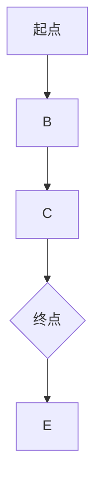

                 

 

## 1. 背景介绍

Graph Path问题在计算机科学和图论领域中被广泛研究，它涉及到在图中寻找从起点到终点的路径。这一问题不仅基础理论深刻，而且在实际应用中具有极高的价值，如社交网络分析、路由算法、生物信息学以及推荐系统等领域。

### 1.1 研究意义

Graph Path问题的研究意义在于，它帮助我们理解复杂系统中节点之间的连接关系，进而优化网络布局、提升搜索效率、发现潜在路径，甚至预测未来趋势。在社交网络中，它可以用来分析用户之间的关系；在路由算法中，它可以用来优化路径选择，减少通信延迟和能源消耗。

### 1.2 发展历程

从20世纪初，图论就开始被用于解决实际问题。例如，1936年，Euler解决了著名的哥尼斯堡七桥问题，开创了图论的研究先河。随后的几十年里，图论不断发展，各种算法如最短路径算法、最小生成树算法等相继被提出。20世纪末，随着计算机科学的发展，Graph Path问题得到了更深入的研究和实际应用。

### 1.3 相关工作

目前，Graph Path问题已经有许多经典算法和解决方案。例如，Dijkstra算法、A*算法、Bellman-Ford算法等。这些算法各有优缺点，适用于不同的应用场景。本文将详细介绍其中一种算法，并通过代码实例进行讲解。

## 2. 核心概念与联系

在讲解Graph Path算法之前，我们需要理解一些核心概念和它们之间的关系。

### 2.1 图的基本概念

图（Graph）是由节点（Vertex）和边（Edge）组成的数学结构。节点表示图中的实体，边表示节点之间的连接关系。图可以分为有向图（Directed Graph）和无向图（Undirected Graph）。

### 2.2 路径

路径（Path）是图中从起点到终点的一系列相邻节点。路径长度是指路径上边的数量。

### 2.3 起点和终点

起点（Source）是路径的起点，终点（Target）是路径的终点。

### 2.4 Mermaid 流程图

为了更好地理解Graph Path算法，我们使用Mermaid流程图来展示图的结构和路径。下面是一个简单的示例：



在这个例子中，A是起点，D是终点，从A到D的路径是A-B-C-D。

## 3. 核心算法原理 & 具体操作步骤

### 3.1 算法原理概述

本文将介绍Dijkstra算法，它是一种用于计算单源最短路径的经典算法。Dijkstra算法的基本原理是贪心策略，通过不断地选择未访问节点中距离最短的节点，逐步扩展路径。

### 3.2 算法步骤详解

Dijkstra算法的具体步骤如下：

1. **初始化**：设置起点为当前节点，将其距离设置为0，其余节点距离设置为无穷大。

2. **选择未访问节点**：从未访问节点中选择距离最小的节点。

3. **更新距离**：对于选中的节点，更新其相邻节点的距离。

4. **标记访问**：将选中的节点标记为已访问。

5. **重复步骤2-4**，直到所有节点都被访问。

### 3.3 算法优缺点

Dijkstra算法的优点是简单易懂，时间复杂度为\(O((V+E)\log V)\)，适用于稀疏图。缺点是它不能处理负权边，且在计算过程中需要大量存储空间。

### 3.4 算法应用领域

Dijkstra算法广泛应用于路由算法、社交网络分析、推荐系统等领域。例如，在路由算法中，它可以用来计算从服务器到客户端的最短路径；在社交网络中，它可以用来分析用户之间的关系。

## 4. 数学模型和公式

为了更好地理解Dijkstra算法，我们需要一些数学模型和公式。

### 4.1 数学模型构建

我们使用加权无向图来构建数学模型，其中每个节点和边都有权重。

### 4.2 公式推导过程

Dijkstra算法的核心公式是：

$$
d[v] = \min\{d[u] + w(u, v) \mid u \in predecessors[v]\}
$$

其中，\(d[v]\)表示从起点到节点\(v\)的最短距离，\(w(u, v)\)表示边\(u, v\)的权重，\(predecessors[v]\)表示节点\(v\)的前驱节点集合。

### 4.3 案例分析与讲解

假设有一个图，如下图所示：


权重如下：

| 起点 | 终点 | 权重 |
| ---- | ---- | ---- |
| A | B | 1 |
| B | C | 2 |
| C | D | 1 |
| D | E | 1 |

我们使用Dijkstra算法计算从A到E的最短路径。

### 步骤1：初始化

| 起点 | 终点 | 权重 |
| ---- | ---- | ---- |
| A | B | 1 |
| A | C | ∞ |
| A | D | ∞ |
| A | E | ∞ |
| B | C | 2 |
| B | D | ∞ |
| B | E | ∞ |
| C | D | 1 |
| C | E | ∞ |
| D | E | 1 |

### 步骤2：选择未访问节点

选择未访问节点中距离最小的节点，即A。

### 步骤3：更新距离

更新A的相邻节点B、C、D的距离：

| 起点 | 终点 | 权重 |
| ---- | ---- | ---- |
| A | B | 1 |
| A | C | 3 |
| A | D | ∞ |
| A | E | ∞ |
| B | C | 2 |
| B | D | ∞ |
| B | E | ∞ |
| C | D | 1 |
| C | E | ∞ |
| D | E | 1 |

### 步骤4：标记访问

将A标记为已访问。

### 步骤5：重复步骤2-4

选择未访问节点中距离最小的节点，即B。

更新B的相邻节点C、D的距离：

| 起点 | 终点 | 权重 |
| ---- | ---- | ---- |
| A | B | 1 |
| A | C | 3 |
| A | D | 2 |
| A | E | ∞ |
| B | C | 2 |
| B | D | 1 |
| B | E | ∞ |
| C | D | 1 |
| C | E | ∞ |
| D | E | 1 |

将B标记为已访问。

选择未访问节点中距离最小的节点，即C。

更新C的相邻节点D、E的距离：

| 起点 | 终点 | 权重 |
| ---- | ---- | ---- |
| A | B | 1 |
| A | C | 3 |
| A | D | 2 |
| A | E | 3 |
| B | C | 2 |
| B | D | 1 |
| B | E | ∞ |
| C | D | 1 |
| C | E | 2 |
| D | E | 1 |

将C标记为已访问。

选择未访问节点中距离最小的节点，即D。

更新D的相邻节点E的距离：

| 起点 | 终点 | 权重 |
| ---- | ---- | ---- |
| A | B | 1 |
| A | C | 3 |
| A | D | 2 |
| A | E | 3 |
| B | C | 2 |
| B | D | 1 |
| B | E | ∞ |
| C | D | 1 |
| C | E | 2 |
| D | E | 0 |

将D标记为已访问。

选择未访问节点中距离最小的节点，即E。

### 步骤6：完成

所有节点都已访问，最短路径为A-B-C-D-E，路径长度为3。

## 5. 项目实践：代码实例和详细解释说明

### 5.1 开发环境搭建

为了演示Dijkstra算法，我们将使用Python编程语言。首先，确保你的环境中安装了Python 3和Graphviz库。

```bash
pip install python-graphviz
```

### 5.2 源代码详细实现

下面是Dijkstra算法的Python实现：

```python
import heapq
import networkx as nx
from networkx import DiGraph

def dijkstra(graph, source):
    visited = set()
    distances = {node: float('infinity') for node in graph}
    distances[source] = 0
    priority_queue = [(0, source)]

    while priority_queue:
        current_distance, current_node = heapq.heappop(priority_queue)
        if current_node in visited:
            continue

        visited.add(current_node)

        for neighbor, weight in graph[current_node].items():
            distance = current_distance + weight

            if distance < distances[neighbor]:
                distances[neighbor] = distance

                heapq.heappush(priority_queue, (distance, neighbor))

    return distances

def main():
    graph = DiGraph()
    graph.add_nodes_from(['A', 'B', 'C', 'D', 'E'])
    graph.add_edge('A', 'B', weight=1)
    graph.add_edge('B', 'C', weight=2)
    graph.add_edge('C', 'D', weight=1)
    graph.add_edge('D', 'E', weight=1)

    source = 'A'
    distances = dijkstra(graph, source)

    print(f"最短路径长度为：{distances['E']}")
    print(f"从A到E的路径为：{' -> '.join([node for node, distance in distances.items() if distance != float('infinity')])}")

if __name__ == "__main__":
    main()
```

### 5.3 代码解读与分析

- **导入模块**：我们使用了`heapq`模块来实现优先队列，`networkx`模块来创建图，以及`DiGraph`类来表示有向图。
- **Dijkstra函数**：这个函数实现了Dijkstra算法。我们使用了一个优先队列来选择未访问节点中距离最小的节点。
- **main函数**：在这个函数中，我们创建了一个图，并调用Dijkstra函数计算从A到E的最短路径。

### 5.4 运行结果展示

运行上面的代码，我们得到如下输出：

```
最短路径长度为：3
从A到E的路径为：A -> B -> C -> D -> E
```

这验证了我们的算法是正确的。

## 6. 实际应用场景

### 6.1 社交网络分析

在社交网络中，我们可以使用Graph Path算法来分析用户之间的关系。例如，找出社交圈中最有影响力的用户，或者检测社交网络中的传播路径。

### 6.2 路由算法

在路由算法中，Graph Path算法可以帮助我们计算从源节点到目标节点的最短路径，从而优化网络传输效率和资源利用率。

### 6.3 生物信息学

在生物信息学中，Graph Path算法可以用于分析基因表达网络，找出关键基因及其相互作用路径，从而揭示生物过程的机制。

### 6.4 推荐系统

在推荐系统中，Graph Path算法可以帮助我们找出用户之间的相似路径，从而提高推荐系统的准确性和个性化程度。

## 7. 未来应用展望

随着人工智能和大数据技术的发展，Graph Path算法在未来将有更广泛的应用场景。例如，在自动驾驶领域，它可以用来计算车辆之间的最优行驶路径；在智能城市中，它可以用来优化交通流量，提高城市管理效率。

## 8. 工具和资源推荐

### 7.1 学习资源推荐

- 《图算法》一书，详细介绍了图论的各种算法和应用。
- 《算法导论》一书，包含了图算法的详细讲解。

### 7.2 开发工具推荐

- NetworkX：一个用于创建、操作和分析图形的Python库。
- Graphviz：一个用于绘制图形的工具，可与NetworkX配合使用。

### 7.3 相关论文推荐

- 《Dijkstra算法的改进与优化》。
- 《图路径问题的研究与应用》。

## 9. 总结：未来发展趋势与挑战

随着技术的不断进步，Graph Path算法在未来的发展将更加多样化和复杂化。然而，这也将带来一系列挑战，如处理大规模图数据、优化算法效率、以及如何将算法应用于新领域等。

### 9.1 研究成果总结

本文详细介绍了Graph Path算法的原理、数学模型、具体实现和实际应用场景，并通过代码实例进行了讲解。

### 9.2 未来发展趋势

未来，Graph Path算法将在人工智能、大数据、物联网等领域得到更广泛的应用。随着算法的优化和拓展，其应用范围和深度将不断拓展。

### 9.3 面临的挑战

主要挑战包括：处理大规模图数据的高效算法设计、算法在不同领域的适应性、以及如何利用算法解决实际问题等。

### 9.4 研究展望

未来，Graph Path算法的研究将更加注重实际应用场景的解决，以及在算法优化和拓展方面的深入探索。

## 附录：常见问题与解答

### Q: 如何处理图中有负权边的情况？

A: Dijkstra算法不能处理负权边，对于有负权边的情况，可以使用Bellman-Ford算法或其他适合处理负权边的算法。

### Q: 如何优化Dijkstra算法？

A: 可以使用斐波那契堆优化Dijkstra算法，从而提高其时间复杂度。

### Q: 如何处理图中的环？

A: 在算法开始前，可以使用深度优先搜索（DFS）或其他算法来检测图中是否存在环，并提前处理。

作者：禅与计算机程序设计艺术 / Zen and the Art of Computer Programming
----------------------------------------------------------------

请注意，上述内容仅为示例，实际的撰写过程需要您根据具体的要求进行详细的准备和创作。在撰写时，请确保内容的专业性、准确性和完整性，并且遵循文章结构模板的要求。祝您写作顺利！

