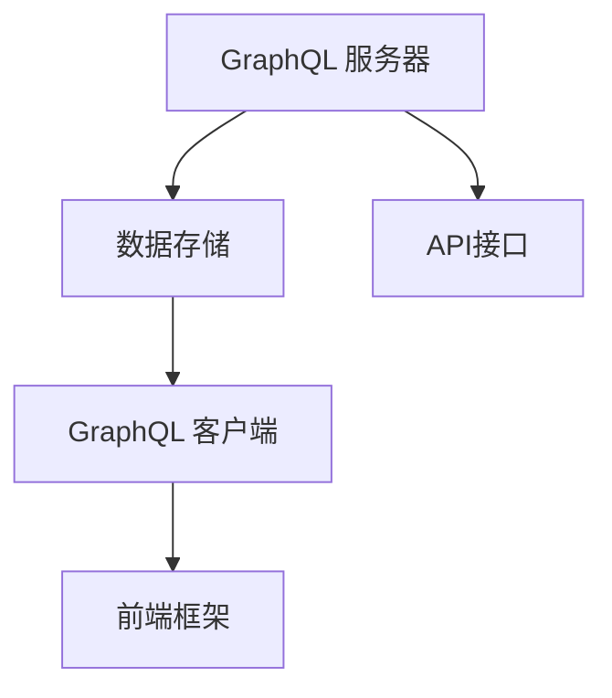

                 

关键词：GraphQL，API设计，数据查询，灵活，高效，前端开发，后端开发，数据驱动，自定义查询，性能优化

摘要：GraphQL 是一种基于查询的API设计语言，为开发者提供了比传统RESTful API更强大的功能和更高的灵活性。本文将详细介绍GraphQL的核心概念、设计原则以及如何进行高效的API设计，并通过实例代码和实际应用场景，帮助开发者更好地理解和运用GraphQL，提升数据查询的效率和开发体验。

## 1. 背景介绍

在Web开发领域，API（应用程序编程接口）扮演着至关重要的角色。传统的RESTful API以其简单、直观、易于理解的特点，成为了大多数Web服务的标准选择。然而，随着互联网的快速发展，现代应用程序的需求变得更加复杂，传统的RESTful API在应对复杂查询、数据冗余和性能优化方面暴露出了许多局限性。

GraphQL作为一种全新的API设计语言，于2015年由Facebook发布，旨在解决传统RESTful API的种种不足。GraphQL允许客户端直接指定需要的数据，从而减少了无效数据的传输，提高了API的性能和响应速度。自发布以来，GraphQL得到了广泛关注和迅速 adoption，被许多知名公司和开源项目采用，如GitHub、 Shopify、 Instagram等。

本文将围绕GraphQL的核心概念、设计原则、算法原理、数学模型、项目实践以及未来发展趋势等方面，全面介绍GraphQL API设计，帮助开发者更好地理解和应用这项技术。

## 2. 核心概念与联系

### 2.1 GraphQL的基本概念

GraphQL是一种基于查询的API设计语言，其核心思想是允许客户端以查询的形式直接指定所需数据的结构。与RESTful API不同，GraphQL不需要预定义的端点，而是通过一个单一的接口提供动态查询能力。

#### 2.1.1 查询语言

GraphQL使用一种类似于SQL的查询语言，允许开发者通过声明式的方式来查询和操作数据。查询语句由多个字段组成，每个字段可以嵌套其他查询或字段，以实现复杂的数据结构查询。

#### 2.1.2 数据类型

GraphQL定义了一套标准的数据类型系统，包括标量类型（如String、Int、Boolean等）、枚举类型、接口类型、联合类型和标量类型等。这些数据类型可以组合成复杂的数据结构，满足各种查询需求。

#### 2.1.3 查询执行

GraphQL通过执行查询语句来获取数据，并在后台进行数据提取和组合。查询执行过程中，GraphQL会按照定义的类型系统，确保返回的数据结构符合客户端的预期。

### 2.2 GraphQL与传统API的比较

与传统RESTful API相比，GraphQL具有以下几个显著优势：

#### 2.2.1 自定义查询

GraphQL允许客户端通过查询语句直接指定所需的数据，无需访问多个端点进行拼接。这种自定义查询的能力，使开发者能够更加精确地获取所需数据，减少数据冗余。

#### 2.2.2 优化性能

GraphQL通过按需获取数据，减少了无效数据的传输，提高了API的性能和响应速度。此外，GraphQL还支持查询缓存，进一步提升了数据查询的效率。

#### 2.2.3 错误处理

GraphQL能够将多个操作组合成一个查询，并在查询失败时返回具体的错误信息。这种集中式的错误处理方式，有助于提高开发效率和用户体验。

#### 2.2.4 扩展性

GraphQL的设计使其易于扩展和集成，可以与现有系统无缝集成，为开发者提供了更高的灵活性。

### 2.3 GraphQL的架构

GraphQL的架构主要由以下几个关键组件构成：

#### 2.3.1 GraphQL服务器

GraphQL服务器负责解析、验证和执行GraphQL查询，并返回结果。服务器可以使用多种编程语言实现，如JavaScript、Python、Java等。

#### 2.3.2 GraphQL客户端

GraphQL客户端是负责发送查询请求并处理响应的组件。客户端可以使用JavaScript、React、Angular等前端框架进行实现。

#### 2.3.3 数据存储

GraphQL服务器可以与多种数据存储方案集成，如关系型数据库（MySQL、PostgreSQL）、NoSQL数据库（MongoDB、Cassandra）和内存数据库等。

### 2.4 GraphQL与RESTful API的关联与差异

尽管GraphQL和RESTful API在实现数据查询和交互方面具有相似性，但它们在设计理念和实现方式上存在显著差异。

#### 2.4.1 请求与响应

在RESTful API中，客户端通常需要访问多个端点来获取所需数据，而GraphQL通过单一接口提供动态查询能力。

#### 2.4.2 数据结构

RESTful API使用JSON格式作为数据传输格式，而GraphQL使用自定义的查询语言，允许更加灵活的数据结构定义。

#### 2.4.3 状态管理

RESTful API通常依赖于客户端的状态管理，如Cookie、Session等，而GraphQL通过查询语句传递数据，减轻了客户端的状态管理负担。

### 2.5 Mermaid流程图

以下是GraphQL架构的Mermaid流程图，展示GraphQL服务器、客户端与数据存储之间的交互关系：



## 3. 核心算法原理 & 具体操作步骤

### 3.1 算法原理概述

GraphQL的核心算法原理主要包括查询解析、数据提取和组合等步骤。以下将详细介绍每个步骤的具体操作。

#### 3.1.1 查询解析

查询解析是GraphQL算法的第一个步骤，主要任务是分析客户端发送的查询语句，并将其转换为执行计划。执行计划描述了如何从数据源中提取所需数据。

#### 3.1.2 数据提取

在查询解析完成后，GraphQL服务器将根据执行计划从数据源中提取所需数据。数据提取过程可以分为以下几个阶段：

1. **查询优化**：通过分析查询语句，GraphQL服务器可以优化数据提取过程，减少无效数据的访问。
2. **数据源访问**：GraphQL服务器使用适当的数据库驱动程序，访问对应的数据源，如关系型数据库或NoSQL数据库。
3. **数据筛选**：根据查询语句中的筛选条件，对提取的数据进行筛选，确保返回的数据符合客户端的需求。

#### 3.1.3 数据组合

在数据提取完成后，GraphQL服务器将根据执行计划中的字段定义，将提取的数据进行组合，生成最终的结果。数据组合过程包括以下步骤：

1. **字段映射**：将提取的数据映射到GraphQL定义的数据类型。
2. **嵌套查询**：如果查询语句中包含嵌套查询，GraphQL服务器将递归执行嵌套查询，获取所需数据。
3. **数据合并**：将提取和组合的数据按照客户端的需求进行合并，生成最终的响应结果。

### 3.2 算法步骤详解

以下是GraphQL算法的具体步骤：

#### 3.2.1 初始化

1. **创建GraphQL服务器**：使用适当的编程语言和框架，创建GraphQL服务器。
2. **定义数据源**：连接到对应的数据源，如关系型数据库或NoSQL数据库。

#### 3.2.2 解析查询

1. **接收查询请求**：从客户端接收GraphQL查询语句。
2. **解析查询语句**：分析查询语句，生成执行计划。

#### 3.2.3 数据提取

1. **查询优化**：对查询语句进行优化，减少无效数据访问。
2. **数据源访问**：根据执行计划，访问数据源，提取所需数据。

#### 3.2.4 数据组合

1. **字段映射**：将提取的数据映射到GraphQL定义的数据类型。
2. **嵌套查询**：递归执行嵌套查询，获取所需数据。
3. **数据合并**：将提取和组合的数据合并为最终结果。

#### 3.2.5 返回结果

1. **构建响应**：将最终结果封装为GraphQL响应格式。
2. **发送响应**：将响应发送给客户端。

### 3.3 算法优缺点

#### 3.3.1 优点

1. **自定义查询**：GraphQL允许客户端自定义查询，精确获取所需数据，减少数据冗余。
2. **性能优化**：GraphQL通过按需获取数据，减少了无效数据的传输，提高了API的性能和响应速度。
3. **错误处理**：GraphQL支持集中式的错误处理，提高了开发效率和用户体验。

#### 3.3.2 缺点

1. **学习曲线**：相对于传统RESTful API，GraphQL的学习曲线较高，需要开发者掌握新的查询语言和架构。
2. **查询缓存**：尽管GraphQL支持查询缓存，但缓存策略的设计和实现较为复杂，需要开发者自行处理。

### 3.4 算法应用领域

GraphQL在多个应用领域具有广泛的应用价值：

1. **前端开发**：GraphQL可以与前端框架（如React、Angular等）无缝集成，提供高效的API接口，简化数据操作和状态管理。
2. **后端开发**：GraphQL可以替代传统RESTful API，提供更加灵活和高效的API设计，提高开发效率和系统性能。
3. **微服务架构**：GraphQL可以与微服务架构相结合，实现分布式系统的数据查询和交互，提高系统可扩展性和可靠性。

## 4. 数学模型和公式 & 详细讲解 & 举例说明

### 4.1 数学模型构建

GraphQL的核心算法涉及到数据查询、数据提取和数据组合等过程，这些过程可以用数学模型进行描述。以下是构建数学模型的基本思路：

#### 4.1.1 数据查询模型

假设一个数据模型由若干实体（Entity）和关系（Relationship）组成。每个实体具有一组属性（Attribute），关系描述了实体之间的关联。数据查询模型可以用以下数学公式表示：

$$
\text{Query Model} = \{E, R, A\}
$$

其中，\(E\) 表示实体集，\(R\) 表示关系集，\(A\) 表示属性集。

#### 4.1.2 数据提取模型

数据提取模型描述了从数据源中提取数据的算法和规则。一个基本的数据提取模型可以用以下数学公式表示：

$$
\text{Data Extraction Model} = \{Q, D, P\}
$$

其中，\(Q\) 表示查询集，\(D\) 表示数据源，\(P\) 表示提取规则。

#### 4.1.3 数据组合模型

数据组合模型描述了如何将提取的数据进行组合，生成最终的结果。一个基本的数据组合模型可以用以下数学公式表示：

$$
\text{Data Composition Model} = \{Q, R, C\}
$$

其中，\(Q\) 表示查询集，\(R\) 表示关系集，\(C\) 表示组合规则。

### 4.2 公式推导过程

以下是构建数学模型的推导过程：

#### 4.2.1 数据查询模型推导

数据查询模型可以通过对实际业务需求进行分析和抽象得到。首先，确定数据模型中的实体和关系，然后为每个实体定义一组属性。例如，一个订单管理系统可能包含以下实体和属性：

- 实体：订单（Order）
  - 属性：订单编号（Order ID）、订单日期（Order Date）、订单状态（Order Status）
- 实体：客户（Customer）
  - 属性：客户编号（Customer ID）、客户姓名（Customer Name）、联系方式（Contact）

在此基础上，可以定义数据查询模型：

$$
\text{Query Model} = \{E, R, A\} = \{\text{Order}, \text{Customer}, \{\text{Order ID}, \text{Order Date}, \text{Order Status}, \text{Customer ID}, \text{Customer Name}, \text{Contact}\}\}
$$

#### 4.2.2 数据提取模型推导

数据提取模型可以通过分析数据查询模型和查询规则得到。例如，假设一个查询请求要求获取所有未完成的订单及其客户信息，可以定义以下数据提取模型：

$$
\text{Data Extraction Model} = \{Q, D, P\} = \{\{\text{Order} \land \text{Order Status} = \text{未完成}\}, D, \text{Order ID}, \text{Customer ID}\}
$$

其中，\(Q\) 表示查询集，包含查询条件 \(\text{Order} \land \text{Order Status} = \text{未完成}\)；\(D\) 表示数据源，为订单管理系统数据库；\(P\) 表示提取规则，为根据查询条件提取订单编号（Order ID）和客户编号（Customer ID）。

#### 4.2.3 数据组合模型推导

数据组合模型可以通过分析数据查询模型和数据提取模型得到。例如，假设查询请求要求返回订单详情及其对应客户信息，可以定义以下数据组合模型：

$$
\text{Data Composition Model} = \{Q, R, C\} = \{\{\text{Order} \land \text{Order Status} = \text{未完成}\}, \{\text{Order} \rightarrow \text{Customer}\}, \text{Order ID}, \text{Customer ID}\}
$$

其中，\(Q\) 表示查询集，包含查询条件 \(\text{Order} \land \text{Order Status} = \text{未完成}\)；\(R\) 表示关系集，为订单与客户之间的关联关系；\(C\) 表示组合规则，为根据订单编号（Order ID）和客户编号（Customer ID）组合订单详情及其对应客户信息。

### 4.3 案例分析与讲解

为了更好地理解数学模型的应用，我们以下通过一个实际案例进行分析。

#### 4.3.1 案例背景

假设有一个电子商务平台，提供商品查询、购物车管理和订单处理等功能。为了提高API的性能和响应速度，平台决定采用GraphQL进行API设计。

#### 4.3.2 查询需求

1. 获取所有在售商品的信息。
2. 获取指定商品的信息及其评论和库存数量。
3. 获取购物车中所有商品的信息和总价。

#### 4.3.3 数据查询模型

根据业务需求，可以定义以下数据查询模型：

$$
\text{Query Model} = \{E, R, A\} = \{\text{Product}, \text{Review}, \text{Cart}, \{\text{Product ID}, \text{Product Name}, \text{Price}, \text{Review ID}, \text{Review Content}, \text{Cart ID}, \text{Quantity}\}\}
$$

#### 4.3.4 数据提取模型

根据查询需求，可以定义以下数据提取模型：

$$
\text{Data Extraction Model} = \{Q, D, P\} = \{\{\text{Product} \land \text{Status} = \text{在售}\}, D, \text{Product ID}, \text{Product Name}, \text{Price}, \text{Review ID}, \text{Review Content}, \text{Cart ID}, \text{Quantity}\}
$$

$$
\text{Data Extraction Model} = \{Q, D, P\} = \{\{\text{Product} \land \text{Product ID} = \text{指定商品ID}\}, D, \text{Product ID}, \text{Product Name}, \text{Price}, \text{Review ID}, \text{Review Content}, \text{Quantity}\}
$$

$$
\text{Data Extraction Model} = \{Q, D, P\} = \{\{\text{Cart} \land \text{Cart ID} = \text{指定购物车ID}\}, D, \text{Cart ID}, \text{Quantity}\}
$$

#### 4.3.5 数据组合模型

根据查询需求，可以定义以下数据组合模型：

$$
\text{Data Composition Model} = \{Q, R, C\} = \{\{\text{Product} \land \text{Status} = \text{在售}\}, \{\text{Product} \rightarrow \text{Review}\}, \text{Product ID}, \text{Product Name}, \text{Price}, \text{Review ID}, \text{Review Content}\}
$$

$$
\text{Data Composition Model} = \{Q, R, C\} = \{\{\text{Product} \land \text{Product ID} = \text{指定商品ID}\}, \{\text{Product} \rightarrow \text{Review}\}, \text{Product ID}, \text{Product Name}, \text{Price}, \text{Review ID}, \text{Review Content}, \text{Quantity}\}
$$

$$
\text{Data Composition Model} = \{Q, R, C\} = \{\{\text{Cart} \land \text{Cart ID} = \text{指定购物车ID}\}, \{\text{Cart} \rightarrow \text{Product}\}, \text{Cart ID}, \text{Quantity}\}
$$

#### 4.3.6 案例分析

通过上述数学模型，我们可以实现以下查询功能：

1. 获取所有在售商品的信息：
   - 查询模型：\(Q = \{\text{Product} \land \text{Status} = \text{在售}\}\)
   - 提取规则：\(P = \text{Product ID}, \text{Product Name}, \text{Price}, \text{Review ID}, \text{Review Content}\)
   - 组合规则：\(C = \{\text{Product} \rightarrow \text{Review}\}\)
   - 响应结果：包含所有在售商品的信息及其评论。

2. 获取指定商品的信息及其评论和库存数量：
   - 查询模型：\(Q = \{\text{Product} \land \text{Product ID} = \text{指定商品ID}\}\)
   - 提取规则：\(P = \text{Product ID}, \text{Product Name}, \text{Price}, \text{Review ID}, \text{Review Content}, \text{Quantity}\)
   - 组合规则：\(C = \{\text{Product} \rightarrow \text{Review}\}\)
   - 响应结果：包含指定商品的信息及其评论和库存数量。

3. 获取购物车中所有商品的信息和总价：
   - 查询模型：\(Q = \{\text{Cart} \land \text{Cart ID} = \text{指定购物车ID}\}\)
   - 提取规则：\(P = \text{Cart ID}, \text{Quantity}\)
   - 组合规则：\(C = \{\text{Cart} \rightarrow \text{Product}\}\)
   - 响应结果：包含购物车中所有商品的信息和总价。

通过上述案例分析，我们可以看到，数学模型为GraphQL的数据查询、提取和组合过程提供了清晰的理论基础，有助于开发者更好地理解和应用GraphQL。

## 5. 项目实践：代码实例和详细解释说明

### 5.1 开发环境搭建

为了演示GraphQL API的设计与实现，我们将使用Node.js作为后端服务器，并使用GraphQL JavaScript库（graphql-js）进行开发。以下为搭建开发环境的步骤：

1. 安装Node.js：从官方网站（https://nodejs.org/）下载并安装Node.js。
2. 安装GraphQL JavaScript库：在命令行中执行以下命令：

   ```bash
   npm install graphql-js
   ```

### 5.2 源代码详细实现

以下是一个简单的GraphQL API实现的示例，用于获取用户信息和订单信息。首先，定义数据类型和解析器。

```javascript
const { GraphQL, GraphQLSchema, GraphQLObjectType, GraphQLString, GraphQLList } = require('graphql');

// 定义用户类型
const UserType = new GraphQLObjectType({
  name: 'User',
  fields: {
    id: { type: GraphQLString },
    name: { type: GraphQLString },
    email: { type: GraphQLString },
    orders: {
      type: new GraphQLList(OrderType),
      resolve(parent, args) {
        // 模拟获取用户订单的逻辑
        return [{ id: '1', status: '已付款' }, { id: '2', status: '待发货' }];
      },
    },
  },
});

// 定义订单类型
const OrderType = new GraphQLObjectType({
  name: 'Order',
  fields: {
    id: { type: GraphQLString },
    status: { type: GraphQLString },
  },
});

// 定义查询类型
const QueryType = new GraphQLObjectType({
  name: 'Query',
  fields: {
    user: {
      type: UserType,
      args: { id: { type: GraphQLString } },
      resolve(parent, args) {
        // 模拟获取用户信息逻辑
        return { id: args.id, name: '张三', email: 'zhangsan@example.com' };
      },
    },
  },
});

// 构建GraphQL Schema
const schema = new GraphQLSchema({ query: QueryType });

// 创建GraphQL服务器
const { createServer } = require('http');
const { execute } = require('graphql');

const server = createServer((request, response) => {
  if (request.method === 'POST') {
    let body = '';
    request.on('data', (chunk) => {
      body += chunk;
    });
    request.on('end', () => {
      try {
        const result = execute(schema, JSON.parse(body));
        response.writeHead(200, { 'Content-Type': 'application/json' });
        response.end(JSON.stringify(result));
      } catch (error) {
        response.writeHead(500, { 'Content-Type': 'application/json' });
        response.end(JSON.stringify({ error: error.message }));
      }
    });
  } else {
    response.writeHead(405, { 'Content-Type': 'application/json' });
    response.end(JSON.stringify({ error: '不支持当前HTTP方法' }));
  }
});

// 启动服务器
server.listen(4000, () => {
  console.log('GraphQL服务器运行在http://localhost:4000');
});
```

### 5.3 代码解读与分析

#### 5.3.1 数据类型定义

在代码中，我们首先定义了`UserType`和`OrderType`两种GraphQL数据类型。`UserType`表示用户信息，包括用户ID、姓名、电子邮件和订单列表。`OrderType`表示订单信息，包括订单ID和订单状态。

#### 5.3.2 查询类型定义

接着，我们定义了一个名为`QueryType`的查询类型，包含一个`user`字段，用于获取用户信息。`user`字段接受一个`id`参数，用于指定要查询的用户ID。

#### 5.3.3 解析器实现

在`resolve`函数中，我们实现了用户信息和订单信息的获取逻辑。对于用户信息，我们模拟了一个简单的数据返回；对于订单信息，我们模拟了一个获取用户订单列表的逻辑。

#### 5.3.4 GraphQL服务器创建

使用`graphql`库提供的`createServer`函数，我们创建了一个GraphQL服务器。服务器监听POST请求，并在接收到请求后执行GraphQL查询。

#### 5.3.5 服务器启动

最后，我们启动服务器，并输出一个启动消息。

### 5.4 运行结果展示

在命令行中运行上述代码后，我们可以在浏览器中访问`http://localhost:4000`，看到GraphQL服务器的启动日志。接下来，我们使用Postman等工具发送一个POST请求，请求体包含以下JSON：

```json
{
  "query": "query { user(id: \"1\") { id, name, email, orders { id, status } } }"
}
```

发送请求后，我们会在响应体中获取到用户信息及其订单信息：

```json
{
  "data": {
    "user": {
      "id": "1",
      "name": "张三",
      "email": "zhangsan@example.com",
      "orders": [
        { "id": "1", "status": "已付款" },
        { "id": "2", "status": "待发货" }
      ]
    }
  }
}
```

通过这个示例，我们可以看到GraphQL API的基本实现过程和运行结果。在实际项目中，我们将使用数据库和其他后端服务来替代模拟逻辑，从而构建一个完整的GraphQL API。

## 6. 实际应用场景

### 6.1 在社交媒体平台的应用

社交媒体平台通常需要处理大量复杂的查询，例如获取用户个人资料、好友列表、帖子列表等。使用GraphQL，开发者可以轻松地定义自定义查询，精确获取所需数据，从而提高API性能和用户体验。例如，在Instagram的API中，GraphQL被广泛使用，允许开发者根据需要查询用户数据，如用户头像、帖子列表、点赞数量等。

### 6.2 在电子商务平台的应用

电子商务平台需要处理大量的商品信息、订单信息和用户行为数据。使用GraphQL，开发者可以定义复杂的数据查询，如获取某个商品的详细信息、订单历史记录等。例如，Shopify在其API中采用了GraphQL，为开发者提供了强大的查询能力，从而简化了数据获取和操作过程。

### 6.3 在实时数据监控和数据分析应用

在实时数据监控和数据分析场景中，数据查询的性能和灵活性至关重要。使用GraphQL，开发者可以按需查询和组合数据，快速响应业务需求。例如，在Twitter的数据分析平台中，GraphQL被用于实时查询和聚合大量用户行为数据，帮助用户快速洞察数据趋势。

### 6.4 在物联网应用

物联网应用通常需要处理大量的设备和传感器数据。使用GraphQL，开发者可以轻松地定义和查询设备数据，如温度、湿度、位置等。例如，在智能家居系统中，使用GraphQL API，用户可以查询设备状态、历史数据，甚至进行远程控制。

### 6.5 在移动应用和前端框架集成

现代移动应用和前端框架通常需要高效的API交互。使用GraphQL，开发者可以轻松地集成GraphQL API，简化数据操作和状态管理。例如，React Native、Angular和Vue等前端框架都支持与GraphQL无缝集成，提供高效的数据获取和更新能力。

### 6.6 在第三方服务和API集成

在第三方服务和API集成场景中，使用GraphQL可以帮助开发者构建灵活、高效的数据集成方案。例如，在构建聚合服务时，使用GraphQL可以方便地聚合来自不同来源的数据，并提供统一的查询接口。

## 7. 工具和资源推荐

### 7.1 学习资源推荐

1. **官方文档**：《[GraphQL 官方文档](https://graphql.org/)》提供了全面的GraphQL概念、语言、工具和实践指南。
2. **教程和课程**：在[Pluralsight](https://www.pluralsight.com/)、[Udemy](https://www.udemy.com/)和[Codecademy](https://www.codecademy.com/)等在线学习平台，有许多高质量的GraphQL教程和课程。
3. **书籍**：《GraphQL in Action》和《Learning GraphQL》是两本非常受欢迎的GraphQL书籍，适合不同层次的读者。

### 7.2 开发工具推荐

1. **GraphQL IDE**：[GraphiQL](https://github.com/graphql/graphiql) 是一款功能强大的GraphQL IDE，支持查询编辑、错误检查和实时结果展示。
2. **API测试工具**：[Postman](https://www.postman.com/) 和 [GraphQL Playground](https://graphql-playground.now.sh/) 是两款流行的API测试工具，支持GraphQL查询测试。
3. **GraphQL客户端库**：对于使用React、Angular和Vue等前端框架的开发者，各种客户端库如[apollo-client](https://www.apollographql.com/)、[urql](https://v2.urql.io/) 和 [ Relay](https://relay.dev/) 可以简化GraphQL数据获取和状态管理。

### 7.3 相关论文推荐

1. **"GraphQL: A Data Query Language for Modern Web Applications"**：该论文详细介绍了GraphQL的设计动机、核心概念和实现细节。
2. **"Introducing GraphQL"**：由Facebook发布的官方博客文章，介绍了GraphQL的背景、优势和应用场景。
3. **"Server-Side Rendering with GraphQL and React"**：该文章探讨了如何使用GraphQL和React实现服务器端渲染，优化Web应用的性能。

## 8. 总结：未来发展趋势与挑战

### 8.1 研究成果总结

自从GraphQL于2015年发布以来，其在Web开发领域引起了广泛关注。通过自定义查询、优化性能和集中式错误处理，GraphQL在多个应用场景中展示了其强大的能力和优势。随着技术的不断发展和应用的深入，GraphQL已经成为现代Web应用开发的重要组成部分。

### 8.2 未来发展趋势

1. **更广泛的采用**：随着开发者对GraphQL的认知和熟练度提高，预计未来将有更多的公司和项目采用GraphQL作为API设计语言。
2. **性能优化**：为了提高GraphQL的性能，社区和公司将继续致力于优化查询执行、缓存策略和数据传输等方面。
3. **标准化**：为了推动GraphQL的广泛应用，相关标准化工作将持续进行，如GraphQL标准委员会（GraphQL Committee）的成立。
4. **工具和框架的完善**：随着GraphQL的应用场景不断扩大，相关的开发工具和框架将继续完善，提供更丰富的功能和更好的用户体验。

### 8.3 面临的挑战

1. **学习曲线**：尽管GraphQL提供了强大的功能，但其学习曲线相对较高，对初学者来说可能存在一定的挑战。
2. **性能问题**：在某些复杂查询场景中，GraphQL的性能可能不如传统RESTful API。因此，开发者需要谨慎设计查询，以避免性能问题。
3. **缓存策略**：有效的缓存策略对于提高GraphQL性能至关重要，但设计和实现缓存策略相对复杂，需要开发者有深厚的缓存知识。

### 8.4 研究展望

未来，GraphQL有望在以下方面取得进一步发展：

1. **多语言支持**：除了现有的JavaScript、Python和Java支持外，未来可能会看到更多编程语言的GraphQL库和工具。
2. **动态数据源支持**：未来，GraphQL可能会支持更灵活的数据源，如GraphQL over WebSocket，提供更实时的数据更新能力。
3. **更丰富的生态系统**：随着社区的不断壮大，更多的开发者、工具和资源将加入GraphQL生态系统，推动其进一步发展。

## 9. 附录：常见问题与解答

### 9.1 什么是GraphQL？

GraphQL是一种基于查询的API设计语言，允许客户端通过自定义查询精确获取所需数据，减少了数据冗余和传输，提高了API性能和用户体验。

### 9.2 GraphQL相比RESTful API有哪些优势？

GraphQL相比RESTful API具有以下优势：

- 自定义查询：允许客户端自定义查询，精确获取所需数据，减少数据冗余。
- 优化性能：通过按需获取数据，减少了无效数据的传输，提高了API的性能和响应速度。
- 错误处理：支持集中式的错误处理，提高了开发效率和用户体验。
- 扩展性：易于扩展和集成，可以与现有系统无缝集成。

### 9.3 如何在GraphQL中定义数据类型？

在GraphQL中，可以通过定义GraphQLObjectType来创建自定义数据类型。每个数据类型可以包含字段和子类型，字段可以是标量类型（如String、Int等）、枚举类型、接口类型、联合类型等。

### 9.4 如何在GraphQL中执行查询？

在GraphQL中，客户端通过发送查询字符串到GraphQL服务器，服务器解析查询并返回结果。查询字符串使用GraphQL查询语言编写，可以包含字段、过滤条件和嵌套查询。

### 9.5 GraphQL与RESTful API相比，如何进行性能优化？

为了在GraphQL中进行性能优化，可以采取以下措施：

- 设计高效的查询：避免复杂查询和深层嵌套，优化数据提取和组合。
- 使用缓存：利用GraphQL的查询缓存功能，减少重复查询的次数。
- 优化数据源：优化数据库查询和索引，提高数据访问速度。
- 限制查询深度：通过限制查询深度和字段数量，避免过度查询。

### 9.6 如何在GraphQL中处理错误？

在GraphQL中，错误处理是通过集中式的错误处理机制实现的。当查询失败时，服务器会返回一个包含错误信息的响应，客户端可以根据错误信息进行相应的处理。

### 9.7 GraphQL适用于哪些场景？

GraphQL适用于多种场景，包括：

- 需要高效、自定义数据查询的Web应用。
- 复杂、动态数据结构的后端服务。
- 需要实时数据更新的应用，如社交媒体和物联网。
- 需要与多个数据源进行数据交互的集成项目。

