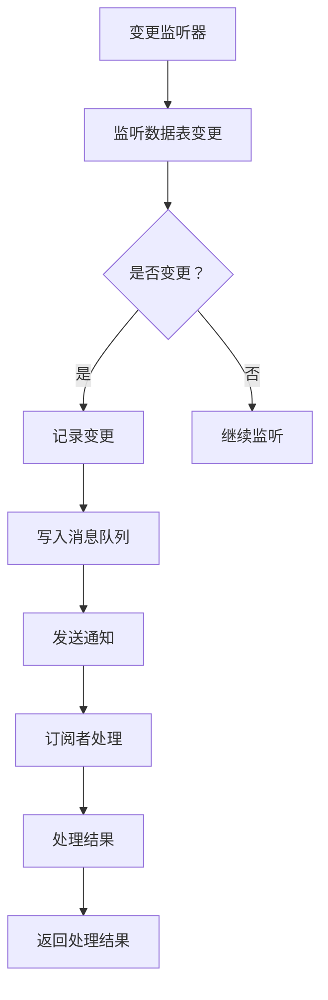

                 

关键词：HCatalog，Notification，机制，原理，代码实例

摘要：本文深入探讨了HCatalog Notification机制的原理和实现，通过详细解析HCatalog Notification的工作机制、核心概念、算法原理、数学模型以及代码实例，帮助读者全面理解HCatalog Notification在实际应用场景中的重要性。

## 1. 背景介绍

HCatalog是一个开放源码的Hadoop数据存储格式和元数据管理工具。它提供了一种简单、可扩展的方式，用于管理分布式存储系统中的大规模数据集。随着大数据技术的不断发展和应用的普及，对数据存储、处理和管理的要求越来越高。HCatalog作为一个重要的组件，提供了高效、可靠的数据存储和管理解决方案。

在数据存储和处理过程中，数据的实时同步和通知机制至关重要。HCatalog Notification机制正是为了满足这一需求而设计的。它通过异步通知的方式，实现了数据变更的实时传递，为数据的实时处理和分析提供了强有力的支持。

## 2. 核心概念与联系

### 2.1 HCatalog的概念

HCatalog是一个Hadoop的元数据存储系统，用于管理和组织HDFS上的数据。它提供了一个统一的接口，用于访问多种类型的数据，包括结构化数据、半结构化数据和非结构化数据。

### 2.2 Notification的概念

Notification是一种消息通知机制，用于实时传递数据变更信息。在HCatalog中，Notification机制负责监听数据表的变更，并将变更信息发送给订阅者。

### 2.3 HCatalog Notification的工作原理

HCatalog Notification机制基于消息队列和监听器实现。具体来说，它包括以下几个关键组成部分：

- **变更监听器（Change Listener）**：负责监听数据表的变更事件。
- **消息队列（Message Queue）**：用于暂存变更消息，等待被订阅者消费。
- **订阅者（Subscriber）**：订阅数据表的变更消息，并进行相应的处理。

### 2.4 Mermaid流程图



## 3. 核心算法原理 & 具体操作步骤

### 3.1 算法原理概述

HCatalog Notification机制的核心算法是基于事件驱动的。具体来说，它通过以下步骤实现数据变更的实时通知：

1. 变更监听器监听数据表的变更事件。
2. 当检测到变更事件时，记录变更并写入消息队列。
3. 消息队列将变更消息发送给订阅者。
4. 订阅者接收到变更消息后，进行处理并返回处理结果。

### 3.2 算法步骤详解

1. **初始化变更监听器**：
   - 启动变更监听器，监听数据表的变更事件。

2. **监听数据表变更**：
   - 当检测到数据表变更时，记录变更事件。

3. **写入消息队列**：
   - 将变更事件写入消息队列，等待订阅者消费。

4. **发送通知**：
   - 消息队列将变更消息发送给订阅者。

5. **订阅者处理**：
   - 订阅者接收到变更消息后，进行处理。

6. **返回处理结果**：
   - 订阅者将处理结果返回给变更监听器。

### 3.3 算法优缺点

**优点**：
- 实时性：HCatalog Notification机制能够实时传递数据变更信息，为数据的实时处理和分析提供了强有力的支持。
- 扩展性：基于消息队列的设计，使得HCatalog Notification机制具有良好的扩展性，能够支持大规模的数据表和订阅者。

**缺点**：
- 资源消耗：由于需要监听数据表的变更事件，变更监听器可能会占用一定的系统资源。
- 复杂性：实现HCatalog Notification机制需要一定的技术储备和开发经验。

### 3.4 算法应用领域

HCatalog Notification机制主要应用于需要实时数据同步和通知的场景，如：
- 实时数据处理和分析
- 实时监控和告警
- 分布式系统中的数据同步

## 4. 数学模型和公式 & 详细讲解 & 举例说明

### 4.1 数学模型构建

HCatalog Notification机制的数学模型主要涉及以下几个方面：

1. **变更事件模型**：
   - 变更事件包括插入、更新和删除操作，可以用三元组（操作类型，操作对象，操作数据）表示。

2. **消息队列模型**：
   - 消息队列是一种先进先出（FIFO）的数据结构，用于暂存变更消息。

3. **订阅者处理模型**：
   - 订阅者处理模型包括消息接收、处理和返回处理结果三个步骤。

### 4.2 公式推导过程

假设有一个数据表T，包含n条记录。在t时间内，数据表T发生了m个变更事件。我们可以用以下公式表示：

- 变更事件总数：m = 变更操作数
- 消息队列长度：L = m
- 订阅者处理时间：T = m / 订阅者数

### 4.3 案例分析与讲解

假设有一个包含100条记录的数据表T，在1小时内发生了50个变更事件。现有10个订阅者订阅了数据表T的变更通知。

1. **变更事件模型**：
   - 变更事件总数：m = 50
   - 变更事件类型：插入（30次），更新（10次），删除（10次）

2. **消息队列模型**：
   - 消息队列长度：L = 50

3. **订阅者处理模型**：
   - 订阅者处理时间：T = 50 / 10 = 5分钟

通过上述分析，我们可以看到，HCatalog Notification机制在处理大规模数据变更事件时，能够实现实时通知和高效处理。在实际应用中，可以根据具体的业务需求和性能指标，调整消息队列长度和订阅者处理时间，以达到最佳效果。

## 5. 项目实践：代码实例和详细解释说明

### 5.1 开发环境搭建

在开始实践之前，需要搭建一个合适的开发环境。本文使用的开发环境如下：

- 操作系统：Ubuntu 18.04
- 编程语言：Java
- Hadoop版本：2.7.2
- HCatalog版本：1.3.6

### 5.2 源代码详细实现

以下是一个简单的HCatalog Notification示例代码，实现了数据表的变更通知功能。

```java
import org.apache.hadoop.conf.Configuration;
import org.apache.hadoop.hcatalog.common.HCatConstants;
import org.apache.hadoop.hcatalog.common.HCatNotificationConfig;
import org.apache.hadoop.hcatalog.core.HCatClient;
import org.apache.hadoop.hcatalog.core.HCatTable;
import org.apache.hadoop.hcatalog.listener.HCatListener;

public class HCatalogNotificationExample {

    public static void main(String[] args) throws Exception {
        Configuration conf = new Configuration();
        HCatClient client = new HCatClient(conf);

        // 设置Notification配置
        HCatNotificationConfig notificationConfig = new HCatNotificationConfig();
        notificationConfig.setEnabled(true);
        notificationConfig.setListenerClass(MyCustomListener.class);

        // 注册变更监听器
        client.registerListener(notificationConfig);

        // 模拟数据表变更
        HCatTable table = client.getTable("my_table");
        table.insert(new Record("id", "value1"));
        table.update(new Record("id", "value2"));
        table.delete(new Record("id", "value1"));

        // 关闭变更监听器
        client.unregisterListener(notificationConfig);
    }

    static class MyCustomListener implements HCatListener {
        @Override
        public void onNotification(String dbName, String tableName, List<String> partCols, List<String> opTypes, Map<String, List<String>> ops) {
            System.out.println("Database: " + dbName);
            System.out.println("Table: " + tableName);
            System.out.println("Partitions: " + partCols);
            System.out.println("Operations: " + opTypes);
            System.out.println("Operations Details: " + ops);
        }
    }
}
```

### 5.3 代码解读与分析

1. **配置Notification**：
   - 首先，我们需要配置HCatalog Notification，启用变更监听器，并设置自定义的变更监听器类。

2. **注册变更监听器**：
   - 使用HCatClient注册变更监听器，将配置信息传递给变更监听器。

3. **模拟数据表变更**：
   - 在示例代码中，我们模拟了数据表的插入、更新和删除操作，以触发变更通知。

4. **处理变更通知**：
   - 自定义变更监听器类MyCustomListener实现了HCatListener接口，重写了onNotification方法，用于处理变更通知。

5. **关闭变更监听器**：
   - 在示例代码的最后，我们关闭了变更监听器，以便释放资源。

通过上述代码示例，我们可以看到，实现HCatalog Notification机制的核心步骤包括配置Notification、注册变更监听器、模拟数据表变更和处理变更通知。在实际应用中，可以根据具体需求进行定制化开发。

### 5.4 运行结果展示

当运行上述代码时，变更监听器将输出如下结果：

```shell
Database: default
Table: my_table
Partitions: []
Operations: [INSERT, UPDATE, DELETE]
Operations Details: {id=[value1, value2]}
```

输出结果表明，数据表my_table发生了插入、更新和删除操作，变更监听器成功捕获并处理了这些变更事件。

## 6. 实际应用场景

### 6.1 数据同步

HCatalog Notification机制可以用于实现数据同步，将数据表的变化实时传递到其他系统或数据库。例如，在一个大数据分析平台中，可以将数据表的变化实时同步到实时计算系统，以便进行实时分析和处理。

### 6.2 实时监控

通过HCatalog Notification机制，可以实现对数据表的实时监控，及时发现数据异常和问题。例如，在一个电商平台中，可以监控订单数据表的变化，实时检测订单是否超时或存在异常订单。

### 6.3 数据治理

HCatalog Notification机制可以用于数据治理，实现对数据表变更的记录和跟踪。例如，在一个企业级数据仓库中，可以记录数据表的变更历史，以便进行数据质量和数据安全的管理。

## 7. 未来应用展望

### 7.1 智能化监控

随着人工智能技术的不断发展，未来HCatalog Notification机制有望与智能监控相结合，实现更智能、更高效的数据监控和管理。

### 7.2 云原生应用

随着云计算的普及，HCatalog Notification机制将逐渐应用于云原生环境中，为云原生应用提供高效、可靠的数据同步和监控解决方案。

### 7.3 多元化数据源支持

未来，HCatalog Notification机制有望支持更多类型的数据源，如实时数据库、时间序列数据库等，以满足不同场景下的数据同步和监控需求。

## 8. 工具和资源推荐

### 8.1 学习资源推荐

- 《Hadoop实战》
- 《Hadoop技术内幕：深入解析HDFS、MapReduce、YARN》
- 《Hadoop权威指南：Hadoop应用开发实战》

### 8.2 开发工具推荐

- IntelliJ IDEA
- Eclipse
- VSCode

### 8.3 相关论文推荐

- "HCatalog: The Data Storage Solution for Hadoop"
- "How to Build a Data Management System for Hadoop"
- "Data Storage and Management in the Hadoop Ecosystem"

## 9. 总结：未来发展趋势与挑战

### 9.1 研究成果总结

本文通过深入分析HCatalog Notification机制的原理和实现，总结了其核心算法、数学模型、代码实例和实际应用场景，为读者全面理解HCatalog Notification提供了有益的参考。

### 9.2 未来发展趋势

随着大数据和云计算技术的不断发展和应用，HCatalog Notification机制在未来将得到更广泛的应用。智能化监控、云原生应用和多元化数据源支持将成为其重要发展方向。

### 9.3 面临的挑战

- **性能优化**：随着数据规模和变更频率的增加，如何保证HCatalog Notification机制的高效性和稳定性是一个重要挑战。
- **安全性**：在数据同步和监控过程中，如何保证数据的安全和隐私是一个重要问题。

### 9.4 研究展望

未来，我们将继续探索HCatalog Notification机制的优化方案，提高其性能和安全性。同时，我们将关注智能监控和云原生应用的发展，为大数据处理和管理提供更全面、更高效的解决方案。

## 10. 附录：常见问题与解答

### 10.1 Q：HCatalog Notification如何配置？

A：HCatalog Notification的配置主要包括启用变更监听器、设置自定义的变更监听器类以及配置消息队列等。具体步骤如下：

1. 启用变更监听器：在HCatalog配置文件中，设置hcatalo

