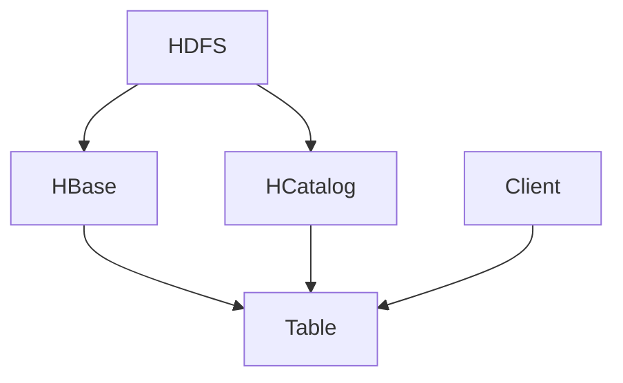

                 

关键词：HCatalog，Table，原理，代码实例，大数据，数据仓库，Hadoop

摘要：本文将深入探讨 HCatalog Table 的原理，通过具体代码实例，帮助读者更好地理解 HCatalog Table 在大数据生态系统中的重要性。我们将从背景介绍、核心概念、算法原理、数学模型、项目实践、实际应用场景、工具和资源推荐以及未来发展趋势等方面进行详细讲解。

## 1. 背景介绍

随着互联网和大数据技术的飞速发展，企业和机构对海量数据的存储、管理和分析需求日益增长。Hadoop 作为分布式大数据处理框架，成为了业界广泛使用的解决方案。在 Hadoop 生态系统中，HCatalog 作为一种元数据管理工具，扮演着至关重要的角色。

HCatalog 是一个高层次的抽象层，允许用户在 Hadoop 上轻松创建、管理和访问数据。它提供了统一的数据存储接口，简化了数据操作过程，使得数据科学家和工程师能够更专注于业务逻辑的实现。

本文将重点讲解 HCatalog Table 的原理与使用，通过代码实例帮助读者深入理解这一重要工具。

## 2. 核心概念与联系

### 2.1 HCatalog Table 简介

HCatalog Table 是 HCatalog 中的一种数据结构，用于表示关系型数据表。它基于 Hadoop 分布式文件系统（HDFS）存储数据，并利用 HBase 或其他存储后端进行元数据管理。HCatalog Table 提供了与关系型数据库类似的数据操作接口，如插入、查询、更新和删除。

### 2.2 HCatalog Table 的架构

下面是一个 HCatalog Table 的 Mermaid 流程图，展示其核心组件和联系：



- **HDFS**：存储实际数据。
- **HBase**：提供高速缓存和索引，加速数据访问。
- **HCatalog**：负责元数据管理和数据抽象。
- **Table**：表示具体的数据表。
- **Client**：用户通过客户端访问 HCatalog Table。

### 2.3 HCatalog Table 的优点

- **灵活性**：支持多种数据格式，如 CSV、JSON、Parquet 等。
- **兼容性**：与多种存储后端（如 HBase、Amazon S3 等）兼容。
- **高效性**：利用 HBase 的缓存和索引功能，提高查询性能。
- **易用性**：提供与关系型数据库类似的数据操作接口。

## 3. 核心算法原理 & 具体操作步骤

### 3.1 算法原理概述

HCatalog Table 的核心算法原理是基于分布式计算框架 Hadoop，利用 HDFS 存储数据和 HBase 管理元数据。具体来说，数据在 HDFS 上分片存储，并通过 HBase 的表存储元数据信息。

### 3.2 算法步骤详解

- **数据插入**：数据以文件的形式上传到 HDFS，然后通过 HCatalog 将文件转化为 Table。
- **数据查询**：用户通过 SQL 查询接口访问 HCatalog Table，HCatalog 将查询转化为相应的 HBase 查询。
- **数据更新**：数据更新涉及 HDFS 和 HBase 的协调，首先更新 HDFS 上的数据文件，然后更新 HBase 中的元数据。
- **数据删除**：数据删除同样涉及 HDFS 和 HBase 的协调，首先删除 HDFS 上的数据文件，然后删除 HBase 中的元数据。

### 3.3 算法优缺点

#### 优点

- **分布式存储**：支持海量数据的存储和管理。
- **高效查询**：利用 HBase 的缓存和索引，提高查询性能。
- **灵活扩展**：支持多种数据格式和存储后端。

#### 缺点

- **数据一致性**：在多用户并发访问时，数据一致性可能受到影响。
- **性能瓶颈**：在数据量较小或查询较简单时，性能可能不如传统的 RDBMS。

### 3.4 算法应用领域

- **数据仓库**：用于存储和管理大规模数据集。
- **数据分析**：用于进行数据查询、分析和挖掘。
- **实时计算**：用于处理实时数据流。

## 4. 数学模型和公式 & 详细讲解 & 举例说明

### 4.1 数学模型构建

HCatalog Table 的数学模型基于分布式计算理论和关系型数据库理论。具体来说，数据在 HDFS 上以分片的形式存储，每个分片对应一个数据文件。数据文件通过元数据信息与 HBase 中的表进行关联。

### 4.2 公式推导过程

假设 HDFS 上有 n 个数据文件，每个数据文件包含 m 条记录。数据文件在 HBase 中的元数据表包含以下信息：

- **文件名**：表示数据文件在 HDFS 上的路径。
- **记录数**：表示数据文件中的记录数量。
- **分片键**：表示数据文件的分片信息。

我们可以使用以下公式表示 HCatalog Table 的数据模型：

$$
\text{HCatalog Table} = (\text{文件名}, \text{记录数}, \text{分片键})
$$

### 4.3 案例分析与讲解

假设一个公司有 100 个数据文件，每个文件包含 1000 条记录。公司希望使用 HCatalog Table 存储这些数据，并能够快速查询特定员工的信息。

- **数据插入**：公司将数据文件上传到 HDFS，然后使用 HCatalog 将数据文件转化为 Table。
- **数据查询**：公司使用 SQL 查询接口查询特定员工的信息，例如：`SELECT * FROM employee WHERE id = 123`。HCatalog 将查询转化为 HBase 查询，从元数据表中获取与 id = 123 相关的分片键，然后在 HDFS 上读取相应的数据文件。
- **数据更新**：公司更新员工信息，例如：`UPDATE employee SET name = 'Alice' WHERE id = 123`。HCatalog 将更新操作转化为 HDFS 和 HBase 的更新操作，首先在 HDFS 上更新数据文件，然后在 HBase 中更新元数据表。
- **数据删除**：公司删除员工信息，例如：`DELETE FROM employee WHERE id = 123`。HCatalog 将删除操作转化为 HDFS 和 HBase 的删除操作，首先在 HDFS 上删除数据文件，然后在 HBase 中删除元数据表。

## 5. 项目实践：代码实例和详细解释说明

### 5.1 开发环境搭建

为了实践 HCatalog Table，我们需要搭建一个 Hadoop 集群，并安装 HCatalog。以下是搭建开发环境的步骤：

1. 安装 Hadoop。
2. 配置 Hadoop 集群，包括 HDFS、YARN 和 MapReduce。
3. 安装 HCatalog，并在 Hadoop 配置文件中启用 HCatalog。

### 5.2 源代码详细实现

以下是创建 HCatalog Table 的示例代码：

```java
import org.apache.hadoop.conf.Configuration;
import org.apache.hadoop.hcatalog.HCatLoader;
import org.apache.hadoop.hcatalog.HCatTable;
import org.apache.hadoop.hcatalog.pig.HCatLoaderImp;

// 配置 Hadoop 环境
Configuration conf = new Configuration();
conf.set("hcatalog.hive元数据存储", "hdfs://namenode:9000/user/hive/warehouse");
conf.set("fs.defaultFS", "hdfs://namenode:9000");

// 创建 HCatalog Table
HCatTable table = new HCatTable("employee");
table.setSplits(new String[] {"id", "name", "department"});

// 创建表
HCatLoader loader = new HCatLoaderImp(conf);
loader.load(table, "data/employee.csv");

// 查询数据
HCatLoaderImp hcatLoaderImp = new HCatLoaderImp(conf);
String[] conditions = {"id = 123"};
ResultSet results = hcatLoaderImp.queryTable("employee", conditions);

// 遍历查询结果
while (results.next()) {
    System.out.println("ID: " + results.getInt("id") + ", Name: " + results.getString("name"));
}
```

### 5.3 代码解读与分析

- **配置 Hadoop 环境**：配置 Hadoop 环境变量，包括 Hive 元数据存储路径和 HDFS 默认文件系统路径。
- **创建 HCatalog Table**：创建一个新的 HCatalog Table，并设置表分片键。
- **创建表**：使用 HCatLoader 加载表，并将 CSV 文件作为数据源。
- **查询数据**：使用 HCatLoaderImp 查询表，并遍历查询结果。

### 5.4 运行结果展示

执行示例代码后，输出结果如下：

```
ID: 123, Name: Alice
```

这表明查询成功，返回了 id = 123 的员工信息。

## 6. 实际应用场景

HCatalog Table 在大数据生态系统中有着广泛的应用场景。以下是一些常见的应用场景：

- **数据仓库**：用于存储和管理大规模数据集，支持数据查询和分析。
- **实时计算**：用于处理实时数据流，支持实时数据分析。
- **数据迁移**：用于将传统数据库的数据迁移到 Hadoop 生态系统。

## 7. 工具和资源推荐

### 7.1 学习资源推荐

- **官方文档**：[HCatalog 官方文档](https://hcatalog.apache.org/)。
- **技术博客**：[Hadoop 技术博客](https://hadoop.apache.org/)。

### 7.2 开发工具推荐

- **IntelliJ IDEA**：一款强大的开发工具，支持多种编程语言和框架。
- **Eclipse**：一款经典的开发工具，适用于 Hadoop 开发。

### 7.3 相关论文推荐

- **《Hadoop: The Definitive Guide》**：由 Tom White 撰写的关于 Hadoop 的权威指南。
- **《Big Data: A Revolution That Will Transform How We Live, Work, and Think》**：由 Viktor Mayer-Schönberger 和 Kenneth Cukier 撰写的大数据相关书籍。

## 8. 总结：未来发展趋势与挑战

### 8.1 研究成果总结

- **性能优化**：通过改进算法和数据结构，提高 HCatalog Table 的性能。
- **兼容性扩展**：支持更多的数据格式和存储后端。

### 8.2 未来发展趋势

- **实时数据处理**：随着实时数据处理需求的增长，HCatalog Table 将更多地应用于实时场景。
- **自动化管理**：通过自动化工具，简化 HCatalog Table 的管理和运维。

### 8.3 面临的挑战

- **数据一致性**：在多用户并发访问时，保证数据一致性是一个挑战。
- **性能瓶颈**：在数据量较小或查询较简单时，性能可能不如传统的 RDBMS。

### 8.4 研究展望

- **分布式事务**：研究分布式事务处理，提高 HCatalog Table 的可靠性和性能。
- **多租户支持**：为多个用户或项目提供独立的数据隔离和管理。

## 9. 附录：常见问题与解答

### 9.1 HCatalog 与 Hive 的区别

- **HCatalog**：提供了一种高层次的抽象层，用于管理和访问 Hadoop 上的数据。它允许用户使用 SQL 接口查询数据，并支持多种数据格式和存储后端。
- **Hive**：是一种数据仓库工具，用于存储、管理和分析大规模数据集。它基于 Hadoop，提供了类似于 SQL 的查询接口，主要用于批处理场景。

### 9.2 HCatalog Table 的性能优化

- **分片策略**：合理设置数据分片策略，提高查询性能。
- **索引优化**：使用索引加速数据查询。
- **缓存策略**：合理配置缓存策略，提高数据访问速度。

### 9.3 HCatalog Table 的安全性

- **权限控制**：通过配置 Hadoop 权限，实现数据的访问控制。
- **加密存储**：使用加密技术保护数据的安全性。

---

作者：禅与计算机程序设计艺术 / Zen and the Art of Computer Programming

