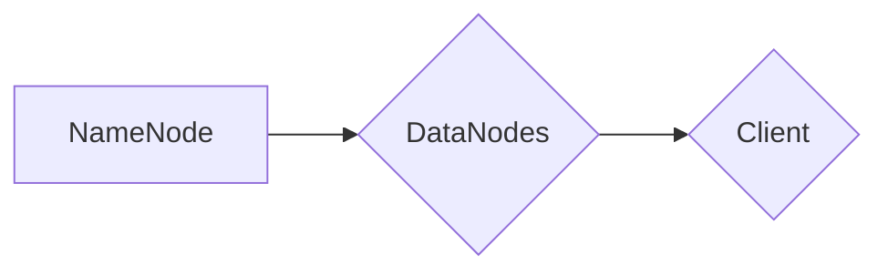

                 

关键词：HDFS、分布式文件系统、大数据存储、文件块、数据复制、数据冗余、数据访问、分布式计算

摘要：本文将深入讲解HDFS（Hadoop Distributed File System）的原理，包括其架构设计、核心概念、数据复制机制以及访问控制。通过代码实例，我们将展示如何在实际项目中使用HDFS，并提供详细的代码解读和分析。此外，文章还将探讨HDFS在分布式计算环境中的应用，以及未来发展趋势和面临的挑战。

## 1. 背景介绍

HDFS（Hadoop Distributed File System）是Apache Hadoop项目中的核心组件之一，用于构建大规模分布式文件存储系统。在大数据时代，随着数据量的急剧增长，传统的集中式文件系统已经无法满足需求。HDFS通过将数据分布存储在多个节点上，提供了高吞吐量、高可靠性以及高扩展性的存储解决方案。

HDFS的设计初衷是为分布式计算环境中的大数据存储而优化。它适用于处理GB、TB甚至PB级别的数据集，特别适合于大数据分析、数据挖掘和机器学习等应用场景。通过HDFS，用户可以轻松地将海量数据存储和管理，同时享受到分布式计算带来的并行处理能力。

## 2. 核心概念与联系

### 2.1 HDFS架构设计

HDFS的架构包括两个主要组件：NameNode和DataNode。

**NameNode**：作为HDFS的主节点，负责管理文件的元数据，如文件目录结构、文件大小、数据块的分配等。它并不存储实际的数据，而是维护每个文件的数据块在哪个DataNode上的映射关系。

**DataNode**：作为HDFS的工作节点，负责实际的数据存储和检索。每个DataNode上存储了它所负责的数据块，并向上层NameNode报告其状态。

**架构图**：



### 2.2 核心概念

**文件块（Block）**：HDFS将文件切割成固定大小的数据块进行存储，默认大小为128MB或256MB。这种设计有利于并行处理和容错性。

**数据复制（Replication）**：HDFS默认将每个数据块复制3次，存储在不同的节点上。这种冗余设计提高了数据可靠性和容错性。

**数据访问**：HDFS支持两种访问模式：高吞吐量读写（通过DataNode进行）和低延迟读写（通过NameNode进行）。

## 3. 核心算法原理 & 具体操作步骤

### 3.1 算法原理概述

HDFS的核心算法主要包括：

1. 数据块管理算法：决定数据块在哪些节点上存储。
2. 数据复制算法：确定数据块的副本数量和存储位置。
3. 数据访问算法：处理客户端对文件的读写请求。

### 3.2 算法步骤详解

1. **数据块管理算法**：

   - 当客户端上传文件时，NameNode会将文件切割成数据块。
   - NameNode根据负载均衡策略，将数据块分配到不同的DataNode上存储。

2. **数据复制算法**：

   - NameNode在创建数据块时，会指定至少两个副本。
   - DataNode在收到数据块后，会向NameNode报告其状态。
   - 当检测到某个副本丢失时，NameNode会重新复制该数据块。

3. **数据访问算法**：

   - 客户端通过NameNode获取数据块的存储位置。
   - 客户端直接与存储数据块的DataNode进行通信，进行读写操作。

### 3.3 算法优缺点

**优点**：

- **高可靠性**：数据块复制机制提高了数据可靠性。
- **高扩展性**：通过添加更多DataNode，可以轻松扩展存储容量。
- **高吞吐量**：支持大规模并行处理。

**缺点**：

- **单点故障**：NameNode是单点故障点，需要特别保护。
- **低延迟**：不适合小文件或低延迟读写场景。

### 3.4 算法应用领域

HDFS广泛应用于以下领域：

- **大数据处理**：如数据挖掘、机器学习、图计算等。
- **企业数据仓库**：用于存储和分析海量结构化和非结构化数据。
- **媒体内容分发**：如视频、音频等大文件的存储和分发。

## 4. 数学模型和公式 & 详细讲解 & 举例说明

### 4.1 数学模型构建

HDFS中的数学模型主要包括：

- 数据块大小（\(B\)）
- 数据块副本数量（\(R\)）
- 数据总容量（\(C\)）

### 4.2 公式推导过程

1. **数据总容量**：

   $$ C = \sum_{i=1}^{N} \left( \frac{C_i}{R} \right) $$

   其中，\(C_i\) 为第 \(i\) 个数据块的存储容量，\(R\) 为数据块副本数量。

2. **数据块副本数量**：

   $$ R = \lceil \frac{C}{B} \rceil $$

   其中，\(\lceil x \rceil\) 表示对 \(x\) 向上取整。

### 4.3 案例分析与讲解

假设我们有一个文件，总容量为2TB，数据块大小为128MB，副本数量为3。

1. **数据块数量**：

   $$ N = \lceil \frac{2TB}{128MB} \rceil = 15552 $$

2. **总容量**：

   $$ C = 15552 \times 128MB = 1985.8TB $$

3. **每个数据块的存储容量**：

   $$ C_i = \frac{C}{N} = \frac{1985.8TB}{15552} \approx 127.96MB $$

通过这个例子，我们可以看到HDFS如何根据数据块大小和副本数量来计算数据总容量。

## 5. 项目实践：代码实例和详细解释说明

### 5.1 开发环境搭建

在本节，我们将搭建一个简单的HDFS开发环境。首先，确保安装了Java环境和Hadoop。

1. **安装Java环境**：

   - 在命令行中执行 `java -version`，检查是否已安装Java。
   - 若未安装，请从Oracle官网下载并安装Java。

2. **安装Hadoop**：

   - 下载Hadoop二进制文件（如 `hadoop-3.2.1.tar.gz`）。
   - 解压到指定目录，如 `/usr/local/hadoop`。

3. **配置Hadoop**：

   - 修改 `hadoop-env.sh` 配置文件，设置Java环境变量。

### 5.2 源代码详细实现

在本节，我们将编写一个简单的HDFS客户端程序，用于上传和下载文件。

```java
import org.apache.hadoop.conf.Configuration;
import org.apache.hadoop.fs.*;

public class HDFSClient {
    public static void main(String[] args) throws IOException {
        Configuration conf = new Configuration();
        conf.set("fs.defaultFS", "hdfs://localhost:9000");
        
        // 上传文件
        FSDataOutputStream out = FileSystem.get(conf).create(new Path("/test.txt"));
        out.writeBytes("Hello, HDFS!");
        out.close();
        
        // 下载文件
        FSDataInputStream in = FileSystem.get(conf).open(new Path("/test.txt"));
        byte[] buffer = new byte[1024];
        int bytesRead;
        while ((bytesRead = in.read(buffer)) != -1) {
            System.out.write(buffer, 0, bytesRead);
        }
        in.close();
        System.out.println();
    }
}
```

### 5.3 代码解读与分析

1. **配置Hadoop环境**：

   - `conf.set("fs.defaultFS", "hdfs://localhost:9000");`：设置HDFS的默认文件系统。
   - `FileSystem.get(conf)`：获取文件系统实例。

2. **上传文件**：

   - `FileSystem.get(conf).create(new Path("/test.txt"))`：创建一个新的文件。
   - `out.writeBytes("Hello, HDFS!");`：将数据写入文件。
   - `out.close()`：关闭输出流。

3. **下载文件**：

   - `FileSystem.get(conf).open(new Path("/test.txt"))`：打开文件。
   - `in.read(buffer)`：读取文件内容到缓冲区。
   - `System.out.write(buffer, 0, bytesRead)`：将缓冲区内容写入控制台。
   - `in.close()`：关闭输入流。

通过这个简单的代码实例，我们可以看到如何使用HDFS进行文件上传和下载。

## 6. 实际应用场景

HDFS广泛应用于各种实际应用场景：

- **大数据处理平台**：如Apache Hadoop、Apache Spark等。
- **企业数据仓库**：如Apache Hive、Apache HBase等。
- **媒体内容分发平台**：如Amazon S3、Google Cloud Storage等。

## 7. 工具和资源推荐

### 7.1 学习资源推荐

- **书籍**：《Hadoop权威指南》、《Hadoop应用实践》等。
- **在线课程**：Coursera、edX等平台上有关大数据和Hadoop的课程。

### 7.2 开发工具推荐

- **集成开发环境**：IntelliJ IDEA、Eclipse等。
- **版本控制工具**：Git、SVN等。

### 7.3 相关论文推荐

- **HDFS论文**：《The Google File System》。
- **分布式系统论文**：《The Chubby Lock Service for Loosely-Coupled Distributed Systems》。

## 8. 总结：未来发展趋势与挑战

### 8.1 研究成果总结

HDFS在大数据存储领域取得了显著成果，广泛应用于分布式计算和数据仓库等领域。它为大规模数据存储提供了可靠、高效、可扩展的解决方案。

### 8.2 未来发展趋势

- **性能优化**：通过改进数据复制和调度算法，提高HDFS的性能。
- **安全性增强**：加强对数据访问控制和加密的支持。
- **兼容性提升**：与其他分布式存储系统（如Ceph、Alluxio）的集成。

### 8.3 面临的挑战

- **单点故障**：需要提高NameNode的容错性和可用性。
- **数据访问性能**：针对低延迟读写需求进行优化。

### 8.4 研究展望

HDFS将继续在大数据领域发挥重要作用，未来的研究将重点关注性能优化、安全性和兼容性等方面。

## 9. 附录：常见问题与解答

### Q：HDFS适合存储哪种类型的数据？

A：HDFS适合存储大规模、高吞吐量、可分块的数据，如日志文件、图片、视频等。

### Q：HDFS如何处理数据块复制？

A：HDFS通过数据块副本机制进行数据复制。默认情况下，每个数据块复制3次，并存储在不同节点上。

### Q：HDFS如何保证数据可靠性？

A：HDFS通过数据块复制和数据校验来保证数据可靠性。如果检测到数据块损坏，会自动从副本中恢复。

---

作者：禅与计算机程序设计艺术 / Zen and the Art of Computer Programming

----------------------------------------------------------------

文章正文部分撰写完成。接下来，请进行内容的排版、格式调整以及最终的审核和发布准备工作。如果您需要任何帮助或进一步修改建议，请随时告知。

