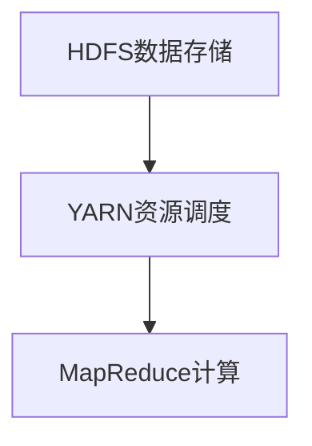

                 

关键词：Hadoop、大数据处理、分布式系统、MapReduce、HDFS、YARN、代码实例

>摘要：本文将深入探讨Hadoop分布式计算框架的原理、架构以及其实际应用，通过详细的代码实例，帮助读者更好地理解和掌握Hadoop的核心技术和应用技巧。

## 1. 背景介绍

随着互联网和社交媒体的快速发展，数据量呈现爆炸式增长。如何高效地处理海量数据，成为企业和研究机构面临的重要挑战。Hadoop作为一款开源分布式计算框架，凭借其强大的数据处理能力和高度的扩展性，成为大数据领域的领军者。

Hadoop起源于Google的MapReduce论文，并在其基础上发展而来。它由两部分组成：HDFS（Hadoop分布式文件系统）和YARN（资源调度框架）。Hadoop的目标是将大规模数据处理任务分解为多个小任务，并在分布式集群上并行执行，以提高数据处理效率和可靠性。

## 2. 核心概念与联系

### 2.1 HDFS

HDFS（Hadoop Distributed File System）是一个分布式文件系统，用于存储海量数据。其核心特点如下：

- **数据分块**：HDFS将大文件拆分为多个小块（默认为128MB或256MB），分布存储在集群中的不同节点上。

- **高容错性**：HDFS采用数据副本机制，每个数据块存储多个副本，提高数据可靠性和容错能力。

- **数据访问**：HDFS支持高吞吐量的数据访问，适用于大规模数据读写操作。

### 2.2 YARN

YARN（Yet Another Resource Negotiator）是Hadoop的资源调度框架，负责管理集群资源，为各种应用程序（如MapReduce、Spark等）分配计算资源。YARN的主要功能包括：

- **资源管理**：YARN将集群资源划分为多个资源单元，并按需分配给应用程序。

- **任务调度**：YARN根据应用程序的请求和资源状况，智能调度任务执行。

- **高可用性**：YARN支持故障转移和负载均衡，确保集群稳定运行。

### 2.3 MapReduce

MapReduce是Hadoop的核心计算框架，用于处理大规模数据集。其核心思想是将大规模数据处理任务分解为两个阶段：Map和Reduce。Map阶段将数据拆分为键值对，并生成中间结果；Reduce阶段对中间结果进行聚合，生成最终结果。

### 2.4 Mermaid流程图



## 3. 核心算法原理 & 具体操作步骤

### 3.1 算法原理概述

Hadoop的核心算法是MapReduce，其原理如下：

1. **Map阶段**：将输入数据拆分为键值对，并生成中间结果。
2. **Shuffle阶段**：对中间结果进行分组和排序，为Reduce阶段做准备。
3. **Reduce阶段**：对中间结果进行聚合，生成最终结果。

### 3.2 算法步骤详解

1. **Map阶段**：

   - 输入数据：一组键值对。
   - 处理逻辑：根据输入数据，生成中间结果（一组键值对）。

   ```python
   def map(input_key, input_value):
       # 处理输入数据
       output_key = ...
       output_value = ...
       return (output_key, output_value)
   ```

2. **Shuffle阶段**：

   - 对Map阶段生成的中间结果进行分组和排序。

   ```python
   def shuffle(input_key, input_values):
       # 对中间结果进行分组和排序
       output_key = ...
       output_values = ...
       return (output_key, output_values)
   ```

3. **Reduce阶段**：

   - 对Shuffle阶段生成的中间结果进行聚合。

   ```python
   def reduce(input_key, input_values):
       # 对中间结果进行聚合
       output_value = ...
       return (input_key, output_value)
   ```

### 3.3 算法优缺点

**优点**：

- **高效性**：通过分布式计算，提高数据处理效率和性能。
- **可扩展性**：支持大规模数据处理任务，易于扩展。

**缺点**：

- **编程门槛**：需要编写复杂的MapReduce代码，对开发人员要求较高。
- **资源浪费**：在某些情况下，部分计算资源可能得不到充分利用。

### 3.4 算法应用领域

- **数据分析**：处理大规模数据集，进行数据挖掘和分析。
- **机器学习**：进行大规模机器学习模型的训练和预测。
- **搜索引擎**：处理海量网页数据，构建搜索引擎索引。

## 4. 数学模型和公式 & 详细讲解 & 举例说明

### 4.1 数学模型构建

Hadoop的MapReduce算法可以表示为以下数学模型：

$$
\text{MapReduce} = \text{Map} + \text{Shuffle} + \text{Reduce}
$$

其中：

- **Map**：将输入数据拆分为键值对，并生成中间结果。
- **Shuffle**：对中间结果进行分组和排序。
- **Reduce**：对中间结果进行聚合。

### 4.2 公式推导过程

假设输入数据集为$D$，包含$n$个数据点$(x_1, y_1), (x_2, y_2), ..., (x_n, y_n)$。

1. **Map阶段**：

   对于每个数据点$(x_i, y_i)$，执行以下操作：

   $$
   \text{Map}(x_i, y_i) = (\text{key}_i, \text{value}_i)
   $$

   其中，$\text{key}_i$为数据点的键，$\text{value}_i$为数据点的值。

2. **Shuffle阶段**：

   对Map阶段生成的键值对进行分组和排序：

   $$
   \text{Shuffle}((\text{key}_i, \text{value}_i), (\text{key}_j, \text{value}_j)) = (\text{key}_i, \{\text{value}_i, \text{value}_j\})
   $$

3. **Reduce阶段**：

   对Shuffle阶段生成的中间结果进行聚合：

   $$
   \text{Reduce}(\text{key}_i, \{\text{value}_i, \text{value}_j\}) = (\text{key}_i, \text{agg}(\text{value}_i, \text{value}_j))
   $$

   其中，$\text{agg}$为聚合函数。

### 4.3 案例分析与讲解

假设我们要计算一组数据点的平均值，使用MapReduce算法实现如下：

1. **Map阶段**：

   对每个数据点$(x_i, y_i)$，执行以下操作：

   ```python
   def map(input_key, input_value):
       output_key = "sum"
       output_value = input_value
       return (output_key, output_value)
   ```

2. **Shuffle阶段**：

   对Map阶段生成的中间结果进行分组和排序：

   ```python
   def shuffle(input_key, input_values):
       output_key = input_key
       output_values = sum(input_values)
       return (output_key, output_values)
   ```

3. **Reduce阶段**：

   对Shuffle阶段生成的中间结果进行聚合：

   ```python
   def reduce(input_key, input_values):
       output_value = input_values[0]
       return (input_key, output_value)
   ```

最终，我们将得到一组数据点的平均值。

## 5. 项目实践：代码实例和详细解释说明

### 5.1 开发环境搭建

在本节中，我们将介绍如何在Windows和Linux系统中搭建Hadoop开发环境。

1. **下载Hadoop**：

   访问Hadoop官网（[hadoop.apache.org](http://hadoop.apache.org)），下载最新版本的Hadoop。

2. **解压Hadoop**：

   将下载的Hadoop压缩包解压到指定目录。

3. **配置环境变量**：

   在Windows系统中，需要将Hadoop的bin目录添加到系统环境变量中。

   ```bash
   export PATH=$PATH:/path/to/hadoop/bin
   ```

   在Linux系统中，需要将Hadoop的bin目录添加到用户环境变量中。

   ```bash
   export PATH=$PATH:/path/to/hadoop/bin
   ```

4. **启动Hadoop集群**：

   在终端中运行以下命令，启动Hadoop集群：

   ```bash
   start-dfs.sh
   start-yarn.sh
   ```

### 5.2 源代码详细实现

在本节中，我们将通过一个简单的WordCount程序，介绍如何使用Hadoop进行分布式数据处理。

1. **Map类**：

   ```java
   import org.apache.hadoop.conf.Configuration;
   import org.apache.hadoop.fs.Path;
   import org.apache.hadoop.io.IntWritable;
   import org.apache.hadoop.io.Text;
   import org.apache.hadoop.mapreduce.Job;
   import org.apache.hadoop.mapreduce.Mapper;
   import org.apache.hadoop.mapreduce.lib.input.FileInputFormat;
   import org.apache.hadoop.mapreduce.lib.output.FileOutputFormat;

   public class WordCount {
       public static class Map extends Mapper<Object, Text, Text, IntWritable> {
           private final static IntWritable one = new IntWritable(1);
           private Text word = new Text();

           public void map(Object key, Text value, Context context) throws IOException, InterruptedException {
               String line = value.toString();
               for (String token : line.split("\\s+")) {
                   word.set(token);
                   context.write(word, one);
               }
           }
       }
   }
   ```

2. **Reduce类**：

   ```java
   import org.apache.hadoop.conf.Configuration;
   import org.apache.hadoop.fs.Path;
   import org.apache.hadoop.io.IntWritable;
   import org.apache.hadoop.io.Text;
   import org.apache.hadoop.mapreduce.Job;
   import org.apache.hadoop.mapreduce.Reducer;
   import org.apache.hadoop.mapreduce.lib.input.FileInputFormat;
   import org.apache.hadoop.mapreduce.lib.output.FileOutputFormat;

   public class WordCount {
       public static class Reduce extends Reducer<Text, IntWritable, Text, IntWritable> {
           private IntWritable result = new IntWritable();

           public void reduce(Text key, Iterable<IntWritable> values, Context context) throws IOException, InterruptedException {
               int sum = 0;
               for (IntWritable val : values) {
                   sum += val.get();
               }
               result.set(sum);
               context.write(key, result);
           }
       }
   }
   ```

3. **主类**：

   ```java
   import org.apache.hadoop.conf.Configuration;
   import org.apache.hadoop.fs.Path;
   import org.apache.hadoop.io.IntWritable;
   import org.apache.hadoop.io.Text;
   import org.apache.hadoop.mapreduce.Job;
   import org.apache.hadoop.mapreduce.lib.input.FileInputFormat;
   import org.apache.hadoop.mapreduce.lib.output.FileOutputFormat;

   public class WordCount {
       public static void main(String[] args) throws Exception {
           Configuration conf = new Configuration();
           Job job = Job.getInstance(conf, "word count");
           job.setJarByClass(WordCount.class);
           job.setMapperClass(Map.class);
           job.setCombinerClass(Reduce.class);
           job.setReducerClass(Reduce.class);
           job.setOutputKeyClass(Text.class);
           job.setOutputValueClass(IntWritable.class);
           FileInputFormat.addInputPath(job, new Path(args[0]));
           FileOutputFormat.setOutputPath(job, new Path(args[1]));
           System.exit(job.waitForCompletion(true) ? 0 : 1);
       }
   }
   ```

### 5.3 代码解读与分析

1. **Map类**：

   Map类实现了Mapper接口，用于处理输入数据。在map()方法中，我们遍历输入数据的每个单词，将单词作为键，并将计数值1作为值写入上下文。

2. **Reduce类**：

   Reduce类实现了Reducer接口，用于聚合Map阶段生成的中间结果。在reduce()方法中，我们遍历每个单词的计数值，将最大计数值作为最终结果写入上下文。

3. **主类**：

   主类负责配置Hadoop作业，设置Mapper和Reducer类，以及输入输出路径。在main()方法中，我们调用Job的waitForCompletion()方法，执行Hadoop作业。

### 5.4 运行结果展示

1. **编译Java程序**：

   在终端中运行以下命令，编译Java程序：

   ```bash
   javac WordCount.java
   ```

2. **运行WordCount程序**：

   在终端中运行以下命令，运行WordCount程序：

   ```bash
   hadoop jar WordCount.jar WordCount /input /output
   ```

   其中，/input为输入文件路径，/output为输出文件路径。

3. **查看结果**：

   在终端中运行以下命令，查看输出结果：

   ```bash
   cat /output/*.txt
   ```

   输出结果为每个单词及其计数值。

## 6. 实际应用场景

Hadoop在大数据处理领域具有广泛的应用场景，以下为几个典型应用案例：

- **搜索引擎**：处理海量网页数据，构建搜索引擎索引。

- **社交网络**：分析用户行为和社交关系，挖掘潜在用户需求。

- **金融行业**：处理海量交易数据，进行风险控制和投资分析。

- **医疗领域**：分析医学图像和基因组数据，提高疾病诊断和治疗效果。

## 7. 工具和资源推荐

### 7.1 学习资源推荐

- 《Hadoop权威指南》
- 《大数据技术基础》
- 《Hadoop实战》

### 7.2 开发工具推荐

- IntelliJ IDEA
- Eclipse
- Sublime Text

### 7.3 相关论文推荐

- 《Google File System》
- 《MapReduce: Simplified Data Processing on Large Clusters》
- 《The Chubby lock service》

## 8. 总结：未来发展趋势与挑战

Hadoop作为大数据处理领域的重要技术，具有广阔的应用前景。未来发展趋势包括：

- **计算性能提升**：通过优化算法和硬件，提高Hadoop的计算性能。

- **多样化应用场景**：拓展Hadoop在物联网、人工智能等领域的应用。

- **开源生态建设**：加强与开源社区的协作，丰富Hadoop生态系统。

然而，Hadoop也面临一些挑战：

- **编程复杂度**：对于初学者而言，Hadoop的编程门槛较高。

- **资源浪费**：在某些情况下，Hadoop的分布式计算可能导致资源浪费。

- **安全性和隐私保护**：确保大规模数据处理过程中的数据安全和隐私保护。

## 9. 附录：常见问题与解答

### 问题1：如何解决Hadoop集群性能瓶颈？

**解答**：通过优化Hadoop配置、提高集群硬件性能、使用更高效的算法和数据结构，以及进行负载均衡和故障转移，可以解决Hadoop集群性能瓶颈。

### 问题2：Hadoop与其他大数据处理框架（如Spark、Flink）的区别是什么？

**解答**：Hadoop主要侧重于分布式存储和计算，而Spark和Flink则提供了更高效的分布式计算引擎。Spark具有内存计算优势，而Flink提供了实时数据处理能力。选择哪个框架取决于具体应用场景和需求。

----------------------------------------------------------------

作者：禅与计算机程序设计艺术 / Zen and the Art of Computer Programming


