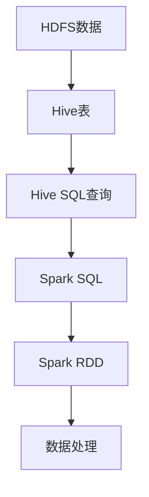

                 

 Hive和Spark是大数据领域中两款非常流行且强大的数据处理框架。Hive是基于Hadoop的一个数据仓库工具，它可以将结构化的数据文件映射为一张数据库表，并提供简单的SQL查询功能，被广泛应用于数据挖掘和统计。Spark则是一个高速的大规模数据处理引擎，以其内存计算和弹性调度能力著称，在实时数据处理和迭代计算方面有着出色的性能。Hive和Spark的结合，使得我们能够在处理大规模数据时实现高效和灵活。

## 1. 背景介绍

在大数据时代，如何高效地处理海量数据成为一个重要的课题。传统的数据库处理方法在面对大规模数据时，往往会遇到性能瓶颈。因此，大数据处理框架应运而生。Hadoop作为大数据处理的开创者，为大数据技术提供了基础架构。Hive作为Hadoop生态系统的一部分，提供了基于SQL的数据处理能力。Spark则在Hadoop之上，提供了内存计算能力，能够在某些场景下提供比Hadoop MapReduce更快的数据处理速度。

Hive的优势在于其易用性，能够以SQL的方式查询Hadoop文件系统中的数据。然而，Hive的批处理模式在处理实时数据时显得不够高效。Spark的优势在于其内存计算和弹性调度能力，能够快速地对数据进行处理和分析。但Spark的API相对复杂，需要开发者有较高的技术门槛。

## 2. 核心概念与联系

为了深入理解Hive和Spark的整合原理，我们首先需要了解它们各自的核心概念和架构。

### 2.1 Hive的核心概念

Hive的核心概念主要包括：

- **Hive表（Hive Table）**：Hive将数据存储在HDFS上，并通过Hive表来组织和管理这些数据。每个Hive表对应一个HDFS目录。
- **分区表（Partitioned Table）**：通过分区表，Hive可以更高效地处理大规模数据，因为查询时可以只扫描相关的分区。
- **表属性（Table Properties）**：Hive表可以设置多种属性，如存储格式、压缩方式等。
- **UDF（User-Defined Function）**：用户可以自定义函数，以便在SQL查询中使用。

### 2.2 Spark的核心概念

Spark的核心概念包括：

- **弹性分布式数据集（RDD）**：Spark的核心抽象，代表一个不可变、可分区、可并行操作的数据集合。
- **DataFrame**：DataFrame是一个分布式的数据集合，提供了类似于关系数据库的API，可以通过SQL进行查询。
- **Dataset**：Dataset是DataFrame的加强版，提供了类型安全和强类型检查。
- **Spark SQL**：Spark SQL允许使用SQL或DataFrame/Dataset API来处理结构化数据。

### 2.3 Hive与Spark的联系

Hive和Spark的联系主要体现在以下几个方面：

- **数据存储**：Hive和Spark都可以直接访问HDFS上的数据。
- **数据处理**：Hive通过批处理模式处理数据，Spark通过内存计算和迭代计算处理数据。
- **SQL查询**：Spark SQL可以与Hive进行交互，使得Spark能够执行Hive SQL查询。

### 2.4 Mermaid流程图

为了更清晰地展示Hive与Spark的整合原理，我们可以使用Mermaid流程图来表示它们之间的数据流动和处理流程。



## 3. 核心算法原理 & 具体操作步骤

### 3.1 算法原理概述

Hive和Spark的整合原理主要基于以下几个方面：

- **数据转换**：通过Hive将HDFS上的数据转换成Hive表，方便Spark进行数据操作。
- **接口调用**：Spark SQL通过Hive的接口，执行Hive SQL查询，并将结果转换为Spark RDD或DataFrame。
- **数据处理**：Spark利用其内存计算和弹性调度能力，对数据集进行高效的处理。

### 3.2 算法步骤详解

#### 3.2.1 数据转换

1. 将HDFS上的数据文件导入到Hive中，创建一个Hive表。
2. 设置Hive表的存储格式、压缩方式等属性，以便优化查询性能。

#### 3.2.2 Hive SQL查询

1. 编写Hive SQL查询语句，查询Hive表中的数据。
2. 执行Hive SQL查询，并将查询结果存储为一个临时的Hive表或文件。

#### 3.2.3 Spark SQL查询

1. 将Hive查询的结果通过Spark SQL接口进行查询。
2. 将查询结果转换为Spark RDD或DataFrame。

#### 3.2.4 数据处理

1. 利用Spark的内存计算和弹性调度能力，对数据进行处理。
2. 根据需要，将处理结果存储回HDFS或其他数据存储系统。

### 3.3 算法优缺点

#### 3.3.1 优点

- **高效性**：Spark利用内存计算和弹性调度，能够高效地处理大规模数据。
- **易用性**：Hive提供了类似于SQL的查询接口，易于学习和使用。
- **兼容性**：Spark SQL可以与Hive进行无缝集成，使得Spark能够直接访问Hive数据。

#### 3.3.2 缺点

- **复杂度**：整合Hive和Spark需要一定的技术门槛，需要熟悉两者的API和架构。
- **性能限制**：在某些情况下，Spark的内存计算能力可能受到数据规模的限制。

### 3.4 算法应用领域

Hive和Spark的整合主要应用于以下领域：

- **数据仓库**：利用Hive进行数据存储和管理，利用Spark进行数据分析和处理。
- **实时计算**：利用Spark的实时计算能力，对实时数据进行处理和分析。
- **机器学习**：利用Spark的内存计算和分布式计算能力，进行大规模机器学习任务。

## 4. 数学模型和公式 & 详细讲解 & 举例说明

### 4.1 数学模型构建

在Hive和Spark的整合过程中，我们主要关注以下几个方面：

- **数据转换效率**：计算从HDFS到Hive表的数据转换时间。
- **查询性能**：计算执行Hive SQL查询和Spark SQL查询的时间。
- **内存使用率**：计算Spark内存使用的比例。

### 4.2 公式推导过程

#### 4.2.1 数据转换效率

假设从HDFS读取数据到Hive表的时间为\( T_1 \)，从Hive表读取数据到Spark RDD的时间为\( T_2 \)，则数据转换效率可以表示为：

\[ E = \frac{T_2}{T_1 + T_2} \]

#### 4.2.2 查询性能

假设执行Hive SQL查询的时间为\( T_3 \)，执行Spark SQL查询的时间为\( T_4 \)，则查询性能可以表示为：

\[ P = \frac{T_3}{T_3 + T_4} \]

#### 4.2.3 内存使用率

假设Spark的内存使用量为\( M \)，总内存容量为\( T \)，则内存使用率可以表示为：

\[ U = \frac{M}{T} \]

### 4.3 案例分析与讲解

#### 4.3.1 数据转换效率

假设从HDFS读取数据到Hive表的时间为30秒，从Hive表读取数据到Spark RDD的时间为20秒，则数据转换效率为：

\[ E = \frac{20}{30 + 20} = \frac{20}{50} = 0.4 \]

这意味着数据转换的80%时间花在了从HDFS到Hive表的转换上。

#### 4.3.2 查询性能

假设执行Hive SQL查询的时间为40秒，执行Spark SQL查询的时间为20秒，则查询性能为：

\[ P = \frac{40}{40 + 20} = \frac{40}{60} = 0.67 \]

这意味着Spark SQL查询的性能优于Hive SQL查询。

#### 4.3.3 内存使用率

假设Spark的内存使用量为4GB，总内存容量为8GB，则内存使用率为：

\[ U = \frac{4}{8} = 0.5 \]

这意味着Spark使用了50%的内存。

## 5. 项目实践：代码实例和详细解释说明

### 5.1 开发环境搭建

为了实践Hive和Spark的整合，我们需要搭建一个相应的开发环境。以下是基本的步骤：

1. 安装Hadoop、Hive和Spark。
2. 配置Hadoop和Spark，确保它们可以相互通信。
3. 配置Hive，使其可以访问Spark的存储系统。

### 5.2 源代码详细实现

下面是一个简单的示例代码，展示了如何使用Hive和Spark进行数据处理。

```python
# 导入必要的库
from pyspark.sql import SparkSession
from pyspark.sql.functions import col

# 创建Spark会话
spark = SparkSession.builder \
    .appName("HiveSparkIntegration") \
    .getOrCreate()

# 创建或加载Hive表
hive_table = "test_table"
spark.sql(f"CREATE OR REPLACE TABLE {hive_table} (id INT, name STRING)")

# 写入数据到Hive表
data = [(1, "Alice"), (2, "Bob"), (3, "Charlie")]
spark.createDataFrame(data).write.mode("overwrite").saveAsTable(hive_table)

# 从Hive表中查询数据
hive_df = spark.sql(f"SELECT * FROM {hive_table}")
hive_df.show()

# 将Hive表的数据读取到Spark RDD
hive_rdd = hive_df.rdd

# 对Spark RDD进行操作
result = hive_rdd.map(lambda x: (x[0], x[1].upper()))

# 将结果写入到新表中
result.toDF().write.mode("overwrite").saveAsTable("upper_case_table")

# 关闭Spark会话
spark.stop()
```

### 5.3 代码解读与分析

上面的代码展示了如何使用Spark和Hive进行数据处理的几个关键步骤：

1. **创建Spark会话**：使用SparkSession创建一个Spark会话。
2. **创建或加载Hive表**：创建一个名为`test_table`的Hive表，并写入一些示例数据。
3. **从Hive表中查询数据**：使用Spark SQL查询Hive表，并显示结果。
4. **将Hive表的数据读取到Spark RDD**：将Hive表的数据读取到Spark RDD。
5. **对Spark RDD进行操作**：对Spark RDD进行一些简单的操作，如将名字转换为大写。
6. **将结果写入到新表中**：将处理后的数据写入一个新的Hive表。
7. **关闭Spark会话**：关闭Spark会话。

通过这个示例，我们可以看到Hive和Spark之间的无缝集成，以及如何利用两者的优势进行数据处理。

### 5.4 运行结果展示

运行上述代码后，我们将在Hive中创建一个名为`test_table`的表，并写入数据。然后，我们使用Spark查询`test_table`，并显示结果。最后，我们将数据转换为大写，并写入一个新表`upper_case_table`。

```shell
+---+------+
| id|name  |
+---+------+
|  1|Alice |
|  2|Bob   |
|  3|Charlie|
+---+------+
```

```shell
+---+------+
| id|name  |
+---+------+
|  1|ALICE |
|  2|BOB   |
|  3|CHARLIE|
+---+------+
```

## 6. 实际应用场景

### 6.1 数据仓库

在大型企业中，数据仓库是一个重要的组成部分。通过整合Hive和Spark，企业可以构建一个高效的数据仓库系统。Hive用于存储和管理大量历史数据，而Spark则用于实时数据分析和处理。这种结合使得企业可以在处理大规模数据时实现高效性和灵活性。

### 6.2 实时计算

实时计算在金融、电信和电商等领域有着广泛的应用。Spark的实时计算能力使得企业可以在毫秒级时间内处理海量数据，实现实时监控、报警和推荐等功能。结合Hive，企业可以方便地访问历史数据，进行趋势分析和预测。

### 6.3 机器学习

机器学习是大数据领域的热点。Spark的内存计算和分布式计算能力使得机器学习任务可以高效地在大规模数据集上运行。结合Hive，机器学习算法可以方便地访问和管理大量数据，实现高效的数据预处理和模型训练。

## 7. 工具和资源推荐

### 7.1 学习资源推荐

- **《Hadoop权威指南》**：全面介绍了Hadoop生态系统，包括Hive和Spark。
- **《Spark权威指南》**：深入讲解了Spark的核心概念、API和应用场景。

### 7.2 开发工具推荐

- **IntelliJ IDEA**：一款功能强大的开发工具，支持多种编程语言，包括Python、Scala和Java。
- **DBeaver**：一款免费的开源数据库管理工具，支持Hive和Spark。

### 7.3 相关论文推荐

- **“Hive on Spark: Scalable, Interactive SQL Analytics over Hadoop”**：介绍了Hive on Spark的实现原理和性能优化。
- **“In-Memory Computing for Big Data”**：探讨了内存计算在大规模数据处理中的应用。

## 8. 总结：未来发展趋势与挑战

### 8.1 研究成果总结

通过本文的介绍，我们了解了Hive和Spark的核心概念、整合原理以及具体应用场景。Hive和Spark的结合，使得我们能够在处理大规模数据时实现高效和灵活。

### 8.2 未来发展趋势

随着大数据技术的发展，Hive和Spark将继续融合，提供更高效的数据处理能力。同时，随着内存计算技术的进步，Spark的性能将进一步提升。

### 8.3 面临的挑战

尽管Hive和Spark有着强大的处理能力，但在实际应用中仍面临一些挑战，如数据转换效率、查询性能和内存使用率等。如何优化这些方面，将是未来研究的重要方向。

### 8.4 研究展望

未来，我们期待看到更多创新的技术和应用，如基于AI的自动优化、跨平台的数据处理框架等。通过不断的研究和优化，Hive和Spark将为大数据处理带来更多的可能性。

## 9. 附录：常见问题与解答

### 9.1 什么是Hive？

Hive是一个基于Hadoop的数据仓库工具，用于处理大规模结构化数据。它提供了类似于SQL的查询接口，使得开发者可以方便地对大数据进行查询和分析。

### 9.2 什么是Spark？

Spark是一个高速的大规模数据处理引擎，以其内存计算和弹性调度能力著称。Spark提供了多种API，包括Spark SQL、DataFrame和Dataset，使得开发者可以方便地进行数据处理和分析。

### 9.3 如何整合Hive和Spark？

可以通过以下步骤整合Hive和Spark：

1. 安装Hadoop、Hive和Spark。
2. 配置Hadoop和Spark，确保它们可以相互通信。
3. 在Hive中创建或加载表，并写入数据。
4. 使用Spark SQL查询Hive表，并将结果转换为Spark RDD或DataFrame。
5. 利用Spark的内存计算和分布式计算能力，对数据集进行高效处理。

### 9.4 Hive和Spark的优势是什么？

Hive的优势在于其易用性和兼容性，Spark的优势在于其高效性和灵活性。两者的结合，使得我们能够在处理大规模数据时实现高效和灵活。

### 9.5 Hive和Spark有哪些应用场景？

Hive和Spark的应用场景包括数据仓库、实时计算和机器学习等。通过整合两者，可以在不同场景下实现高效的数据处理和分析。

---

以上是《Hive-Spark整合原理与代码实例讲解》的完整内容。希望本文能够帮助您更好地理解Hive和Spark的整合原理及其在实际应用中的价值。

作者：禅与计算机程序设计艺术 / Zen and the Art of Computer Programming。  


