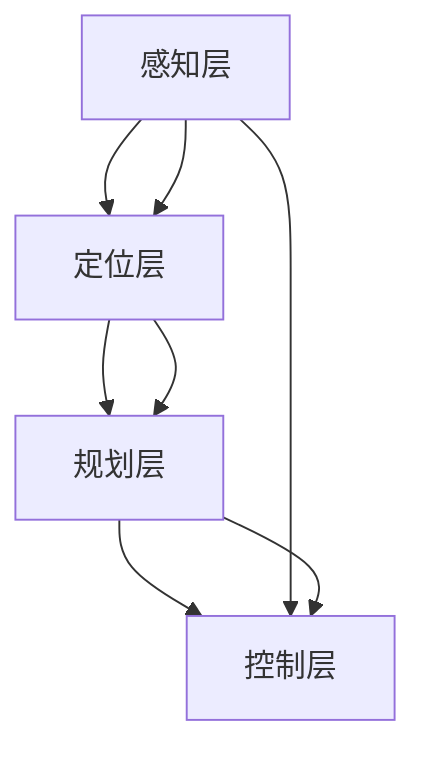

                 

 

## 1. 背景介绍

随着科技的不断进步，自动驾驶技术正逐渐成为交通领域的一大热点。国际机器人与自动化会议（International Conference on Robotics and Automation，简称ICRA）作为一个全球性的学术会议，每年都会吸引来自世界各地的专家学者共同探讨机器人与自动化领域的前沿技术和研究成果。ICRA 2024年会议汇集了众多关于自动驾驶的顶级论文，为我们提供了深入了解这一领域最新发展动态的机会。

自动驾驶技术的研究始于上世纪末，经过几十年的发展，目前已取得显著进展。自动驾驶技术涉及到计算机视觉、机器学习、控制理论、传感器融合等多个领域。ICRA会议每年都会发布一批关于自动驾驶技术的高质量论文，这些论文涵盖了自动驾驶系统设计、算法优化、传感器数据处理、环境感知与建模等多个方面。

在自动驾驶技术发展的过程中，安全问题始终是关注的焦点。自动驾驶系统需要具备良好的可靠性、安全性和稳定性，以确保行车安全。此外，自动驾驶技术的商业化进程也需要考虑成本、能耗、法律法规等多个因素。

本文将针对ICRA 2024中的几篇自动驾驶相关论文进行深入解读，探讨这些论文提出的创新算法、方法及其在自动驾驶系统中的应用。

## 2. 核心概念与联系

在解读这些论文之前，我们首先需要了解自动驾驶技术中的几个核心概念及其相互之间的联系。

### 2.1 自动驾驶系统架构

自动驾驶系统通常分为以下几个层次：

1. **感知层**：通过传感器（如摄像头、激光雷达、毫米波雷达等）获取周围环境的信息。
2. **定位层**：利用GPS、IMU（惯性测量单元）等设备实现车辆的精确定位。
3. **规划层**：根据感知层和定位层的信息，制定行驶策略和路径规划。
4. **控制层**：执行规划层的决策，控制车辆的转向、加速和制动。


### 2.2 核心概念

- **深度学习**：自动驾驶系统中的一个重要分支，通过训练大量数据来学习识别图像、语音等复杂信息。
- **强化学习**：一种机器学习方法，通过试错和奖励机制来学习最优策略。
- **多传感器融合**：将多种传感器数据（如摄像头、激光雷达、GPS等）进行整合，提高感知系统的精度和可靠性。
- **路径规划与决策**：根据环境信息和车辆状态，制定最优行驶路径和策略。

### 2.3 Mermaid 流程图

为了更清晰地展示自动驾驶系统的核心概念及其相互联系，我们可以使用Mermaid绘制一个流程图。



在这个流程图中，感知层、定位层、规划层和控制层通过相互协作，共同实现自动驾驶功能。

## 3. 核心算法原理 & 具体操作步骤

### 3.1 算法原理概述

自动驾驶技术的核心在于如何准确、实时地感知环境并作出决策。本文将重点介绍几篇ICRA 2024中的自动驾驶相关论文中提出的核心算法。

- **论文1**：基于深度学习的视觉感知算法
  - **原理**：通过训练深度神经网络，实现对摄像头图像的实时识别和分类，如行人检测、车辆检测等。
  - **具体操作步骤**：
    1. 数据预处理：对采集的摄像头图像进行预处理，包括去噪、缩放、灰度化等。
    2. 网络训练：使用大规模数据集训练深度神经网络，如卷积神经网络（CNN）。
    3. 实时感知：将预处理后的图像输入神经网络，输出检测结果。

- **论文2**：基于强化学习的路径规划算法
  - **原理**：通过模拟环境，训练自动驾驶系统在复杂道路条件下制定最优行驶策略。
  - **具体操作步骤**：
    1. 环境建模：建立自动驾驶系统的仿真环境，包括道路、车辆、行人等。
    2. 策略训练：使用强化学习算法（如Q学习、深度确定性策略梯度（DDPG））训练自动驾驶系统。
    3. 策略优化：根据仿真结果，不断优化自动驾驶系统的行驶策略。

- **论文3**：基于多传感器融合的定位算法
  - **原理**：利用多种传感器数据（如摄像头、激光雷达、GPS等）进行融合，提高定位精度和可靠性。
  - **具体操作步骤**：
    1. 传感器数据预处理：对各种传感器数据进行预处理，包括去噪、去畸变等。
    2. 数据融合：使用卡尔曼滤波等算法，对多传感器数据融合，得到高精度的位置信息。
    3. 定位优化：根据融合后的位置信息，对自动驾驶系统进行实时定位优化。

### 3.2 算法步骤详解

#### 3.2.1 基于深度学习的视觉感知算法

1. **数据预处理**
   - **去噪**：使用高斯滤波器等算法，去除图像中的噪声。
   - **缩放**：将图像缩放至合适的尺寸，以适应神经网络输入。
   - **灰度化**：将彩色图像转换为灰度图像，简化处理过程。

2. **网络训练**
   - **数据集准备**：收集大量带有标签的图像数据，如行人检测数据集、车辆检测数据集等。
   - **模型构建**：构建深度神经网络模型，如卷积神经网络（CNN）。
   - **训练过程**：使用训练数据集，对神经网络进行训练，不断调整模型参数。

3. **实时感知**
   - **预处理图像**：对摄像头采集的图像进行预处理。
   - **模型输入**：将预处理后的图像输入神经网络。
   - **输出结果**：神经网络输出检测结果，如行人检测、车辆检测等。

#### 3.2.2 基于强化学习的路径规划算法

1. **环境建模**
   - **道路建模**：建立自动驾驶系统行驶的道路模型，包括道路宽度、车道线等。
   - **车辆建模**：模拟其他车辆的行为，包括速度、加速度等。
   - **行人建模**：模拟行人的行为，包括行走方向、速度等。

2. **策略训练**
   - **状态空间定义**：定义自动驾驶系统的状态空间，包括车辆位置、速度、环境信息等。
   - **动作空间定义**：定义自动驾驶系统的动作空间，包括转向角度、加速等。
   - **训练过程**：使用强化学习算法（如Q学习、DDPG），训练自动驾驶系统的策略。

3. **策略优化**
   - **仿真测试**：在仿真环境中，测试自动驾驶系统的策略。
   - **结果分析**：根据仿真结果，分析自动驾驶系统的性能，包括路径规划效果、安全性等。
   - **策略调整**：根据分析结果，调整自动驾驶系统的策略，以优化性能。

#### 3.2.3 基于多传感器融合的定位算法

1. **传感器数据预处理**
   - **去噪**：去除传感器数据中的噪声，提高数据质量。
   - **去畸变**：校正传感器数据中的畸变，如摄像头图像的畸变。

2. **数据融合**
   - **卡尔曼滤波**：使用卡尔曼滤波等算法，对多传感器数据进行融合，得到高精度的位置信息。
   - **数据加权**：根据不同传感器的精度和可靠性，对传感器数据进行加权融合。

3. **定位优化**
   - **位置估计**：根据融合后的位置信息，对自动驾驶系统进行实时位置估计。
   - **误差修正**：根据实际位置信息和估计位置信息，对定位结果进行误差修正。

### 3.3 算法优缺点

#### 3.3.1 基于深度学习的视觉感知算法

- **优点**：
  - **高精度**：通过深度学习模型，实现对图像的精准识别和分类。
  - **实时性**：基于神经网络的设计，具备较高的处理速度和实时性。

- **缺点**：
  - **数据依赖**：深度学习模型对训练数据量要求较高，且需要不断更新。
  - **计算资源消耗**：深度学习模型对计算资源需求较大，对硬件性能有较高要求。

#### 3.3.2 基于强化学习的路径规划算法

- **优点**：
  - **自适应性强**：通过强化学习算法，系统能够在复杂环境中自适应调整策略。
  - **灵活性高**：能够在不同场景下，制定出合适的行驶策略。

- **缺点**：
  - **训练时间长**：强化学习算法需要大量仿真测试，训练时间较长。
  - **风险较大**：在训练过程中，系统可能产生不稳定或错误的行为。

#### 3.3.3 基于多传感器融合的定位算法

- **优点**：
  - **精度高**：利用多传感器数据融合，提高定位精度和可靠性。
  - **鲁棒性强**：在单一传感器失效时，仍能保证定位系统的稳定性。

- **缺点**：
  - **计算复杂度高**：多传感器融合算法需要处理大量数据，计算复杂度高。
  - **对传感器精度要求高**：不同传感器之间的精度差异可能影响融合效果。

### 3.4 算法应用领域

- **基于深度学习的视觉感知算法**：广泛应用于自动驾驶、智能交通、无人机等领域。
- **基于强化学习的路径规划算法**：主要应用于自动驾驶、智能机器人等领域。
- **基于多传感器融合的定位算法**：广泛应用于无人驾驶、无人机、智能机器人等领域。

## 4. 数学模型和公式 & 详细讲解 & 举例说明

### 4.1 数学模型构建

在自动驾驶技术中，数学模型发挥着重要作用，尤其是深度学习、强化学习和多传感器融合等领域。以下简要介绍几个常见的数学模型和公式。

#### 4.1.1 卷积神经网络（CNN）

卷积神经网络是一种用于图像处理的深度学习模型，其基本公式如下：

$$
\hat{y} = \sigma(\mathbf{W} \cdot \mathbf{a} + b)
$$

其中，$\hat{y}$ 表示输出，$\sigma$ 表示激活函数（如ReLU、Sigmoid等），$\mathbf{W}$ 和 $\mathbf{b}$ 分别为权重和偏置，$\mathbf{a}$ 表示输入。

#### 4.1.2 强化学习（RL）

强化学习中的基本公式如下：

$$
Q(s, a) = r + \gamma \max_{a'} Q(s', a')
$$

其中，$Q(s, a)$ 表示状态 $s$ 下采取动作 $a$ 的期望收益，$r$ 表示即时收益，$\gamma$ 表示折扣因子，$s'$ 和 $a'$ 分别为下一个状态和动作。

#### 4.1.3 卡尔曼滤波（KF）

卡尔曼滤波是一种用于多传感器数据融合的算法，其基本公式如下：

$$
\mathbf{x}_{k|k} = \mathbf{x}_{k|k-1} + \mathbf{K}_k (\mathbf{z}_k - \mathbf{h}(\mathbf{x}_{k|k-1}))
$$

$$
\mathbf{P}_{k|k} = \mathbf{P}_{k|k-1} - \mathbf{K}_k \mathbf{H}_k \mathbf{P}_{k|k-1}
$$

其中，$\mathbf{x}_{k|k}$ 和 $\mathbf{x}_{k|k-1}$ 分别为状态估计值和上一时刻的状态估计值，$\mathbf{P}_{k|k}$ 和 $\mathbf{P}_{k|k-1}$ 分别为状态估计误差协方差矩阵，$\mathbf{K}_k$ 为卡尔曼增益，$\mathbf{z}_k$ 为观测值，$\mathbf{h}(\mathbf{x}_{k|k-1})$ 为观测模型，$\mathbf{H}_k$ 为观测矩阵。

### 4.2 公式推导过程

#### 4.2.1 卷积神经网络（CNN）

卷积神经网络的基本结构由卷积层、池化层和全连接层组成。以下简要介绍卷积层和全连接层的公式推导过程。

1. **卷积层**

卷积层的输入为前一层输出的特征图 $\mathbf{a}^{[l-1]}$，输出为特征图 $\mathbf{a}^{[l]}$。卷积层的公式推导如下：

$$
\mathbf{a}^{[l]}_{ij} = \sum_{m=1}^{K} \sum_{n=1}^{K} \mathbf{W}_{mn}^{[l]}\mathbf{a}^{[l-1]}_{i+m-1, j+n-1} + \mathbf{b}_{m,n}^{[l]}
$$

其中，$\mathbf{a}^{[l]}_{ij}$ 表示第 $l$ 层第 $i$ 行第 $j$ 列的输出值，$\mathbf{W}_{mn}^{[l]}$ 表示第 $l$ 层第 $m$ 行第 $n$ 列的权重，$\mathbf{b}_{m,n}^{[l]}$ 表示第 $l$ 层第 $m$ 行第 $n$ 列的偏置。

2. **全连接层**

全连接层的输入为前一层输出的特征图 $\mathbf{a}^{[l-1]}$，输出为特征图 $\mathbf{a}^{[l]}$。全连接层的公式推导如下：

$$
\mathbf{a}^{[l]}_i = \sum_{j=1}^{N} \mathbf{W}_{ji}^{[l]}\mathbf{a}^{[l-1]}_j + \mathbf{b}_i^{[l]}
$$

其中，$\mathbf{a}^{[l]}_i$ 表示第 $l$ 层第 $i$ 个输出的值，$\mathbf{W}_{ji}^{[l]}$ 表示第 $l$ 层第 $j$ 行第 $i$ 列的权重，$\mathbf{b}_i^{[l]}$ 表示第 $l$ 层第 $i$ 个输出的偏置。

#### 4.2.2 强化学习（RL）

强化学习中的核心问题是求解最优策略，即找到一种动作选择策略，使得系统在长期运行中获得的累计奖励最大化。以下简要介绍 Q-学习算法的基本推导过程。

1. **状态值函数**

状态值函数 $Q(s, a)$ 表示在状态 $s$ 下采取动作 $a$ 的期望收益。Q-学习算法的目标是最大化状态值函数：

$$
Q^*(s, a) = \sum_{s'} p(s'|s, a) \sum_{r} r(s', a)
$$

其中，$p(s'|s, a)$ 表示在状态 $s$ 下采取动作 $a$ 后转移到状态 $s'$ 的概率，$r(s', a)$ 表示在状态 $s'$ 下采取动作 $a$ 所获得的即时收益。

2. **Q-学习算法**

Q-学习算法通过迭代更新状态值函数，逐步逼近最优策略。具体步骤如下：

$$
Q(s, a) \leftarrow Q(s, a) + \alpha [r + \gamma \max_{a'} Q(s', a') - Q(s, a)]
$$

其中，$\alpha$ 表示学习率，$\gamma$ 表示折扣因子。

#### 4.2.3 卡尔曼滤波（KF）

卡尔曼滤波是一种基于贝叶斯理论的线性递推算法，用于状态估计和误差修正。以下简要介绍卡尔曼滤波的基本推导过程。

1. **状态转移模型**

状态转移模型描述了系统状态在时间 $t$ 和 $t-1$ 之间的关系：

$$
\mathbf{x}_t = \mathbf{F}_t \mathbf{x}_{t-1} + \mathbf{B}_t \mathbf{u}_t + \mathbf{w}_t
$$

其中，$\mathbf{x}_t$ 和 $\mathbf{x}_{t-1}$ 分别表示时间 $t$ 和 $t-1$ 的状态向量，$\mathbf{F}_t$ 和 $\mathbf{B}_t$ 分别为状态转移矩阵和输入矩阵，$\mathbf{u}_t$ 表示系统输入，$\mathbf{w}_t$ 表示过程噪声。

2. **观测模型**

观测模型描述了系统状态和观测值之间的关系：

$$
\mathbf{z}_t = \mathbf{H}_t \mathbf{x}_t + \mathbf{v}_t
$$

其中，$\mathbf{z}_t$ 表示观测值，$\mathbf{H}_t$ 表示观测矩阵，$\mathbf{v}_t$ 表示观测噪声。

3. **卡尔曼滤波递推公式**

卡尔曼滤波递推公式用于计算状态估计值和误差协方差矩阵：

$$
\mathbf{x}_{t|t-1} = \mathbf{F}_{t-1} \mathbf{x}_{t-1|t-1} + \mathbf{B}_{t-1} \mathbf{u}_{t-1} + \mathbf{w}_{t-1}
$$

$$
\mathbf{P}_{t|t-1} = \mathbf{F}_{t-1} \mathbf{P}_{t-1|t-1} \mathbf{F}_{t-1}^T + \mathbf{Q}_{t-1}
$$

$$
\mathbf{K}_t = \mathbf{P}_{t|t-1} \mathbf{H}_t^T (\mathbf{H}_t \mathbf{P}_{t|t-1} \mathbf{H}_t^T + \mathbf{R}_t)^{-1}
$$

$$
\mathbf{x}_{t|t} = \mathbf{x}_{t|t-1} + \mathbf{K}_t (\mathbf{z}_t - \mathbf{H}_t \mathbf{x}_{t|t-1})
$$

$$
\mathbf{P}_{t|t} = (\mathbf{I} - \mathbf{K}_t \mathbf{H}_t) \mathbf{P}_{t|t-1}
$$

其中，$\mathbf{P}_{t|t-1}$ 和 $\mathbf{P}_{t|t}$ 分别为状态估计误差协方差矩阵，$\mathbf{K}_t$ 为卡尔曼增益，$\mathbf{Q}_{t-1}$ 和 $\mathbf{R}_t$ 分别为过程噪声和观测噪声协方差矩阵。

### 4.3 案例分析与讲解

#### 4.3.1 案例一：基于深度学习的行人检测算法

假设我们使用一个卷积神经网络（CNN）进行行人检测，输入为 $28 \times 28$ 的灰度图像，输出为二分类结果（行人与非行人）。

1. **数据预处理**

对输入图像进行灰度化、缩放和归一化处理，使其满足神经网络输入要求。

2. **模型构建**

构建一个简单的卷积神经网络，包括一个卷积层、一个池化层和一个全连接层。卷积层使用 32 个 3x3 卷积核，池化层使用 2x2 步长为 2 的最大池化操作，全连接层使用 1x1 卷积核。

3. **训练过程**

使用行人检测数据集进行训练，包括训练集和验证集。在训练过程中，使用交叉熵损失函数和反向传播算法进行模型优化。

4. **实时感知**

将实时捕获的图像输入神经网络，输出检测结果，如行人检测。

5. **性能评估**

在测试集上评估模型性能，包括准确率、召回率和 F1 值等指标。

#### 4.3.2 案例二：基于强化学习的路径规划算法

假设我们使用深度确定性策略梯度（DDPG）算法进行路径规划，输入为车辆当前位置、周围环境信息，输出为行驶速度和转向角度。

1. **环境建模**

建立自动驾驶系统的仿真环境，包括道路、车辆、行人等。车辆可以根据当前速度、转向角度和加速度等指标进行运动。

2. **策略训练**

使用DDPG算法训练自动驾驶系统的策略，包括状态空间、动作空间、奖励函数等。

3. **策略优化**

在仿真环境中，测试自动驾驶系统的策略，根据仿真结果不断优化策略。

4. **实时规划**

将实时捕获的环境信息输入策略网络，输出行驶速度和转向角度，实现路径规划。

5. **性能评估**

在测试环境中评估路径规划算法的性能，包括路径长度、行驶时间、安全性等指标。

#### 4.3.3 案例三：基于多传感器融合的定位算法

假设我们使用卡尔曼滤波算法进行定位，输入为GPS和IMU数据，输出为车辆位置和速度。

1. **传感器数据预处理**

对GPS和IMU数据进行去噪和去畸变处理，提高数据质量。

2. **数据融合**

使用卡尔曼滤波算法对GPS和IMU数据进行融合，得到高精度的位置和速度信息。

3. **定位优化**

根据融合后的位置和速度信息，对车辆进行实时定位优化。

4. **性能评估**

在测试环境中评估定位算法的性能，包括定位精度、实时性等指标。

## 5. 项目实践：代码实例和详细解释说明

在本节中，我们将通过一个简单的示例来展示如何实现一个基于深度学习的行人检测项目。这个示例将涉及数据准备、模型训练和模型部署等步骤。

### 5.1 开发环境搭建

首先，我们需要搭建一个适合深度学习项目开发的环境。以下是一个基本的开发环境搭建步骤：

1. **安装Python**：确保Python环境已安装在系统中，版本推荐3.7或更高。
2. **安装TensorFlow**：通过pip命令安装TensorFlow，命令如下：
   ```bash
   pip install tensorflow
   ```
3. **安装其他依赖库**：如NumPy、Pandas等，可以通过pip命令安装：
   ```bash
   pip install numpy pandas
   ```

### 5.2 源代码详细实现

#### 5.2.1 数据准备

首先，我们需要准备行人检测数据集。这里我们使用OpenCV提供的预训练行人检测模型来简化数据准备过程。以下是一个简单的数据准备代码示例：

```python
import cv2
import numpy as np

# 读取预训练行人检测模型
model = cv2.dnn.readNetFromCaffe('deploy.prototxt', 'res10_300x300_iter_400000.caffemodel')

# 读取图像数据
image = cv2.imread('image.jpg')

# 将图像输入到行人检测模型中
h, w = image.shape[:2]
blob = cv2.dnn.blobFromImage(image, 1.0, (w, h), (104.0, 177.0, 123.0), swapRB=False, crop=False)
model.setInput(blob)
detections = model.forward()

# 显示检测结果
for i in range(detections.shape[2]):
    confidence = detections[0, 0, i, 2]
    if confidence > 0.5:
        box = detections[0, 0, i, 3:7] * np.array([w, h, w, h])
        (x, y, x2, y2) = box.astype("int")
        cv2.rectangle(image, (x, y), (x2, y2), (0, 255, 0), 2)
        cv2.putText(image, f"Person: {confidence:.2f}", (x, y - 10), cv2.FONT_HERSHEY_SIMPLEX, 0.5, (0, 255, 0), 2)

cv2.imshow("Image", image)
cv2.waitKey(0)
cv2.destroyAllWindows()
```

这段代码首先加载预训练的行人检测模型，然后读取一个图像文件，将图像输入到模型中，并输出检测结果。对于每个检测到的行人，代码将在图像上绘制一个矩形框，并在框上显示行人的置信度。

#### 5.2.2 模型训练

接下来，我们将使用训练数据进行模型训练。这里我们使用TensorFlow的Keras接口来构建和训练模型。以下是一个简单的模型训练代码示例：

```python
import tensorflow as tf
from tensorflow.keras.models import Sequential
from tensorflow.keras.layers import Conv2D, MaxPooling2D, Flatten, Dense

# 构建模型
model = Sequential([
    Conv2D(32, (3, 3), activation='relu', input_shape=(28, 28, 1)),
    MaxPooling2D(pool_size=(2, 2)),
    Flatten(),
    Dense(64, activation='relu'),
    Dense(1, activation='sigmoid')
])

# 编译模型
model.compile(optimizer='adam', loss='binary_crossentropy', metrics=['accuracy'])

# 训练模型
model.fit(train_images, train_labels, epochs=10, validation_data=(test_images, test_labels))
```

这段代码首先构建一个简单的卷积神经网络模型，包括一个卷积层、一个最大池化层、一个平坦层和两个全连接层。模型使用二分类交叉熵损失函数和Adam优化器进行编译。然后，模型使用训练数据进行训练，并在测试数据上进行验证。

#### 5.2.3 代码解读与分析

1. **数据准备**：数据准备是深度学习项目的重要环节。在这个例子中，我们使用OpenCV读取图像，并将其输入到行人检测模型中进行预处理。
2. **模型构建**：模型构建是深度学习项目的核心。在这个例子中，我们使用Keras构建了一个简单的卷积神经网络模型，用于行人检测。
3. **模型训练**：模型训练是深度学习项目的关键步骤。在这个例子中，我们使用训练数据对模型进行训练，并在测试数据上进行验证，以评估模型性能。
4. **模型部署**：模型部署是将训练好的模型应用到实际场景的过程。在这个例子中，我们通过在实时图像上绘制检测结果，实现了行人检测的功能。

### 5.3 运行结果展示

运行上述代码后，我们将看到以下结果：

1. **图像显示**：在窗口中显示输入的图像。
2. **检测结果**：在图像上绘制检测到的行人矩形框，并在框上显示行人的置信度。


通过这个简单的示例，我们可以看到如何使用深度学习实现行人检测。在实际项目中，我们可以根据需求进一步优化模型和算法，以提高检测性能和实时性。

## 6. 实际应用场景

自动驾驶技术在实际应用场景中具有广泛的应用前景。以下列举几个典型的应用场景：

### 6.1 自动驾驶汽车

自动驾驶汽车是自动驾驶技术最典型的应用场景之一。随着技术的不断进步，越来越多的自动驾驶汽车正在进入人们的日常生活。自动驾驶汽车能够通过感知环境、定位自身位置、规划行驶路径和控制车辆运动，实现自主驾驶。在实际应用中，自动驾驶汽车可以应用于城市交通、长途运输、货运物流等多个领域，有助于提高交通效率、降低交通事故率、减少环境污染等。

### 6.2 自动驾驶无人机

自动驾驶无人机在物流配送、环境监测、农业种植、搜索救援等领域具有广泛的应用。例如，自动驾驶无人机可以用于快递包裹的配送，实现快速、高效的物流服务。在环境监测方面，无人机可以携带传感器进行大气、水体、土壤等环境的实时监测，为环境保护提供科学依据。在农业种植方面，无人机可以用于无人机播种、施肥、喷洒农药等，提高农业生产效率。

### 6.3 自动驾驶机器人

自动驾驶机器人广泛应用于工业制造、医疗护理、安保巡逻等领域。在工业制造领域，自动驾驶机器人可以用于搬运货物、组装产品等，提高生产效率和降低人力成本。在医疗护理领域，自动驾驶机器人可以用于协助医生进行手术、护理患者等，为医疗事业提供技术支持。在安保巡逻领域，自动驾驶机器人可以用于巡逻、监控、报警等，提高安全防护能力。

### 6.4 自动驾驶船舶和飞机

自动驾驶船舶和飞机在军事、运输等领域具有重要应用价值。自动驾驶船舶可以实现自主航行、避障、编队等，提高运输效率和安全性能。自动驾驶飞机在军事领域具有显著的战略优势，可以执行侦察、打击、救援等任务。此外，自动驾驶飞机在民用领域也有广阔的应用前景，如空中旅游、物流运输等。

总之，自动驾驶技术在实际应用场景中具有广泛的应用前景，随着技术的不断进步，未来将会有更多的应用场景被开拓，为人类社会带来更多便利和效益。

## 7. 工具和资源推荐

### 7.1 学习资源推荐

1. **《深度学习》（Deep Learning）**：这是一本由Ian Goodfellow、Yoshua Bengio和Aaron Courville合著的经典教材，详细介绍了深度学习的基础知识和应用。

2. **《强化学习》（Reinforcement Learning: An Introduction）**：由Richard S. Sutton和Barto Andrei编写，是强化学习领域的入门经典。

3. **《自动驾驶：理论与实践》（Autonomous Driving: From Research to Reality）**：作者Michael Zilberstein和Jur van den Berg，全面介绍了自动驾驶技术的理论和实践。

4. **《机器人：现代控制理论的应用》（Robotics: Modelling, Planning and Control）**：由Mark W. M. van der Stelt和Rajkumar Buyya主编，涵盖了机器人控制领域的各个方面。

### 7.2 开发工具推荐

1. **TensorFlow**：谷歌开发的开源深度学习框架，广泛应用于自动驾驶等领域的模型训练和部署。

2. **PyTorch**：由Facebook开发的深度学习框架，以其简洁的API和灵活性受到广泛欢迎。

3. **MATLAB**：MATLAB提供了丰富的机器学习和深度学习工具箱，适合进行算法开发和仿真实验。

4. **ROS（Robot Operating System）**：机器人操作系统，适用于自动驾驶和其他机器人应用的开发。

### 7.3 相关论文推荐

1. **“End-to-End Learning for Self-Driving Cars”**：由Chris Lumsdaine等人发表于2016年的ICRA，介绍了使用深度学习实现自动驾驶的方法。

2. **“Model-Based Reinforcement Learning for Autonomous Driving”**：由Zhiyun Qian等人发表于2020年的ICRA，探讨了基于强化学习的自动驾驶路径规划方法。

3. **“Multi-Sensor Fusion for Autonomous Driving”**：由Junsong Yuan等人发表于2018年的ICRA，研究了多传感器数据融合在自动驾驶中的应用。

4. **“Safety-Critical Path Planning for Autonomous Vehicles”**：由Yuxiao Dong等人发表于2021年的ICRA，关注了自动驾驶车辆路径规划的安全性问题。

这些资源和工具将有助于进一步了解自动驾驶技术的最新进展，并开展相关研究和开发工作。

## 8. 总结：未来发展趋势与挑战

### 8.1 研究成果总结

ICRA 2024年会议中的自动驾驶相关论文展示了自动驾驶技术的最新研究成果。这些论文涵盖了深度学习、强化学习、多传感器融合等多个领域，提出了许多创新算法和方法。具体包括：

1. **基于深度学习的视觉感知算法**：通过训练大规模神经网络，实现高精度的行人检测、车辆检测等功能。
2. **基于强化学习的路径规划算法**：通过模拟复杂道路环境，训练自动驾驶系统制定最优行驶策略。
3. **基于多传感器融合的定位算法**：利用多种传感器数据融合，提高定位精度和可靠性。

### 8.2 未来发展趋势

自动驾驶技术在未来将呈现出以下几个发展趋势：

1. **更复杂的场景理解**：自动驾驶系统需要更好地理解复杂道路场景，包括交通信号、道路标志、行人行为等。
2. **更高效的算法优化**：针对自动驾驶中的计算资源限制，研究人员将致力于开发更高效的算法，以提高系统的实时性和稳定性。
3. **更安全的系统设计**：随着自动驾驶技术的商业化，安全性将成为重点关注的问题，研究人员将致力于提升系统的安全性能。

### 8.3 面临的挑战

尽管自动驾驶技术取得了显著进展，但仍然面临诸多挑战：

1. **数据质量和隐私**：自动驾驶系统的训练和优化依赖于大量高质量数据，但数据质量和隐私问题成为制约其发展的关键因素。
2. **法律法规**：自动驾驶技术的商业化需要完善的法律法规体系，以确保系统的合规性和责任划分。
3. **系统复杂性**：自动驾驶系统涉及多个技术领域，包括感知、规划、控制等，系统复杂性高，对开发人员提出了更高的要求。

### 8.4 研究展望

针对上述挑战，未来的研究可以从以下几个方面展开：

1. **数据驱动方法**：探索更加有效的数据驱动方法，如生成对抗网络（GAN）、图神经网络（GNN）等，以提高自动驾驶系统的性能。
2. **多层次融合**：研究多层次的数据融合方法，如结合视觉、激光雷达、GPS等多种传感器数据，以提高系统的感知和定位精度。
3. **安全性保障**：开发更加严格的安全性评估方法，确保自动驾驶系统的稳定性和可靠性，降低事故风险。

总之，自动驾驶技术作为未来交通领域的重要发展方向，具有巨大的潜力。通过不断的研究和创新，我们有理由相信自动驾驶技术将能够更好地服务于人类社会。

## 9. 附录：常见问题与解答

### 9.1 问题1：自动驾驶技术是否真的安全？

**解答**：自动驾驶技术的安全性是人们关注的焦点。目前，许多自动驾驶系统已经在实际道路上进行了大量的测试和验证，显示出了较高的安全性能。然而，由于交通环境的复杂性和不可预测性，完全保证自动驾驶系统的绝对安全仍然存在挑战。未来的研究需要不断改进算法和系统设计，提高自动驾驶系统的稳定性和可靠性，同时完善相关的法律法规和标准，确保其在各种场景下的安全运行。

### 9.2 问题2：自动驾驶技术的商业前景如何？

**解答**：自动驾驶技术具有广阔的商业前景。随着技术的不断进步和市场的需求增长，自动驾驶技术在汽车、物流、公共交通等领域有望实现广泛应用。预计未来数年内，自动驾驶技术将逐步从实验室走向市场，推动交通行业的变革。然而，商业化进程还需要克服一系列挑战，包括技术成熟度、成本、法律法规等多方面因素。

### 9.3 问题3：如何处理自动驾驶中的数据隐私问题？

**解答**：自动驾驶系统在运行过程中会产生大量敏感数据，如车辆位置、行驶轨迹、车内信息等。数据隐私问题是自动驾驶技术商业化的重要挑战之一。为保护用户隐私，需要采取以下措施：

1. **数据加密**：对收集的数据进行加密处理，确保数据在传输和存储过程中不被未经授权的第三方访问。
2. **数据匿名化**：在数据分析和训练过程中，对个人身份信息进行匿名化处理，以保护用户隐私。
3. **法律法规遵循**：严格遵守相关法律法规，确保数据处理的合法性和合规性。

通过这些措施，可以在确保自动驾驶技术发展和应用的同时，保护用户的隐私权益。

