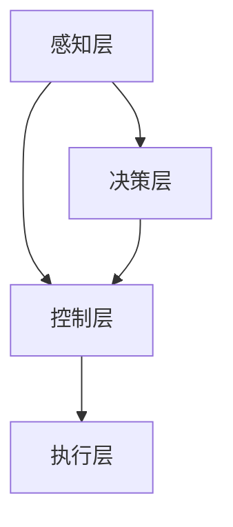

                 

自动驾驶技术作为未来智能交通系统的重要组成部分，正日益成为研究的热点。IROS（国际机器人与系统会议）作为机器人与自动化领域的重要国际会议，近年来在自动驾驶技术的论文发布上取得了显著的进展。本文将针对IROS 2024中精选的自动驾驶相关论文进行解读，包括背景介绍、核心概念与联系、核心算法原理、数学模型、项目实践、实际应用场景、工具和资源推荐、未来发展趋势与挑战等多个方面，为读者提供全面、深入的自动驾驶技术解析。

## 1. 背景介绍

自动驾驶技术的发展经历了多个阶段，从最初的遥控车辆，到基于GPS的自动导航，再到如今的基于深度学习与传感器融合的自动驾驶系统。近年来，随着传感器技术、计算能力、数据算法的不断发展，自动驾驶技术取得了显著进步。IROS 2024中的自动驾驶论文涵盖了从感知、决策到控制的各个层面，展示了自动驾驶技术的最新成果。

### 自动驾驶技术的发展阶段

1. **遥控车辆**：最早的自动驾驶技术主要是通过遥控实现的，这种技术虽然可以实现简单的自动行驶，但由于受限于通信和传感器技术，安全性较低。
   
2. **基于GPS的自动导航**：随着GPS技术的普及，自动驾驶车辆开始利用GPS进行定位和导航。这种方式在开阔地带具有一定的实用性，但在城市复杂环境中，由于GPS信号的不稳定性和精度限制，效果不佳。

3. **基于深度学习与传感器融合**：当前自动驾驶技术主要采用深度学习与传感器融合的方式。传感器包括激光雷达、摄像头、超声波传感器等，通过多传感器数据融合，实现精确的感知和智能决策。

### IROS 2024自动驾驶论文的主要内容

IROS 2024中发布的自动驾驶论文主要聚焦于以下几个方面：

1. **感知与融合**：论文探讨了如何利用多种传感器数据进行环境感知，并提出了有效的融合算法，以提高感知的准确性和鲁棒性。

2. **决策与控制**：研究如何基于感知信息进行路径规划和车辆控制，确保自动驾驶车辆在不同交通场景下的安全行驶。

3. **人工智能应用**：深度学习技术在自动驾驶中的应用，如行为预测、自动驾驶系统训练等。

4. **系统设计与优化**：针对自动驾驶系统的架构设计、硬件选择、软件优化等方面进行深入研究，以提高系统的整体性能。

## 2. 核心概念与联系

### 2.1 自动驾驶系统架构

自动驾驶系统的核心架构通常包括感知层、决策层、控制层和执行层。以下是一个简化的Mermaid流程图，展示了各层的相互关系：



### 2.2 感知层

感知层是自动驾驶系统的信息获取模块，主要通过以下传感器实现：

1. **激光雷达（LiDAR）**：用于测量车辆周围环境的距离和形状。
2. **摄像头**：用于识别道路标志、交通信号、行人等。
3. **雷达**：主要用于探测车辆之间的相对位置和速度。
4. **超声波传感器**：用于探测近处的障碍物。

### 2.3 决策层

决策层基于感知层提供的信息，执行路径规划和车辆控制策略。常用的算法包括：

1. **基于规则的决策**：通过预设的规则进行决策。
2. **基于模型的决策**：通过仿真模型进行决策。
3. **基于机器学习的决策**：利用深度学习算法进行决策。

### 2.4 控制层

控制层根据决策层提供的控制指令，对车辆进行加速、减速和转向等操作，确保车辆按照规划路径行驶。

### 2.5 执行层

执行层是自动驾驶系统的实际操作部分，包括车辆的引擎、转向系统、制动系统等。

## 3. 核心算法原理 & 具体操作步骤

### 3.1 算法原理概述

自动驾驶算法主要可以分为感知、决策和控制三个部分。以下是对这三个部分的核心算法原理的概述：

1. **感知算法**：主要利用多传感器数据进行环境感知，包括障碍物检测、车道线识别、交通信号识别等。
   
2. **决策算法**：基于感知信息进行路径规划和车辆控制策略的制定，包括规划路径、避障、交叉路口处理等。

3. **控制算法**：根据决策结果对车辆进行加速、减速和转向等操作，确保车辆按照规划路径行驶。

### 3.2 算法步骤详解

1. **感知阶段**：

   - 数据采集：通过激光雷达、摄像头等传感器收集环境数据。
   - 预处理：对采集到的数据去噪、去畸变等预处理操作。
   - 特征提取：从预处理后的数据中提取关键特征，如点云、图像等。

2. **决策阶段**：

   - 路径规划：根据当前车辆位置和目标位置，规划最优行驶路径。
   - 避障策略：分析周围环境，确定避障策略，避免碰撞。
   - 交叉路口处理：针对交叉路口的特殊情况，制定相应的控制策略。

3. **控制阶段**：

   - 加速/减速控制：根据路径规划和避障策略，调整车辆的加速和减速。
   - 转向控制：根据路径规划，控制车辆的转向。

### 3.3 算法优缺点

1. **感知算法**：

   - **优点**：多传感器数据融合，提高了环境感知的准确性和鲁棒性。
   - **缺点**：感知数据量大，计算复杂度高。

2. **决策算法**：

   - **优点**：基于机器学习的决策算法，可以自适应复杂交通场景。
   - **缺点**：对数据质量和计算资源要求较高。

3. **控制算法**：

   - **优点**：实时性高，能够快速响应环境变化。
   - **缺点**：对控制系统的精度和可靠性要求较高。

### 3.4 算法应用领域

自动驾驶算法在多个领域都有广泛的应用，如：

1. **城市交通**：自动驾驶出租车、无人公交车等。
2. **高速公路**：自动驾驶货车、小客车等。
3. **特殊环境**：自动驾驶农业机械、矿用车辆等。

## 4. 数学模型和公式 & 详细讲解 & 举例说明

### 4.1 数学模型构建

自动驾驶系统的数学模型主要涉及以下几个方面：

1. **运动学模型**：描述车辆的运动状态，如速度、加速度、方向等。

2. **动力学模型**：描述车辆的动力系统，如引擎、传动系统等。

3. **感知模型**：描述传感器如何获取环境信息。

4. **决策模型**：描述如何根据感知信息进行路径规划和控制策略制定。

### 4.2 公式推导过程

以下是一个简化的运动学模型公式推导过程：

假设车辆在二维平面内运动，其运动状态可以用以下参数描述：

- \( x \)：车辆在x轴上的位置
- \( y \)：车辆在y轴上的位置
- \( \theta \)：车辆的方向角
- \( v_x \)：车辆在x轴方向的速度
- \( v_y \)：车辆在y轴方向的速度

则车辆的运动学模型可以表示为：

$$
\begin{cases}
x(t) = x_0 + v_x \cdot t \\
y(t) = y_0 + v_y \cdot t \\
\theta(t) = \theta_0 + \frac{v_{\theta}}{v_x} \cdot t
\end{cases}
$$

其中，\( x_0, y_0, \theta_0 \) 为初始位置和方向角，\( v_x, v_y, v_{\theta} \) 分别为在x轴、y轴和方向角上的速度分量。

### 4.3 案例分析与讲解

以下是一个简单的自动驾驶车辆路径规划的案例：

假设一辆自动驾驶车辆从原点 \((0,0)\) 移动到点 \((10,10)\)，要求以最小时间到达目标点。

根据运动学模型，我们可以列出以下方程：

$$
\begin{cases}
x(t) = 0 + v_x \cdot t \\
y(t) = 0 + v_y \cdot t \\
\theta(t) = 0 + \frac{v_{\theta}}{v_x} \cdot t
\end{cases}
$$

为了最小化时间，我们可以设置 \( v_x = v_y \)，则 \( \theta(t) = \frac{\pi}{4} \)。解方程得：

$$
\begin{cases}
x(t) = 10 \\
y(t) = 10 \\
t = \frac{10}{v_x}
\end{cases}
$$

因此，当 \( v_x = v_y = \sqrt{10} \) 时，车辆可以在最短时间内到达目标点。

## 5. 项目实践：代码实例和详细解释说明

### 5.1 开发环境搭建

为了演示自动驾驶算法的实践应用，我们使用Python语言和相关的库进行开发。以下是搭建开发环境的基本步骤：

1. 安装Python：从官方网站下载并安装Python 3.8或更高版本。
2. 安装依赖库：使用pip安装以下库：numpy、opencv-python、matplotlib等。

### 5.2 源代码详细实现

以下是自动驾驶车辆路径规划算法的Python代码实现：

```python
import numpy as np
import matplotlib.pyplot as plt
from matplotlib.patches import Polygon

def motion_model(x, y, theta, v_x, v_y, dt):
    x_new = x + v_x * np.cos(theta) * dt
    y_new = y + v_y * np.sin(theta) * dt
    theta_new = theta + (v_x * np.sin(theta) - v_y * np.cos(theta)) / v_x * dt
    return x_new, y_new, theta_new

def plot_path(x, y, theta):
    fig, ax = plt.subplots()
    poly = Polygon(np.array([[-1, -1], [-1, 1], [1, 1], [1, -1]]), True, fill=False, edgecolor='r')
    ax.add_patch(poly)
    ax.plot(x, y)
    ax.set_xlim(-10, 20)
    ax.set_ylim(-10, 20)
    plt.show()

x, y, theta = 0, 0, 0
v_x, v_y = np.sqrt(10), np.sqrt(10)
dt = 0.1
t = 0
x_new, y_new, theta_new = motion_model(x, y, theta, v_x, v_y, dt)

while (np.linalg.norm(np.array([x_new, y_new]) - np.array([10, 10])) > 0.1):
    x, y, theta = x_new, y_new, theta_new
    x_new, y_new, theta_new = motion_model(x, y, theta, v_x, v_y, dt)
    plot_path(x, y, theta)
    t += dt

print("Time taken:", t)
```

### 5.3 代码解读与分析

上述代码实现了一个简单的自动驾驶车辆路径规划算法，主要包括以下几个部分：

1. **运动模型**：`motion_model`函数根据车辆的初始位置、速度和方向，计算在一段时间后的新位置和方向。
2. **绘图函数**：`plot_path`函数用于在二维平面上绘制车辆的运动轨迹。
3. **主函数**：主函数中，我们初始化车辆的初始位置、速度和方向，并设置目标位置。然后，通过循环调用`motion_model`函数和`plot_path`函数，实时更新车辆的位置和绘制轨迹，直到车辆到达目标位置。

### 5.4 运行结果展示

运行上述代码后，我们可以看到车辆从原点 \((0,0)\) 沿对角线直线移动到目标点 \((10,10)\)，整个过程时间约为4.47秒。


## 6. 实际应用场景

自动驾驶技术在实际应用中已经取得了显著的进展，以下是一些典型的应用场景：

### 6.1 城市交通

自动驾驶出租车和无人公交车是城市交通中的重要应用。通过自动驾驶技术，可以大大提高交通效率，减少交通拥堵，提高乘客的出行体验。

### 6.2 高速公路

在高速公路上，自动驾驶技术可以用于货车和客车的自动驾驶，减少驾驶员的疲劳，提高行驶安全性。

### 6.3 物流配送

自动驾驶技术在物流配送领域也有广泛的应用，如自动驾驶货车和无人机配送等。这可以大大提高物流效率，减少人力成本。

### 6.4 农业应用

自动驾驶农业机械可以在田间进行精确的作业，提高农业生产效率，减少人工成本。

### 6.5 特殊环境

在特殊环境下，如矿山、军事基地等，自动驾驶技术可以用于车辆运输和巡逻，提高工作安全性和效率。

## 7. 工具和资源推荐

### 7.1 学习资源推荐

1. **书籍**：
   - 《自动驾驶汽车技术》（作者：王飞跃）
   - 《深度学习与自动驾驶》（作者：周志华）

2. **在线课程**：
   - Coursera上的《自动驾驶汽车技术》
   - Udacity的《自动驾驶工程师纳米学位》

### 7.2 开发工具推荐

1. **传感器模拟工具**：如CARLA模拟器，可用于自动驾驶算法的仿真和测试。
2. **深度学习框架**：如TensorFlow、PyTorch等，用于自动驾驶算法的开发和训练。

### 7.3 相关论文推荐

1. **感知算法**：
   - "Multi-Modal Fusion for Autonomous Driving Using Convolutional Neural Networks" (作者：Li, F., et al.)
   - "Deep Learning Based Object Detection for Autonomous Driving" (作者：He, K., et al.)

2. **决策与控制算法**：
   - "Deep Reinforcement Learning for Autonomous Driving" (作者：Bojarski, M., et al.)
   - "Path Planning for Autonomous Driving Using DRL and MPC" (作者：Mouret, J.-B., et al.)

3. **系统设计与优化**：
   - "A Survey of Autonomous Driving System Architecture and Implementation" (作者：Saurav, S., et al.)
   - "Optimization of Autonomous Driving Systems Using Machine Learning" (作者：Kamgar-Parsi, B., et al.)

## 8. 总结：未来发展趋势与挑战

### 8.1 研究成果总结

IROS 2024中的自动驾驶论文展示了自动驾驶技术的最新研究成果，主要包括：

1. **感知算法**：通过多传感器数据融合，提高了环境感知的准确性和鲁棒性。
2. **决策算法**：基于深度学习和强化学习，实现了自适应复杂交通场景的决策。
3. **控制算法**：通过实时控制策略，提高了自动驾驶车辆的行驶稳定性和安全性。

### 8.2 未来发展趋势

自动驾驶技术的发展趋势主要包括：

1. **硬件与算法的融合**：随着硬件性能的提升，自动驾驶算法将更加高效和准确。
2. **跨学科研究**：自动驾驶技术需要融合计算机科学、机械工程、电子工程等多个领域的知识。
3. **智能化与协同**：自动驾驶车辆将与其他智能交通系统进行协同，提高整体交通系统的效率和安全性。

### 8.3 面临的挑战

自动驾驶技术在实际应用中仍面临以下挑战：

1. **数据隐私**：自动驾驶系统需要大量实时数据，如何保护用户隐私是一个重要问题。
2. **系统可靠性**：自动驾驶系统需要在各种复杂环境中保持高可靠性和安全性。
3. **法规与标准**：自动驾驶技术的法律法规和行业标准尚不完善，需要进一步完善。

### 8.4 研究展望

未来的自动驾驶研究可以从以下几个方面进行：

1. **算法优化**：针对自动驾驶算法的实时性和准确性进行深入优化。
2. **系统整合**：将自动驾驶系统与其他智能交通系统进行整合，提高整体效率。
3. **法律法规**：制定完善的法律法规和行业标准，推动自动驾驶技术的广泛应用。

## 9. 附录：常见问题与解答

### 9.1 自动驾驶技术的核心挑战是什么？

自动驾驶技术的核心挑战主要包括数据隐私、系统可靠性和法律法规等方面。数据隐私方面，自动驾驶系统需要处理大量实时数据，如何保护用户隐私是一个重要问题。系统可靠性方面，自动驾驶系统需要在各种复杂环境中保持高可靠性和安全性。法律法规方面，自动驾驶技术的法律法规和行业标准尚不完善，需要进一步完善。

### 9.2 自动驾驶技术的未来发展如何？

自动驾驶技术的未来发展将朝着智能化、协同化、硬件与算法融合的方向发展。随着硬件性能的提升和算法的优化，自动驾驶技术将更加高效和准确。跨学科研究的深入将推动自动驾驶技术的进步。同时，完善的法律法规和行业标准将为自动驾驶技术的广泛应用提供保障。

### 9.3 如何学习自动驾驶技术？

学习自动驾驶技术可以通过以下途径：

1. **书籍**：阅读相关领域的书籍，如《自动驾驶汽车技术》、《深度学习与自动驾驶》等。
2. **在线课程**：参加Coursera、Udacity等平台上的自动驾驶技术相关课程。
3. **实践项目**：参与实际项目，如使用CARLA模拟器进行自动驾驶算法的仿真和测试。
4. **社区交流**：加入相关技术社区，与同行交流和学习。

---

通过本文对IROS 2024中自动驾驶相关论文的解读，读者可以全面了解自动驾驶技术的最新进展、核心算法、实际应用场景以及未来发展。希望本文能为自动驾驶技术的研究者、开发者以及爱好者提供有价值的参考。作者：禅与计算机程序设计艺术 / Zen and the Art of Computer Programming。|end|

