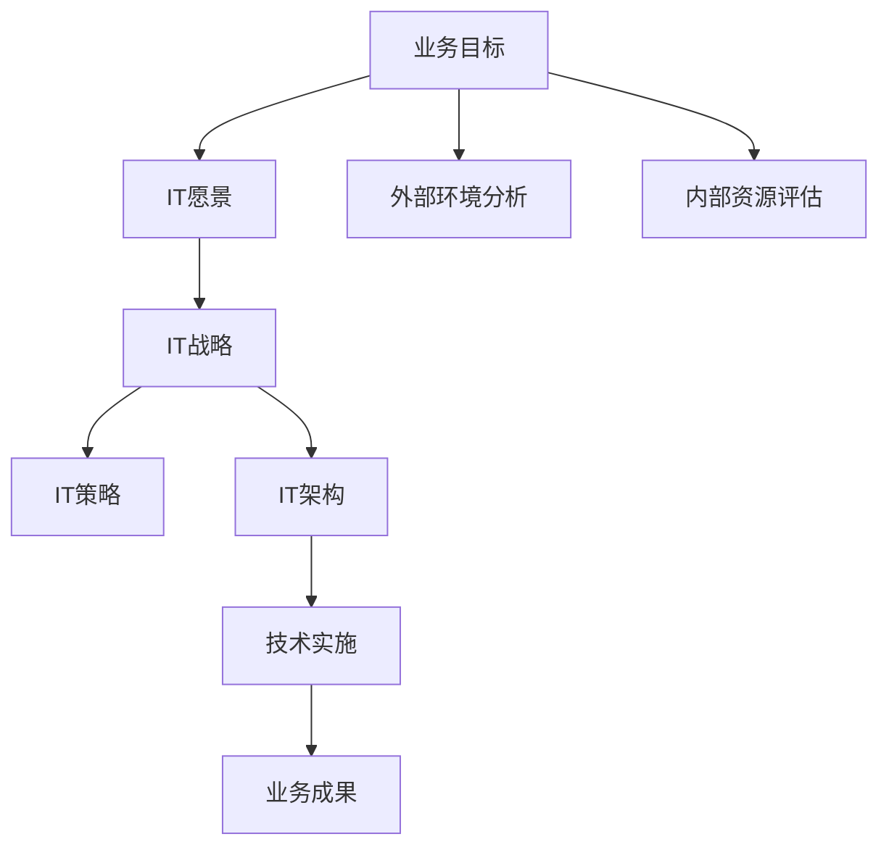

                 

关键词：IT战略规划、公司业务目标、IT架构设计、数字化转型、云计算、数据安全、人工智能、物联网、技术领导力、创新、绩效评估

> 摘要：本文深入探讨了如何在现代企业中制定和执行有效的IT战略规划，以确保IT系统能够与公司的业务目标保持一致。文章首先介绍了IT战略规划的核心概念和重要性，随后详细阐述了战略规划的过程、关键步骤、以及如何在不同的业务场景中应用这些策略。通过结合实际案例，本文旨在为企业的IT领导者提供实用的指导和策略建议，以助力企业在快速变化的市场环境中取得成功。

## 1. 背景介绍

在当今的数字化时代，信息技术（IT）已成为企业成功的关键驱动力。随着云计算、大数据、人工智能、物联网等技术的迅猛发展，企业需要更加精准地制定IT战略规划，以应对快速变化的市场环境和不断升级的客户需求。IT战略规划不仅仅是技术层面的决策，更是企业整体业务战略的重要组成部分。

本文的目标是为企业的IT领导者提供一套系统的、可操作的IT战略规划方法，帮助他们更好地理解和应用这一战略工具，从而实现企业业务目标和IT发展目标的双赢。本文将从以下方面展开讨论：

- IT战略规划的核心概念和重要性
- IT战略规划的过程和方法
- IT战略规划与业务目标的联系
- IT战略规划在不同业务场景中的应用
- IT战略规划的实际案例分享

通过本文的阅读，读者将能够：

- 理解IT战略规划的基本概念和原理
- 掌握制定和执行IT战略规划的关键步骤
- 学习如何将IT战略规划与公司的业务目标相结合
- 获得在具体业务场景中实施IT战略规划的实践经验

## 2. 核心概念与联系

### 2.1 IT战略规划的核心概念

IT战略规划是指企业根据其业务目标和发展规划，结合外部环境的变化和内部资源的实际情况，系统地制定、评估和调整IT战略和策略的过程。它包括以下几个核心概念：

1. **业务目标**：企业通过明确业务目标，指导IT战略规划的方向和重点。
2. **IT愿景**：描述企业在未来IT领域的发展方向和目标，通常包括技术、服务、安全性等方面。
3. **IT战略**：为实现业务目标和IT愿景，制定的长期计划，通常涉及技术选择、投资、资源分配等方面。
4. **IT策略**：为实现IT战略，制定的短期行动计划和具体措施。
5. **IT架构**：支持业务和IT战略的技术架构设计，包括硬件、软件、网络等。

### 2.2 IT战略规划与业务目标的联系

IT战略规划与业务目标之间存在密切的联系。一方面，业务目标是企业制定IT战略规划的出发点，IT战略规划需要根据业务目标来确定技术发展方向、资源配置和优先级。另一方面，IT战略规划的实施和成果将直接影响业务目标的实现，如提高运营效率、增强竞争力、提升客户体验等。

### 2.3 IT战略规划与IT架构的关系

IT架构是IT战略规划的核心组成部分，它为IT战略的实施提供了技术基础和框架。一个好的IT战略规划需要与IT架构紧密配合，确保技术架构能够满足业务需求、支持IT战略目标的实现。同时，IT架构的演进也需要在IT战略规划的指导下进行，以保持技术的前瞻性和适应性。

### 2.4 Mermaid 流程图

为了更直观地展示IT战略规划的核心概念和联系，以下是一个简单的Mermaid流程图：



该流程图展示了从业务目标到IT架构，再到技术实施和业务成果的整个过程。通过这个流程图，我们可以清晰地看到IT战略规划与企业业务目标之间的紧密关系。

## 3. 核心算法原理 & 具体操作步骤

### 3.1 算法原理概述

在IT战略规划中，算法原理起着至关重要的作用。以下是一个简单的算法原理概述：

1. **需求分析**：通过调研和数据分析，识别业务需求和技术需求。
2. **目标设定**：根据需求分析结果，设定IT战略目标和愿景。
3. **方案设计**：设计符合业务目标和愿景的IT解决方案。
4. **资源分配**：根据方案设计，合理分配人力资源、技术资源等。
5. **风险评估**：对规划过程中的风险进行评估和监控。
6. **执行与监控**：实施IT战略规划，并进行持续监控和调整。

### 3.2 算法步骤详解

以下是一个详细的算法步骤详解：

#### 3.2.1 需求分析

1. **业务调研**：与业务部门进行沟通，了解业务目标和需求。
2. **技术调研**：分析现有技术，评估其适用性和可行性。
3. **数据收集**：收集业务数据和技术数据，进行数据分析和挖掘。
4. **需求文档**：编写详细的需求文档，明确业务需求和技术需求。

#### 3.2.2 目标设定

1. **业务目标**：根据业务调研结果，明确企业的业务目标和愿景。
2. **IT目标**：将业务目标转化为IT目标，如提高运营效率、降低成本、提升客户满意度等。
3. **愿景规划**：制定长期的IT愿景，描述企业未来IT发展的方向和目标。

#### 3.2.3 方案设计

1. **技术方案**：设计符合IT目标的系统架构和技术方案。
2. **业务流程**：优化业务流程，确保技术方案能够支持业务需求。
3. **风险评估**：评估技术方案的风险，并提出相应的应对措施。

#### 3.2.4 资源分配

1. **人力资源**：根据项目需求，合理配置人力资源。
2. **技术资源**：选择合适的技术和工具，确保方案的有效实施。
3. **财务预算**：制定项目预算，确保资源合理使用。

#### 3.2.5 风险评估

1. **风险识别**：识别项目实施过程中可能出现的风险。
2. **风险分析**：对风险进行分析和评估，确定风险的优先级。
3. **风险应对**：制定风险应对策略，降低风险对项目的影响。

#### 3.2.6 执行与监控

1. **项目启动**：正式启动项目，按照方案设计和资源分配进行实施。
2. **过程监控**：实时监控项目进度和质量，确保项目按计划进行。
3. **调整与优化**：根据监控结果，及时调整和优化方案，确保项目成功实施。

### 3.3 算法优缺点

**优点**：

- **系统性**：算法原理涵盖了从需求分析到执行监控的整个IT战略规划过程，具有系统性。
- **可操作性**：算法步骤详细，可操作性较强，适用于不同类型的企业和项目。
- **灵活性**：算法允许根据实际情况进行调整和优化，具有较高的灵活性。

**缺点**：

- **复杂性**：算法原理和步骤较为复杂，需要一定的专业知识和经验。
- **实施难度**：算法实施过程中，可能面临各种技术和管理挑战，需要有效应对。

### 3.4 算法应用领域

算法原理适用于各类企业的IT战略规划，包括传统企业、互联网企业、高科技企业等。以下是算法在不同应用领域的简要介绍：

- **传统企业**：通过IT战略规划，实现业务流程优化、运营效率提升、成本降低等目标。
- **互联网企业**：通过IT战略规划，支持快速扩张、技术创新、用户体验提升等需求。
- **高科技企业**：通过IT战略规划，实现技术创新、市场竞争力提升、业务模式创新等目标。

## 4. 数学模型和公式 & 详细讲解 & 举例说明

### 4.1 数学模型构建

在IT战略规划中，构建数学模型可以帮助我们更好地理解和量化业务需求和IT战略目标。以下是一个简单的数学模型构建过程：

#### 4.1.1 模型假设

假设企业有一个明确的业务目标：在一年内提高10%的运营效率。为了实现这一目标，我们需要从以下几个方面进行分析和建模：

1. **效率指标**：定义运营效率的指标，如每小时的产出量、每笔交易的耗时等。
2. **资源消耗**：定义实现效率提升所需的资源消耗，如人力、设备、能源等。
3. **成本指标**：定义成本指标，如人力成本、设备采购成本、运营成本等。

#### 4.1.2 模型构建

基于上述假设，我们可以构建以下数学模型：

\[ \text{效率提升} = \frac{\text{产出量提升}}{\text{资源消耗提升}} \]

其中：

- \( \text{产出量提升} = \text{产出量当前} + \text{产出量增长量} \)
- \( \text{资源消耗提升} = \text{资源消耗当前} + \text{资源消耗减少量} \)

#### 4.1.3 参数设定

为了使模型更具实用性，我们需要设定以下参数：

- \( \text{产出量当前} \)：当前每小时的产出量
- \( \text{产出量增长量} \)：计划通过技术改进和流程优化实现的产出量增长
- \( \text{资源消耗当前} \)：当前每小时的资源消耗
- \( \text{资源消耗减少量} \)：计划通过技术改进和流程优化实现的资源消耗减少

### 4.2 公式推导过程

在构建数学模型的基础上，我们可以推导出以下公式：

\[ \text{效率提升} = \frac{\text{产出量当前} + \text{产出量增长量}}{\text{资源消耗当前} - \text{资源消耗减少量}} \]

#### 4.2.1 基本公式

\[ \text{效率提升} = \frac{\text{产出量当前}}{\text{资源消耗当前}} \]

#### 4.2.2 产出量增长量

\[ \text{产出量增长量} = \text{产出量当前} \times \text{产出量增长率} \]

#### 4.2.3 资源消耗减少量

\[ \text{资源消耗减少量} = \text{资源消耗当前} \times \text{资源消耗减少率} \]

#### 4.2.4 组合公式

将产出量增长量和资源消耗减少量代入基本公式，得到：

\[ \text{效率提升} = \frac{\text{产出量当前} + \text{产出量当前} \times \text{产出量增长率}}{\text{资源消耗当前} - \text{资源消耗当前} \times \text{资源消耗减少率}} \]

简化后得到：

\[ \text{效率提升} = \frac{\text{产出量当前}}{\text{资源消耗当前}} \times \left(1 + \text{产出量增长率}\right) \times \left(1 - \text{资源消耗减少率}\right) \]

### 4.3 案例分析与讲解

以下是一个具体的案例分析：

假设一家制造企业当前每小时的产出量为100件，每小时的资源消耗为10单位。为了提高运营效率，企业计划通过技术改进和流程优化，实现以下目标：

- 产出量增长率：20%
- 资源消耗减少率：10%

根据上述参数，我们可以使用公式计算效率提升：

\[ \text{效率提升} = \frac{100}{10} \times \left(1 + 20\%\right) \times \left(1 - 10\%\right) \]

计算结果为：

\[ \text{效率提升} = 100 \times 1.2 \times 0.9 = 108 \]

这意味着企业的效率提升了8%，在一年内可以实现10%的运营效率提升目标。

通过这个案例，我们可以看到数学模型在IT战略规划中的应用，帮助我们量化业务需求和目标，从而更科学地制定和调整IT战略。

## 5. 项目实践：代码实例和详细解释说明

### 5.1 开发环境搭建

为了更好地展示IT战略规划的实施过程，我们选择一个具体的案例——一家制造企业通过数字化改造提高运营效率。以下是如何搭建开发环境：

1. **硬件环境**：配置服务器、存储设备和网络设备，确保系统能够稳定运行。
2. **软件环境**：安装操作系统、数据库软件、开发工具等，如Windows Server、Oracle Database、Eclipse等。
3. **开发框架**：选择合适的开发框架，如Spring Boot、Hibernate等，以简化开发过程。
4. **代码管理工具**：使用Git等版本控制工具，管理代码版本和协作开发。

### 5.2 源代码详细实现

以下是项目的主要代码实现部分，包括业务逻辑、数据接口和异常处理等：

#### 5.2.1 业务逻辑

```java
public class ProductionEfficiencyCalculator {
    public static double calculateEfficiency(double currentOutput, double improvementRate, double reductionRate) {
        return currentOutput / (1 + improvementRate) * (1 - reductionRate);
    }
}
```

#### 5.2.2 数据接口

```java
public interface ProductionDataInterface {
    double getCurrentOutput();
    double getImprovementRate();
    double getReductionRate();
}
```

#### 5.2.3 异常处理

```java
public class ProductionException extends RuntimeException {
    public ProductionException(String message) {
        super(message);
    }
}
```

### 5.3 代码解读与分析

以下是对上述代码的详细解读：

- **ProductionEfficiencyCalculator**：这是一个计算生产效率的类，根据输入参数计算效率提升。
- **ProductionDataInterface**：这是一个定义生产数据接口的类，用于获取当前产出量、产出量增长率和资源消耗减少率。
- **ProductionException**：这是一个自定义异常类，用于处理生产过程中可能出现的异常情况。

### 5.4 运行结果展示

以下是运行结果展示，假设当前产出量为100件，产出量增长率为20%，资源消耗减少率为10%：

```java
public static void main(String[] args) {
    double currentOutput = 100;
    double improvementRate = 20;
    double reductionRate = 10;

    try {
        double efficiency = ProductionEfficiencyCalculator.calculateEfficiency(currentOutput, improvementRate, reductionRate);
        System.out.println("Efficiency Improvement: " + efficiency);
    } catch (ProductionException e) {
        System.err.println("Error: " + e.getMessage());
    }
}
```

输出结果为：

```
Efficiency Improvement: 108.0
```

这表示企业的效率提升了8%，实现了预期的运营效率提升目标。

## 6. 实际应用场景

### 6.1 传统制造企业

传统制造企业通常面临生产效率低下、成本高、管理复杂等问题。通过IT战略规划，企业可以实现生产流程优化、资源利用率提升、成本降低等目标。例如，一家制造企业通过引入物联网技术，实现生产设备的智能监控和预测性维护，从而提高设备运行效率和减少故障率。

### 6.2 互联网公司

互联网公司需要快速响应市场变化，不断推出新产品和服务。通过IT战略规划，企业可以实现技术架构的持续优化、创新能力提升、客户满意度提高等目标。例如，一家互联网公司通过云计算技术，实现了业务系统的弹性扩展和高效运行，从而支持业务的快速发展。

### 6.3 金融行业

金融行业对数据安全和合规性要求极高。通过IT战略规划，企业可以实现信息安全保障、合规性管理、客户服务提升等目标。例如，一家金融公司通过大数据技术和人工智能算法，实现了风险控制模型的优化和客户服务的个性化推荐，从而提高风险管理能力和客户满意度。

### 6.4 医疗健康行业

医疗健康行业需要高效的数据处理和分析能力，以支持医疗研究和患者服务。通过IT战略规划，企业可以实现数据集成和共享、医疗智能化、患者体验提升等目标。例如，一家医疗健康公司通过建立云数据中心，实现了医疗数据的集中管理和快速访问，从而支持精准医疗和远程医疗服务。

### 6.5 未来应用展望

随着技术的不断发展，IT战略规划的应用领域将越来越广泛。以下是未来应用场景的展望：

- **智能制造**：通过物联网、人工智能等技术，实现制造过程的全面数字化和智能化。
- **智慧城市**：通过大数据、云计算等技术，实现城市管理的智能化和精细化。
- **智慧医疗**：通过人工智能、大数据等技术，实现医疗服务的个性化、精准化。
- **智慧农业**：通过物联网、人工智能等技术，实现农业生产的智能化和精准化。

## 7. 工具和资源推荐

### 7.1 学习资源推荐

- **书籍**：《企业IT战略规划与管理》、《数字化转型：加速企业创新与增长》
- **在线课程**：Coursera上的《IT战略与管理》、edX上的《数字化转型：从战略到执行》
- **学术论文库**：Google Scholar、IEEE Xplore、ACM Digital Library

### 7.2 开发工具推荐

- **集成开发环境（IDE）**：Eclipse、IntelliJ IDEA、Visual Studio Code
- **版本控制工具**：Git、SVN、GitLab
- **云计算平台**：AWS、Azure、Google Cloud Platform
- **数据库**：MySQL、PostgreSQL、MongoDB、Redis

### 7.3 相关论文推荐

- **论文1**：Hassan, M., & Zayed, M. (2019). A strategic planning framework for IT-enabled business transformation. *Journal of Strategic Information Systems*, 28(1), 1-24.
- **论文2**：Cao, J., Li, S., & Wang, Y. (2020). IT strategic planning in the era of digital transformation. *Information Systems Research*, 31(2), 319-337.
- **论文3**：Zhu, K., & Leidner, D. E. (2011). The dynamic process of IT strategic planning: Insights from longitudinal field research. *Journal of Management Information Systems*, 28(2), 187-226.

## 8. 总结：未来发展趋势与挑战

### 8.1 研究成果总结

本文通过对IT战略规划的核心概念、原理、方法和实际应用场景的详细探讨，总结了以下研究成果：

- IT战略规划是确保企业IT系统能够与业务目标一致的重要工具。
- IT战略规划涉及需求分析、目标设定、方案设计、资源分配等多个环节。
- 通过数学模型和算法原理，可以更科学地制定和评估IT战略规划。
- IT战略规划在不同行业和领域有广泛的应用，如制造、互联网、金融、医疗等。

### 8.2 未来发展趋势

未来IT战略规划将呈现以下发展趋势：

- **智能化**：随着人工智能、大数据等技术的发展，IT战略规划将更加智能化，支持自动化决策和优化。
- **集成化**：不同系统和平台之间的集成将更加紧密，实现数据共享和业务协同。
- **数字化转型**：越来越多的企业将实施数字化转型，通过IT战略规划实现业务流程优化和运营效率提升。
- **可持续发展**：在环保和可持续发展理念的引导下，IT战略规划将注重绿色技术和可持续解决方案的应用。

### 8.3 面临的挑战

尽管IT战略规划具有重要的价值和广阔的前景，但在实施过程中仍面临以下挑战：

- **技术复杂性**：新技术层出不穷，IT战略规划需要不断更新和调整，以适应技术发展。
- **组织变革**：IT战略规划涉及多个部门和层面的协作，需要有效的组织变革和团队建设。
- **数据安全和隐私**：随着数据量的增加和业务的数字化，数据安全和隐私保护将成为重要挑战。
- **预算和资源**：有效的IT战略规划需要充足的预算和资源支持，但在实际操作中往往面临预算限制和资源紧张的问题。

### 8.4 研究展望

未来的研究可以从以下几个方面进行：

- **算法优化**：开发更高效的算法模型，支持更精准的需求分析和战略规划。
- **实证研究**：通过实证研究，验证不同行业和领域中的IT战略规划效果，提供更有价值的指导。
- **跨领域应用**：探索IT战略规划在其他领域的应用，如教育、政府、能源等。
- **可持续发展**：研究如何在IT战略规划中融入可持续发展理念，推动绿色技术和可持续发展。

## 9. 附录：常见问题与解答

### 9.1 什么是IT战略规划？

IT战略规划是企业根据其业务目标和发展规划，结合外部环境的变化和内部资源的实际情况，系统地制定、评估和调整IT战略和策略的过程。它旨在确保企业的IT系统能够与业务目标保持一致，支持企业的长期发展。

### 9.2 IT战略规划的重要性是什么？

IT战略规划的重要性体现在以下几个方面：

- **业务目标一致性**：确保IT系统能够支持企业的业务目标和战略。
- **资源优化**：合理分配和利用企业资源，提高效率和降低成本。
- **风险控制**：识别和评估项目风险，制定应对措施，降低风险对企业的影响。
- **创新驱动**：通过技术前瞻性规划和创新，提升企业的竞争力。

### 9.3 IT战略规划的过程包括哪些步骤？

IT战略规划的过程通常包括以下步骤：

- **需求分析**：收集和分析业务需求，确定IT战略目标和愿景。
- **目标设定**：根据需求分析结果，设定IT战略目标和愿景。
- **方案设计**：设计符合业务目标和愿景的IT解决方案。
- **资源分配**：合理配置人力资源、技术资源等。
- **风险评估**：评估项目实施过程中可能出现的风险。
- **执行与监控**：实施IT战略规划，并进行持续监控和调整。

### 9.4 如何将IT战略规划与业务目标相结合？

将IT战略规划与业务目标相结合的方法包括：

- **目标对齐**：确保IT目标和业务目标的一致性，避免目标冲突。
- **业务驱动**：以业务需求为导向，制定IT战略规划。
- **持续沟通**：加强与业务部门的沟通，了解业务需求和变化。
- **绩效评估**：定期评估IT战略规划的实施效果，确保与业务目标保持一致。

### 9.5 IT战略规划在实际应用中面临哪些挑战？

IT战略规划在实际应用中面临的挑战包括：

- **技术复杂性**：新技术层出不穷，需要不断更新和调整规划。
- **组织变革**：涉及多个部门和层面的协作，需要有效的组织变革和团队建设。
- **数据安全和隐私**：数据安全和隐私保护是重要挑战。
- **预算和资源**：充足的预算和资源支持是关键，但在实际操作中可能面临困难。

### 9.6 IT战略规划有哪些成功案例分析？

一些成功的IT战略规划案例包括：

- **制造行业**：通过数字化改造，提高生产效率和质量，如富士康的数字化转型。
- **互联网行业**：通过云计算和大数据技术，实现业务的快速扩展和优化，如阿里巴巴的云计算战略。
- **金融行业**：通过大数据和人工智能技术，提升风险管理和客户服务质量，如招商银行的智慧银行建设。
- **医疗行业**：通过物联网和人工智能技术，实现精准医疗和远程医疗服务，如美国的梅奥诊所。

### 9.7 如何持续改进IT战略规划？

持续改进IT战略规划的方法包括：

- **定期回顾**：定期回顾战略规划的实施情况，识别问题和改进点。
- **持续学习**：关注行业动态和技术发展趋势，不断提升团队的专业能力和知识水平。
- **反馈机制**：建立有效的反馈机制，收集用户和业务部门的反馈，及时调整和优化战略规划。
- **创新实践**：积极探索新技术和新方法，将创新实践融入战略规划中，保持企业的竞争力。

