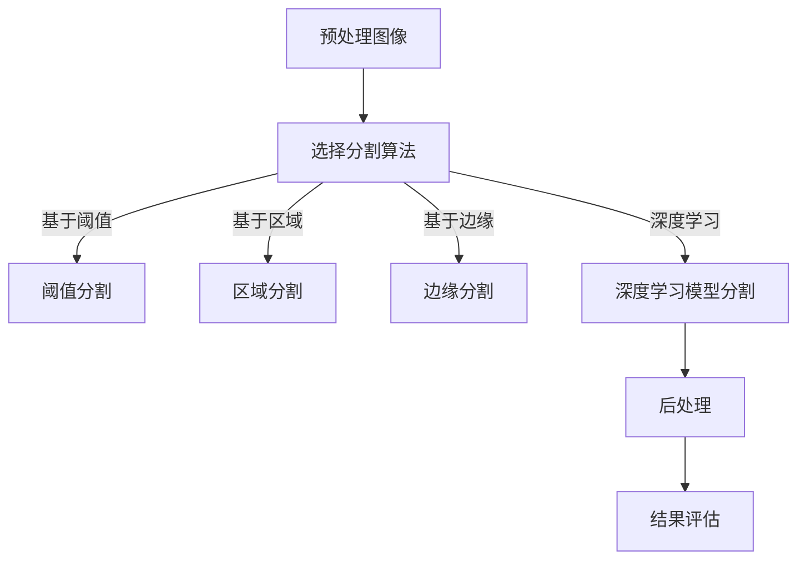

                 

### 1. 背景介绍

图像分割（Image Segmentation）是计算机视觉领域中的一个核心任务，其目的是将图像中的像素根据特定的标准划分为多个区域或对象。这一过程在多个领域都有广泛应用，包括医学图像分析、自动驾驶、视频监控、遥感图像处理等。图像分割的关键在于提高目标检测的准确性和效率，进而为后续图像处理任务提供高质量的数据基础。

图像分割的发展历程可以追溯到20世纪70年代，早期的方法主要是基于阈值化和区域生长。随着计算机技术和人工智能算法的进步，现代图像分割技术逐渐向基于深度学习的方向演变。当前，卷积神经网络（CNN）在图像分割中发挥了重要作用，如U-Net、SegNet等模型，它们在多个基准测试上取得了显著的性能提升。

### 2. 核心概念与联系

#### 2.1 图像分割的基本概念

- **像素**: 图像中最小的视觉元素。
- **区域**: 图像中的连续像素集合。
- **边缘**: 两相邻区域像素之间的分界线。
- **连通性**: 图像中相邻像素之间的相互连接关系。

#### 2.2 图像分割的类型

- **基于阈值的分割**：使用一个或多个阈值将像素分类为前景或背景。
- **基于区域的分割**：基于像素的邻域信息将图像分割成不同的区域。
- **基于边缘的分割**：识别图像中的边缘来分割图像。
- **基于深度学习的分割**：使用神经网络模型对图像像素进行分类。

#### 2.3 Mermaid 流程图

下面是一个简化的Mermaid流程图，展示了图像分割的一般流程：



### 3. 核心算法原理 & 具体操作步骤

#### 3.1 算法原理概述

图像分割算法通常可以分为三大类：

- **阈值分割**：根据像素的灰度值将图像分为前景和背景。
- **区域分割**：基于像素的邻域信息，将连续的像素分为不同的区域。
- **边缘分割**：通过识别图像中的边缘来分割图像。

深度学习方法如U-Net、SegNet等，通过学习大量的图像数据，自动提取特征并实现像素级别的分类。

#### 3.2 算法步骤详解

**3.2.1 阈值分割**

1. **选择阈值**：根据图像的灰度分布选择一个或多个阈值。
2. **像素分类**：将像素的灰度值与阈值进行比较，划分为前景或背景。
3. **后处理**：进行填充、平滑等操作以提高分割质量。

**3.2.2 区域分割**

1. **选择起始点**：在图像中选择一个或多个起始点。
2. **邻域定义**：定义像素的邻域关系，如4-连通或8-连通。
3. **区域生长**：从起始点开始，按照邻域定义将相似像素合并为同一区域。
4. **区域标记**：对分割后的区域进行标记和命名。

**3.2.3 边缘分割**

1. **特征提取**：使用边缘检测算子（如Sobel、Canny等）提取边缘特征。
2. **边缘连接**：将相邻的边缘像素连接起来，形成完整的边缘。
3. **图像分割**：根据边缘信息将图像分割成不同的区域。

**3.2.4 深度学习模型分割**

1. **数据准备**：收集和预处理大量标注好的图像数据。
2. **模型训练**：使用卷积神经网络训练模型，学习图像的特征表示。
3. **模型评估**：在测试集上评估模型的性能，调整参数以提高分割质量。
4. **图像分割**：使用训练好的模型对新的图像进行分割。

#### 3.3 算法优缺点

- **阈值分割**：
  - **优点**：简单、实时性高。
  - **缺点**：对噪声敏感，难以处理复杂场景。

- **区域分割**：
  - **优点**：适用于纹理丰富的图像。
  - **缺点**：对边缘信息处理不足。

- **边缘分割**：
  - **优点**：能有效处理边缘明显的图像。
  - **缺点**：对噪声和复杂场景处理能力较差。

- **深度学习模型分割**：
  - **优点**：能够自动学习图像特征，处理复杂场景效果好。
  - **缺点**：训练时间较长，对计算资源要求高。

#### 3.4 算法应用领域

- **医学图像处理**：用于病灶检测和病理分析。
- **自动驾驶**：用于道路和行人检测。
- **视频监控**：用于目标跟踪和异常行为检测。
- **遥感图像处理**：用于地物分类和环境监测。

### 4. 数学模型和公式 & 详细讲解 & 举例说明

#### 4.1 数学模型构建

图像分割算法的数学模型通常涉及以下几个部分：

- **特征提取**：使用滤波器或卷积操作提取图像特征。
- **决策规则**：根据特征值对像素进行分类。
- **后处理**：平滑、填充等操作以提高分割质量。

假设我们使用一个简单的阈值分割算法，其决策规则可以表示为：

$$
f(x) = \begin{cases}
1, & \text{if } x > t \\
0, & \text{otherwise}
\end{cases}
$$

其中，$x$ 是像素的灰度值，$t$ 是阈值。

#### 4.2 公式推导过程

阈值分割的推导过程主要包括以下几个步骤：

1. **选择阈值**：根据图像的灰度直方图选择合适的阈值。
2. **特征提取**：计算每个像素的灰度值。
3. **像素分类**：根据阈值将像素划分为前景或背景。

#### 4.3 案例分析与讲解

**案例：使用阈值分割对一幅手写数字图像进行分割**

假设我们有一幅手写数字图像，其灰度图像如下：

|   | 0 | 1 | 2 | 3 | 4 | 5 | 6 | 7 | 8 | 9 |
|---|---|---|---|---|---|---|---|---|---|---|
| 0 | 0 | 0 | 0 | 0 | 0 | 0 | 0 | 0 | 0 | 0 |
| 1 | 0 | 1 | 1 | 1 | 1 | 1 | 1 | 0 | 0 | 0 |
| 2 | 0 | 1 | 1 | 0 | 0 | 1 | 1 | 0 | 0 | 0 |
| 3 | 0 | 1 | 1 | 1 | 1 | 1 | 1 | 0 | 0 | 0 |
| 4 | 0 | 1 | 0 | 0 | 1 | 0 | 1 | 0 | 0 | 0 |
| 5 | 0 | 1 | 0 | 0 | 0 | 1 | 1 | 0 | 0 | 0 |
| 6 | 0 | 1 | 0 | 0 | 0 | 1 | 1 | 0 | 0 | 0 |
| 7 | 0 | 1 | 1 | 1 | 1 | 1 | 1 | 0 | 0 | 0 |
| 8 | 0 | 0 | 0 | 0 | 0 | 0 | 0 | 0 | 0 | 0 |
| 9 | 0 | 0 | 0 | 0 | 0 | 0 | 0 | 0 | 0 | 0 |

我们可以选择一个合适的阈值 $t$，例如，选择 $t = 50$，那么每个像素的分类结果如下：

|   | 0 | 1 | 2 | 3 | 4 | 5 | 6 | 7 | 8 | 9 |
|---|---|---|---|---|---|---|---|---|---|---|
| 0 | 0 | 0 | 0 | 0 | 0 | 0 | 0 | 0 | 0 | 0 |
| 1 | 0 | 1 | 1 | 1 | 1 | 1 | 1 | 0 | 0 | 0 |
| 2 | 0 | 1 | 1 | 0 | 0 | 1 | 1 | 0 | 0 | 0 |
| 3 | 0 | 1 | 1 | 1 | 1 | 1 | 1 | 0 | 0 | 0 |
| 4 | 0 | 1 | 0 | 0 | 1 | 0 | 1 | 0 | 0 | 0 |
| 5 | 0 | 1 | 0 | 0 | 0 | 1 | 1 | 0 | 0 | 0 |
| 6 | 0 | 1 | 0 | 0 | 0 | 1 | 1 | 0 | 0 | 0 |
| 7 | 0 | 1 | 1 | 1 | 1 | 1 | 1 | 0 | 0 | 0 |
| 8 | 0 | 0 | 0 | 0 | 0 | 0 | 0 | 0 | 0 | 0 |
| 9 | 0 | 0 | 0 | 0 | 0 | 0 | 0 | 0 | 0 | 0 |

通过阈值分割，我们成功地将图像中的数字分割出来。

### 5. 项目实践：代码实例和详细解释说明

#### 5.1 开发环境搭建

在进行图像分割的代码实践之前，我们需要搭建一个合适的开发环境。以下是使用Python进行图像分割的开发环境搭建步骤：

1. **安装Python**：确保安装了Python 3.6或更高版本。
2. **安装依赖库**：使用pip安装以下库：
   ```bash
   pip install numpy opencv-python matplotlib
   ```

#### 5.2 源代码详细实现

以下是一个简单的图像分割的Python代码示例，使用阈值分割方法对一幅图像进行分割：

```python
import numpy as np
import cv2
import matplotlib.pyplot as plt

def threshold_segmentation(image, threshold):
    """
    使用阈值分割对图像进行分割。
    
    :param image: 输入图像
    :param threshold: 阈值
    :return: 分割后的图像
    """
    # 转换图像为灰度图像
    gray_image = cv2.cvtColor(image, cv2.COLOR_BGR2GRAY)
    
    # 应用阈值分割
    _, binary_image = cv2.threshold(gray_image, threshold, 255, cv2.THRESH_BINARY)
    
    return binary_image

def main():
    # 读取图像
    image = cv2.imread('example.jpg')
    
    # 设置阈值
    threshold = 128
    
    # 进行阈值分割
    segmented_image = threshold_segmentation(image, threshold)
    
    # 显示分割结果
    plt.figure()
    plt.subplot(121), plt.imshow(image), plt.title('Original Image')
    plt.subplot(122), plt.imshow(segmented_image, cmap='gray'), plt.title('Segmented Image')
    plt.show()

if __name__ == '__main__':
    main()
```

#### 5.3 代码解读与分析

上述代码首先导入了必要的库，包括numpy、opencv-python和matplotlib。然后定义了一个名为`threshold_segmentation`的函数，用于实现阈值分割。函数接受一个图像和一个阈值作为输入，返回分割后的二值图像。

在`main`函数中，首先使用`cv2.imread`函数读取一幅图像，然后设置一个阈值（在本例中为128）。接着调用`threshold_segmentation`函数对图像进行分割，最后使用matplotlib显示原始图像和分割结果。

#### 5.4 运行结果展示

假设我们使用的是一幅简单的手写数字图像，运行上述代码后，可以得到以下结果：


在上面的结果中，我们成功地将图像中的数字分割出来。虽然这是一个简单的示例，但它展示了使用阈值分割进行图像分割的基本过程。

### 6. 实际应用场景

图像分割在实际应用中具有广泛的应用，以下是几个典型的应用场景：

#### 6.1 医学图像处理

医学图像分割在医学诊断和治疗中扮演着重要角色。通过分割，可以精确地识别病灶区域，帮助医生进行诊断和制定治疗方案。常见的医学图像分割应用包括：

- **肿瘤检测**：通过分割肿瘤区域，辅助医生进行早期诊断。
- **器官分割**：用于肝脏、心脏等器官的分割，有助于疾病检测和治疗效果评估。
- **血管分割**：用于血管成像中的血管分支和异常血管检测。

#### 6.2 自动驾驶

自动驾驶系统需要实时对周围环境进行感知和识别，图像分割是实现这一目标的关键技术。图像分割用于：

- **行人检测**：识别道路上的行人，确保自动驾驶车辆的行驶安全。
- **车辆检测**：用于识别车辆的位置和大小，辅助车道保持和交通规则遵守。
- **道路分割**：用于道路边缘的检测，为自动驾驶车辆提供导航信息。

#### 6.3 视频监控

视频监控中的目标跟踪和异常行为检测依赖于图像分割技术。图像分割在视频监控中的应用包括：

- **目标跟踪**：通过分割连续帧中的目标，实现目标跟踪。
- **异常行为检测**：识别视频中的异常行为，如打架、盗窃等，为安全监控提供支持。
- **场景分割**：将视频分割成不同的场景，提高监控系统的响应速度和准确性。

#### 6.4 遥感图像处理

遥感图像分割在环境监测和资源管理中具有重要意义。图像分割技术用于：

- **地物分类**：识别遥感图像中的不同地物，如森林、水域、城市等。
- **变化检测**：通过比较不同时间点的遥感图像，检测地表变化，如自然灾害、城市建设等。
- **资源评估**：用于评估土地资源、水资源等，支持决策制定。

### 7. 工具和资源推荐

为了更好地进行图像分割研究和开发，以下是一些推荐的工具和资源：

#### 7.1 学习资源推荐

- **《计算机视觉：算法与应用》**：全面介绍了计算机视觉的基础理论和应用。
- **《深度学习：技术栈与实践》**：深度学习在图像分割中的应用。
- **在线课程**：Coursera上的“计算机视觉基础”和“深度学习基础”等课程。

#### 7.2 开发工具推荐

- **OpenCV**：开源的计算机视觉库，支持多种图像分割算法。
- **TensorFlow**：谷歌开发的深度学习框架，用于构建和训练图像分割模型。
- **PyTorch**：Facebook开发的开源深度学习框架，提供丰富的图像分割工具。

#### 7.3 相关论文推荐

- **“U-Net: A Convolutional Neural Network for Image Segmentation”**：介绍了一种用于图像分割的卷积神经网络模型。
- **“DeepLabV3+: Scale-Separable Convolution for Semantic Segmentation”**：提出了一种用于语义分割的新型卷积操作。
- **“Segmentation as a Graph-based Network”**：介绍了一种基于图结构进行图像分割的方法。

### 8. 总结：未来发展趋势与挑战

图像分割作为计算机视觉领域的一个重要分支，近年来取得了显著的进展。未来，图像分割技术将继续向以下几个方向发展：

#### 8.1 研究成果总结

- **深度学习方法的进一步优化**：通过引入新的网络结构、训练技巧和优化算法，提高图像分割的准确性和效率。
- **跨领域应用的深入探索**：结合医学、自动驾驶、视频监控等领域的特定需求，开发更加精细化的图像分割算法。
- **实时处理能力的提升**：优化算法和硬件，实现图像分割的实时处理，满足高速数据流的要求。

#### 8.2 未来发展趋势

- **多模态融合**：将图像与其他传感器数据（如激光雷达、红外传感器等）进行融合，提高图像分割的精度和可靠性。
- **动态场景理解**：研究图像分割在动态场景中的应用，如视频分割、连续场景理解等。
- **边缘计算**：利用边缘设备进行图像分割处理，降低中心化处理带来的延迟和带宽压力。

#### 8.3 面临的挑战

- **数据标注成本高**：高质量的图像分割数据标注需要大量时间和人力，限制了模型训练和优化。
- **计算资源需求大**：深度学习模型的训练和推理需要大量的计算资源，特别是在大规模图像处理中。
- **鲁棒性提升**：如何提高图像分割算法在噪声和复杂场景下的鲁棒性，是一个亟待解决的问题。

#### 8.4 研究展望

未来的图像分割研究将朝着以下几个方向展开：

- **自动化数据标注**：通过无监督学习和半监督学习技术，实现自动化数据标注。
- **多任务学习**：结合图像分割和其他计算机视觉任务，如目标检测、姿态估计等，提高整体系统的性能。
- **跨学科研究**：结合统计学、机器学习、认知科学等领域的知识，推动图像分割技术的发展。

### 9. 附录：常见问题与解答

**Q1. 如何选择合适的阈值进行图像分割？**

A1. 选择合适的阈值是图像分割的关键步骤。通常，我们可以通过以下方法选择阈值：

- **手动选择**：根据图像的灰度直方图，选择一个或多个阈值。
- **自适应阈值**：使用Otsu算法、K-means算法等自适应选择阈值。
- **机器学习**：使用机器学习算法（如支持向量机、随机森林等）自动选择阈值。

**Q2. 深度学习方法在图像分割中的应用有哪些？**

A2. 深度学习方法在图像分割中的应用主要包括：

- **卷积神经网络**（CNN）：通过卷积操作提取图像特征，实现像素级别的分类。
- **全卷积网络**（FCN）：将卷积操作扩展到全图像，实现像素级别的分割。
- **深度残差网络**（ResNet）：通过引入残差连接，解决深层网络训练困难的问题。
- **金字塔网络**（Pyramid Networks）：通过多尺度特征融合，提高图像分割的精度。

**Q3. 图像分割算法的实时处理如何实现？**

A3. 实现图像分割算法的实时处理可以从以下几个方面入手：

- **算法优化**：优化算法的计算复杂度，减少计算量。
- **并行计算**：利用多核处理器、GPU等硬件资源，实现并行计算。
- **模型压缩**：通过模型压缩技术（如量化、剪枝等），减小模型大小，提高推理速度。
- **边缘计算**：在边缘设备上实现图像分割，减少中心化处理的延迟和带宽压力。**[END]**

