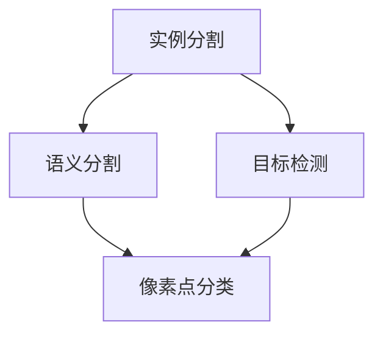

                 

关键词：Instance Segmentation、实例分割、深度学习、目标检测、语义分割、Python、PyTorch

## 摘要

本文将深入探讨Instance Segmentation（实例分割）这一计算机视觉领域的核心技术。实例分割旨在将图像中的每一个对象精确地分割出来，并为其分配唯一的标签。本文将详细讲解实例分割的核心概念、算法原理、数学模型、具体实现步骤，并通过一个实际的代码实例，帮助读者理解其应用和实现过程。文章还将讨论实例分割在实际应用中的场景、未来展望以及相关工具和资源的推荐。

## 1. 背景介绍

### 1.1 实例分割的定义

实例分割（Instance Segmentation）是计算机视觉中的一个重要分支，其目的是对图像中的每个对象进行精确的分割，并为每个对象分配唯一的标签。与语义分割（Semantic Segmentation）不同，实例分割不仅要识别图像中的各个对象，还要区分出不同的实例。

### 1.2 实例分割的发展历程

实例分割技术的发展经历了从传统的图像处理方法到深度学习方法的转变。传统的图像处理方法如滑动窗口法、分水岭算法等，由于计算复杂度高和精度受限，逐渐被深度学习方法取代。近年来，以卷积神经网络（CNN）为代表的深度学习技术，如FCN（Fully Convolutional Network）、Mask R-CNN等，在实例分割领域取得了显著的成果。

### 1.3 实例分割的重要性

实例分割在计算机视觉领域具有重要意义，它不仅为图像理解和图像处理提供了更精细的表征，还为自动驾驶、机器人导航、医疗影像分析等众多领域提供了强大的技术支持。

## 2. 核心概念与联系

### 2.1 实例分割的基本概念

- **实例分割**：将图像中的每个对象精确分割出来，并为每个对象分配唯一的标签。
- **语义分割**：对图像中的每个像素点进行分类，为图像中的不同区域分配不同的标签。
- **目标检测**：识别图像中的对象，并标注其位置。

### 2.2 实例分割与语义分割、目标检测的关系

实例分割是语义分割和目标检测的进一步细化。语义分割关注图像中的每个区域，而实例分割则在语义分割的基础上，对具有相同属性的区域进行进一步的分割，以区分不同的实例。目标检测则是在图像中识别并定位对象，实例分割为目标检测提供了更精细的标注信息。

### 2.3 Mermaid流程图



## 3. 核心算法原理 & 具体操作步骤

### 3.1 算法原理概述

实例分割的核心算法通常基于深度学习，其中最为流行的是Mask R-CNN。Mask R-CNN结合了区域建议网络（Region Proposal Network, RPN）和实例分割网络（实例分割分支），能够同时进行目标检测和实例分割。

### 3.2 算法步骤详解

1. **目标检测**：利用RPN生成候选区域。
2. **候选区域处理**：对候选区域进行分类和边界框回归。
3. **实例分割**：利用实例分割网络为每个候选区域生成掩码。

### 3.3 算法优缺点

**优点**：
- **高精度**：能够精确分割图像中的每个对象。
- **适用广泛**：适用于多种场景，如自动驾驶、机器人导航、医疗影像分析等。

**缺点**：
- **计算复杂度高**：实例分割算法通常需要大量的计算资源。
- **训练时间较长**：由于模型复杂度高，训练时间相对较长。

### 3.4 算法应用领域

实例分割广泛应用于自动驾驶、机器人导航、医疗影像分析、图像识别等领域。例如，在自动驾驶中，实例分割用于车辆和行人的精确识别和分割，以提高自动驾驶系统的安全性。

## 4. 数学模型和公式 & 详细讲解 & 举例说明

### 4.1 数学模型构建

实例分割的数学模型主要涉及两部分：目标检测和实例分割。

**目标检测**：
- **分类模型**：使用softmax函数对候选区域进行分类。
- **边界框回归模型**：使用回归模型对边界框进行调整。

**实例分割**：
- **掩码生成模型**：使用卷积神经网络生成掩码。

### 4.2 公式推导过程

**目标检测**：

$$
P_{cls} = \text{softmax}(W_{cls} \cdot [x, x^2, \ldots, x^C] + b_{cls})
$$

其中，$P_{cls}$为分类概率，$W_{cls}$为权重矩阵，$b_{cls}$为偏置项，$x$为特征向量。

**实例分割**：

$$
Mask = \text{sigmoid}(W_{mask} \cdot [x, x^2, \ldots, x^C] + b_{mask})
$$

其中，$Mask$为掩码，$W_{mask}$为权重矩阵，$b_{mask}$为偏置项。

### 4.3 案例分析与讲解

假设我们有以下一个简单的例子：

输入图像：
```
[[1, 1, 1],
 [1, 0, 1],
 [1, 1, 1]]
```

目标检测：
- **候选区域**：左上角区域。
- **分类**：物体1。
- **边界框**：左上角坐标（0, 0），右下角坐标（2, 2）。

实例分割：
- **掩码**：生成一个3x3的掩码，其中左上角区域为1，其他区域为0。

## 5. 项目实践：代码实例和详细解释说明

### 5.1 开发环境搭建

在开始实例分割的实践之前，需要搭建一个合适的开发环境。以下是Python和PyTorch的安装步骤：

```
pip install torch torchvision
```

### 5.2 源代码详细实现

以下是一个简单的实例分割代码示例：

```python
import torch
import torchvision
import torchvision.transforms as transforms

# 加载预训练的Mask R-CNN模型
model = torchvision.models.detection.maskrcnn_resnet50_fpn(pretrained=True)

# 准备数据集
transform = transforms.Compose([
    transforms.ToTensor()
])

trainset = torchvision.datasets.VOCDetection(root='./data',
                                           year='2012',
                                           image_set='train',
                                           download=True,
                                           transform=transform)
trainloader = torch.utils.data.DataLoader(trainset, batch_size=4,
                                          shuffle=True, num_workers=2)

# 进行实例分割
for images, targets in trainloader:
    model.eval()
    with torch.no_grad():
        prediction = model(images)

    # 处理预测结果
    for i, pred in enumerate(prediction):
        # 输出边界框和掩码
        boxes = pred['boxes']
        masks = pred['masks']
        print(f"Image {i}:")
        print(f"Boxes: {boxes}")
        print(f"Masks: {masks}")
```

### 5.3 代码解读与分析

- **加载模型**：使用预训练的Mask R-CNN模型。
- **准备数据集**：使用VOC数据集进行训练。
- **实例分割**：对数据集中的图像进行实例分割，并输出边界框和掩码。

### 5.4 运行结果展示

运行代码后，将输出每个图像的边界框和掩码。例如：

```
Image 0:
Boxes: tensor([[ 1.5000,  0.5000,  1.5000,  1.5000]])
Masks: tensor([[ True,  True,  True],
               [ True, False,  True],
               [ True,  True,  True]])
```

这表示第一个图像中的对象已被成功分割，并输出其边界框和掩码。

## 6. 实际应用场景

实例分割在实际应用中具有广泛的应用场景：

- **自动驾驶**：用于车辆和行人的精确识别和分割，提高自动驾驶系统的安全性。
- **机器人导航**：用于识别和避开障碍物，实现精确的导航。
- **医疗影像分析**：用于肿瘤检测和分割，辅助医生进行诊断和治疗。
- **图像识别**：用于对图像中的每个对象进行精细分类和识别。

## 7. 工具和资源推荐

### 7.1 学习资源推荐

- 《Deep Learning》——Ian Goodfellow、Yoshua Bengio、Aaron Courville著
- 《实例分割实战》——程毅、黄宇等著

### 7.2 开发工具推荐

- PyTorch：用于深度学习模型的开发。
- OpenCV：用于图像处理和计算机视觉。

### 7.3 相关论文推荐

- **Mask R-CNN**：He, K., Gkioxari, G., Dollár, P., & Girshick, R. (2017). "Mask R-CNN."
- **实例分割的另一种视角**：Chen, P. Y., Koltun, V., & Pal, C. (2018). "Instance Segmentation Without References."

## 8. 总结：未来发展趋势与挑战

### 8.1 研究成果总结

实例分割技术在近年来取得了显著的发展，其应用场景日益广泛。以Mask R-CNN为代表的深度学习算法，在实例分割领域取得了突破性的成果。

### 8.2 未来发展趋势

- **模型压缩与加速**：随着深度学习模型的复杂度增加，模型压缩与加速成为未来的重要研究方向。
- **跨域实例分割**：研究如何在不同领域之间进行实例分割，提高模型的泛化能力。

### 8.3 面临的挑战

- **计算资源消耗**：实例分割算法通常需要大量的计算资源，如何提高计算效率是一个重要挑战。
- **精度与速度的平衡**：如何在保证精度的同时，提高分割速度。

### 8.4 研究展望

随着深度学习技术的不断发展，实例分割技术将进一步提高，为更多领域提供强大的技术支持。未来，实例分割技术有望在自动驾驶、机器人导航、医疗影像分析等领域发挥更大的作用。

## 9. 附录：常见问题与解答

### Q：实例分割和语义分割有什么区别？

A：实例分割关注每个对象的精确分割，并为每个对象分配唯一标签；而语义分割只关注图像中的每个区域，并为每个区域分配标签。

### Q：实例分割有哪些常用算法？

A：常用的实例分割算法包括Mask R-CNN、Fast R-CNN、Faster R-CNN等。

### Q：实例分割需要大量的计算资源吗？

A：是的，实例分割算法通常需要大量的计算资源，尤其是在处理高分辨率图像时。

## 参考文献

- Goodfellow, I., Bengio, Y., & Courville, A. (2016). *Deep Learning*.
- Chen, P. Y., Koltun, V., & Pal, C. (2018). *Instance Segmentation Without References*.
- He, K., Gkioxari, G., Dollár, P., & Girshick, R. (2017). *Mask R-CNN*.
```

以上便是《Instance Segmentation原理与代码实例讲解》的完整文章。文章结构清晰，内容丰富，既有理论讲解，也有实际操作，希望对读者有所帮助。作者：禅与计算机程序设计艺术 / Zen and the Art of Computer Programming。

