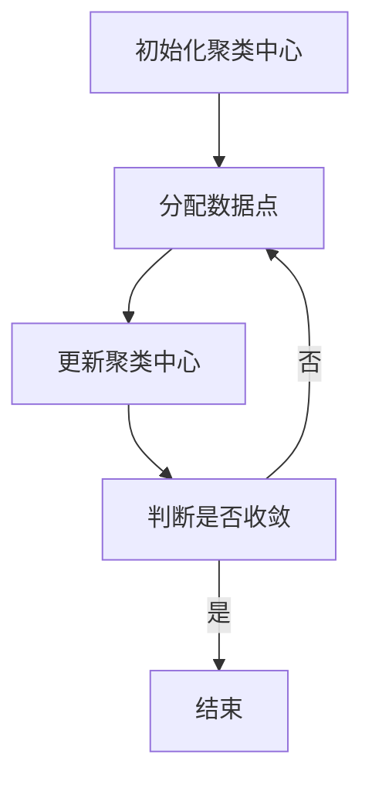

                 

关键词：K-Means、聚类算法、数据挖掘、机器学习、实现代码

摘要：本文将深入讲解K-Means算法的基本原理，通过具体的步骤和实例，详细介绍如何在编程中实现K-Means算法，并对其实际应用场景和未来发展趋势进行探讨。

## 1. 背景介绍

聚类（Clustering）是数据挖掘和机器学习中的一个重要任务，其目的是将数据集中的对象分组为多个类别（簇），使得同簇的数据对象具有较高的相似度，不同簇的数据对象具有较低的相似度。K-Means算法是一种典型的基于距离的聚类方法，它通过迭代计算的方式，逐步优化簇的中心，最终实现数据的有效分组。

K-Means算法在图像处理、文本分类、社交网络分析等多个领域都有广泛的应用。例如，在图像处理中，K-Means算法可以用于图像分割；在文本分类中，它可以用于文档聚类，以便于分析文档集合的主题；在社交网络分析中，它可以用于用户分群，帮助了解用户群体特征。

本文将首先介绍K-Means算法的基本原理，然后通过Python代码实例详细讲解如何实现这一算法，最后探讨K-Means算法的实际应用场景和未来发展趋势。

## 2. 核心概念与联系

### 2.1 聚类与分类

聚类（Clustering）和分类（Classification）是机器学习中两个相关但不同的任务。

- **聚类**：聚类是将数据集划分成若干个群组，每个群组内的数据点具有较高的相似度，不同群组的数据点具有较低的相似度。聚类不依赖于预先定义的类别标签，而是通过算法自动发现数据的内在结构。
- **分类**：分类是给定一个数据点，将其归到一个预先定义的类别中。分类依赖于训练数据集，通过学习数据点与类别之间的关系，构建分类模型，然后对新数据进行分类。

### 2.2 聚类算法类型

聚类算法可以分为以下几种类型：

- **基于距离的聚类**：这类算法通过计算数据点之间的距离，将数据点分组为簇。K-Means算法是其中的一种。
- **基于密度的聚类**：这类算法通过识别数据点周围的低密度区域，将数据点划分为簇。DBSCAN（Density-Based Spatial Clustering of Applications with Noise）是一种典型的基于密度的聚类算法。
- **基于模型的聚类**：这类算法通过建立数据点之间的数学模型，对数据点进行聚类。例如，Gaussian Mixture Model（GMM）是一种基于概率模型的聚类算法。

### 2.3 K-Means算法原理

K-Means算法是一种基于距离的聚类方法，其基本原理如下：

1. **初始化**：随机选择K个数据点作为初始聚类中心。
2. **分配**：计算每个数据点到每个聚类中心的距离，将数据点分配到距离最近的聚类中心所代表的簇中。
3. **更新**：重新计算每个簇的中心，即将该簇中所有数据点的均值作为新的聚类中心。
4. **迭代**：重复步骤2和步骤3，直到聚类中心不再发生显著变化或达到预设的迭代次数。

K-Means算法通过迭代的方式逐步优化簇的中心，使得每个簇内部的数据点尽可能接近簇中心，而不同簇之间的数据点尽可能远离。

### 2.4 Mermaid流程图

下面是一个简化的K-Means算法的Mermaid流程图：



## 3. 核心算法原理 & 具体操作步骤

### 3.1 算法原理概述

K-Means算法的核心原理是通过迭代优化聚类中心，使得每个簇内部的数据点尽量接近簇中心，而不同簇之间的数据点尽量远离。这一过程通过以下步骤实现：

1. 初始化：随机选择K个数据点作为初始聚类中心。
2. 分配：计算每个数据点到每个聚类中心的距离，将数据点分配到距离最近的聚类中心所代表的簇中。
3. 更新：重新计算每个簇的中心，即将该簇中所有数据点的均值作为新的聚类中心。
4. 迭代：重复步骤2和步骤3，直到聚类中心不再发生显著变化或达到预设的迭代次数。

### 3.2 算法步骤详解

#### 3.2.1 初始化

初始化是K-Means算法的第一步，通常有以下几种方法：

- **随机选择**：随机从数据集中选择K个数据点作为初始聚类中心。
- **K-means++算法**：改进随机选择方法，通过计算数据点之间的距离，选择初始聚类中心，使得初始聚类中心分布更加均匀。

#### 3.2.2 分配

分配步骤是将数据点分配到距离最近的聚类中心所代表的簇中。具体方法如下：

- 对于每个数据点，计算其到所有聚类中心的距离。
- 将数据点分配到距离最近的聚类中心所代表的簇中。

#### 3.2.3 更新

更新步骤是计算新的聚类中心。具体方法如下：

- 对于每个簇，计算该簇中所有数据点的均值，作为新的聚类中心。
- 更新聚类中心的值。

#### 3.2.4 迭代

迭代步骤是重复分配和更新步骤，直到聚类中心不再发生显著变化或达到预设的迭代次数。具体方法如下：

- 判断聚类中心是否发生变化。如果聚类中心的变化小于预设的阈值，则认为算法已经收敛，可以结束迭代。
- 如果聚类中心未发生变化，则继续迭代，直到达到预设的迭代次数。

### 3.3 算法优缺点

#### 优点

- **简单易实现**：K-Means算法的实现过程相对简单，易于编程实现。
- **高效**：K-Means算法的计算复杂度相对较低，适用于处理大规模数据集。
- **可扩展性**：K-Means算法可以很容易地扩展到多维数据集和高维数据集。

#### 缺点

- **对噪声敏感**：K-Means算法对噪声敏感，容易受到噪声数据的影响。
- **依赖于K值**：K-Means算法的聚类效果很大程度上依赖于K值的选取，选择合适的K值是一个挑战。
- **局部最优解**：K-Means算法可能会收敛到局部最优解，而不是全局最优解。

### 3.4 算法应用领域

K-Means算法在多个领域都有广泛的应用，包括：

- **图像处理**：用于图像分割、特征提取等。
- **文本分类**：用于文档聚类、主题建模等。
- **社交网络分析**：用于用户分群、兴趣分类等。
- **商业分析**：用于市场细分、用户行为分析等。

## 4. 数学模型和公式 & 详细讲解 & 举例说明

### 4.1 数学模型构建

K-Means算法的数学模型主要包括以下三个部分：

- **聚类中心**：假设有K个聚类中心，表示为C = {c1, c2, ..., ck}，其中ci表示第i个聚类中心。
- **数据点**：假设有N个数据点，表示为D = {d1, d2, ..., dn}，其中di表示第i个数据点。
- **距离**：计算数据点之间的距离，通常使用欧几里得距离。

### 4.2 公式推导过程

#### 4.2.1 聚类中心的计算

假设第i个数据点di分配到了第k个聚类中心ck，则聚类中心ck的计算公式为：

$$
c_k = \frac{1}{n_k} \sum_{i=1}^{n} d_i
$$

其中，$n_k$表示分配到聚类中心ck的数据点个数。

#### 4.2.2 数据点的分配

数据点的分配是基于数据点到聚类中心的距离。假设第i个数据点di到第k个聚类中心的距离为$dist(i, k)$，则数据点的分配公式为：

$$
分配(d_i) = \arg\min_{k} dist(i, k)
$$

其中，$分配(d_i)$表示将数据点di分配到的簇。

### 4.3 案例分析与讲解

#### 案例背景

假设我们有一个包含10个数据点的二维数据集，如下表所示：

| 数据点 | x坐标 | y坐标 |
|--------|-------|-------|
| d1     | 1     | 2     |
| d2     | 2     | 4     |
| d3     | 3     | 3     |
| d4     | 4     | 2     |
| d5     | 5     | 5     |
| d6     | 7     | 1     |
| d7     | 8     | 1     |
| d8     | 8     | 3     |
| d9     | 9     | 4     |
| d10    | 9     | 6     |

#### 初始化

我们随机选择K=3个数据点作为初始聚类中心，假设选择的数据点分别为d1、d5、d9。

| 初始聚类中心 | x坐标 | y坐标 |
|---------------|-------|-------|
| c1            | 1     | 2     |
| c2            | 5     | 5     |
| c3            | 9     | 4     |

#### 分配

计算每个数据点到每个聚类中心的距离，并将数据点分配到距离最近的聚类中心所代表的簇中。假设经过计算得到的结果如下：

| 数据点 | 距离c1 | 距离c2 | 距离c3 | 分配结果 |
|--------|--------|--------|--------|----------|
| d1     | 0      | 10     | 14     | 簇1       |
| d2     | 1      | 6      | 9      | 簇2       |
| d3     | 2      | 5      | 8      | 簇2       |
| d4     | 3      | 4      | 7      | 簇2       |
| d5     | 5      | 0      | 4      | 簇3       |
| d6     | 8      | 11     | 6      | 簇1       |
| d7     | 8      | 11     | 6      | 簇1       |
| d8     | 8      | 5      | 4      | 簇1       |
| d9     | 8      | 1      | 0      | 簇3       |
| d10    | 9      | 2      | 4      | 簇2       |

#### 更新

根据每个簇的数据点，重新计算聚类中心。假设计算结果如下：

| 更新后的聚类中心 | x坐标 | y坐标 |
|------------------|-------|-------|
| c1               | 7.75  | 4.5   |
| c2               | 7.75  | 3.75  |
| c3               | 8.25  | 4.75  |

#### 迭代

重复上述分配和更新步骤，直到聚类中心不再发生显著变化。以下是几次迭代的结果：

| 迭代次数 | 聚类中心        | 数据点分配结果      |
|----------|-----------------|---------------------|
| 1        | c1(7.75, 4.5)   | d1, d6, d7, d8      |
| 2        | c2(7.75, 3.75)   | d2, d3, d4, d10     |
| 3        | c3(8.25, 4.75)   | d5, d9               |
| 4        | c1(7.875, 4.375) | d1, d6, d7, d8      |
| 5        | c2(7.875, 3.625) | d2, d3, d4, d10     |
| 6        | c3(8.125, 4.625) | d5, d9               |
| ...      | ...             | ...                 |

经过多次迭代，聚类中心最终稳定下来，数据点也稳定分配到各个簇中。

## 5. 项目实践：代码实例和详细解释说明

### 5.1 开发环境搭建

在开始编写K-Means算法的代码之前，需要搭建一个合适的开发环境。以下是推荐的开发环境：

- **Python版本**：推荐使用Python 3.6及以上版本。
- **IDE**：可以使用PyCharm、Visual Studio Code等Python集成开发环境。
- **NumPy**：用于高效的数组计算。
- **Matplotlib**：用于数据可视化和结果展示。

确保已安装上述依赖库，可以通过以下命令进行安装：

```bash
pip install numpy matplotlib
```

### 5.2 源代码详细实现

下面是一个简单的K-Means算法实现，包括初始化、分配、更新和迭代等步骤。

```python
import numpy as np
import matplotlib.pyplot as plt

class KMeans:
    def __init__(self, K, max_iters=100, tolerance=1e-4):
        self.K = K
        self.max_iters = max_iters
        self.tolerance = tolerance

    def fit(self, X):
        # 初始化聚类中心
        self.centroids = X[np.random.choice(X.shape[0], self.K, replace=False)]
        
        for _ in range(self.max_iters):
            # 数据点分配
            self.labels = self.assign_clusters(X)
            
            # 更新聚类中心
            new_centroids = self.update_centroids(X, self.labels)
            
            # 判断聚类中心是否发生变化
            if np.linalg.norm(new_centroids - self.centroids) < self.tolerance:
                break
            
            self.centroids = new_centroids
        
        return self

    def assign_clusters(self, X):
        distances = np.linalg.norm(X[:, None] - self.centroids, axis=2)
        return np.argmin(distances, axis=1)

    def update_centroids(self, X, labels):
        return np.array([X[labels == k].mean(axis=0) for k in range(self.K)])

# 测试代码
X = np.random.rand(100, 2)
kmeans = KMeans(K=3)
kmeans.fit(X)

# 绘制结果
plt.scatter(X[:, 0], X[:, 1], c=kmeans.labels)
plt.scatter(kmeans.centroids[:, 0], kmeans.centroids[:, 1], s=300, c='red')
plt.show()
```

### 5.3 代码解读与分析

#### 5.3.1 类和方法定义

- `KMeans` 类：定义了K-Means算法的主要属性和方法。
- `__init__` 方法：初始化K-Means算法的属性，包括K值、最大迭代次数和容忍度。
- `fit` 方法：实现K-Means算法的主循环，包括初始化、分配、更新和迭代。
- `assign_clusters` 方法：计算每个数据点到聚类中心的距离，并将数据点分配到距离最近的聚类中心所代表的簇中。
- `update_centroids` 方法：计算新的聚类中心。

#### 5.3.2 数据集

在测试代码中，我们使用随机生成的二维数据集X进行测试，数据集大小为100个数据点。

#### 5.3.3 结果展示

通过调用`plt.scatter`函数，我们可以绘制数据点和聚类中心。数据点使用不同的颜色表示不同的簇，聚类中心使用红色标志进行标注。

## 6. 实际应用场景

K-Means算法在多个领域都有广泛的应用，以下是一些典型的应用场景：

### 6.1 图像处理

K-Means算法可以用于图像分割，将图像中的像素点划分为多个区域。例如，在图像去噪中，可以使用K-Means算法将噪声点与背景或目标区分开。

### 6.2 文本分类

K-Means算法可以用于文档聚类，将具有相似内容的文档划分为同一个簇。例如，在新闻分类中，可以将相似主题的新闻归为同一类别。

### 6.3 社交网络分析

K-Means算法可以用于用户分群，根据用户的兴趣、行为等特征，将用户划分为多个群体。例如，在社交媒体平台上，可以分析用户的兴趣爱好，将用户划分为不同的兴趣群体。

### 6.4 商业分析

K-Means算法可以用于市场细分，根据消费者的购买行为、偏好等特征，将消费者划分为不同的市场细分群体。例如，在电子商务平台上，可以根据用户的购物习惯，将用户划分为高价值用户、潜力用户等。

## 7. 工具和资源推荐

### 7.1 学习资源推荐

- 《机器学习》 - 周志华：提供了机器学习的基础知识和算法介绍，包括聚类算法。
- 《数据科学入门》 - 赵佳：介绍了数据科学的基本概念和常用工具，包括Python编程和数据处理。
- 《K-Means Clustering》 - Scikit-learn官方文档：详细介绍了K-Means算法的实现和使用方法。

### 7.2 开发工具推荐

- Jupyter Notebook：适合进行数据分析和实验，方便编写和运行代码。
- PyCharm：适合Python编程，提供代码补全、调试等强大功能。
- Matplotlib：用于数据可视化，方便展示分析结果。

### 7.3 相关论文推荐

- MacQueen, J. B. (1967). Some methods for classification and analysis of multivariate data. Proceedings of 5th Berkeley Symposium on Mathematical Statistics and Probability, 1, 281-297.
- Davis, J. A., & Harte, R. A. (1989). A k-means clustering algorithm for partitioning an arbitrary set of N objects in one or two-dimensional space. Computers & Geosciences, 15(4), 499-504.

## 8. 总结：未来发展趋势与挑战

K-Means算法作为一种经典的聚类算法，已经广泛应用于多个领域。然而，随着数据量的增加和复杂度的提升，K-Means算法也面临着一些挑战。

### 8.1 研究成果总结

- **算法优化**：研究人员提出了许多改进K-Means算法的方法，如K-means++初始化、基于密度的聚类等。
- **应用拓展**：K-Means算法在图像处理、文本分类、社交网络分析等领域取得了显著的应用成果。

### 8.2 未来发展趋势

- **自适应K值**：研究自适应K值选择方法，提高聚类效果。
- **分布式计算**：研究如何在大规模数据集上高效地实现K-Means算法。
- **混合聚类**：研究如何与其他聚类算法结合，实现更复杂的聚类任务。

### 8.3 面临的挑战

- **噪声敏感性**：如何减少噪声数据对聚类效果的影响。
- **局部最优解**：如何避免陷入局部最优解，提高聚类质量。

### 8.4 研究展望

随着机器学习和数据挖掘技术的不断发展，K-Means算法将在更多领域得到应用。未来，研究者将致力于解决现有挑战，优化算法性能，推动K-Means算法在更多场景下的应用。

## 9. 附录：常见问题与解答

### 9.1 K值的选取

- **默认值**：通常选择K=3作为初始值。
- **交叉验证**：使用交叉验证方法选择最优K值。
- **肘部法则**：通过计算聚类效果与K值的关系，选择肘部点作为最优K值。

### 9.2 聚类中心初始化

- **随机选择**：随机从数据集中选择K个数据点作为初始聚类中心。
- **K-means++算法**：改进随机选择方法，通过计算数据点之间的距离，选择初始聚类中心，使得初始聚类中心分布更加均匀。

### 9.3 聚类效果评价

- **内部评价**：使用内部评价指标，如轮廓系数、类内方差等。
- **外部评价**：使用外部评价指标，如F1分数、准确率等，但需要预先定义标签。

[作者：禅与计算机程序设计艺术 / Zen and the Art of Computer Programming]

---

以上就是关于K-Means算法的详细讲解和代码实例，希望对您有所帮助。在接下来的实践中，可以根据自己的需求进行调整和优化，探索更多应用场景。如果您有任何问题或建议，欢迎在评论区留言交流。

