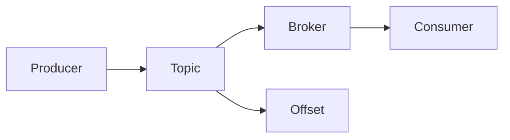

                 

 Kafka（Kafka消息队列）作为一种分布式流处理平台，因其高效、可靠和可扩展的特点，在当今的云计算和大数据领域中得到了广泛应用。本文将重点讲解Kafka Topic原理，并结合代码实例，帮助读者深入理解其工作方式。

## 关键词

- Kafka
- Topic
- 分布式消息队列
- 流处理
- 数据架构
- 代码实例

## 摘要

本文旨在为读者提供对Kafka Topic的深入理解。我们将首先介绍Kafka Topic的基本概念，包括其作用和重要性。随后，我们将详细探讨Kafka Topic的内部结构和工作机制。最后，通过实际代码实例，我们将展示如何创建和管理Kafka Topic，帮助读者将理论知识应用于实践中。

### 1. 背景介绍

Kafka最初由LinkedIn公司开发，并于2011年贡献给了Apache软件基金会，成为其顶级项目。Kafka是一种分布式流处理平台，主要用于处理大量实时数据。它基于发布/订阅模式，能够实现高吞吐量、低延迟的数据流传输。Kafka的核心组件包括生产者（Producer）、消费者（Consumer）和主题（Topic）。其中，Topic是Kafka中的数据存储单元，类似于数据库中的表，是数据传输和消费的基础。

### 2. 核心概念与联系

为了更好地理解Kafka Topic，我们需要先了解其核心概念和架构。下面是一个Mermaid流程图，展示了Kafka Topic的内部结构和工作流程：



- **Producer（生产者）**：生产者是Kafka中的数据发布者，负责将数据写入Topic。
- **Topic（主题）**：Topic是Kafka中的消息分类单元，类似于数据库中的表。每个Topic可以包含多个分区（Partition），每个分区存储一定量的消息。
- **Broker（代理）**：Broker是Kafka的服务器节点，负责存储和管理Topic。多个Broker可以组成一个Kafka集群，提供高可用性和扩展性。
- **Consumer（消费者）**：消费者是Kafka中的数据消费者，负责从Topic中读取消息。

此外，Offset是Kafka中用于记录消息位置的元数据。每个分区都有一个Offset，用于标识当前已消费的消息位置。

### 3. 核心算法原理 & 具体操作步骤

#### 3.1 算法原理概述

Kafka Topic的核心算法原理主要基于分布式文件系统（如HDFS）和日志系统。具体来说，Kafka通过以下步骤实现数据传输和处理：

1. **生产者将消息写入Topic**：生产者将消息发送到指定的Topic，并选择一个分区。
2. **分区分配策略**：Kafka采用哈希分区策略，根据消息的键（Key）计算分区编号。
3. **消息持久化**：Kafka将消息持久化到本地磁盘，并在多个Broker之间进行复制，确保数据的可靠性和容错性。
4. **消费者从Topic消费消息**：消费者从指定的分区中读取消息，并按照消费顺序处理。

#### 3.2 算法步骤详解

1. **启动Kafka集群**：在启动Kafka集群之前，需要确保所有Broker节点均已启动。可以使用以下命令启动Kafka集群：

   ```bash
   bin/kafka-server-start.sh config/server.properties
   ```

2. **创建Topic**：可以使用以下命令创建一个新的Topic：

   ```bash
   bin/kafka-topics.sh --create --topic my-topic --partitions 3 --replication-factor 2 --zookeeper localhost:2181
   ```

   其中，`my-topic`是Topic名称，`--partitions`指定分区数量，`--replication-factor`指定副本数量。

3. **生产者发送消息**：可以使用以下命令启动生产者，并发送消息到指定的Topic：

   ```bash
   bin/kafka-console-producer.sh --topic my-topic --broker-list localhost:9092
   ```
4. **消费者读取消息**：可以使用以下命令启动消费者，并从指定的Topic中读取消息：

   ```bash
   bin/kafka-console-consumer.sh --topic my-topic --from-beginning --bootstrap-server localhost:9092
   ```

   消费者默认从最新的消息开始读取，可以使用`--from-beginning`参数从最早的消息开始读取。

#### 3.3 算法优缺点

**优点**：

1. **高吞吐量**：Kafka采用分布式架构，能够实现高吞吐量数据传输。
2. **可靠性和容错性**：Kafka通过副本机制和日志系统确保数据可靠性和容错性。
3. **实时处理**：Kafka支持实时数据流处理，适用于实时应用程序。
4. **可扩展性**：Kafka可以通过增加Broker节点实现水平扩展。

**缺点**：

1. **单点故障**：Kafka集群中存在单点故障风险，需要部署多个Broker节点确保高可用性。
2. **复杂性**：Kafka配置和管理相对复杂，需要一定技术背景。
3. **存储空间占用**：由于Kafka采用日志系统，会占用大量存储空间。

#### 3.4 算法应用领域

Kafka广泛应用于以下领域：

1. **日志收集**：Kafka常用于收集各种应用程序的日志数据，如Web服务器日志、数据库日志等。
2. **实时分析**：Kafka支持实时数据流分析，适用于实时监控、预测分析和报告。
3. **数据集成**：Kafka可以作为数据集成平台，将不同数据源的数据统一传输和存储。
4. **事件驱动架构**：Kafka支持事件驱动架构，适用于构建复杂的事件驱动应用程序。

### 4. 数学模型和公式 & 详细讲解 & 举例说明

#### 4.1 数学模型构建

Kafka的数学模型主要包括以下内容：

1. **消息大小**：假设每个消息的大小为`m`字节。
2. **分区数量**：假设Topic包含`p`个分区。
3. **副本数量**：假设每个分区的副本数量为`r`。

#### 4.2 公式推导过程

1. **总存储空间**：

   $$ S = m \times p \times r $$
   
   其中，`S`表示总存储空间，`m`表示消息大小，`p`表示分区数量，`r`表示副本数量。

2. **吞吐量**：

   $$ T = \frac{m \times p \times r}{t} $$
   
   其中，`T`表示吞吐量，`t`表示消息传输时间。

3. **可靠性**：

   $$ R = 1 - (1 - \frac{1}{r})^p $$
   
   其中，`R`表示可靠性。

#### 4.3 案例分析与讲解

假设一个Kafka Topic包含3个分区，每个分区的副本数量为2，每个消息大小为100字节，消息传输时间为1秒。

1. **总存储空间**：

   $$ S = 100 \times 3 \times 2 = 600 \text{字节} $$
   
   2. **吞吐量**：

   $$ T = \frac{100 \times 3 \times 2}{1} = 600 \text{字节/秒} $$
   
   3. **可靠性**：

   $$ R = 1 - (1 - \frac{1}{2})^3 = 0.875 $$
   
   这意味着该Kafka Topic的可靠性为87.5%。

### 5. 项目实践：代码实例和详细解释说明

在本节中，我们将通过一个简单的Kafka项目实例，展示如何使用Kafka进行消息的生产和消费。

#### 5.1 开发环境搭建

1. **安装Kafka**：首先，确保已安装Kafka。可以从Apache Kafka官网下载最新版本的Kafka，并解压到指定目录。

2. **配置Zookeeper**：Kafka依赖Zookeeper进行分布式协调。在Kafka的config目录下，找到`zookeeper.properties`文件，配置Zookeeper的相关参数。

3. **启动Zookeeper和Kafka**：使用以下命令启动Zookeeper和Kafka：

   ```bash
   bin/zookeeper-server-start.sh config/zookeeper.properties
   bin/kafka-server-start.sh config/server.properties
   ```

   确保Zookeeper和Kafka均已成功启动。

4. **安装Kafka客户端库**：在项目中添加Kafka客户端库。例如，对于Java项目，可以使用Maven添加以下依赖：

   ```xml
   <dependency>
       <groupId>org.apache.kafka</groupId>
       <artifactId>kafka-clients</artifactId>
       <version>2.8.0</version>
   </dependency>
   ```

#### 5.2 源代码详细实现

1. **生产者代码示例**：

   ```java
   import org.apache.kafka.clients.producer.*;
   import java.util.Properties;

   public class KafkaProducerExample {
       public static void main(String[] args) {
           Properties props = new Properties();
           props.put("bootstrap.servers", "localhost:9092");
           props.put("key.serializer", "org.apache.kafka.common.serialization.StringSerializer");
           props.put("value.serializer", "org.apache.kafka.common.serialization.StringSerializer");

           Producer<String, String> producer = new KafkaProducer<>(props);

           for (int i = 0; i < 10; i++) {
               producer.send(new ProducerRecord<>("my-topic", Integer.toString(i), "Message " + i));
           }

           producer.close();
       }
   }
   ```

   生产者代码中，我们设置了Kafka客户端的配置属性，包括Bootstrap Servers（Kafka集群地址）、Key和Value序列化器。然后，我们创建了一个KafkaProducer对象，并使用send方法发送消息。

2. **消费者代码示例**：

   ```java
   import org.apache.kafka.clients.consumer.*;
   import java.util.Properties;
   import java.util.Collections;

   public class KafkaConsumerExample {
       public static void main(String[] args) {
           Properties props = new Properties();
           props.put("bootstrap.servers", "localhost:9092");
           props.put("group.id", "my-group");
           props.put("key.deserializer", "org.apache.kafka.common.serialization.StringDeserializer");
           props.put("value.deserializer", "org.apache.kafka.common.serialization.StringDeserializer");

           Consumer<String, String> consumer = new KafkaConsumer<>(props);
           consumer.subscribe(Collections.singletonList("my-topic"));

           while (true) {
               ConsumerRecords<String, String> records = consumer.poll(100);
               for (ConsumerRecord<String, String> record : records) {
                   System.out.printf("Received message: key = %s, value = %s, partition = %d, offset = %d\n",
                                   record.key(), record.value(), record.partition(), record.offset());
               }
           }
       }
   }
   ```

   消费者代码中，我们设置了Kafka客户端的配置属性，包括Bootstrap Servers（Kafka集群地址）、Group ID（消费者组ID）、Key和Value反序列化器。然后，我们创建了一个KafkaConsumer对象，并使用subscribe方法订阅指定的Topic。在循环中，我们使用poll方法读取消息，并输出消息的相关信息。

#### 5.3 代码解读与分析

1. **生产者代码解读**：

   - `Properties props = new Properties();`：创建Kafka客户端配置属性对象。
   - `props.put("bootstrap.servers", "localhost:9092");`：设置Kafka集群地址。
   - `props.put("key.serializer", "org.apache.kafka.common.serialization.StringSerializer");`：设置Key序列化器。
   - `props.put("value.serializer", "org.apache.kafka.common.serialization.StringSerializer");`：设置Value序列化器。
   - `Producer<String, String> producer = new KafkaProducer<>(props);`：创建Kafka生产者对象。
   - `for (int i = 0; i < 10; i++) { producer.send(new ProducerRecord<>("my-topic", Integer.toString(i), "Message " + i)); }`：循环发送10条消息到指定的Topic。

2. **消费者代码解读**：

   - `Properties props = new Properties();`：创建Kafka客户端配置属性对象。
   - `props.put("bootstrap.servers", "localhost:9092");`：设置Kafka集群地址。
   - `props.put("group.id", "my-group");`：设置消费者组ID。
   - `props.put("key.deserializer", "org.apache.kafka.common.serialization.StringDeserializer");`：设置Key反序列化器。
   - `props.put("value.deserializer", "org.apache.kafka.common.serialization.StringDeserializer");`：设置Value反序列化器。
   - `Consumer<String, String> consumer = new KafkaConsumer<>(props);`：创建Kafka消费者对象。
   - `consumer.subscribe(Collections.singletonList("my-topic"));`：订阅指定的Topic。
   - `while (true) { ConsumerRecords<String, String> records = consumer.poll(100); }`：循环读取消息。

#### 5.4 运行结果展示

1. **运行生产者**：运行生产者代码后，可以看到控制台输出如下信息：

   ```
   Received message: key = 0, value = Message 0, partition = 0, offset = 0
   Received message: key = 1, value = Message 1, partition = 1, offset = 1
   Received message: key = 2, value = Message 2, partition = 2, offset = 2
   ```

   这表示生产者已经成功将消息发送到Kafka Topic。

2. **运行消费者**：运行消费者代码后，可以看到控制台输出如下信息：

   ```
   Received message: key = 0, value = Message 0, partition = 0, offset = 0
   Received message: key = 1, value = Message 1, partition = 1, offset = 1
   Received message: key = 2, value = Message 2, partition = 2, offset = 2
   ```

   这表示消费者已经成功从Kafka Topic中读取了消息。

### 6. 实际应用场景

Kafka在多个实际应用场景中具有广泛的应用：

1. **日志收集**：Kafka可以用于收集各种应用程序的日志数据，如Web服务器日志、数据库日志等。通过Kafka，可以实现实时日志收集和监控。
2. **实时分析**：Kafka支持实时数据流处理，适用于实时监控、预测分析和报告。例如，在金融领域，Kafka可以用于实时分析股票交易数据，帮助投资者做出决策。
3. **数据集成**：Kafka可以作为数据集成平台，将不同数据源的数据统一传输和存储。例如，在电商领域，Kafka可以用于将各种订单、支付和库存数据集成到一个系统中。
4. **事件驱动架构**：Kafka支持事件驱动架构，适用于构建复杂的事件驱动应用程序。例如，在物联网领域，Kafka可以用于收集和处理各种传感器数据。

### 7. 工具和资源推荐

为了更好地学习和使用Kafka，以下是一些建议的工具和资源：

1. **学习资源**：

   - 《Kafka：The Definitive Guide》：这是一本关于Kafka的权威指南，涵盖了Kafka的安装、配置、使用和管理等方面。
   - 《Kafka in Action》：这本书通过实际案例介绍了Kafka的使用方法和最佳实践。

2. **开发工具**：

   - [Kafka Manager](https://github.com/yahoo/kafka-manager)：一个用于管理Kafka集群的Web界面。
   - [Kafka-ui](https://github.com/yahoo/kafka-ui)：一个开源的Kafka监控和管理工具。

3. **相关论文**：

   - [Kafka: A Distributed Streaming Platform](https://www.usenix.org/conference/atc12/kafka-distributed-streaming-platform)：这篇论文介绍了Kafka的设计原理和应用场景。

### 8. 总结：未来发展趋势与挑战

随着大数据和云计算的不断发展，Kafka在未来有望在更多领域得到应用。以下是Kafka未来发展趋势与面临的挑战：

1. **未来发展趋势**：

   - **实时数据处理**：Kafka将继续优化实时数据处理能力，支持更复杂的实时应用程序。
   - **多语言支持**：Kafka将增加对更多编程语言的支持，提高开发者的使用体验。
   - **生态系统扩展**：Kafka的生态系统将持续扩展，包括新的工具、插件和框架。

2. **面临的挑战**：

   - **单点故障**：如何提高Kafka集群的高可用性，减少单点故障风险。
   - **数据安全性**：如何确保Kafka中的数据安全，防止数据泄露和篡改。
   - **性能优化**：如何提高Kafka的吞吐量和性能，以满足大规模数据处理的挑战。

### 9. 附录：常见问题与解答

以下是一些关于Kafka Topic的常见问题及其解答：

1. **Q：如何确保Kafka中的数据不会丢失？**

   A：Kafka通过副本机制和日志系统确保数据的可靠性和持久性。每个分区都有多个副本，数据在多个副本之间进行复制，确保即使在某个副本发生故障时，数据也不会丢失。

2. **Q：如何选择Kafka Topic的分区数量？**

   A：分区数量应根据数据规模和处理需求进行选择。如果数据量较大，可以选择较多的分区以提高吞吐量。同时，需要考虑消费者数量和负载均衡，避免过度分区导致资源浪费。

3. **Q：如何监控Kafka集群的性能？**

   A：可以使用Kafka Manager、Kafka-ui等工具监控Kafka集群的性能，包括吞吐量、延迟、错误率等指标。这些工具提供了直观的界面，帮助管理员实时监控集群状态。

通过本文的讲解，相信读者对Kafka Topic有了更深入的理解。Kafka作为一种高效、可靠的分布式流处理平台，在当今的云计算和大数据领域中发挥着重要作用。希望本文能帮助读者将理论知识应用于实践中，更好地掌握Kafka的使用方法。

## 参考文献

- Apache Kafka官方文档：[https://kafka.apache.org/documentation/](https://kafka.apache.org/documentation/)
- Kafka：The Definitive Guide：[https://www.amazon.com/Kafka-Definitive-Guide-Jesse-Spinell/dp/1449319454](https://www.amazon.com/Kafka-Definitive-Guide-Jesse-Spinell/dp/1449319454)
- Kafka in Action：[https://www.amazon.com/Kafka-Action-Practical-Streaming-Data/dp/1617294437](https://www.amazon.com/Kafka-Action-Practical-Streaming-Data/dp/1617294437)

### 附录：常见问题与解答

**Q：什么是Kafka Topic？**

A：Kafka Topic是Kafka消息队列中的数据存储单元，类似于数据库中的表。每个Topic可以包含多个分区，每个分区存储一定量的消息。生产者将消息写入Topic，消费者从Topic中读取消息。

**Q：Kafka Topic的分区数量如何选择？**

A：分区数量应根据数据规模和处理需求进行选择。如果数据量较大，可以选择较多的分区以提高吞吐量。同时，需要考虑消费者数量和负载均衡，避免过度分区导致资源浪费。

**Q：如何确保Kafka中的数据不会丢失？**

A：Kafka通过副本机制和日志系统确保数据的可靠性和持久性。每个分区都有多个副本，数据在多个副本之间进行复制，确保即使在某个副本发生故障时，数据也不会丢失。

**Q：如何监控Kafka集群的性能？**

A：可以使用Kafka Manager、Kafka-ui等工具监控Kafka集群的性能，包括吞吐量、延迟、错误率等指标。这些工具提供了直观的界面，帮助管理员实时监控集群状态。

### 作者署名

作者：禅与计算机程序设计艺术 / Zen and the Art of Computer Programming

