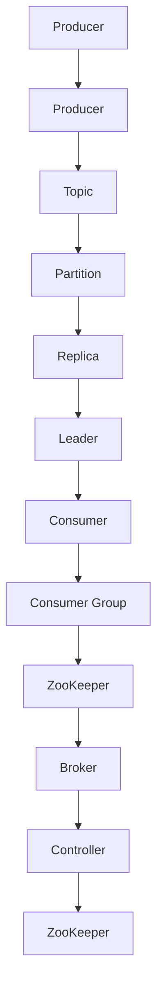

                 

  
关键词：Kafka、分布式消息队列、消息传递、数据流处理、Zookeeper、API、生产者、消费者、主题、分区、副本、分布式系统、数据一致性、性能优化

摘要：本文旨在深入讲解Kafka的核心原理及其在实际应用中的代码实例。我们将从Kafka的基本概念、架构设计、核心组件、数据流动机制、性能优化策略等方面进行详细探讨，并通过实际代码示例来帮助读者更好地理解Kafka的工作原理和实现细节。

## 1. 背景介绍

Kafka是由LinkedIn公司开发的一个分布式流处理平台，用于构建实时的数据管道和流式应用程序。Kafka最初是为了解决LinkedIn公司在大规模数据处理和实时消息传递方面的需求而创建的。随着其开源，Kafka逐渐成为大数据领域最为流行的分布式消息队列系统之一。

Kafka的主要特点包括：

- 高吞吐量：Kafka可以处理数百万消息/秒，非常适合大规模数据流处理。
- 可靠性：Kafka提供了数据持久化和副本机制，确保数据不丢失。
- 可扩展性：Kafka是分布式系统，可以横向扩展，以处理更多数据。
- 持久性：Kafka可以将消息持久化到磁盘，保证数据长期保存。

随着云计算和大数据技术的迅猛发展，Kafka在金融、电商、社交网络等各个领域得到了广泛应用。其优势在于可以高效地处理和分析实时数据流，为各种业务场景提供强大的数据基础设施支持。

## 2. 核心概念与联系

在深入探讨Kafka之前，我们需要了解一些核心概念和它们之间的关系。以下是Kafka中的一些关键术语及其定义：

### 主题（Topics）###

主题是Kafka中的消息分类单元，类似于一个消息分类器。每个主题可以包含多个分区（Partitions），每个分区是一个有序的消息队列。

### 分区（Partitions）###

分区是将主题的消息进行分区存储的逻辑单元，可以提高消息的并发写入和读取能力。每个分区都有一个唯一的编号，分区内的消息是有序的。

### 副本（Replicas）###

副本是为了提高可靠性和可用性而存在的。每个分区有多个副本，包括一个领导者（Leader）和多个追随者（Follower）。领导者负责处理所有生产者和消费者的读写请求，追随者从领导者同步数据。

### 消息（Messages）###

消息是Kafka的基本数据单元，由键（Key）、值（Value）和时间戳（Timestamp）组成。

### 消费者组（Consumer Groups）###

消费者组是一组消费者组成的逻辑单元，共同消费一个或多个主题的消息。消费者组内部的消费者之间可以实现负载均衡，提高消息的消费能力。

### ZooKeeper###

ZooKeeper是Kafka用于管理配置信息、同步状态、选举领导者等操作的核心组件。Kafka集群中的所有节点都通过ZooKeeper进行协调。

下面是Kafka的架构图，展示了各个组件之间的关系：



## 3. 核心算法原理 & 具体操作步骤

### 3.1 算法原理概述

Kafka的核心算法主要包括消息的发送、接收、分区和副本管理等。以下是Kafka的基本算法原理：

1. **消息发送**：生产者发送消息时，会根据分区策略将消息路由到特定的分区。常用的分区策略包括：基于消息键的分区、轮询分区、指定分区等。

2. **消息接收**：消费者从分区中拉取消息。消费者组内部的消费者之间可以实现负载均衡，消费者需要从自己的分区偏移量开始消费。

3. **分区**：每个主题可以包含多个分区，分区数可以在创建主题时指定。分区可以提高消息的并发写入和读取能力。

4. **副本**：每个分区都有多个副本，包括一个领导者（Leader）和多个追随者（Follower）。领导者处理所有生产者和消费者的读写请求，追随者从领导者同步数据，以确保数据的高可用性和可靠性。

5. **副本管理**：Kafka通过ZooKeeper进行副本管理，包括领导者的选举、副本同步等操作。

### 3.2 算法步骤详解

以下是Kafka的基本操作步骤：

1. **启动ZooKeeper**：ZooKeeper是Kafka的协调者，负责管理配置信息、同步状态、选举领导者等操作。

2. **启动Kafka Broker**：Kafka Broker是Kafka集群中的工作节点，负责处理生产者和消费者的请求，存储和管理主题数据。

3. **创建主题**：生产者在发送消息之前需要创建主题。创建主题时，可以指定主题名称、分区数、副本数等参数。

4. **发送消息**：生产者将消息发送到特定的分区，根据分区策略将消息路由到相应的副本。

5. **接收消息**：消费者从分区中拉取消息，消费者组内部的消费者之间可以实现负载均衡。

6. **副本同步**：领导者将写入的消息同步到追随者，确保数据的一致性。

7. **领导者选举**：当领导者故障时，ZooKeeper会触发领导者选举，新的领导者将接管读写请求。

### 3.3 算法优缺点

**优点**：

- **高吞吐量**：Kafka可以处理数百万消息/秒，非常适合大规模数据流处理。
- **可靠性**：Kafka提供了数据持久化和副本机制，确保数据不丢失。
- **可扩展性**：Kafka是分布式系统，可以横向扩展，以处理更多数据。
- **持久性**：Kafka可以将消息持久化到磁盘，保证数据长期保存。

**缺点**：

- **单点故障**：ZooKeeper作为Kafka的协调者，存在单点故障的风险。
- **复杂度**：Kafka的配置和运维相对复杂，需要一定的学习和实践。

### 3.4 算法应用领域

Kafka在以下领域得到了广泛应用：

- **实时数据处理**：Kafka可以处理海量实时数据流，适用于实时日志收集、实时流处理、实时推荐系统等。
- **消息队列**：Kafka作为分布式消息队列，适用于解耦、异步处理、流量控制等场景。
- **大数据平台**：Kafka是Hadoop生态系统中的重要组件，与HDFS、Spark、Storm等大数据技术紧密集成。

## 4. 数学模型和公式 & 详细讲解 & 举例说明

### 4.1 数学模型构建

Kafka中的核心数学模型主要包括：

- **消息发送速率**：\( R = \frac{N \cdot W}{T} \)
  - \( R \)：消息发送速率（消息/秒）
  - \( N \)：生产者数量
  - \( W \)：每个生产者平均发送的消息大小（字节）
  - \( T \)：时间（秒）

- **消息接收速率**：\( R' = \frac{M \cdot W'}{T'} \)
  - \( R' \)：消息接收速率（消息/秒）
  - \( M \)：消费者数量
  - \( W' \)：每个消费者平均接收的消息大小（字节）
  - \( T' \)：时间（秒）

- **数据传输延迟**：\( L = \frac{D + R \cdot T}{R'} \)
  - \( L \)：数据传输延迟（秒）
  - \( D \)：数据在网络中传输的时间（秒）
  - \( R \)：消息发送速率（消息/秒）
  - \( R' \)：消息接收速率（消息/秒）

### 4.2 公式推导过程

**消息发送速率**：

消息发送速率表示每秒钟发送的消息数量。根据公式：

\[ R = \frac{N \cdot W}{T} \]

其中，\( N \) 是生产者数量，\( W \) 是每个生产者平均发送的消息大小（字节），\( T \) 是时间（秒）。假设在一个时间段 \( T \) 内，每个生产者平均发送了 \( W \) 字节的消息，那么总的消息数量为 \( N \cdot W \)。将这个总消息数量除以时间 \( T \)，就可以得到每秒发送的消息数量，即消息发送速率。

**消息接收速率**：

消息接收速率表示每秒钟接收的消息数量。根据公式：

\[ R' = \frac{M \cdot W'}{T'} \]

其中，\( M \) 是消费者数量，\( W' \) 是每个消费者平均接收的消息大小（字节），\( T' \) 是时间（秒）。假设在一个时间段 \( T' \) 内，每个消费者平均接收了 \( W' \) 字节的消息，那么总的接收消息数量为 \( M \cdot W' \)。将这个总消息数量除以时间 \( T' \)，就可以得到每秒接收的消息数量，即消息接收速率。

**数据传输延迟**：

数据传输延迟是指消息从发送到接收的总时间。根据公式：

\[ L = \frac{D + R \cdot T}{R'} \]

其中，\( D \) 是数据在网络中传输的时间（秒），\( R \) 是消息发送速率（消息/秒），\( R' \) 是消息接收速率（消息/秒）。\( D \) 表示数据在网络中传输的时间，\( R \cdot T \) 表示在一个时间段 \( T \) 内发送的消息数量，\( R' \cdot T' \) 表示在一个时间段 \( T' \) 内接收的消息数量。将这两个时间段加起来，再除以消息接收速率，就可以得到数据传输延迟。

### 4.3 案例分析与讲解

假设在一个Kafka集群中，有5个生产者，每个生产者平均发送1MB的消息，每个消息的键为1KB。有10个消费者，每个消费者平均接收1MB的消息。网络传输延迟为1秒。

**消息发送速率**：

\[ R = \frac{5 \cdot 1 \text{ MB}}{1 \text{ s}} = 5 \text{ MB/s} \]

**消息接收速率**：

\[ R' = \frac{10 \cdot 1 \text{ MB}}{1 \text{ s}} = 10 \text{ MB/s} \]

**数据传输延迟**：

\[ L = \frac{1 \text{ s} + 5 \text{ MB/s} \cdot 1 \text{ s}}{10 \text{ MB/s}} = 0.6 \text{ s} \]

## 5. 项目实践：代码实例和详细解释说明

### 5.1 开发环境搭建

在开始编写Kafka应用程序之前，我们需要搭建一个Kafka开发环境。以下是搭建步骤：

1. **安装Java开发环境**：Kafka是用Java编写的，因此我们需要安装Java开发环境。在[Oracle官网](https://www.oracle.com/java/technologies/javase-jdk11-downloads.html)下载Java SDK，并设置环境变量。

2. **安装Kafka**：从[Kafka官网](https://kafka.apache.org/downloads)下载Kafka的二进制包，解压到合适的目录，并设置环境变量。

3. **启动ZooKeeper和Kafka**：进入Kafka解压目录下的`bin`文件夹，分别执行以下命令启动ZooKeeper和Kafka：

   ```bash
   ./zookeeper-server-start.sh config/zookeeper.properties
   ./kafka-server-start.sh config/server.properties
   ```

   这将启动ZooKeeper和Kafka Broker。

4. **创建主题**：使用以下命令创建一个名为`test-topic`的主题，分区数为3，副本数为2：

   ```bash
   ./kafka-topics.sh --create --topic test-topic --partitions 3 --replication-factor 2 --zookeeper localhost:2181
   ```

   创建主题后，可以使用以下命令查看主题信息：

   ```bash
   ./kafka-topics.sh --list --zookeeper localhost:2181
   ```

5. **启动生产者和消费者**：在另一个终端窗口中启动生产者：

   ```bash
   ./kafka-console-producer.sh --broker-list localhost:9092 --topic test-topic
   ```

   然后在另一个终端窗口中启动消费者：

   ```bash
   ./kafka-console-consumer.sh --bootstrap-server localhost:9092 --topic test-topic --from-beginning
   ```

### 5.2 源代码详细实现

下面是一个简单的Kafka生产者示例：

```java
import org.apache.kafka.clients.producer.*;
import java.util.Properties;

public class KafkaProducerExample {
    public static void main(String[] args) {
        Properties props = new Properties();
        props.put("bootstrap.servers", "localhost:9092");
        props.put("key.serializer", "org.apache.kafka.common.serialization.StringSerializer");
        props.put("value.serializer", "org.apache.kafka.common.serialization.StringSerializer");

        KafkaProducer<String, String> producer = new KafkaProducer<>(props);

        for (int i = 0; i < 10; i++) {
            String key = "key-" + i;
            String value = "value-" + i;
            producer.send(new ProducerRecord<>("test-topic", key, value));
            System.out.println("Sent: (" + key + ", " + value + ")");
        }

        producer.close();
    }
}
```

这是一个简单的Kafka消费者示例：

```java
import org.apache.kafka.clients.consumer.*;
import java.util.Properties;
import java.util.Collections;

public class KafkaConsumerExample {
    public static void main(String[] args) {
        Properties props = new Properties();
        props.put("bootstrap.servers", "localhost:9092");
        props.put("group.id", "test-group");
        props.put("key.deserializer", "org.apache.kafka.common.serialization.StringDeserializer");
        props.put("value.deserializer", "org.apache.kafka.common.serialization.StringDeserializer");

        KafkaConsumer<String, String> consumer = new KafkaConsumer<>(props);
        consumer.subscribe(Collections.singletonList("test-topic"));

        while (true) {
            ConsumerRecords<String, String> records = consumer.poll(100);
            for (ConsumerRecord<String, String> record : records) {
                System.out.printf("Received: (%s, %s)\n", record.key(), record.value());
            }
        }
    }
}
```

### 5.3 代码解读与分析

**KafkaProducerExample.java**：

这个示例演示了如何使用Kafka生产者发送消息。首先，我们创建了一个`Properties`对象，设置了Kafka生产者需要的配置属性，如Kafka broker地址、序列化器和acks模式等。然后，我们创建了一个`KafkaProducer`对象，并发送了10条消息到`test-topic`。

- `props.put("bootstrap.servers", "localhost:9092")`：指定Kafka broker地址。
- `props.put("key.serializer", "org.apache.kafka.common.serialization.StringSerializer")` 和 `props.put("value.serializer", "org.apache.kafka.common.serialization.StringSerializer")`：设置消息键和值的序列化器。
- `producer.send(new ProducerRecord<>("test-topic", key, value))`：发送一条消息。

**KafkaConsumerExample.java**：

这个示例演示了如何使用Kafka消费者接收消息。首先，我们创建了一个`Properties`对象，设置了Kafka消费者需要的配置属性，如Kafka broker地址、消费者组ID、反序列化器等。然后，我们创建了一个`KafkaConsumer`对象，并订阅了`test-topic`。最后，我们使用`poll()`方法不断拉取消息，并打印出来。

- `props.put("bootstrap.servers", "localhost:9092")`：指定Kafka broker地址。
- `props.put("group.id", "test-group")`：设置消费者组ID。
- `props.put("key.deserializer", "org.apache.kafka.common.serialization.StringDeserializer")` 和 `props.put("value.deserializer", "org.apache.kafka.common.serialization.StringDeserializer")`：设置消息键和值的反序列化器。
- `consumer.subscribe(Collections.singletonList("test-topic"))`：订阅`test-topic`。
- `consumer.poll(100)`：拉取消息，最大等待时间为100毫秒。

### 5.4 运行结果展示

运行Kafka生产者和消费者示例后，我们可以看到以下输出：

```bash
Sent: (key-0, value-0)
Sent: (key-1, value-1)
Sent: (key-2, value-2)
Sent: (key-3, value-3)
Sent: (key-4, value-4)
Sent: (key-5, value-5)
Sent: (key-6, value-6)
Sent: (key-7, value-7)
Sent: (key-8, value-8)
Sent: (key-9, value-9)
Received: (key-0, value-0)
Received: (key-1, value-1)
Received: (key-2, value-2)
Received: (key-3, value-3)
Received: (key-4, value-4)
Received: (key-5, value-5)
Received: (key-6, value-6)
Received: (key-7, value-7)
Received: (key-8, value-8)
Received: (key-9, value-9)
```

这表明生产者成功发送了10条消息，消费者成功接收并打印了这些消息。

## 6. 实际应用场景

Kafka在许多实际应用场景中发挥了重要作用，以下是几个典型的应用场景：

### 6.1 实时日志收集

Kafka常用于收集和分析实时日志数据。例如，在电子商务平台上，Kafka可以收集来自不同服务的日志数据，如用户行为日志、支付日志等。这些数据可以实时分析，用于实时监控和故障排查。

### 6.2 实时流处理

Kafka是一个强大的实时流处理平台，可以处理大规模的实时数据流。例如，在金融领域，Kafka可以用于实时监控交易数据，检测异常交易并进行实时报警。

### 6.3 消息队列

Kafka作为分布式消息队列，可以用于解耦系统中的不同服务。例如，在订单处理系统中，Kafka可以用于订单创建、支付处理和发货等操作的异步处理，提高系统的性能和可用性。

### 6.4 大数据平台

Kafka与Hadoop生态系统紧密集成，可以用于构建大数据平台。例如，Kafka可以与HDFS、Spark、Storm等大数据技术结合，实现实时数据采集、存储和处理。

## 7. 工具和资源推荐

### 7.1 学习资源推荐

- [Kafka官方文档](https://kafka.apache.org/documentation/)
- 《Kafka：从入门到实战》
- 《Kafka技术内幕》

### 7.2 开发工具推荐

- [IntelliJ IDEA](https://www.jetbrains.com/idea/)：一款强大的Java集成开发环境，支持Kafka插件。
- [VisualVM](https://www.visualvm.org/)：一款性能监控和分析工具，可用于监控Kafka性能。

### 7.3 相关论文推荐

- 《Kafka: A Distributed Streaming Platform》
- 《A Scalable and High-Performance Distributed Messaging System》

## 8. 总结：未来发展趋势与挑战

### 8.1 研究成果总结

Kafka在分布式消息队列领域取得了显著的研究成果，已成为大数据领域的核心技术之一。其高吞吐量、可靠性、可扩展性和持久性等特点，使其在实时数据处理、消息队列、大数据平台等方面得到了广泛应用。

### 8.2 未来发展趋势

- **性能优化**：随着数据规模的不断扩大，Kafka的性能优化将成为未来研究的重要方向。例如，减少数据传输延迟、提高消息处理效率等。
- **跨语言支持**：Kafka目前主要支持Java语言，未来可能会推出更多语言的客户端库，以满足不同开发者的需求。
- **更灵活的架构**：Kafka可能会进一步扩展其功能，支持更多数据流处理场景，如实时机器学习、图处理等。

### 8.3 面临的挑战

- **单点故障**：ZooKeeper作为Kafka的协调者，存在单点故障的风险，需要进一步优化。
- **复杂度**：Kafka的配置和运维相对复杂，需要降低门槛，提高易用性。
- **安全性**：随着数据隐私和安全的重要性日益增加，Kafka需要在安全性方面进行改进，如支持加密传输、访问控制等。

### 8.4 研究展望

Kafka在分布式消息队列领域仍有广阔的研究空间。未来，随着大数据和实时处理技术的发展，Kafka将不断优化和扩展，为更多应用场景提供高效、可靠、可扩展的数据处理解决方案。

## 9. 附录：常见问题与解答

### 9.1 Kafka的优点是什么？

Kafka的优点包括：

- **高吞吐量**：可以处理数百万消息/秒，适合大规模数据处理。
- **可靠性**：通过数据持久化和副本机制确保数据不丢失。
- **可扩展性**：分布式系统，可以横向扩展，以处理更多数据。
- **持久性**：可以将消息持久化到磁盘，保证数据长期保存。

### 9.2 Kafka的缺点是什么？

Kafka的缺点包括：

- **单点故障**：ZooKeeper作为协调者，存在单点故障的风险。
- **复杂度**：配置和运维相对复杂，需要学习和实践。

### 9.3 Kafka适合哪些应用场景？

Kafka适合以下应用场景：

- **实时数据处理**：如实时日志收集、实时流处理、实时推荐系统等。
- **消息队列**：如解耦、异步处理、流量控制等。
- **大数据平台**：与Hadoop生态系统紧密集成，用于实时数据采集、存储和处理。 

# 文章标题：Kafka 原理与代码实例讲解
> 关键词：Kafka、分布式消息队列、消息传递、数据流处理、Zookeeper、API、生产者、消费者、主题、分区、副本、分布式系统、数据一致性、性能优化
摘要：本文深入讲解了Kafka的核心原理及其在实际应用中的代码实例，从基本概念、架构设计、核心组件、数据流动机制、性能优化策略等方面进行了详细探讨。
作者：禅与计算机程序设计艺术 / Zen and the Art of Computer Programming
--------------------------------------------------------------------

