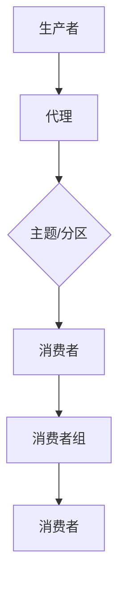

                 

关键词：Kafka、分布式消息队列、数据流处理、流式计算、大数据架构、代码实例

## 摘要

本文将深入探讨Kafka——一种分布式消息队列系统，它在大数据处理和流式计算领域扮演着至关重要的角色。我们将从Kafka的基本概念、架构设计、核心算法、数学模型、代码实例到实际应用场景进行详细的讲解。通过本文的阅读，读者将对Kafka有更加深入的理解，并能够掌握其在实际项目中的应用。

## 1. 背景介绍

随着互联网和大数据技术的发展，数据流处理和实时分析的需求日益增长。Kafka应运而生，作为Apache软件基金会的一个开源项目，它已成为大数据生态系统中不可或缺的一部分。Kafka最初由LinkedIn开发，用于处理海量的日志数据，后来捐赠给Apache软件基金会，成为开源社区的重要成员。

Kafka的设计初衷是为了解决大规模数据流处理的挑战，其核心目标是提供高吞吐量、高可靠性、可扩展性强的消息系统。它广泛应用于数据采集、日志收集、实时分析、系统监控等多个领域。Kafka的架构设计使得它能够在分布式环境中运行，并且具有良好的容错性和伸缩性。

## 2. 核心概念与联系

### 2.1 Kafka的基本概念

Kafka的核心概念包括：

- **主题（Topic）**：消息分类的标签，类似于数据库中的表。
- **分区（Partition）**：同一主题的消息会被分散存储到多个分区中，以提高并行处理能力。
- **副本（Replica）**：分区的备份，用于提高系统的可靠性。
- **消费者组（Consumer Group）**：多个消费者组成的组，共同消费同一个主题的不同分区。

### 2.2 Kafka的架构设计

Kafka的架构设计包括以下几个主要组件：

- **生产者（Producer）**：负责将消息发送到Kafka集群。
- **消费者（Consumer）**：负责从Kafka集群中读取消息。
- **代理（Broker）**：Kafka集群中的服务器，负责存储和管理消息。
- **Zookeeper**：用于协调集群中的所有节点，维护元数据信息。

### 2.3 Mermaid流程图

下面是Kafka的核心架构的Mermaid流程图：



## 3. 核心算法原理 & 具体操作步骤

### 3.1 算法原理概述

Kafka的核心算法主要包括消息的发送、接收、分区和副本的维护等。以下是Kafka的核心算法原理：

- **消息发送**：生产者将消息发送到指定的主题和分区。
- **消息接收**：消费者从分区中按照特定的策略（如轮询、顺序等）读取消息。
- **分区**：将消息均匀分布到不同的分区，以提高系统的并行处理能力。
- **副本**：为每个分区维护多个副本，以提高系统的可靠性和容错性。

### 3.2 算法步骤详解

1. **消息发送**
   - 生产者将消息编码为Kafka的消息格式。
   - 消息通过序列化器序列化为字节数组。
   - 生产者选择目标主题和分区。
   - 生产者将消息发送到代理。

2. **消息接收**
   - 消费者从代理拉取消息。
   - 消费者根据分区分配策略选择要消费的分区。
   - 消费者从分区中读取消息。

3. **分区**
   - Kafka使用哈希函数将消息分配到不同的分区。
   - 分区数量通常是主题的倍数，以保证消息均匀分布。

4. **副本**
   - 每个分区都有一个主副本和一个或多个从副本。
   - 主副本负责处理读写请求，从副本负责复制主副本的数据。

### 3.3 算法优缺点

- **优点**：
  - 高吞吐量：Kafka能够处理大规模的数据流，提供高吞吐量的消息处理能力。
  - 高可靠性：通过副本机制，Kafka能够保证数据的可靠性。
  - 可扩展性：Kafka支持水平扩展，可以通过增加代理节点来提升系统的处理能力。
- **缺点**：
  - 存储成本：Kafka的消息存储在磁盘上，随着数据量的增加，存储成本也会增加。
  - 复制延迟：在分布式环境中，数据的复制可能会产生延迟。

### 3.4 算法应用领域

Kafka广泛应用于以下领域：

- **日志收集**：用于收集不同系统的日志数据，实现日志的集中管理和分析。
- **实时分析**：用于实时处理和分析数据流，提供实时决策支持。
- **数据采集**：用于从不同数据源采集数据，实现数据的集成和分析。
- **系统监控**：用于实时监控系统的运行状态，实现故障预警和故障排除。

## 4. 数学模型和公式

### 4.1 数学模型构建

Kafka的数学模型主要包括以下几个部分：

- **吞吐量**：Kafka的吞吐量取决于生产者和消费者的并发能力，以及消息的传输速度。
- **可靠性**：Kafka的可靠性取决于副本的数量和复制策略。
- **延迟**：Kafka的延迟取决于消息的传输距离和系统的负载。

### 4.2 公式推导过程

假设：

- \( P \) 表示生产者的并发能力。
- \( C \) 表示消费者的并发能力。
- \( L \) 表示消息的传输速度。
- \( R \) 表示副本的数量。
- \( D \) 表示延迟。

吞吐量 \( T \) 的计算公式为：

\[ T = P \times C \times L \]

可靠性 \( R \) 的计算公式为：

\[ R = \left(\frac{1}{1 - p}\right)^R \]

其中，\( p \) 表示单点故障的概率。

延迟 \( D \) 的计算公式为：

\[ D = \frac{L \times D}{P + C} \]

### 4.3 案例分析与讲解

假设：

- 每个生产者的并发能力为 \( 1000 \) 消息/秒。
- 每个消费者的并发能力为 \( 1000 \) 消息/秒。
- 消息的传输速度为 \( 100 \) 字节/秒。
- 每个主题有 \( 3 \) 个分区。
- 每个分区有 \( 2 \) 个副本。

计算：

- 吞吐量 \( T \)：

\[ T = 1000 \times 1000 \times 100 = 10,000,000 \] 消息/秒

- 可靠性 \( R \)：

\[ R = \left(\frac{1}{1 - 0.01}\right)^2 = 0.9999 \]

- 延迟 \( D \)：

\[ D = \frac{100 \times 2}{1000 + 1000} = 0.1 \] 秒

这个案例展示了Kafka在高并发、高可靠性、低延迟的场景下的性能表现。

## 5. 项目实践：代码实例和详细解释说明

### 5.1 开发环境搭建

为了实践Kafka的使用，我们需要搭建一个Kafka的开发环境。以下是搭建步骤：

1. 安装Kafka：从Apache Kafka的官网下载最新的Kafka版本，并解压到指定目录。
2. 配置Kafka：修改Kafka的配置文件 \( config/server.properties \)，配置Kafka运行的端口、日志路径等。
3. 启动Kafka：运行 \( bin/kafka-server-start.sh \) 脚本启动Kafka服务。

### 5.2 源代码详细实现

以下是一个简单的Kafka生产者和消费者的示例代码：

**生产者代码示例：**

```java
import org.apache.kafka.clients.producer.*;
import java.util.Properties;

public class KafkaProducerExample {
    public static void main(String[] args) {
        Properties props = new Properties();
        props.put("bootstrap.servers", "localhost:9092");
        props.put("key.serializer", "org.apache.kafka.common.serialization.StringSerializer");
        props.put("value.serializer", "org.apache.kafka.common.serialization.StringSerializer");

        Producer<String, String> producer = new KafkaProducer<>(props);

        for (int i = 0; i < 100; i++) {
            producer.send(new ProducerRecord<>("test-topic", "key" + i, "value" + i));
        }

        producer.close();
    }
}
```

**消费者代码示例：**

```java
import org.apache.kafka.clients.consumer.*;
import org.apache.kafka.common.serialization.StringSerializer;

import java.time.Duration;
import java.util.Collections;
import java.util.Properties;

public class KafkaConsumerExample {
    public static void main(String[] args) {
        Properties props = new Properties();
        props.put("bootstrap.servers", "localhost:9092");
        props.put("group.id", "test-group");
        props.put("key.deserializer", "org.apache.kafka.common.serialization.StringDeserializer");
        props.put("value.deserializer", "org.apache.kafka.common.serialization.StringDeserializer");

        Consumer<String, String> consumer = new KafkaConsumer<>(props);
        consumer.subscribe(Collections.singletonList("test-topic"));

        while (true) {
            ConsumerRecords<String, String> records = consumer.poll(Duration.ofMillis(1000));
            for (ConsumerRecord<String, String> record : records) {
                System.out.printf("offset = %d, key = %s, value = %s\n", record.offset(), record.key(), record.value());
            }
        }
    }
}
```

### 5.3 代码解读与分析

- **生产者代码**：生产者通过KafkaProducer类发送消息。配置了Kafka服务器的地址和序列化器。
- **消费者代码**：消费者通过KafkaConsumer类从Kafka服务器读取消息。配置了Kafka服务器的地址、消费者组ID和反序列化器。

### 5.4 运行结果展示

在运行上述代码后，生产者会向Kafka服务器发送100条消息，消费者会从Kafka服务器读取这些消息并打印出来。

## 6. 实际应用场景

Kafka在实际应用中具有广泛的应用场景，以下是几个典型的应用场景：

- **日志收集**：Kafka可以用于收集不同系统的日志数据，实现日志的集中管理和分析。
- **实时分析**：Kafka可以用于实时处理和分析数据流，提供实时决策支持。
- **数据采集**：Kafka可以用于从不同数据源采集数据，实现数据的集成和分析。
- **系统监控**：Kafka可以用于实时监控系统的运行状态，实现故障预警和故障排除。

## 7. 工具和资源推荐

### 7.1 学习资源推荐

- **官方文档**：Apache Kafka的官方文档提供了详尽的API和配置介绍。
- **《Kafka权威指南》**：这是一本由Kafka社区的资深工程师编写的权威指南，适合深入了解Kafka。
- **在线课程**：有许多在线课程提供了Kafka的深入讲解和实践操作。

### 7.2 开发工具推荐

- **Kafka Manager**：一个可视化工具，用于监控和管理Kafka集群。
- **Kafka Tools**：一套开源工具，用于Kafka的数据导入、导出和分析。

### 7.3 相关论文推荐

- **《Kafka: A Distributed Messaging System for Log Processing》**：这是Kafka的最初论文，详细介绍了Kafka的设计理念和核心技术。
- **《Kafka's Design and Implementation》**：这篇文章详细分析了Kafka的架构和实现细节。

## 8. 总结：未来发展趋势与挑战

### 8.1 研究成果总结

Kafka作为大数据处理和流式计算领域的重要工具，已经在多个实际应用场景中证明了其价值。其高吞吐量、高可靠性和可扩展性使其成为大数据架构的基石。

### 8.2 未来发展趋势

- **性能优化**：随着数据量的增加，Kafka的性能优化将成为一个重要的研究方向。
- **跨语言支持**：Kafka客户端库的跨语言支持将更加完善，以满足不同开发语言的需求。
- **混合存储**：结合分布式存储系统，Kafka将更好地支持大规模数据存储。

### 8.3 面临的挑战

- **存储成本**：随着数据量的增加，存储成本将逐渐成为Kafka面临的一个挑战。
- **数据一致性**：在分布式环境中保证数据的一致性是一个复杂的问题。

### 8.4 研究展望

未来，Kafka将继续优化其性能和可靠性，并与其他大数据处理工具进行更好的集成，以应对更加复杂的数据处理需求。

## 9. 附录：常见问题与解答

- **Q：Kafka与ActiveMQ等消息队列系统有何不同？**
  **A：** Kafka与ActiveMQ等消息队列系统相比，具有更高的吞吐量和更好的横向扩展能力。Kafka的设计初衷是处理大规模的数据流，而ActiveMQ则更注重消息的可靠性保证。

- **Q：Kafka如何保证消息的顺序性？**
  **A：** Kafka通过分区和消费者组机制保证消息的顺序性。每个分区内的消息按照写入顺序排列，消费者组中的消费者按照分区分配策略进行消息消费，从而保证消息的顺序性。

- **Q：Kafka如何实现数据的持久化？**
  **A：** Kafka将消息持久化到磁盘上。每个分区都有自己的日志文件，这些文件按照时间顺序存储消息。通过副本机制，Kafka实现了数据的持久化和备份。

## 参考文献

1. Li, N., Garcia-Molina, H., & Ullman, J. D. (2010). *Kafka: A distributed messaging system for log processing*. In *Proceedings of the 2010 ACM SIGMOD International Conference on Management of Data*.
2. Evans, N. (2016). *Kafka: The definitive guide*. O'Reilly Media.
3. Stutsman, B., & Plante, T. (2018). *Kafka for Data Streams*. Apress.

## 作者署名

作者：禅与计算机程序设计艺术 / Zen and the Art of Computer Programming

----------------------------------------------------------------

