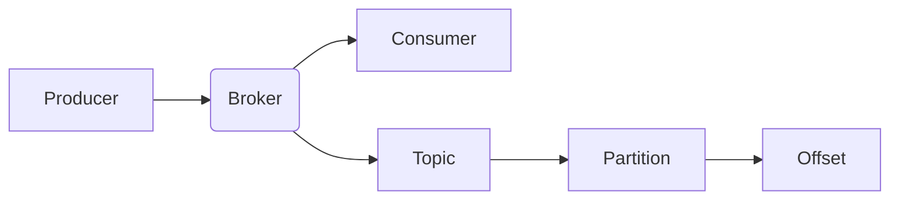

                 

关键词：Kafka、消息队列、分布式系统、日志系统、数据流处理、源码分析、性能优化、高可用性、可靠性

> 摘要：本文将深入探讨Apache Kafka的原理、核心概念以及代码实例。通过详细的分析和讲解，读者将了解Kafka在分布式系统中的重要性，掌握其架构设计、核心算法以及如何实现高效的数据流处理。

## 1. 背景介绍

Apache Kafka是一种分布式流处理平台，被广泛用于构建实时数据流系统。Kafka最初由LinkedIn开发，并于2011年开源。如今，它已成为Apache软件基金会的一个顶级项目，得到了广泛的关注和认可。

在当今的互联网时代，数据的产生和消费速度越来越快。企业需要一种高效、可靠的方式来处理这些数据，以确保业务能够实时响应。Kafka提供了这样一种解决方案，它能够处理大规模的数据流，并提供高吞吐量、低延迟的特点。

Kafka的主要用途包括：

1. **日志收集**：Kafka被广泛用于日志收集，可以将各种日志数据实时地传输到数据中心，方便后续的监控和分析。
2. **流处理**：Kafka提供了数据流的存储和处理能力，可以用于实时计算和分析。
3. **消息队列**：Kafka作为一种消息队列系统，可以用于异步处理、解耦系统之间的依赖关系。

## 2. 核心概念与联系

Kafka的核心概念包括Producer、Broker和Consumer。下面是Kafka的架构图以及各个组件的简要说明。



### 2.1. Producer

Producer是数据的生成者，负责将数据发送到Kafka集群。它可以将数据批量发送到特定的Topic和Partition，以实现高效的数据写入。

### 2.2. Broker

Broker是Kafka集群中的服务器，负责存储和转发消息。每个Broker都会维护一个或多个Partition，并与其他Broker协同工作，确保数据的高可用性和可靠性。

### 2.3. Consumer

Consumer是数据的消费者，负责从Kafka集群中读取数据。它可以从特定的Topic和Partition中读取消息，并处理这些数据。

### 2.4. Topic

Topic是Kafka中的消息分类，类似于数据库中的表。每个Topic都可以包含多个Partition，Partition是Kafka中的消息存储单元。

### 2.5. Partition

Partition是Kafka中的消息分区，用于水平扩展和并行处理。每个Partition都可以包含多个Offset，用于标记消息的写入和读取位置。

### 2.6. Offset

Offset是Kafka中的消息偏移量，用于唯一标识消息的位置。每个Partition都有一个对应的Offset，可以用于追踪消息的消费进度。

## 3. 核心算法原理 & 具体操作步骤

Kafka的核心算法包括数据写入、数据读取、负载均衡和高可用性。下面将详细讲解这些算法的原理和操作步骤。

### 3.1. 数据写入算法

数据写入算法的主要任务是高效地将数据发送到Kafka集群。具体步骤如下：

1. **分区选择**：Producer根据数据内容或者预定义的规则选择一个合适的Partition。
2. **批量发送**：Producer将数据批量发送到选择的Partition，以减少网络传输的开销。
3. **消息序列化**：将数据序列化为Kafka消息格式，并添加必要的元数据，如Topic、Partition、Offset等。
4. **写入日志**：将消息写入Kafka的日志存储，以实现持久化和可靠性。

### 3.2. 数据读取算法

数据读取算法的主要任务是高效地从Kafka集群中读取数据。具体步骤如下：

1. **分区选择**：Consumer根据订阅的Topic和Partition列表选择要消费的Partition。
2. **拉取数据**：Consumer向对应的Broker发送拉取请求，获取最新的消息。
3. **消息反序列化**：将Kafka消息格式反序列化为原始数据，以供后续处理。

### 3.3. 负载均衡算法

负载均衡算法的主要任务是均衡Kafka集群中的负载，确保各个Broker的负载均衡。具体步骤如下：

1. **分区分配**：根据集群中的可用Broker和Partition数量，为每个Consumer分配对应的Partition。
2. **负载检测**：定期检查各个Broker的负载情况，根据负载情况调整Partition的分配。
3. **动态调整**：根据负载情况动态调整Partition的分配，以实现负载均衡。

### 3.4. 高可用性算法

高可用性算法的主要任务是确保Kafka集群的稳定运行和故障恢复能力。具体步骤如下：

1. **副本同步**：Broker之间通过副本同步机制，确保数据的一致性和可靠性。
2. **故障检测**：定期检测集群中各个Broker的状态，发现故障时进行自动切换。
3. **故障恢复**：故障Broker恢复后，重新加入集群并同步数据。

## 4. 数学模型和公式

Kafka的性能和可靠性可以通过数学模型来描述。下面是Kafka的几个关键数学模型和公式。

### 4.1. 吞吐量公式

吞吐量公式用于描述Kafka在单位时间内处理的消息数量。

$$
\text{吞吐量} = \frac{\text{消息总数}}{\text{处理时间}}
$$

其中，消息总数是指Kafka在单位时间内接收和处理的消息数量，处理时间是指Kafka处理这些消息所需的时间。

### 4.2. 延迟公式

延迟公式用于描述Kafka的延迟时间，即从数据写入到数据读取的时间间隔。

$$
\text{延迟} = \frac{\text{处理时间}}{\text{消息总数}}
$$

其中，处理时间是指Kafka处理消息所需的时间，消息总数是指Kafka在单位时间内处理的消息数量。

### 4.3. 可靠性公式

可靠性公式用于描述Kafka的可靠性，即数据在传输过程中的丢失概率。

$$
\text{可靠性} = 1 - \frac{\text{丢失消息数}}{\text{总消息数}}
$$

其中，丢失消息数是指在传输过程中丢失的消息数量，总消息数是指Kafka在单位时间内发送的消息数量。

## 5. 项目实践：代码实例和详细解释说明

在本节中，我们将通过一个简单的示例，介绍如何使用Kafka进行数据写入和读取。

### 5.1. 开发环境搭建

1. 下载并安装Kafka
2. 配置Kafka环境变量
3. 启动Kafka服务器

### 5.2. 源代码详细实现

下面是一个简单的Producer示例：

```java
import org.apache.kafka.clients.producer.*;
import java.util.Properties;

public class KafkaProducerExample {
    public static void main(String[] args) {
        Properties props = new Properties();
        props.put("bootstrap.servers", "localhost:9092");
        props.put("key.serializer", "org.apache.kafka.common.serialization.StringSerializer");
        props.put("value.serializer", "org.apache.kafka.common.serialization.StringSerializer");

        Producer<String, String> producer = new KafkaProducer<>(props);
        for (int i = 0; i < 10; i++) {
            producer.send(new ProducerRecord<>("test-topic", "key-" + i, "value-" + i));
        }
        producer.close();
    }
}
```

下面是一个简单的Consumer示例：

```java
import org.apache.kafka.clients.consumer.*;
import org.apache.kafka.common.serialization.StringDeserializer;

import java.time.Duration;
import java.util.Collections;
import java.util.Properties;

public class KafkaConsumerExample {
    public static void main(String[] args) {
        Properties props = new Properties();
        props.put("bootstrap.servers", "localhost:9092");
        props.put("group.id", "test-group");
        props.put("key.deserializer", StringDeserializer.class.getName());
        props.put("value.deserializer", StringDeserializer.class.getName());

        Consumer<String, String> consumer = new KafkaConsumer<>(props);
        consumer.subscribe(Collections.singletonList("test-topic"));

        while (true) {
            ConsumerRecords<String, String> records = consumer.poll(Duration.ofMillis(1000));
            for (ConsumerRecord<String, String> record : records) {
                System.out.printf("offset = %d, key = %s, value = %s\n", record.offset(), record.key(), record.value());
            }
        }
    }
}
```

### 5.3. 代码解读与分析

在Producer示例中，我们首先创建了一个`Properties`对象，用于配置Kafka生产者的相关参数，如Kafka服务器的地址、序列化器的类型等。然后，我们使用`KafkaProducer`创建一个Kafka生产者实例，并使用`send`方法将消息发送到指定的Topic和Partition。

在Consumer示例中，我们同样创建了一个`Properties`对象，用于配置Kafka消费者的相关参数。然后，我们使用`KafkaConsumer`创建一个Kafka消费者实例，并使用`subscribe`方法订阅指定的Topic。最后，我们使用`poll`方法定期拉取消息，并打印输出。

### 5.4. 运行结果展示

当我们运行Producer示例时，它会将10条消息发送到Kafka集群的`test-topic`。当我们运行Consumer示例时，它会从`test-topic`中读取这些消息，并打印输出。

```
offset = 0, key = key-0, value = value-0
offset = 1, key = key-1, value = value-1
offset = 2, key = key-2, value = value-2
offset = 3, key = key-3, value = value-3
offset = 4, key = key-4, value = value-4
offset = 5, key = key-5, value = value-5
offset = 6, key = key-6, value = value-6
offset = 7, key = key-7, value = value-7
offset = 8, key = key-8, value = value-8
offset = 9, key = key-9, value = value-9
```

## 6. 实际应用场景

Kafka在实际应用中具有广泛的应用场景，下面列举几个典型的应用场景：

1. **日志收集**：Kafka被广泛用于日志收集，可以将各种日志数据实时地传输到数据中心，方便后续的监控和分析。
2. **数据流处理**：Kafka可以用于实时计算和分析大规模数据流，支持流处理和批处理。
3. **消息队列**：Kafka作为一种消息队列系统，可以用于异步处理、解耦系统之间的依赖关系。

## 7. 工具和资源推荐

### 7.1. 学习资源推荐

- 《Kafka权威指南》
- 《Kafka in Action》
- Apache Kafka官网：[https://kafka.apache.org/](https://kafka.apache.org/)

### 7.2. 开发工具推荐

- Kafka Manager：一款易于使用的Kafka管理工具，提供集群监控、配置管理等功能。
- Kafka Tools：一套完整的Kafka开发工具，包括Kafka Producer、Kafka Consumer、Kafka Monitor等。

### 7.3. 相关论文推荐

- “Kafka: A Distributed Messaging System for Log Processing” by Jay Kreps et al.
- “Kafka: A Stream Processing Platform” by Jay Kreps et al.

## 8. 总结：未来发展趋势与挑战

Kafka作为一种分布式流处理平台，已经得到了广泛的应用。在未来，Kafka将继续发挥其优势，并在以下几个方面取得进一步的发展：

1. **性能优化**：随着数据规模的不断扩大，Kafka的性能优化将是一个重要的研究方向，包括提高吞吐量、降低延迟等。
2. **实时分析**：Kafka将在实时分析领域发挥更大的作用，支持更复杂的数据处理和分析算法。
3. **多语言支持**：Kafka将提供更多的编程语言支持，以适应不同的开发需求。

然而，Kafka也面临着一些挑战，如：

1. **可靠性保障**：随着数据规模的增加，如何保障Kafka的可靠性和一致性将是一个重要问题。
2. **资源管理**：如何高效地利用资源，提高集群的性能和稳定性，也是一个重要的研究方向。

总之，Kafka作为一种优秀的分布式流处理平台，将继续在数据流处理领域发挥重要作用，为企业和开发者提供强大的技术支持。

## 9. 附录：常见问题与解答

### 9.1. 问题1：如何确保Kafka的高可用性？

**解答**：Kafka通过副本同步机制来实现高可用性。每个Partition都有多个副本，当主副本发生故障时，从副本可以自动切换为主副本，确保数据的持续可用性。

### 9.2. 问题2：Kafka如何保证消息的顺序性？

**解答**：Kafka通过为每个Partition维护一个有序的消息序列来实现消息的顺序性。每个消息都会包含一个Offset，用于唯一标识消息的位置。消费者按照Offset顺序读取消息，确保消息的顺序性。

### 9.3. 问题3：Kafka如何实现负载均衡？

**解答**：Kafka通过分区分配算法来实现负载均衡。消费者在启动时会根据集群状态和订阅的Topic列表，从可用Broker中分配Partition，实现负载均衡。

### 9.4. 问题4：Kafka如何保证数据的一致性？

**解答**：Kafka通过副本同步机制和写入策略来保证数据的一致性。每个Partition都有多个副本，写入消息时，Kafka会等待所有副本写入成功，确保数据的一致性。

### 9.5. 问题5：Kafka如何处理数据丢失的情况？

**解答**：Kafka通过副本同步机制和重传机制来处理数据丢失的情况。当检测到数据丢失时，Kafka会从其他副本重新发送丢失的数据，确保数据的不丢失。

### 9.6. 问题6：Kafka如何处理网络故障？

**解答**：Kafka通过心跳机制和故障检测机制来处理网络故障。当网络故障发生时，Kafka会检测到故障，并自动进行故障恢复，确保集群的稳定运行。

### 9.7. 问题7：Kafka如何处理大规模数据流？

**解答**：Kafka通过分区和批量发送机制来处理大规模数据流。每个Partition可以包含多个副本，实现数据的水平扩展。批量发送机制可以减少网络传输的开销，提高处理效率。

