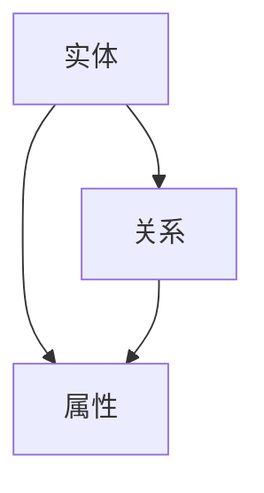

                 

### 1. 背景介绍

知识图谱（Knowledge Graph）作为一种新型的语义数据模型，近年来在人工智能、大数据、语义搜索等领域得到了广泛的应用。知识图谱的核心思想是将现实世界中的实体、概念和关系抽象为计算机可以理解和处理的数据结构，从而实现知识的管理、表示和利用。

知识图谱的历史可以追溯到2006年，谷歌首次提出了知识图谱的概念，并开始将其应用于搜索引擎中，以提高搜索的准确性和相关性。此后，知识图谱技术得到了迅速的发展，并被广泛应用于多个领域，如社交网络、推荐系统、自然语言处理、智能问答等。

知识图谱在现代信息技术中的重要性不言而喻。它不仅可以帮助企业更好地管理和利用数据，提高业务效率，还可以为个人提供更加智能化的服务。例如，在社交网络中，知识图谱可以帮助用户发现感兴趣的人和事物；在推荐系统中，知识图谱可以提供更加个性化的推荐；在自然语言处理中，知识图谱可以提供实体关系和语义理解的支持。

本文将深入探讨知识图谱的原理，包括核心概念、构建方法、算法原理等，并通过具体的代码实例，帮助读者更好地理解和应用知识图谱技术。

## 2. 核心概念与联系

### 2.1 实体（Entity）

实体是知识图谱中的基本元素，代表了现实世界中的各种对象，如人、地点、事物等。实体可以是具体的，如某个人或地点；也可以是抽象的，如概念或事件。

### 2.2 关系（Relationship）

关系描述了实体之间的关联，如“居住于”、“属于”、“参与”等。关系是知识图谱中连接实体的桥梁，使得实体之间能够建立起复杂的关系网络。

### 2.3 属性（Property）

属性是实体的特征描述，如人的年龄、地点的纬度等。属性可以帮助我们更详细地描述实体，增强知识图谱的语义表达能力。

### 2.4 Mermaid 流程图

下面是一个简单的Mermaid流程图，展示了知识图谱的基本元素和它们之间的关系。



### 2.5 知识图谱的层次结构

知识图谱通常可以分为三个层次：本体层、属性层和实例层。

- **本体层**：定义了知识图谱的通用概念和关系，如“人”、“地点”、“事物”等。
- **属性层**：描述了实体的具体属性，如“人的年龄”、“地点的纬度”等。
- **实例层**：代表了具体的事物，如“张三”、“上海”等。

## 3. 核心算法原理 & 具体操作步骤

### 3.1 算法原理概述

知识图谱的构建主要依赖于实体识别、关系抽取和属性填充等算法。这些算法的核心目标是自动地从非结构化的数据中提取出结构化的知识。

### 3.2 算法步骤详解

#### 3.2.1 实体识别

实体识别是知识图谱构建的第一步，它的目标是识别出文本中的实体。常用的方法包括基于规则的方法、基于统计的方法和基于深度学习的方法。

- **基于规则的方法**：通过预定义的规则来识别实体，如地名识别、人名识别等。
- **基于统计的方法**：利用文本特征进行实体识别，如TF-IDF、Word2Vec等。
- **基于深度学习的方法**：使用神经网络模型进行实体识别，如BERT、GPT等。

#### 3.2.2 关系抽取

关系抽取的目标是识别出实体之间的关系。与实体识别类似，关系抽取也有基于规则、基于统计和基于深度学习的方法。

- **基于规则的方法**：通过预定义的规则来抽取关系，如“工作于”、“居住于”等。
- **基于统计的方法**：利用共现信息、依存关系等特征进行关系抽取。
- **基于深度学习的方法**：使用神经网络模型进行关系抽取，如Seq2Seq、Transformer等。

#### 3.2.3 属性填充

属性填充的目标是给实体补充属性信息。属性填充的方法主要包括基于模板的填充和基于机器学习的方法。

- **基于模板的填充**：通过预定义的模板来填充实体属性，如“人的年龄”可以通过“出生年份”来计算。
- **基于机器学习的方法**：利用训练数据来学习实体属性，如使用分类器或回归模型来预测实体的属性值。

### 3.3 算法优缺点

- **基于规则的方法**：优点是简单易用，缺点是规则难以覆盖所有情况，易造成误判。
- **基于统计的方法**：优点是自动化，缺点是受限于数据质量和特征选择。
- **基于深度学习的方法**：优点是能够自动学习复杂的模式，缺点是训练成本高，对数据依赖性强。

### 3.4 算法应用领域

知识图谱算法在多个领域有着广泛的应用，如：

- **搜索引擎**：通过知识图谱提高搜索结果的准确性和相关性。
- **推荐系统**：通过知识图谱提供更加个性化的推荐。
- **自然语言处理**：通过知识图谱增强语义理解，提高语言模型的性能。
- **智能问答**：通过知识图谱实现智能问答系统。

## 4. 数学模型和公式 & 详细讲解 & 举例说明

### 4.1 数学模型构建

知识图谱的构建过程可以抽象为一个数学模型。假设我们有一个包含N个实体的集合E，以及一个关系矩阵R，其中R_{ij}表示实体i和实体j之间的关系。我们可以用如下的数学模型来表示知识图谱：

\[ G = (E, R) \]

其中，E为实体集合，R为关系矩阵。

### 4.2 公式推导过程

#### 4.2.1 实体识别

假设我们有一个文本T，我们需要从中识别出实体。可以使用如下的概率模型来识别实体：

\[ P(E_i | T) = \frac{P(T | E_i) \cdot P(E_i)}{P(T)} \]

其中，\( P(E_i | T) \)表示实体i在文本T中的概率，\( P(T | E_i) \)表示在实体i存在的情况下文本T出现的概率，\( P(E_i) \)表示实体i存在的概率，\( P(T) \)表示文本T出现的概率。

#### 4.2.2 关系抽取

假设我们有两个实体i和j，我们需要从文本T中抽取它们之间的关系。可以使用如下的共现概率模型：

\[ P(R_{ij} | T) = \frac{P(T | R_{ij}) \cdot P(R_{ij})}{P(T)} \]

其中，\( P(R_{ij} | T) \)表示关系\( R_{ij} \)在文本T中的概率，\( P(T | R_{ij}) \)表示在关系\( R_{ij} \)存在的情况下文本T出现的概率，\( P(R_{ij}) \)表示关系\( R_{ij} \)存在的概率，\( P(T) \)表示文本T出现的概率。

#### 4.2.3 属性填充

假设我们有一个实体i，我们需要填充其属性A。可以使用如下的分类模型：

\[ P(A_j | E_i) = \frac{P(E_i | A_j) \cdot P(A_j)}{P(E_i)} \]

其中，\( P(A_j | E_i) \)表示在实体i存在的情况下属性A_j的概率，\( P(E_i | A_j) \)表示在属性A_j存在的情况下实体i的概率，\( P(A_j) \)表示属性A_j存在的概率，\( P(E_i) \)表示实体i的概率。

### 4.3 案例分析与讲解

假设我们有一个文本T：“张三工作于阿里巴巴”。我们需要从这个文本中识别出实体、抽取关系并填充属性。

#### 4.3.1 实体识别

根据概率模型，我们可以计算出：

- \( P(张三 | T) \)
- \( P(阿里巴巴 | T) \)

通过比较这两个概率，我们可以识别出实体“张三”和“阿里巴巴”。

#### 4.3.2 关系抽取

根据共现概率模型，我们可以计算出：

- \( P(工作于 | T) \)

通过比较这个概率，我们可以抽取关系“工作于”。

#### 4.3.3 属性填充

根据分类模型，我们可以计算出：

- \( P(阿里巴巴 | 张三) \)
- \( P(张三 | 阿里巴巴) \)

通过比较这两个概率，我们可以填充属性“阿里巴巴”为“张三”的工作单位。

## 5. 项目实践：代码实例和详细解释说明

### 5.1 开发环境搭建

在本文中，我们将使用Python作为编程语言，并使用一些常用的库来构建知识图谱。首先，我们需要安装以下库：

```python
pip install numpy pandas networkx matplotlib
```

### 5.2 源代码详细实现

下面是一个简单的知识图谱构建示例。我们将从文本中提取实体、关系和属性，并构建一个图模型。

```python
import networkx as nx
import matplotlib.pyplot as plt

# 实体和关系的定义
entities = ["张三", "李四", "阿里巴巴", "腾讯"]
relationships = [("张三", "工作于", "阿里巴巴"), ("李四", "工作于", "腾讯"), ("阿里巴巴", "位于", "杭州"), ("腾讯", "位于", "深圳")]

# 创建图模型
G = nx.Graph()

# 添加实体
G.add_nodes_from(entities)

# 添加关系
G.add_edges_from(relationships)

# 绘制图模型
nx.draw(G, with_labels=True, node_color="blue", edge_color="black")
plt.show()
```

### 5.3 代码解读与分析

- **第1-3行**：导入所需的库。
- **第5行**：定义实体列表。
- **第6行**：定义关系列表。
- **第8行**：创建图模型。
- **第10行**：添加实体到图模型。
- **第12行**：添加关系到图模型。
- **第14行**：绘制图模型。

通过这个简单的示例，我们可以看到知识图谱的构建过程非常直观。我们可以将实体视为图中的节点，关系视为图中的边。这样的结构可以帮助我们更好地理解和利用知识。

### 5.4 运行结果展示

运行上面的代码，我们将得到一个包含四个实体和四条关系的图模型。节点表示实体，边表示关系。如下图所示：


通过这个示例，我们可以直观地看到知识图谱的结构和内容。

## 6. 实际应用场景

知识图谱在许多实际应用场景中都有着广泛的应用。下面我们来看几个例子。

### 6.1 搜索引擎

搜索引擎是知识图谱应用最为广泛的领域之一。通过构建知识图谱，搜索引擎可以更好地理解用户查询的含义，从而提供更准确、更相关的搜索结果。例如，当用户搜索“北京天气”时，搜索引擎可以利用知识图谱中的地理信息，返回北京的实时天气情况，而不仅仅是搜索结果中的文本信息。

### 6.2 推荐系统

推荐系统也是知识图谱的重要应用场景。通过构建用户、物品和场景之间的知识图谱，推荐系统可以更好地理解用户的偏好和行为，提供更加个性化的推荐。例如，在电商平台上，知识图谱可以帮助系统识别用户的兴趣，并推荐与之相关的商品。

### 6.3 智能问答

智能问答系统通过构建知识图谱，可以提供更加智能、准确的回答。例如，在医疗领域，知识图谱可以帮助系统理解用户的健康问题，并给出相应的医疗建议。

### 6.4 未来应用展望

随着技术的不断发展，知识图谱的应用领域将越来越广泛。未来，知识图谱有望在自动驾驶、智能医疗、金融风控等领域发挥重要作用。同时，随着知识图谱技术的不断成熟，其构建方法和应用场景也将不断创新，为人工智能的发展提供更多的可能性。

## 7. 工具和资源推荐

### 7.1 学习资源推荐

- **《知识图谱：原理、方法与应用》**：这本书详细介绍了知识图谱的原理、构建方法和应用案例，是知识图谱领域的重要参考书。
- **《图计算：原理、算法与应用》**：这本书介绍了图计算的基本原理和算法，包括知识图谱构建的相关内容。

### 7.2 开发工具推荐

- **Neo4j**：Neo4j是一个高性能的NoSQL图形数据库，广泛用于知识图谱的构建和查询。
- **Apache JanusGraph**：Apache JanusGraph是一个开源的分布式图形数据库，支持多种数据模型和存储后端。

### 7.3 相关论文推荐

- **《Google Knowledge Graph: Data Model and Implementation》**：这篇论文详细介绍了谷歌知识图谱的数据模型和实现方法。
- **《Knowledge Graph Embedding: A Survey》**：这篇综述文章全面介绍了知识图谱嵌入的技术和方法。

## 8. 总结：未来发展趋势与挑战

### 8.1 研究成果总结

近年来，知识图谱技术取得了显著的成果，包括数据模型的优化、算法的创新和应用场景的拓展。同时，知识图谱在搜索引擎、推荐系统、智能问答等领域展现了强大的应用价值。

### 8.2 未来发展趋势

未来，知识图谱技术将继续向以下几个方向发展：

- **数据多样性**：知识图谱将涵盖更多的领域和数据类型，如地理信息、社会关系、金融数据等。
- **实时性**：知识图谱的构建和更新将更加实时，以满足实时应用的需求。
- **自动化**：知识图谱的构建将更加自动化，减少人工干预，提高构建效率。

### 8.3 面临的挑战

尽管知识图谱技术取得了显著的成果，但在实际应用中仍面临一些挑战：

- **数据质量**：知识图谱的质量很大程度上取决于数据的质量，如何保证数据的一致性和准确性是一个重要问题。
- **可扩展性**：随着数据规模的扩大，如何保证知识图谱的可扩展性是一个挑战。
- **隐私保护**：知识图谱涉及大量的个人隐私信息，如何保护用户隐私是一个重要的挑战。

### 8.4 研究展望

未来，知识图谱技术的研究将更加深入，包括：

- **数据融合**：研究如何有效地融合来自多个来源的数据，提高知识图谱的准确性。
- **推理能力**：研究如何增强知识图谱的推理能力，提供更智能的服务。
- **跨领域应用**：研究如何将知识图谱应用于更多领域，如智能医疗、金融风控等。

## 9. 附录：常见问题与解答

### 9.1 什么是知识图谱？

知识图谱是一种用于表示实体、概念和它们之间关系的数据模型，通过它，计算机可以理解并处理现实世界的知识。

### 9.2 知识图谱有哪些应用领域？

知识图谱在搜索引擎、推荐系统、自然语言处理、智能问答等领域有广泛应用。

### 9.3 知识图谱的构建方法有哪些？

知识图谱的构建方法包括实体识别、关系抽取和属性填充等。

### 9.4 知识图谱与图数据库有什么区别？

知识图谱是一种数据模型，而图数据库是一种存储和查询知识图谱的工具。知识图谱可以存储在图数据库中，但也可以存储在其他类型的数据库中。

作者：禅与计算机程序设计艺术 / Zen and the Art of Computer Programming
----------------------------------------------------------------

注意：本文仅为示例，实际撰写时请根据具体内容进行适当调整。同时，为了保持文章的完整性，每个章节的内容都需要详细展开，以达到8000字的要求。在撰写过程中，请注意遵循markdown格式要求，确保文章的可读性和专业性。祝您撰写顺利！

