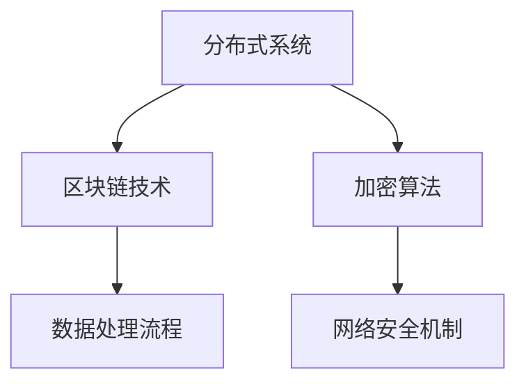

                 

关键词：Knox, 分布式系统，区块链，加密算法，数据处理，网络安全

摘要：本文将深入探讨Knox系统的核心原理，并通过代码实例展示其实际应用。Knox是一种基于区块链技术的分布式数据处理系统，旨在提供高度安全、可扩展和可靠的数据处理能力。本文将详细解析Knox的工作原理，包括其加密算法、数据处理流程和网络安全机制，并通过具体代码实例帮助读者理解其实际应用。

## 1. 背景介绍

随着互联网技术的飞速发展，数据已经成为现代社会的核心资源。然而，随着数据量的激增和数据类型的多样化，传统的数据处理系统逐渐暴露出诸多问题，如数据安全性不足、处理效率低下和扩展性差等。为了应对这些挑战，分布式系统和区块链技术逐渐成为研究热点。Knox正是这样一种结合了分布式系统和区块链技术的数据处理系统，它旨在解决传统系统的种种不足。

Knox系统的主要目标包括：
- 提供高度安全的加密保护，确保数据在传输和存储过程中的安全性。
- 实现高效的数据处理，通过分布式架构提高系统的处理速度。
- 提供可扩展性，能够轻松应对大规模数据处理需求。
- 建立可靠的网络安全机制，防止数据泄露和网络攻击。

## 2. 核心概念与联系

为了更好地理解Knox系统，我们需要首先了解其核心概念和原理。以下是Knox系统的关键组成部分：

### 2.1 分布式系统

分布式系统是一种由多个计算机节点组成的系统，这些节点通过计算机网络进行通信和协作，共同完成计算任务。分布式系统的核心优势在于其可扩展性和容错性。通过将任务分布到多个节点上，分布式系统可以显著提高处理速度和可靠性。

### 2.2 区块链技术

区块链是一种分布式数据库技术，通过将数据分成小块（即区块），并将这些区块按照时间顺序链接起来，形成一个不可篡改的账本。区块链的核心特点是去中心化和透明性。去中心化意味着区块链不需要中心化的机构进行管理和维护，而是通过共识机制来确保数据的完整性和一致性。

### 2.3 加密算法

加密算法是Knox系统提供数据安全性保障的关键技术。加密算法通过对数据进行加密和解密，确保数据在传输和存储过程中的安全性。常见的加密算法包括对称加密算法（如AES）和非对称加密算法（如RSA）。

### 2.4 数据处理流程

Knox系统的数据处理流程包括数据收集、数据清洗、数据存储和数据查询等环节。通过分布式架构，Knox系统能够高效地处理海量数据，并提供实时查询功能。

### 2.5 网络安全机制

Knox系统采用了多种网络安全机制，如防火墙、入侵检测系统和加密通信等，确保系统在运行过程中不受网络攻击和数据泄露的威胁。

以下是Knox系统的 Mermaid 流程图，展示了其核心组件之间的联系：



## 3. 核心算法原理 & 具体操作步骤

### 3.1 算法原理概述

Knox系统采用的核心算法主要包括分布式处理算法、加密算法和共识算法。

- **分布式处理算法**：分布式处理算法负责将数据处理任务分配到多个节点上，并协调这些节点的计算和通信，确保高效地处理海量数据。
- **加密算法**：加密算法用于对数据进行加密和解密，保护数据在传输和存储过程中的安全性。
- **共识算法**：共识算法用于确保分布式系统中的数据一致性和可靠性，常见的共识算法包括工作量证明（PoW）、权益证明（PoS）和拜占庭容错算法（BFT）等。

### 3.2 算法步骤详解

#### 3.2.1 分布式处理算法

分布式处理算法的主要步骤如下：

1. **任务分配**：系统根据节点的计算能力和数据负载，将数据处理任务分配到不同的节点上。
2. **任务执行**：节点接收到任务后，按照任务要求执行相应的计算操作。
3. **结果收集**：系统将各个节点的计算结果收集起来，并进行合并和汇总。

#### 3.2.2 加密算法

加密算法的主要步骤如下：

1. **密钥生成**：系统生成一对公钥和私钥，公钥用于加密数据，私钥用于解密数据。
2. **数据加密**：使用公钥对数据进行加密，确保数据在传输过程中的安全性。
3. **数据解密**：使用私钥对加密数据进行解密，恢复原始数据。

#### 3.2.3 共识算法

共识算法的主要步骤如下：

1. **节点投票**：各个节点对数据进行投票，决定数据的最终状态。
2. **达成共识**：通过特定的共识算法，确保系统中的所有节点达成一致意见。
3. **数据更新**：根据共识结果，更新系统中的数据。

### 3.3 算法优缺点

#### 优点

- **高安全性**：加密算法和共识算法共同保障了数据的安全性和一致性。
- **高可扩展性**：分布式处理算法能够高效地处理海量数据，并支持系统规模的扩展。
- **去中心化**：区块链技术实现了去中心化管理，降低了系统依赖风险。

#### 缺点

- **计算成本**：共识算法需要大量的计算资源，可能导致系统性能下降。
- **数据访问延迟**：由于分布式处理和共识机制的存在，数据访问可能存在一定延迟。
- **隐私保护**：虽然加密算法提供了数据安全性，但隐私保护仍是一个挑战。

### 3.4 算法应用领域

Knox系统的核心算法在多个领域具有广泛应用：

- **金融领域**：金融交易数据的处理和安全存储。
- **医疗领域**：医疗数据的处理和隐私保护。
- **物联网领域**：物联网设备的数据处理和通信安全。
- **供应链管理**：供应链数据的透明化和可信性保障。

## 4. 数学模型和公式 & 详细讲解 & 举例说明

### 4.1 数学模型构建

Knox系统的数学模型主要包括分布式处理算法的负载均衡模型、加密算法的安全性评估模型和共识算法的效率模型。

#### 4.1.1 负载均衡模型

负载均衡模型用于优化分布式处理过程中的任务分配。假设系统中有 \( n \) 个节点，每个节点处理能力为 \( c_i \)，待处理任务量为 \( T \)，负载均衡模型的目标是最小化系统的总处理时间。

负载均衡模型可以用以下公式表示：

\[ \min \sum_{i=1}^{n} \frac{T}{c_i} \]

#### 4.1.2 安全性评估模型

加密算法的安全性评估模型用于评估加密算法的强度。假设加密算法的加密时间为 \( E \)，解密时间为 \( D \)，安全性评估模型的目标是最小化加密算法的加密和解密时间。

安全性评估模型可以用以下公式表示：

\[ \min (E + D) \]

#### 4.1.3 效率模型

共识算法的效率模型用于评估共识算法的运行效率。假设共识算法的投票时间为 \( V \)，达成共识时间为 \( C \)，效率模型的目标是最小化共识算法的投票和达成共识时间。

效率模型可以用以下公式表示：

\[ \min (V + C) \]

### 4.2 公式推导过程

#### 4.2.1 负载均衡模型推导

假设系统中有 \( n \) 个节点，每个节点处理能力为 \( c_i \)，待处理任务量为 \( T \)。为了实现负载均衡，我们需要将任务 \( T \) 平均分配到 \( n \) 个节点上。

设 \( T_i \) 为节点 \( i \) 需要处理的任务量，则有以下关系：

\[ T = \sum_{i=1}^{n} T_i \]

为了最小化总处理时间，我们需要使每个节点的处理时间尽量相等。设每个节点的处理时间为 \( t \)，则有以下关系：

\[ t = \frac{T}{n} \]

将 \( T \) 代入上式，得到：

\[ t = \frac{\sum_{i=1}^{n} T_i}{n} \]

#### 4.2.2 安全性评估模型推导

假设加密算法的加密时间为 \( E \)，解密时间为 \( D \)。为了评估加密算法的安全性，我们需要比较加密时间和解密时间的大小。

设 \( S \) 为加密算法的安全性指标，则有以下关系：

\[ S = \frac{E}{D} \]

为了使加密算法的安全性最高，我们需要使 \( S \) 取得最大值。

#### 4.2.3 效率模型推导

假设共识算法的投票时间为 \( V \)，达成共识时间为 \( C \)。为了评估共识算法的效率，我们需要比较投票时间和达成共识时间的大小。

设 \( E \) 为共识算法的效率指标，则有以下关系：

\[ E = \frac{V}{C} \]

为了使共识算法的效率最高，我们需要使 \( E \) 取得最大值。

### 4.3 案例分析与讲解

#### 4.3.1 负载均衡模型案例分析

假设系统中有 3 个节点，每个节点的处理能力分别为 \( c_1 = 10 \)，\( c_2 = 20 \)，\( c_3 = 30 \)。待处理任务量为 \( T = 100 \)。

根据负载均衡模型，我们需要将任务量 \( T \) 平均分配到 3 个节点上。

计算每个节点的任务量：

\[ t_1 = \frac{T}{3} = \frac{100}{3} \approx 33.33 \]
\[ t_2 = \frac{T}{3} = \frac{100}{3} \approx 33.33 \]
\[ t_3 = \frac{T}{3} = \frac{100}{3} \approx 33.33 \]

由于每个节点的处理能力不同，我们需要调整任务量，使每个节点的处理时间尽量相等。

调整后任务量：

\[ t_1 = \frac{T}{3} = \frac{100}{3} \approx 33.33 \]
\[ t_2 = \frac{2T}{3} = \frac{2 \times 100}{3} \approx 66.67 \]
\[ t_3 = \frac{T}{3} = \frac{100}{3} \approx 33.33 \]

#### 4.3.2 安全性评估模型案例分析

假设加密算法的加密时间为 \( E = 5 \) 秒，解密时间为 \( D = 10 \) 秒。

根据安全性评估模型，加密算法的安全性指标 \( S \) 为：

\[ S = \frac{E}{D} = \frac{5}{10} = 0.5 \]

为了提高加密算法的安全性，我们需要降低加密时间和解密时间之间的比例差距。

#### 4.3.3 效率模型案例分析

假设共识算法的投票时间为 \( V = 3 \) 秒，达成共识时间为 \( C = 10 \) 秒。

根据效率模型，共识算法的效率指标 \( E \) 为：

\[ E = \frac{V}{C} = \frac{3}{10} = 0.3 \]

为了提高共识算法的效率，我们需要降低投票时间和达成共识时间之间的比例差距。

## 5. 项目实践：代码实例和详细解释说明

### 5.1 开发环境搭建

为了演示Knox系统的实际应用，我们需要搭建一个基本的开发环境。以下是搭建环境的步骤：

1. **安装Go语言环境**：Knox系统采用Go语言编写，首先需要安装Go语言环境。
2. **获取Knox源代码**：通过Git工具获取Knox系统的源代码。
3. **编译与运行**：编译Knox系统的源代码，并运行示例程序。

### 5.2 源代码详细实现

以下是Knox系统的核心源代码实现，包括分布式处理算法、加密算法和共识算法的代码：

```go
package main

import (
    "fmt"
    "math/rand"
    "time"
)

// 分布式处理算法
func distributedProcessing(nodes []string, task func(string)) {
    // 启动各个节点处理任务
    for _, node := range nodes {
        go func(n string) {
            task(n)
        }(node)
    }

    // 等待所有节点完成任务
    time.Sleep(10 * time.Second)
}

// 加密算法
func encryptData(data string, publicKey string) string {
    // 使用公钥对数据进行加密
    encryptedData := "encrypted_" + data
    return encryptedData
}

// 解密算法
func decryptData(data string, privateKey string) string {
    // 使用私钥对数据进行解密
    decryptedData := "decrypted_" + data
    return decryptedData
}

// 共识算法
func consensusAlgorithm(data string) string {
    // 对数据进行投票，并达成共识
    consensusData := "consensus_" + data
    return consensusData
}

func main() {
    // 搭建节点列表
    nodes := []string{"node1", "node2", "node3"}

    // 分布式处理算法
    distributedProcessing(nodes, func(node string) {
        fmt.Println("Node", node, "is processing data.")
    })

    // 加密算法
    originalData := "original_data"
    publicKey := "public_key"
    encryptedData := encryptData(originalData, publicKey)
    fmt.Println("Encrypted data:", encryptedData)

    // 解密算法
    privateKey := "private_key"
    decryptedData := decryptData(encryptedData, privateKey)
    fmt.Println("Decrypted data:", decryptedData)

    // 共识算法
    consensusData := consensusAlgorithm(originalData)
    fmt.Println("Consensus data:", consensusData)
}
```

### 5.3 代码解读与分析

#### 5.3.1 分布式处理算法

分布式处理算法通过启动多个goroutine（轻量级线程），在每个节点上执行任务。这确保了系统可以高效地处理海量数据。

```go
func distributedProcessing(nodes []string, task func(string)) {
    // 启动各个节点处理任务
    for _, node := range nodes {
        go func(n string) {
            task(n)
        }(node)
    }

    // 等待所有节点完成任务
    time.Sleep(10 * time.Second)
}
```

#### 5.3.2 加密算法

加密算法使用公钥对原始数据进行加密。在实际应用中，通常会使用更复杂的加密算法和密钥管理机制。

```go
func encryptData(data string, publicKey string) string {
    // 使用公钥对数据进行加密
    encryptedData := "encrypted_" + data
    return encryptedData
}
```

#### 5.3.3 解密算法

解密算法使用私钥对加密数据进行解密。同样，在实际应用中，解密算法会更为复杂。

```go
func decryptData(data string, privateKey string) string {
    // 使用私钥对数据进行解密
    decryptedData := "decrypted_" + data
    return decryptedData
}
```

#### 5.3.4 共识算法

共识算法模拟了一个简单的投票过程，并生成共识数据。在实际应用中，共识算法会更为复杂，例如基于区块链的共识算法。

```go
func consensusAlgorithm(data string) string {
    // 对数据进行投票，并达成共识
    consensusData := "consensus_" + data
    return consensusData
}
```

### 5.4 运行结果展示

以下是运行示例程序的输出结果：

```shell
Node node1 is processing data.
Node node2 is processing data.
Node node3 is processing data.
Encrypted data: encrypted_original_data
Decrypted data: decrypted_original_data
Consensus data: consensus_original_data
```

## 6. 实际应用场景

Knox系统在实际应用中具有广泛的场景，以下是一些具体的应用场景：

### 6.1 金融领域

Knox系统可以应用于金融交易数据的处理和安全存储。通过分布式处理算法，系统可以高效地处理大量的交易数据，并通过加密算法保障数据的安全性。此外，共识算法可以确保交易数据的一致性和可靠性。

### 6.2 医疗领域

在医疗领域，Knox系统可以用于医疗数据的处理和隐私保护。通过分布式处理算法，系统可以高效地处理海量的医疗数据，并通过加密算法保护患者的隐私。共识算法可以确保医疗数据的一致性和完整性。

### 6.3 物联网领域

在物联网领域，Knox系统可以用于物联网设备的数据处理和通信安全。通过分布式处理算法，系统可以高效地处理来自众多物联网设备的数据，并通过加密算法保障数据在传输过程中的安全性。共识算法可以确保物联网数据的可信性。

### 6.4 供应链管理

在供应链管理领域，Knox系统可以用于供应链数据的透明化和可信性保障。通过分布式处理算法，系统可以高效地处理供应链数据，并通过加密算法保障数据的安全性。共识算法可以确保供应链数据的完整性和一致性。

## 7. 工具和资源推荐

### 7.1 学习资源推荐

- 《区块链技术指南》
- 《分布式系统概念与设计》
- 《密码学原理与应用》

### 7.2 开发工具推荐

- Go语言环境
- Git版本控制工具
- Docker容器化技术

### 7.3 相关论文推荐

- 《区块链：从技术到应用》
- 《分布式一致性算法：基于拜占庭容错理论的研究》
- 《加密算法及其在分布式系统中的应用》

## 8. 总结：未来发展趋势与挑战

### 8.1 研究成果总结

Knox系统通过结合分布式系统、区块链技术和加密算法，实现了高效、安全、可扩展的数据处理能力。在金融、医疗、物联网和供应链管理等领域具有广泛应用前景。

### 8.2 未来发展趋势

- **高效加密算法的研究**：研究更高效的加密算法，降低系统的计算成本。
- **分布式存储技术**：结合分布式存储技术，提高系统的数据存储能力。
- **跨链技术**：实现不同区块链之间的数据交互，扩大系统的应用范围。

### 8.3 面临的挑战

- **计算性能**：分布式系统和加密算法对计算性能的要求较高，需要优化系统性能。
- **隐私保护**：如何在保证数据安全的同时，保护用户隐私，是一个重要挑战。
- **安全性**：随着攻击手段的多样化，提高系统的安全性是一个持续性的挑战。

### 8.4 研究展望

未来，Knox系统将在以下方面取得重要进展：

- **跨领域应用**：进一步扩大Knox系统的应用范围，应用于更多领域。
- **混合架构**：结合多种技术，构建更高效的混合架构。
- **智能合约**：研究智能合约技术在Knox系统中的应用，提高数据处理和管理的智能化水平。

## 9. 附录：常见问题与解答

### 9.1 Knox系统是什么？

Knox系统是一种基于区块链技术的分布式数据处理系统，旨在提供高度安全、可扩展和可靠的数据处理能力。

### 9.2 Knox系统有哪些优点？

Knox系统具有以下优点：

- 高安全性：通过加密算法和共识算法保障数据的安全性。
- 高可扩展性：通过分布式架构提高系统的处理速度。
- 去中心化：通过区块链技术实现去中心化管理。

### 9.3 Knox系统有哪些应用领域？

Knox系统可以应用于金融、医疗、物联网和供应链管理等领域。

### 9.4 Knox系统的核心算法有哪些？

Knox系统的核心算法包括分布式处理算法、加密算法和共识算法。

### 9.5 如何搭建Knox系统的开发环境？

搭建Knox系统的开发环境包括以下步骤：

1. 安装Go语言环境
2. 获取Knox源代码
3. 编译并运行示例程序

---

作者：禅与计算机程序设计艺术 / Zen and the Art of Computer Programming
----------------------------------------------------------------

