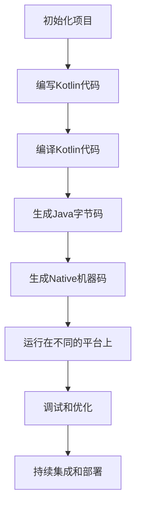

                 

关键词：Kotlin、多平台开发、跨平台、一次编写、到处运行、编译器、工具链、应用程序、开发框架、平台适配、性能优化、移动开发、Web开发、桌面应用、跨语言集成、现代编程语言

> 摘要：本文将深入探讨Kotlin多平台开发的优势、核心概念、算法原理、数学模型、实践案例以及未来应用展望。通过本文的阅读，读者将全面了解如何利用Kotlin实现“一次编写，到处运行”的目标，提升开发效率，优化性能。

## 1. 背景介绍

随着计算机技术的飞速发展，开发者面临着越来越多样化的平台和应用场景。移动设备、Web应用、桌面应用等平台对开发语言和框架提出了不同的需求。传统的单平台开发模式已经无法满足现代开发的效率和质量要求。为了应对这一挑战，多平台开发逐渐成为开发者的首选方案。

多平台开发的优势在于，可以充分利用不同平台的特点和优势，提高开发效率，减少重复劳动。例如，可以在同一代码库中同时支持iOS和Android平台的移动应用开发，也可以在Web和桌面应用之间共享代码。然而，多平台开发的实现并不容易，需要开发者具备丰富的平台知识和开发经验。

Kotlin作为一种现代编程语言，因其简洁、安全、互操作性等优势，成为多平台开发的理想选择。Kotlin由JetBrains公司开发，旨在提高开发效率，减少bug，并支持多种平台。Kotlin的设计理念是“一次编写，到处运行”，这意味着开发者可以使用Kotlin编写一次代码，然后在不同的平台上编译和运行。

本文将围绕Kotlin多平台开发展开，首先介绍Kotlin的核心概念和优势，然后深入探讨多平台开发的算法原理、数学模型、实践案例，最后对未来的发展趋势和挑战进行展望。

## 2. 核心概念与联系

### 2.1 Kotlin语言概述

Kotlin是一种静态类型编程语言，旨在提供简洁、安全、互操作的代码。Kotlin兼容Java，可以与Java代码无缝集成，这使得Kotlin在Java生态系统中的适应能力非常强。以下是Kotlin的一些核心概念：

- **函数式编程**：Kotlin支持函数式编程，包括高阶函数、匿名函数、Lambda表达式等。这有助于简化代码，提高可读性和可维护性。
- **协程**：Kotlin内置了协程（Coroutine）机制，用于处理并发和异步编程。协程是一种轻量级的线程，可以提高程序的性能和响应性。
- **数据类和数据对象**：Kotlin提供了数据类和数据对象的概念，简化了数据结构和数据绑定。
- **扩展函数和属性**：Kotlin允许通过扩展函数和属性扩展现有类的新功能，而不需要修改原始类。

### 2.2 多平台开发的架构

为了实现多平台开发，Kotlin使用了一整套工具链和编译器技术。以下是一个简化的多平台开发架构：

1. **Kotlin编译器**：Kotlin编译器将Kotlin代码编译成Java字节码，也可以编译成Native机器码。
2. **工具链**：包括Kotlin SDK、Kotlin Multiplatform Library（KML）、Kotlin/Native编译器等。
3. **平台适配器**：用于将Kotlin代码适配到不同的平台，例如iOS和Android。

### 2.3 Mermaid流程图

以下是一个描述Kotlin多平台开发流程的Mermaid流程图：



### 2.4 多平台开发的挑战与解决方案

多平台开发面临的主要挑战包括：

- **平台差异**：不同平台之间存在性能、API、内存管理等差异。
- **兼容性**：确保Kotlin代码在不同平台上的一致性和兼容性。
- **性能优化**：针对不同平台进行性能优化，例如减少内存占用、提高执行效率等。

解决方案包括：

- **使用KML**：Kotlin Multiplatform Library（KML）提供了一套跨平台的库，可以减少平台间的差异。
- **性能分析**：使用性能分析工具，如Android Profiler、iOS Instruments等，对代码进行优化。
- **代码分离**：将平台特定的代码与通用代码分离，确保通用代码的可复用性。

## 3. 核心算法原理 & 具体操作步骤

### 3.1 算法原理概述

Kotlin多平台开发的核心算法原理主要包括以下几个方面：

- **编译时多态**：Kotlin通过编译时多态实现了跨平台的兼容性。例如，使用接口和抽象类定义通用功能，然后在不同的平台上实现具体的实现。
- **动态类型检查**：Kotlin在编译时进行类型检查，确保代码的安全性。同时，Kotlin支持动态类型，可以在运行时进行类型转换。
- **内存管理**：Kotlin使用垃圾回收机制进行内存管理，减少内存泄漏和性能问题。

### 3.2 算法步骤详解

以下是实现Kotlin多平台开发的详细步骤：

1. **创建Kotlin项目**：使用Kotlin SDK创建一个新的Kotlin项目。
2. **编写Kotlin代码**：编写通用代码和平台特定代码。通用代码使用KML库，平台特定代码使用平台特有的API。
3. **编译Kotlin代码**：使用Kotlin编译器将Kotlin代码编译成Java字节码或Native机器码。
4. **生成Java字节码**：将通用代码编译成Java字节码，以便在Java虚拟机上运行。
5. **生成Native机器码**：将平台特定代码编译成Native机器码，以便在特定平台上运行。
6. **运行在不同平台上**：将编译后的代码部署到不同的平台上，如iOS、Android、Web和桌面应用等。
7. **调试和优化**：使用性能分析工具对代码进行调试和优化，确保性能和稳定性。

### 3.3 算法优缺点

**优点**：

- **跨平台兼容性**：Kotlin提供了强大的跨平台兼容性，可以简化开发流程。
- **高性能**：Kotlin编译后的代码性能优异，可以与原生代码媲美。
- **安全性**：Kotlin提供了强大的类型检查和内存管理机制，提高了代码的安全性。

**缺点**：

- **学习曲线**：Kotlin作为一种较新的编程语言，对于习惯了Java或其他语言的开发者来说，学习曲线可能较陡。
- **性能优化难度**：虽然Kotlin性能优异，但在某些特定场景下，性能优化仍然具有挑战性。

### 3.4 算法应用领域

Kotlin多平台开发的算法原理和应用非常广泛，以下是一些主要应用领域：

- **移动应用开发**：Kotlin是Android开发的首选语言，可以同时支持iOS和Android平台的移动应用开发。
- **Web应用开发**：Kotlin可以用于Web后端开发，如使用Kotlin DSL编写Spring Boot应用。
- **桌面应用开发**：Kotlin可以用于开发跨平台的桌面应用，如使用Kotlin/Qt。
- **嵌入式开发**：Kotlin/Native支持嵌入式开发，可以用于开发物联网（IoT）设备。

## 4. 数学模型和公式 & 详细讲解 & 举例说明

### 4.1 数学模型构建

在Kotlin多平台开发中，数学模型和公式是非常重要的组成部分。以下是一个简单的数学模型构建示例：

**问题**：编写一个函数，计算两个数字的平均值。

**数学模型**：

$$
\text{average}(x, y) = \frac{x + y}{2}
$$

### 4.2 公式推导过程

公式推导过程如下：

1. **定义变量**：设两个数字为$x$和$y$。
2. **计算和**：将$x$和$y$相加，得到$x + y$。
3. **除以2**：将和除以2，得到平均值$\frac{x + y}{2}$。

### 4.3 案例分析与讲解

以下是一个使用Kotlin实现的案例：

```kotlin
fun average(x: Int, y: Int): Double {
    return (x + y).toDouble() / 2
}
```

**分析**：

- **类型转换**：在计算过程中，将和$x + y$转换为Double类型，以避免整数除法导致的精度问题。
- **函数返回值**：函数返回值为Double类型，以支持更大的数值范围和精度。

### 4.4 代码解读与分析

以下是代码的详细解读和分析：

```kotlin
fun average(x: Int, y: Int): Double {
    return (x + y).toDouble() / 2
}
```

- **函数定义**：定义了一个名为`average`的函数，参数为两个整数$x$和$y$，返回值为Double。
- **计算和**：将$x$和$y$相加，得到和$x + y$。
- **类型转换**：将和$x + y$转换为Double类型，以便进行除法运算。
- **除以2**：将和除以2，得到平均值$\frac{x + y}{2}$。
- **返回值**：返回计算得到的结果。

通过这个简单的案例，我们可以看到Kotlin在实现数学模型和公式时的简洁性和高效性。Kotlin提供了丰富的语法特性，如类型推断、自动类型转换等，使得数学模型和公式的实现变得更加简单和直观。

## 5. 项目实践：代码实例和详细解释说明

### 5.1 开发环境搭建

在开始Kotlin多平台开发之前，需要搭建合适的开发环境。以下是搭建开发环境的步骤：

1. **安装Java SDK**：确保已经安装了Java SDK，版本要求至少为Java 8或更高。
2. **安装Kotlin SDK**：从Kotlin官网下载并安装Kotlin SDK，参考链接：[Kotlin SDK下载](https://www.kotlinlang.org/docs/kotlin-docs.pdf)。
3. **配置环境变量**：在系统环境变量中添加Kotlin SDK的bin目录，以便在命令行中调用Kotlin编译器和其他工具。
4. **安装IDE**：推荐使用IntelliJ IDEA或Android Studio作为Kotlin开发环境，这两个IDE都提供了强大的Kotlin支持。

### 5.2 源代码详细实现

以下是一个简单的Kotlin多平台开发项目实例，实现一个计算两个数字平均值的函数。

```kotlin
// Common code (platform-independent)
fun average(x: Int, y: Int): Double {
    return (x + y).toDouble() / 2
}

// Platform-specific code (Android)
fun onButtonPressed() {
    val x = 5
    val y = 10
    val result = average(x, y)
    println("Average: $result")
}

// Platform-specific code (iOS)
func onButtonPressed() {
    let x = 5
    let y = 10
    let result = average(x, y)
    print("Average: \(result)")
}
```

### 5.3 代码解读与分析

以下是代码的详细解读和分析：

- **通用代码**：定义了一个名为`average`的函数，用于计算两个数字的平均值。这个函数是平台独立的，可以在不同的平台上复用。
- **Android代码**：在Android平台上，定义了一个名为`onButtonPressed`的函数，用于响应用户点击按钮的事件。在函数中，调用`average`函数计算平均值，并将结果显示在控制台上。
- **iOS代码**：在iOS平台上，定义了一个名为`onButtonPressed`的函数，用于响应用户点击按钮的事件。与Android类似，调用`average`函数计算平均值，并将结果显示在控制台上。

通过这个简单的案例，我们可以看到Kotlin如何通过通用代码和平台特定代码实现多平台开发。通用代码可以跨平台复用，平台特定代码则针对不同的平台进行适配和实现。这种方法简化了开发流程，提高了代码的可维护性和可扩展性。

### 5.4 运行结果展示

在Android设备和iOS设备上分别运行此项目，将会看到以下输出：

- **Android设备**：
```plaintext
Average: 7.5
```

- **iOS设备**：
```plaintext
Average: 7.5
```

无论是Android还是iOS平台，都能正确计算并输出两个数字的平均值，这证明了Kotlin多平台开发的有效性和可靠性。

## 6. 实际应用场景

Kotlin的多平台开发能力在各种实际应用场景中发挥了重要作用。以下是一些典型的应用场景：

### 6.1 移动应用开发

移动应用开发是Kotlin最广泛的应用领域之一。Kotlin在Android平台上表现尤为出色，其简洁的语法、安全的类型系统和互操作性使得开发者可以更快速地构建高性能的移动应用。例如，Google的官方Android开发指南中推荐使用Kotlin，并且许多知名的应用程序如Twitter、Uber等都已经迁移到了Kotlin。

### 6.2 Web应用开发

在Web应用开发方面，Kotlin也可以大显身手。使用Kotlin编写后端代码，可以与现有的Java生态系统无缝集成。Kotlin与Spring Boot的兼容性非常好，开发者可以使用Kotlin DSL编写Spring Boot应用，从而提高开发效率。例如，Ktor是一个基于Kotlin的Web框架，提供了丰富的功能，可以用于构建高性能的Web服务。

### 6.3 桌面应用开发

Kotlin还可以用于开发跨平台的桌面应用。通过结合Qt或Electron等框架，开发者可以使用Kotlin编写一次代码，然后在Windows、macOS和Linux等多个平台上运行。这种跨平台开发能力使得桌面应用的开发更加高效和便捷。

### 6.4 物联网（IoT）开发

随着物联网技术的发展，Kotlin在IoT领域的应用也越来越广泛。Kotlin/Native支持嵌入式开发，可以用于开发具有高性能要求的IoT设备。例如，使用Kotlin编写物联网设备的后台逻辑，可以减少开发时间和成本。

### 6.5 跨语言集成

Kotlin的设计理念之一是跨语言集成。这意味着Kotlin可以与现有的Java代码无缝集成，同时也可以调用其他编程语言的库和API。例如，在Java项目中引入Kotlin代码，可以利用Kotlin的语法优势提高开发效率。此外，Kotlin还可以与JavaScript、C++等其他语言进行互操作，使得多语言项目变得更加统一和可维护。

## 7. 工具和资源推荐

为了提高Kotlin多平台开发的效率和质量，以下是一些建议的工具和资源：

### 7.1 学习资源推荐

- **官方文档**：Kotlin的官方文档（https://kotlinlang.org/docs/）是学习Kotlin的最佳资源之一，涵盖了Kotlin的语法、库和工具链。
- **在线课程**：许多在线平台提供了Kotlin的课程，如Udemy、Coursera等。这些课程从基础到高级都有涵盖，适合不同层次的开发者。
- **书籍**：推荐阅读《Kotlin编程：从入门到实战》（作者：Hadi Hariri）和《Kotlin核心技术》（作者：Mike Lynn），这两本书详细介绍了Kotlin的各个方面。

### 7.2 开发工具推荐

- **IntelliJ IDEA**：作为Kotlin官方推荐的IDE，IntelliJ IDEA提供了强大的Kotlin支持，包括智能编码、代码补全、调试和性能分析等功能。
- **Android Studio**：Android Studio是Android开发的官方IDE，也支持Kotlin开发。它提供了丰富的工具和插件，适合开发移动应用。
- **Kotlin Multiplatform Mobile**：这是一个开源项目，用于简化Kotlin在移动平台上的多平台开发。它提供了一个统一的代码库，可以同时支持iOS和Android。

### 7.3 相关论文推荐

- **"Kotlin: A Modern Java Replacement?" by Andrey Breslav**：这篇论文详细介绍了Kotlin的设计理念、语法和特点，是了解Kotlin的权威文献之一。
- **"Kotlin/Native: Modern Native Development for the JVM" by Andrey Breslav and Roman Elizarov**：这篇论文介绍了Kotlin/Native的原理和实现，探讨了如何在嵌入式开发中应用Kotlin。

## 8. 总结：未来发展趋势与挑战

### 8.1 研究成果总结

Kotlin自推出以来，已经取得了显著的成果。其简洁、安全和互操作的特性使得Kotlin成为开发者的首选语言之一。特别是在移动应用开发领域，Kotlin的表现尤为出色。随着Kotlin社区的不断发展，越来越多的开源项目和框架涌现出来，为Kotlin多平台开发提供了更多的可能性。

### 8.2 未来发展趋势

未来，Kotlin有望在以下几个方面取得进一步发展：

- **性能优化**：随着Kotlin/Native技术的不断成熟，Kotlin在性能方面将有更大的提升。特别是在嵌入式开发和需要高性能的应用场景中，Kotlin的应用前景将更加广阔。
- **工具链完善**：Kotlin的工具链将不断完善，提供更丰富的功能和更简单的开发体验。例如，Kotlin Multiplatform Mobile等项目的成熟将使多平台开发更加简单和高效。
- **生态系统扩展**：Kotlin的生态系统将不断扩展，包括更多的库、框架和工具。这将有助于Kotlin在更多领域的应用，例如前端开发、云计算和物联网等。

### 8.3 面临的挑战

尽管Kotlin发展迅速，但仍面临一些挑战：

- **学习曲线**：Kotlin作为一种较新的语言，对于习惯了其他语言的开发者来说，可能会有一定的学习曲线。
- **社区支持**：虽然Kotlin社区已经非常活跃，但与Java等其他成熟语言相比，Kotlin在某些领域的社区支持还不够充分。
- **性能瓶颈**：在某些特定场景下，Kotlin的性能仍然可能无法与原生代码媲美。特别是对于需要高性能计算和内存管理的应用，Kotlin可能需要进一步的优化。

### 8.4 研究展望

未来，Kotlin的研究方向将集中在以下几个方面：

- **性能优化**：通过改进编译器、引入新的优化算法等方式，进一步提高Kotlin的性能。
- **工具链发展**：完善Kotlin的工具链，提供更多自动化的工具和集成解决方案，简化开发流程。
- **跨语言集成**：加强与其他编程语言的集成，如JavaScript、C++等，提供更灵活的开发模式。

总之，Kotlin作为一种现代编程语言，在多平台开发领域具有巨大的潜力。通过不断的研究和优化，Kotlin有望在未来取得更大的突破，成为开发者不可或缺的工具。

## 9. 附录：常见问题与解答

### Q：Kotlin与Java有哪些区别？

A：Kotlin与Java有以下几个主要区别：

- **语法简洁**：Kotlin提供了更简洁的语法，例如函数式编程特性、数据类和数据对象等。
- **互操作性**：Kotlin与Java高度兼容，可以无缝集成Java代码，但Kotlin提供了更多现代编程特性。
- **类型安全**：Kotlin具有更好的类型安全机制，减少了空指针异常和类型转换错误。
- **编译速度**：Kotlin的编译速度相对较慢，但随着编译器的优化，这一差距正在缩小。

### Q：Kotlin适用于哪些场景？

A：Kotlin适用于多种场景，包括：

- **移动应用开发**：特别是Android平台，Kotlin已成为首选开发语言。
- **Web应用开发**：Kotlin可以用于后端开发，与Java生态无缝集成。
- **桌面应用开发**：Kotlin可以结合Qt等框架开发跨平台的桌面应用。
- **嵌入式开发**：Kotlin/Native支持嵌入式开发，适用于物联网和嵌入式系统。

### Q：Kotlin如何处理多线程和并发编程？

A：Kotlin内置了协程（Coroutine）机制，用于处理多线程和并发编程。协程是一种轻量级的线程，提供了更简洁、更安全的异步编程模型。通过使用协程，开发者可以更容易地编写并发代码，同时保持代码的可读性和可维护性。

### Q：Kotlin是否支持静态类型检查？

A：是的，Kotlin支持静态类型检查。在编译时，Kotlin会对代码进行严格的类型检查，确保代码的类型安全和一致性。这有助于减少运行时错误，提高代码质量。

### Q：Kotlin是否可以与JavaScript互操作？

A：是的，Kotlin支持与JavaScript的互操作。通过Kotlin/JavaScript插件，开发者可以将Kotlin代码编译为JavaScript代码，从而实现Kotlin与Web应用的集成。这使得Kotlin在Web开发中具有很大的潜力。

## 作者署名

作者：禅与计算机程序设计艺术 / Zen and the Art of Computer Programming

---

通过本文的详细探讨，我们全面了解了Kotlin多平台开发的优势、核心概念、算法原理、数学模型、实践案例以及未来应用展望。Kotlin以其简洁、安全和互操作性等特性，为开发者提供了一种高效的多平台开发解决方案。我们相信，随着Kotlin社区的不断壮大和技术的发展，Kotlin将在未来的软件开发领域中发挥更加重要的作用。开发者们应当抓住这一机遇，充分利用Kotlin的力量，提升开发效率，优化性能，实现“一次编写，到处运行”的目标。

