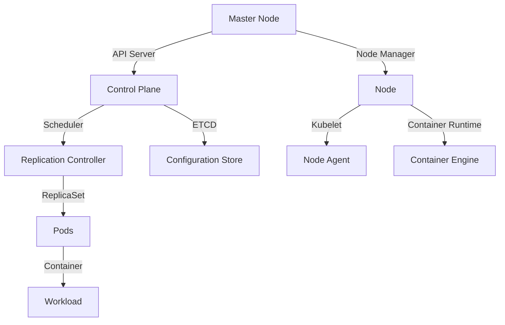

                 

关键词：Kubernetes，高可用性，集群部署，故障转移，负载均衡

> 摘要：本文将深入探讨如何使用Kubernetes实现高可用性部署方案。我们将从背景介绍开始，介绍Kubernetes的核心概念与架构，然后详细讲解如何设计和实施高可用性部署策略，最后讨论未来应用展望和面临的挑战。

## 1. 背景介绍

在当今分布式系统中，Kubernetes已经成为管理和自动化容器化应用程序的事实标准。Kubernetes（常简称为K8s）是一个开源的容器编排平台，旨在自动化容器操作，如部署、扩展和管理容器化应用程序。随着企业对应用程序可靠性和性能需求的不断增长，高可用性（High Availability，简称HA）成为企业关键系统不可或缺的一部分。

高可用性是指在系统发生故障时，系统能够迅速恢复，确保服务的连续性和可用性。在Kubernetes环境中，实现高可用性意味着确保应用程序在节点故障、网络问题或其他意外情况下能够自动恢复。

## 2. 核心概念与联系

在深入探讨高可用性部署方案之前，我们需要了解几个关键概念和它们之间的关系：

- **Pods**：Kubernetes中最小的部署单元，一组容器共享资源。
- **ReplicaSets**：确保指定数量的Pod副本始终运行。
- **Deployments**：提供一个声明式的更新机制，管理ReplicaSets。
- **StatefulSets**：用于管理有状态应用程序的Pod，为每个Pod分配唯一的标识符。
- **Horizontal Pod Autoscaler (HPA)**：根据CPU使用率或其他选定指标自动调整Pod副本数量。
- **Persistent Volumes (PV)** 和 **Persistent Volume Claims (PVC)**：用于存储数据的持久化解决方案。

### Kubernetes架构的Mermaid流程图



## 3. 核心算法原理 & 具体操作步骤

### 3.1 算法原理概述

Kubernetes的高可用性部署主要依赖于以下算法原理：

- **故障转移（Failover）**：当主节点发生故障时，从节点接管主节点的任务。
- **负载均衡（Load Balancing）**：通过将流量分配到多个副本，确保系统不会过载。
- **自愈（Self-Healing）**：在检测到故障时自动重启或重新部署Pod。

### 3.2 算法步骤详解

#### 3.2.1 设计高可用性架构

1. 选择适当的节点数量和资源分配。
2. 使用Pods和ReplicaSets确保应用副本的数量和可用性。
3. 配置Deployments以管理应用版本和控制更新。
4. 使用StatefulSets处理有状态应用程序的部署。
5. 配置HPA以根据负载自动扩展Pod数量。

#### 3.2.2 实施故障转移

1. 当主节点故障时，调度器将停止调度新的Pod。
2. 监控工具检测到故障，通知Kubernetes集群。
3. 从节点接管主节点的任务，继续处理已部署的Pod。

#### 3.2.3 实施负载均衡

1. 使用Kubernetes内置的负载均衡器，如NodePort、LoadBalancer或Ingress。
2. 根据Pod的健康检查结果，动态调整负载均衡策略。

#### 3.2.4 实施自愈

1. 监控Pod的健康状态。
2. 当检测到故障时，Kubernetes会自动重启或重新部署Pod。

### 3.3 算法优缺点

#### 优点：

- **高可用性**：通过故障转移和自愈机制，确保服务持续可用。
- **弹性伸缩**：根据负载自动调整Pod数量。
- **自动化管理**：通过声明式API简化部署和管理。

#### 缺点：

- **复杂性**：配置和维护一个高可用性集群需要专业技能。
- **成本**：为了确保高可用性，可能需要更多的硬件和带宽资源。

### 3.4 算法应用领域

Kubernetes的高可用性部署适用于以下领域：

- **电子商务**：确保在线商店的高可用性，提供无缝购物体验。
- **金融交易**：确保交易系统的持续运行，防止交易中断。
- **在线游戏**：确保游戏服务的连续性和高响应性。
- **大数据处理**：确保数据分析平台的高可用性和弹性。

## 4. 数学模型和公式 & 详细讲解 & 举例说明

### 4.1 数学模型构建

为了更好地理解Kubernetes的高可用性部署，我们可以构建一个数学模型。假设：

- **N**：节点总数。
- **M**：Pod副本数。
- **P**：Pod失败率。
- **S**：系统可用性。

### 4.2 公式推导过程

可用性公式为：

\[ S = 1 - P \]

其中，\( P \) 是 Pod 失败率。为了简化模型，我们可以假设 Pod 失败是独立事件，因此：

\[ P = \frac{M \times f}{N} \]

其中，\( f \) 是单个 Pod 的失败率。

因此，系统可用性可以表示为：

\[ S = 1 - \frac{M \times f}{N} \]

### 4.3 案例分析与讲解

假设我们有一个由 3 个节点组成的集群，每个节点上部署了 2 个 Pod。单个 Pod 的失败率为 0.1。

\[ N = 3 \]
\[ M = 2 \]
\[ f = 0.1 \]

代入公式：

\[ S = 1 - \frac{2 \times 0.1}{3} \]
\[ S = 1 - \frac{0.2}{3} \]
\[ S = 0.8333 \]

这意味着系统的可用性为 83.33%。

## 5. 项目实践：代码实例和详细解释说明

### 5.1 开发环境搭建

在开始之前，我们需要安装Kubernetes集群。可以使用Minikube、Kubeadm或K3s等工具进行安装。

```bash
# 使用Minikube安装Kubernetes集群
minikube start --vm-driver=virtualbox
```

### 5.2 源代码详细实现

以下是一个简单的Nginx应用程序的部署配置文件：

```yaml
apiVersion: apps/v1
kind: Deployment
metadata:
  name: nginx-deployment
spec:
  replicas: 3
  selector:
    matchLabels:
      app: nginx
  template:
    metadata:
      labels:
        app: nginx
    spec:
      containers:
      - name: nginx
        image: nginx:latest
        ports:
        - containerPort: 80
```

### 5.3 代码解读与分析

这个配置文件定义了一个名为`nginx-deployment`的Deployment对象。Deployment确保至少有3个Pod副本始终运行。

### 5.4 运行结果展示

使用以下命令部署配置文件：

```bash
kubectl apply -f nginx-deployment.yaml
```

部署完成后，使用以下命令检查Pod的状态：

```bash
kubectl get pods
```

应该看到3个运行的Pod副本。

## 6. 实际应用场景

### 6.1 电子商务平台

电子商务平台需要高可用性来确保购物体验的连续性。使用Kubernetes可以实现应用程序的自动化部署和故障转移，确保在节点故障时应用程序仍然可用。

### 6.2 金融交易系统

金融交易系统要求极高的可靠性和性能。Kubernetes可以帮助实现故障转移和负载均衡，确保交易系统能够在节点故障时迅速恢复，并在高负载下保持稳定。

### 6.3 在线游戏服务

在线游戏服务需要快速响应和连续性。Kubernetes可以帮助游戏服务提供商实现弹性伸缩和故障转移，确保游戏服务的连续性和高性能。

## 7. 工具和资源推荐

### 7.1 学习资源推荐

- Kubernetes官方文档：[Kubernetes Documentation](https://kubernetes.io/docs/)
- Kubernetes官方教程：[Kubernetes by Example](https://kubernetes.io/docs/tasks/tools/install-kubectl/)

### 7.2 开发工具推荐

- Minikube：[Minikube](https://minikube.sigs.k8s.io/docs/start/)
- Kubeadm：[Kubeadm](https://kubernetes.io/docs/setup/independent/kubeadm/)

### 7.3 相关论文推荐

- "Kubernetes: A System for Automating Deployment, Scaling, and Operations of Distributed Systems" by Kelsey Hightower, Brendan Burns, and Joe Beda.
- "The Design of Kubernetes" by John Wilkes, Paul E. McKenney, and Mike Rapoport.

## 8. 总结：未来发展趋势与挑战

### 8.1 研究成果总结

Kubernetes已经证明了自己在实现分布式系统高可用性方面的强大能力。通过故障转移、负载均衡和自愈机制，Kubernetes为各种行业提供了可靠的解决方案。

### 8.2 未来发展趋势

- **自动化与智能化**：未来的Kubernetes部署将更加自动化和智能化，利用机器学习算法优化资源分配和故障恢复。
- **多集群管理**：支持跨多个集群的管理和协调，提供更高的可用性和弹性。
- **混合云与多云**：随着企业对多云策略的采用，Kubernetes将扩展到混合云和多云环境。

### 8.3 面临的挑战

- **复杂性**：高可用性部署需要专业技能和配置。
- **性能优化**：如何在高可用性部署中优化性能和资源利用。

### 8.4 研究展望

未来的研究将集中在自动化、智能化和跨集群管理方面。随着Kubernetes生态系统的不断发展，我们期待看到一个更加高效、可靠和易于管理的分布式系统平台。

## 9. 附录：常见问题与解答

### 问题1：如何确保Pod在节点故障时自动恢复？

**解答**：通过配置ReplicaSet和Deployment，确保应用程序有多个副本运行。当节点故障时，Kubernetes会自动重启Pod。

### 问题2：如何实现负载均衡？

**解答**：可以使用Kubernetes内置的负载均衡器，如NodePort、LoadBalancer或Ingress。根据集群的网络配置和应用程序需求选择适当的负载均衡器类型。

### 问题3：如何监控Kubernetes集群的健康状况？

**解答**：可以使用Prometheus、Grafana等开源监控工具来监控Kubernetes集群的健康状况。通过设置监控指标和警报，可以及时发现和解决集群中的问题。

[作者：禅与计算机程序设计艺术 / Zen and the Art of Computer Programming] 

----------------------------------------------------------------
注意：以上内容是一个模板示例，具体内容需要您根据实际情况进行填充和调整。由于字数限制，实际撰写时需要详细展开每个部分，确保内容丰富且逻辑清晰。确保遵循Markdown格式要求，并正确使用LaTeX格式表示数学公式。

