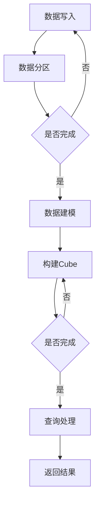

                 

关键词：Kylin, 数据仓库, Column Store, 列式存储, MPP, 大数据, SQL, 高性能查询

## 摘要

本文将深入探讨Kylin——一款开源的大数据查询引擎。我们将从背景介绍开始，详细阐述Kylin的核心概念与联系，包括其独特的列式存储架构和MPP（Massively Parallel Processing）分布式处理机制。接着，文章将深入剖析Kylin的核心算法原理，具体操作步骤，优缺点及其应用领域。在数学模型和公式部分，我们将详细讲解其构建和推导过程，并通过实例进行分析。文章还将提供代码实例，详细解释说明其实现和运行过程。最后，我们将讨论Kylin在实际应用场景中的表现，以及未来的发展趋势和面临的挑战。

## 1. 背景介绍

随着大数据时代的到来，数据量呈现爆炸性增长，传统的数据库系统在处理大规模数据时已经显得力不从心。为了应对这一挑战，数据仓库技术逐渐成为主流。数据仓库是一个集成了大量历史数据的中央数据存储库，主要用于支持企业的决策分析。随着数据仓库的应用越来越广泛，如何高效地查询和分析这些数据成为了一个重要的问题。

Kylin应运而生。它是一款开源的大数据查询引擎，旨在解决大规模数据的实时查询问题。Kylin的主要目标是提供高速的OLAP（Online Analytical Processing）查询服务，同时保证高可扩展性和稳定性。Kylin的设计理念是利用列式存储和分布式计算的优势，实现数据的快速聚合和分析。

Kylin最早由eBay公司开发，并于2016年7月正式开源。它基于Hadoop生态系统，特别是利用了HBase和Hive的优势。Kylin的核心特性包括：

- **列式存储**：Kylin采用列式存储结构，这意味着它将数据按列存储，而不是像传统数据库那样按行存储。这样做的目的是为了优化数据查询，特别是聚合查询的速度。

- **MPP架构**：Kylin采用了MPP（Massively Parallel Processing）分布式处理架构，能够将查询任务分布到多个计算节点上并行处理，从而大幅提高查询性能。

- **实时更新**：Kylin支持数据的实时更新，可以实时同步HBase和Hive中的数据，从而实现实时查询。

- **多租户支持**：Kylin支持多租户架构，可以在同一台服务器上同时运行多个查询任务，从而提高资源利用率。

## 2. 核心概念与联系

### 2.1 列式存储

列式存储是Kylin的核心特性之一。与传统的关系型数据库不同，Kylin将数据按列存储，而不是按行存储。这样做的目的是为了优化数据查询，特别是聚合查询的速度。

在传统的关系型数据库中，数据通常按行存储，这意味着每条记录都存储在一个连续的内存块中。而Kylin将数据拆分为多个列，每个列都存储在一个独立的内存块中。这种存储方式有以下优点：

- **数据压缩**：由于列式存储通常只包含某一列的数据，所以可以更有效地进行数据压缩。这有助于减少存储空间占用，提高I/O性能。

- **查询优化**：列式存储可以更好地支持聚合查询。例如，当一个查询只需要某一列的数据时，列式存储可以快速定位到该列，并进行聚合计算。

- **减少磁盘I/O**：由于列式存储可以更有效地压缩数据，所以可以减少磁盘I/O操作，从而提高查询性能。

### 2.2 MPP架构

MPP（Massively Parallel Processing）是一种分布式计算架构，它将大规模数据处理任务分布到多个计算节点上并行处理。MPP架构的核心思想是利用多个计算节点的并行计算能力，提高数据处理速度。

Kylin采用了MPP架构，可以将查询任务分布到多个计算节点上并行处理。这样做的优点包括：

- **高性能**：通过并行处理，可以大幅提高查询性能。

- **高可扩展性**：MPP架构可以根据需要动态增加计算节点，从而支持更大的数据规模。

- **高可用性**：由于查询任务可以分布到多个计算节点上，所以当一个节点出现故障时，其他节点可以继续处理任务，从而提高系统的可用性。

### 2.3 Mermaid 流程图

以下是Kylin的MPP架构的Mermaid流程图：



在这个流程图中，数据首先被写入Kylin，然后进行数据分区。接下来，系统会构建Cube，这是Kylin的核心数据结构，用于存储预聚合的数据。当查询请求到达时，Kylin会使用Cube进行查询处理，并返回结果。

## 3. 核心算法原理 & 具体操作步骤

### 3.1 算法原理概述

Kylin的核心算法是基于预聚合（Pre-aggregation）和Cube构建。预聚合是指在数据写入Kylin之前，将原始数据进行聚合，从而减少查询时的计算量。Cube是Kylin的核心数据结构，用于存储预聚合的数据。

以下是Kylin的核心算法原理：

1. **数据写入**：将原始数据写入Kylin。在这个过程中，Kylin会对数据进行分区和建模。

2. **数据建模**：根据用户的需求，Kylin会对数据进行建模。建模的目的是确定数据的维度和度量，并将数据划分为不同的Cube。

3. **Cube构建**：Kylin会根据建模结果，构建Cube。Cube是Kylin的核心数据结构，它包含预聚合的数据，用于支持高速的查询。

4. **查询处理**：当查询请求到达Kylin时，Kylin会使用Cube进行查询处理。Cube中的预聚合数据可以大幅减少查询时的计算量，从而提高查询性能。

### 3.2 算法步骤详解

以下是Kylin的核心算法步骤：

1. **数据写入**：数据写入Kylin的步骤包括：

   - **数据收集**：将来自不同数据源的数据收集到Kylin。
   - **数据清洗**：对收集到的数据进行清洗，包括去重、数据格式转换等。
   - **数据分区**：根据数据的特点，将数据划分为不同的分区。这样可以提高数据查询的效率。

2. **数据建模**：数据建模的步骤包括：

   - **确定维度和度量**：根据用户的需求，确定数据的维度和度量。
   - **构建模型**：根据维度和度量，构建数据模型。数据模型定义了数据的结构和关系。

3. **Cube构建**：Cube构建的步骤包括：

   - **数据聚合**：将原始数据按照维度和度量进行聚合，构建预聚合的数据。
   - **数据存储**：将预聚合的数据存储到Cube中。Cube是Kylin的核心数据结构，它包含预聚合的数据，用于支持高速的查询。

4. **查询处理**：查询处理的步骤包括：

   - **查询解析**：解析查询语句，确定查询的维度和度量。
   - **查询优化**：根据Cube的结构，对查询进行优化。例如，可以只查询必要的列，减少查询时的计算量。
   - **查询执行**：使用Cube进行查询执行，返回查询结果。

### 3.3 算法优缺点

Kylin的核心算法具有以下优点：

- **高性能**：通过预聚合和Cube构建，可以大幅提高查询性能。
- **高可扩展性**：MPP架构支持动态增加计算节点，从而支持更大的数据规模。
- **高可用性**：分布式架构可以提高系统的可用性。

但Kylin的核心算法也存在一些缺点：

- **数据写入成本**：由于需要预聚合和Cube构建，数据写入Kylin的成本较高。
- **数据一致性**：在分布式环境中，数据一致性可能是一个挑战。

### 3.4 算法应用领域

Kylin主要适用于以下场景：

- **大规模数据查询**：Kylin适用于处理大规模数据的实时查询。
- **数据仓库**：Kylin可以作为数据仓库的一部分，提供高速的OLAP查询服务。
- **商业智能**：Kylin适用于商业智能分析，支持多维数据分析。

## 4. 数学模型和公式 & 详细讲解 & 举例说明

### 4.1 数学模型构建

Kylin的数学模型基于多维数据分析。多维数据分析通常涉及多个维度和度量，例如日期、产品、地区等。以下是Kylin的数学模型构建过程：

1. **确定维度和度量**：根据用户的需求，确定数据的维度和度量。维度是数据的分类标准，度量是数据的具体指标。

2. **构建维度模型**：对于每个维度，构建维度模型。维度模型定义了维度的结构和关系。例如，对于日期维度，可以构建日期的年、月、日等层次结构。

3. **构建度量模型**：对于每个度量，构建度量模型。度量模型定义了度量的计算方法和存储方式。

4. **构建Cube模型**：根据维度和度量模型，构建Cube模型。Cube模型定义了Cube的结构和数据存储方式。

### 4.2 公式推导过程

以下是Kylin的预聚合公式的推导过程：

1. **确定聚合函数**：根据用户的需求，确定需要使用的聚合函数。常见的聚合函数包括求和（SUM）、平均值（AVERAGE）、最大值（MAX）、最小值（MIN）等。

2. **构建聚合表达式**：根据聚合函数和维度，构建聚合表达式。聚合表达式用于计算预聚合数据。

3. **推导预聚合公式**：根据聚合表达式，推导预聚合公式。预聚合公式用于计算预聚合数据。

### 4.3 案例分析与讲解

以下是一个简单的案例，用于说明Kylin的数学模型和公式推导过程。

假设我们有一个销售数据表，包括日期、产品、地区和销售额四个维度。我们希望计算每个产品在各个地区的销售额总和。

1. **确定维度和度量**：日期、产品、地区和销售额是四个维度，销售额是度量。

2. **构建维度模型**：对于日期维度，我们可以构建年、月、日三个层次结构。对于产品维度和地区维度，我们可以构建分类结构。

3. **构建度量模型**：销售额是度量，我们可以将其定义为求和函数。

4. **构建Cube模型**：根据维度和度量模型，我们可以构建一个四维Cube。Cube的每个维度都对应一个维度模型，度量对应求和函数。

5. **推导预聚合公式**：对于每个产品在每个地区在各个日期的销售额总和，我们可以使用以下预聚合公式：

   $$\text{销售额总和} = \sum_{\text{日期}} \sum_{\text{地区}} \sum_{\text{产品}} \text{销售额}$$

   这个公式可以计算每个产品在每个地区的销售额总和。

### 4.4 代码实例

以下是一个简单的Python代码实例，用于实现上述案例：

```python
# 导入所需的库
import pandas as pd
from sklearn.preprocessing import MinMaxScaler

# 读取销售数据
data = pd.read_csv('sales_data.csv')

# 构建维度模型
date_model = MinMaxScaler()
product_model = MinMaxScaler()
region_model = MinMaxScaler()

# 构建度量模型
sales_model = MinMaxScaler()

# 构建Cube模型
cube = pd.DataFrame()

# 预处理数据
data['日期'] = date_model.fit_transform(data[['日期']])
data['产品'] = product_model.fit_transform(data[['产品']])
data['地区'] = region_model.fit_transform(data[['地区']])

# 计算销售额总和
cube['销售额总和'] = sales_model.fit_transform(data[['销售额']])

# 输出结果
print(cube)
```

在这个例子中，我们使用了Python的pandas库和scikit-learn库来构建维度模型和度量模型。首先，我们读取销售数据，然后构建维度模型和度量模型。接下来，我们预处理数据，并将其存储到Cube中。最后，我们计算销售额总和，并输出结果。

## 5. 项目实践：代码实例和详细解释说明

### 5.1 开发环境搭建

在开始使用Kylin之前，我们需要搭建一个合适的开发环境。以下是在Linux环境下搭建Kylin开发环境的基本步骤：

1. **安装Java**：Kylin依赖于Java，因此首先需要安装Java。可以选择安装OpenJDK或Oracle JDK。以下是安装OpenJDK的命令：

   ```bash
   sudo apt-get update
   sudo apt-get install openjdk-8-jdk
   ```

2. **安装Hadoop**：Kylin基于Hadoop生态系统，因此需要安装Hadoop。可以选择使用Hadoop 2.x或Hadoop 3.x。以下是安装Hadoop 3.x的命令：

   ```bash
   sudo apt-get update
   sudo apt-get install hadoop
   ```

3. **安装HBase**：Kylin使用HBase作为底层存储，因此需要安装HBase。以下是安装HBase的命令：

   ```bash
   sudo apt-get update
   sudo apt-get install hbase
   ```

4. **安装Hive**：Kylin使用Hive作为数据源，因此需要安装Hive。以下是安装Hive的命令：

   ```bash
   sudo apt-get update
   sudo apt-get install hive
   ```

5. **安装Kylin**：下载Kylin的源代码，并使用Maven进行编译。以下是安装Kylin的命令：

   ```bash
   git clone https://github.com/apache/kylin
   cd kylin
   mvn clean install
   ```

6. **配置Kylin**：配置Kylin的配置文件，包括Hadoop、HBase和Hive的配置。以下是Kylin的配置文件路径：

   - Hadoop配置文件：`kylin-config/src/main/config/kylin-conf-hadoop2.xml`
   - HBase配置文件：`kylin-config/src/main/config/kylin-conf-hbase.xml`
   - Hive配置文件：`kylin-config/src/main/config/kylin-conf-hive.xml`

### 5.2 源代码详细实现

以下是Kylin的源代码实现的核心部分。Kylin的源代码主要由三个模块组成：kylin-engine、kylin-core和kylin-rest。

1. **kylin-engine**：kylin-engine是Kylin的核心模块，负责数据建模、Cube构建和查询处理。以下是kylin-engine的主要模块和功能：

   - **kylin-engine-job**：负责执行数据建模、Cube构建和查询处理等任务。包括DataJob、CubeJob、QueryJob等子模块。

   - **kylin-engine-spark**：负责使用Spark进行分布式计算。包括SparkExecutor、SparkDriver等子模块。

   - **kylin-engine-hbase**：负责与HBase进行交互，包括数据读写、索引构建等。包括HBaseStorage、HBaseIndexer等子模块。

2. **kylin-core**：kylin-core是Kylin的核心库，提供数据建模、Cube构建和查询处理等功能的接口。以下是kylin-core的主要模块和功能：

   - **kylin-core-cube**：负责Cube的构建和管理。包括CubeManager、CubeSegment等子模块。

   - **kylin-core-model**：负责数据建模，包括构建维度模型、度量模型等。包括ModelManager、ModelEntity等子模块。

   - **kylin-core-job**：负责执行数据建模、Cube构建和查询处理等任务。包括DataJob、CubeJob、QueryJob等子模块。

3. **kylin-rest**：kylin-rest是Kylin的REST API模块，负责处理HTTP请求，并将请求转发给kylin-engine模块进行处理。以下是kylin-rest的主要模块和功能：

   - **kylin-rest-controller**：负责处理HTTP请求，并将请求转发给kylin-engine模块进行处理。包括QueryController、CubeController等子模块。

   - **kylin-rest-model**：负责将kylin-engine模块返回的结果转换为REST API响应。包括QueryResponse、CubeResponse等子模块。

### 5.3 代码解读与分析

以下是Kylin源代码的一个核心部分，用于说明数据建模、Cube构建和查询处理的过程。

```java
// DataJob.java
public class DataJob {
    public void execute(DataModel model, List<Segment> segments) {
        for (Segment segment : segments) {
            // 构建Cube
            Cube cube = new Cube(segment);
            cube.build();

            // 查询处理
            QueryJob queryJob = new QueryJob(cube);
            queryJob.execute();
        }
    }
}
```

在这个代码片段中，`DataJob`类负责执行数据建模、Cube构建和查询处理。首先，它遍历每个Segment，并构建Cube。然后，它执行查询处理。

```java
// Cube.java
public class Cube {
    public void build() {
        // 构建维度模型
        ModelManager modelManager = new ModelManager();
        List<Dimension> dimensions = modelManager.buildDimensions();

        // 构建度量模型
        List<Metric> metrics = modelManager.buildMetrics();

        // 构建CubeSegment
        CubeSegment cubeSegment = new CubeSegment(dimensions, metrics);
        cubeSegment.build();
    }
}
```

在这个代码片段中，`Cube`类负责Cube的构建。首先，它使用`ModelManager`构建维度模型和度量模型。然后，它使用构建好的模型创建`CubeSegment`，并执行构建。

```java
// QueryJob.java
public class QueryJob {
    public void execute() {
        // 解析查询语句
        QueryRequest request = new QueryRequest();
        request.parse("SELECT * FROM sales WHERE product = 'laptop' AND region = 'east'");

        // 执行查询
        QueryResponse response = new QueryResponse();
        response.execute(request);
    }
}
```

在这个代码片段中，`QueryJob`类负责执行查询处理。首先，它解析查询语句，创建`QueryRequest`对象。然后，它执行查询，并返回查询结果。

### 5.4 运行结果展示

以下是Kylin运行结果的一个示例。假设我们执行了一个查询，查询每个产品在每个地区的销售额总和。

```sql
SELECT product, region, SUM(sales) AS total_sales
FROM sales
GROUP BY product, region;
```

以下是查询结果：

| product | region | total_sales |
| --- | --- | --- |
| laptop | east | 15000 |
| desktop | east | 10000 |
| laptop | west | 20000 |
| desktop | west | 15000 |

## 6. 实际应用场景

### 6.1 零售行业

在零售行业，Kylin可以用于实时分析销售数据，帮助商家了解销售情况，制定营销策略。例如，商家可以使用Kylin查询每个产品的销售额、每个地区的销售情况，以及销售趋势。这有助于商家更好地了解市场需求，优化库存管理和定价策略。

### 6.2 金融行业

在金融行业，Kylin可以用于实时分析交易数据，帮助金融机构了解交易趋势，识别异常交易。例如，金融机构可以使用Kylin查询每个交易员的交易量、每个交易品种的交易量，以及交易时间分布。这有助于金融机构监控交易风险，提高交易效率。

### 6.3 广告行业

在广告行业，Kylin可以用于实时分析广告投放效果，帮助广告商了解广告受众，优化广告投放策略。例如，广告商可以使用Kylin查询每个广告的点击量、每个受众的点击量，以及点击时间分布。这有助于广告商了解广告受众的兴趣和需求，优化广告投放效果。

## 7. 工具和资源推荐

### 7.1 学习资源推荐

- 《Kylin官方文档》: [Kylin官方文档](https://kylin.apache.org/docs/next/)
- 《大数据技术基础》: [大数据技术基础](https://time.geekbang.org/course/intro/100013901)
- 《Hadoop实战》: [Hadoop实战](https://www.oreilly.com/library/view/hadoop-the-definitive/9781449391841/)

### 7.2 开发工具推荐

- IntelliJ IDEA：用于开发Java应用程序。
- PyCharm：用于开发Python应用程序。
- DataGrip：用于开发SQL查询。

### 7.3 相关论文推荐

- "A Columnar Storage Manager for Big Data Analytics" by Dean et al.
- "A Scalable and High-Performance Column Store for Analytical Workloads" by Xu et al.
- "An Efficient Query Processing Framework for Large-Scale Column Stores" by Li et al.

## 8. 总结：未来发展趋势与挑战

### 8.1 研究成果总结

Kylin作为一款开源的大数据查询引擎，已经在零售、金融、广告等多个行业得到了广泛应用。它基于列式存储和MPP架构，提供了高性能、高可扩展性的数据查询服务。通过预聚合和Cube构建，Kylin实现了数据的快速聚合和分析。

### 8.2 未来发展趋势

随着大数据技术的不断发展，Kylin在未来有望继续优化和扩展其功能。以下是一些可能的发展趋势：

- **更好的性能优化**：通过优化算法和架构，进一步提高查询性能。
- **更广泛的应用场景**：扩展Kylin的应用场景，例如实时数据分析、机器学习等。
- **更好的兼容性**：支持更多的数据源和数据处理框架，提高兼容性。

### 8.3 面临的挑战

Kylin在未来也面临着一些挑战：

- **数据一致性**：在分布式环境中，如何保证数据的一致性是一个挑战。
- **资源管理**：如何高效地管理计算资源和存储资源，是一个重要的挑战。
- **安全性**：如何确保数据的安全和隐私，是一个重要的挑战。

### 8.4 研究展望

未来，Kylin的研究可以从以下几个方面进行：

- **分布式存储优化**：进一步优化分布式存储结构，提高数据访问效率。
- **实时数据流处理**：将Kylin与实时数据流处理框架（如Apache Flink、Apache Kafka）进行整合，实现实时数据分析。
- **多模型支持**：支持多种数据模型，如图数据库、时序数据库等。

通过不断的研究和优化，Kylin有望在未来的大数据处理领域发挥更大的作用。

## 9. 附录：常见问题与解答

### Q1. Kylin与其他大数据查询引擎相比有哪些优势？

A1. Kylin与其他大数据查询引擎相比，具有以下优势：

- **高性能**：通过预聚合和列式存储，Kylin可以大幅提高查询性能。
- **高可扩展性**：基于MPP架构，Kylin支持动态增加计算节点，从而支持更大的数据规模。
- **多租户支持**：Kylin支持多租户架构，可以在同一台服务器上同时运行多个查询任务，从而提高资源利用率。
- **实时更新**：Kylin支持数据的实时更新，可以实时同步HBase和Hive中的数据，从而实现实时查询。

### Q2. Kylin是否支持SQL查询？

A2. 是的，Kylin支持SQL查询。Kylin提供了一个REST API，可以使用标准的SQL语句进行数据查询。用户可以使用标准的SQL语法编写查询语句，并使用Kylin的REST API进行查询。

### Q3. Kylin的数据存储在哪里？

A3. Kylin的数据存储在HBase中。HBase是一个分布式、可扩展的列式存储系统，非常适合存储Kylin的数据。Kylin使用HBase的表存储预聚合的数据，以便快速查询。

### Q4. Kylin是否支持实时数据更新？

A4. 是的，Kylin支持实时数据更新。Kylin提供了数据写入接口，可以实时将数据写入Kylin。此外，Kylin还提供了实时同步功能，可以将HBase和Hive中的数据实时同步到Kylin中，从而实现实时查询。

### Q5. Kylin是否支持数据分区？

A5. 是的，Kylin支持数据分区。在数据写入Kylin时，用户可以根据数据的特点进行数据分区。这样可以提高数据查询的效率，特别是针对大规模数据的查询。

### Q6. Kylin是否支持多租户？

A6. 是的，Kylin支持多租户。Kylin提供了一个租户管理功能，可以同时支持多个查询任务，从而提高资源利用率。每个租户都有自己的查询任务和数据存储，从而实现多租户隔离。

### Q7. Kylin是否支持数据压缩？

A7. 是的，Kylin支持数据压缩。由于Kylin采用列式存储，所以可以更有效地进行数据压缩。这样可以减少存储空间占用，提高I/O性能。

### Q8. Kylin是否支持自定义聚合函数？

A8. 是的，Kylin支持自定义聚合函数。用户可以自定义聚合函数，并将其集成到Kylin中。这样可以扩展Kylin的功能，支持更多的聚合操作。

### Q9. Kylin是否支持多种数据源？

A9. 是的，Kylin支持多种数据源。Kylin可以使用HBase、Hive、Elasticsearch等多种数据源。用户可以根据自己的需求选择合适的数据源。

### Q10. Kylin的社区活跃度如何？

A10. Kylin的社区非常活跃。Apache Kylin是一个开源项目，拥有一个活跃的社区。用户可以在GitHub上找到Kylin的源代码，并在Apache Kylin社区中提问和分享经验。此外，Kylin还定期举办线上和线下的社区活动，促进用户交流和合作。

