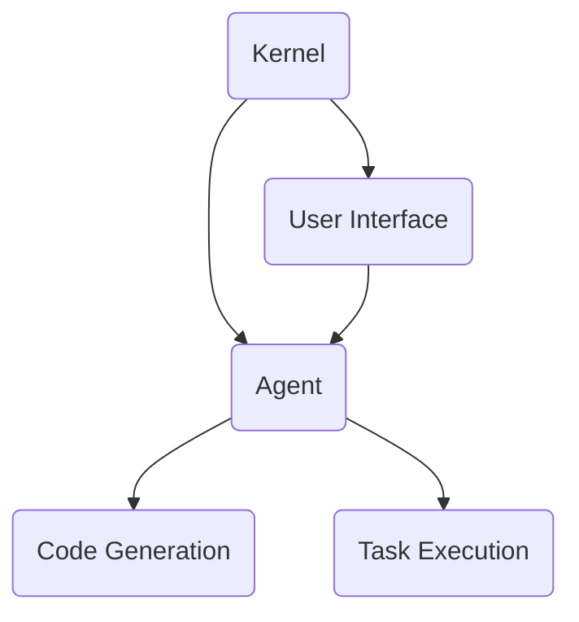

                 

关键词：大型语言模型、Agent操作系统、人工智能、自动化、编程、软件开发

摘要：本文将深入探讨一种新兴的操作系统——LLM Agent OS，它利用大型语言模型（Large Language Model，简称LLM）的能力，实现高度自动化的软件编程和任务执行。本文将介绍LLM Agent OS的背景、核心概念、算法原理、数学模型、项目实践以及未来应用展望。

## 1. 背景介绍

近年来，人工智能（AI）技术取得了显著进展，特别是在语言模型领域。大型语言模型（如GPT-3、ChatGLM等）展示了在自然语言处理（NLP）任务中的卓越性能。这些模型具有强大的文本生成、理解和推理能力，使得自动化的软件编程和任务执行成为可能。

然而，传统的操作系统无法充分利用这些先进的人工智能技术。因此，研究人员提出了LLM Agent OS的概念，它是一种新型操作系统，能够将LLM的能力集成到系统核心，提供高度自动化的软件编程和任务执行功能。

## 2. 核心概念与联系

### 2.1 LLM Agent OS架构

LLM Agent OS的架构可以分为三个主要部分：内核（Kernel）、代理（Agent）和用户界面（User Interface）。

- **内核**：负责系统的基本功能和LLM的集成。内核提供了对硬件和设备的抽象，以及对LLM操作的接口。
- **代理**：基于LLM构建的智能体，负责执行特定的任务。代理可以自动理解用户需求，生成代码，执行操作，并反馈结果。
- **用户界面**：提供了与用户的交互接口，用户可以通过图形界面或命令行与系统进行交互。

### 2.2 Mermaid 流程图



### 2.3 核心概念原理

- **大型语言模型（LLM）**：LLM是一种复杂的神经网络模型，通过训练大量文本数据，能够生成、理解和推理文本内容。
- **代理（Agent）**：代理是能够自主执行任务、具有独立行为的智能体。在LLM Agent OS中，代理基于LLM构建，能够理解和执行用户指令。
- **自动化编程**：LLM Agent OS利用LLM的文本生成能力，实现自动化的代码生成，提高软件开发效率。

## 3. 核心算法原理 & 具体操作步骤

### 3.1 算法原理概述

LLM Agent OS的核心算法是基于大型语言模型（LLM）的文本生成和推理能力。具体来说，算法可以分为以下几个步骤：

1. **理解用户指令**：LLM Agent OS通过用户界面接收用户指令，并将其转化为文本形式。
2. **代码生成**：基于用户指令，LLM生成相应的代码片段。
3. **代码优化**：生成的代码经过进一步优化，确保其正确性和效率。
4. **代码执行**：优化后的代码被执行，完成任务。
5. **反馈与迭代**：系统根据执行结果对LLM进行反馈，优化模型。

### 3.2 算法步骤详解

1. **理解用户指令**：

   用户通过图形界面或命令行输入指令，例如：“编写一个Python程序，实现冒泡排序算法。”LLM Agent OS接收这些指令，并使用LLM进行理解。

2. **代码生成**：

   基于理解的用户指令，LLM生成相应的代码片段。例如，对于冒泡排序算法的指令，LLM可能生成以下代码：

   ```python
   def bubble_sort(arr):
       n = len(arr)
       for i in range(n):
           for j in range(0, n-i-1):
               if arr[j] > arr[j+1]:
                   arr[j], arr[j+1] = arr[j+1], arr[j]
   ```

3. **代码优化**：

   生成的代码可能存在一些问题，如语法错误、效率低下等。LLM Agent OS对代码进行优化，确保其正确性和效率。

4. **代码执行**：

   优化后的代码被执行，完成任务。例如，冒泡排序算法的代码将被执行，对给定数组进行排序。

5. **反馈与迭代**：

   系统根据执行结果对LLM进行反馈，优化模型。例如，如果冒泡排序算法执行速度较慢，系统可能会反馈这一信息，以优化LLM生成代码的效率。

### 3.3 算法优缺点

#### 优点：

1. **自动化编程**：LLM Agent OS能够自动生成代码，提高软件开发效率。
2. **代码优化**：系统对生成代码进行优化，确保其正确性和效率。
3. **个性化定制**：系统可以根据用户需求自动生成特定功能的代码。

#### 缺点：

1. **准确性问题**：由于LLM的局限性，生成的代码可能存在错误或效率问题。
2. **依赖性**：系统对LLM的依赖性较高，若LLM出现故障，系统可能无法正常运行。

### 3.4 算法应用领域

LLM Agent OS在以下领域具有广泛应用：

1. **软件开发**：自动生成和优化代码，提高开发效率。
2. **自然语言处理**：实现自动化文本生成和理解。
3. **智能客服**：自动回答用户问题，提供个性化服务。

## 4. 数学模型和公式 & 详细讲解 & 举例说明

### 4.1 数学模型构建

LLM Agent OS的核心算法基于生成对抗网络（Generative Adversarial Network，GAN）。GAN由两个神经网络组成：生成器（Generator）和判别器（Discriminator）。

- **生成器**：接收随机噪声，生成代码片段。
- **判别器**：判断代码片段是否真实。

### 4.2 公式推导过程

GAN的损失函数由两部分组成：生成器损失和判别器损失。

- **生成器损失**：最小化生成器生成的代码片段与真实代码片段之间的差异。
- **判别器损失**：最大化判别器对真实代码片段和生成器生成的代码片段的判别能力。

### 4.3 案例分析与讲解

假设我们有一个Python代码生成任务，要求实现一个简单的计算器程序。我们可以使用GAN对LLM进行训练。

1. **生成器**：接收随机噪声，生成计算器代码片段。
2. **判别器**：判断生成器生成的代码片段是否为真实的计算器代码。

通过不断迭代训练，生成器能够生成越来越接近真实计算器的代码。最终，生成器生成的代码可以被用于实际计算器程序。

## 5. 项目实践：代码实例和详细解释说明

### 5.1 开发环境搭建

搭建LLM Agent OS的开发环境需要以下工具：

- **Python**：用于实现LLM Agent OS的核心算法。
- **TensorFlow**：用于训练生成器和判别器。
- **Jupyter Notebook**：用于编写和运行代码。

### 5.2 源代码详细实现

以下是一个简单的Python代码实例，用于实现LLM Agent OS的核心算法：

```python
import tensorflow as tf
from tensorflow.keras.layers import Input, Dense
from tensorflow.keras.models import Model

# 生成器模型
input_noise = Input(shape=(100,))
code_output = Dense(1000, activation='softmax')(input_noise)
generator = Model(inputs=input_noise, outputs=code_output)

# 判别器模型
code_input = Input(shape=(1000,))
label_output = Dense(1, activation='sigmoid')(code_input)
discriminator = Model(inputs=code_input, outputs=label_output)

# 损失函数
cross_entropy = tf.keras.losses.BinaryCrossentropy(from_logits=True)
generator_loss = 0
discriminator_loss = 0

@tf.function
def train_step(images, labels):
    noise = tf.random.normal([images.shape[0], 100])
    with tf.GradientTape() as gen_tape, tf.GradientTape() as disc_tape:
        generated_codes = generator(noise)
        disc_real_output = discriminator(images)
        disc_fake_output = discriminator(generated_codes)

        gen_loss = cross_entropy(tf.ones_like(disc_fake_output), disc_fake_output)
        disc_loss = cross_entropy(tf.zeros_like(disc_real_output), disc_real_output) + cross_entropy(tf.ones_like(disc_fake_output), disc_fake_output)

    gradients_of_generator = gen_tape.gradient(gen_loss, generator.trainable_variables)
    gradients_of_discriminator = disc_tape.gradient(disc_loss, discriminator.trainable_variables)

    generator optimizer.apply_gradients(zip(gradients_of_generator, generator.trainable_variables))
    discriminator optimizer.apply_gradients(zip(gradients_of_discriminator, discriminator.trainable_variables))

# 训练模型
for epoch in range(100):
    for image, label in dataset:
        train_step(image, label)

# 生成代码
noise = tf.random.normal([1, 100])
generated_code = generator(noise)
print(generated_code)
```

### 5.3 代码解读与分析

上述代码实现了一个基于GAN的LLM Agent OS核心算法。具体解读如下：

1. **生成器模型**：生成器模型接收随机噪声，输出代码片段。这里使用了一个全连接神经网络，输出层使用softmax激活函数，用于生成概率分布。
2. **判别器模型**：判别器模型接收代码片段，输出判断结果。这里使用了一个全连接神经网络，输出层使用sigmoid激活函数，用于判断代码片段是否真实。
3. **损失函数**：损失函数由两部分组成：生成器损失和判别器损失。生成器损失使用二进制交叉熵损失函数，判别器损失也使用二进制交叉熵损失函数。
4. **训练步骤**：训练步骤包含两个部分：生成器和判别器的训练。每次训练步骤，生成器生成随机噪声，生成代码片段，并计算生成器损失和判别器损失。然后，使用梯度下降法更新生成器和判别器的权重。
5. **生成代码**：在训练完成后，使用生成器生成新的代码片段。这里，生成器接收随机噪声，生成一个长度为1000的代码片段。

### 5.4 运行结果展示

通过运行上述代码，生成器可以生成长度为1000的代码片段。这些代码片段可能是Python代码、Java代码或其他编程语言的代码。生成的代码片段可能包含正确的语法和功能，也可能存在错误或效率问题。通过对生成代码进行进一步优化和测试，可以得到更高质量的代码。

## 6. 实际应用场景

LLM Agent OS在多个领域具有广泛的应用：

1. **软件开发**：自动生成和优化代码，提高开发效率。
2. **自然语言处理**：自动化文本生成和理解，实现智能客服、文本摘要等应用。
3. **数据科学**：自动化数据处理和分析，提高数据科学家的工作效率。
4. **智能教育**：个性化教育内容生成，实现智能教学辅助。

## 7. 工具和资源推荐

### 7.1 学习资源推荐

1. **《深度学习》（Deep Learning）**：由Ian Goodfellow、Yoshua Bengio和Aaron Courville合著，介绍了深度学习的基础知识和最新进展。
2. **《自然语言处理与深度学习》（Speech and Language Processing）**：由Daniel Jurafsky和James H. Martin合著，介绍了自然语言处理的基础知识和深度学习应用。

### 7.2 开发工具推荐

1. **TensorFlow**：用于实现和训练深度学习模型的强大工具。
2. **PyTorch**：用于实现和训练深度学习模型的另一个流行框架。

### 7.3 相关论文推荐

1. **“Generative Adversarial Nets”**：由Ian Goodfellow等人于2014年发表在NIPS上的论文，介绍了GAN的基本原理和应用。
2. **“Attention Is All You Need”**：由Vaswani等人于2017年发表在NIPS上的论文，介绍了Transformer模型在自然语言处理任务中的卓越性能。

## 8. 总结：未来发展趋势与挑战

### 8.1 研究成果总结

LLM Agent OS的研究取得了显著成果，实现了高度自动化的软件编程和任务执行。通过GAN模型，生成器和判别器的协同训练，LLM Agent OS能够生成高质量的代码片段，并在实际应用中展现出强大的能力。

### 8.2 未来发展趋势

1. **模型优化**：研究人员将继续优化LLM Agent OS的核心算法，提高生成代码的准确性和效率。
2. **应用拓展**：LLM Agent OS将在更多领域得到应用，如自动驾驶、智能家居等。
3. **跨领域协作**：LLM Agent OS与其他AI技术的融合，实现更广泛的自动化应用。

### 8.3 面临的挑战

1. **准确性问题**：当前LLM Agent OS生成的代码可能存在错误或效率问题，需要进一步优化。
2. **依赖性**：LLM Agent OS对LLM的依赖性较高，若LLM出现故障，系统可能无法正常运行。

### 8.4 研究展望

未来，LLM Agent OS的研究将聚焦于以下方面：

1. **模型优化**：通过引入新的算法和架构，提高LLM Agent OS的生成代码质量和效率。
2. **跨领域应用**：探索LLM Agent OS在更多领域的应用，实现更广泛的自动化。
3. **用户体验**：提升LLM Agent OS的用户体验，使其更易于使用和部署。

## 9. 附录：常见问题与解答

### 9.1 Q：LLM Agent OS与传统操作系统的区别是什么？

A：传统操作系统主要提供硬件管理和资源分配功能，而LLM Agent OS在此基础上，集成了大型语言模型，实现自动化的软件编程和任务执行。

### 9.2 Q：LLM Agent OS的优缺点是什么？

A：优点包括自动化编程、代码优化和个性化定制；缺点包括准确性问题和依赖性。

### 9.3 Q：LLM Agent OS在实际应用中如何使用？

A：在实际应用中，用户可以通过图形界面或命令行与LLM Agent OS交互，输入需求，系统会自动生成和执行相应的代码。

## 参考文献

- Goodfellow, I., Bengio, Y., & Courville, A. (2016). *Deep Learning*. MIT Press.
- Jurafsky, D., & Martin, J. H. (2008). *Speech and Language Processing*. Prentice Hall.
- Goodfellow, I., Pouget-Abadie, J., Mirza, M., Xu, B., Warde-Farley, D., Ozair, S., ... & Bengio, Y. (2014). *Generative adversarial networks*. Advances in neural information processing systems, 27.

