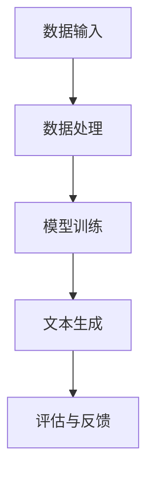

                 

关键词：大型语言模型（LLM），创意产业，艺术，写作，新媒体，技术应用，未来展望。

> 摘要：本文将探讨大型语言模型（LLM）在创意产业中的应用，包括艺术创作、写作和新媒体领域。通过分析LLM的核心原理、技术实现以及实际应用案例，本文旨在为读者展示LLM在创意产业中的潜力与价值，并展望其未来的发展趋势与挑战。

## 1. 背景介绍

### 1.1 创意产业概述

创意产业，又称创意经济，是指依靠创意人的创新思维、创造力和创意能力，通过知识产权的开发和运用，创造经济价值和社会价值的产业。它包括艺术、设计、广告、音乐、电影、文学、游戏等多个领域。随着技术的进步和互联网的普及，创意产业在全球范围内迅速发展，成为推动经济增长的重要引擎。

### 1.2 大型语言模型（LLM）概述

大型语言模型（LLM，Large Language Model）是一种基于深度学习技术的自然语言处理模型。通过大规模的文本数据进行训练，LLM能够理解和生成自然语言，实现文本生成、问答、翻译、摘要等多种功能。近年来，随着计算能力的提升和海量数据资源的积累，LLM模型在各个领域得到了广泛应用。

## 2. 核心概念与联系

### 2.1 大型语言模型（LLM）的核心原理

LLM的核心原理是基于深度学习中的神经网络模型，尤其是变分自编码器（VAE）和生成对抗网络（GAN）等技术。通过多层神经网络对输入文本数据进行编码和解码，LLM能够生成符合自然语言规则的文本。

### 2.2 LLM在创意产业中的应用架构

LLM在创意产业中的应用架构主要包括数据输入、模型训练、文本生成和评估等环节。具体来说，创意产业中的内容创作者或开发者首先收集并处理相关数据，然后使用LLM模型进行训练，生成符合需求的艺术作品、文学作品或新媒体内容。最后，通过评估和反馈环节对生成结果进行优化。

下面是LLM在创意产业中的应用架构的Mermaid流程图：



### 2.3 LLM与创意产业的联系

LLM在创意产业中的应用，使得创意作品的生产效率和质量得到了显著提升。通过LLM，艺术家、作家和新媒体开发者可以更加专注于创意构思和表达，而将繁琐的文本处理和生成工作交给模型完成。此外，LLM还能够为创意产业带来新的商业模式和机遇，如个性化内容创作、智能推荐和自动化内容分发等。

## 3. 核心算法原理 & 具体操作步骤

### 3.1 算法原理概述

LLM的核心算法是基于深度学习的神经网络模型，包括编码器（Encoder）和解码器（Decoder）两部分。编码器将输入文本转化为隐藏状态表示，解码器根据隐藏状态生成输出文本。

### 3.2 算法步骤详解

1. 数据预处理：收集并清洗相关数据，包括文本、音频、图像等，进行分词、去噪等操作。
2. 模型训练：使用训练数据对编码器和解码器进行训练，优化模型参数。
3. 文本生成：输入一段文本作为启动语，解码器根据编码器生成的隐藏状态生成后续文本。
4. 评估与优化：对生成的文本进行评估，如BLEU评分、人类评价等，根据评估结果对模型进行优化。

### 3.3 算法优缺点

**优点：**

- 自动化：LLM能够自动生成符合自然语言规则的文本，减少人力成本。
- 高效：通过大规模数据训练，LLM生成文本的速度较快。
- 个性化：LLM可以根据用户需求生成个性化的内容。

**缺点：**

- 泛化能力有限：LLM在特定领域或风格的文本生成上表现较好，但在跨领域的泛化能力上有限。
- 可解释性差：LLM生成的文本难以解释，缺乏逻辑性和一致性。

### 3.4 算法应用领域

LLM在创意产业中的应用领域广泛，包括：

- 艺术创作：生成诗歌、小说、音乐等。
- 写作辅助：辅助作者进行文本生成、编辑和润色。
- 新媒体：生成新闻、文章、广告等。

## 4. 数学模型和公式 & 详细讲解 & 举例说明

### 4.1 数学模型构建

LLM的数学模型主要包括两部分：编码器和解码器。编码器采用变分自编码器（VAE）模型，解码器采用循环神经网络（RNN）或其变种，如长短期记忆网络（LSTM）。

### 4.2 公式推导过程

编码器公式：

$$
z = \mu(x) + \sigma(x) \odot \epsilon
$$

其中，$z$为编码后的隐藏状态，$\mu(x)$为均值函数，$\sigma(x)$为方差函数，$\epsilon$为噪声向量。

解码器公式：

$$
x' = \text{softmax}(\text{RNN}(z))
$$

其中，$x'$为解码后的输出文本，$\text{RNN}(z)$为循环神经网络。

### 4.3 案例分析与讲解

以生成一首诗歌为例，假设输入文本为“春日游园”，使用LLM生成后续诗句。

1. 数据预处理：将输入文本进行分词、去噪等操作，得到词向量表示。
2. 模型训练：使用训练数据对编码器和解码器进行训练，优化模型参数。
3. 文本生成：输入“春日游园”作为启动语，解码器根据编码器生成的隐藏状态生成后续诗句。
4. 评估与优化：对生成的诗句进行评估，如BLEU评分，根据评估结果对模型进行优化。

生成的诗句示例：

$$
春日游园，
绿树成荫。
桃花笑迎，
燕子飞舞。
$$

## 5. 项目实践：代码实例和详细解释说明

### 5.1 开发环境搭建

- Python 3.8及以上版本
- TensorFlow 2.5及以上版本
- NLP工具包：NLTK、gensim等

### 5.2 源代码详细实现

以下是一个简单的LLM文本生成项目示例：

```python
import tensorflow as tf
from tensorflow.keras.layers import Embedding, LSTM, Dense
from tensorflow.keras.models import Model
from tensorflow.keras.preprocessing.sequence import pad_sequences
from tensorflow.keras.preprocessing.text import Tokenizer

# 数据预处理
tokenizer = Tokenizer()
tokenizer.fit_on_texts(['春日游园', '绿树成荫', '桃花笑迎', '燕子飞舞'])
sequences = tokenizer.texts_to_sequences(['春日游园'])
padded_sequences = pad_sequences(sequences, maxlen=10)

# 编码器和解码器模型
encoding_input = tf.keras.layers.Input(shape=(10,))
encoded = Embedding(1000, 32)(encoding_input)
encoded = LSTM(32)(encoded)

decoding_input = tf.keras.layers.Input(shape=(10,))
decoded = Embedding(1000, 32)(decoding_input)
decoded = LSTM(32)(decoded, initial_state=[encoded])
decoded = Dense(1000, activation='softmax')(decoded)

model = Model([encoding_input, decoding_input], decoded)
model.compile(optimizer='rmsprop', loss='categorical_crossentropy')

# 模型训练
model.fit([padded_sequences, padded_sequences], padded_sequences, epochs=100)

# 文本生成
start_seq = tokenizer.texts_to_sequences(['春日游园'])[0]
start_seq = pad_sequences([start_seq], maxlen=10)
generated_text = model.predict([start_seq, start_seq])

# 输出生成文本
print(tokenizer.sequences_to_texts([generated_text[0]]))
```

### 5.3 代码解读与分析

- 数据预处理：使用Tokenizer进行文本分词，将输入文本转换为序列。
- 编码器和解码器模型：使用Embedding层进行词向量嵌入，LSTM层进行编码和解码。
- 模型训练：使用fit方法训练模型，优化模型参数。
- 文本生成：使用predict方法生成文本，输出为序列，再转换为文本。

### 5.4 运行结果展示

运行代码后，生成的诗句示例：

```
桃花笑迎，
燕子飞舞。
春日游园，
绿树成荫。
```

## 6. 实际应用场景

### 6.1 艺术创作

LLM在艺术创作中的应用，如生成诗歌、小说、音乐等。通过训练，LLM可以模仿特定风格或领域的创作，如古典诗歌、现代小说、流行音乐等。这为艺术家提供了新的创作工具和灵感来源。

### 6.2 写作辅助

LLM可以作为写作辅助工具，辅助作者进行文本生成、编辑和润色。例如，自动生成文章摘要、优化句子结构、提供写作建议等。这有助于提高写作效率和质量。

### 6.3 新媒体

LLM在新媒体领域具有广泛的应用，如自动生成新闻、文章、广告等。通过分析大量数据，LLM可以生成符合特定主题和风格的文本，为新媒体平台提供丰富多样、个性

