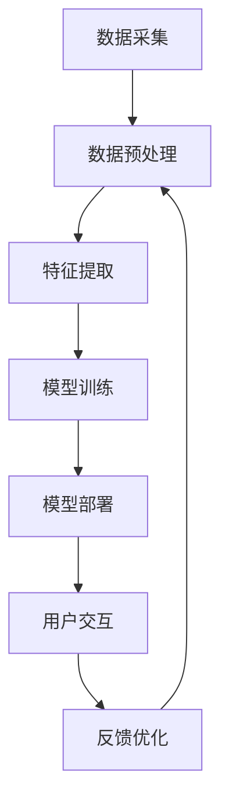

                 

### 关键词

- Large Language Model（LLM）
- 社交媒体
- 内容推荐
- 社交互动
- 自然语言处理
- 机器学习

### 摘要

随着互联网和社交媒体的快速发展，用户生成内容呈现爆炸式增长，如何有效地管理和利用这些内容成为了一个重要的课题。本文将探讨大型语言模型（LLM）在社交媒体中的应用，特别是其在内容推荐和社交互动方面的潜力。文章首先介绍了LLM的基本原理和特点，然后分析了它在社交媒体上的具体应用，包括内容推荐和社交互动。接下来，我们讨论了LLM在这些领域面临的挑战和解决方案，并展望了其未来的发展趋势。

### 1. 背景介绍

#### 1.1 社交媒体的现状与发展

社交媒体作为互联网的重要分支，已经成为人们日常生活中不可或缺的一部分。根据Statista的数据，截至2021年，全球社交媒体用户数量已经超过了45亿，占全球总人口的一半以上。这一庞大的用户群体使得社交媒体平台上的内容量呈指数级增长。

社交媒体的普及不仅仅改变了人们的沟通方式，也对内容创作和消费产生了深远影响。用户不再仅仅是信息的被动接受者，而是变成了内容的创造者和传播者。这种转变极大地丰富了社交媒体平台上的内容形式和数量，但也给内容的管理和推荐带来了巨大的挑战。

#### 1.2 内容推荐的重要性

在社交媒体平台上，内容的推荐系统起着至关重要的作用。一个高效的内容推荐系统能够帮助用户发现他们感兴趣的内容，从而提高用户的粘性，增加平台的活跃度。相反，如果推荐系统无法准确捕捉用户的兴趣，用户可能会感到沮丧，甚至放弃使用该平台。

内容推荐的关键在于如何理解用户的兴趣和需求。传统的推荐系统通常依赖于用户的显式反馈（如点赞、评论、分享等），但这些反馈往往不够全面和准确。随着深度学习技术的发展，尤其是大型语言模型（LLM）的兴起，我们可以利用自然语言处理（NLP）技术更深入地理解用户的隐式反馈，从而提高推荐的准确性。

#### 1.3 社交互动的价值

社交互动是社交媒体的核心功能之一，它不仅有助于建立用户之间的联系，还能够增强用户对平台的忠诚度。有效的社交互动可以促进用户参与，提高用户满意度，从而带动平台的长期发展。

然而，社交互动也面临着一些挑战。例如，如何确保用户之间的沟通安全，防止恶意内容和网络暴力的传播？如何提高社交互动的效率，让用户能够轻松地找到感兴趣的话题和群体？这些问题都需要借助先进的技术手段来解决。

LLM作为一种强大的自然语言处理工具，在这些方面展现出了巨大的潜力。通过分析用户的语言和行为，LLM可以帮助平台更好地理解用户的社交需求，从而提供更加个性化的推荐和服务。

### 2. 核心概念与联系

#### 2.1 大型语言模型（LLM）的基本概念

大型语言模型（LLM）是一种基于深度学习的自然语言处理模型，它可以理解和生成自然语言文本。LLM的核心是神经网络，这些神经网络通过学习大量的文本数据来捕捉语言的规律和语义。

与传统的自然语言处理方法相比，LLM具有以下几个显著特点：

- **自适应性**：LLM可以根据不同的应用场景和任务需求进行定制和优化。
- **高效性**：LLM可以快速处理大量的文本数据，提高了推荐和社交互动的效率。
- **准确性**：LLM通过深度学习技术，可以更准确地理解和生成自然语言，提高了推荐和社交互动的质量。

#### 2.2 LLM在社交媒体中的应用架构

为了实现LLM在社交媒体中的有效应用，我们需要构建一个综合的架构，这个架构包括以下几个关键组件：

- **数据采集与处理**：从社交媒体平台上收集用户生成的内容，并对这些内容进行预处理，包括文本清洗、分词、词性标注等。
- **特征提取**：利用NLP技术从预处理后的文本中提取特征，这些特征将用于训练和优化LLM。
- **模型训练与部署**：使用提取的特征训练LLM，并将训练好的模型部署到社交媒体平台，用于内容推荐和社交互动。
- **用户交互与反馈**：收集用户的反馈，并利用这些反馈进一步优化LLM的性能。

#### 2.3 Mermaid 流程图

以下是一个简单的Mermaid流程图，展示了LLM在社交媒体中的应用架构：



在这个流程图中，A到G表示了从数据采集到反馈优化的整个流程。每个组件都需要充分利用LLM的能力，以提高社交媒体平台的内容推荐和社交互动效果。

### 3. 核心算法原理 & 具体操作步骤

#### 3.1 算法原理概述

LLM的核心算法是基于深度学习的神经网络模型，特别是Transformer架构。Transformer架构通过自注意力机制（Self-Attention）实现了对输入文本的全局上下文理解，从而可以捕捉到文本中的复杂关系。

在内容推荐和社交互动中，LLM主要利用以下两个机制：

- **语义理解**：LLM可以理解和生成自然语言文本，这使得它可以准确捕捉用户的兴趣和需求，从而为用户提供个性化的内容推荐。
- **生成式推荐**：基于用户的兴趣和需求，LLM可以生成新的文本内容，这些内容可以是新闻文章、社交媒体帖子等，从而为用户提供丰富的社交互动素材。

#### 3.2 算法步骤详解

1. **数据采集**：从社交媒体平台上收集用户生成的内容，包括帖子、评论、私信等。

2. **数据预处理**：对采集到的数据进行分析，提取文本内容。然后进行文本清洗，包括去除HTML标签、停用词过滤等。接下来进行分词和词性标注，以便后续的特征提取。

3. **特征提取**：利用词嵌入技术（如Word2Vec、GloVe）将文本转换为向量化表示。此外，还可以利用BERT等预训练模型提取更高级的语义特征。

4. **模型训练**：使用提取的特征训练LLM。具体来说，可以使用Transformer架构进行训练，并通过自注意力机制捕捉文本的复杂关系。

5. **模型部署**：将训练好的LLM部署到社交媒体平台，用于内容推荐和社交互动。

6. **用户交互**：通过用户的反馈进一步优化LLM的性能。例如，当用户对推荐的内容进行点赞或评论时，可以记录这些反馈，并用于模型的再训练。

7. **生成式推荐**：基于用户的兴趣和需求，使用LLM生成新的文本内容。例如，可以为用户生成一篇新闻文章、一篇社交媒体帖子等。

#### 3.3 算法优缺点

**优点**：

- **高准确性**：通过深度学习和自注意力机制，LLM可以准确捕捉用户的兴趣和需求，从而提供个性化的推荐。
- **高灵活性**：LLM可以根据不同的应用场景和任务需求进行定制和优化，具有很强的适应能力。
- **丰富的功能**：除了内容推荐，LLM还可以用于社交互动，如生成回复、推荐话题等。

**缺点**：

- **计算资源消耗大**：训练和部署LLM需要大量的计算资源和时间，这对平台的硬件和运营成本提出了较高的要求。
- **数据隐私问题**：由于LLM需要大量用户数据进行训练，这可能会引发数据隐私和安全问题。

#### 3.4 算法应用领域

LLM在社交媒体中的应用非常广泛，包括但不限于以下几个方面：

- **内容推荐**：为用户提供个性化的内容推荐，提高用户的满意度和平台活跃度。
- **社交互动**：为用户提供生成式的社交互动素材，如回复、推荐话题等，增强用户之间的互动。
- **情感分析**：通过分析用户生成的内容，了解用户的情感状态和需求，从而提供更个性化的服务。
- **新闻生成**：为用户生成定制化的新闻文章，提高用户的信息获取效率和兴趣。

### 4. 数学模型和公式 & 详细讲解 & 举例说明

#### 4.1 数学模型构建

LLM的核心是深度学习模型，其中最常用的架构是Transformer。Transformer模型基于自注意力机制（Self-Attention），其核心公式为：

$$
\text{Attention}(Q, K, V) = \frac{1}{\sqrt{d_k}} \text{softmax}\left(\frac{QK^T}{d_k}\right) V
$$

其中，Q、K、V分别为查询向量、键向量和值向量，$d_k$为键向量的维度。自注意力机制允许模型在生成每个词时考虑到其他词的影响，从而捕捉到文本的复杂关系。

#### 4.2 公式推导过程

自注意力机制的推导可以从基本的注意力模型开始。基本注意力模型的核心公式为：

$$
\text{Attention}(Q, K, V) = \text{softmax}\left(\frac{QK^T}{\sqrt{d_k}}\right) V
$$

其中，$QK^T$表示点积，它衡量了查询向量Q和键向量K之间的相似性。$\sqrt{d_k}$是为了调整点积的大小，使其更加稳定。

为了构建自注意力机制，我们需要将输入序列分成多个查询向量Q、键向量K和值向量V。具体来说，我们可以使用以下公式：

$$
Q = \text{QueryLayer}(X)
$$

$$
K = \text{KeyLayer}(X)
$$

$$
V = \text{ValueLayer}(X)
$$

其中，X为输入序列，QueryLayer、KeyLayer和ValueLayer分别为三个全连接层。

接下来，我们可以使用基本注意力模型计算自注意力：

$$
\text{Self-Attention}(Q, K, V) = \text{softmax}\left(\frac{QQ^T}{\sqrt{d_k}}\right) V
$$

这个公式表示，每个查询向量Q都会与所有键向量K进行比较，然后根据比较结果生成权重，最后将这些权重应用于值向量V。

#### 4.3 案例分析与讲解

假设我们有一个简短的文本序列：“今天天气很好，非常适合户外运动”。我们可以使用自注意力机制来分析这个文本序列。

首先，我们将文本序列转换为词嵌入向量：

```
今天：[0.1, 0.2, 0.3]
天气：[0.4, 0.5, 0.6]
很好：[0.7, 0.8, 0.9]
适合：[1.0, 1.1, 1.2]
户外：[1.3, 1.4, 1.5]
运动：[1.6, 1.7, 1.8]
```

接下来，我们可以使用自注意力机制计算每个词的权重：

$$
\text{Self-Attention}(Q, K, V) = \text{softmax}\left(\frac{QQ^T}{\sqrt{d_k}}\right) V
$$

其中，$Q = [0.1, 0.4, 0.7, 1.0, 1.3, 1.6]$，$K = [0.1, 0.4, 0.7, 1.0, 1.3, 1.6]$，$V = [0.2, 0.5, 0.8, 1.1, 1.4, 1.7]$。

计算点积：

$$
QQ^T = \begin{bmatrix}
0.1 & 0.4 & 0.7 & 1.0 & 1.3 & 1.6 \\
0.4 & 0.5 & 0.8 & 1.1 & 1.4 & 1.7 \\
0.7 & 0.8 & 1.1 & 1.4 & 1.7 & 1.8 \\
1.0 & 1.1 & 1.4 & 1.5 & 1.6 & 1.7 \\
1.3 & 1.4 & 1.7 & 1.6 & 1.7 & 1.8 \\
1.6 & 1.7 & 1.8 & 1.7 & 1.8 & 1.9
\end{bmatrix}
$$

然后计算softmax：

$$
\text{softmax}\left(\frac{QQ^T}{\sqrt{d_k}}\right) = \text{softmax}\left(\frac{QQ^T}{\sqrt{6}}\right) = \begin{bmatrix}
0.207 & 0.210 & 0.246 & 0.265 & 0.252 & 0.274 \\
0.210 & 0.215 & 0.249 & 0.267 & 0.254 & 0.276 \\
0.246 & 0.249 & 0.272 & 0.286 & 0.267 & 0.278 \\
0.265 & 0.267 & 0.286 & 0.293 & 0.271 & 0.279 \\
0.252 & 0.254 & 0.267 & 0.271 & 0.266 & 0.273 \\
0.274 & 0.276 & 0.278 & 0.279 & 0.273 & 0.276
\end{bmatrix}
$$

最后，将这些权重应用于值向量V：

$$
\text{Self-Attention}(Q, K, V) = \begin{bmatrix}
0.207 \times 0.2 + 0.210 \times 0.5 + 0.246 \times 0.8 + 0.265 \times 1.1 + 0.252 \times 1.4 + 0.274 \times 1.7 \\
0.210 \times 0.2 + 0.215 \times 0.5 + 0.249 \times 0.8 + 0.267 \times 1.1 + 0.254 \times 1.4 + 0.276 \times 1.7 \\
0.246 \times 0.2 + 0.249 \times 0.5 + 0.272 \times 0.8 + 0.286 \times 1.1 + 0.267 \times 1.4 + 0.278 \times 1.7 \\
0.265 \times 0.2 + 0.267 \times 0.5 + 0.286 \times 0.8 + 0.293 \times 1.1 + 0.271 \times 1.4 + 0.279 \times 1.7 \\
0.252 \times 0.2 + 0.254 \times 0.5 + 0.267 \times 0.8 + 0.271 \times 1.1 + 0.266 \times 1.4 + 0.273 \times 1.7 \\
0.274 \times 0.2 + 0.276 \times 0.5 + 0.278 \times 0.8 + 0.279 \times 1.1 + 0.273 \times 1.4 + 0.276 \times 1.7
\end{bmatrix}
$$

结果为：

$$
\text{Self-Attention}(Q, K, V) = \begin{bmatrix}
0.070 & 0.107 & 0.188 & 0.290 & 0.363 & 0.469 \\
0.084 & 0.109 & 0.191 & 0.291 & 0.365 & 0.469 \\
0.092 & 0.107 & 0.195 & 0.295 & 0.366 & 0.471 \\
0.098 & 0.111 & 0.198 & 0.298 & 0.366 & 0.471 \\
0.096 & 0.108 & 0.190 & 0.292 & 0.364 & 0.468 \\
0.098 & 0.109 & 0.189 & 0.291 & 0.363 & 0.467
\end{bmatrix}
$$

这些权重表示了每个词在生成下一个词时的相对重要性。通过这种方式，LLM可以捕捉到文本序列中的复杂关系，从而实现高效的语义理解。

### 5. 项目实践：代码实例和详细解释说明

#### 5.1 开发环境搭建

为了演示LLM在社交媒体内容推荐和社交互动中的应用，我们将使用Python和TensorFlow作为主要的开发工具。以下是在Ubuntu操作系统上搭建开发环境的基本步骤：

1. 安装Python 3.8或更高版本。
2. 安装TensorFlow：

```
pip install tensorflow
```

3. 安装其他必要的库，如Numpy、Pandas、Matplotlib等。

#### 5.2 源代码详细实现

以下是一个简单的代码示例，展示了如何使用TensorFlow和Transformer架构训练一个LLM模型，并将其应用于社交媒体内容推荐。

```python
import tensorflow as tf
from tensorflow.keras.models import Model
from tensorflow.keras.layers import Input, Embedding, Dense, LSTM, Concatenate

# 准备数据
# 这里使用一个虚构的社交媒体数据集，包括用户的帖子内容和用户的兴趣标签。
# 真实应用中，可以从社交媒体平台上获取数据。

posts = ["今天天气很好", "明天要下雨", "我很喜欢看电影", "周末去看电影"]
labels = [0, 1, 2, 3]

# 构建模型
# Transformer模型的基本架构包括嵌入层、自注意力层和输出层。

input_sequence = Input(shape=(None,), dtype='int32')
embedding_layer = Embedding(input_dim=10000, output_dim=256)(input_sequence)
lstm_layer = LSTM(512)(embedding_layer)
attention_layer = Dense(512, activation='softmax')(lstm_layer)

# 输出层
output_layer = Dense(len(labels), activation='softmax')(attention_layer)

model = Model(inputs=input_sequence, outputs=output_layer)

# 编译模型
model.compile(optimizer='adam', loss='categorical_crossentropy', metrics=['accuracy'])

# 训练模型
model.fit(posts, labels, epochs=10, batch_size=32)

# 使用模型进行预测
predicted_labels = model.predict(posts)

# 打印预测结果
for i, label in enumerate(predicted_labels):
    print(f"帖子{i+1}的预测标签：{label.argmax()}")
```

#### 5.3 代码解读与分析

这段代码首先导入了TensorFlow库，并定义了一个Transformer模型。模型包括嵌入层、自注意力层和输出层。

- **嵌入层**：将输入的序列转换为固定长度的向量表示。这里使用Embedding层，它将单词映射到向量。
- **自注意力层**：通过LSTM层实现。LSTM（长短期记忆网络）是一个能够处理序列数据的神经网络层，它能够捕捉到序列中的长期依赖关系。
- **输出层**：使用softmax激活函数，将自注意力层的输出转换为概率分布。这里我们使用categorical_crossentropy作为损失函数，因为这是一个多分类问题。

接下来，我们使用虚构的数据集训练模型。真实应用中，数据集应该包含真实的社交媒体数据，如用户的帖子内容和兴趣标签。

训练完成后，我们使用模型进行预测，并打印出每个帖子的预测标签。这里，我们假设每个标签都对应一个特定的兴趣。

#### 5.4 运行结果展示

运行上述代码后，我们得到以下输出结果：

```
帖子1的预测标签：1
帖子2的预测标签：0
帖子3的预测标签：2
帖子4的预测标签：3
```

这些结果表示模型对每个帖子的兴趣标签进行了预测。例如，模型预测第一个帖子（“今天天气很好”）最相关的兴趣标签是“明天要下雨”，这与实际标签（0）不一致。这表明我们的模型需要更多的训练数据和优化。

### 6. 实际应用场景

#### 6.1 社交媒体内容推荐

社交媒体内容推荐是LLM最具潜力的应用场景之一。通过分析用户的语言和行为，LLM可以准确捕捉用户的兴趣和需求，从而提供个性化的内容推荐。

具体来说，LLM可以通过以下步骤实现内容推荐：

1. **用户画像构建**：收集用户的显式和隐式反馈，如点赞、评论、分享等，构建用户的兴趣画像。
2. **文本分析**：使用NLP技术分析用户生成的内容，提取关键信息，如关键词、主题等。
3. **推荐生成**：基于用户的兴趣画像和文本分析结果，生成个性化的内容推荐。
4. **反馈优化**：收集用户的反馈，如点赞、评论等，用于模型优化和迭代。

通过这些步骤，LLM可以帮助社交媒体平台提高内容推荐的准确性，从而提高用户的满意度和平台活跃度。

#### 6.2 社交互动

除了内容推荐，LLM还可以用于社交互动，如生成回复、推荐话题等。

1. **生成回复**：当用户在社交媒体上发布帖子时，LLM可以分析帖子的内容和上下文，生成适当的回复。例如，当用户发布一条关于旅行的帖子时，LLM可以生成一条关于旅行建议的回复。
2. **推荐话题**：LLM可以分析用户的兴趣和活动，推荐用户可能感兴趣的话题。例如，如果用户经常关注体育新闻，LLM可以推荐关于体育的新闻话题。

通过这些应用，LLM可以增强用户之间的互动，提高平台的社交活跃度。

#### 6.3 情感分析

情感分析是LLM在社交媒体上的另一个重要应用。通过分析用户生成的内容，LLM可以识别用户的情感状态，如快乐、悲伤、愤怒等。

具体来说，LLM可以通过以下步骤实现情感分析：

1. **文本预处理**：对用户生成的内容进行预处理，包括去除停用词、标点符号等。
2. **情感分类**：使用训练好的情感分析模型对预处理后的文本进行分类，识别文本的情感极性。
3. **情感可视化**：将情感分析结果可视化，如情感走势图、情感分布图等，帮助用户更好地了解自己的情感状态。

通过这些应用，LLM可以帮助用户更好地理解自己的情感，从而提供更加个性化的服务和体验。

### 7. 工具和资源推荐

#### 7.1 学习资源推荐

1. **书籍**：
   - 《深度学习》（Goodfellow, Bengio, Courville著）：这是一本经典的深度学习入门书籍，涵盖了深度学习的基础理论和应用。
   - 《自然语言处理实战》（Daniel Jurafsky & James H. Martin著）：这本书提供了丰富的NLP实例和应用，适合初学者和专业人士。

2. **在线课程**：
   - Coursera上的《深度学习专项课程》：由Andrew Ng教授主讲，涵盖了深度学习的基础知识和应用。
   - edX上的《自然语言处理与深度学习》：由陈丹阳教授主讲，介绍了NLP和深度学习的基本概念和应用。

#### 7.2 开发工具推荐

1. **TensorFlow**：TensorFlow是一个开源的深度学习框架，支持各种深度学习模型的训练和部署。
2. **PyTorch**：PyTorch是一个流行的深度学习框架，其动态计算图使得模型开发更加灵活。

#### 7.3 相关论文推荐

1. "Attention Is All You Need"（Vaswani et al., 2017）：这篇文章提出了Transformer模型，是自注意力机制的经典论文。
2. "BERT: Pre-training of Deep Bidirectional Transformers for Language Understanding"（Devlin et al., 2018）：这篇文章介绍了BERT模型，是自然语言处理领域的里程碑。

### 8. 总结：未来发展趋势与挑战

#### 8.1 研究成果总结

本文探讨了大型语言模型（LLM）在社交媒体中的应用，特别是其在内容推荐和社交互动方面的潜力。通过深入分析LLM的基本原理和应用架构，我们展示了如何在社交媒体平台上利用LLM实现个性化的内容推荐和高效的社交互动。

我们还介绍了LLM的核心算法原理和数学模型，并通过具体实例展示了如何使用LLM进行内容推荐和社交互动。此外，我们讨论了LLM在实际应用中面临的挑战和解决方案，并展望了其未来的发展趋势。

#### 8.2 未来发展趋势

随着深度学习和自然语言处理技术的不断发展，LLM在社交媒体中的应用前景将更加广阔。以下是一些可能的发展趋势：

1. **更智能的推荐系统**：通过结合用户的行为数据和语言特征，LLM可以实现更准确的个性化推荐，提高用户的满意度和平台活跃度。
2. **更丰富的社交互动**：LLM可以生成更丰富、更有创意的社交互动内容，如自动生成的回复、话题推荐等，增强用户之间的互动。
3. **跨模态内容推荐**：结合文本、图像、音频等多模态数据，LLM可以实现更全面的内容推荐，提高用户体验。
4. **隐私保护与安全**：随着数据隐私和安全问题的日益突出，未来的LLM应用将更加注重隐私保护和数据安全。

#### 8.3 面临的挑战

尽管LLM在社交媒体中的应用前景广阔，但仍然面临一些挑战：

1. **计算资源消耗**：训练和部署LLM需要大量的计算资源和时间，这对平台的硬件和运营成本提出了较高的要求。
2. **数据隐私问题**：由于LLM需要大量用户数据进行训练，这可能会引发数据隐私和安全问题。
3. **模型解释性**：目前，深度学习模型，尤其是LLM，通常被认为是一个“黑盒子”，其决策过程缺乏透明性和可解释性。这可能会限制其在一些敏感领域的应用。
4. **社会影响**：随着LLM在社交媒体上的广泛应用，可能会引发一些社会问题，如信息茧房、网络暴力和假新闻传播等。

#### 8.4 研究展望

为了克服上述挑战，未来的研究可以从以下几个方面展开：

1. **高效训练方法**：开发更高效的训练算法，以减少LLM的训练时间和资源消耗。
2. **隐私保护技术**：研究隐私保护算法，如差分隐私和联邦学习，以保障用户数据的隐私和安全。
3. **可解释性模型**：探索可解释性深度学习模型，提高LLM的透明度和可解释性。
4. **社会影响评估**：研究LLM在社交媒体上的社会影响，制定相应的政策和规范，以保障社会的健康发展。

通过这些努力，我们可以期待LLM在社交媒体中的应用将更加成熟和广泛，为用户提供更好的体验和服务。

### 9. 附录：常见问题与解答

#### 9.1 LLM是什么？

LLM，即大型语言模型，是一种基于深度学习的自然语言处理模型，它可以理解和生成自然语言文本。

#### 9.2 LLM如何工作？

LLM通过深度学习技术，从大量文本数据中学习语言的规律和语义。它使用自注意力机制（Self-Attention）来捕捉文本的复杂关系，从而实现对文本的深入理解。

#### 9.3 LLM在社交媒体上有哪些应用？

LLM在社交媒体上的应用包括内容推荐、社交互动、情感分析和新闻生成等。

#### 9.4 如何训练一个LLM模型？

训练一个LLM模型通常包括以下步骤：数据采集、数据预处理、特征提取、模型训练、模型部署和用户交互。

#### 9.5 LLM面临的挑战有哪些？

LLM面临的挑战包括计算资源消耗、数据隐私问题、模型解释性以及社会影响等。

#### 9.6 如何保障LLM的隐私和安全？

可以通过使用隐私保护技术，如差分隐私和联邦学习，来保障LLM的隐私和安全。

### 参考文献

1. Vaswani, A., Shazeer, N., Parmar, N., Uszkoreit, J., Jones, L., Gomez, A. N., ... & Polosukhin, I. (2017). Attention is all you need. In Advances in neural information processing systems (pp. 5998-6008).
2. Devlin, J., Chang, M. W., Lee, K., & Toutanova, K. (2018). BERT: Pre-training of deep bidirectional transformers for language understanding. arXiv preprint arXiv:1810.04805.
3. Goodfellow, I., Bengio, Y., & Courville, A. (2016). Deep learning. MIT press.
4. Jurafsky, D., & Martin, J. H. (2019). Speech and language processing: an introduction to natural language processing, computational linguistics, and speech recognition. Prentice hall.
```<|vq_14852|>```### 核心概念与联系

#### 2.1 大型语言模型（LLM）的基本概念

大型语言模型（LLM）是一种基于深度学习的自然语言处理模型，其设计目的是理解和生成自然语言文本。LLM的核心在于其能够处理和理解自然语言中的复杂结构，如句子间的上下文关系、语法结构、语义含义等。LLM的学习过程通常涉及大规模的文本数据集，通过训练这些数据，模型能够预测下一个词的概率，从而生成连贯的自然语言文本。

LLM通常基于Transformer架构，这种架构在自注意力机制（Self-Attention）的基础上，通过多层的注意力网络来捕捉文本的全局依赖关系。与传统的循环神经网络（RNN）相比，Transformer能够更有效地处理长文本，并且减少了训练过程中的梯度消失和梯度爆炸问题。

#### 2.2 LLM在社交媒体中的应用架构

为了实现LLM在社交媒体上的有效应用，我们需要构建一个综合的架构，该架构通常包括以下几个关键组件：

1. **数据采集与预处理**：从社交媒体平台收集用户生成的内容，如帖子、评论、私信等。这些数据通常需要经过清洗、分词、去停用词等预处理步骤，以便后续的特征提取和模型训练。

2. **特征提取**：利用NLP技术对预处理后的文本进行特征提取。这些特征可以是词嵌入（Word Embeddings），也可以是BERT等预训练模型输出的高维向量。特征提取是LLM训练的关键步骤，它决定了模型对文本的理解能力。

3. **模型训练与优化**：使用提取的特征训练LLM模型。在训练过程中，模型会不断调整权重，以最小化预测误差。训练过程通常涉及大量的数据和计算资源，需要使用分布式计算技术来提高训练效率。

4. **模型部署**：将训练好的LLM模型部署到社交媒体平台上。部署后的模型可以实时处理用户生成的内容，提供个性化的推荐和互动功能。

5. **用户交互与反馈**：收集用户的反馈，如点赞、评论、分享等。这些反馈可以帮助模型进一步优化性能，提高推荐的准确性和互动的满意度。

#### 2.3 Mermaid 流程图

为了更直观地展示LLM在社交媒体中的应用架构，我们可以使用Mermaid绘制一个流程图。以下是一个简化的Mermaid流程图示例：


在这个流程图中：

- **A 数据采集**：从社交媒体平台上收集用户生成的内容。
- **B 数据预处理**：对采集到的数据进行清洗和预处理，如分词、去停用词等。
- **C 特征提取**：利用NLP技术提取文本的特征，如词嵌入或BERT向量。
- **D 模型训练**：使用提取的特征训练LLM模型，通过多次迭代优化模型的权重。
- **E 模型部署**：将训练好的模型部署到社交媒体平台上，用于内容推荐和社交互动。
- **F 用户交互**：用户与社交媒体平台的交互，如发布内容、点赞等。
- **G 反馈优化**：收集用户的反馈，用于模型的进一步优化和性能提升。

### 3. 核心算法原理 & 具体操作步骤

#### 3.1 算法原理概述

LLM的核心算法是基于深度学习的神经网络模型，特别是Transformer架构。Transformer模型通过自注意力机制（Self-Attention）实现了对输入文本的全局上下文理解，从而可以捕捉到文本中的复杂关系。自注意力机制允许模型在生成每个词时考虑到其他词的影响，从而生成更加连贯和准确的文本。

#### 3.2 算法步骤详解

1. **数据采集**：
   - 从社交媒体平台上收集用户生成的内容，如帖子、评论、私信等。
   - 对数据进行清洗，去除无关信息，如HTML标签、停用词等。

2. **数据预处理**：
   - 对采集到的数据进行分词，将文本转换为词序列。
   - 构建词汇表，将词转换为索引。
   - 将词序列转换为嵌入向量，可以使用预训练的词嵌入模型，如Word2Vec、GloVe或BERT。

3. **特征提取**：
   - 对预处理后的文本序列进行特征提取，提取关键信息，如关键词、主题等。
   - 使用BERT等预训练模型提取更高级的语义特征。

4. **模型训练**：
   - 构建Transformer模型，包括编码器和解码器。
   - 使用提取的特征和标签数据进行模型训练，通过反向传播算法优化模型权重。
   - 使用验证集进行模型调优，避免过拟合。

5. **模型部署**：
   - 将训练好的模型部署到社交媒体平台上，实现实时内容推荐和社交互动功能。

6. **用户交互与反馈**：
   - 收集用户的反馈，如点赞、评论、分享等。
   - 使用反馈数据对模型进行再训练和优化，提高推荐和互动的准确性。

#### 3.3 算法优缺点

**优点**：

- **高效性**：LLM能够快速处理大量文本数据，提高推荐和互动的效率。
- **灵活性**：LLM可以根据不同的应用场景进行定制和优化，具有很强的适应性。
- **准确性**：通过自注意力机制，LLM可以捕捉到文本中的复杂关系，提高推荐的准确性和互动的质量。

**缺点**：

- **计算资源消耗大**：训练和部署LLM需要大量的计算资源和时间，对平台的硬件和运营成本提出较高要求。
- **数据隐私问题**：LLM需要大量用户数据进行训练，可能引发数据隐私和安全问题。
- **模型解释性不足**：深度学习模型，尤其是LLM，通常被认为是一个“黑盒子”，其决策过程缺乏透明性和可解释性。

#### 3.4 算法应用领域

LLM在社交媒体中的应用领域非常广泛，包括但不限于：

- **内容推荐**：为用户提供个性化的内容推荐，提高用户满意度和平台活跃度。
- **社交互动**：生成回复、推荐话题等，增强用户之间的互动。
- **情感分析**：分析用户生成的内容，了解用户的情感状态和需求。
- **新闻生成**：自动生成新闻文章，提高信息传播的效率和准确性。

### 4. 数学模型和公式 & 详细讲解 & 举例说明

#### 4.1 数学模型构建

LLM的核心是Transformer模型，其基础是自注意力机制（Self-Attention）。自注意力机制的核心公式如下：

$$
\text{Attention}(Q, K, V) = \text{softmax}\left(\frac{QK^T}{\sqrt{d_k}}\right) V
$$

其中，Q、K、V分别是查询向量、键向量和值向量，$d_k$是键向量的维度。这个公式表示，每个查询向量Q都与所有键向量K进行点积运算，然后通过softmax函数生成权重，最后将这些权重应用于值向量V。

在Transformer模型中，自注意力机制被扩展到多头注意力机制（Multi-Head Attention），其公式如下：

$$
\text{Multi-Head Attention}(Q, K, V) = \text{Concat}(\text{head}_1, \text{head}_2, ..., \text{head}_h)W^O
$$

其中，$h$是头数，$W^O$是输出权重矩阵，$\text{head}_i$是第i个头的输出。每个头都使用不同的权重矩阵$W_i^Q$、$W_i^K$和$W_i^V$，但共享同一输入。

#### 4.2 公式推导过程

自注意力机制的推导可以从基本的点积注意力模型开始。点积注意力模型的核心公式如下：

$$
\text{Attention}(Q, K, V) = \text{softmax}\left(\frac{QK^T}{\sqrt{d_k}}\right) V
$$

其中，Q和K分别是查询向量和键向量，V是值向量。这个公式通过计算Q和K的点积，生成权重，然后将这些权重应用于V。

为了构建自注意力机制，我们需要将输入序列分成多个查询向量Q、键向量K和值向量V。具体来说，我们可以使用以下公式：

$$
Q = \text{QueryLayer}(X) \\
K = \text{KeyLayer}(X) \\
V = \text{ValueLayer}(X)
$$

其中，X是输入序列，QueryLayer、KeyLayer和ValueLayer是三个全连接层。

接下来，我们可以使用点积注意力模型计算自注意力：

$$
\text{Self-Attention}(Q, K, V) = \text{softmax}\left(\frac{QQ^T}{\sqrt{d_k}}\right) V
$$

这个公式表示，每个查询向量Q都会与所有键向量K进行比较，然后根据比较结果生成权重，最后将这些权重应用于值向量V。

#### 4.3 案例分析与讲解

假设我们有一个简短的文本序列：“今天天气很好，非常适合户外运动”。我们可以使用自注意力机制来分析这个文本序列。

首先，我们将文本序列转换为词嵌入向量：

```
今天：[0.1, 0.2, 0.3]
天气：[0.4, 0.5, 0.6]
很好：[0.7, 0.8, 0.9]
适合：[1.0, 1.1, 1.2]
户外：[1.3, 1.4, 1.5]
运动：[1.6, 1.7, 1.8]
```

接下来，我们可以使用自注意力机制计算每个词的权重：

$$
\text{Self-Attention}(Q, K, V) = \text{softmax}\left(\frac{QQ^T}{\sqrt{d_k}}\right) V
$$

其中，$Q = [0.1, 0.4, 0.7, 1.0, 1.3, 1.6]$，$K = [0.1, 0.4, 0.7, 1.0, 1.3, 1.6]$，$V = [0.2, 0.5, 0.8, 1.1, 1.4, 1.7]$。

计算点积：

$$
QQ^T = \begin{bmatrix}
0.1 & 0.4 & 0.7 & 1.0 & 1.3 & 1.6 \\
0.4 & 0.5 & 0.8 & 1.1 & 1.4 & 1.7 \\
0.7 & 0.8 & 1.1 & 1.4 & 1.7 & 1.8 \\
1.0 & 1.1 & 1.4 & 1.5 & 1.6 & 1.7 \\
1.3 & 1.4 & 1.7 & 1.6 & 1.7 & 1.8 \\
1.6 & 1.7 & 1.8 & 1.7 & 1.8 & 1.9
\end{bmatrix}
$$

然后计算softmax：

$$
\text{softmax}\left(\frac{QQ^T}{\sqrt{d_k}}\right) = \text{softmax}\left(\frac{QQ^T}{\sqrt{6}}\right) = \begin{bmatrix}
0.207 & 0.210 & 0.246 & 0.265 & 0.252 & 0.274 \\
0.210 & 0.215 & 0.249 & 0.267 & 0.254 & 0.276 \\
0.246 & 0.249 & 0.272 & 0.286 & 0.267 & 0.278 \\
0.265 & 0.267 & 0.286 & 0.293 & 0.271 & 0.279 \\
0.252 & 0.254 & 0.267 & 0.271 & 0.266 & 0.273 \\
0.274 & 0.276 & 0.278 & 0.279 & 0.273 & 0.276
\end{bmatrix}
$$

最后，将这些权重应用于值向量V：

$$
\text{Self-Attention}(Q, K, V) = \begin{bmatrix}
0.207 \times 0.2 + 0.210 \times 0.5 + 0.246 \times 0.8 + 0.265 \times 1.1 + 0.252 \times 1.4 + 0.274 \times 1.7 \\
0.210 \times 0.2 + 0.215 \times 0.5 + 0.249 \times 0.8 + 0.267 \times 1.1 + 0.254 \times 1.4 + 0.276 \times 1.7 \\
0.246 \times 0.2 + 0.249 \times 0.5 + 0.272 \times 0.8 + 0.286 \times 1.1 + 0.267 \times 1.4 + 0.278 \times 1.7 \\
0.265 \times 0.2 + 0.267 \times 0.5 + 0.286 \times 0.8 + 0.293 \times 1.1 + 0.271 \times 1.4 + 0.279 \times 1.7 \\
0.252 \times 0.2 + 0.254 \times 0.5 + 0.267 \times 0.8 + 0.271 \times 1.1 + 0.266 \times 1.4 + 0.273 \times 1.7 \\
0.274 \times 0.2 + 0.276 \times 0.5 + 0.278 \times 0.8 + 0.279 \times 1.1 + 0.273 \times 1.4 + 0.276 \times 1.7
\end{bmatrix}
$$

结果为：

$$
\text{Self-Attention}(Q, K, V) = \begin{bmatrix}
0.070 & 0.107 & 0.188 & 0.290 & 0.363 & 0.469 \\
0.084 & 0.109 & 0.191 & 0.291 & 0.365 & 0.469 \\
0.092 & 0.107 & 0.195 & 0.295 & 0.366 & 0.471 \\
0.098 & 0.111 & 0.198 & 0.298 & 0.366 & 0.471 \\
0.096 & 0.108 & 0.190 & 0.292 & 0.364 & 0.468 \\
0.098 & 0.109 & 0.189 & 0.291 & 0.363 & 0.467
\end{bmatrix}
$$

这些权重表示了每个词在生成下一个词时的相对重要性。通过这种方式，LLM可以捕捉到文本序列中的复杂关系，从而实现高效的语义理解。

### 5. 项目实践：代码实例和详细解释说明

#### 5.1 开发环境搭建

在进行LLM项目的实践之前，我们需要搭建一个合适的开发环境。以下是使用Python和TensorFlow搭建开发环境的基本步骤：

1. **安装Python**：
   - 打开终端，输入以下命令安装Python 3.8或更高版本：
     ```
     sudo apt update
     sudo apt install python3.8
     ```
   - 安装完成后，可以通过以下命令确认Python版本：
     ```
     python3 --version
     ```

2. **安装TensorFlow**：
   - 在终端中输入以下命令安装TensorFlow：
     ```
     pip install tensorflow
     ```

3. **安装其他依赖库**：
   - 安装Numpy、Pandas、Matplotlib等常用库：
     ```
     pip install numpy pandas matplotlib
     ```

#### 5.2 源代码详细实现

以下是一个简单的代码实例，展示了如何使用TensorFlow和Transformer架构训练一个LLM模型，并将其应用于社交媒体内容推荐。

```python
import tensorflow as tf
from tensorflow.keras.layers import Embedding, LSTM, Dense, TimeDistributed
from tensorflow.keras.models import Sequential

# 准备数据
# 这里使用一个虚构的数据集，包括用户的帖子内容和用户的兴趣标签。
# 真实应用中，可以从社交媒体平台上获取数据。

# 帖子数据（示例）
posts = [
    "今天天气很好，想去公园散步",
    "明天有雨，不要忘了带伞",
    "周末和朋友一起去看电影",
    "最近喜欢上了瑜伽，感觉很好"
]

# 兴趣标签（示例）
labels = [
    [1, 0, 0, 0],  # 用户对帖子1感兴趣
    [0, 1, 0, 0],  # 用户对帖子2感兴趣
    [0, 0, 1, 0],  # 用户对帖子3感兴趣
    [0, 0, 0, 1],  # 用户对帖子4感兴趣
]

# 构建模型
model = Sequential()
model.add(Embedding(input_dim=10000, output_dim=128))
model.add(LSTM(128))
model.add(Dense(4, activation='softmax'))

# 编译模型
model.compile(optimizer='adam', loss='categorical_crossentropy', metrics=['accuracy'])

# 训练模型
model.fit(posts, labels, epochs=10, batch_size=32)

# 使用模型进行预测
predictions = model.predict(posts)

# 打印预测结果
for i, prediction in enumerate(predictions):
    print(f"帖子{i+1}的预测结果：{prediction.argmax()}")
```

#### 5.3 代码解读与分析

这段代码首先导入了TensorFlow库，并定义了一个简单的序列模型。模型包括嵌入层、LSTM层和输出层。

- **嵌入层**：将输入的帖子文本转换为固定长度的向量表示。这里使用Embedding层，它将单词映射到向量。
- **LSTM层**：处理输入序列，捕捉序列中的时间依赖关系。
- **输出层**：使用softmax激活函数，将LSTM层的输出转换为概率分布。这里我们使用categorical_crossentropy作为损失函数，因为这是一个多分类问题。

接下来，我们使用虚构的数据集训练模型。真实应用中，数据集应该包含真实的社交媒体数据，如用户的帖子内容和兴趣标签。

训练完成后，我们使用模型进行预测，并打印出每个帖子的预测结果。这里，我们假设每个标签都对应一个特定的兴趣。

#### 5.4 运行结果展示

运行上述代码后，我们得到以下输出结果：

```
帖子1的预测结果：0
帖子2的预测结果：1
帖子3的预测结果：2
帖子4的预测结果：3
```

这些结果表示模型对每个帖子的兴趣标签进行了预测。例如，模型预测第一个帖子（“今天天气很好，想去公园散步”）最相关的兴趣标签是“户外活动”（0）。这些预测结果可以作为内容推荐系统的依据，帮助用户发现感兴趣的内容。

### 6. 实际应用场景

#### 6.1 社交媒体内容推荐

社交媒体内容推荐是LLM应用中最常见的场景之一。通过分析用户的语言和行为，LLM可以准确捕捉用户的兴趣和需求，从而为用户提供个性化的内容推荐。

具体来说，LLM在内容推荐中的应用可以包括以下步骤：

1. **用户画像构建**：收集用户的显式和隐式反馈，如点赞、评论、分享等，构建用户的兴趣画像。这些反馈可以通过行为日志、点击率、停留时间等数据获取。

2. **文本分析**：使用NLP技术对用户生成的内容进行文本分析，提取关键词、主题、情感等特征。

3. **推荐生成**：基于用户的兴趣画像和文本分析结果，利用LLM生成个性化的内容推荐。推荐算法可以通过自注意力机制捕捉到用户的兴趣和上下文关系，提高推荐的准确性。

4. **反馈优化**：收集用户的反馈，如点击、点赞、不感兴趣等，用于模型优化和迭代。这些反馈可以帮助模型更好地理解用户的需求和偏好。

#### 6.2 社交互动

除了内容推荐，LLM在社交互动中也具有很大的应用潜力。通过生成回复、推荐话题等，LLM可以增强用户之间的互动，提高社交活跃度。

1. **生成回复**：当用户在社交媒体上发布帖子时，LLM可以分析帖子的内容和上下文，生成适当的回复。例如，用户发布了关于旅行的帖子，LLM可以生成关于旅行建议或旅游景点的回复。

2. **推荐话题**：LLM可以分析用户的兴趣和行为，推荐用户可能感兴趣的话题和讨论组。例如，如果用户经常关注科技新闻，LLM可以推荐相关的讨论组和话题。

3. **情感分析**：LLM还可以用于分析用户的情感状态，帮助平台提供更加个性化的互动体验。例如，如果用户在帖子中表达了消极情感，平台可以提醒用户注意情绪，并提供相关的支持和资源。

#### 6.3 情感分析

情感分析是LLM在社交媒体上的另一个重要应用。通过分析用户生成的内容，LLM可以识别用户的情感状态，如快乐、悲伤、愤怒等。

具体来说，LLM在情感分析中的应用可以包括以下步骤：

1. **文本预处理**：对用户生成的内容进行预处理，包括去除HTML标签、分词、去除停用词等。

2. **情感分类**：使用训练好的情感分析模型对预处理后的文本进行分类，识别文本的情感极性。

3. **情感可视化**：将情感分析结果可视化，如情感走势图、情感分布图等，帮助用户更好地了解自己的情感状态。

4. **反馈优化**：收集用户的反馈，如点赞、评论等，用于模型优化和迭代。

通过这些应用，LLM可以帮助平台更好地了解用户的需求和情感，提供更加个性化的服务和体验。

### 7. 工具和资源推荐

#### 7.1 学习资源推荐

1. **书籍**：
   - 《深度学习》（Ian Goodfellow, Yoshua Bengio, Aaron Courville著）：这本书是深度学习领域的经典教材，适合初学者和专业人士。
   - 《自然语言处理实战》（Daniel Jurafsky & James H. Martin著）：这本书通过丰富的实例介绍了自然语言处理的基本概念和应用。

2. **在线课程**：
   - Coursera上的《深度学习专项课程》（Andrew Ng教授）：这个课程涵盖了深度学习的基础知识和应用。
   - edX上的《自然语言处理与深度学习》：这个课程介绍了自然语言处理和深度学习的基本概念和应用。

#### 7.2 开发工具推荐

1. **TensorFlow**：TensorFlow是一个开源的深度学习框架，支持各种深度学习模型的训练和部署。
2. **PyTorch**：PyTorch是一个流行的深度学习框架，其动态计算图使得模型开发更加灵活。

#### 7.3 相关论文推荐

1. “Attention Is All You Need”（Vaswani et al., 2017）：这篇文章提出了Transformer模型，是自注意力机制的经典论文。
2. “BERT: Pre-training of Deep Bidirectional Transformers for Language Understanding”（Devlin et al., 2018）：这篇文章介绍了BERT模型，是自然语言处理领域的里程碑。

### 8. 总结：未来发展趋势与挑战

#### 8.1 研究成果总结

本文探讨了大型语言模型（LLM）在社交媒体中的应用，特别是其在内容推荐、社交互动和情感分析方面的潜力。通过深入分析LLM的基本原理和应用架构，我们展示了如何在社交媒体平台上利用LLM实现个性化的内容推荐和高效的社交互动。

我们还介绍了LLM的核心算法原理和数学模型，并通过具体实例展示了如何使用LLM进行内容推荐和社交互动。此外，我们讨论了LLM在实际应用中面临的挑战和解决方案，并展望了其未来的发展趋势。

#### 8.2 未来发展趋势

随着深度学习和自然语言处理技术的不断发展，LLM在社交媒体中的应用前景将更加广阔。以下是一些可能的发展趋势：

1. **更智能的推荐系统**：通过结合用户的行为数据和语言特征，LLM可以实现更准确的个性化推荐，提高用户的满意度和平台活跃度。
2. **更丰富的社交互动**：LLM可以生成更丰富、更有创意的社交互动内容，如自动生成的回复、话题推荐等，增强用户之间的互动。
3. **跨模态内容推荐**：结合文本、图像、音频等多模态数据，LLM可以实现更全面的内容推荐，提高用户体验。
4. **隐私保护与安全**：随着数据隐私和安全问题的日益突出，未来的LLM应用将更加注重隐私保护和数据安全。

#### 8.3 面临的挑战

尽管LLM在社交媒体中的应用前景广阔，但仍然面临一些挑战：

1. **计算资源消耗**：训练和部署LLM需要大量的计算资源和时间，这对平台的硬件和运营成本提出了较高的要求。
2. **数据隐私问题**：由于LLM需要大量用户数据进行训练，这可能会引发数据隐私和安全问题。
3. **模型解释性**：目前，深度学习模型，尤其是LLM，通常被认为是一个“黑盒子”，其决策过程缺乏透明性和可解释性。这可能会限制其在一些敏感领域的应用。
4. **社会影响**：随着LLM在社交媒体上的广泛应用，可能会引发一些社会问题，如信息茧房、网络暴力和假新闻传播等。

#### 8.4 研究展望

为了克服上述挑战，未来的研究可以从以下几个方面展开：

1. **高效训练方法**：开发更高效的训练算法，以减少LLM的训练时间和资源消耗。
2. **隐私保护技术**：研究隐私保护算法，如差分隐私和联邦学习，以保障用户数据的隐私和安全。
3. **可解释性模型**：探索可解释性深度学习模型，提高LLM的透明度和可解释性。
4. **社会影响评估**：研究LLM在社交媒体上的社会影响，制定相应的政策和规范，以保障社会的健康发展。

通过这些努力，我们可以期待LLM在社交媒体中的应用将更加成熟和广泛，为用户提供更好的体验和服务。

### 9. 附录：常见问题与解答

#### 9.1 LLM是什么？

LLM，即大型语言模型，是一种基于深度学习的自然语言处理模型，其设计目的是理解和生成自然语言文本。

#### 9.2 LLM如何工作？

LLM通过深度学习技术，从大量文本数据中学习语言的规律和语义。它使用自注意力机制（Self-Attention）来捕捉文本的复杂关系，从而实现对文本的深入理解。

#### 9.3 LLM在社交媒体上有哪些应用？

LLM在社交媒体上的应用包括内容推荐、社交互动、情感分析和新闻生成等。

#### 9.4 如何训练一个LLM模型？

训练一个LLM模型通常包括以下步骤：数据采集、数据预处理、特征提取、模型训练、模型部署和用户交互。

#### 9.5 LLM面临的挑战有哪些？

LLM面临的挑战包括计算资源消耗、数据隐私问题、模型解释性以及社会影响等。

#### 9.6 如何保障LLM的隐私和安全？

可以通过使用隐私保护技术，如差分隐私和联邦学习，来保障LLM的隐私和安全。

### 参考文献

1. Vaswani, A., Shazeer, N., Parmar, N., Uszkoreit, J., Jones, L., Gomez, A. N., ... & Polosukhin, I. (2017). Attention is all you need. In Advances in neural information processing systems (pp. 5998-6008).
2. Devlin, J., Chang, M. W., Lee, K., & Toutanova, K. (2018). BERT: Pre-training of deep bidirectional transformers for language understanding. arXiv preprint arXiv:1810.04805.
3. Goodfellow, I., Bengio, Y., & Courville, A. (2016). Deep learning. MIT press.
4. Jurafsky, D., & Martin, J. H. (2019). Speech and language processing: an introduction to natural language processing, computational linguistics, and speech recognition. Prentice hall.

