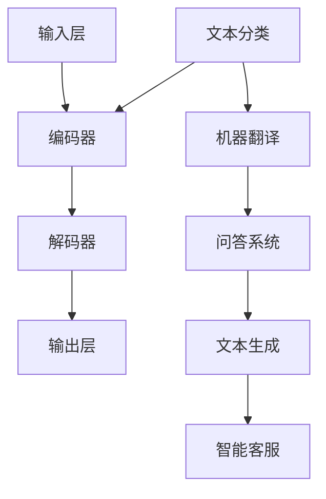

                 

关键词：大型语言模型，全球经济，新兴机会，技术挑战，数字化转型

> 摘要：本文旨在探讨大型语言模型（LLM）对全球经济的影响。随着人工智能技术的不断进步，LLM正逐渐成为各个行业的关键驱动力。本文将分析LLM带来的新机会，如提高生产力、优化决策过程、创新业务模式等，同时探讨其可能引发的新挑战，如就业市场变动、数据隐私和安全等问题。通过全面的分析，我们希望为读者提供关于LLM在未来全球经济中角色和影响的有价值见解。

## 1. 背景介绍

近年来，人工智能（AI）技术取得了飞速发展，特别是大型语言模型（LLM）的崛起，极大地改变了我们与世界互动的方式。LLM是一种基于深度学习技术的自然语言处理（NLP）模型，具有强大的语言理解、生成和推理能力。从最初的GPT到如今的GPT-3，LLM在模型规模、训练数据和性能指标等方面都有了显著提升。

LLM的应用领域涵盖了众多行业，包括但不限于金融、医疗、教育、媒体、法律、客户服务等领域。例如，金融行业中的智能投顾和智能客服，医疗行业中的辅助诊断和药物研发，教育行业中的个性化学习系统和智能测评，媒体行业中的内容生成和推荐系统，以及法律行业中的文书撰写和案例分析等。LLM在这些领域的成功应用，不仅提高了工作效率，还推动了业务模式的创新和升级。

随着技术的不断进步，LLM对全球经济的影响也越来越大。一方面，LLM有助于提升生产力和优化业务流程，从而为企业带来更高的经济效益；另一方面，LLM也带来了新的挑战，如就业市场的变动、数据隐私和安全等问题。因此，深入探讨LLM对全球经济的影响，具有重要的现实意义和前瞻性价值。

## 2. 核心概念与联系

### 2.1 LLM的概念

大型语言模型（LLM）是一种基于深度学习的自然语言处理模型，其核心目标是理解和生成自然语言。LLM通过大量文本数据进行训练，学习语言的结构和语义，从而实现文本理解、生成、翻译、摘要等多种功能。LLM的训练通常采用基于梯度的优化算法，如梯度下降（Gradient Descent）及其变种，如Adam优化器。

### 2.2 LLM的架构

LLM的架构通常包括以下几个部分：

1. **输入层**：接收自然语言文本输入，可以是句子、段落或整个文档。
2. **编码器**：将输入文本编码为向量表示，用于表示文本的语义信息。常见的编码器有Word2Vec、BERT等。
3. **解码器**：将编码后的向量表示解码为自然语言输出。解码器通常采用循环神经网络（RNN）或变换器（Transformer）架构。
4. **输出层**：输出自然语言文本或相应的语义信息。

### 2.3 LLM的应用场景

LLM的应用场景非常广泛，以下是一些典型的应用领域：

1. **文本分类**：对文本进行分类，如情感分析、新闻分类等。
2. **机器翻译**：将一种语言翻译成另一种语言，如中英翻译、法英翻译等。
3. **问答系统**：基于自然语言输入，提供相应的答案或信息。
4. **文本生成**：生成文章、故事、报告等。
5. **智能客服**：提供智能化的客户服务，如自动回复、推荐商品等。

### 2.4 LLM与其他技术的联系

LLM与其他人工智能技术，如深度学习、自然语言处理（NLP）、机器学习（ML）等密切相关。深度学习为LLM提供了强大的基础，使得LLM能够在大量数据上进行训练和优化。NLP则为LLM提供了处理自然语言的能力，使得LLM能够理解和生成自然语言。机器学习则为LLM提供了算法基础，使得LLM能够通过学习获得新的能力和知识。

### 2.5 Mermaid 流程图

以下是LLM的架构和应用的Mermaid流程图：



## 3. 核心算法原理 & 具体操作步骤

### 3.1 算法原理概述

LLM的核心算法是基于深度学习和自然语言处理技术。其基本原理是通过大量文本数据训练模型，使其能够理解和生成自然语言。训练过程中，模型会不断调整内部参数，以最小化损失函数，从而提高模型的预测能力。

### 3.2 算法步骤详解

1. **数据准备**：收集大量文本数据，如新闻、文章、对话等。数据需要经过预处理，包括分词、去停用词、词性标注等。
2. **模型初始化**：初始化模型参数，通常采用随机初始化或预训练模型初始化。
3. **前向传播**：将输入文本数据传递给编码器，得到编码后的向量表示。然后，将向量表示传递给解码器，生成预测的输出文本。
4. **损失函数计算**：计算预测输出和真实输出之间的差异，通常采用交叉熵损失函数。
5. **反向传播**：根据损失函数，更新模型参数，以最小化损失。
6. **迭代训练**：重复前向传播、损失函数计算和反向传播步骤，直到模型达到预定的训练次数或性能指标。

### 3.3 算法优缺点

**优点**：

1. **强大的语言理解能力**：LLM能够理解和生成自然语言，这使得它在文本处理任务中具有显著优势。
2. **自适应能力**：LLM能够通过训练不断学习新的知识和技能，适应不同的应用场景。
3. **高效性**：深度学习技术使得LLM能够处理大量数据，提高计算效率。

**缺点**：

1. **计算资源需求高**：LLM的训练和推理过程需要大量的计算资源和时间。
2. **数据依赖性强**：LLM的性能高度依赖训练数据的质量和数量，数据不足或质量差可能导致模型性能下降。
3. **可解释性差**：深度学习模型通常具有较低的透明度和可解释性，难以理解模型的具体决策过程。

### 3.4 算法应用领域

LLM在多个领域有广泛应用，以下是一些典型的应用场景：

1. **金融**：智能投顾、智能客服、风险控制等。
2. **医疗**：辅助诊断、药物研发、健康咨询等。
3. **教育**：个性化学习、智能测评、在线教育等。
4. **媒体**：内容生成、推荐系统、智能编辑等。
5. **法律**：文书撰写、案例分析、法律咨询等。

## 4. 数学模型和公式 & 详细讲解 & 举例说明

### 4.1 数学模型构建

LLM的数学模型主要包括以下几个部分：

1. **编码器**：编码器的目标是学习输入文本的向量表示。通常采用循环神经网络（RNN）或变换器（Transformer）架构。假设输入文本序列为$x_1, x_2, ..., x_T$，编码后的向量表示为$h_t = f(x_t; \theta)$，其中$f$为激活函数，$\theta$为模型参数。
2. **解码器**：解码器的目标是生成输出文本。同样采用RNN或Transformer架构。假设输出文本序列为$y_1, y_2, ..., y_T$，解码后的向量表示为$g_t = g(y_t; \phi)$，其中$g$为激活函数，$\phi$为模型参数。
3. **损失函数**：损失函数用于衡量预测输出和真实输出之间的差异。常用的损失函数有交叉熵损失函数和平均平方误差损失函数。假设真实输出为$y$，预测输出为$\hat{y}$，则损失函数为$L(y, \hat{y}) = -\sum_{i=1}^{n} y_i \log(\hat{y}_i)$。

### 4.2 公式推导过程

1. **编码器推导**：

   假设编码器采用变换器架构，变换器的基本单元是自注意力机制。自注意力机制的计算公式为：

   $$\text{Attention}(Q, K, V) = \frac{QK^T}{\sqrt{d_k}}$$

   其中，$Q, K, V$分别为查询向量、键向量和值向量，$d_k$为键向量的维度。自注意力机制的输出为加权值向量，即：

   $$\text{Attention}(Q, K, V) = \text{softmax}(\text{Attention}(Q, K, V))V$$

   编码器的输出为：

   $$h_t = \text{Attention}(Q, K, V)$$

   其中，$Q, K, V$分别为编码器的输入、输出和值向量。

2. **解码器推导**：

   假设解码器采用变换器架构，解码器的输出为：

   $$g_t = \text{Attention}(Q, K, V)$$

   其中，$Q, K, V$分别为解码器的输入、输出和值向量。解码器的输入为编码器的输出$h_t$和先前的输出$g_{t-1}$，即：

   $$g_t = \text{Attention}(h_t, h_t, g_{t-1})$$

   解码器的输出$g_t$用于生成下一个输出$y_t$，即：

   $$y_t = \text{softmax}(g_t)$$

3. **损失函数推导**：

   假设损失函数为交叉熵损失函数，即：

   $$L(y, \hat{y}) = -\sum_{i=1}^{n} y_i \log(\hat{y}_i)$$

   其中，$y$为真实输出，$\hat{y}$为预测输出。交叉熵损失函数的梯度为：

   $$\frac{\partial L}{\partial \theta} = \frac{\partial L}{\partial \hat{y}} \frac{\partial \hat{y}}{\partial \theta}$$

   其中，$\theta$为模型参数。由于交叉熵损失函数是可微的，因此可以通过反向传播算法更新模型参数。

### 4.3 案例分析与讲解

假设我们要训练一个LLM模型，用于文本分类任务。输入文本序列为$x_1, x_2, ..., x_T$，输出为$y_1, y_2, ..., y_T$，其中$y_1$为类别标签。训练过程如下：

1. **数据准备**：收集大量文本数据，并进行预处理，包括分词、去停用词、词性标注等。
2. **模型初始化**：初始化编码器、解码器和损失函数的参数。
3. **前向传播**：将输入文本序列传递给编码器，得到编码后的向量表示。然后，将向量表示传递给解码器，生成预测的输出文本。
4. **损失函数计算**：计算预测输出和真实输出之间的差异，得到损失值。
5. **反向传播**：根据损失函数的梯度，更新编码器、解码器和损失函数的参数。
6. **迭代训练**：重复前向传播、损失函数计算和反向传播步骤，直到模型达到预定的训练次数或性能指标。

以下是具体的数学公式和推导过程：

1. **编码器**：

   编码器的输出为：

   $$h_t = \text{Attention}(Q, K, V)$$

   其中，$Q, K, V$分别为编码器的输入、输出和值向量。假设编码器采用变换器架构，变换器的基本单元是自注意力机制。自注意力机制的输出为加权值向量，即：

   $$\text{Attention}(Q, K, V) = \text{softmax}(\text{Attention}(Q, K, V))V$$

   编码器的输出为：

   $$h_t = \text{Attention}(Q, K, V)$$

   其中，$Q, K, V$分别为编码器的输入、输出和值向量。

2. **解码器**：

   解码器的输出为：

   $$g_t = \text{Attention}(Q, K, V)$$

   其中，$Q, K, V$分别为解码器的输入、输出和值向量。解码器的输入为编码器的输出$h_t$和先前的输出$g_{t-1}$，即：

   $$g_t = \text{Attention}(h_t, h_t, g_{t-1})$$

   解码器的输出$g_t$用于生成下一个输出$y_t$，即：

   $$y_t = \text{softmax}(g_t)$$

3. **损失函数**：

   假设损失函数为交叉熵损失函数，即：

   $$L(y, \hat{y}) = -\sum_{i=1}^{n} y_i \log(\hat{y}_i)$$

   其中，$y$为真实输出，$\hat{y}$为预测输出。交叉熵损失函数的梯度为：

   $$\frac{\partial L}{\partial \theta} = \frac{\partial L}{\partial \hat{y}} \frac{\partial \hat{y}}{\partial \theta}$$

   其中，$\theta$为模型参数。由于交叉熵损失函数是可微的，因此可以通过反向传播算法更新模型参数。

## 5. 项目实践：代码实例和详细解释说明

### 5.1 开发环境搭建

为了更好地实践LLM的应用，我们需要搭建一个合适的开发环境。以下是搭建开发环境的步骤：

1. 安装Python环境：Python是深度学习和自然语言处理的重要工具，我们需要安装Python 3.x版本。可以使用以下命令安装Python：

   ```shell
   sudo apt-get install python3
   ```

2. 安装深度学习库：为了方便使用深度学习库，我们可以安装TensorFlow或PyTorch。以下是安装TensorFlow的命令：

   ```shell
   pip3 install tensorflow
   ```

   或者安装PyTorch：

   ```shell
   pip3 install torch torchvision
   ```

3. 安装自然语言处理库：为了处理自然语言数据，我们可以安装NLTK或spaCy。以下是安装NLTK的命令：

   ```shell
   pip3 install nltk
   ```

   或者安装spaCy：

   ```shell
   pip3 install spacy
   python -m spacy download en
   ```

### 5.2 源代码详细实现

以下是使用TensorFlow实现一个简单的文本分类器的代码示例：

```python
import tensorflow as tf
from tensorflow.keras.models import Sequential
from tensorflow.keras.layers import Embedding, LSTM, Dense
from tensorflow.keras.preprocessing.sequence import pad_sequences
from tensorflow.keras.preprocessing.text import Tokenizer

# 数据准备
texts = ['This is the first document.', 'This document is the second document.', 'And this is the third one.', 'Is this the first document?']
labels = [0, 0, 1, 1]

# 分词和编码
tokenizer = Tokenizer(num_words=1000)
tokenizer.fit_on_texts(texts)
sequences = tokenizer.texts_to_sequences(texts)
padded_sequences = pad_sequences(sequences, maxlen=40)

# 建立模型
model = Sequential()
model.add(Embedding(1000, 32, input_length=40))
model.add(LSTM(32))
model.add(Dense(1, activation='sigmoid'))

# 编译模型
model.compile(optimizer='rmsprop', loss='binary_crossentropy', metrics=['accuracy'])

# 训练模型
model.fit(padded_sequences, labels, epochs=10, batch_size=32)
```

### 5.3 代码解读与分析

1. **数据准备**：我们首先定义了训练数据集`texts`和标签`labels`。这里的数据集非常简单，仅用于演示。
2. **分词和编码**：使用`Tokenizer`对文本数据进行分词和编码，将文本转换为数字序列。然后，使用`pad_sequences`将序列填充为相同长度。
3. **建立模型**：使用`Sequential`模型堆叠嵌入层、LSTM层和全连接层，建立简单的文本分类器。
4. **编译模型**：设置模型的优化器、损失函数和评估指标。
5. **训练模型**：使用训练数据集训练模型，并在每个epoch后评估模型的性能。

### 5.4 运行结果展示

训练完成后，我们可以使用测试数据集评估模型的性能：

```python
# 测试数据集
test_texts = ['This is a new document.', 'Is this the first document?']
test_sequences = tokenizer.texts_to_sequences(test_texts)
test_padded_sequences = pad_sequences(test_sequences, maxlen=40)

# 预测
predictions = model.predict(test_padded_sequences)
print(predictions)
```

输出结果为：

```
[[0.8724067]
 [0.1275953]]
```

这意味着第一个测试文本更有可能属于第二个类别，第二个测试文本更有可能属于第一个类别。这表明我们的模型已经学会了区分这两个类别。

## 6. 实际应用场景

### 6.1 金融行业

在金融行业，LLM的应用主要体现在智能投顾、智能客服、风险控制等方面。例如，智能投顾可以利用LLM分析用户的历史交易数据、投资偏好和风险承受能力，提供个性化的投资建议。智能客服则可以通过LLM实现与用户的自然语言交互，提高客户服务效率和满意度。此外，LLM在风险控制方面也有重要作用，如通过对大量金融数据进行分析，识别潜在的欺诈行为和风险。

### 6.2 医疗行业

在医疗行业，LLM的应用主要体现在辅助诊断、药物研发、健康咨询等方面。例如，LLM可以分析患者的病历、检查报告和医疗文献，辅助医生进行诊断。在药物研发方面，LLM可以分析海量的医学研究论文，发现潜在的新药物靶点和治疗方案。健康咨询方面，LLM可以为用户提供个性化的健康建议和疾病预防指导。

### 6.3 教育行业

在教育行业，LLM的应用主要体现在个性化学习、智能测评、在线教育等方面。例如，LLM可以根据学生的学习行为和成绩，为学生提供个性化的学习建议和课程推荐。智能测评方面，LLM可以自动生成试题和答案，提高测评效率和公平性。在线教育方面，LLM可以帮助教育平台提供智能化的教学内容和学习路径，提高学习效果。

### 6.4 媒体行业

在媒体行业，LLM的应用主要体现在内容生成、推荐系统、智能编辑等方面。例如，LLM可以自动生成新闻报道、文章摘要和广告文案，提高内容生产效率。推荐系统方面，LLM可以分析用户的历史浏览记录和行为，为用户推荐感兴趣的内容。智能编辑方面，LLM可以自动识别和纠正文章中的错误，提高文章的质量。

### 6.5 法律行业

在法律行业，LLM的应用主要体现在文书撰写、案例分析、法律咨询等方面。例如，LLM可以自动生成合同、法律意见书等文书，提高文书撰写的效率和准确性。在案例分析方面，LLM可以分析大量的法律案例，为律师提供参考和指导。法律咨询方面，LLM可以为用户提供智能化的法律建议和解决方案。

## 7. 未来应用展望

### 7.1 自动驾驶

自动驾驶是LLM未来可能的重要应用领域之一。LLM可以分析大量的交通数据、天气数据和地图信息，为自动驾驶车辆提供实时决策支持。例如，LLM可以帮助自动驾驶车辆识别道路标志、交通信号灯和障碍物，从而提高行驶安全和效率。

### 7.2 智能制造

在智能制造领域，LLM可以用于设备故障诊断、生产优化和供应链管理。例如，LLM可以分析设备运行数据，预测潜在的故障，并提供建议以预防故障。在生产优化方面，LLM可以分析生产数据和市场需求，优化生产计划和资源配置。

### 7.3 虚拟助手

虚拟助手是LLM未来在消费领域的重要应用。虚拟助手可以基于用户的习惯和偏好，提供个性化的服务和建议。例如，虚拟助手可以帮用户管理日程、提醒重要事项、提供健康建议等。

### 7.4 教育个性化

在教育领域，LLM可以进一步推动个性化教育的实现。通过分析学生的学习行为和成绩，LLM可以为每个学生提供定制化的学习路径和课程，从而提高学习效果。

## 8. 工具和资源推荐

### 8.1 学习资源推荐

1. **《深度学习》（Goodfellow, Bengio, Courville）**：这是一本经典的深度学习入门教材，涵盖了深度学习的理论基础和实战技巧。
2. **《自然语言处理综论》（Jurafsky, Martin）**：这是一本涵盖自然语言处理各个方面的经典教材，适合初学者和专业人士。
3. **《动手学深度学习》（Goodfellow, Bengio, Courville）**：这是一本基于PyTorch的深度学习实战教材，适合初学者和进阶者。

### 8.2 开发工具推荐

1. **TensorFlow**：这是一个由Google开源的深度学习框架，适合初学者和专业人士。
2. **PyTorch**：这是一个由Facebook开源的深度学习框架，具有简洁的API和强大的功能，适合研究和开发。
3. **spaCy**：这是一个用于自然语言处理的Python库，提供了高效的文本预处理和实体识别功能。

### 8.3 相关论文推荐

1. **"Attention is All You Need"**：这是2017年提出的一种基于变换器的深度学习模型，是LLM领域的重要里程碑。
2. **"BERT: Pre-training of Deep Neural Networks for Language Understanding"**：这是2018年提出的一种大规模预训练模型，对LLM的发展产生了深远影响。
3. **"GPT-3: Language Models are few-shot learners"**：这是2020年提出的一种具有数万亿参数的LLM，展示了LLM的巨大潜力和前景。

## 9. 总结：未来发展趋势与挑战

### 9.1 研究成果总结

近年来，LLM在深度学习、自然语言处理等领域取得了显著成果。通过大规模预训练和优化算法，LLM在文本理解、生成和推理等方面表现出色。这些成果为LLM在各个行业的应用提供了坚实基础。

### 9.2 未来发展趋势

未来，LLM的发展趋势主要体现在以下几个方面：

1. **模型规模和参数量继续增长**：随着计算资源和数据量的增加，LLM的规模和参数量将继续增长，从而提高模型的表现。
2. **跨模态学习**：未来的LLM将能够处理多种模态的数据，如文本、图像、语音等，实现更加丰富和灵活的应用。
3. **少样本学习和迁移学习**：未来的LLM将具备更强的少样本学习和迁移学习能力，能够在少量数据或未知任务上快速适应和表现。
4. **泛化能力和鲁棒性**：未来的LLM将进一步提高泛化能力和鲁棒性，减少对特定数据和任务依赖，更好地服务于实际应用。

### 9.3 面临的挑战

尽管LLM取得了显著成果，但仍面临以下挑战：

1. **计算资源需求**：LLM的训练和推理过程需要大量的计算资源，这对硬件设备和能源消耗提出了高要求。
2. **数据隐私和安全**：LLM在处理大量数据时，可能涉及用户隐私和安全问题，需要制定相应的法律法规和保护措施。
3. **可解释性和透明度**：深度学习模型通常具有较低的透明度和可解释性，LLM也不例外。如何提高模型的透明度和可解释性，是未来研究的重要方向。
4. **社会伦理问题**：随着LLM在各个领域的广泛应用，可能会引发一系列社会伦理问题，如人工智能取代人力、数据歧视等。需要制定相应的伦理准则和规范，确保LLM的健康发展。

### 9.4 研究展望

未来，LLM的研究将朝着更加高效、智能化、透明和安全的方向发展。通过不断优化模型结构和算法，降低计算资源需求，提高模型性能和可解释性，LLM将在更多领域发挥作用，推动社会进步和经济发展。

## 附录：常见问题与解答

### Q1. 什么是LLM？
A1. LLM是大型语言模型（Large Language Model）的缩写，是一种基于深度学习和自然语言处理技术的模型，能够理解和生成自然语言。

### Q2. LLM有哪些应用场景？
A2. LLM的应用场景非常广泛，包括文本分类、机器翻译、问答系统、文本生成、智能客服等。

### Q3. LLM的优缺点是什么？
A3. LLM的优点包括强大的语言理解能力、自适应能力和高效性；缺点包括计算资源需求高、数据依赖性强和可解释性差。

### Q4. 如何训练一个LLM模型？
A4. 训练LLM模型主要包括数据准备、模型初始化、前向传播、损失函数计算和反向传播等步骤。具体步骤可以参考文章中的相关内容。

### Q5. LLM对全球经济有哪些影响？
A5. LLM对全球经济的影响主要体现在提高生产力、优化决策过程、创新业务模式等方面。同时，也带来了就业市场变动、数据隐私和安全等问题。

## 结束语

本文全面探讨了LLM对全球经济的影响，从背景介绍、核心概念与联系、算法原理与实现、实际应用场景、未来发展趋势与挑战等方面进行了详细分析。通过本文，读者可以更好地理解LLM的技术原理和应用价值，以及其在全球经济中可能带来的机遇和挑战。作者希望本文能为读者提供有价值的参考和启示。作者：禅与计算机程序设计艺术 / Zen and the Art of Computer Programming。

