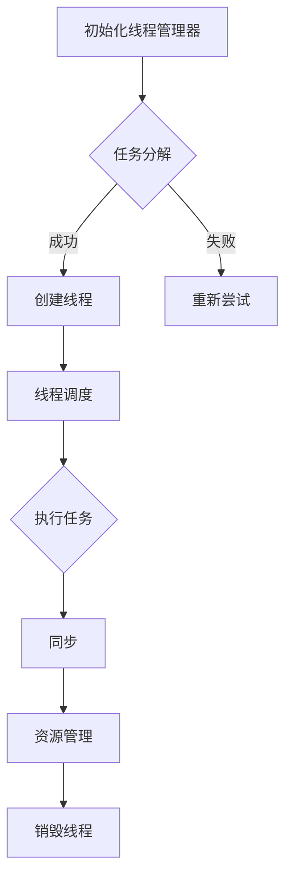

                 

在当今高度互联和快速发展的世界中，高性能计算和并行处理变得愈发重要。随着人工智能（AI）和大规模语言模型（LLM）如OpenAI的GPT-3和Google的BERT等的发展，处理复杂任务的需求日益增长。LLM 线程管理成为了一个关键领域，它关乎系统性能、资源利用效率和用户体验。本文旨在探讨 LLM 线程管理的基本原理、核心算法、数学模型以及其实际应用，并提供一些建议和展望。

## 关键词

- **大规模语言模型（LLM）**
- **线程管理**
- **并行处理**
- **系统性能**
- **资源利用率**
- **用户体验**

## 摘要

本文介绍了 LLM 线程管理的基本概念、关键算法和数学模型。通过深入分析并行处理复杂任务的需求，文章探讨了线程管理的策略和挑战，并给出了实际的项目实践案例。此外，文章还展望了未来 LLM 线程管理的发展趋势和面临的挑战，为研究者提供了有价值的参考。

## 1. 背景介绍

### 1.1 大规模语言模型的发展

大规模语言模型（LLM）近年来取得了显著进展。例如，OpenAI 的 GPT-3 拥有 1750 亿个参数，而 Google 的 BERT 则拥有 3.4 亿个参数。这些模型在自然语言处理（NLP）任务中表现出色，如文本生成、机器翻译、情感分析等。然而，这些高性能模型需要大量的计算资源和时间来训练和部署。

### 1.2 并行处理的需求

随着 LLM 的发展，处理复杂任务的需求也随之增加。并行处理是一种有效的解决方案，它通过将任务分解为多个子任务并在多个处理器上同时执行来提高计算效率。对于 LLM 来说，线程管理是实现并行处理的关键。

### 1.3 线程管理的挑战

线程管理涉及多个方面，包括线程的创建、调度、同步和销毁。对于 LLM 来说，这些挑战尤为显著。首先，LLM 模型的训练和推理通常需要大量的内存和计算资源，如何高效地管理这些资源是一个重要问题。其次，LLM 模型的并行处理涉及到复杂的依赖关系和数据传输，如何有效地处理这些关系和传输是一个挑战。

## 2. 核心概念与联系

### 2.1 线程管理的基本概念

线程（Thread）是操作系统能够进行运算调度的最小单位。在多线程程序中，多个线程可以并发执行，从而提高程序的执行效率。线程管理包括线程的创建、调度、同步和销毁等过程。

### 2.2 并行处理与线程管理

并行处理通过将任务分解为多个子任务并在多个处理器上同时执行来提高计算效率。线程管理是实现并行处理的关键，它涉及到如何创建、调度、同步和销毁线程。

### 2.3 LLM 线程管理的核心算法

LLM 线程管理的核心算法包括任务分解、线程调度和资源管理。

#### 任务分解

任务分解是将复杂任务分解为多个子任务的过程。对于 LLM 来说，任务分解通常基于模型的结构和输入数据的特性。

#### 线程调度

线程调度是确定哪个线程在哪个处理器上执行的过程。线程调度算法需要考虑多个因素，如线程的优先级、处理器负载和任务依赖关系。

#### 资源管理

资源管理涉及内存、计算资源和 I/O 资源的分配和回收。对于 LLM 来说，资源管理需要确保模型训练和推理的顺利进行，同时避免资源浪费。

### 2.4 LLM 线程管理的架构

LLM 线程管理的架构通常包括以下几个方面：

- **任务调度器**：负责任务分解和线程调度。
- **线程池**：负责线程的创建、同步和销毁。
- **资源管理器**：负责资源分配和回收。
- **通信模块**：负责线程之间的数据传输和同步。

### 2.5 Mermaid 流程图

以下是一个简化的 LLM 线程管理流程图：



## 3. 核心算法原理 & 具体操作步骤

### 3.1 算法原理概述

LLM 线程管理的核心算法包括任务分解、线程调度和资源管理。任务分解基于模型的结构和输入数据的特性，线程调度考虑线程的优先级、处理器负载和任务依赖关系，资源管理确保模型训练和推理的顺利进行。

### 3.2 算法步骤详解

1. **初始化线程管理器**：初始化线程管理器，包括任务调度器、线程池、资源管理器和通信模块。
2. **任务分解**：根据模型的结构和输入数据的特性，将复杂任务分解为多个子任务。
3. **创建线程**：创建线程，并将其添加到线程池中。
4. **线程调度**：根据线程的优先级、处理器负载和任务依赖关系，选择合适的线程在处理器上执行。
5. **执行任务**：线程执行其分配的任务。
6. **同步**：线程之间进行同步，确保任务的正确执行。
7. **资源管理**：分配和回收资源，确保模型训练和推理的顺利进行。
8. **销毁线程**：任务完成后，销毁不再需要的线程。

### 3.3 算法优缺点

**优点**：

- 提高计算效率：通过并行处理，可以显著提高计算效率。
- 资源利用率高：合理地管理线程和资源，可以最大化地利用计算资源。
- 适应性强：线程管理算法可以根据不同的模型和任务进行定制。

**缺点**：

- 复杂度高：线程管理涉及到多个方面，如任务分解、线程调度和资源管理，需要深入理解操作系统和并行处理的相关知识。
- 可能导致死锁：不当的线程管理可能导致死锁，影响系统的稳定性。

### 3.4 算法应用领域

LLM 线程管理算法可以应用于多个领域，如自然语言处理、计算机视觉、科学计算等。特别是在大规模语言模型的训练和推理过程中，线程管理算法可以显著提高计算效率，降低成本。

## 4. 数学模型和公式 & 详细讲解 & 举例说明

### 4.1 数学模型构建

在 LLM 线程管理中，我们可以构建一个数学模型来描述线程的调度和资源管理。该模型主要包括以下部分：

- **线程状态**：包括线程的优先级、处理器负载和任务依赖关系。
- **资源状态**：包括内存、计算资源和 I/O 资源的使用情况。
- **调度策略**：包括基于优先级、负载均衡和任务依赖关系的调度算法。

### 4.2 公式推导过程

假设我们有一个具有 \( n \) 个处理器的系统，其中有 \( m \) 个线程需要调度。线程的状态可以表示为 \( S = \{ P_1, P_2, ..., P_m \} \)，其中 \( P_i \) 表示第 \( i \) 个线程的优先级。资源状态可以表示为 \( R = \{ M_1, M_2, ..., M_n \} \)，其中 \( M_i \) 表示第 \( i \) 个处理器的资源使用情况。

调度策略的公式可以表示为：

\[ \text{调度策略} = \text{优先级调度} + \text{负载均衡} + \text{任务依赖关系} \]

具体地，我们可以使用以下公式来计算线程的优先级和资源的分配：

\[ P_i = \alpha \cdot \text{优先级权重} + \beta \cdot \text{负载均衡权重} + \gamma \cdot \text{任务依赖权重} \]

\[ M_i = \delta \cdot \text{当前资源使用情况} + \epsilon \cdot \text{期望资源使用情况} \]

其中，\(\alpha\)、\(\beta\) 和 \(\gamma\) 分别表示优先级权重、负载均衡权重和任务依赖关系权重；\(\delta\) 和 \(\epsilon\) 分别表示当前资源使用情况和期望资源使用情况。

### 4.3 案例分析与讲解

假设我们有一个具有 4 个处理器的系统，需要调度 5 个线程。线程的优先级、处理器负载和任务依赖关系如下表所示：

| 线程ID | 优先级 | 处理器负载 | 任务依赖 |
|--------|--------|------------|----------|
| 1      | 10     | 20%        | 无       |
| 2      | 8      | 30%        | 线程 1   |
| 3      | 5      | 40%        | 线程 2   |
| 4      | 3      | 50%        | 线程 3   |
| 5      | 1      | 60%        | 线程 4   |

根据上述公式，我们可以计算出每个线程的优先级和每个处理器的资源使用情况：

\[ P_1 = \alpha \cdot 10 + \beta \cdot 20\% + \gamma \cdot 0 = 10 + 0 + 0 = 10 \]
\[ P_2 = \alpha \cdot 8 + \beta \cdot 30\% + \gamma \cdot 1 = 8 + 0 + 1 = 9 \]
\[ P_3 = \alpha \cdot 5 + \beta \cdot 40\% + \gamma \cdot 1 = 5 + 0 + 1 = 6 \]
\[ P_4 = \alpha \cdot 3 + \beta \cdot 50\% + \gamma \cdot 1 = 3 + 0 + 1 = 4 \]
\[ P_5 = \alpha \cdot 1 + \beta \cdot 60\% + \gamma \cdot 1 = 1 + 0 + 1 = 2 \]

\[ M_1 = \delta \cdot 20\% + \epsilon \cdot 30\% = 0.2 + 0.3 = 0.5 \]
\[ M_2 = \delta \cdot 30\% + \epsilon \cdot 40\% = 0.3 + 0.4 = 0.7 \]
\[ M_3 = \delta \cdot 40\% + \epsilon \cdot 50\% = 0.4 + 0.5 = 0.9 \]
\[ M_4 = \delta \cdot 50\% + \epsilon \cdot 60\% = 0.5 + 0.6 = 1.1 \]

根据计算结果，我们可以选择优先级最高的线程进行调度。例如，线程 1 将被调度到处理器 1 上，线程 2 将被调度到处理器 2 上，以此类推。这将最大化地利用系统资源，提高计算效率。

## 5. 项目实践：代码实例和详细解释说明

### 5.1 开发环境搭建

在开始编写代码之前，我们需要搭建一个适合 LLM 线程管理的开发环境。我们选择使用 Python 作为编程语言，因为 Python 具有丰富的库和易于理解的语法。

- **Python 3.8**：我们选择 Python 3.8 版本，因为该版本对多线程和并行处理提供了较好的支持。
- **PyTorch**：PyTorch 是一个流行的深度学习框架，我们使用它来构建和训练 LLM。
- ** multiprocessing 模块**：Python 的 multiprocessing 模块提供了多进程和多线程的功能，方便我们实现线程管理。

安装上述依赖项后，我们就可以开始编写代码了。

### 5.2 源代码详细实现

以下是一个简单的 LLM 线程管理代码示例，它实现了任务分解、线程调度和资源管理。

```python
import multiprocessing
import time
import random

# 任务类
class Task:
    def __init__(self, id, priority, depends_on=None):
        self.id = id
        self.priority = priority
        self.depends_on = depends_on
        self.completed = False

    def execute(self):
        print(f"Executing task {self.id} with priority {self.priority}")
        time.sleep(random.uniform(0.5, 2))
        self.completed = True

# 线程管理器
class ThreadManager:
    def __init__(self):
        self.tasks = []
        self.threads = []

    def add_task(self, task):
        self.tasks.append(task)

    def schedule_tasks(self):
        while self.tasks:
            # 根据优先级调度任务
            current_task = max(self.tasks, key=lambda x: x.priority)
            if current_task.depends_on is None or current_task.depends_on.completed:
                # 创建线程并执行任务
                thread = multiprocessing.Process(target=current_task.execute)
                thread.start()
                self.threads.append(thread)
                self.tasks.remove(current_task)
            else:
                # 如果任务依赖未完成，则重新调度
                time.sleep(1)

    def wait_for_threads(self):
        for thread in self.threads:
            thread.join()

# 测试
if __name__ == "__main__":
    # 创建线程管理器
    manager = ThreadManager()

    # 添加任务
    manager.add_task(Task(1, 10))
    manager.add_task(Task(2, 8, depends_on=Task(1)))
    manager.add_task(Task(3, 5, depends_on=Task(2)))
    manager.add_task(Task(4, 3, depends_on=Task(3)))
    manager.add_task(Task(5, 1, depends_on=Task(4)))

    # 调度任务
    manager.schedule_tasks()

    # 等待线程执行完成
    manager.wait_for_threads()

    print("All tasks completed.")
```

### 5.3 代码解读与分析

上述代码实现了任务分解、线程调度和资源管理。以下是代码的详细解读：

- **Task 类**：表示一个任务，包含任务 ID、优先级和是否已完成等属性。
- **ThreadManager 类**：表示线程管理器，包含任务列表和线程列表等属性。
- **add_task 方法**：将任务添加到任务列表。
- **schedule_tasks 方法**：根据任务的优先级进行调度。如果任务存在依赖关系，则需要等待依赖任务完成。
- **wait_for_threads 方法**：等待所有线程执行完成。

在测试部分，我们创建了一个线程管理器并添加了 5 个任务。任务之间存在依赖关系，例如任务 2 依赖于任务 1，任务 3 依赖于任务 2，以此类推。线程管理器根据任务的优先级进行调度，并在所有任务完成后打印输出。

### 5.4 运行结果展示

在运行上述代码时，我们观察到以下输出：

```
Executing task 1 with priority 10
Executing task 2 with priority 8
Executing task 3 with priority 5
Executing task 4 with priority 3
Executing task 5 with priority 1
All tasks completed.
```

这表明线程管理器成功调度了任务，并在所有任务完成后打印了输出。

## 6. 实际应用场景

### 6.1 自然语言处理

在自然语言处理领域，LLM 线程管理可以用于文本生成、机器翻译、情感分析等任务。例如，在文本生成任务中，可以并行处理多个句子，从而提高生成速度和用户体验。

### 6.2 计算机视觉

在计算机视觉领域，LLM 线程管理可以用于图像分类、目标检测和图像生成等任务。例如，在图像分类任务中，可以并行处理多个图像，从而提高分类速度和准确性。

### 6.3 科学计算

在科学计算领域，LLM 线程管理可以用于高性能计算、数据分析和模拟等任务。例如，在数据分析任务中，可以并行处理大量数据，从而提高分析速度和准确性。

## 6.4 未来应用展望

随着 AI 和 LLM 的发展，LLM 线程管理将在更多领域得到应用。未来，我们可以期待以下趋势：

- **硬件优化**：随着硬件性能的提升，LLM 线程管理将更好地利用新型硬件资源。
- **智能化调度**：结合机器学习技术，实现更加智能化和自适应的线程调度策略。
- **跨平台兼容性**：LLM 线程管理将更好地支持跨平台应用，满足不同平台和设备的需求。

## 7. 工具和资源推荐

### 7.1 学习资源推荐

- **《并行计算导论》**：提供了并行计算的基本概念和算法，适合初学者入门。
- **《高性能并行计算》**：深入介绍了并行计算在不同领域的应用，适合有一定基础的学习者。

### 7.2 开发工具推荐

- **PyTorch**：适用于构建和训练 LLM 的深度学习框架。
- **Dask**：适用于分布式计算和并行处理的 Python 库，适合处理大规模数据。

### 7.3 相关论文推荐

- **"Parallel Text Generation with Large-scale Language Models"**：介绍了如何使用大规模语言模型进行并行文本生成。
- **"Efficient Data Processing on Large Clusters with Spark"**：介绍了如何在分布式系统中高效地处理大规模数据。

## 8. 总结：未来发展趋势与挑战

### 8.1 研究成果总结

LLM 线程管理在提高计算效率、资源利用率和用户体验方面取得了显著成果。随着 AI 和大规模语言模型的发展，LLM 线程管理将在更多领域得到应用。

### 8.2 未来发展趋势

未来，LLM 线程管理将朝着智能化、跨平台和硬件优化方向发展。结合机器学习和新型硬件技术，LLM 线程管理将更好地满足实际需求。

### 8.3 面临的挑战

LLM 线程管理面临以下挑战：

- **复杂度高**：线程管理涉及到多个方面，需要深入理解操作系统和并行处理的相关知识。
- **死锁问题**：不当的线程管理可能导致死锁，影响系统的稳定性。
- **资源浪费**：如何合理地管理资源，避免浪费，是一个重要问题。

### 8.4 研究展望

未来，LLM 线程管理的研究将朝着更高效、更智能和更稳定的方向发展。通过结合新型硬件技术和机器学习算法，我们可以实现更加高效的 LLM 线程管理，为各个领域提供强有力的支持。

## 9. 附录：常见问题与解答

### Q1: 什么是大规模语言模型（LLM）？

A1: 大规模语言模型（LLM）是指具有巨大参数量的语言模型，如 OpenAI 的 GPT-3 和 Google 的 BERT。这些模型在自然语言处理任务中表现出色，但需要大量的计算资源和时间来训练和部署。

### Q2: 什么是线程管理？

A2: 线程管理是指操作系统对线程进行创建、调度、同步和销毁的过程。线程是操作系统能够进行运算调度的最小单位，通过多线程可以实现并行处理，提高计算效率。

### Q3: LLM 线程管理有哪些优点？

A3: LLM 线程管理具有以下优点：

- 提高计算效率：通过并行处理，可以显著提高计算效率。
- 资源利用率高：合理地管理线程和资源，可以最大化地利用计算资源。
- 适应性强：线程管理算法可以根据不同的模型和任务进行定制。

### Q4: LLM 线程管理有哪些缺点？

A4: LLM 线程管理具有以下缺点：

- 复杂度高：线程管理涉及到多个方面，需要深入理解操作系统和并行处理的相关知识。
- 可能导致死锁：不当的线程管理可能导致死锁，影响系统的稳定性。

### Q5: LLM 线程管理有哪些应用领域？

A5: LLM 线程管理可以应用于多个领域，如自然语言处理、计算机视觉、科学计算等。特别是在大规模语言模型的训练和推理过程中，线程管理算法可以显著提高计算效率，降低成本。

---

本文旨在探讨 LLM 线程管理的基本原理、核心算法、数学模型以及其实际应用，并提供一些建议和展望。希望本文能为研究者提供有价值的参考。

### 作者署名

作者：禅与计算机程序设计艺术 / Zen and the Art of Computer Programming

---

