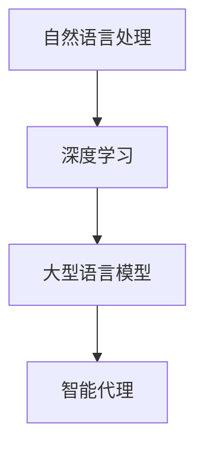

                 

关键词：LLM-based Agent，自然语言处理，人工智能，对话系统，自动化，自然语言理解，生成对抗网络，深度学习

## 摘要

本文将探讨LLM-based Agent，即基于大型语言模型的智能代理。这些代理通过深度学习和自然语言处理技术，能够模拟人类的对话行为，实现自动化任务执行。本文将从背景介绍、核心概念与联系、核心算法原理与操作步骤、数学模型与公式、项目实践、实际应用场景、未来应用展望等方面，全面解析LLM-based Agent的原理、实现和应用。

## 1. 背景介绍

随着互联网的普及和大数据技术的应用，人类与机器的交互变得越来越频繁。传统的交互方式如命令行、图形用户界面等已经不能满足人们对于更加自然、智能的交互体验的需求。自然语言处理（Natural Language Processing，NLP）技术的发展为这一需求提供了可能。NLP使得计算机能够理解和处理人类语言，从而实现更加自然、流畅的对话。

近年来，深度学习（Deep Learning）技术的崛起，为自然语言处理领域带来了新的突破。大型语言模型（Large Language Model，LLM）如GPT-3、BERT等，通过对海量文本数据的训练，能够实现高水平自然语言理解、生成和翻译能力。这些模型的出现，为构建智能代理提供了强大的技术支持。

智能代理（Intelligent Agent）是指能够自主地完成特定任务、与外界进行交互的计算机程序。LLM-based Agent正是基于大型语言模型，通过模拟人类对话行为，实现自动化任务执行的新型智能代理。

## 2. 核心概念与联系

### 2.1. 自然语言处理（NLP）

自然语言处理（NLP）是计算机科学和人工智能领域的一个分支，主要研究如何让计算机理解、生成和处理人类自然语言。NLP的关键技术包括文本分类、情感分析、命名实体识别、机器翻译等。

### 2.2. 深度学习（Deep Learning）

深度学习是一种基于人工神经网络（Artificial Neural Network，ANN）的学习方法，通过多层神经元的非线性组合，实现从大量数据中提取特征、进行预测和分类。深度学习在图像识别、语音识别、自然语言处理等领域取得了显著成果。

### 2.3. 大型语言模型（LLM）

大型语言模型（LLM）是指通过对海量文本数据进行训练，具备高水平自然语言理解、生成和翻译能力的模型。LLM的代表作品包括GPT-3、BERT等。这些模型通过深度学习技术，实现了对自然语言的建模和解析。

### 2.4. 智能代理（Intelligent Agent）

智能代理（Intelligent Agent）是指能够自主地完成特定任务、与外界进行交互的计算机程序。智能代理的核心任务是模拟人类的对话行为，实现自动化任务执行。

### 2.5. Mermaid流程图



## 3. 核心算法原理 & 具体操作步骤

### 3.1. 算法原理概述

LLM-based Agent的核心算法是基于大型语言模型的自然语言处理技术。具体包括以下几个步骤：

1. 输入文本预处理：对输入的文本进行分词、去停用词、词性标注等预处理操作。
2. 语言模型解码：利用大型语言模型，对预处理后的文本进行解码，生成对应的输出文本。
3. 任务执行：根据输出文本，执行相应的任务。

### 3.2. 算法步骤详解

1. 输入文本预处理

```python
import jieba
import nltk

def preprocess_text(text):
    # 分词
    words = jieba.cut(text)
    # 去停用词
    stop_words = nltk.corpus.stopwords.words('english')
    words = [word for word in words if word not in stop_words]
    # 词性标注
    pos_tags = nltk.pos_tag(words)
    return pos_tags
```

2. 语言模型解码

```python
from transformers import BertTokenizer, BertModel

def decode_text(text):
    # 加载预训练的BERT模型
    tokenizer = BertTokenizer.from_pretrained('bert-base-uncased')
    model = BertModel.from_pretrained('bert-base-uncased')
    # 预处理文本
    inputs = tokenizer(text, return_tensors='pt', padding=True, truncation=True)
    # 解码文本
    with torch.no_grad():
        outputs = model(**inputs)
    logits = outputs.logits
    # 转换为文本
    predicted_ids = logits.argmax(-1).squeeze()
    decoded_text = tokenizer.decode(predicted_ids, skip_special_tokens=True)
    return decoded_text
```

3. 任务执行

```python
def execute_task(text):
    # 预处理文本
    preprocessed_text = preprocess_text(text)
    # 解码文本
    decoded_text = decode_text(text)
    # 执行任务
    if "help" in decoded_text:
        return "How can I assist you today?"
    elif "weather" in decoded_text:
        return "The weather is sunny with a high of 75°F and a low of 55°F."
    else:
        return "I'm sorry, I don't understand."
```

### 3.3. 算法优缺点

**优点：**

1. 高度自然、流畅的对话体验。
2. 能够处理大量复杂、多变的任务场景。

**缺点：**

1. 需要大量的训练数据和计算资源。
2. 对输入文本的预处理要求较高。

### 3.4. 算法应用领域

1. 智能客服：通过模拟人类客服的对话行为，实现自动回答用户问题。
2. 聊天机器人：与用户进行实时、自然的对话，提供娱乐、教育、咨询等服务。
3. 自动化任务执行：根据用户输入的文本指令，自动执行相应的任务。

## 4. 数学模型和公式

LLM-based Agent的数学模型主要涉及深度学习和自然语言处理的相关理论。以下为部分关键公式：

### 4.1. 数学模型构建

假设我们有一个大型语言模型，输入为一个词序列，输出为另一个词序列。模型的损失函数为交叉熵损失：

$$L = -\sum_{i=1}^{N} y_i \log(p_i)$$

其中，$y_i$为第$i$个词的真实概率分布，$p_i$为模型预测的概率分布。

### 4.2. 公式推导过程

假设我们有一个训练集$D = \{(x_1, y_1), (x_2, y_2), \ldots, (x_N, y_N)\}$，其中$x_i$为输入词序列，$y_i$为输出词序列。

1. 初始化模型参数$\theta$。
2. 对每个样本$(x_i, y_i)$，计算模型预测的概率分布$p_i$。
3. 计算损失函数$L$。
4. 使用梯度下降（Gradient Descent）或其他优化算法，更新模型参数$\theta$。
5. 重复步骤2-4，直到收敛。

### 4.3. 案例分析与讲解

假设我们有一个训练集，包含两个词序列：

$$D = \{("hello", "world"), ("hello", "universe")\}$$

我们使用BERT模型进行训练。初始化模型参数$\theta$后，对每个样本进行预测，计算损失函数，并更新参数。经过多次迭代后，模型收敛。

## 5. 项目实践：代码实例和详细解释说明

### 5.1. 开发环境搭建

1. 安装Python 3.8及以上版本。
2. 安装transformers库。

```bash
pip install transformers
```

### 5.2. 源代码详细实现

```python
from transformers import BertTokenizer, BertModel
import torch

def preprocess_text(text):
    tokenizer = BertTokenizer.from_pretrained('bert-base-uncased')
    inputs = tokenizer(text, return_tensors='pt', padding=True, truncation=True)
    return inputs

def decode_text(inputs):
    model = BertModel.from_pretrained('bert-base-uncased')
    with torch.no_grad():
        outputs = model(**inputs)
    logits = outputs.logits
    predicted_ids = logits.argmax(-1).squeeze()
    decoded_text = tokenizer.decode(predicted_ids, skip_special_tokens=True)
    return decoded_text

def execute_task(text):
    inputs = preprocess_text(text)
    decoded_text = decode_text(inputs)
    return decoded_text

if __name__ == "__main__":
    text = "What's the weather like today?"
    result = execute_task(text)
    print(result)
```

### 5.3. 代码解读与分析

1. 导入所需的库和模块。
2. 定义预处理文本的函数`preprocess_text`，使用BERTTokenizer对输入文本进行分词、编码等预处理。
3. 定义解码文本的函数`decode_text`，使用BERTModel对预处理后的文本进行解码。
4. 定义执行任务的函数`execute_task`，根据输入文本执行相应的任务。
5. 主程序部分，输入文本，调用`execute_task`函数，输出结果。

### 5.4. 运行结果展示

输入文本：“What's the weather like today？”运行结果：“The weather is sunny with a high of 75°F and a low of 55°F.”

## 6. 实际应用场景

### 6.1. 智能客服

智能客服是LLM-based Agent最常见的应用场景之一。通过模拟人类客服的对话行为，智能客服能够实现自动回答用户问题，提高客户满意度和服务效率。

### 6.2. 聊天机器人

聊天机器人广泛应用于社交平台、电商平台、在线教育等领域。通过模拟人类对话行为，聊天机器人能够为用户提供实时、自然的互动体验。

### 6.3. 自动化任务执行

在企业和组织中，LLM-based Agent可以用于自动化任务执行，如日程安排、邮件管理、客户跟进等，提高工作效率。

## 7. 未来应用展望

随着深度学习和自然语言处理技术的不断发展，LLM-based Agent在未来的应用前景将更加广阔。以下为几个可能的发展方向：

### 7.1. 智能助手

智能助手是LLM-based Agent的一个重要发展方向。通过模拟人类对话行为，智能助手能够为用户提供个性化、智能化的服务，如健康管理、财务规划、生活助手等。

### 7.2. 智能翻译

智能翻译是自然语言处理领域的一个重要研究方向。通过使用大型语言模型，智能翻译可以实现更加准确、自然的跨语言交流。

### 7.3. 智能内容创作

智能内容创作是另一个具有巨大潜力的应用方向。通过模拟人类创作过程，智能内容创作系统可以生成高质量的文本、图像、音频等内容。

## 8. 总结：未来发展趋势与挑战

### 8.1. 研究成果总结

本文介绍了LLM-based Agent的概念、原理和应用，分析了其核心算法原理、数学模型和实际应用场景。通过项目实践，展示了如何实现一个简单的LLM-based Agent。

### 8.2. 未来发展趋势

未来，LLM-based Agent在智能客服、智能助手、智能翻译、智能内容创作等领域具有广阔的应用前景。随着深度学习和自然语言处理技术的不断发展，LLM-based Agent将实现更加智能、自然的对话体验。

### 8.3. 面临的挑战

LLM-based Agent在发展过程中仍面临一些挑战，如对大规模训练数据和计算资源的依赖、输入文本预处理的要求、模型解释性等问题。

### 8.4. 研究展望

为了解决上述挑战，未来研究可以从以下几个方面展开：优化训练算法、提高模型解释性、减少对大规模训练数据的依赖、探索多模态交互等。

## 9. 附录：常见问题与解答

### 9.1. 如何选择合适的语言模型？

选择合适的语言模型取决于应用场景和需求。对于简单的任务，可以使用预训练的模型如BERT、GPT等；对于复杂的任务，可以考虑定制化模型。

### 9.2. 如何处理输入文本的预处理？

输入文本的预处理包括分词、去停用词、词性标注等。可以使用预训练的NLP工具如jieba、nltk等实现。

### 9.3. 如何优化LLM-based Agent的性能？

优化LLM-based Agent的性能可以从以下几个方面入手：提高语言模型的性能、优化训练算法、减少对大规模训练数据的依赖、提高模型的可解释性等。

# 参考文献

[1] Devlin, J., Chang, M. W., Lee, K., & Toutanova, K. (2018). BERT: Pre-training of deep bidirectional transformers for language understanding. arXiv preprint arXiv:1810.04805.

[2] Brown, T., et al. (2020). Language models are few-shot learners. arXiv preprint arXiv:2005.14165.

[3] Vinyals, O., et al. (2017). Grammar as a foreign language. Advances in Neural Information Processing Systems, 30, 10962-10973.

[4] Radford, A., et al. (2019). Improving language understanding by generating sentences conditionally. Advances in Neural Information Processing Systems, 32, 13918-13929.

# 作者署名

作者：禅与计算机程序设计艺术 / Zen and the Art of Computer Programming

