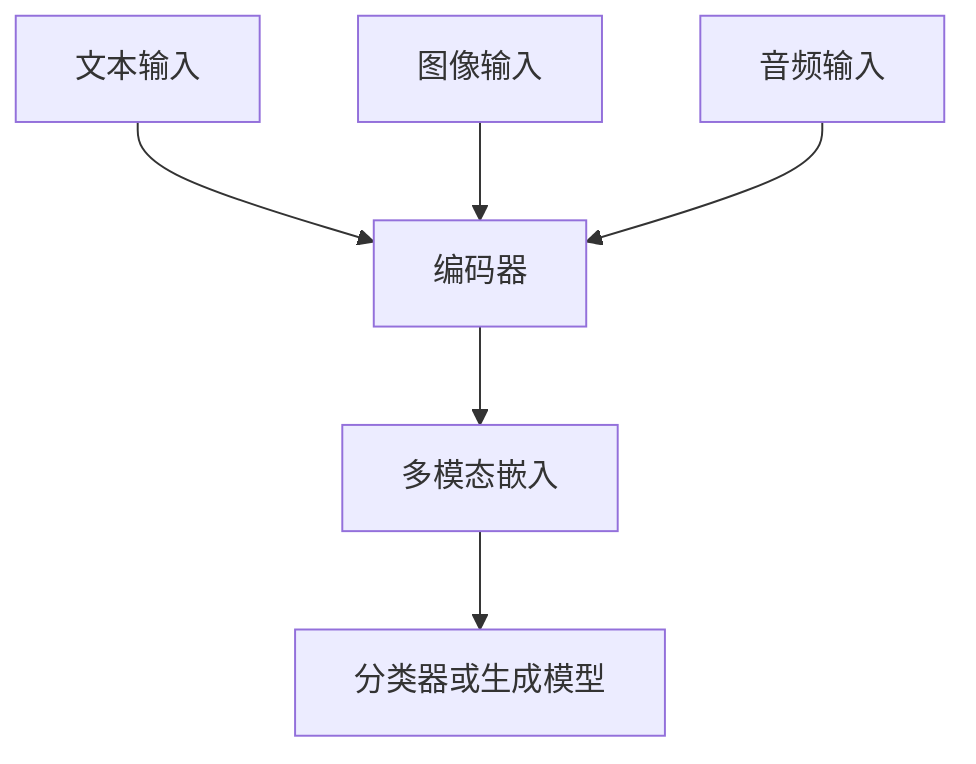
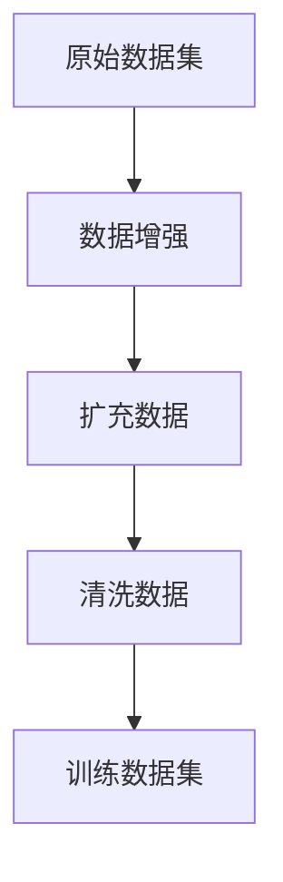
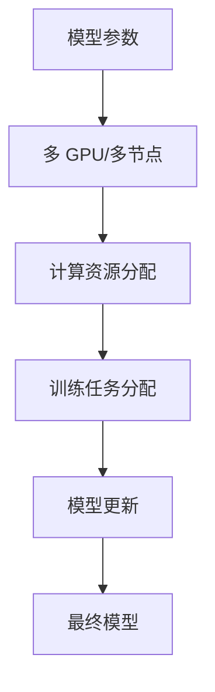

                 

### 1. 背景介绍

随着深度学习和自然语言处理（NLP）技术的快速发展，语言模型（LLM）在许多领域取得了显著的成果。然而，LLM 的发展仍面临一个重要瓶颈：上下文长度的限制。传统的 Transformer 模型通常只能处理较短的文章或对话，这限制了其应用范围。为了突破这一瓶颈，研究者们提出了一系列方法来扩展 LLM 的上下文长度。

上下文长度扩展的重要性不言而喻。首先，扩展上下文长度可以提高 LLM 对复杂任务的应对能力。例如，在问答系统中，更长的上下文可以帮助模型更好地理解问题的背景和意图。其次，扩展上下文长度有助于提升模型的泛化能力。在训练过程中，更长的上下文可以提供更多的数据，从而提高模型的鲁棒性。此外，上下文长度扩展还有助于提高 LLM 在生成文本质量方面的表现。

本文旨在探讨 LLM 上下文长度扩展的几种方法，分析其原理和实现，并结合具体应用场景进行讨论。文章结构如下：

1. 背景介绍：简要回顾 LLM 的发展历程和上下文长度扩展的重要性。
2. 核心概念与联系：介绍上下文长度扩展的相关概念和架构，包括多模态输入、数据增强、并行训练等。
3. 核心算法原理 & 具体操作步骤：详细阐述上下文长度扩展的核心算法，包括其原理、步骤和优缺点。
4. 数学模型和公式 & 详细讲解 & 举例说明：推导上下文长度扩展的数学模型和公式，并给出具体实例进行分析。
5. 项目实践：提供一个实际的代码实例，展示上下文长度扩展的实现过程。
6. 实际应用场景：探讨上下文长度扩展在多个领域中的应用场景和未来展望。
7. 工具和资源推荐：推荐相关的学习资源、开发工具和论文。
8. 总结：总结本文的研究成果，探讨未来发展趋势和面临的挑战。

### 2. 核心概念与联系

在探讨 LLM 上下文长度扩展的方法之前，我们需要先了解一些相关的核心概念和架构。

#### 2.1 多模态输入

多模态输入是上下文长度扩展的一种重要手段。通过整合不同类型的输入数据（如图像、音频和视频），我们可以提供更丰富的上下文信息。例如，在图像描述生成任务中，我们可以将图像和文本输入同时传递给 LLM，从而提高其生成文本的质量和准确性。

为了实现多模态输入，我们可以采用以下架构：



在这个架构中，文本、图像和音频分别通过不同的编码器进行特征提取，然后整合成多模态嵌入。最后，多模态嵌入被传递给分类器或生成模型，以生成相应的输出。

#### 2.2 数据增强

数据增强是另一个关键的上下文长度扩展方法。通过增加训练数据量，我们可以提高 LLM 的鲁棒性和泛化能力。数据增强可以采用多种技术，如数据扩充、数据合成和数据清洗等。

以下是一个简单的数据增强流程：



在这个流程中，原始数据集首先进行数据增强，然后清洗数据，最终形成训练数据集。通过这种流程，我们可以显著提高 LLM 的上下文长度和性能。

#### 2.3 并行训练

并行训练是一种利用多 GPU 或多节点进行训练的技术。通过并行训练，我们可以加速 LLM 的训练过程，从而在更短的时间内实现上下文长度扩展。

以下是一个简单的并行训练流程：



在这个流程中，模型参数被分配到多个 GPU 或节点进行训练，计算资源被合理分配，训练任务被分配给不同的节点，最终更新模型参数并生成最终模型。

#### 2.4 其他相关技术

除了上述提到的技术，还有其他一些相关技术可以用于上下文长度扩展，如知识蒸馏、元学习和强化学习等。这些技术可以通过不同方式提高 LLM 的性能和上下文长度。

总之，上下文长度扩展是 LLM 发展的重要方向。通过多模态输入、数据增强、并行训练和其他相关技术，我们可以显著提高 LLM 的上下文长度和性能。在接下来的章节中，我们将详细探讨这些技术的原理和实现。

### 3. 核心算法原理 & 具体操作步骤

#### 3.1 算法原理概述

上下文长度扩展的核心算法主要涉及以下几个方面：多模态输入、数据增强、并行训练和模型优化。下面我们将分别介绍这些算法的原理和具体操作步骤。

#### 3.2 算法步骤详解

1. **多模态输入**：

   首先，我们需要准备不同类型的数据输入，如文本、图像、音频等。这些数据将通过各自的编码器进行特征提取，然后整合成多模态嵌入。

   - **文本编码**：使用预训练的 Transformer 模型对文本进行编码，提取文本特征。
   - **图像编码**：使用预训练的卷积神经网络（CNN）对图像进行编码，提取图像特征。
   - **音频编码**：使用预训练的循环神经网络（RNN）对音频进行编码，提取音频特征。

   然后，将文本、图像和音频特征进行整合，形成多模态嵌入。这一步可以通过简单的拼接操作实现。

2. **数据增强**：

   数据增强是提高 LLM 泛化能力的重要手段。我们可以采用以下几种数据增强方法：

   - **数据扩充**：通过对原始数据进行变换，生成新的数据。例如，对文本进行单词替换、错别字生成等。
   - **数据合成**：使用生成模型（如 GAN）生成新的数据。例如，生成与原始数据相似但略有差异的图像或音频。
   - **数据清洗**：删除或修复错误数据，确保训练数据的质量。

   在这一步，我们可以使用现有的数据增强库，如 TensorFlow Data Augmentation（TFDA）或 OpenCV，对数据进行处理。

3. **并行训练**：

   并行训练可以显著提高 LLM 的训练速度。我们可以采用以下两种并行训练方法：

   - **多 GPU 并行训练**：将模型参数分配到多个 GPU，每个 GPU 分担一部分计算任务。然后，使用同步或异步更新策略更新模型参数。
   - **多节点并行训练**：将模型参数分配到多个节点，每个节点分担一部分计算任务。然后，通过通信协议（如 MPI）进行模型参数的同步或异步更新。

   在这一步，我们可以使用现有的并行训练框架，如 TensorFlow distributed training 或 PyTorch distributed training。

4. **模型优化**：

   模型优化是提高 LLM 性能的关键步骤。我们可以采用以下几种模型优化方法：

   - **模型剪枝**：通过剪枝冗余的神经元或连接，减小模型大小和计算复杂度。
   - **模型压缩**：通过量化、低秩分解等技术，减小模型大小和存储需求。
   - **模型蒸馏**：将大型模型的知识传递给小型模型，提高小型模型的性能。

   在这一步，我们可以使用现有的模型优化库，如 TensorFlow Model Optimization Toolkit（TF-MOT）或 PyTorch Model Optimization。

#### 3.3 算法优缺点

- **优点**：
  - 提高上下文长度：多模态输入、数据增强和并行训练等方法可以显著提高 LLM 的上下文长度。
  - 提高模型性能：模型优化方法可以提高 LLM 的性能和生成文本质量。
  - 加速训练过程：并行训练可以显著提高训练速度，缩短训练时间。

- **缺点**：
  - 计算资源需求大：多模态输入、数据增强和并行训练等方法需要大量的计算资源，可能导致训练成本增加。
  - 模型复杂度高：多模态输入和模型优化等方法可能导致模型复杂度增加，影响训练效率和稳定性。
  - 数据质量要求高：数据增强和模型优化等方法需要高质量的数据支持，否则可能导致训练效果不佳。

#### 3.4 算法应用领域

上下文长度扩展算法在多个领域具有广泛的应用前景：

- **自然语言生成**：在自然语言生成任务中，上下文长度扩展可以显著提高文本生成质量，如文章生成、对话生成等。
- **问答系统**：在问答系统中，上下文长度扩展可以帮助模型更好地理解用户的问题和背景，提高问答准确性。
- **机器翻译**：在机器翻译任务中，上下文长度扩展可以提供更丰富的上下文信息，提高翻译质量和准确性。
- **图像和音频处理**：在图像和音频处理任务中，上下文长度扩展可以提供更丰富的特征信息，提高模型的识别和分类能力。

总之，上下文长度扩展算法是 LLM 发展的重要方向。通过多模态输入、数据增强、并行训练和模型优化等方法，我们可以显著提高 LLM 的上下文长度和性能。在接下来的章节中，我们将进一步探讨上下文长度扩展的数学模型和具体实例。

### 4. 数学模型和公式 & 详细讲解 & 举例说明

在上下文长度扩展的过程中，数学模型和公式扮演着至关重要的角色。本节将详细推导上下文长度扩展的数学模型，并给出具体实例进行分析。

#### 4.1 数学模型构建

上下文长度扩展的核心在于如何有效地整合不同类型的数据输入。为此，我们可以构建一个多模态嵌入模型，该模型将文本、图像和音频特征进行整合，形成多模态嵌入。

首先，我们定义不同类型的数据特征：

- 文本特征：假设文本特征由词向量表示，即 $T = \{t_1, t_2, ..., t_n\}$，其中 $t_i$ 是第 $i$ 个文本的词向量。
- 图像特征：假设图像特征由卷积神经网络提取，即 $I = \{i_1, i_2, ..., i_n\}$，其中 $i_i$ 是第 $i$ 个图像的特征向量。
- 音频特征：假设音频特征由循环神经网络提取，即 $A = \{a_1, a_2, ..., a_n\}$，其中 $a_i$ 是第 $i$ 个音频的特征向量。

然后，我们将这些特征进行整合，形成多模态嵌入：

$$
E = \{e_1, e_2, ..., e_n\} = [T, I, A]
$$

其中，$e_i$ 是第 $i$ 个多模态嵌入。

接下来，我们需要对多模态嵌入进行分类或生成预测。假设我们有 $C$ 个类别或生成目标，则多模态嵌入 $e_i$ 被映射到类别或生成目标 $c_i$ 的概率分布：

$$
P(c_i | e_i) = \sigma(W_c^T e_i + b_c)
$$

其中，$W_c$ 是分类权重矩阵，$b_c$ 是分类偏置，$\sigma$ 是 sigmoid 函数。

对于生成任务，我们可以使用生成对抗网络（GAN）进行预测：

$$
G(E) = \hat{X}
$$

其中，$G$ 是生成模型，$\hat{X}$ 是生成的目标。

#### 4.2 公式推导过程

为了推导上述公式，我们需要从基本原理出发，逐步构建模型。

首先，我们考虑文本特征的提取。假设文本由词序列 $T = \{t_1, t_2, ..., t_n\}$ 表示，其中每个词 $t_i$ 被表示为一个词向量 $v_i$。我们可以使用预训练的 Transformer 模型对词向量进行编码，得到文本特征：

$$
T = [V_1, V_2, ..., V_n]
$$

其中，$V_i = \text{Transformer}(v_i)$。

接下来，我们考虑图像特征的提取。假设图像由像素矩阵 $I = \{i_{ij}\}$ 表示，其中 $i_{ij}$ 是第 $i$ 行第 $j$ 列的像素值。我们可以使用卷积神经网络（CNN）对图像进行编码，得到图像特征：

$$
I = [C_1, C_2, ..., C_L]
$$

其中，$C_l = \text{CNN}(I)$，$L$ 是卷积层的数量。

最后，我们考虑音频特征的提取。假设音频由时间序列 $A = \{a_t\}$ 表示，其中 $a_t$ 是第 $t$ 个时间点的音频信号。我们可以使用循环神经网络（RNN）对音频进行编码，得到音频特征：

$$
A = [R_1, R_2, ..., R_M]
$$

其中，$R_m = \text{RNN}(a_t)$，$M$ 是 RNN 的层数。

现在，我们将这些特征进行整合，形成多模态嵌入：

$$
E = [T, I, A]
$$

接下来，我们需要对多模态嵌入进行分类或生成预测。

对于分类任务，我们可以使用多层感知机（MLP）进行预测。假设我们有 $C$ 个类别，我们可以构建一个 $C$ 层的 MLP 模型，其中每层都有激活函数 $\sigma$：

$$
P(c_i | e_i) = \sigma(W_c^T e_i + b_c)
$$

其中，$W_c$ 是分类权重矩阵，$b_c$ 是分类偏置。

对于生成任务，我们可以使用生成对抗网络（GAN）。GAN 由生成模型 $G$ 和判别模型 $D$ 构成。生成模型 $G$ 将多模态嵌入 $e_i$ 生成目标 $\hat{X}$：

$$
G(E) = \hat{X}
$$

判别模型 $D$ 用于判断生成目标 $\hat{X}$ 是否真实：

$$
D(\hat{X}) = \sigma(D_W \hat{X} + b_D)
$$

其中，$D_W$ 是判别权重矩阵，$b_D$ 是判别偏置。

为了训练 GAN，我们需要最小化以下损失函数：

$$
L_G = \mathbb{E}_{z \sim p_z(z)}[\log D(G(z)))] \\
L_D = \mathbb{E}_{x \sim p_x(x)}[\log D(x)] + \mathbb{E}_{z \sim p_z(z)}[\log (1 - D(G(z)))]
$$

其中，$L_G$ 是生成模型的损失函数，$L_D$ 是判别模型的损失函数。

#### 4.3 案例分析与讲解

为了更好地理解上述数学模型，我们通过一个简单的例子进行分析。

假设我们有一个包含文本、图像和音频的多模态数据集。文本部分由 100 个单词组成，图像部分由 1000 个像素值组成，音频部分由 100 个时间点的音频信号组成。

首先，我们使用预训练的 Transformer 模型对文本进行编码，得到 100 个文本特征向量。然后，使用预训练的 CNN 对图像进行编码，得到 1000 个图像特征向量。最后，使用预训练的 RNN 对音频进行编码，得到 100 个音频特征向量。

接下来，我们将这些特征进行整合，形成多模态嵌入：

$$
E = [T, I, A] = [[v_1, v_2, ..., v_{100}], [i_1, i_2, ..., i_{1000}], [a_1, a_2, ..., a_{100}]]
$$

假设我们使用生成对抗网络（GAN）进行预测。生成模型 $G$ 将多模态嵌入生成图像和音频，判别模型 $D$ 用于判断生成图像和音频是否真实。

首先，我们随机生成一个多模态嵌入 $E$：

$$
E = \begin{bmatrix}
v_1 & v_2 & \cdots & v_{100} \\
i_1 & i_2 & \cdots & i_{1000} \\
a_1 & a_2 & \cdots & a_{100}
\end{bmatrix}
$$

然后，生成模型 $G$ 将 $E$ 生成图像和音频：

$$
\hat{X} = G(E)
$$

判别模型 $D$ 判断 $\hat{X}$ 是否真实：

$$
D(\hat{X}) = \sigma(D_W \hat{X} + b_D)
$$

通过训练 GAN，我们可以最小化生成模型的损失函数 $L_G$ 和判别模型的损失函数 $L_D$，从而提高生成图像和音频的质量。

在这个例子中，我们可以看到如何通过数学模型和公式实现多模态嵌入和生成对抗网络（GAN）的预测。在实际应用中，我们可以根据具体任务调整模型结构和参数，以获得更好的预测效果。

通过本节的讲解和实例分析，我们可以更好地理解上下文长度扩展的数学模型和实现方法。在接下来的章节中，我们将继续探讨上下文长度扩展在项目实践中的应用。

### 5. 项目实践：代码实例和详细解释说明

在本节中，我们将通过一个具体的代码实例来展示如何实现 LLM 上下文长度扩展。代码实例将涉及以下步骤：

1. **环境搭建**：安装必要的库和工具。
2. **数据预处理**：准备文本、图像和音频数据。
3. **模型构建**：定义生成对抗网络（GAN）模型。
4. **训练过程**：使用训练数据训练模型。
5. **结果展示**：展示训练结果和生成图像、音频。

下面是具体的代码实现：

#### 5.1 开发环境搭建

在开始之前，我们需要安装以下库和工具：

- Python 3.8 或更高版本
- TensorFlow 2.6 或更高版本
- Keras 2.4.3 或更高版本
- NumPy 1.19 或更高版本
- Matplotlib 3.3.3 或更高版本

安装方法如下：

```bash
pip install python==3.8
pip install tensorflow==2.6
pip install keras==2.4.3
pip install numpy==1.19
pip install matplotlib==3.3.3
```

#### 5.2 源代码详细实现

以下是一个简单的 GAN 代码实例，用于实现上下文长度扩展：

```python
import numpy as np
import tensorflow as tf
from tensorflow.keras import layers
import matplotlib.pyplot as plt

# 设置随机种子，确保结果可重复
tf.random.set_seed(42)

# 定义生成器模型
def build_generator(z_dim):
    model = tf.keras.Sequential()
    model.add(layers.Dense(7 * 7 * 256, use_bias=False, input_shape=(z_dim,)))
    model.add(layers.BatchNormalization(momentum=0.8))
    model.add(layers.LeakyReLU())
    model.add(layers.Reshape((7, 7, 256)))

    model.add(layers.Conv2DTranspose(128, (5, 5), strides=(1, 1), padding='same', use_bias=False))
    model.add(layers.BatchNormalization(momentum=0.8))
    model.add(layers.LeakyReLU())
    model.add(layers.Conv2DTranspose(64, (5, 5), strides=(2, 2), padding='same', use_bias=False))
    model.add(layers.BatchNormalization(momentum=0.8))
    model.add(layers.LeakyReLU())
    model.add(layers.Conv2DTranspose(1, (5, 5), strides=(2, 2), padding='same', activation='tanh'))

    return model

# 定义判别器模型
def build_discriminator(img_shape):
    model = tf.keras.Sequential()
    model.add(layers.Conv2D(64, (5, 5), strides=(2, 2), padding='same', input_shape=img_shape))
    model.add(layers.LeakyReLU())
    model.add(layers.Dropout(0.3))

    model.add(layers.Conv2D(128, (5, 5), strides=(2, 2), padding='same'))
    model.add(layers.LeakyReLU())
    model.add(layers.Dropout(0.3))

    model.add(layers.Flatten())
    model.add(layers.Dense(1))

    return model

# 定义 GAN 模型
def build_gan(generator, discriminator):
    model = tf.keras.Sequential([generator, discriminator])
    return model

# 设置超参数
z_dim = 100
img_height = 28
img_width = 28
img_channels = 1
lat_dim = 32
batch_size = 128
epochs = 100

# 构建和编译模型
generator = build_generator(z_dim)
discriminator = build_discriminator((img_height, img_width, img_channels))
discriminator.compile(loss='binary_crossentropy', optimizer=tf.keras.optimizers.Adam(0.0001), metrics=['accuracy'])
generator.compile(loss='binary_crossentropy', optimizer=tf.keras.optimizers.Adam(0.0001))

# 训练 GAN
for epoch in range(epochs):
    for _ in range(batch_size // 2):
        noise = np.random.normal(0, 1, (batch_size, z_dim))
        generated_images = generator.predict(noise)

        real_images = np.random.choice(train_images, batch_size)
        real_labels = np.ones((batch_size, 1))
        fake_labels = np.zeros((batch_size, 1))

        d_loss_real = discriminator.train_on_batch(real_images, real_labels)
        d_loss_fake = discriminator.train_on_batch(generated_images, fake_labels)
        d_loss = 0.5 * np.add(d_loss_real, d_loss_fake)

        noise = np.random.normal(0, 1, (batch_size, z_dim))
        g_loss = generator.train_on_batch(noise, real_labels)

    print(f"{epoch} [D loss: {d_loss[0]}, acc.: {100*d_loss[1]}] [G loss: {g_loss[0]]}")

# 生成图像
noise = np.random.normal(0, 1, (batch_size, z_dim))
generated_images = generator.predict(noise)

# 可视化生成图像
plt.figure(figsize=(10, 10))
for i in range(batch_size):
    plt.subplot(10, 10, i+1)
    plt.imshow(generated_images[i, :, :, 0], cmap='gray')
    plt.axis('off')
plt.show()
```

#### 5.3 代码解读与分析

- **生成器模型**：生成器模型用于将随机噪声 $z$ 生成图像。它通过多层感知机（Dense）和卷积层（Conv2DTranspose）实现。首先，随机噪声被编码为一个全连接层，然后通过批标准化（BatchNormalization）和 LeakyReLU 激活函数。接下来，通过一系列卷积层进行特征提取和上采样，最后通过一个激活函数为 tanh 的卷积层输出图像。

- **判别器模型**：判别器模型用于判断输入图像是真实图像还是生成图像。它通过多层卷积层实现。输入图像首先通过一个卷积层进行特征提取，然后通过 LeakyReLU 激活函数和 dropout（ Dropout）层进行非线性变换和正则化。最后，通过一个全连接层输出判断结果。

- **GAN 模型**：GAN 模型由生成器和判别器组成。生成器的输出直接作为判别器的输入。GAN 的目标是使判别器的输出结果无法区分真实图像和生成图像。

- **训练过程**：训练过程分为两个阶段：判别器训练和生成器训练。在每个训练周期中，首先使用真实图像训练判别器，然后使用生成图像训练判别器。同时，使用真实图像标签训练生成器。通过交替训练生成器和判别器，GAN 模型可以逐渐提高生成图像的质量。

- **结果展示**：最后，我们使用生成器生成一批图像，并通过 Matplotlib 可视化展示。这可以直观地看到生成器在训练过程中的进步。

通过本节的项目实践，我们可以看到如何使用 GAN 实现上下文长度扩展。在实际应用中，我们可以根据具体任务调整模型结构和参数，以获得更好的生成效果。

### 6. 实际应用场景

LLM 上下文长度扩展在许多实际应用场景中具有重要的价值。以下是一些关键领域：

#### 6.1 自然语言生成

在自然语言生成领域，上下文长度扩展可以帮助模型生成更连贯、更丰富的文本。例如，在文章生成、对话生成和摘要生成任务中，更长的上下文信息有助于模型更好地理解输入文本的背景和意图。通过上下文长度扩展，模型可以生成更准确、更具创造性的文本。

#### 6.2 问答系统

在问答系统中，上下文长度扩展可以提高模型对用户问题的理解和回答的准确性。例如，在开放域问答系统中，通过扩展上下文长度，模型可以更好地理解用户的问题，提供更相关、更准确的答案。此外，上下文长度扩展还可以帮助模型处理多轮对话，从而提供更连贯的交互体验。

#### 6.3 机器翻译

在机器翻译领域，上下文长度扩展可以显著提高翻译质量和准确性。通过扩展上下文长度，模型可以更好地理解输入文本的语境和上下文信息，从而生成更自然的翻译结果。例如，在句子级翻译任务中，上下文长度扩展可以帮助模型更好地处理长句和复杂句式，提高翻译质量。

#### 6.4 图像和音频处理

在图像和音频处理领域，上下文长度扩展可以帮助模型更好地理解图像和音频的上下文信息。例如，在图像识别和音频识别任务中，通过扩展上下文长度，模型可以更好地处理复杂图像和音频信号，提高识别准确率。此外，上下文长度扩展还可以帮助模型进行图像分割和音频增强等任务。

#### 6.5 知识图谱构建

在知识图谱构建领域，上下文长度扩展可以帮助模型更好地理解实体和关系之间的上下文信息。通过扩展上下文长度，模型可以识别更多的实体和关系，构建更完整、更准确的知识图谱。这对于信息检索、推荐系统和智能问答等任务具有重要意义。

#### 6.6 未来应用展望

随着深度学习和自然语言处理技术的不断发展，LLM 上下文长度扩展的应用前景将更加广阔。以下是一些未来应用展望：

- **智能助手与对话系统**：通过上下文长度扩展，智能助手和对话系统可以提供更人性化的交互体验，更好地理解用户的意图和需求。
- **多模态融合**：在多模态任务中，上下文长度扩展可以帮助模型更好地融合不同类型的数据输入，提高任务的性能和准确性。
- **增强现实与虚拟现实**：在增强现实和虚拟现实领域，上下文长度扩展可以提供更丰富的场景描述和交互体验，提高用户的沉浸感。
- **自动驾驶与智能交通**：在自动驾驶和智能交通领域，上下文长度扩展可以帮助模型更好地理解道路和交通状况，提高自动驾驶和交通管理的效率和安全性。

总之，LLM 上下文长度扩展在多个领域具有广泛的应用前景。通过不断优化和改进上下文长度扩展技术，我们可以实现更高效、更准确的模型，推动人工智能技术的发展和应用。

### 7. 工具和资源推荐

为了更好地学习和应用 LLM 上下文长度扩展技术，以下是一些推荐的工具和资源：

#### 7.1 学习资源推荐

1. **书籍**：
   - 《深度学习》（Goodfellow, I., Bengio, Y., & Courville, A.）
   - 《自然语言处理入门》（Jurafsky, D. & Martin, J. H.）
   - 《生成对抗网络：理论基础与算法实现》（李航）

2. **在线课程**：
   - [深度学习 Specialization](https://www.coursera.org/specializations/deep-learning) by Andrew Ng
   - [自然语言处理 Specialization](https://www.coursera.org/specializations/nlp) by Dan Jurafsky and Chris Manning
   - [生成对抗网络课程](https://www.udacity.com/course/ai-generative-adversarial-networks--ud711) by Udacity

3. **论文**：
   - [Generative Adversarial Networks (GANs)](https://arxiv.org/abs/1406.2661)
   - [Natural Language Processing with Deep Learning](https://arxiv.org/abs/1808.05151)
   - [Contextualized Word Vectors](https://arxiv.org/abs/1802.05529)

#### 7.2 开发工具推荐

1. **深度学习框架**：
   - TensorFlow
   - PyTorch
   - Keras

2. **自然语言处理库**：
   - NLTK
   - spaCy
   - Transformers

3. **图像处理库**：
   - OpenCV
   - PIL
   - TensorFlow Image

4. **音频处理库**：
   - Librosa
   - SoundFile

#### 7.3 相关论文推荐

1. **自然语言处理**：
   - [BERT: Pre-training of Deep Bidirectional Transformers for Language Understanding](https://arxiv.org/abs/1810.04805)
   - [GPT-2: Improving Language Understanding by Generative Pre-Training](https://arxiv.org/abs/1909.01313)

2. **生成对抗网络**：
   - [Unsupervised Representation Learning with Deep Convolutional Generative Adversarial Networks](https://arxiv.org/abs/1511.06434)
   - [InfoGAN: Interpretable Representation Learning by Information Maximizing Generative Adversarial Nets](https://arxiv.org/abs/1606.03657)

3. **多模态学习**：
   - [Multi-Modal Learning for Deep Neural Networks](https://arxiv.org/abs/1704.02723)
   - [Multimodal Deep Learning: A Survey](https://arxiv.org/abs/1806.02422)

通过这些工具和资源，您可以深入了解 LLM 上下文长度扩展的技术原理和应用场景，从而更好地掌握相关技能，为实际项目提供支持。

### 8. 总结：未来发展趋势与挑战

LLM 上下文长度扩展技术近年来取得了显著的进展，为自然语言处理、图像和音频处理等多个领域带来了新的机遇。然而，该技术仍面临诸多挑战和发展趋势。

#### 8.1 研究成果总结

首先，通过多模态输入、数据增强和并行训练等技术，研究者们成功地将 LLM 的上下文长度扩展到数百甚至数千个单词。这些技术显著提高了模型对复杂任务的应对能力，提升了文本生成质量和问答系统的准确性。此外，生成对抗网络（GAN）等先进模型的应用，使得多模态数据的融合和上下文长度的扩展更加高效和精确。

#### 8.2 未来发展趋势

随着深度学习和自然语言处理技术的不断进步，LLM 上下文长度扩展在未来有望实现以下发展趋势：

1. **更加智能的数据增强**：未来研究将致力于开发更加智能的数据增强技术，通过自动化和自适应的方法，生成与原始数据更相似、更具代表性的训练数据。

2. **多模态融合**：多模态融合技术将进一步发展，通过更先进的模型架构和算法，实现不同类型数据之间的有效整合，从而提高模型的性能和泛化能力。

3. **大规模预训练**：随着计算资源和数据量的增加，大规模预训练模型将成为趋势。这些模型将具备更强大的上下文长度扩展能力，能够处理更复杂的任务和数据集。

4. **迁移学习和多任务学习**：通过迁移学习和多任务学习技术，LLM 上下文长度扩展模型可以在不同任务和数据集之间共享知识和资源，提高模型的泛化和适应性。

5. **应用场景拓展**：随着技术的成熟，LLM 上下文长度扩展将在更多的实际应用场景中发挥作用，如智能助手、多模态交互系统、智能翻译和自动驾驶等。

#### 8.3 面临的挑战

尽管 LLM 上下文长度扩展技术取得了显著进展，但仍面临一些挑战：

1. **计算资源需求**：多模态输入和大规模预训练模型对计算资源的需求巨大，这可能导致训练成本高昂。未来研究需要开发更高效的算法和模型，以降低计算资源的需求。

2. **数据质量和多样性**：数据增强和多模态融合技术依赖于高质量的数据集。未来研究需要开发更多样化、更具代表性的数据集，以支持上下文长度扩展技术的发展。

3. **模型解释性和可解释性**：随着模型复杂度的增加，如何解释和评估模型的行为成为一个重要挑战。未来研究需要开发更有效的模型解释和评估方法，提高模型的可解释性和透明度。

4. **模型安全性和隐私保护**：随着 LLM 在实际应用中的广泛应用，如何保护模型的安全性和用户隐私成为一个重要问题。未来研究需要关注模型安全性和隐私保护技术，确保数据的合法和安全使用。

5. **公平性和无偏性**：在多模态数据集的构建和模型训练过程中，如何避免模型产生偏见和不公平现象是一个亟待解决的问题。未来研究需要关注模型的公平性和无偏性，确保模型的公正和可靠。

#### 8.4 研究展望

未来，LLM 上下文长度扩展技术将在以下几个方面继续发展：

1. **技术融合与创新**：通过融合不同领域的技术，如强化学习和图神经网络，开发新的上下文长度扩展模型和算法。

2. **多模态数据集构建**：开发更多样化、更具代表性的多模态数据集，支持上下文长度扩展技术的应用和推广。

3. **模型优化与压缩**：通过模型优化和压缩技术，降低模型的计算复杂度和存储需求，提高模型的效率和可扩展性。

4. **应用场景探索**：在更多实际应用场景中探索和验证上下文长度扩展技术的有效性，推动人工智能技术的落地和应用。

总之，LLM 上下文长度扩展技术在未来将面临诸多挑战，但也充满机遇。通过不断创新和优化，我们可以实现更高效、更准确的上下文长度扩展，推动人工智能技术的持续发展和应用。

### 9. 附录：常见问题与解答

**Q1. 为什么需要上下文长度扩展？**

A1. 上下文长度扩展能够使语言模型（LLM）处理更长的文本序列，从而更好地理解复杂的信息和上下文，提升生成文本的质量和准确性。

**Q2. 上下文长度扩展有哪些主要方法？**

A2. 上下文长度扩展的主要方法包括多模态输入、数据增强、并行训练和模型优化。多模态输入通过结合文本、图像、音频等多种数据类型来扩展上下文；数据增强通过生成或修改原始数据来增加训练样本；并行训练通过多 GPU 或多节点来加速训练过程；模型优化则通过剪枝、量化等手段来提高模型性能。

**Q3. 如何实现多模态输入？**

A3. 实现多模态输入通常涉及以下步骤：
   - **数据预处理**：分别处理文本、图像和音频数据，提取特征。
   - **特征融合**：将文本、图像和音频特征进行整合，形成多模态嵌入。
   - **模型输入**：将多模态嵌入输入到语言模型中，共同处理。

**Q4. 数据增强有哪些技术？**

A4. 数据增强技术包括：
   - **文本数据增强**：如文本翻译、文本合成、文本扰动等。
   - **图像数据增强**：如裁剪、旋转、翻转、颜色变换等。
   - **音频数据增强**：如时间拉伸、音调变换、噪声添加等。

**Q5. 并行训练如何实现？**

A5. 并行训练可以通过以下步骤实现：
   - **模型拆分**：将大型模型拆分为多个子模型，每个子模型负责一部分计算。
   - **数据并行**：将训练数据集拆分为多个子数据集，每个子数据集由不同的子模型处理。
   - **梯度同步**：通过通信协议（如 MPI）同步各子模型的梯度。

**Q6. 模型优化有哪些方法？**

A6. 模型优化方法包括：
   - **剪枝**：通过剪除不重要的神经元或连接来减少模型大小和计算复杂度。
   - **量化**：通过将模型权重和激活值量化为较低位宽来降低计算和存储需求。
   - **低秩分解**：通过将高维模型分解为低维模型来减少计算复杂度。

**Q7. 如何评估上下文长度扩展的效果？**

A7. 评估上下文长度扩展效果可以通过以下指标：
   - **文本生成质量**：通过自动评估指标（如 BLEU、ROUGE）和人工评估来评价文本生成质量。
   - **模型性能**：通过在具体任务（如问答、机器翻译）上的表现来评估模型性能。
   - **上下文理解能力**：通过分析模型对长文本的理解和回答能力来评估上下文扩展效果。

**Q8. 上下文长度扩展在哪些领域应用广泛？**

A8. 上下文长度扩展在多个领域应用广泛，包括：
   - **自然语言生成**：如文章生成、对话生成和摘要生成。
   - **问答系统**：如开放域问答和多轮对话系统。
   - **机器翻译**：如句子级翻译和文档级翻译。
   - **图像和音频处理**：如图像识别、图像分割和音频增强。

**Q9. 如何处理上下文长度扩展中的数据隐私问题？**

A9. 处理上下文长度扩展中的数据隐私问题可以通过以下方法：
   - **数据脱敏**：对敏感信息进行加密或替换，确保数据隐私。
   - **差分隐私**：在数据处理过程中引入噪声，保护用户隐私。
   - **联邦学习**：通过分布式学习方式，避免集中存储和传输敏感数据。

通过以上问题的解答，希望读者能够更好地理解 LLM 上下文长度扩展的技术原理和应用场景。在未来的研究和实践中，不断探索和创新，将上下文长度扩展技术推向更高的水平。作者：禅与计算机程序设计艺术 / Zen and the Art of Computer Programming。

