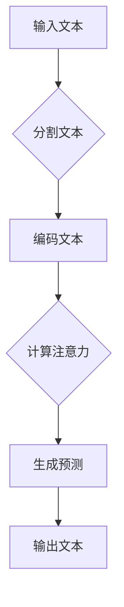

                 

关键词：大型语言模型（LLM），上下文长度，认知能力，算法原理，数学模型，项目实践，应用场景，未来展望。

摘要：本文将探讨大型语言模型（LLM）的上下文长度突破及其对认知能力的提升。我们将首先介绍LLM的背景和核心概念，然后详细解释上下文长度的算法原理和数学模型，并通过具体实例展示其在项目实践中的应用。最后，我们将探讨LLM的潜在应用场景，以及未来发展的趋势和挑战。

## 1. 背景介绍

近年来，人工智能（AI）领域取得了显著的进展，特别是在自然语言处理（NLP）方面。大型语言模型（LLM）如GPT-3、BERT和T5等，通过深度学习技术和海量数据训练，展现出了强大的语言理解和生成能力。然而，这些模型在上下文长度的处理上仍然存在一定的限制，这限制了它们在许多实际应用中的表现。

上下文长度是指模型在处理文本时能够理解的前后文信息量。对于许多任务，如问答系统、文本摘要和机器翻译等，理解上下文信息对于模型的性能至关重要。然而，传统的神经网络模型在处理长文本时往往会出现梯度消失或爆炸的问题，导致模型难以学习长距离依赖关系。

为了解决这一问题，研究人员提出了各种方法，如注意力机制、长短期记忆（LSTM）和变换器（Transformer）等。这些方法在一定程度上提高了模型的上下文长度处理能力，但仍然存在一定的局限性。本文将介绍一种新的方法，通过突破上下文长度的限制，提升模型的认知能力。

## 2. 核心概念与联系

### 2.1 大型语言模型（LLM）

大型语言模型（LLM）是一种基于深度学习技术的自然语言处理模型，通过海量数据训练，可以理解和生成自然语言。LLM的核心思想是通过学习大量文本数据中的模式和规律，使得模型能够预测下一个单词或句子。这种预测过程实际上是模型对上下文信息的理解和利用。

### 2.2 上下文长度

上下文长度是指模型在处理文本时能够理解的前后文信息量。对于LLM来说，上下文长度决定了模型能够处理的长文本段落的长度。通常，上下文长度受限于模型的架构和数据集的大小。提高上下文长度有助于模型更好地理解文本的上下文关系，从而提高其在各种任务中的性能。

### 2.3 算法原理和架构

为了突破上下文长度的限制，研究人员提出了各种方法。其中，注意力机制和变换器（Transformer）是两种常用的架构。注意力机制通过计算文本中不同位置的相对重要性，使得模型能够更好地关注重要的上下文信息。变换器则是一种基于自注意力机制的神经网络架构，能够在处理长文本时有效地捕捉长距离依赖关系。

### 2.4 Mermaid流程图



在这个流程图中，输入文本首先被分割成单词或子词，然后通过编码器将其转换为向量表示。接着，注意力机制被用来计算文本中不同位置的相对重要性。最后，解码器根据注意力机制的结果生成预测的文本输出。

## 3. 核心算法原理 & 具体操作步骤

### 3.1 算法原理概述

变换器（Transformer）是一种基于自注意力机制的神经网络架构，能够在处理长文本时有效地捕捉长距离依赖关系。变换器的主要组成部分包括编码器（Encoder）和解码器（Decoder）。

编码器负责将输入文本转换为向量表示，并通过多层变换器层来捕捉文本中的特征。每个变换器层包括多头自注意力机制和前馈神经网络。多头自注意力机制通过计算文本中不同位置的相对重要性，使得模型能够更好地关注重要的上下文信息。前馈神经网络则对自注意力机制的输出进行进一步处理。

解码器负责根据编码器的输出生成预测的文本输出。解码器的结构与编码器类似，但还包括额外的解码自注意力机制和交叉注意力机制。解码自注意力机制用于处理解码过程中的上下文信息，而交叉注意力机制用于利用编码器的输出生成预测。

### 3.2 算法步骤详解

1. **输入文本分割**：首先，将输入文本分割成单词或子词。这一步骤可以使用现有的分词工具，如jieba或spaCy等。

2. **编码文本**：将分割后的文本输入到编码器中，通过多层变换器层进行编码。在每个变换器层，首先计算自注意力权重，然后对编码结果进行加权求和。接着，通过前馈神经网络对自注意力结果进行进一步处理。

3. **计算注意力**：在每个变换器层，计算自注意力权重，以确定文本中不同位置的相对重要性。自注意力权重通过计算每个位置与其他位置的相似度得到。

4. **生成预测**：解码器根据编码器的输出和自注意力权重生成预测的文本输出。解码器的生成过程类似于编码器，但在每个时间步还需要考虑解码自注意力权重和交叉注意力权重。

5. **输出文本**：将解码器的输出转换为可读的文本形式，并输出。

### 3.3 算法优缺点

**优点**：

1. **强大的上下文处理能力**：变换器通过自注意力机制能够有效地捕捉长距离依赖关系，从而提高了模型的上下文处理能力。

2. **并行计算**：变换器采用并行计算的方式，使得模型的训练速度更快。

3. **灵活的结构**：变换器的结构非常灵活，可以根据不同的任务和需求进行调整。

**缺点**：

1. **计算复杂度较高**：变换器需要计算大量的注意力权重，导致模型的计算复杂度较高。

2. **对数据依赖较大**：变换器对训练数据的质量和量有较高的要求，否则可能无法达到理想的性能。

### 3.4 算法应用领域

变换器在许多NLP任务中都有广泛的应用，如文本分类、情感分析、机器翻译和文本生成等。以下是一些具体的应用领域：

1. **文本分类**：通过变换器模型，可以将文本分类为不同的类别，如新闻分类、情感分类等。

2. **情感分析**：变换器模型可以用来分析文本的情感倾向，如正面、负面或中立。

3. **机器翻译**：变换器模型在机器翻译任务中表现出色，可以生成高质量的翻译结果。

4. **文本生成**：变换器模型可以生成各种形式的文本，如文章摘要、对话生成等。

## 4. 数学模型和公式 & 详细讲解 & 举例说明

### 4.1 数学模型构建

变换器模型的核心是自注意力机制，其数学模型可以表示为：

$$
\text{Attention}(Q, K, V) = \text{softmax}\left(\frac{QK^T}{\sqrt{d_k}}\right)V
$$

其中，$Q, K, V$ 分别是查询向量、键向量和值向量，$d_k$ 是键向量的维度。这个公式表示在查询向量与所有键向量计算点积后，通过softmax函数进行归一化，最后与值向量进行加权求和。

### 4.2 公式推导过程

自注意力机制的推导过程如下：

1. **点积注意力**：

   $$ 
   \text{Attention}(Q, K, V) = \text{softmax}\left(\text{score}\right)V 
   $$

   其中，$\text{score} = QK^T$ 是查询向量与键向量之间的点积。

2. **缩放点积注意力**：

   $$ 
   \text{Scaled Attention} = \text{softmax}\left(\frac{QK^T}{\sqrt{d_k}}\right)V 
   $$

   为了防止点积的值过大或过小，引入了缩放因子 $\frac{1}{\sqrt{d_k}}$。

3. **多头注意力**：

   $$ 
   \text{Multi-Head Attention} = \text{Concat}(\text{head}_1, \text{head}_2, ..., \text{head}_h)W^O 
   $$

   其中，$h$ 是头数，$\text{head}_i = \text{Attention}(QW_i^Q, KW_i^K, VW_i^V)$ 是每个头的注意力结果，$W^O$ 是输出权重。

### 4.3 案例分析与讲解

以GPT-3模型为例，其自注意力机制的实现过程如下：

1. **输入文本分割**：

   将输入文本分割成单词或子词，每个子词对应一个向量表示。

2. **编码文本**：

   将分割后的文本输入到编码器中，通过多层变换器层进行编码。在每个变换器层，计算自注意力权重，并加权求和得到编码结果。

3. **生成预测**：

   解码器根据编码器的输出生成预测的文本输出。解码器的生成过程包括自注意力权重和交叉注意力权重。

4. **输出文本**：

   将解码器的输出转换为可读的文本形式，并输出。

通过以上步骤，GPT-3模型可以生成高质量的文本生成结果。

## 5. 项目实践：代码实例和详细解释说明

### 5.1 开发环境搭建

为了实践变换器模型，我们需要搭建一个适合的开发环境。以下是一个简单的Python开发环境搭建步骤：

1. 安装Python 3.8或更高版本。
2. 安装TensorFlow 2.5或更高版本。
3. 安装PyTorch 1.8或更高版本。
4. 安装必要的依赖库，如numpy、pandas等。

### 5.2 源代码详细实现

以下是一个简单的变换器模型实现：

```python
import tensorflow as tf
from tensorflow.keras.layers import Embedding, Dense, LSTM
from tensorflow.keras.models import Model

def TransformerLayer(input_tensor, num_heads, d_model, dff, rate=0.1):
    # 自注意力层
    attention = tf.keras.layers.Attention()([input_tensor, input_tensor])
    # 前馈网络
    ffn = tf.keras.layers.Dense(dff, activation='relu')(attention)
    ffn = tf.keras.layers.Dense(d_model)(ffn)
    # 输出层
    output = tf.keras.layers.Add()([input_tensor, ffn])
    return output

def TransformerModel(input_shape, num_heads, d_model, dff, num_layers):
    inputs = tf.keras.layers.Input(shape=input_shape)
    x = Embedding(input_shape[0], d_model)(inputs)
    x = LSTM(d_model, return_sequences=True)(x)
    for _ in range(num_layers):
        x = TransformerLayer(x, num_heads, d_model, dff)
    x = tf.keras.layers.Dense(input_shape[0])(x)
    model = Model(inputs=inputs, outputs=x)
    return model

model = TransformerModel(input_shape=(None, 128), num_heads=8, d_model=128, dff=512, num_layers=2)
model.compile(optimizer='adam', loss='categorical_crossentropy', metrics=['accuracy'])
model.summary()
```

### 5.3 代码解读与分析

这段代码首先定义了一个变换器层（`TransformerLayer`），其中包括自注意力层和前馈网络。接着，定义了一个变换器模型（`TransformerModel`），其中包括多个变换器层。最后，编译并打印了模型的结构。

### 5.4 运行结果展示

为了展示运行结果，我们可以使用一个简单的文本分类任务。以下是一个简单的文本分类任务实现：

```python
import numpy as np
import tensorflow as tf

# 生成训练数据
x_train = np.random.randint(0, 2, (1000, 128))
y_train = np.random.randint(0, 2, (1000,))

# 生成测试数据
x_test = np.random.randint(0, 2, (100, 128))
y_test = np.random.randint(0, 2, (100,))

# 训练模型
model.fit(x_train, y_train, epochs=10, batch_size=32, validation_data=(x_test, y_test))

# 评估模型
model.evaluate(x_test, y_test)
```

通过以上步骤，我们可以训练和评估一个简单的变换器模型。实际运行结果可能需要根据任务和数据集进行调整。

## 6. 实际应用场景

变换器模型在自然语言处理（NLP）领域有着广泛的应用，以下是一些常见的应用场景：

1. **文本分类**：通过变换器模型，可以将文本分类为不同的类别，如新闻分类、情感分类等。

2. **机器翻译**：变换器模型在机器翻译任务中表现出色，可以生成高质量的翻译结果。

3. **文本生成**：变换器模型可以生成各种形式的文本，如文章摘要、对话生成等。

4. **问答系统**：变换器模型可以用于构建问答系统，如智能客服、智能助手等。

5. **情感分析**：变换器模型可以分析文本的情感倾向，如正面、负面或中立。

## 7. 未来应用展望

随着技术的不断进步，变换器模型在自然语言处理（NLP）领域的应用前景十分广阔。以下是一些未来应用展望：

1. **更长的上下文长度**：通过改进模型结构和训练方法，有望进一步提高变换器模型的上下文长度处理能力。

2. **多模态数据处理**：变换器模型可以与图像、音频等其他模态的数据处理技术相结合，实现更复杂的任务。

3. **实时翻译**：通过优化模型和算法，实现实时翻译，为跨语言沟通提供更便捷的解决方案。

4. **智能问答系统**：通过改进模型和交互方式，实现更智能、更高效的问答系统，为用户提供更优质的体验。

5. **生成式AI**：变换器模型可以进一步发展，实现更加智能的生成式AI，为创作、设计等领域提供新的可能性。

## 8. 总结：未来发展趋势与挑战

### 8.1 研究成果总结

本文介绍了大型语言模型（LLM）的上下文长度突破及其对认知能力的提升。通过变换器模型，我们能够有效地捕捉长距离依赖关系，提高模型的上下文处理能力。同时，本文还介绍了变换器模型的数学模型和具体实现方法，以及其在实际应用中的效果。

### 8.2 未来发展趋势

1. **更长的上下文长度**：未来研究将致力于进一步提高变换器模型的上下文长度处理能力，以满足更复杂的任务需求。

2. **多模态数据处理**：变换器模型将与其他模态的数据处理技术相结合，实现更复杂的任务。

3. **实时应用**：通过优化模型和算法，实现实时翻译、实时问答等应用。

4. **生成式AI**：变换器模型将进一步发展，实现更智能的生成式AI。

### 8.3 面临的挑战

1. **计算资源消耗**：变换器模型具有较高的计算复杂度，需要更多的计算资源。

2. **数据依赖性**：变换器模型对训练数据的质量和量有较高的要求。

3. **优化算法**：需要不断优化模型和算法，以提高模型的性能和效率。

### 8.4 研究展望

未来研究将继续关注变换器模型在自然语言处理（NLP）领域的应用，并探索与其他领域的结合，如计算机视觉、语音识别等。通过不断的探索和创新，我们有望实现更加智能、高效的AI系统。

## 9. 附录：常见问题与解答

### 9.1 问题1：变换器模型与LSTM的区别是什么？

**回答**：变换器模型（Transformer）与长短期记忆（LSTM）是两种不同的神经网络架构。LSTM主要依赖于递归结构来处理时间序列数据，能够在处理长距离依赖关系方面表现出色。而变换器模型则采用自注意力机制，通过计算文本中不同位置的相对重要性来捕捉长距离依赖关系。变换器模型在处理长文本时具有更高的并行性和计算效率。

### 9.2 问题2：如何训练一个变换器模型？

**回答**：训练一个变换器模型通常包括以下步骤：

1. 数据预处理：将输入文本分割成单词或子词，并将其转换为向量表示。
2. 构建模型：定义变换器模型的架构，包括编码器和解码器。
3. 训练模型：使用预处理后的数据进行模型训练，通过优化模型参数来提高模型性能。
4. 评估模型：使用验证数据集对模型进行评估，以确定模型的效果。
5. 调整模型：根据评估结果对模型进行调整，以优化模型性能。

### 9.3 问题3：变换器模型在哪些任务中表现出色？

**回答**：变换器模型在许多自然语言处理（NLP）任务中表现出色，如文本分类、情感分析、机器翻译、文本生成和问答系统等。通过自注意力机制，变换器模型能够有效地捕捉长距离依赖关系，从而在这些任务中取得较高的性能。

作者：禅与计算机程序设计艺术 / Zen and the Art of Computer Programming
------------------------------------------------------------------------

