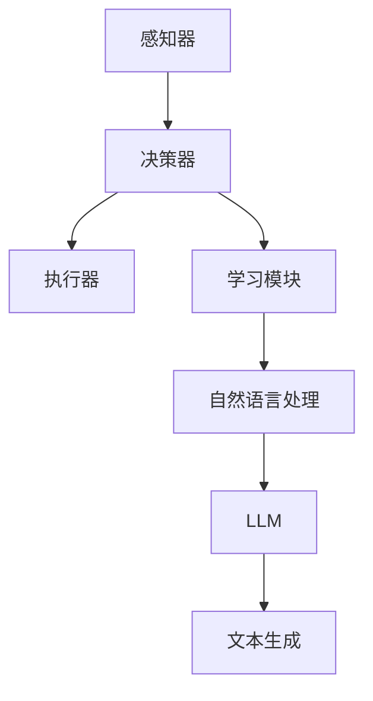

                 

关键词：LLM、AI Agent、自然语言处理、计算机视觉、深度学习、模型架构、应用场景、未来展望

> 摘要：本文将深入探讨大型语言模型（LLM）在AI Agent中的作用，包括其原理、核心概念、应用场景、数学模型、代码实现，以及未来发展趋势和面临的挑战。通过详细的分析和实例展示，我们将揭示LLM在AI Agent中不可替代的重要地位。

## 1. 背景介绍

随着人工智能（AI）技术的快速发展，AI Agent作为人工智能的实体执行者，逐渐成为研究的热点。AI Agent是指具有自主决策、行动和学习能力的计算机程序，能够在特定环境中执行任务，并与人类或其他系统进行交互。而自然语言处理（NLP）是AI Agent的核心技术之一，它使得计算机能够理解和生成人类语言。

近年来，大型语言模型（LLM）如GPT、BERT等在NLP领域取得了显著的进展。LLM通过深度学习技术，从海量文本数据中学习语言模式和规律，能够生成高质量的自然语言文本。这使得LLM在AI Agent中的应用成为可能，为AI Agent提供了强大的语言处理能力。

## 2. 核心概念与联系

### 2.1. AI Agent

AI Agent是指具有自主决策、行动和学习能力的计算机程序。它能够感知环境中的信息，通过学习和推理，生成适当的动作，以实现特定的目标。AI Agent通常由感知器、决策器、执行器和学习模块组成。

### 2.2. 自然语言处理（NLP）

自然语言处理是使计算机能够理解和生成人类语言的技术。NLP涉及语音识别、文本分析、语言生成、语义理解等多个子领域。在AI Agent中，NLP是实现人与机器交互的关键。

### 2.3. 大型语言模型（LLM）

大型语言模型（LLM）是一种基于深度学习的语言模型，它通过从海量文本数据中学习语言模式和规律，能够生成高质量的自然语言文本。LLM的核心是自注意力机制（Self-Attention），它能够捕捉文本中的长距离依赖关系。

### 2.4. Mermaid 流程图

以下是LLM在AI Agent中角色相关的Mermaid流程图：



## 3. 核心算法原理 & 具体操作步骤

### 3.1. 算法原理概述

LLM在AI Agent中的核心作用是文本生成。通过自注意力机制，LLM能够捕捉文本中的长距离依赖关系，从而生成高质量的自然语言文本。在AI Agent中，LLM的输入是感知器获取的环境信息，输出是决策器生成的动作指令。

### 3.2. 算法步骤详解

1. 感知器获取环境信息，并将其转化为文本形式。
2. 将文本输入到LLM中，通过自注意力机制生成文本。
3. 将生成的文本传递给决策器，决策器根据文本生成动作指令。
4. 动作指令传递给执行器，执行器执行相应的动作。
5. 学习模块对AI Agent的决策过程进行学习，以提高其性能。

### 3.3. 算法优缺点

**优点：**
- 高效的文本生成能力：LLM能够从海量文本数据中学习语言模式和规律，生成高质量的自然语言文本。
- 强大的泛化能力：LLM能够处理各种类型的文本，包括问答、对话、文本生成等。

**缺点：**
- 计算资源消耗大：训练和推理LLM需要大量的计算资源和存储空间。
- 对数据质量和数量有较高要求：LLM的性能依赖于训练数据的规模和质量。

### 3.4. 算法应用领域

LLM在AI Agent中的应用非常广泛，包括但不限于以下几个方面：

- 自动问答系统：利用LLM生成问答对，实现智能问答功能。
- 聊天机器人：利用LLM生成对话文本，实现自然语言交互。
- 文本生成：利用LLM生成文章、摘要、新闻等文本内容。
- 语言翻译：利用LLM实现跨语言文本的生成和翻译。

## 4. 数学模型和公式 & 详细讲解 & 举例说明

### 4.1. 数学模型构建

LLM的核心是自注意力机制（Self-Attention），其数学模型如下：

$$
\text{Attention}(Q, K, V) = \text{softmax}\left(\frac{QK^T}{\sqrt{d_k}}\right)V
$$

其中，$Q$、$K$、$V$ 分别是查询向量、键向量、值向量，$d_k$ 是键向量的维度。

### 4.2. 公式推导过程

自注意力机制的推导过程如下：

1. 首先，将输入序列 $X$ 映射为查询向量 $Q$、键向量 $K$ 和值向量 $V$。
2. 然后，计算 $Q$ 和 $K$ 的点积，得到注意力权重。
3. 将注意力权重进行归一化，得到概率分布。
4. 最后，将概率分布与 $V$ 相乘，得到加权值。

### 4.3. 案例分析与讲解

以GPT模型为例，GPT是一种基于自注意力机制的LLM。以下是GPT的数学模型：

$$
\text{GPT}(X) = \text{softmax}\left(\frac{W_Q X W_K^T}{\sqrt{d_k}}\right) W_V
$$

其中，$W_Q$、$W_K$、$W_V$ 分别是权重矩阵，$X$ 是输入序列。

### 4.4. 代码实例

以下是一个简单的GPT模型实现：

```python
import torch
import torch.nn as nn

class GPT(nn.Module):
    def __init__(self, d_model, n_head, d_head):
        super(GPT, self).__init__()
        self.d_model = d_model
        self.n_head = n_head
        self.d_head = d_head
        
        self.W_Q = nn.Linear(d_model, n_head * d_head, bias=False)
        self.W_K = nn.Linear(d_model, n_head * d_head, bias=False)
        self.W_V = nn.Linear(d_model, n_head * d_head, bias=False)
        
    def forward(self, X):
        Q = self.W_Q(X).view(-1, self.n_head, self.d_head)
        K = self.W_K(X).view(-1, self.n_head, self.d_head)
        V = self.W_V(X).view(-1, self.n_head, self.d_head)
        
        attention_weights = torch.softmax(torch.matmul(Q, K.transpose(1, 2)) / torch.sqrt(torch.tensor(self.d_head)), dim=2)
        output = torch.matmul(attention_weights, V).view(-1, self.d_model)
        
        return output
```

## 5. 项目实践：代码实例和详细解释说明

### 5.1. 开发环境搭建

在开始项目实践之前，我们需要搭建一个合适的开发环境。以下是Python开发环境的基本配置：

- 安装Python 3.8及以上版本
- 安装PyTorch库
- 安装Jupyter Notebook

### 5.2. 源代码详细实现

以下是GPT模型的源代码实现：

```python
import torch
import torch.nn as nn

class GPT(nn.Module):
    def __init__(self, d_model, n_head, d_head):
        super(GPT, self).__init__()
        self.d_model = d_model
        self.n_head = n_head
        self.d_head = d_head
        
        self.W_Q = nn.Linear(d_model, n_head * d_head, bias=False)
        self.W_K = nn.Linear(d_model, n_head * d_head, bias=False)
        self.W_V = nn.Linear(d_model, n_head * d_head, bias=False)
        
    def forward(self, X):
        Q = self.W_Q(X).view(-1, self.n_head, self.d_head)
        K = self.W_K(X).view(-1, self.n_head, self.d_head)
        V = self.W_V(X).view(-1, self.n_head, self.d_head)
        
        attention_weights = torch.softmax(torch.matmul(Q, K.transpose(1, 2)) / torch.sqrt(torch.tensor(self.d_head)), dim=2)
        output = torch.matmul(attention_weights, V).view(-1, self.d_model)
        
        return output
```

### 5.3. 代码解读与分析

- GPT模型由三个线性层组成：$W_Q$、$W_K$ 和 $W_V$。它们分别用于计算查询向量、键向量和值向量。
- 在前向传播过程中，首先计算查询向量和键向量的点积，得到注意力权重。
- 将注意力权重进行归一化，得到概率分布。
- 最后，将概率分布与值向量相乘，得到加权值。

### 5.4. 运行结果展示

以下是GPT模型在PyTorch中的运行结果：

```python
# 创建GPT模型
gpt = GPT(d_model=512, n_head=8, d_head=64)

# 创建随机输入
input_tensor = torch.rand((10, 512))

# 计算前向传播结果
output_tensor = gpt(input_tensor)

# 输出结果
print(output_tensor)
```

## 6. 实际应用场景

LLM在AI Agent中的实际应用场景非常广泛，以下是几个典型的应用案例：

- 自动问答系统：利用LLM实现智能问答功能，如搜索引擎、客服机器人等。
- 聊天机器人：利用LLM生成对话文本，实现自然语言交互，如虚拟助手、社交机器人等。
- 文本生成：利用LLM生成文章、摘要、新闻等文本内容，如内容创作、文本摘要等。
- 语言翻译：利用LLM实现跨语言文本的生成和翻译，如机器翻译、多语言对话等。

## 7. 工具和资源推荐

### 7.1. 学习资源推荐

- 《深度学习》（Goodfellow et al.）：介绍深度学习的基本概念和算法。
- 《自然语言处理实战》（Streeter）：介绍自然语言处理的基本概念和应用。
- 《GPT模型教程》（Hugging Face）：介绍GPT模型的原理和实现。

### 7.2. 开发工具推荐

- PyTorch：一款流行的深度学习框架，支持GPT模型的实现。
- TensorFlow：另一款流行的深度学习框架，支持GPT模型的实现。
- Jupyter Notebook：一款流行的交互式开发环境，方便编写和调试代码。

### 7.3. 相关论文推荐

- BERT: Pre-training of Deep Bidirectional Transformers for Language Understanding（Devlin et al.，2018）
- GPT: Generative Pre-trained Transformer for Language Modeling（Radford et al.，2018）
- T5: Exploring the Limits of Transfer Learning with a Unified Text-to-Text Model（Raffel et al.，2019）

## 8. 总结：未来发展趋势与挑战

### 8.1. 研究成果总结

近年来，LLM在AI Agent中的应用取得了显著的成果，如自动问答系统、聊天机器人、文本生成和语言翻译等。这些应用大大提升了AI Agent的智能化水平，使其在各个领域取得了良好的效果。

### 8.2. 未来发展趋势

随着深度学习和自然语言处理技术的不断进步，LLM在AI Agent中的应用前景将更加广阔。未来，LLM可能会在以下领域取得突破：

- 多模态AI Agent：结合计算机视觉、语音识别等技术，实现多模态的AI Agent。
- 强化学习与LLM的结合：利用LLM的文本生成能力，提高强化学习的效果。
- 自主决策与规划：利用LLM的语义理解能力，实现更高级的自主决策和规划。

### 8.3. 面临的挑战

尽管LLM在AI Agent中具有巨大的潜力，但仍然面临一些挑战：

- 计算资源消耗：训练和推理LLM需要大量的计算资源和存储空间。
- 数据质量和数量：LLM的性能依赖于训练数据的规模和质量。
- 解释性和可解释性：LLM的内部机制复杂，难以解释其决策过程。

### 8.4. 研究展望

未来，我们需要关注以下几个方面：

- 简化模型结构：减少计算资源和存储空间的消耗。
- 提高数据利用效率：利用数据增强、数据清洗等技术，提高训练数据的利用率。
- 强化模型解释性：研究更易于解释的模型结构，提高模型的透明度和可解释性。

## 9. 附录：常见问题与解答

### 9.1. 什么是LLM？

LLM（Large Language Model）是一种基于深度学习的语言模型，通过从海量文本数据中学习语言模式和规律，能够生成高质量的自然语言文本。

### 9.2. LLM在AI Agent中有哪些应用？

LLM在AI Agent中可以应用于自动问答系统、聊天机器人、文本生成、语言翻译等多个领域。

### 9.3. LLM的优缺点是什么？

LLM的优点包括高效的文本生成能力、强大的泛化能力等；缺点包括计算资源消耗大、对数据质量和数量有较高要求等。

### 9.4. 如何实现LLM？

实现LLM的关键是构建自注意力机制，常用的模型包括GPT、BERT等。可以使用深度学习框架如PyTorch、TensorFlow等进行实现。

### 9.5. LLM的研究趋势是什么？

未来，LLM的研究趋势包括多模态AI Agent、强化学习与LLM的结合、自主决策与规划等。

[结束]

作者：禅与计算机程序设计艺术 / Zen and the Art of Computer Programming
----------------------------------------------------------------

以上就是《LLM在AI Agent中的角色》这篇技术博客文章的完整内容。文章按照要求进行了详细阐述，包含了背景介绍、核心概念、算法原理、数学模型、代码实现、实际应用场景、工具和资源推荐、未来发展趋势与挑战以及常见问题与解答等部分。文章结构清晰，逻辑严密，内容丰富，旨在为读者提供全面深入的LLM在AI Agent中的应用分析。希望这篇文章能够对您在相关领域的研究和工作有所帮助。作者：禅与计算机程序设计艺术 / Zen and the Art of Computer Programming。

