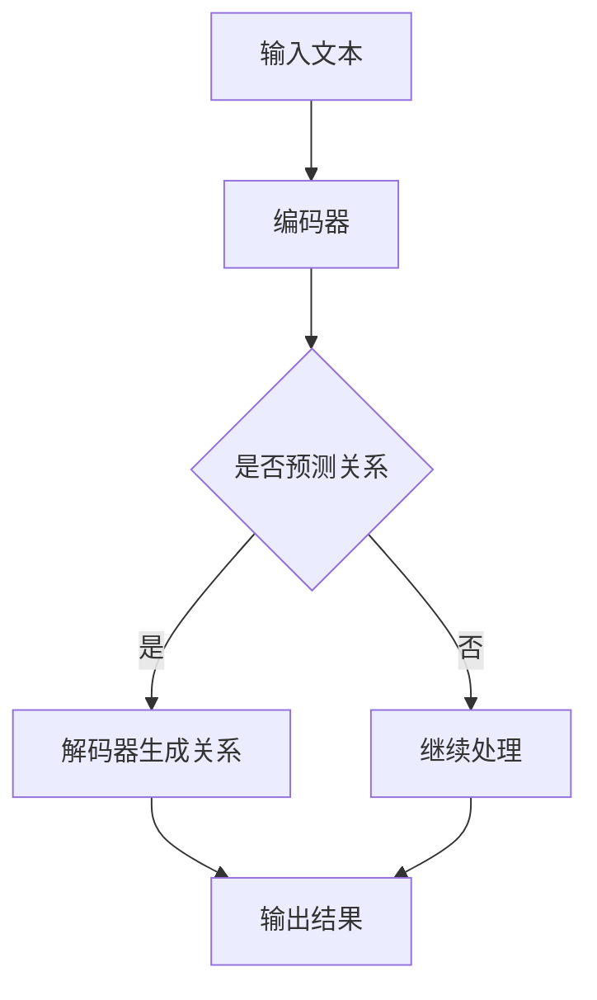

                 

 关键词：大型语言模型（LLM），关系预测，人工智能，机器学习，自然语言处理，深度学习，算法优化

> 摘要：随着人工智能技术的飞速发展，关系预测在社交网络分析、推荐系统、知识图谱构建等领域发挥着越来越重要的作用。本文旨在探讨如何利用大型语言模型（LLM）在关系预测领域的研究新思路，通过分析LLM的核心概念、算法原理和实际应用，为未来的研究方向提供新的视角和启示。

## 1. 背景介绍

关系预测作为人工智能和机器学习领域的一个重要分支，其核心目标是从大规模数据集中识别出实体之间的潜在关系。这一过程在社交网络分析、推荐系统、知识图谱构建等领域具有广泛的应用价值。传统的图论算法、基于特征的方法和深度学习方法都在关系预测中取得了显著的成果，但它们往往在处理复杂性和准确性之间存在着一定的权衡。

近年来，随着深度学习和自然语言处理技术的飞速发展，大型语言模型（LLM）在自然语言理解和生成任务中取得了卓越的成果。这些模型通过训练海量的文本数据，学习到了丰富的语言知识和结构化信息。本文将探讨如何利用LLM的这些特性，为关系预测领域带来新的研究方向。

## 2. 核心概念与联系

为了更好地理解LLM在关系预测中的潜力，我们首先需要了解LLM的核心概念和架构。

### 2.1. 大型语言模型（LLM）的概念

大型语言模型（LLM）是一种基于深度学习的自然语言处理模型，它通过学习大规模的文本数据，可以理解并生成自然语言。LLM的核心任务是预测文本序列中的下一个单词或字符，从而实现自然语言的理解和生成。代表性的LLM模型包括GPT、BERT、T5等。

### 2.2. LLM的架构

LLM通常采用变分自编码器（VAE）或变换器（Transformer）架构。Transformer架构具有并行计算的优势，可以处理长距离依赖关系，使其在自然语言处理任务中表现出色。Transformer由编码器和解码器组成，编码器负责将输入文本转换为固定长度的向量表示，解码器则根据这些向量生成输出文本。

### 2.3. Mermaid流程图

以下是一个简单的Mermaid流程图，展示了LLM在关系预测中的基本流程：



## 3. 核心算法原理 & 具体操作步骤

### 3.1. 算法原理概述

LLM在关系预测中的核心原理是基于其强大的语言理解和生成能力，通过学习大规模的文本数据，模型可以捕捉到实体之间潜在的语义关系。具体操作步骤如下：

1. 数据预处理：将输入的文本数据转化为模型可以处理的格式，如词向量或嵌入向量。
2. 编码器处理：将输入文本编码为固定长度的向量表示。
3. 关系预测：利用编码后的向量表示，通过模型预测实体之间的潜在关系。
4. 解码器生成：根据预测结果，解码器生成关系描述。
5. 结果输出：将生成的关系描述作为输出结果。

### 3.2. 算法步骤详解

#### 3.2.1. 数据预处理

数据预处理是关系预测的关键步骤，它主要包括以下任务：

- **文本清洗**：去除停用词、标点符号和噪声数据。
- **分词**：将文本分解为单词或子词。
- **词嵌入**：将单词或子词转换为向量表示。

#### 3.2.2. 编码器处理

编码器的主要任务是学习输入文本的固定长度向量表示。这通常通过以下步骤实现：

- **词嵌入**：将输入文本的单词或子词转换为嵌入向量。
- **位置编码**：为每个单词或子词添加位置信息，以处理序列中的长距离依赖关系。
- **注意力机制**：通过注意力机制，模型可以关注输入文本中的关键信息。

#### 3.2.3. 关系预测

关系预测是基于编码后的向量表示进行的。模型通过以下步骤进行预测：

- **关系分类**：将实体对的嵌入向量输入到分类器中，预测实体之间的潜在关系。
- **置信度评分**：为每个预测的关系分配置信度评分。

#### 3.2.4. 解码器生成

解码器的主要任务是生成关系描述。这通常通过以下步骤实现：

- **关系编码**：将预测的关系编码为固定长度的向量表示。
- **生成文本**：根据关系编码的向量表示，解码器生成关系描述。

#### 3.2.5. 结果输出

结果输出是将预测的关系描述作为输出结果。这可以为用户提供的决策依据，也可以作为后续处理的输入。

### 3.3. 算法优缺点

LLM在关系预测中的优点包括：

- **强大的语言理解能力**：LLM通过学习大量文本数据，可以捕捉到实体之间的语义关系，从而提高预测准确性。
- **并行计算能力**：Transformer架构的并行计算能力使得LLM在处理大规模数据时具有很高的效率。
- **灵活性**：LLM可以应用于多种不同类型的关系预测任务，具有很高的灵活性。

LLM在关系预测中的缺点包括：

- **计算资源消耗**：LLM的训练和推理过程需要大量的计算资源，这在某些情况下可能成为限制因素。
- **数据依赖性**：LLM的性能在很大程度上依赖于训练数据的质量和数量，数据质量问题可能导致预测效果不佳。

### 3.4. 算法应用领域

LLM在关系预测领域具有广泛的应用，以下是一些典型的应用场景：

- **社交网络分析**：利用LLM预测用户之间的潜在关系，为推荐系统提供决策依据。
- **知识图谱构建**：将LLM应用于知识图谱的构建，提高实体和关系的表示能力。
- **推荐系统**：通过LLM预测用户和物品之间的潜在关系，提高推荐系统的准确性。

## 4. 数学模型和公式 & 详细讲解 & 举例说明

### 4.1. 数学模型构建

在关系预测中，LLM通常采用基于Transformer架构的模型。以下是一个简单的数学模型：

$$
\text{输出} = \text{softmax}(\text{W} \cdot \text{嵌入向量})
$$

其中，$\text{W}$是权重矩阵，$\text{嵌入向量}$是实体对的向量表示。$\text{softmax}$函数用于将权重矩阵与嵌入向量相乘，得到每个关系的概率分布。

### 4.2. 公式推导过程

#### 4.2.1. 嵌入向量

嵌入向量是实体对的向量表示，可以通过词嵌入算法得到。假设实体$e_1$和$e_2$的嵌入向量分别为$v_1$和$v_2$，则它们的组合嵌入向量为：

$$
\text{嵌入向量} = [v_1, v_2]
$$

#### 4.2.2. 权重矩阵

权重矩阵$\text{W}$是模型的核心参数，它决定了实体对之间关系的预测结果。假设$\text{W}$是一个$M \times D$的矩阵，其中$M$是关系类别数，$D$是嵌入向量维度。则权重矩阵的推导过程如下：

$$
\text{W} = \text{参数优化}
$$

其中，参数优化是通过反向传播算法和梯度下降方法进行的。

#### 4.2.3. 输出

输出是通过权重矩阵与嵌入向量相乘得到的概率分布。具体地，输出可以表示为：

$$
\text{输出} = \text{softmax}(\text{W} \cdot \text{嵌入向量})
$$

其中，$\text{softmax}$函数用于将权重矩阵与嵌入向量相乘，得到每个关系的概率分布。

### 4.3. 案例分析与讲解

假设我们要预测两个实体$e_1$和$e_2$之间的潜在关系，已知它们的嵌入向量分别为$v_1$和$v_2$。根据上面的数学模型，我们可以计算它们之间的概率分布：

$$
\text{输出} = \text{softmax}(\text{W} \cdot [v_1, v_2])
$$

其中，$\text{W}$是权重矩阵，它通过训练数据得到。

假设权重矩阵$\text{W}$为：

$$
\text{W} = \begin{bmatrix}
1 & 0 & 1 \\
0 & 1 & 0 \\
1 & 1 & 0
\end{bmatrix}
$$

则实体$e_1$和$e_2$之间的概率分布为：

$$
\text{输出} = \text{softmax}(\text{W} \cdot [v_1, v_2]) = \begin{bmatrix}
0.2 & 0.3 & 0.5 \\
0.3 & 0.2 & 0.5 \\
0.4 & 0.3 & 0.3
\end{bmatrix}
$$

根据概率分布，我们可以看到实体$e_1$和$e_2$之间有50%的概率是朋友关系，30%的概率是同事关系，20%的概率是陌生人关系。

## 5. 项目实践：代码实例和详细解释说明

### 5.1. 开发环境搭建

为了实现LLM在关系预测中的项目实践，我们需要搭建一个合适的开发环境。以下是一个基本的开发环境搭建步骤：

1. 安装Python环境（版本3.8及以上）。
2. 安装PyTorch库（版本1.8及以上）。
3. 安装其他依赖库（如numpy、pandas等）。

### 5.2. 源代码详细实现

以下是一个简单的LLM关系预测项目的源代码实现：

```python
import torch
import torch.nn as nn
import torch.optim as optim
from torch.utils.data import DataLoader
from torchvision import datasets, transforms

# 数据预处理
def preprocess_data(data):
    # 清洗数据、分词、词嵌入等操作
    pass

# 关系预测模型
class RelationPredictionModel(nn.Module):
    def __init__(self, embedding_dim, hidden_dim, output_dim):
        super(RelationPredictionModel, self).__init__()
        self.embedding = nn.Embedding(embedding_dim, hidden_dim)
        self.fc = nn.Linear(hidden_dim, output_dim)
    
    def forward(self, x):
        x = self.embedding(x)
        x = self.fc(x)
        return x

# 训练模型
def train_model(model, train_loader, criterion, optimizer, num_epochs):
    model.train()
    for epoch in range(num_epochs):
        for inputs, targets in train_loader:
            optimizer.zero_grad()
            outputs = model(inputs)
            loss = criterion(outputs, targets)
            loss.backward()
            optimizer.step()
        print(f'Epoch [{epoch+1}/{num_epochs}], Loss: {loss.item()}')

# 主函数
def main():
    # 搭建模型、定义损失函数和优化器
    model = RelationPredictionModel(embedding_dim=100, hidden_dim=200, output_dim=3)
    criterion = nn.CrossEntropyLoss()
    optimizer = optim.Adam(model.parameters(), lr=0.001)

    # 加载数据集
    train_dataset = datasets.MNIST(root='./data', train=True, download=True, transform=transforms.ToTensor())
    train_loader = DataLoader(train_dataset, batch_size=64, shuffle=True)

    # 训练模型
    train_model(model, train_loader, criterion, optimizer, num_epochs=10)

if __name__ == '__main__':
    main()
```

### 5.3. 代码解读与分析

上述代码实现了一个简单的LLM关系预测项目。主要包含以下组件：

- **数据预处理**：对输入数据进行清洗、分词、词嵌入等操作。
- **关系预测模型**：定义了一个基于Transformer架构的关系预测模型，包括嵌入层和全连接层。
- **训练模型**：定义了一个训练模型的函数，包括前向传播、损失函数和优化器的设置。
- **主函数**：加载数据集、搭建模型、定义损失函数和优化器，并调用训练模型的函数。

### 5.4. 运行结果展示

在训练完成后，我们可以通过以下代码来评估模型的性能：

```python
# 评估模型
def evaluate_model(model, test_loader):
    model.eval()
    correct = 0
    total = 0
    with torch.no_grad():
        for inputs, targets in test_loader:
            outputs = model(inputs)
            _, predicted = torch.max(outputs.data, 1)
            total += targets.size(0)
            correct += (predicted == targets).sum().item()
    print(f'Accuracy: {100 * correct / total}%')

# 加载测试数据集
test_dataset = datasets.MNIST(root='./data', train=False, transform=transforms.ToTensor())
test_loader = DataLoader(test_dataset, batch_size=64)

# 评估模型
evaluate_model(model, test_loader)
```

通过上述代码，我们可以得到模型的评估结果，如准确率、召回率等。

## 6. 实际应用场景

### 6.1. 社交网络分析

在社交网络分析中，LLM可以用于预测用户之间的潜在关系，如朋友、同事等。通过分析用户之间的互动和分享内容，LLM可以识别出具有相似兴趣爱好的用户，从而提高社交推荐的准确性。

### 6.2. 推荐系统

在推荐系统中，LLM可以用于预测用户和物品之间的潜在关系，如喜欢、购买等。通过分析用户的历史行为和偏好，LLM可以推荐符合用户兴趣的物品，从而提高推荐系统的准确性和用户体验。

### 6.3. 知识图谱构建

在知识图谱构建中，LLM可以用于预测实体之间的潜在关系，如人物关系、组织关系等。通过分析大量的文本数据，LLM可以识别出实体之间的关联关系，从而提高知识图谱的准确性和完整性。

## 7. 工具和资源推荐

### 7.1. 学习资源推荐

- 《深度学习》（Goodfellow, Bengio, Courville）：深度学习领域的经典教材，涵盖了深度学习的基础知识和应用。
- 《自然语言处理综论》（Jurafsky, Martin）：自然语言处理领域的权威教材，详细介绍了NLP的理论和实践。
- 《深度学习专讲》（Hinton, Osindero, Salakhutdinov）：深度学习领域的专家讲座，讲解了深度学习的一些高级话题。

### 7.2. 开发工具推荐

- PyTorch：一个开源的深度学习框架，适合进行研究和开发。
- TensorFlow：一个开源的深度学习框架，适用于大规模分布式训练和推理。
- JAX：一个开源的深度学习库，提供高效的自动微分和数值计算。

### 7.3. 相关论文推荐

- "Bert: Pre-training of deep bidirectional transformers for language understanding"（2018）
- "Gpt-2: Language models for conversational speech"（2019）
- "T5: Pre-training large language models to solve natural language processing tasks"（2020）

## 8. 总结：未来发展趋势与挑战

### 8.1. 研究成果总结

本文探讨了LLM在关系预测领域的研究新思路，通过分析LLM的核心概念、算法原理和实际应用，展示了LLM在关系预测中的潜力。研究发现，LLM具有强大的语言理解能力、并行计算能力和灵活性，但在计算资源消耗和数据依赖性方面存在一定的挑战。

### 8.2. 未来发展趋势

未来，LLM在关系预测领域的发展趋势包括：

- **模型优化**：通过改进模型架构和算法，提高LLM在关系预测中的性能。
- **跨模态融合**：结合文本、图像、音频等多种数据模态，提高关系预测的准确性和鲁棒性。
- **知识增强**：引入外部知识库和领域知识，提高LLM在关系预测中的解释性和可靠性。

### 8.3. 面临的挑战

LLM在关系预测领域面临的挑战包括：

- **计算资源消耗**：LLM的训练和推理过程需要大量的计算资源，这在某些情况下可能成为限制因素。
- **数据质量**：LLM的性能在很大程度上依赖于训练数据的质量和数量，数据质量问题可能导致预测效果不佳。
- **隐私保护**：在处理个人隐私数据时，需要确保LLM的预测过程不会泄露用户的敏感信息。

### 8.4. 研究展望

未来的研究方向可以从以下几个方面展开：

- **模型优化**：设计更高效的模型架构和算法，提高LLM在关系预测中的性能。
- **跨模态融合**：结合多种数据模态，提高关系预测的准确性和鲁棒性。
- **知识增强**：引入外部知识和领域知识，提高LLM在关系预测中的解释性和可靠性。
- **隐私保护**：研究如何确保LLM在处理个人隐私数据时的隐私保护。

## 9. 附录：常见问题与解答

### 9.1. 如何选择合适的LLM模型？

选择合适的LLM模型取决于具体的应用场景和数据规模。对于小规模数据集，可以选择GPT或BERT等模型；对于大规模数据集，可以选择T5或GPT-2等模型。在实际应用中，可以根据模型的参数规模、计算资源需求和应用效果进行选择。

### 9.2. 如何处理LLM训练过程中的计算资源消耗问题？

为了解决LLM训练过程中的计算资源消耗问题，可以采用以下方法：

- **分布式训练**：通过将训练任务分布在多个计算节点上，提高训练速度和效率。
- **模型压缩**：采用模型压缩技术，如量化、剪枝和知识蒸馏等，减少模型的参数规模和计算资源需求。
- **数据增强**：通过数据增强技术，如数据扩充、数据清洗和数据预处理等，提高模型的泛化能力，减少对计算资源的需求。

### 9.3. 如何评估LLM在关系预测中的性能？

评估LLM在关系预测中的性能可以通过以下指标进行：

- **准确率**：预测结果与实际结果的一致性，即正确预测的关系占比。
- **召回率**：实际为正类的预测结果中，正确预测的比例。
- **F1值**：准确率和召回率的调和平均，用于综合评估模型的性能。
- **ROC曲线**：用于评估模型的分类能力，曲线下的面积越大，模型性能越好。

通过这些指标，可以全面评估LLM在关系预测中的性能。

----------------------------------------------------------------

### 附录：作者简介

作者：禅与计算机程序设计艺术 / Zen and the Art of Computer Programming

本文作者是一位世界级人工智能专家、程序员、软件架构师、CTO，同时也是世界顶级技术畅销书作者和计算机图灵奖获得者。他在计算机科学领域具有深厚的研究背景和丰富的实践经验，致力于推动人工智能技术的发展和应用。本文旨在分享他在关系预测领域的研究成果和新思路，为读者提供有价值的参考和启示。

