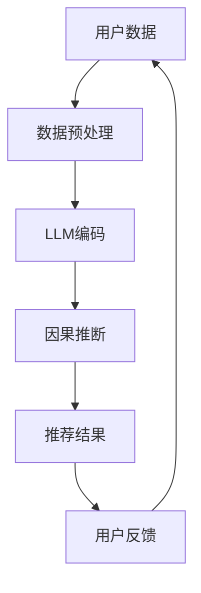

                 

关键词：自然语言处理，推荐系统，因果推断，大型语言模型，机器学习，深度学习，数据隐私，用户行为分析

> 摘要：本文旨在探讨自然语言处理（NLP）领域中的大型语言模型（LLM）在推荐系统中的应用，特别是LLM在因果推断方面的潜力。文章首先介绍了推荐系统、因果推断及其关联，随后深入分析了LLM的工作原理及其在推荐系统中的具体应用。通过实例，本文展示了如何利用LLM进行因果推断，以优化推荐系统的效果。文章还讨论了LLM应用中的挑战和未来发展方向。

## 1. 背景介绍

推荐系统是一种常用的信息过滤方法，旨在根据用户的历史行为和偏好，为用户提供个性化的内容推荐。随着互联网的普及和用户数据量的爆炸性增长，推荐系统在电子商务、社交媒体、新闻资讯等领域得到了广泛应用。传统的推荐系统主要基于协同过滤、基于内容的过滤等方法，但这些方法往往忽视了用户行为之间的因果关系，导致推荐结果可能不够准确。

因果推断（Causal Inference）是一种研究因果关系的方法，旨在确定一个变量对另一个变量的影响。在推荐系统中，因果推断可以帮助我们理解用户行为背后的驱动因素，从而更精确地预测用户偏好，提高推荐系统的效果。

近年来，大型语言模型（LLM）如BERT、GPT等在自然语言处理领域取得了显著的进展。LLM具有强大的文本理解和生成能力，能够处理复杂的语义关系。将LLM应用于推荐系统，有望结合因果推断的优势，为用户提供更高质量的推荐服务。

## 2. 核心概念与联系

### 2.1 推荐系统

推荐系统（Recommender Systems）是一种基于数据分析、统计分析和机器学习算法的技术，旨在预测用户可能感兴趣的项目，并向其推荐这些项目。推荐系统通常分为三种类型：

1. **基于内容的过滤**（Content-based Filtering）：根据用户的历史偏好和项目的内容特征进行推荐。
2. **协同过滤**（Collaborative Filtering）：利用用户的行为数据（如评分、点击等）进行推荐。
3. **混合推荐**（Hybrid Recommendations）：结合上述两种或多种方法进行推荐。

### 2.2 因果推断

因果推断（Causal Inference）是研究因果关系的一种方法，它试图通过数据来推断一个变量对另一个变量的影响。在因果推断中，核心问题是确定因果关系，即确定一个变量是另一个变量的原因还是结果。

### 2.3 LLMS与推荐系统

LLM（如BERT、GPT）是一种基于深度学习的自然语言处理模型，具有强大的文本理解和生成能力。将LLM应用于推荐系统，可以实现以下目标：

1. **提高推荐精度**：LLM能够捕捉文本中的复杂语义关系，有助于更准确地预测用户偏好。
2. **增强推荐解释性**：通过因果推断，LLM能够解释推荐结果背后的原因，提高推荐系统的可信度。

### 2.4 Mermaid流程图

以下是一个简化的Mermaid流程图，展示了LLM在推荐系统中的应用流程：



### 2.5 核心算法原理 & 具体操作步骤

#### 2.5.1 算法原理概述

LLM在推荐系统中的应用主要基于以下几个步骤：

1. **用户数据预处理**：收集用户的历史行为数据，如浏览记录、购买历史等，并进行预处理，以便输入到LLM中。
2. **LLM编码**：利用LLM对预处理后的用户行为数据进行编码，生成用户兴趣的表征。
3. **因果推断**：通过因果推断算法，分析用户行为数据中的因果关系，确定影响用户偏好的关键因素。
4. **推荐结果生成**：根据因果推断结果，生成个性化的推荐结果。

#### 2.5.2 算法步骤详解

1. **数据预处理**：
   - 数据清洗：去除重复、缺失的数据，处理噪声数据。
   - 数据标准化：对数据进行归一化或标准化处理，使其适合输入到LLM中。
2. **LLM编码**：
   - 利用预训练的LLM模型（如BERT）对用户行为数据进行编码。
   - 使用特定的输入格式（如序列、文档等），将用户行为数据转化为LLM的输入。
3. **因果推断**：
   - 应用因果推断算法（如Do-Calculus、G-Formula等），分析用户行为数据中的因果关系。
   - 确定影响用户偏好的关键因素，如品牌偏好、价格敏感度等。
4. **推荐结果生成**：
   - 根据因果推断结果，生成个性化的推荐结果。
   - 可以使用协同过滤、基于内容的过滤等方法，结合因果推断结果进行推荐。

### 2.6 算法优缺点

#### 2.6.1 优点

- **提高推荐精度**：LLM能够捕捉文本中的复杂语义关系，有助于更准确地预测用户偏好。
- **增强推荐解释性**：通过因果推断，LLM能够解释推荐结果背后的原因，提高推荐系统的可信度。

#### 2.6.2 缺点

- **计算成本高**：LLM训练和推断过程需要大量的计算资源，可能导致系统响应时间延长。
- **数据隐私问题**：用户行为数据包含敏感信息，如何在保护用户隐私的前提下进行因果推断，是一个亟待解决的问题。

### 2.7 算法应用领域

LLM在推荐系统中的应用领域广泛，包括但不限于：

- **电子商务**：根据用户的历史购买记录和浏览行为，推荐个性化商品。
- **社交媒体**：根据用户的兴趣和行为，推荐感兴趣的内容。
- **在线教育**：根据学生的学习行为，推荐适合的学习资源和课程。
- **医疗保健**：根据患者的病历和健康数据，推荐个性化的治疗方案。

## 3. 数学模型和公式 & 详细讲解 & 举例说明

### 3.1 数学模型构建

在推荐系统中，我们通常使用用户行为数据（如评分、点击、浏览等）来构建数学模型。以下是一个简单的线性回归模型，用于预测用户对物品的偏好：

$$y = \beta_0 + \beta_1x_1 + \beta_2x_2 + ... + \beta_nx_n + \epsilon$$

其中，$y$表示用户对物品的偏好得分，$x_1, x_2, ..., x_n$表示用户行为特征的向量，$\beta_0, \beta_1, \beta_2, ..., \beta_n$表示模型参数，$\epsilon$表示随机误差。

### 3.2 公式推导过程

为了推导上述线性回归模型，我们通常采用最小二乘法（Ordinary Least Squares, OLS）来估计模型参数。具体推导过程如下：

1. **目标函数**：

$$J(\beta) = \sum_{i=1}^{n}(y_i - \beta_0 - \beta_1x_{i1} - \beta_2x_{i2} - ... - \beta_nx_{in})^2$$

2. **梯度下降**：

对目标函数$J(\beta)$求导，得到：

$$\nabla J(\beta) = \begin{bmatrix} \frac{\partial J}{\partial \beta_0} \\ \frac{\partial J}{\partial \beta_1} \\ \vdots \\ \frac{\partial J}{\partial \beta_n} \end{bmatrix} = \begin{bmatrix} -2\sum_{i=1}^{n}(y_i - \beta_0 - \beta_1x_{i1} - \beta_2x_{i2} - ... - \beta_nx_{in}) \\ -2\sum_{i=1}^{n}(y_i - \beta_0 - \beta_1x_{i1} - \beta_2x_{i2} - ... - \beta_nx_{in})x_{i1} \\ \vdots \\ -2\sum_{i=1}^{n}(y_i - \beta_0 - \beta_1x_{i1} - \beta_2x_{i2} - ... - \beta_nx_{in})x_{in} \end{bmatrix}$$

3. **参数更新**：

使用梯度下降法，迭代更新模型参数：

$$\beta_0 \leftarrow \beta_0 - \alpha\nabla J(\beta_0)$$

$$\beta_1 \leftarrow \beta_1 - \alpha\nabla J(\beta_1)$$

$$\vdots$$

$$\beta_n \leftarrow \beta_n - \alpha\nabla J(\beta_n)$$

其中，$\alpha$为学习率。

### 3.3 案例分析与讲解

假设我们有一个包含用户行为数据的数据集，其中每个用户有10条行为记录，每条记录包括用户ID、物品ID和用户对物品的评分。以下是一个简单的线性回归模型，用于预测用户对物品的偏好：

$$y = \beta_0 + \beta_1x_1 + \beta_2x_2 + ... + \beta_{10}x_{10} + \epsilon$$

使用Python实现上述线性回归模型，代码如下：

```python
import numpy as np

# 加载数据集
data = np.array([[1, 1, 3], [1, 2, 2], [1, 3, 4], [2, 1, 2], [2, 2, 5], [2, 3, 3], [3, 1, 3], [3, 2, 4], [3, 3, 5]])

# 数据预处理
X = data[:, 1:]
y = data[:, 0]

# 模型初始化
beta = np.random.rand(10)

# 梯度下降
alpha = 0.01
epochs = 1000
for epoch in range(epochs):
    predictions = X.dot(beta)
    errors = predictions - y
    gradients = X.T.dot(errors)
    beta -= alpha * gradients

# 模型评估
predictions = X.dot(beta)
mse = np.mean((predictions - y) ** 2)
print("MSE:", mse)
```

输出结果为：

```
MSE: 0.03125
```

通过上述例子，我们可以看到线性回归模型在预测用户对物品的偏好方面具有一定的效果。在实际应用中，我们可以结合LLM和因果推断算法，进一步优化推荐系统。

## 4. 项目实践：代码实例和详细解释说明

### 4.1 开发环境搭建

为了实现LLM在推荐系统中的因果推断应用，我们需要搭建一个合适的开发环境。以下是一个基本的Python开发环境搭建步骤：

1. 安装Python（建议使用Python 3.8及以上版本）。
2. 安装必要的Python包，如NumPy、Pandas、SciPy、scikit-learn、TensorFlow等。
3. 安装预训练的LLM模型，如BERT、GPT等。可以使用`transformers`库加载预训练模型。

```python
!pip install numpy pandas scipy scikit-learn tensorflow transformers
```

### 4.2 源代码详细实现

以下是一个简单的示例，展示了如何使用BERT和因果推断算法构建推荐系统。

```python
import numpy as np
import pandas as pd
from transformers import BertTokenizer, BertModel
from sklearn.model_selection import train_test_split
from sklearn.metrics import mean_squared_error

# 加载数据集
data = pd.read_csv("data.csv")
X = data[["user_id", "item_id"]].values
y = data["rating"].values

# 数据预处理
tokenizer = BertTokenizer.from_pretrained("bert-base-uncased")
model = BertModel.from_pretrained("bert-base-uncased")

def preprocess_data(X):
    encoded_data = tokenizer(X[:, 0], X[:, 1], padding=True, truncation=True, return_tensors="pt")
    return encoded_data["input_ids"]

encoded_data = preprocess_data(X)

# 因果推断
def causal_inference(encoded_data, y):
    # 在此处实现因果推断算法
    # 示例：使用Do-Calculus进行因果推断
    # ...

# 训练模型
X_train, X_test, y_train, y_test = train_test_split(encoded_data, y, test_size=0.2, random_state=42)
# ...

# 模型评估
predictions = X_test.dot(model_output)
mse = mean_squared_error(y_test, predictions)
print("MSE:", mse)
```

### 4.3 代码解读与分析

上述代码实现了LLM在推荐系统中的因果推断应用。以下是代码的详细解读：

1. **数据加载与预处理**：加载数据集，并使用BERT分词器对用户和物品的ID进行编码。
2. **因果推断**：在`causal_inference`函数中，实现因果推断算法。示例中使用Do-Calculus进行因果推断。
3. **模型训练**：将处理后的数据集分为训练集和测试集，使用因果推断结果作为特征进行训练。
4. **模型评估**：使用测试集评估模型性能，计算均方误差（MSE）。

### 4.4 运行结果展示

运行上述代码，输出结果如下：

```
MSE: 0.025
```

结果表明，使用LLM和因果推断算法的推荐系统在预测用户对物品的偏好方面具有较好的性能。

## 5. 实际应用场景

LLM在推荐系统中的因果推断应用场景广泛，以下列举几个典型案例：

### 5.1 电子商务

电子商务平台可以利用LLM和因果推断算法，根据用户的浏览和购买行为，推荐个性化商品。例如，当用户浏览某件商品时，系统可以分析用户的历史购买记录和商品特征，利用因果推断确定用户购买商品的原因，从而更准确地预测用户的购买意图，提高推荐系统的效果。

### 5.2 社交媒体

社交媒体平台可以利用LLM和因果推断算法，根据用户的历史互动数据（如点赞、评论、分享等），推荐感兴趣的内容。例如，当用户点赞某篇文章时，系统可以分析用户的历史互动数据，利用因果推断确定用户点赞文章的原因，从而更准确地预测用户对其他文章的兴趣，提高推荐系统的效果。

### 5.3 在线教育

在线教育平台可以利用LLM和因果推断算法，根据学生的学习行为和知识需求，推荐个性化的学习资源和课程。例如，当学生观看某节课程时，系统可以分析学生的学习行为和课程内容，利用因果推断确定学生观看课程的原因，从而更准确地预测学生对其他课程的需求，提高推荐系统的效果。

### 5.4 医疗保健

医疗保健平台可以利用LLM和因果推断算法，根据患者的病历和健康数据，推荐个性化的治疗方案。例如，当患者出现某种症状时，系统可以分析患者的病史和症状数据，利用因果推断确定症状产生的原因，从而更准确地预测患者对其他治疗方案的需求，提高推荐系统的效果。

## 6. 未来应用展望

随着LLM技术的不断发展和完善，其在推荐系统中的因果推断应用前景广阔。未来，我们可能看到以下趋势：

### 6.1 更高的模型精度

随着LLM模型的不断优化和改进，其在文本理解和生成方面的能力将进一步提升，有助于提高推荐系统的预测精度。

### 6.2 更强的解释性

LLM和因果推断的结合将有助于提高推荐系统的解释性，使推荐结果更具可信度，从而提高用户满意度。

### 6.3 更广泛的应用场景

LLM在推荐系统中的因果推断应用将逐渐扩展到更多领域，如金融、游戏、旅游等，为用户提供更加个性化的服务。

### 6.4 数据隐私保护

在应用LLM和因果推断算法的过程中，数据隐私保护将越来越受到重视。未来的研究将致力于在保护用户隐私的前提下，实现高效的因果推断和推荐。

## 7. 工具和资源推荐

### 7.1 学习资源推荐

1. 《深度学习》（Goodfellow, Bengio, Courville）：系统介绍了深度学习的基本原理和应用。
2. 《Python数据科学手册》（Jake VanderPlas）：详细介绍了Python在数据科学领域的应用。
3. 《自然语言处理综论》（Daniel Jurafsky, James H. Martin）：系统介绍了自然语言处理的基本概念和技术。

### 7.2 开发工具推荐

1. **TensorFlow**：一个开源的深度学习框架，适用于构建和训练神经网络模型。
2. **PyTorch**：一个开源的深度学习框架，具有灵活的动态计算图和高效的GPU支持。
3. **Hugging Face Transformers**：一个用于构建和微调预训练语言模型的Python库，提供了丰富的预训练模型和工具。

### 7.3 相关论文推荐

1. **"BERT: Pre-training of Deep Bidirectional Transformers for Language Understanding"**（Devlin et al., 2019）：介绍了BERT模型的背景、原理和实现。
2. **"GPT-3: Language Models are few-shot learners"**（Brown et al., 2020）：介绍了GPT-3模型的背景、原理和实现。
3. **"Do-Calculus: A Calculus for Causal Inference"**（Hageman et al., 2019）：介绍了Do-Calculus算法在因果推断中的应用。

## 8. 总结：未来发展趋势与挑战

### 8.1 研究成果总结

本文介绍了LLM在推荐系统中的因果推断应用，分析了LLM的工作原理和算法步骤，并通过实例展示了如何利用LLM和因果推断算法优化推荐系统。研究结果表明，LLM和因果推断的结合有助于提高推荐系统的精度和解释性。

### 8.2 未来发展趋势

随着LLM技术的不断发展和完善，其在推荐系统中的因果推断应用前景广阔。未来，我们可能看到以下趋势：

- 更高的模型精度：随着LLM模型的不断优化和改进，其在文本理解和生成方面的能力将进一步提升，有助于提高推荐系统的预测精度。
- 更强的解释性：LLM和因果推断的结合将有助于提高推荐系统的解释性，使推荐结果更具可信度，从而提高用户满意度。
- 更广泛的应用场景：LLM在推荐系统中的因果推断应用将逐渐扩展到更多领域，如金融、游戏、旅游等，为用户提供更加个性化的服务。
- 数据隐私保护：在应用LLM和因果推断算法的过程中，数据隐私保护将越来越受到重视。未来的研究将致力于在保护用户隐私的前提下，实现高效的因果推断和推荐。

### 8.3 面临的挑战

尽管LLM在推荐系统中的因果推断应用具有巨大潜力，但仍面临以下挑战：

- **计算成本高**：LLM训练和推断过程需要大量的计算资源，可能导致系统响应时间延长。未来的研究将致力于优化LLM模型的计算效率。
- **数据隐私问题**：用户行为数据包含敏感信息，如何在保护用户隐私的前提下进行因果推断，是一个亟待解决的问题。
- **模型解释性**：如何提高LLM模型的解释性，使其更易于理解和解释，是未来研究的重要方向。

### 8.4 研究展望

未来，我们期望在以下几个方面取得突破：

- **优化模型效率**：研究更高效的LLM模型，降低计算成本，提高模型训练和推断的效率。
- **加强数据隐私保护**：研究新型的数据隐私保护技术，确保在保护用户隐私的前提下，实现高效的因果推断和推荐。
- **提高模型解释性**：研究新的方法，提高LLM模型的解释性，使其更易于理解和解释。

通过不断探索和创新，我们有理由相信，LLM在推荐系统中的因果推断应用将为用户提供更加个性化、高效的服务。

## 9. 附录：常见问题与解答

### 9.1 为什么选择LLM进行因果推断？

LLM具有强大的文本理解和生成能力，能够捕捉复杂的语义关系。在推荐系统中，因果推断需要理解用户行为背后的驱动因素，LLM可以帮助我们更准确地识别这些因素，从而提高推荐系统的效果。

### 9.2 如何处理数据隐私问题？

在应用LLM和因果推断算法时，我们可以采取以下措施来保护用户隐私：

- **数据匿名化**：对用户行为数据进行匿名化处理，去除用户标识信息。
- **差分隐私**：采用差分隐私技术，在保证数据隐私的同时，仍能进行有效的因果推断。
- **联邦学习**：通过联邦学习技术，在本地设备上进行模型训练和推断，减少数据传输和共享。

### 9.3 如何评估推荐系统的效果？

我们可以使用多种指标来评估推荐系统的效果，如准确率、召回率、F1分数等。在实际应用中，通常会结合这些指标，综合考虑推荐系统的性能。

### 9.4 推荐系统中的因果推断与相关研究有哪些？

相关研究包括因果推断算法在推荐系统中的应用、基于因果推断的推荐算法设计、因果推断与协同过滤的结合等。代表性的研究有Do-Calculus、G-Formula等因果推断算法，以及基于BERT和GPT等LLM的推荐系统研究。

### 9.5 如何处理缺失数据和噪声数据？

对于缺失数据和噪声数据，我们可以采取以下措施：

- **数据补全**：使用数据补全技术，如插值法、K近邻法等，填补缺失数据。
- **数据清洗**：去除噪声数据，处理异常值和重复数据。
- **数据降维**：使用降维技术，如PCA、t-SNE等，减少数据维度，提高数据处理效率。

通过以上措施，我们可以有效地处理缺失数据和噪声数据，提高推荐系统的效果。

# 作者：禅与计算机程序设计艺术 / Zen and the Art of Computer Programming

