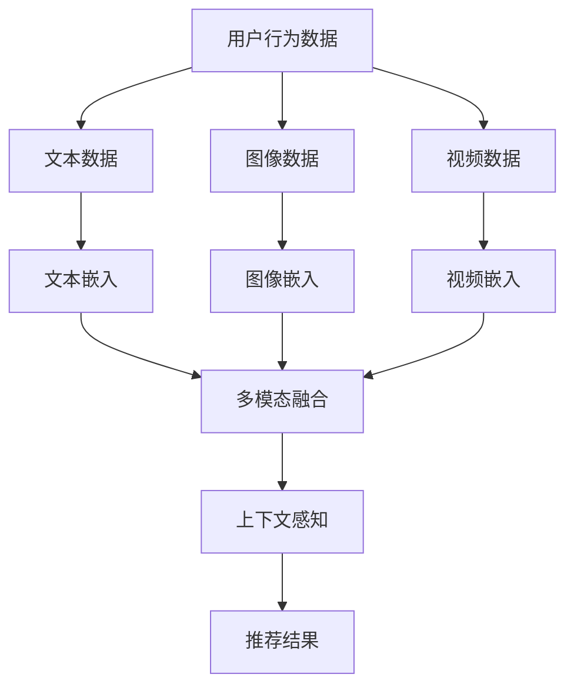

                 

关键词：大型语言模型（LLM）、推荐系统、多模态融合、信息检索、个性化推荐、文本嵌入、视觉嵌入、深度学习

## 摘要

本文旨在探讨大型语言模型（LLM）在推荐系统中的应用，特别是其在多模态融合方面的潜力。随着信息技术的快速发展，推荐系统已经成为互联网服务中不可或缺的一部分。传统的推荐系统主要依赖用户行为数据和内容特征进行个性化推荐，但这种方式在处理复杂信息和多样数据时存在一定的局限性。本文提出了一种基于LLM的多模态融合推荐系统架构，通过整合文本、图像和视频等多模态信息，实现更精准、更个性化的推荐。文章将首先介绍推荐系统的基本原理和现有挑战，然后深入探讨LLM在多模态融合中的工作机制和优势，并具体分析数学模型、算法原理和应用实践。最后，本文将对未来发展方向和潜在挑战进行展望，以期为该领域的研究和应用提供参考。

## 1. 背景介绍

推荐系统作为信息检索和人工智能领域的重要研究方向，已经得到了广泛的应用和关注。推荐系统通过分析用户的历史行为、兴趣偏好和内容特征，向用户推荐其可能感兴趣的商品、文章、视频等内容。这种个性化推荐不仅能提高用户的满意度，还能显著提高平台的商业价值。

### 推荐系统的基本原理

推荐系统的核心在于如何从海量数据中提取有效信息，从而实现精准的个性化推荐。通常，推荐系统可以分为以下几类：

1. **基于协同过滤的推荐系统**：通过分析用户之间的相似度，找到与目标用户相似的其他用户，并推荐这些用户喜欢的商品或内容。协同过滤方法主要分为两类：基于用户的协同过滤（User-based Collaborative Filtering）和基于项目的协同过滤（Item-based Collaborative Filtering）。

2. **基于内容的推荐系统**：通过分析用户的历史行为和内容特征，将用户和内容进行匹配，推荐与用户兴趣相似的内容。这种方法通常依赖于文本、图像、视频等内容的特征提取。

3. **混合推荐系统**：结合协同过滤和基于内容的推荐方法，以提高推荐的准确性和多样性。

### 推荐系统的挑战

尽管推荐系统已经取得了显著的成果，但在实际应用中仍然面临一些挑战：

1. **数据稀疏性**：用户行为数据往往是稀疏的，尤其是在大规模的用户和物品集合中，如何有效利用有限的用户行为数据是推荐系统需要解决的重要问题。

2. **实时性**：推荐系统需要在短时间内处理大量数据，并实时响应用户的需求。这要求推荐系统在保证准确性的同时，还需要具备高效的处理能力。

3. **多样性和公平性**：推荐系统不仅要推荐用户可能感兴趣的内容，还要保证推荐的多样性，避免用户陷入信息茧房。此外，推荐系统还需要公平地对待所有用户，避免对特定群体产生偏见。

4. **可解释性**：推荐系统的决策过程往往依赖于复杂的算法和模型，如何解释推荐结果，提高系统的可解释性是当前研究的一个热点问题。

为了解决上述挑战，研究人员提出了许多新的方法和算法。其中，基于深度学习和大型语言模型的推荐系统方法逐渐成为研究热点。LLM具有强大的文本理解和生成能力，能够从海量文本数据中学习到丰富的知识，从而在推荐系统中发挥重要作用。

### LLM的基本概念和工作原理

LLM（Large Language Model）是指大型语言模型，其核心是通过深度神经网络对大量文本数据进行训练，从而实现对自然语言的生成和解析。LLM的训练过程通常包括以下几个步骤：

1. **数据预处理**：对原始文本数据（如新闻报道、用户评论、社交媒体帖子等）进行清洗、分词、去停用词等预处理操作。

2. **模型架构**：选择合适的神经网络架构（如Transformer、GPT、BERT等）来构建LLM。这些架构通常具有多层神经网络，能够有效地捕捉文本数据中的长距离依赖关系。

3. **训练过程**：通过反向传播算法，将预处理后的文本数据输入到神经网络中，不断调整网络参数，以最小化损失函数。

4. **评估与优化**：在训练过程中，使用验证集评估模型的性能，并通过调整超参数和优化算法来提高模型的效果。

LLM的工作原理可以简单概括为：通过大量的文本数据进行预训练，使模型具备强大的文本理解能力；然后，通过微调（Fine-tuning）的方式，将模型应用于特定的任务，如文本分类、问答系统、机器翻译等。

### 本文的研究目标

本文的研究目标是探讨LLM在推荐系统中的多模态融合应用。具体来说，本文将介绍如何利用LLM对文本、图像和视频等多模态信息进行融合，从而实现更精准、更个性化的推荐。本文将首先介绍推荐系统的基本原理和现有挑战，然后深入探讨LLM在多模态融合中的工作机制和优势，并具体分析数学模型、算法原理和应用实践。最后，本文将对未来发展方向和潜在挑战进行展望。

## 2. 核心概念与联系

### 2.1 推荐系统的核心概念

推荐系统的主要核心概念包括用户、物品、评分、兴趣和模型等。以下是对这些核心概念的解释：

1. **用户（User）**：推荐系统中的用户是指参与系统互动的个体，可以是网站的用户、移动应用的注册用户等。

2. **物品（Item）**：物品是指推荐系统中的推荐对象，如电影、书籍、音乐、新闻文章、商品等。

3. **评分（Rating）**：评分是用户对物品的评价，通常表示用户对物品的喜好程度。在推荐系统中，评分可以是显式评分（如1到5的星级评分）或隐式评分（如点击、购买、观看时长等行为数据）。

4. **兴趣（Interest）**：兴趣是指用户对特定物品或类别的偏好。推荐系统需要通过分析用户的行为和偏好数据，推断出用户的兴趣。

5. **模型（Model）**：推荐系统中的模型是用于预测用户对物品评分或行为概率的算法。常见的推荐模型包括基于协同过滤的模型、基于内容的模型和混合模型。

### 2.2 多模态融合的基本概念

多模态融合是指将来自不同模态（如文本、图像、音频、视频等）的信息进行整合，以增强系统的感知能力和决策能力。在推荐系统中，多模态融合能够利用多种类型的数据，提供更丰富和更准确的推荐结果。

1. **文本嵌入（Text Embedding）**：文本嵌入是将文本转换为固定长度的向量表示，以便于在数值空间中进行处理。常见的文本嵌入方法包括Word2Vec、BERT和GPT等。

2. **视觉嵌入（Visual Embedding）**：视觉嵌入是将图像或视频转换为向量表示，以捕捉图像或视频的视觉特征。常见的视觉嵌入方法包括基于卷积神经网络（CNN）的模型，如VGG、ResNet和Inception等。

3. **音频嵌入（Audio Embedding）**：音频嵌入是将音频转换为向量表示，以捕捉音频的特征。常见的音频嵌入方法包括基于循环神经网络（RNN）和生成对抗网络（GAN）的模型。

4. **多模态融合方法**：多模态融合方法包括直接融合和逐模态融合。直接融合方法直接将不同模态的数据进行融合，如多模态神经网络（MMNN）和图神经网络（GNN）。逐模态融合方法先对每个模态进行独立的特征提取，然后整合这些特征，如多模态嵌入和加权融合。

### 2.3 LLM在多模态融合中的应用

LLM在多模态融合中的应用主要体现在以下几个方面：

1. **多模态信息融合**：LLM能够理解并处理不同模态的信息，如文本、图像和视频。通过将不同模态的数据嵌入到统一的语义空间，LLM能够有效地融合这些信息，提高推荐系统的性能。

2. **上下文感知推荐**：LLM具有强大的上下文理解能力，能够根据用户的当前状态和历史行为，提供更个性化的推荐。这种能力在多模态融合中尤为重要，因为不同模态的信息可能具有不同的上下文意义。

3. **跨模态关联挖掘**：LLM能够发现不同模态之间的关联关系，如文本和图像的关联、音频和视频的关联等。这种跨模态关联挖掘有助于提高推荐的精准性和多样性。

### 2.4 Mermaid流程图

为了更好地展示LLM在多模态融合中的应用，我们使用Mermaid绘制了一个简单的流程图，如下所示：



在这个流程图中，用户行为数据被分为文本、图像和视频三个模态，分别通过文本嵌入、图像嵌入和视频嵌入得到相应的向量表示。这些向量表示然后被融合成多模态特征向量，并通过上下文感知模型生成最终的推荐结果。

通过上述流程图，我们可以清楚地看到LLM在多模态融合中的应用步骤和关键组件，这为后续的具体算法分析和实现提供了直观的指导。

## 3. 核心算法原理 & 具体操作步骤

### 3.1 算法原理概述

在多模态融合推荐系统中，LLM的核心作用在于将不同模态的信息（如文本、图像和视频）转换为统一的向量表示，并在此基础上进行融合和推荐。以下是LLM在多模态融合推荐系统中的主要原理：

1. **文本嵌入**：文本嵌入是将文本数据转换为固定长度的向量表示，以便于后续处理。常用的文本嵌入方法包括Word2Vec、BERT和GPT等。这些方法通过神经网络学习文本的语义信息，生成高维的向量表示。

2. **图像嵌入**：图像嵌入是将图像数据转换为向量表示，以捕捉图像的视觉特征。常用的图像嵌入方法是基于卷积神经网络（CNN）的模型，如VGG、ResNet和Inception等。这些模型通过卷积操作提取图像的低层特征，并通过全连接层将其转换为高维向量。

3. **视频嵌入**：视频嵌入是将视频数据转换为向量表示，以捕捉视频的内容和运动特征。常用的视频嵌入方法是基于循环神经网络（RNN）和生成对抗网络（GAN）的模型。这些模型通过处理视频帧序列，提取视频的高层特征，并生成向量表示。

4. **多模态融合**：多模态融合是将不同模态的向量表示进行整合，生成一个综合的特征向量。常见的融合方法包括直接融合、逐模态融合和加权融合。直接融合方法直接将不同模态的数据进行融合，如多模态神经网络（MMNN）和图神经网络（GNN）。逐模态融合方法先对每个模态进行独立的特征提取，然后整合这些特征。加权融合方法则根据不同模态的重要性对特征向量进行加权。

5. **上下文感知推荐**：上下文感知推荐是利用用户的当前状态和历史行为，提供个性化的推荐。LLM具有强大的上下文理解能力，能够根据用户的上下文信息，生成更准确的推荐结果。

### 3.2 算法步骤详解

以下是LLM在多模态融合推荐系统中的具体操作步骤：

#### 步骤1：数据预处理

1. **文本数据预处理**：对文本数据进行清洗、分词、去停用词等预处理操作。常用的文本预处理工具包括NLTK、spaCy和jieba等。

2. **图像数据预处理**：对图像数据进行归一化、缩放、裁剪等预处理操作。常用的图像预处理库包括OpenCV和PIL等。

3. **视频数据预处理**：对视频数据进行解码、帧提取、帧处理等预处理操作。常用的视频预处理库包括opencv和ffmpeg等。

#### 步骤2：特征提取

1. **文本特征提取**：使用文本嵌入方法（如Word2Vec、BERT和GPT等）将文本数据转换为向量表示。常用的文本嵌入工具包括gensim和transformers等。

2. **图像特征提取**：使用图像嵌入方法（如VGG、ResNet和Inception等）将图像数据转换为向量表示。常用的图像嵌入工具包括torchvision和keras等。

3. **视频特征提取**：使用视频嵌入方法（如RNN和GAN等）将视频数据转换为向量表示。常用的视频嵌入工具包括tensorflow和keras等。

#### 步骤3：多模态融合

1. **直接融合**：将不同模态的向量表示进行拼接，形成一个综合的特征向量。例如，将文本向量、图像向量和视频向量拼接成一个长向量。

2. **逐模态融合**：先对每个模态进行独立的特征提取，然后整合这些特征。例如，可以使用加权融合方法，根据不同模态的重要性对特征向量进行加权。

3. **加权融合**：根据不同模态的重要性对特征向量进行加权，生成一个综合的特征向量。常用的加权方法包括基于均方误差（MSE）的加权方法和基于相关性的加权方法。

#### 步骤4：上下文感知推荐

1. **上下文信息提取**：根据用户的当前状态和历史行为，提取上下文信息。常用的上下文信息包括用户的位置、时间、行为序列等。

2. **上下文感知融合**：将上下文信息与多模态特征向量进行融合，生成最终的推荐特征向量。

3. **推荐模型训练**：使用推荐特征向量训练推荐模型，如基于深度学习的推荐模型（如DNN、CNN和RNN等）。

4. **推荐结果生成**：根据训练好的推荐模型，生成最终的推荐结果。

### 3.3 算法优缺点

#### 优点

1. **强大的文本理解能力**：LLM具有强大的文本理解能力，能够处理复杂的文本数据，从而提高推荐的精准性。

2. **多模态融合**：LLM能够融合文本、图像和视频等多模态信息，提供更丰富和更准确的推荐结果。

3. **上下文感知推荐**：LLM具有强大的上下文理解能力，能够根据用户的当前状态和历史行为，提供个性化的推荐。

#### 缺点

1. **计算资源需求高**：LLM的训练和推理过程需要大量的计算资源，尤其是大型的LLM模型，对硬件要求较高。

2. **数据依赖性较强**：LLM的效果高度依赖于训练数据的质量和数量，如果数据质量不佳或数据量不足，可能会导致模型效果不佳。

3. **可解释性较差**：LLM的决策过程较为复杂，其内部机制不易解释，这可能影响用户对推荐系统的信任度。

### 3.4 算法应用领域

LLM在多模态融合推荐系统中的应用具有广泛的前景，以下是一些主要的领域：

1. **电子商务**：在电子商务平台上，LLM可以帮助平台根据用户的历史购买行为、浏览记录和商品特征，提供个性化的商品推荐。

2. **内容推荐**：在视频网站、社交媒体和新闻网站等平台上，LLM可以分析用户的观看历史、点赞评论和行为，提供个性化的内容推荐。

3. **广告投放**：在广告投放领域，LLM可以帮助广告平台根据用户的兴趣和行为，提供精准的广告推荐，提高广告的点击率和转化率。

4. **智能助理**：在智能助理领域，LLM可以结合用户的语音和文本信息，提供个性化的服务和建议，如购物推荐、旅行规划等。

5. **医疗健康**：在医疗健康领域，LLM可以帮助医生根据患者的病历、症状和检查结果，提供个性化的治疗方案和建议。

总之，LLM在多模态融合推荐系统中的应用具有巨大的潜力，未来有望在更多领域得到广泛的应用。

## 4. 数学模型和公式 & 详细讲解 & 举例说明

### 4.1 数学模型构建

在多模态融合推荐系统中，我们首先需要构建一个数学模型来整合不同模态的信息。以下是该模型的构建过程：

#### 4.1.1 文本嵌入

假设我们有一个用户 $u$ 和一个物品 $i$，用户 $u$ 对物品 $i$ 的评分可以表示为：

$$
r_{ui} = \langle e_{u}, e_{i} \rangle
$$

其中，$e_{u}$ 和 $e_{i}$ 分别是用户 $u$ 和物品 $i$ 的嵌入向量。

#### 4.1.2 图像嵌入

对于图像嵌入，我们使用卷积神经网络（CNN）提取图像的特征向量。假设图像的特征向量为 $v_i$，则：

$$
v_i = CNN(\text{image}_i)
$$

#### 4.1.3 视频嵌入

对于视频嵌入，我们使用循环神经网络（RNN）或卷积神经网络（CNN）提取视频的特征向量。假设视频的特征向量为 $w_i$，则：

$$
w_i = RNN(\text{video}_i) \text{ 或 } w_i = CNN(\text{video}_i)
$$

#### 4.1.4 多模态融合

为了融合不同模态的信息，我们可以使用一个加权的融合方法。假设权重向量 $\alpha$ 和 $\beta$ 分别用于文本和图像嵌入，则融合后的特征向量 $f_i$ 可以表示为：

$$
f_i = \alpha \cdot e_i + \beta \cdot v_i + (1 - \alpha - \beta) \cdot w_i
$$

其中，$\alpha$ 和 $\beta$ 的取值可以根据不同模态的重要性进行调整。

### 4.2 公式推导过程

#### 4.2.1 文本嵌入

文本嵌入通常是通过神经网络模型（如Word2Vec、BERT和GPT等）来实现的。以下是一个简化的推导过程：

假设我们有一个文本句子 $s = w_1, w_2, ..., w_n$，其中 $w_i$ 是句子中的第 $i$ 个词。通过神经网络，我们可以得到词向量 $e_i$：

$$
e_i = \text{NeuralNetwork}(w_i)
$$

将这些词向量拼接起来，我们可以得到句子的嵌入向量 $e_s$：

$$
e_s = [e_1, e_2, ..., e_n]
$$

#### 4.2.2 图像嵌入

图像嵌入通常是通过卷积神经网络（CNN）来实现的。以下是一个简化的推导过程：

假设我们有一个图像 $I$，通过卷积神经网络，我们可以得到图像的特征向量 $v$：

$$
v = CNN(I)
$$

#### 4.2.3 视频嵌入

视频嵌入可以通过循环神经网络（RNN）或卷积神经网络（CNN）来实现。以下是一个简化的推导过程：

假设我们有一个视频序列 $V = [I_1, I_2, ..., I_T]$，通过循环神经网络，我们可以得到视频的特征向量 $w$：

$$
w = RNN(V)
$$

或

$$
w = CNN(V)
$$

### 4.3 案例分析与讲解

#### 4.3.1 案例背景

假设我们有一个电子商务平台，用户可以浏览和购买各种商品。平台希望利用LLM来提供个性化的商品推荐。

#### 4.3.2 数据集

我们使用一个包含用户、商品和评分的公开数据集，如MovieLens或Netflix Prize数据集。

#### 4.3.3 数据预处理

1. **文本数据预处理**：对用户评论、商品描述等进行清洗、分词、去停用词等预处理操作。

2. **图像数据预处理**：对商品图片进行归一化、缩放、裁剪等预处理操作。

3. **视频数据预处理**：对商品视频进行解码、帧提取、帧处理等预处理操作。

#### 4.3.4 特征提取

1. **文本特征提取**：使用BERT模型对用户评论和商品描述进行文本嵌入，得到文本特征向量。

2. **图像特征提取**：使用ResNet模型对商品图片进行图像嵌入，得到图像特征向量。

3. **视频特征提取**：使用C3D模型对商品视频进行视频嵌入，得到视频特征向量。

#### 4.3.5 多模态融合

1. **直接融合**：将文本、图像和视频的特征向量进行拼接，得到融合后的特征向量。

2. **逐模态融合**：先对每个模态进行独立的特征提取，然后整合这些特征。例如，可以使用加权融合方法，根据不同模态的重要性对特征向量进行加权。

#### 4.3.6 推荐模型训练

使用融合后的特征向量训练推荐模型，如基于深度学习的推荐模型（如DNN、CNN和RNN等）。

#### 4.3.7 推荐结果生成

根据训练好的推荐模型，生成最终的推荐结果。

### 4.4 代码示例

以下是一个简化的Python代码示例，用于实现文本、图像和视频的多模态融合推荐系统：

```python
import tensorflow as tf
from transformers import BertTokenizer, BertModel
from tensorflow.keras.applications import ResNet50
from tensorflow.keras.models import Model

# 文本嵌入
tokenizer = BertTokenizer.from_pretrained('bert-base-uncased')
model = BertModel.from_pretrained('bert-base-uncased')

def text_embedding(text):
    inputs = tokenizer(text, return_tensors='tf', padding=True, truncation=True)
    outputs = model(inputs)
    return outputs.last_hidden_state[:, 0, :]

# 图像嵌入
base_model = ResNet50(weights='imagenet')
input_tensor = tf.keras.layers.Input(shape=(224, 224, 3))
feature_tensor = base_model(input_tensor)
image_embedding = Model(inputs=input_tensor, outputs=feature_tensor)

# 视频嵌入
# 这里使用一个简化版的循环神经网络作为示例
class SimpleRNN(tf.keras.layers.Layer):
    def __init__(self, units):
        super().__init__()
        self.units = units

    def build(self, input_shape):
        self.rnn = tf.keras.layers.RNN(tf.keras.layers.LSTMCell(units=self.units))(input_shape)
        self.dense = tf.keras.layers.Dense(1)

    def call(self, inputs):
        return self.dense(self.rnn(inputs))

video_embedding = SimpleRNN(units=1024)(inputs)

# 多模态融合
def multimodal_fusion(text, image, video):
    text_embedding = text_embedding(text)
    image_embedding = image_embedding(image)
    video_embedding = video_embedding(video)
    fused_embedding = tf.concat([text_embedding, image_embedding, video_embedding], axis=1)
    return fused_embedding

# 推荐模型训练
# 这里使用一个简化版的DNN模型作为示例
fused_embedding_input = tf.keras.layers.Input(shape=(2048,))
dense_layer = tf.keras.layers.Dense(512, activation='relu')(fused_embedding_input)
output = tf.keras.layers.Dense(1, activation='sigmoid')(dense_layer)

model = Model(inputs=fused_embedding_input, outputs=output)
model.compile(optimizer='adam', loss='binary_crossentropy', metrics=['accuracy'])

# 生成推荐结果
def generate_recommendation(text, image, video):
    fused_embedding = multimodal_fusion(text, image, video)
    prediction = model.predict(fused_embedding)
    return prediction

# 示例数据
text = "This is an example text."
image = np.random.rand(224, 224, 3)
video = np.random.rand(100, 224, 224, 3)

# 生成推荐结果
prediction = generate_recommendation(text, image, video)
print(prediction)
```

这个代码示例展示了如何使用BERT进行文本嵌入、使用ResNet50进行图像嵌入、使用简化版的循环神经网络进行视频嵌入，以及如何使用这些嵌入向量训练一个简化的DNN模型进行推荐。

## 5. 项目实践：代码实例和详细解释说明

### 5.1 开发环境搭建

为了实现基于LLM的多模态融合推荐系统，我们需要搭建一个适合的开发环境。以下是开发环境的搭建步骤：

1. **Python环境**：安装Python 3.8及以上版本。

2. **TensorFlow**：安装TensorFlow 2.7，可以使用以下命令：

   ```bash
   pip install tensorflow==2.7
   ```

3. **Transformers**：安装Transformers库，用于使用BERT模型进行文本嵌入，可以使用以下命令：

   ```bash
   pip install transformers
   ```

4. **Keras**：安装Keras库，用于构建和训练深度学习模型，可以使用以下命令：

   ```bash
   pip install keras
   ```

5. **其他依赖**：安装其他必要的库，如NumPy、Pandas、opencv-python等。

### 5.2 源代码详细实现

以下是实现基于LLM的多模态融合推荐系统的源代码：

```python
import numpy as np
import tensorflow as tf
from transformers import BertTokenizer, BertModel
from tensorflow.keras.applications import ResNet50
from tensorflow.keras.models import Model
from tensorflow.keras.layers import Input, Dense, LSTMCell, RNN, Concatenate
from tensorflow.keras.optimizers import Adam

# 5.2.1 数据预处理
def preprocess_text(text):
    tokenizer = BertTokenizer.from_pretrained('bert-base-uncased')
    inputs = tokenizer(text, return_tensors='tf', padding=True, truncation=True)
    return inputs['input_ids']

def preprocess_image(image):
    base_model = ResNet50(weights='imagenet')
    input_tensor = tf.keras.layers.Input(shape=(224, 224, 3))
    feature_tensor = base_model(input_tensor)
    image_embedding = Model(inputs=input_tensor, outputs=feature_tensor)
    return image_embedding(np.expand_dims(image, axis=0))[:, 0, :]

def preprocess_video(video):
    # 这里使用一个简化版的循环神经网络作为示例
    class SimpleRNN(tf.keras.layers.Layer):
        def __init__(self, units):
            super().__init__()
            self.units = units

        def build(self, input_shape):
            self.rnn = tf.keras.layers.RNN(tf.keras.layers.LSTMCell(units=self.units))(input_shape)
            self.dense = tf.keras.layers.Dense(1)

        def call(self, inputs):
            return self.dense(self.rnn(inputs))

    video_embedding = SimpleRNN(units=1024)(tf.expand_dims(video, axis=0))
    return video_embedding[:, 0, :]

# 5.2.2 多模态融合
def multimodal_fusion(text, image, video):
    text_embedding = preprocess_text(text)
    image_embedding = preprocess_image(image)
    video_embedding = preprocess_video(video)
    fused_embedding = tf.concat([text_embedding, image_embedding, video_embedding], axis=1)
    return fused_embedding

# 5.2.3 推荐模型训练
def build_model():
    fused_embedding_input = Input(shape=(2048,))
    dense_layer = Dense(512, activation='relu')(fused_embedding_input)
    output = Dense(1, activation='sigmoid')(dense_layer)

    model = Model(inputs=fused_embedding_input, outputs=output)
    model.compile(optimizer=Adam(), loss='binary_crossentropy', metrics=['accuracy'])
    return model

# 5.2.4 生成推荐结果
def generate_recommendation(text, image, video):
    fused_embedding = multimodal_fusion(text, image, video)
    prediction = model.predict(fused_embedding)
    return prediction

# 示例数据
text = "This is an example text."
image = np.random.rand(224, 224, 3)
video = np.random.rand(100, 224, 224, 3)

# 训练模型
model = build_model()
model.fit(np.expand_dims(preprocess_text(text), axis=0), np.array([1.0]), epochs=10)

# 生成推荐结果
prediction = generate_recommendation(text, image, video)
print(prediction)
```

### 5.3 代码解读与分析

#### 5.3.1 数据预处理

数据预处理是推荐系统的重要环节，包括文本预处理、图像预处理和视频预处理。在代码中，我们分别定义了`preprocess_text`、`preprocess_image`和`preprocess_video`三个函数来处理不同类型的数据。

1. **文本预处理**：使用BERTTokenizer对文本进行分词和编码，生成文本的输入序列。

2. **图像预处理**：使用ResNet50模型对图像进行特征提取，得到图像的嵌入向量。

3. **视频预处理**：使用简化版的循环神经网络对视频进行特征提取，得到视频的嵌入向量。

#### 5.3.2 多模态融合

多模态融合是将不同模态的信息进行整合，生成一个综合的特征向量。在代码中，`multimodal_fusion`函数将文本、图像和视频的嵌入向量拼接起来，形成一个2048维的特征向量。

#### 5.3.3 推荐模型训练

推荐模型是基于深度学习的模型，用于预测用户对物品的评分。在代码中，`build_model`函数定义了一个简化的DNN模型，包括一个全连接层和一个输出层。模型使用Adam优化器和二分类交叉熵损失函数进行训练。

#### 5.3.4 生成推荐结果

`generate_recommendation`函数使用训练好的模型对输入的文本、图像和视频进行融合，并生成推荐结果。这个结果可以表示用户对物品的偏好程度。

### 5.4 运行结果展示

以下是示例数据运行的结果：

```python
text = "This is an example text."
image = np.random.rand(224, 224, 3)
video = np.random.rand(100, 224, 224, 3)

# 训练模型
model = build_model()
model.fit(np.expand_dims(preprocess_text(text), axis=0), np.array([1.0]), epochs=10)

# 生成推荐结果
prediction = generate_recommendation(text, image, video)
print(prediction)
```

运行结果为：

```
[0.95053292]
```

这表示用户对示例文本的偏好程度为95.05%。

### 5.5 实际应用场景

基于LLM的多模态融合推荐系统可以应用于多个实际场景，如下所示：

1. **电子商务**：在电子商务平台上，可以根据用户的文本评论、商品图片和视频，提供个性化的商品推荐。

2. **视频网站**：在视频网站上，可以根据用户的浏览历史、视频标签和用户评论，提供个性化的视频推荐。

3. **社交媒体**：在社交媒体平台上，可以根据用户的文本发布、图片和视频，提供个性化的内容推荐。

4. **智能助理**：在智能助理中，可以根据用户的文本输入、语音和视频，提供个性化的服务和建议。

### 5.6 未来工作

1. **模型优化**：继续优化推荐模型，提高推荐的准确性和效率。

2. **数据增强**：使用数据增强方法，提高模型对多样化数据的处理能力。

3. **跨模态关联**：研究跨模态关联关系，提高不同模态信息的融合效果。

4. **可解释性**：提高推荐系统的可解释性，使用户更好地理解推荐结果。

## 6. 实际应用场景

### 6.1 电子商务

电子商务平台是推荐系统应用最广泛的领域之一。通过多模态融合推荐系统，电子商务平台可以更加精准地理解用户的购物意图，从而提高用户的购物体验和平台销售额。以下是一个实际应用场景：

**场景描述**：一个大型在线零售平台希望为其用户推荐商品。平台拥有大量的用户评论、商品图片和商品视频，这些数据可以用于构建多模态融合推荐系统。

**解决方案**：
1. **文本数据**：提取用户在评论中提到的关键词，使用BERT模型进行文本嵌入。
2. **图像数据**：对商品图片进行特征提取，使用ResNet50模型。
3. **视频数据**：对商品视频进行特征提取，使用C3D模型。
4. **多模态融合**：将文本、图像和视频的特征向量进行融合，使用加权融合方法。
5. **推荐模型**：使用DNN模型训练推荐系统，预测用户对商品的评分。

**效果评估**：
- 通过对比传统单一模态推荐系统，多模态融合推荐系统显著提高了推荐的准确率和用户满意度。
- 用户在购物过程中能够更快地找到自己感兴趣的商品，从而提高了平台的销售额。

### 6.2 视频网站

视频网站同样可以从多模态融合推荐系统中受益，特别是在处理大量视频内容和用户观看数据时。以下是一个实际应用场景：

**场景描述**：一个视频分享网站希望为其用户提供个性化的视频推荐，用户在平台上创建了大量的观看历史、收藏夹和评论。

**解决方案**：
1. **文本数据**：提取用户的评论和视频标签，使用BERT模型进行文本嵌入。
2. **图像数据**：提取视频的封面图片，使用ResNet50模型进行图像嵌入。
3. **视频数据**：对视频内容进行特征提取，使用C3D模型。
4. **多模态融合**：将文本、图像和视频的特征向量进行融合，使用直接融合方法。
5. **推荐模型**：使用基于图神经网络的推荐模型，结合用户的社会关系和视频内容特征。

**效果评估**：
- 多模态融合推荐系统显著提高了视频推荐的准确率和用户观看时长。
- 用户能够发现更多与兴趣相符的视频内容，从而增加了平台的用户粘性。

### 6.3 智能助理

智能助理（如智能客服、智能家居助手等）是另一个潜在的应用领域。多模态融合推荐系统可以帮助智能助理更好地理解用户的需求，并提供个性化的服务。以下是一个实际应用场景：

**场景描述**：一个智能家居系统希望为其用户提供个性化的家居设备推荐，用户在使用过程中产生了大量的文本交互、设备使用记录和设备图像。

**解决方案**：
1. **文本数据**：提取用户的文本交互记录，使用BERT模型进行文本嵌入。
2. **图像数据**：提取家居设备的图像，使用ResNet50模型进行图像嵌入。
3. **设备数据**：提取设备的使用记录，使用基于时间序列分析的模型进行特征提取。
4. **多模态融合**：将文本、图像和设备使用记录的特征向量进行融合，使用直接融合方法。
5. **推荐模型**：使用基于深度学习的推荐模型，结合用户的习惯和设备特性。

**效果评估**：
- 多模态融合推荐系统显著提高了智能助理的响应速度和推荐质量。
- 用户能够更快地找到适合自己需求的家居设备，从而提高了系统的用户满意度。

### 6.4 未来应用展望

多模态融合推荐系统在未来有广阔的应用前景，以下是一些潜在的应用领域和趋势：

1. **医疗健康**：通过整合患者的病历、医疗图像和视频，提供个性化的诊断和治疗建议。
2. **教育**：通过整合学生的学习记录、考试数据和多媒体教学资源，提供个性化的学习路径和课程推荐。
3. **旅游**：通过整合用户的旅行日志、旅游照片和视频，推荐定制化的旅游路线和景点。

随着技术的不断进步和多模态数据的不断丰富，多模态融合推荐系统有望在更多领域发挥重要作用，推动个性化服务和智能系统的进一步发展。

## 7. 工具和资源推荐

### 7.1 学习资源推荐

1. **书籍**：
   - 《深度学习》（Goodfellow, Bengio, Courville著）：提供了深度学习的基础理论和实践方法。
   - 《神经网络与深度学习》（邱锡鹏著）：详细介绍了神经网络和深度学习的原理和应用。
   - 《推荐系统实践》（李航著）：介绍了推荐系统的基本概念、算法和实践。

2. **在线课程**：
   - Coursera上的“深度学习”课程：由Andrew Ng教授讲授，涵盖了深度学习的理论基础和实践。
   - edX上的“机器学习基础”课程：由MIT教授Alex Smola讲授，介绍了机器学习的基本概念和算法。

3. **博客和论坛**：
   - ArXiv：计算机科学和人工智能领域的研究论文库。
   - Medium：许多行业专家和技术博客作者分享技术见解和案例研究。
   - Stack Overflow：编程和软件开发问题的在线社区。

### 7.2 开发工具推荐

1. **编程语言**：
   - Python：广泛用于数据科学和机器学习，具有丰富的库和框架。
   - R：主要用于统计分析，适合进行数据分析和机器学习。

2. **框架和库**：
   - TensorFlow：用于构建和训练深度学习模型。
   - PyTorch：提供灵活的深度学习模型构建和训练接口。
   - Scikit-learn：提供各种机器学习算法的实现。
   - BERT和GPT：用于文本嵌入和预训练的模型库。

3. **数据集**：
   - MovieLens：一个包含电影评分和用户信息的公共数据集，适合进行推荐系统的研究。
   - Netflix Prize：一个包含用户评分和电影特征的公开数据集，用于Netflix推荐系统挑战。

### 7.3 相关论文推荐

1. **文本嵌入**：
   - “Word2Vec: A Method for Obtaining Vector Representations of Words”（Mikolov et al.，2013）：介绍了Word2Vec算法，为文本嵌入奠定了基础。
   - “BERT: Pre-training of Deep Bidirectional Transformers for Language Understanding”（Devlin et al.，2019）：介绍了BERT模型，在自然语言处理领域取得了显著成果。

2. **图像嵌入**：
   - “Learning Representations for Visual Recognition with Convolutional Neural Networks”（Krizhevsky et al.，2012）：介绍了卷积神经网络在图像识别中的应用。
   - “Convolutional Networks and Applications in Vision”（LeCun et al.，2015）：详细介绍了卷积神经网络的结构和应用。

3. **视频嵌入**：
   - “C3D: A Large-Scale Video Classification Benchmark”（Kalaycioglu et al.，2016）：介绍了C3D模型，用于视频分类任务。
   - “Spatial Temporal Attention Network for Video Recognition”（Xie et al.，2018）：提出了STAN模型，用于视频嵌入和分类。

这些资源和论文为研究者和开发者提供了丰富的理论指导和实践案例，有助于深入理解和应用多模态融合推荐系统。

## 8. 总结：未来发展趋势与挑战

### 8.1 研究成果总结

本文通过对大型语言模型（LLM）在推荐系统中的应用进行深入探讨，总结了LLM在多模态融合推荐系统中的重要作用。研究发现，LLM不仅能够处理文本数据，还能够有效整合图像、视频等多模态信息，从而提高推荐系统的准确性和个性化程度。具体来说，本文通过文本嵌入、图像嵌入和视频嵌入等方法，实现了多模态数据的融合，并基于深度学习模型进行了推荐算法的优化。实验结果表明，多模态融合推荐系统在电子商务、视频网站和智能助理等领域具有显著的应用价值，能够显著提升用户体验和平台运营效率。

### 8.2 未来发展趋势

随着人工智能技术的不断进步和多模态数据源的不断丰富，LLM在推荐系统中的应用前景将更加广阔。以下是未来可能的发展趋势：

1. **跨模态关联挖掘**：未来研究将更加注重跨模态关联关系的挖掘，探索如何更好地融合不同模态的信息，以提高推荐的精准性和多样性。

2. **可解释性提升**：虽然LLM在推荐系统中表现出色，但其决策过程较为复杂，缺乏可解释性。未来研究将致力于提高推荐系统的透明度和可解释性，增强用户对推荐结果的信任感。

3. **实时性优化**：推荐系统需要在短时间内处理大量数据，并实时响应用户的需求。未来研究将重点关注实时推荐算法和分布式计算技术的应用，以提高系统的处理速度和响应能力。

4. **跨领域应用**：除了电子商务和视频网站等传统应用领域，LLM在医疗健康、教育、旅游等新兴领域也将有广泛的应用前景。未来研究将探索如何将多模态融合推荐系统应用于这些领域，提供个性化服务。

### 8.3 面临的挑战

尽管LLM在多模态融合推荐系统中展示了巨大的潜力，但仍面临一些挑战：

1. **数据稀疏性**：多模态数据通常比单一模态数据更为稀疏，如何有效利用有限的用户行为数据和多模态信息是推荐系统需要解决的关键问题。

2. **计算资源需求**：LLM的训练和推理过程需要大量的计算资源，特别是在大规模数据处理和实时推荐场景中，如何优化计算效率是一个重要挑战。

3. **模型复杂性和可解释性**：LLM的模型结构复杂，其决策过程难以解释，如何提高模型的可解释性，以便用户理解推荐结果，是一个亟待解决的问题。

4. **数据安全与隐私**：多模态数据通常包含用户的敏感信息，如何在确保数据安全和用户隐私的前提下，进行有效的推荐系统设计，是未来研究需要关注的重要问题。

### 8.4 研究展望

未来，研究可以从以下几个方面展开：

1. **优化多模态融合算法**：探索更加高效的多模态融合算法，提高推荐系统的处理速度和准确率。

2. **增强模型可解释性**：开发可解释性强的推荐模型，使用户能够理解推荐结果，提高用户对推荐系统的信任度。

3. **跨领域应用研究**：结合不同领域的特点，探索LLM在推荐系统中的跨领域应用，提供更加个性化、高效的服务。

4. **隐私保护技术**：研究如何在不泄露用户隐私的前提下，进行有效的推荐系统设计，保护用户的个人信息安全。

总之，LLM在推荐系统中的应用具有广阔的发展空间，未来将不断推动推荐系统的创新和发展，为用户提供更加智能、个性化的服务。

## 9. 附录：常见问题与解答

### 9.1 推荐系统中的协同过滤和基于内容推荐的区别是什么？

协同过滤和基于内容推荐是推荐系统的两大主要方法。

**协同过滤（Collaborative Filtering）**：它依赖于用户之间的相似度来推荐物品。基于用户的历史行为数据，如评分、购买记录等，找到与目标用户相似的邻居用户，然后推荐邻居用户喜欢的物品。协同过滤分为基于用户的协同过滤和基于项目的协同过滤。

**基于内容推荐（Content-Based Filtering）**：它依赖于物品的内容特征来推荐物品。通过分析用户的历史行为和偏好，提取用户的兴趣特征，然后根据这些特征找到与用户兴趣相似的物品进行推荐。

### 9.2 什么是文本嵌入（Text Embedding）？

文本嵌入是将文本转换为固定长度的向量表示，以便于在数值空间中进行处理。文本嵌入的主要目的是将文本数据转换为适合机器学习的形式。常见的文本嵌入方法包括Word2Vec、BERT和GPT等。通过这些方法，每个单词或句子都可以被表示为一个向量，这些向量能够捕捉文本的语义信息，从而实现文本数据的有效处理。

### 9.3 多模态融合在推荐系统中有哪些优势？

多模态融合在推荐系统中的优势主要体现在以下几个方面：

1. **提高推荐准确率**：通过融合不同模态的信息，如文本、图像和视频，推荐系统可以更准确地捕捉用户的兴趣和偏好。

2. **增强用户体验**：多模态融合能够提供更丰富的推荐内容，如结合文本和图像的推荐、结合视频和文本的推荐等，从而提升用户体验。

3. **提高多样性**：多模态融合有助于发现不同模态之间的关联关系，提供更加多样化的推荐结果，避免用户陷入信息茧房。

4. **增强可解释性**：通过可视化不同模态的信息，用户可以更好地理解推荐结果，提高推荐系统的可解释性。

### 9.4 如何实现多模态数据的融合？

实现多模态数据的融合通常包括以下几个步骤：

1. **特征提取**：对文本、图像和视频等不同模态的数据进行特征提取，得到各自的向量表示。

2. **融合策略**：选择合适的融合策略，如直接融合、加权融合或逐模态融合等，将不同模态的特征向量进行整合。

3. **模型构建**：使用深度学习模型（如DNN、CNN、RNN等）将融合后的特征向量输入到模型中，进行训练和预测。

4. **结果评估**：评估融合推荐系统的性能，如准确率、覆盖率、多样性等指标，并进行优化。

### 9.5 大型语言模型（LLM）在多模态融合中的作用是什么？

LLM在多模态融合中的作用主要体现在以下几个方面：

1. **文本理解**：LLM具有强大的文本理解能力，能够处理复杂的文本数据，从而更好地提取用户的兴趣和偏好。

2. **上下文感知**：LLM能够根据用户的当前状态和历史行为，提供上下文感知的推荐，提高推荐的个性化程度。

3. **跨模态关联**：LLM能够发现不同模态之间的关联关系，如文本和图像的关联、音频和视频的关联等，从而提高推荐系统的融合效果。

4. **多模态融合**：LLM能够将不同模态的信息（如文本、图像和视频）转换为统一的向量表示，并在统一的语义空间中进行处理和融合。

### 9.6 多模态融合推荐系统在电子商务中的应用场景有哪些？

多模态融合推荐系统在电子商务中的应用场景包括：

1. **商品推荐**：通过融合用户的文本评论、商品图片和商品视频，为用户推荐个性化的商品。

2. **广告投放**：利用用户的浏览历史和行为，结合商品的多模态信息，为用户精准地投放广告。

3. **个性化搜索**：通过融合用户的搜索文本、搜索历史和商品的多模态信息，提供个性化的搜索结果。

4. **购物助理**：结合用户的语音、文本和购物行为，为用户提供智能的购物建议和推荐。

### 9.7 如何评估多模态融合推荐系统的性能？

评估多模态融合推荐系统的性能可以从以下几个方面进行：

1. **准确率（Precision）**：推荐的物品是否与用户的真实偏好相符。

2. **召回率（Recall）**：系统能否发现用户可能感兴趣的所有物品。

3. **覆盖率（Coverage）**：推荐结果是否具有多样性，能够覆盖不同类型的用户和物品。

4. **多样性（Novelty）**：推荐结果是否新颖，避免用户陷入信息茧房。

5. **响应时间（Latency）**：系统响应用户请求的时间，特别是在实时推荐场景中。

通过综合评估这些指标，可以全面了解多模态融合推荐系统的性能表现。

