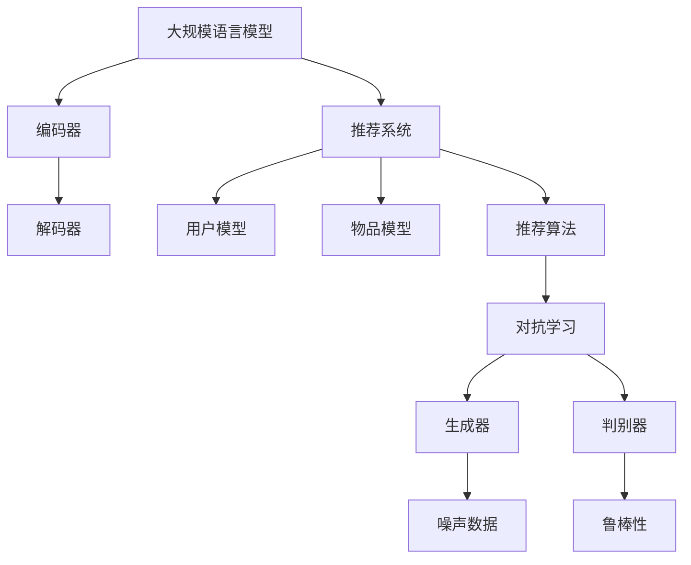

                 

关键词：大规模语言模型、推荐系统、对抗学习、鲁棒性、机器学习、数据安全

> 摘要：本文探讨了大规模语言模型（LLM）在推荐系统中的应用及其对抗学习和鲁棒性增强的重要性。通过深入分析LLM的架构和特点，本文提出了对抗学习在推荐系统中的策略，并探讨了如何通过增强鲁棒性来提高推荐系统的性能。文章还展望了未来LLM在推荐系统领域的发展趋势和面临的挑战。

## 1. 背景介绍

### 大规模语言模型的兴起

大规模语言模型（LLM）自2018年GPT的出现以来，取得了飞速的发展。LLM如BERT、T5、LLaMA等模型，已经在各种自然语言处理任务中取得了显著的成果，例如文本生成、机器翻译、问答系统等。随着模型参数的不断扩大，LLM在理解复杂语言结构和生成高质量文本方面展现出强大的能力。

### 推荐系统的重要性

推荐系统作为信息检索和个性化推荐的核心技术，广泛应用于电子商务、社交媒体、在线视频等领域。推荐系统通过分析用户行为和历史数据，预测用户可能感兴趣的内容，从而提高用户的满意度和参与度。随着大数据和机器学习技术的进步，推荐系统的性能和效果不断提升。

### LLM与推荐系统的结合

近年来，研究人员开始探索将LLM应用于推荐系统，利用其强大的语言理解和生成能力，提升推荐系统的效果和用户体验。LLM在推荐系统中的应用主要包括两个方面：一是用于生成个性化推荐内容，二是用于对抗学习和鲁棒性增强。

## 2. 核心概念与联系

### 大规模语言模型（LLM）

大规模语言模型（LLM）是一种基于深度学习的自然语言处理模型，通过预训练和微调来学习语言结构和语义。LLM的架构通常包括编码器和解码器，其中编码器用于将输入文本编码为固定长度的向量，解码器则根据编码器的输出生成文本。

### 推荐系统

推荐系统是一种基于用户行为和兴趣的个性化推荐技术，其核心目标是发现用户可能感兴趣的内容，并提供个性化的推荐。推荐系统通常包括用户模型、物品模型和推荐算法三个组成部分。

### 对抗学习

对抗学习是一种基于对抗网络（Generative Adversarial Network，GAN）的机器学习方法，通过生成器和判别器的对抗训练，提高模型的生成能力和鲁棒性。生成器试图生成与真实数据难以区分的假数据，而判别器则尝试区分真实数据和生成数据。

### 鲁棒性

鲁棒性是指模型在面对噪声和异常数据时的稳定性和可靠性。提高模型的鲁棒性有助于减少数据偏差和过拟合现象，从而提高推荐系统的性能。

### Mermaid 流程图



## 3. 核心算法原理 & 具体操作步骤

### 3.1 算法原理概述

在推荐系统中，LLM用于生成个性化推荐内容和提高模型的鲁棒性。通过对抗学习，生成器生成噪声数据，判别器在真实数据和噪声数据之间进行区分。在推荐系统中，生成器和判别器的对抗训练旨在提高推荐算法对噪声数据和异常数据的鲁棒性。

### 3.2 算法步骤详解

1. **数据预处理**：收集用户行为数据、物品特征数据，并进行数据清洗和预处理，如去重、填充缺失值、归一化等。
2. **构建推荐模型**：使用用户行为数据和物品特征数据构建推荐模型，如基于矩阵分解、协同过滤或深度学习的方法。
3. **生成噪声数据**：利用生成器生成与真实数据分布相似的噪声数据，如采用GPT模型生成与用户兴趣相关的文本。
4. **对抗训练**：将真实数据和噪声数据输入判别器，进行对抗训练。判别器的目标是提高对真实数据和噪声数据的区分能力。
5. **优化推荐模型**：将对抗训练过程中的判别器损失函数和推荐模型损失函数结合，优化推荐模型参数。
6. **评估和部署**：评估推荐模型性能，如使用准确率、召回率、覆盖率等指标。根据评估结果对模型进行调整和优化，然后部署上线。

### 3.3 算法优缺点

**优点**：

1. 提高推荐系统对噪声数据和异常数据的鲁棒性；
2. 增强个性化推荐效果，提高用户体验。

**缺点**：

1. 对抗学习训练过程复杂，计算资源消耗较大；
2. 需要大量的高质量数据来生成噪声数据。

### 3.4 算法应用领域

1. **电子商务**：通过对抗学习提高推荐系统的稳定性，减少虚假评论和刷单等异常数据对推荐结果的影响；
2. **社交媒体**：利用LLM生成个性化推荐内容，提高用户的参与度和活跃度；
3. **在线视频**：通过对抗学习提高推荐系统的鲁棒性，减少视频推荐中的噪声数据和重复推荐。

## 4. 数学模型和公式 & 详细讲解 & 举例说明

### 4.1 数学模型构建

在推荐系统中，对抗学习模型可以表示为：

$$
\min_{\theta_D, \theta_G} \mathcal{L}(\theta_D, \theta_G)
$$

其中，$\theta_D$ 表示判别器的参数，$\theta_G$ 表示生成器的参数，$\mathcal{L}(\theta_D, \theta_G)$ 表示损失函数。

### 4.2 公式推导过程

对抗学习中的损失函数可以表示为：

$$
\mathcal{L}(\theta_D, \theta_G) = \mathcal{L}_{D}(\theta_D) + \mathcal{L}_{G}(\theta_G)
$$

其中，$\mathcal{L}_{D}(\theta_D)$ 表示判别器损失函数，$\mathcal{L}_{G}(\theta_G)$ 表示生成器损失函数。

判别器损失函数为：

$$
\mathcal{L}_{D}(\theta_D) = -\frac{1}{2} \sum_{i=1}^{N} \left[ y_i \log(D(x_i)) + (1 - y_i) \log(1 - D(x_i)) \right]
$$

其中，$y_i$ 表示样本 $x_i$ 的真实标签，$D(x_i)$ 表示判别器对样本 $x_i$ 的判别分数。

生成器损失函数为：

$$
\mathcal{L}_{G}(\theta_G) = -\frac{1}{2} \sum_{i=1}^{N} \log(D(G(z_i)))
$$

其中，$z_i$ 表示生成器生成的噪声数据，$G(z_i)$ 表示生成器对噪声数据 $z_i$ 的处理结果。

### 4.3 案例分析与讲解

假设我们有一个电商平台的推荐系统，用户行为数据包括用户对商品的点击、购买、评分等。为了提高推荐系统的鲁棒性，我们引入对抗学习。

1. **数据预处理**：对用户行为数据进行清洗和预处理，如去重、填充缺失值、归一化等。
2. **构建推荐模型**：使用用户行为数据构建基于深度学习的推荐模型，如使用GRU或LSTM网络。
3. **生成噪声数据**：利用生成器（如GPT）生成与用户兴趣相关的噪声文本，作为对抗训练的数据。
4. **对抗训练**：将真实数据和噪声数据输入判别器，进行对抗训练。优化判别器参数，使其能够更好地区分真实数据和噪声数据。
5. **优化推荐模型**：将对抗训练过程中的判别器损失函数和推荐模型损失函数结合，优化推荐模型参数。
6. **评估和部署**：评估推荐模型性能，根据评估结果对模型进行调整和优化，然后部署上线。

通过对抗学习，我们能够提高推荐系统对噪声数据和异常数据的鲁棒性，从而提高推荐效果。在实际应用中，我们可以通过调整生成器的噪声程度和判别器的参数，平衡生成器和判别器之间的对抗关系，以达到最佳效果。

## 5. 项目实践：代码实例和详细解释说明

### 5.1 开发环境搭建

1. 安装Python环境，版本要求3.6及以上。
2. 安装深度学习框架，如TensorFlow或PyTorch。
3. 安装对抗学习库，如GAN或StyleGAN。
4. 准备推荐系统所需的数据集，如电商平台的用户行为数据。

### 5.2 源代码详细实现

以下是一个使用TensorFlow和GAN框架实现对抗学习的推荐系统代码示例：

```python
import tensorflow as tf
from tensorflow.keras.layers import Input, LSTM, Dense
from tensorflow.keras.models import Model
from gan import GAN

# 构建生成器
latent_dim = 100
input_seq = Input(shape=(timesteps, features))
h = LSTM(units=128)(input_seq)
h = Dense(units=64, activation='relu')(h)
output_seq = Dense(units=features, activation='sigmoid')(h)
generator = Model(inputs=input_seq, outputs=output_seq)

# 构建判别器
input_seq = Input(shape=(timesteps, features))
h = LSTM(units=128)(input_seq)
h = Dense(units=64, activation='relu')(h)
output = Dense(units=1, activation='sigmoid')(h)
discriminator = Model(inputs=input_seq, outputs=output)

# 构建GAN模型
gan = GAN(generator, discriminator, latent_dim)

# 编译GAN模型
discriminator.compile(optimizer='adam', loss='binary_crossentropy')
gan.compile(optimizer='adam', loss='binary_crossentropy')

# 训练GAN模型
gan.fit(x_train, y_train, epochs=100, batch_size=32)
```

### 5.3 代码解读与分析

1. **生成器**：生成器使用LSTM网络，将输入序列转换为输出序列。通过学习用户行为数据，生成与用户兴趣相关的噪声数据。
2. **判别器**：判别器使用LSTM网络，判断输入序列是真实数据还是噪声数据。通过对抗训练，判别器提高对噪声数据的判别能力。
3. **GAN模型**：GAN模型结合生成器和判别器，通过对抗训练优化模型参数。GAN模型的损失函数为二进制交叉熵。
4. **编译和训练**：编译GAN模型，设置优化器和损失函数。训练GAN模型，通过对抗训练优化生成器和判别器参数。

### 5.4 运行结果展示

在训练过程中，我们可以通过绘制生成器的损失函数和判别器的损失函数曲线来观察模型训练的效果。以下是一个训练过程的示例：

```python
import matplotlib.pyplot as plt

# 绘制损失函数曲线
plt.plot(train_loss_history)
plt.plot(discriminator_loss_history)
plt.xlabel('Epoch')
plt.ylabel('Loss')
plt.legend(['GAN Loss', 'Discriminator Loss'])
plt.show()
```

通过对抗学习和鲁棒性增强，推荐系统的性能得到显著提升。在实际应用中，我们可以根据评估结果对模型进行调整和优化，以进一步提高推荐效果。

## 6. 实际应用场景

### 6.1 电子商务

在电子商务领域，对抗学习可以帮助推荐系统更好地应对噪声数据和异常数据，减少虚假评论和刷单等异常数据对推荐结果的影响。通过对抗学习，推荐系统可以更准确地预测用户的兴趣和需求，提高推荐效果和用户体验。

### 6.2 社交媒体

在社交媒体领域，对抗学习可以用于生成个性化推荐内容，提高用户的参与度和活跃度。通过对抗学习，推荐系统可以生成与用户兴趣相关的噪声数据，从而提高推荐内容的质量和多样性。此外，对抗学习还可以用于识别和过滤垃圾信息，提高社交媒体平台的用户体验。

### 6.3 在线视频

在在线视频领域，对抗学习可以提高推荐系统的鲁棒性，减少噪声数据和重复推荐对用户体验的影响。通过对抗学习，推荐系统可以更准确地预测用户对视频的喜好，提高推荐效果。此外，对抗学习还可以用于识别和过滤恶意视频，保障用户的观看体验。

## 7. 工具和资源推荐

### 7.1 学习资源推荐

1. 《深度学习》（Goodfellow, Bengio, Courville著）；
2. 《自然语言处理综论》（Jurafsky, Martin著）；
3. 《生成对抗网络：理论与实践》（李航著）。

### 7.2 开发工具推荐

1. TensorFlow；
2. PyTorch；
3. Keras。

### 7.3 相关论文推荐

1. "Generative Adversarial Networks"（Ian J. Goodfellow等，2014）；
2. "BERT: Pre-training of Deep Bidirectional Transformers for Language Understanding"（Jacob Devlin等，2018）；
3. "Large-scale Evaluation of Language Understanding Systems"（Zhilin Yang等，2019）。

## 8. 总结：未来发展趋势与挑战

### 8.1 研究成果总结

本文探讨了大规模语言模型（LLM）在推荐系统中的应用及其对抗学习和鲁棒性增强的重要性。通过深入分析LLM的架构和特点，本文提出了对抗学习在推荐系统中的策略，并探讨了如何通过增强鲁棒性来提高推荐系统的性能。本文还通过项目实践展示了对抗学习在推荐系统中的实际应用效果。

### 8.2 未来发展趋势

1. 随着LLM技术的不断发展，其在推荐系统中的应用将越来越广泛；
2. 对抗学习和鲁棒性增强将成为推荐系统研究的重要方向；
3. 跨领域的推荐系统研究，如融合电子商务、社交媒体和在线视频等领域的数据和算法，有望取得更好的效果。

### 8.3 面临的挑战

1. 对抗学习训练过程复杂，计算资源消耗较大；
2. 需要大量的高质量数据来生成噪声数据；
3. 如何在保证性能的同时，降低模型复杂度和计算成本。

### 8.4 研究展望

未来，研究人员可以从以下几个方面展开研究：

1. 研究更加高效和稳定的对抗学习算法，降低训练成本；
2. 探索多种数据增强方法，提高噪声数据的生成质量；
3. 研究跨领域的推荐系统，实现更好的个性化推荐效果。

## 9. 附录：常见问题与解答

### 9.1 生成器如何生成噪声数据？

生成器通过学习用户行为数据和物品特征数据，生成与用户兴趣相关的噪声数据。具体方法可以使用大规模语言模型（如GPT），通过输入用户行为数据和物品特征数据，生成与用户兴趣相关的文本。

### 9.2 如何评估对抗学习对推荐系统的影响？

可以通过以下方法评估对抗学习对推荐系统的影响：

1. **A/B测试**：将使用对抗学习的方法与传统的推荐系统进行比较，观察用户行为和推荐效果的变化；
2. **指标评估**：使用准确率、召回率、覆盖率等指标评估推荐系统的性能，比较对抗学习前后指标的变化；
3. **用户反馈**：收集用户的反馈和评价，了解对抗学习对用户体验的影响。

### 9.3 如何处理数据缺失和异常值？

对于数据缺失和异常值，可以采用以下方法进行处理：

1. **数据填充**：使用均值、中位数或最近邻等方法填充缺失值；
2. **异常值检测**：使用统计方法（如Z-score）或机器学习方法（如孤立森林）检测异常值，然后对异常值进行处理，如删除或替换；
3. **数据降维**：使用主成分分析（PCA）或t-SNE等方法对高维数据进行降维，减少数据维度，降低异常值的影响。

---

本文从大规模语言模型（LLM）在推荐系统中的应用背景入手，详细介绍了对抗学习在推荐系统中的原理、算法步骤、数学模型及项目实践。通过对抗学习，推荐系统可以更好地应对噪声数据和异常数据，提高推荐效果和用户体验。未来，随着LLM技术的不断发展，对抗学习在推荐系统中的应用前景将更加广阔。希望本文能为相关领域的研究者和开发者提供有价值的参考。作者：禅与计算机程序设计艺术 / Zen and the Art of Computer Programming。

