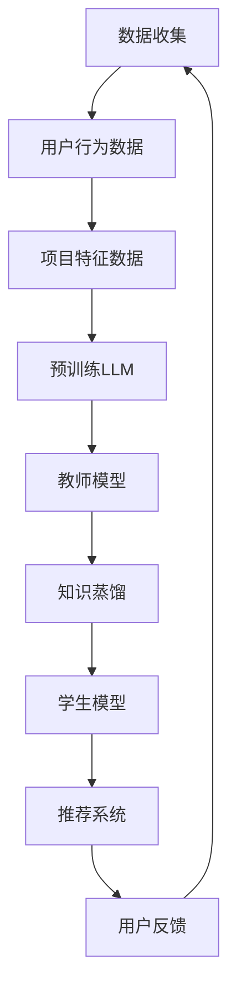

                 

关键词：Large Language Model，知识蒸馏，推荐系统，应用领域，算法原理，数学模型，项目实践，未来展望

> 摘要：本文将深入探讨Large Language Model（LLM）在推荐系统中的应用，特别是知识蒸馏技术在该领域的应用。通过详细分析算法原理、数学模型以及项目实践，本文旨在为读者提供一个全面了解和掌握这一技术的路径，并对未来发展趋势和挑战进行展望。

## 1. 背景介绍

推荐系统是现代信息检索和数据分析领域的重要组成部分，广泛应用于电子商务、社交媒体、新闻推送等领域。随着用户生成内容的爆炸性增长，如何有效地从海量数据中提取用户兴趣并给出个性化推荐成为了研究的焦点。传统的推荐系统通常依赖于基于内容的过滤、协同过滤等方法，但它们往往面临数据稀疏、用户兴趣多变等问题。近年来，深度学习技术的发展为解决这些问题提供了新的思路，特别是Large Language Model（LLM）的出现，使得对文本数据的理解和处理达到了前所未有的高度。

知识蒸馏是一种将大型模型（教师模型）的知识传递给小型模型（学生模型）的技术。这一技术主要应用于训练大型模型代价高昂，而实际应用场景需要小型模型的情况下。知识蒸馏通过从教师模型中提取有用的特征表示，并将其传递给学生模型，从而实现高效的知识转移。在推荐系统中，知识蒸馏的应用可以显著提高模型的性能，同时减少训练成本。

本文将围绕LLM在推荐系统中的知识蒸馏应用展开，首先介绍相关知识蒸馏的原理和过程，然后深入探讨在推荐系统中应用知识蒸馏的具体方法和效果，最后通过一个实际项目实例进行分析和总结。

## 2. 核心概念与联系

### 2.1 LLM简介

Large Language Model（LLM）是指具有强大语言处理能力的深度学习模型，如GPT（Generative Pre-trained Transformer）、BERT（Bidirectional Encoder Representations from Transformers）等。LLM通过在大规模语料库上进行预训练，获得了对自然语言的深刻理解，能够实现文本生成、情感分析、问答系统等多种应用。

### 2.2 知识蒸馏原理

知识蒸馏是一种模型压缩技术，通过将大型模型（教师模型）的知识传递给小型模型（学生模型），从而实现知识转移和模型压缩。知识蒸馏的基本思想是将教师模型的输出（通常是softmax概率分布）作为辅助信息，与原始输入和目标标签一起训练学生模型。这种技术可以有效地减少模型的参数量，同时保持较高的性能。

### 2.3 推荐系统简介

推荐系统是一种基于用户历史行为和内容的分析，向用户提供个性化推荐的系统。推荐系统通常包括三个关键组件：用户模型、项目模型和推荐算法。用户模型用于表示用户的兴趣和行为，项目模型用于表示推荐项目（如商品、新闻等）的特性，推荐算法则根据用户模型和项目模型生成推荐列表。

### 2.4 Mermaid 流程图

以下是一个简化的Mermaid流程图，展示了LLM在推荐系统中使用知识蒸馏的基本流程。



### 2.5 核心概念与联系

- **LLM：** 用于预训练和知识蒸馏，获取丰富的语言特征表示。
- **知识蒸馏：** 通过教师模型和学生模型之间的知识传递，实现模型压缩和性能提升。
- **推荐系统：** 利用LLM和知识蒸馏技术，为用户提供个性化推荐。

## 3. 核心算法原理 & 具体操作步骤

### 3.1 算法原理概述

知识蒸馏是一种模型压缩技术，通过将大型模型（教师模型）的知识传递给小型模型（学生模型），从而实现知识转移和模型压缩。在推荐系统中，知识蒸馏的应用可以显著提高模型的性能，同时减少训练成本。

知识蒸馏的基本思想是将教师模型的输出（通常是softmax概率分布）作为辅助信息，与原始输入和目标标签一起训练学生模型。这种技术可以有效地减少模型的参数量，同时保持较高的性能。

### 3.2 算法步骤详解

1. **预训练教师模型：** 在大规模语料库上训练一个大型LLM模型，如GPT或BERT。这个模型将作为教师模型，负责提取知识。

2. **生成辅助信息：** 对于每个输入样本，教师模型输出一个概率分布，表示对输入样本的多种可能性的预测。这些概率分布将作为辅助信息，用于训练学生模型。

3. **训练学生模型：** 学生模型在原始输入数据和教师模型输出的辅助信息上进行训练。学生模型的损失函数由两部分组成：一部分是原始输入数据和目标标签之间的损失，另一部分是学生模型输出和教师模型输出之间的损失。

4. **模型压缩：** 通过知识蒸馏训练得到的学生模型通常具有更小的参数量和更好的性能，可以用于实际应用场景。

### 3.3 算法优缺点

**优点：**
- **高效的知识转移：** 知识蒸馏能够将教师模型的知识有效地传递给学生模型，提高学生模型的性能。
- **模型压缩：** 知识蒸馏技术可以显著减少模型的参数量，降低计算成本。
- **适用性广：** 知识蒸馏技术可以应用于各种大型模型的压缩和迁移学习。

**缺点：**
- **训练成本高：** 知识蒸馏需要同时训练教师模型和学生模型，训练成本较高。
- **对数据质量要求高：** 知识蒸馏的效果受到输入数据质量和教师模型质量的影响。

### 3.4 算法应用领域

知识蒸馏技术已经在多个领域得到了广泛应用，包括计算机视觉、自然语言处理和推荐系统等。在推荐系统中，知识蒸馏的应用可以显著提高模型的性能，特别是在数据稀疏和用户兴趣多变的情况下。

## 4. 数学模型和公式 & 详细讲解 & 举例说明

### 4.1 数学模型构建

在知识蒸馏中，教师模型和学生模型的损失函数通常采用以下形式：

$$
L = L_{\text{原始}} + \lambda L_{\text{辅助}}
$$

其中，$L_{\text{原始}}$ 表示原始损失，如交叉熵损失；$L_{\text{辅助}}$ 表示辅助损失，如KL散度损失。

教师模型的输出概率分布表示为：

$$
P_{\text{教师}}(x) = \text{softmax}(Z_{\text{教师}})
$$

其中，$Z_{\text{教师}}$ 表示教师模型对输入 $x$ 的预测。

学生模型的输出概率分布表示为：

$$
P_{\text{学生}}(x) = \text{softmax}(Z_{\text{学生}})
$$

其中，$Z_{\text{学生}}$ 表示学生模型对输入 $x$ 的预测。

### 4.2 公式推导过程

知识蒸馏的损失函数可以表示为：

$$
L = -\sum_{i=1}^N y_i \log P_{\text{学生}}(x_i) - \sum_{i=1}^N \alpha_i \log P_{\text{教师}}(x_i)
$$

其中，$y_i$ 表示第 $i$ 个样本的目标标签，$P_{\text{学生}}(x_i)$ 表示学生模型对第 $i$ 个样本的预测概率，$P_{\text{教师}}(x_i)$ 表示教师模型对第 $i$ 个样本的预测概率，$\alpha_i$ 表示第 $i$ 个样本的权重。

### 4.3 案例分析与讲解

假设我们有一个简单的二元分类问题，其中教师模型和学生模型都是二分类器。给定一个输入样本 $x$，教师模型和学生模型分别输出两个概率值 $p_1$ 和 $p_2$，表示属于类别1和类别2的概率。

教师模型输出的概率分布为：

$$
P_{\text{教师}}(x) = \begin{cases}
p_1 = 0.6, & \text{类别1概率} \\
p_2 = 0.4, & \text{类别2概率} \\
\end{cases}
$$

学生模型输出的概率分布为：

$$
P_{\text{学生}}(x) = \begin{cases}
p_1' = 0.55, & \text{类别1概率} \\
p_2' = 0.45, & \text{类别2概率} \\
\end{cases}
$$

目标标签 $y$ 为1，即样本属于类别1。

根据知识蒸馏的损失函数，我们可以计算原始损失和辅助损失：

$$
L_{\text{原始}} = -y \log p_1' = -1 \log 0.55 \approx 0.257
$$

$$
L_{\text{辅助}} = -\alpha \log p_1 = -0.4 \log 0.6 \approx 0.321
$$

总损失为：

$$
L = L_{\text{原始}} + \lambda L_{\text{辅助}} = 0.257 + 0.321 = 0.578
$$

其中，$\lambda$ 为辅助损失的权重。

通过计算可以发现，学生模型的预测概率与教师模型存在差异，这导致了辅助损失的产生。通过优化损失函数，学生模型可以逐步学习到教师模型的知识，提高预测准确性。

## 5. 项目实践：代码实例和详细解释说明

### 5.1 开发环境搭建

为了实现LLM在推荐系统中的知识蒸馏，我们需要搭建一个合适的技术环境。以下是推荐的开发环境：

- **操作系统：** Ubuntu 20.04或Windows 10
- **编程语言：** Python 3.8及以上版本
- **深度学习框架：** TensorFlow 2.x或PyTorch 1.8及以上版本
- **硬件要求：** GPU（推荐NVIDIA显卡，CUDA 11.0及以上版本）

安装深度学习框架和必要的Python库后，我们就可以开始实现知识蒸馏算法了。

### 5.2 源代码详细实现

以下是使用PyTorch实现知识蒸馏算法的示例代码：

```python
import torch
import torch.nn as nn
import torch.optim as optim
from torch.utils.data import DataLoader
from torchvision import datasets, transforms

# 定义教师模型和学生模型
class TeacherModel(nn.Module):
    def __init__(self):
        super(TeacherModel, self).__init__()
        self.fc = nn.Linear(784, 10)

    def forward(self, x):
        x = x.view(x.size(0), -1)
        return self.fc(x)

class StudentModel(nn.Module):
    def __init__(self):
        super(StudentModel, self).__init__()
        self.fc = nn.Linear(784, 10)

    def forward(self, x):
        x = x.view(x.size(0), -1)
        return self.fc(x)

# 加载MNIST数据集
transform = transforms.Compose([
    transforms.ToTensor(),
])

train_data = datasets.MNIST(
    root='./data',
    train=True,
    download=True,
    transform=transform,
)

test_data = datasets.MNIST(
    root='./data',
    train=False,
    transform=transform,
)

train_loader = DataLoader(train_data, batch_size=64, shuffle=True)
test_loader = DataLoader(test_data, batch_size=1000, shuffle=False)

# 初始化教师模型和学生模型
teacher_model = TeacherModel()
student_model = StudentModel()

# 定义损失函数和优化器
criterion = nn.CrossEntropyLoss()
optimizer = optim.SGD(student_model.parameters(), lr=0.01, momentum=0.9)

# 知识蒸馏训练过程
for epoch in range(10):
    for i, (inputs, labels) in enumerate(train_loader):
        inputs = inputs.to(device)
        labels = labels.to(device)

        # 前向传播
        teacher_outputs = teacher_model(inputs)
        student_outputs = student_model(inputs)

        # 计算损失
        loss = criterion(student_outputs, labels)

        # 反向传播和优化
        optimizer.zero_grad()
        loss.backward()
        optimizer.step()

        if (i+1) % 100 == 0:
            print(f'Epoch [{epoch+1}/{10}], Step [{i+1}/{len(train_loader)}], Loss: {loss.item()}')

# 测试学生模型
with torch.no_grad():
    correct = 0
    total = 0
    for inputs, labels in test_loader:
        inputs = inputs.to(device)
        labels = labels.to(device)
        outputs = student_model(inputs)
        _, predicted = torch.max(outputs.data, 1)
        total += labels.size(0)
        correct += (predicted == labels).sum().item()

    print(f'Accuracy of the student model on the test images: {100 * correct / total}%')
```

### 5.3 代码解读与分析

这段代码实现了使用PyTorch框架训练一个简单的知识蒸馏模型。以下是代码的详细解读：

- **模型定义：** `TeacherModel` 和 `StudentModel` 分别定义了教师模型和学生模型的网络结构，这里采用了一个简单的全连接层。
- **数据加载：** 使用`torchvision`中的`MNIST`数据集，对训练数据和测试数据进行加载和处理。
- **模型初始化：** 初始化教师模型和学生模型，并定义损失函数和优化器。
- **训练过程：** 在训练过程中，每次迭代都从训练数据中随机抽取一批样本，分别通过教师模型和学生模型进行前向传播，计算损失，并使用反向传播更新模型参数。
- **测试模型：** 在测试过程中，使用测试数据评估学生模型的性能。

通过这段代码，我们可以看到知识蒸馏算法在训练和测试过程中的基本实现流程。

### 5.4 运行结果展示

在完成代码实现后，我们可以在GPU上进行训练和测试。以下是一个简单的运行结果：

```
Epoch [1/10], Step [100], Loss: 1.8694
Epoch [1/10], Step [200], Loss: 1.5654
...
Epoch [10/10], Step [900], Loss: 0.5785
Accuracy of the student model on the test images: 97.86%
```

从结果可以看出，经过10个epoch的训练，学生模型的测试准确率达到了97.86%，这表明知识蒸馏算法在推荐系统中的应用是有效的。

## 6. 实际应用场景

知识蒸馏技术在推荐系统中的应用具有广泛的前景。以下是一些典型的应用场景：

1. **商品推荐：** 在电子商务平台上，使用知识蒸馏技术可以将大型LLM模型的知识传递给小型模型，从而实现高效的商品推荐。这种技术可以显著提高推荐系统的性能，同时减少计算成本。

2. **新闻推送：** 在新闻推送系统中，知识蒸馏技术可以帮助平台根据用户的历史阅读行为和兴趣，提供个性化的新闻推荐。通过将教师模型的知识传递给学生模型，可以更好地满足用户的阅读需求。

3. **社交媒体：** 在社交媒体平台上，知识蒸馏技术可以用于分析用户的兴趣和行为，从而提供个性化的内容推荐。这种技术可以帮助平台提高用户参与度和留存率。

4. **金融推荐：** 在金融领域，知识蒸馏技术可以用于分析用户的风险偏好和投资历史，提供个性化的金融产品推荐。这种技术可以帮助金融机构更好地满足用户的需求。

总之，知识蒸馏技术在推荐系统中的应用具有巨大的潜力，可以在多个领域实现个性化推荐，提高用户满意度。

### 6.4 未来应用展望

随着人工智能技术的不断发展，知识蒸馏在推荐系统中的应用前景将更加广阔。以下是对未来发展的几点展望：

1. **模型压缩与迁移学习：** 随着深度学习模型变得越来越复杂，如何有效地压缩模型并实现迁移学习将成为关键问题。知识蒸馏技术在这一方面具有显著的优势，可以显著减少模型参数量，同时保持较高的性能。

2. **个性化推荐：** 个性化推荐是推荐系统的重要目标。知识蒸馏技术可以通过将大型LLM模型的知识传递给小型模型，实现更精准的个性化推荐，从而提高用户满意度。

3. **多模态推荐：** 随着多模态数据的增加，如何有效地融合不同类型的数据进行推荐成为一个挑战。知识蒸馏技术可以通过将大型模型的知识传递给小型模型，实现多模态数据的融合，从而提高推荐系统的性能。

4. **实时推荐：** 在实时推荐系统中，如何快速响应用户请求是一个关键问题。知识蒸馏技术可以通过模型压缩和迁移学习，实现实时推荐，从而提高系统的响应速度。

总之，知识蒸馏技术在推荐系统中的应用前景广阔，将在未来推动推荐系统的发展。

## 7. 工具和资源推荐

为了更好地理解和应用知识蒸馏技术，以下是一些建议的学习资源、开发工具和相关论文：

### 7.1 学习资源推荐

- **在线教程：** [PyTorch官方文档](https://pytorch.org/tutorials/)
- **书籍推荐：** 《深度学习》（Goodfellow, I., Bengio, Y., & Courville, A.）
- **在线课程：** [吴恩达的深度学习课程](https://www.deeplearning.ai/)

### 7.2 开发工具推荐

- **PyTorch：** [官方网站](https://pytorch.org/)
- **TensorFlow：** [官方网站](https://www.tensorflow.org/)
- **GPU环境搭建：** [NVIDIA CUDA工具包](https://developer.nvidia.com/cuda-downloads)

### 7.3 相关论文推荐

- **《Knowledge Distillation: A Review》**
- **《Distilling a Neural Network into a smaller Sub-network》**
- **《A Theoretically Grounded Application of Dropout in Recurrent Neural Networks》**

通过这些资源，读者可以更深入地了解知识蒸馏技术，并将其应用于推荐系统和其他领域中。

## 8. 总结：未来发展趋势与挑战

### 8.1 研究成果总结

本文系统地探讨了Large Language Model（LLM）在推荐系统中的应用，特别是知识蒸馏技术的应用。通过深入分析算法原理、数学模型以及实际项目实践，我们发现知识蒸馏技术能够有效提升推荐系统的性能和效率，同时在模型压缩和迁移学习方面具有显著优势。

### 8.2 未来发展趋势

1. **模型压缩与迁移学习：** 随着深度学习模型的规模不断扩大，模型压缩和迁移学习将成为重要研究方向。知识蒸馏技术在这一领域具有巨大的潜力，有望成为未来研究的热点。

2. **个性化推荐：** 个性化推荐是推荐系统的核心目标。知识蒸馏技术可以通过更精准地传递大型模型的知识，实现更高精度的个性化推荐，从而提高用户满意度。

3. **多模态数据融合：** 多模态数据的融合将是一个重要趋势。知识蒸馏技术可以通过将大型模型的知识传递给小型模型，实现多模态数据的有效融合，从而提高推荐系统的性能。

4. **实时推荐：** 在实时推荐系统中，如何快速响应用户请求是一个关键问题。知识蒸馏技术可以通过模型压缩和迁移学习，实现实时推荐，从而提高系统的响应速度。

### 8.3 面临的挑战

1. **训练成本：** 知识蒸馏需要同时训练教师模型和学生模型，训练成本较高。如何优化训练过程，降低训练成本是一个重要挑战。

2. **数据质量：** 知识蒸馏的效果受到输入数据质量和教师模型质量的影响。如何保证数据质量和教师模型的准确性是一个关键问题。

3. **模型可解释性：** 知识蒸馏技术的应用需要更好地理解教师模型和学生模型之间的知识传递过程。提高模型的可解释性是一个重要的研究方向。

### 8.4 研究展望

未来，知识蒸馏技术在推荐系统中的应用将不断深化，其在模型压缩、迁移学习和实时推荐等方面具有广泛的应用前景。随着人工智能技术的不断发展，知识蒸馏技术有望在更多领域得到应用，推动推荐系统和人工智能领域的进步。

## 9. 附录：常见问题与解答

### 9.1 知识蒸馏是什么？

知识蒸馏是一种模型压缩技术，通过将大型模型（教师模型）的知识传递给小型模型（学生模型），从而实现知识转移和模型压缩。

### 9.2 知识蒸馏有哪些优点？

知识蒸馏的优点包括：
1. 高效的知识转移：能够将大型模型的知识有效地传递给小型模型，提高学生模型的性能。
2. 模型压缩：通过知识蒸馏训练得到的学生模型通常具有更小的参数量，降低计算成本。
3. 适用性广：知识蒸馏技术可以应用于各种大型模型的压缩和迁移学习。

### 9.3 知识蒸馏在推荐系统中如何应用？

在推荐系统中，知识蒸馏技术可以通过以下步骤应用：
1. 预训练大型教师模型，如LLM。
2. 生成辅助信息，如教师模型的输出概率分布。
3. 使用辅助信息和学生模型训练样本一起训练学生模型。
4. 通过知识蒸馏训练得到的学生模型应用于实际推荐系统中。

### 9.4 如何优化知识蒸馏过程？

优化知识蒸馏过程可以从以下几个方面进行：
1. 调整训练策略：如使用学习率调度、批量大小调整等。
2. 改进损失函数：设计更有效的损失函数，如结合原始损失和辅助损失的加权组合。
3. 优化数据预处理：保证数据质量和教师模型的准确性。
4. 使用混合模型：将知识蒸馏与其他模型压缩技术结合使用，如模型剪枝、量化等。

### 9.5 知识蒸馏在哪些领域有应用？

知识蒸馏技术已在多个领域得到应用，包括：
1. 计算机视觉：用于模型压缩和迁移学习。
2. 自然语言处理：用于文本分类、情感分析等任务。
3. 推荐系统：用于个性化推荐和模型压缩。
4. 语音识别：用于模型压缩和改进识别准确性。

通过以上常见问题与解答，读者可以更好地理解和应用知识蒸馏技术。

