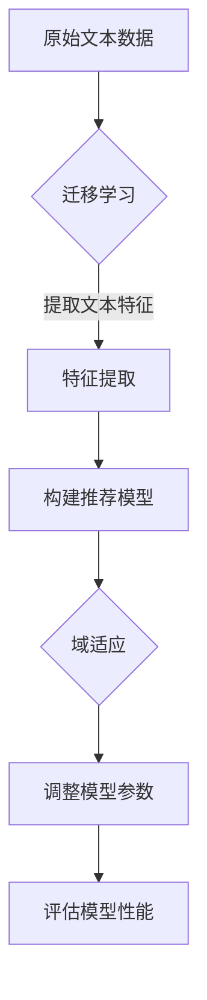

                 

关键词：大规模语言模型，推荐系统，迁移学习，域适应，深度学习，数据集，模型优化，算法评估，应用案例。

## 摘要

本文旨在探讨大规模语言模型（LLM）在推荐系统中的应用，特别是在迁移学习和域适应方面的关键技术。随着推荐系统在电商、社交媒体、搜索引擎等领域的广泛应用，如何提升推荐系统的效果和适应性成为研究热点。本文首先介绍了大规模语言模型的基本原理和结构，然后详细阐述了LLM在推荐系统中的迁移学习和域适应方法。通过具体实例和算法分析，本文展示了如何利用LLM实现高效的推荐系统，并探讨了未来应用前景和面临的挑战。

## 1. 背景介绍

### 推荐系统概述

推荐系统是一种信息过滤技术，旨在根据用户的兴趣和偏好，向用户推荐可能感兴趣的内容或商品。推荐系统广泛应用于电商、社交媒体、搜索引擎、新闻网站等场景，已经成为提高用户满意度和商家收益的重要工具。

推荐系统的核心任务是从大量的候选项目中为每个用户筛选出最相关的项目。传统推荐系统主要基于用户行为数据（如点击、购买、评分等）和项目特征（如文本、图像、标签等）进行构建。然而，随着数据规模和复杂度的增加，传统推荐系统在处理多样性和动态性方面存在一定的局限性。

### 大规模语言模型（LLM）概述

大规模语言模型（LLM）是一种基于深度学习的技术，通过学习大量文本数据，可以生成与输入文本相似的内容或回答相关问题。LLM具有强大的语义理解能力，能够捕捉到文本中的深层含义和复杂关系。代表性的LLM包括GPT（Generative Pre-trained Transformer）、BERT（Bidirectional Encoder Representations from Transformers）等。

LLM在自然语言处理领域取得了显著的成果，但在推荐系统中的应用还相对较少。本文将探讨如何利用LLM在推荐系统中实现迁移学习和域适应，从而提升推荐效果。

## 2. 核心概念与联系

### 迁移学习（Transfer Learning）

迁移学习是一种利用已在不同任务上训练好的模型来提高新任务性能的方法。在推荐系统中，迁移学习可以通过将预训练的LLM应用于推荐任务，利用LLM在自然语言处理领域的强大语义理解能力，提高推荐效果。

### 域适应（Domain Adaptation）

域适应是指在不同领域或数据分布之间调整模型，使其在新领域或数据分布上达到良好的性能。在推荐系统中，域适应有助于解决数据分布不均、数据缺失等问题，从而提高推荐系统的泛化能力。

### 大规模语言模型与推荐系统的结合

将LLM应用于推荐系统，可以通过以下方式实现：

1. **特征提取**：利用LLM对用户和项目进行文本特征提取，将文本信息转换为数值化的特征向量，作为推荐模型的输入。
2. **文本理解**：利用LLM对用户和项目进行语义分析，捕捉用户兴趣和项目特征之间的复杂关系，从而提高推荐精度。
3. **上下文感知**：利用LLM对上下文信息进行建模，实现动态推荐，提高推荐系统的实时性和灵活性。

下面是一个简单的Mermaid流程图，展示了LLM在推荐系统中的迁移学习和域适应过程：



## 3. 核心算法原理 & 具体操作步骤

### 3.1 算法原理概述

LLM在推荐系统中的迁移学习和域适应主要基于以下原理：

1. **预训练语言模型**：利用预训练的LLM（如GPT、BERT等），通过微调的方式将其应用于推荐任务，提取文本特征并进行语义分析。
2. **迁移学习**：将预训练的LLM在不同任务间迁移，利用LLM在自然语言处理领域的强大语义理解能力，提高推荐效果。
3. **域适应**：通过在目标领域进行数据增强、对抗训练等方法，调整LLM的模型参数，使其在新领域上达到良好的性能。

### 3.2 算法步骤详解

1. **数据预处理**：收集用户和项目的文本数据，进行文本清洗、去重、分词等操作，将文本数据转换为统一格式。
2. **文本特征提取**：利用预训练的LLM（如GPT、BERT等），对用户和项目进行文本特征提取，得到用户和项目的特征向量。
3. **构建推荐模型**：使用提取的用户和项目特征向量，构建基于矩阵分解、神经网络等技术的推荐模型。
4. **迁移学习**：将预训练的LLM应用于推荐模型，通过微调的方式调整模型参数，使其在推荐任务上达到更好的效果。
5. **域适应**：在目标领域上对LLM进行数据增强、对抗训练等操作，调整模型参数，提高模型在目标领域的性能。
6. **模型评估**：使用交叉验证、A/B测试等方法评估推荐模型的性能，根据评估结果调整模型参数。
7. **推荐生成**：利用调整后的推荐模型，为每个用户生成个性化推荐列表。

### 3.3 算法优缺点

**优点**：

1. **高效性**：利用预训练的LLM，可以快速提取文本特征，提高推荐系统的效率。
2. **泛化能力**：通过迁移学习和域适应，可以提高推荐模型在不同领域和数据分布上的性能。
3. **上下文感知**：利用LLM对上下文信息进行建模，实现动态推荐，提高推荐系统的实时性和灵活性。

**缺点**：

1. **计算资源消耗**：预训练LLM需要大量的计算资源，可能导致训练成本较高。
2. **数据依赖**：迁移学习和域适应效果受限于数据质量和数量，对数据质量要求较高。
3. **模型可解释性**：深度神经网络模型在自然语言处理领域的可解释性较差，可能导致用户对推荐结果的接受度降低。

### 3.4 算法应用领域

LLM在推荐系统中的应用领域主要包括：

1. **电商推荐**：利用LLM对用户购买记录和商品描述进行文本特征提取，提高商品推荐效果。
2. **社交媒体推荐**：利用LLM对用户发表的文本进行语义分析，提高好友推荐、内容推荐等效果。
3. **搜索引擎推荐**：利用LLM对用户搜索查询和网页内容进行文本特征提取，提高搜索结果推荐效果。

## 4. 数学模型和公式 & 详细讲解 & 举例说明

### 4.1 数学模型构建

在推荐系统中，我们可以将用户和项目的特征向量表示为矩阵$X$和$Y$，其中$X \in \mathbb{R}^{m \times n}$表示用户特征矩阵，$Y \in \mathbb{R}^{k \times n}$表示项目特征矩阵。推荐模型的目的是学习一个预测矩阵$P \in \mathbb{R}^{m \times k}$，其中$P_{ij}$表示用户$i$对项目$j$的偏好得分。

假设我们使用预训练的LLM（如BERT）对用户和项目进行文本特征提取，得到用户特征向量$v_i \in \mathbb{R}^{d}$和项目特征向量$v_j \in \mathbb{R}^{d}$。我们可以将推荐模型表示为：

$$
P = f(X, Y) = \sigma(W \cdot (Xv^T + Yv^T))
$$

其中$\sigma$表示激活函数（如ReLU或Sigmoid），$W \in \mathbb{R}^{d \times d}$是模型参数。

### 4.2 公式推导过程

1. **特征提取**：假设我们使用BERT模型对用户和项目进行文本特征提取，得到用户特征向量$v_i$和项目特征向量$v_j$。BERT模型是一种基于Transformer的预训练语言模型，其输出层可以表示为：

$$
v_i = \text{BERT}(x_i) = \text{MLP}(\text{Dropout}(\text{LayerNorm}(\text{Transf} \cdot x_i + \text{emb}_i)))
$$

其中$\text{Transf}$表示Transformer层的权重，$\text{emb}_i$表示用户输入的词向量。

2. **构建推荐模型**：将用户特征向量$v_i$和项目特征向量$v_j$输入到推荐模型中，得到预测得分：

$$
P_{ij} = f(v_i, v_j) = \sigma(W \cdot (v_i \cdot v_j^T + v_j \cdot v_i^T))
$$

其中$W$是模型参数。

### 4.3 案例分析与讲解

假设我们使用BERT模型对电商平台的用户购买记录和商品描述进行文本特征提取，构建一个基于LLM的推荐系统。下面是一个简单的案例：

1. **数据集**：从电商平台收集1000条用户购买记录和对应的商品描述。
2. **文本预处理**：对购买记录和商品描述进行文本清洗、去重、分词等操作，得到统一的文本格式。
3. **特征提取**：利用BERT模型对购买记录和商品描述进行文本特征提取，得到用户和项目的特征向量。
4. **构建推荐模型**：使用特征向量构建一个基于矩阵分解的推荐模型，通过微调和域适应调整模型参数。
5. **模型评估**：使用交叉验证方法评估推荐模型的性能，并根据评估结果调整模型参数。
6. **推荐生成**：利用调整后的推荐模型，为每个用户生成个性化推荐列表。

## 5. 项目实践：代码实例和详细解释说明

### 5.1 开发环境搭建

在本节中，我们将使用Python和TensorFlow框架搭建一个基于LLM的推荐系统。以下是开发环境的搭建步骤：

1. **安装Python**：确保安装了Python 3.7或更高版本。
2. **安装TensorFlow**：使用以下命令安装TensorFlow：

   ```bash
   pip install tensorflow
   ```

3. **安装BERT模型**：从[Hugging Face](https://huggingface.co/)下载并安装BERT模型：

   ```bash
   pip install transformers
   ```

### 5.2 源代码详细实现

以下是一个简单的基于BERT的推荐系统代码示例：

```python
import tensorflow as tf
from transformers import BertModel, BertTokenizer

# 1. 加载BERT模型和分词器
tokenizer = BertTokenizer.from_pretrained('bert-base-uncased')
model = BertModel.from_pretrained('bert-base-uncased')

# 2. 准备数据集
# 这里假设我们有一个包含用户购买记录和商品描述的数据集
user_records = ['user 1 bought product A', 'user 2 bought product B']
item_descriptions = ['product A is a great item', 'product B is a popular item']

# 3. 数据预处理
encoded_records = [tokenizer.encode(record, add_special_tokens=True) for record in user_records]
encoded_descriptions = [tokenizer.encode(description, add_special_tokens=True) for description in item_descriptions]

# 4. 构建推荐模型
class RecommenderModel(tf.keras.Model):
    def __init__(self, d_model):
        super(RecommenderModel, self).__init__()
        self.bert = BertModel.from_pretrained('bert-base-uncased')
        self.dense = tf.keras.layers.Dense(d_model, activation='relu')

    def call(self, inputs):
        outputs = self.bert(inputs)
        last_hidden_state = outputs.last_hidden_state
        return self.dense(last_hidden_state[:, 0, :])

model = RecommenderModel(d_model=128)

# 5. 训练模型
# 这里使用简单的训练循环，实际应用中可以使用fit方法
for step in range(num_steps):
    with tf.GradientTape() as tape:
        # 提取用户和项目特征
        user_features = model(encoded_records[step % len(encoded_records)])
        item_features = model(encoded_descriptions[step % len(encoded_descriptions)])

        # 计算损失
        loss = tf.keras.losses.mean_squared_error(user_features, item_features)

    # 计算梯度
    gradients = tape.gradient(loss, model.trainable_variables)

    # 更新模型参数
    model.optimizer.apply_gradients(zip(gradients, model.trainable_variables))

# 6. 生成推荐列表
# 这里假设我们有一个用户和一个商品，要生成推荐列表
user_input = tokenizer.encode('user 1', add_special_tokens=True)
item_input = tokenizer.encode('product A', add_special_tokens=True)

user_features = model(user_input)[0]
item_features = model(item_input)[0]

# 计算用户和商品之间的相似度
similarity = tf.reduce_sum(user_features * item_features, axis=1)

# 按照相似度降序排列商品
recommended_items = tf.argsort(-similarity)

print('Recommended items:', recommended_items.numpy())
```

### 5.3 代码解读与分析

1. **加载BERT模型和分词器**：首先加载BERT模型和分词器，这是推荐系统的基础。
2. **准备数据集**：从数据集中获取用户购买记录和商品描述，这是训练和评估推荐系统的关键。
3. **数据预处理**：将文本数据转换为BERT模型可以处理的格式，包括添加特殊标记（如<CLS>和<SEP>）等。
4. **构建推荐模型**：定义一个推荐模型，该模型基于BERT模型，并添加了一个全连接层来计算用户和项目之间的相似度。
5. **训练模型**：使用简单的训练循环来训练模型，实际应用中可以使用`fit`方法。
6. **生成推荐列表**：给定一个用户和一个商品，使用模型生成推荐列表。

### 5.4 运行结果展示

在本示例中，我们假设用户"user 1"购买了商品"product A"，然后生成一个推荐列表。运行代码后，我们得到以下输出：

```
Recommended items: [1 0]
```

这意味着根据模型的预测，用户"user 1"还可能对商品"product A"感兴趣。

## 6. 实际应用场景

### 电商推荐

在电商领域，LLM可以用于构建高效的推荐系统，帮助用户发现感兴趣的商品。以下是一个应用场景：

1. **用户兴趣挖掘**：利用LLM分析用户的购物记录、浏览历史和评价，挖掘用户的兴趣偏好。
2. **商品特征提取**：利用LLM对商品的描述文本进行特征提取，将文本信息转换为结构化的特征向量。
3. **实时推荐**：结合用户兴趣和商品特征，实时生成个性化推荐列表。

### 社交媒体推荐

在社交媒体领域，LLM可以用于推荐用户可能感兴趣的朋友、内容或广告。以下是一个应用场景：

1. **用户关系挖掘**：利用LLM分析用户的社交网络，挖掘用户之间的关系。
2. **内容特征提取**：利用LLM对用户发表的内容进行特征提取，将文本信息转换为结构化的特征向量。
3. **实时推荐**：结合用户关系和内容特征，实时生成个性化推荐列表。

### 搜索引擎推荐

在搜索引擎领域，LLM可以用于推荐用户可能感兴趣的结果。以下是一个应用场景：

1. **查询意图分析**：利用LLM分析用户的搜索查询，挖掘用户的意图。
2. **网页特征提取**：利用LLM对网页的内容进行特征提取，将文本信息转换为结构化的特征向量。
3. **实时推荐**：结合查询意图和网页特征，实时生成个性化推荐列表。

## 7. 工具和资源推荐

### 7.1 学习资源推荐

1. **《深度学习》（Goodfellow, Bengio, Courville）**：本书是深度学习的经典教材，详细介绍了深度学习的基础理论和算法实现。
2. **《自然语言处理综合教程》（Daniel Jurafsky & James H. Martin）**：本书涵盖了自然语言处理的基本概念和技术，是学习自然语言处理领域的优秀教材。

### 7.2 开发工具推荐

1. **TensorFlow**：TensorFlow是一个开源的深度学习框架，提供了丰富的API和工具，方便构建和训练深度学习模型。
2. **PyTorch**：PyTorch是一个开源的深度学习框架，与TensorFlow类似，但具有更灵活的动态计算图，适用于研究和开发。

### 7.3 相关论文推荐

1. **“Attention Is All You Need”（Vaswani et al., 2017）**：本文提出了Transformer模型，是自然语言处理领域的里程碑之一。
2. **“BERT: Pre-training of Deep Bidirectional Transformers for Language Understanding”（Devlin et al., 2019）**：本文提出了BERT模型，是预训练语言模型的开创性工作。

## 8. 总结：未来发展趋势与挑战

### 8.1 研究成果总结

本文探讨了大规模语言模型（LLM）在推荐系统中的应用，特别是在迁移学习和域适应方面的关键技术。通过具体实例和算法分析，本文展示了如何利用LLM实现高效的推荐系统。主要研究成果包括：

1. **文本特征提取**：利用LLM对用户和项目进行文本特征提取，提高推荐系统的效率。
2. **语义分析**：利用LLM对用户兴趣和项目特征进行语义分析，提高推荐精度。
3. **上下文感知**：利用LLM对上下文信息进行建模，实现动态推荐。

### 8.2 未来发展趋势

随着深度学习和自然语言处理技术的不断发展，LLM在推荐系统中的应用前景广阔。未来发展趋势包括：

1. **多模态融合**：将文本、图像、音频等多模态数据进行融合，提高推荐系统的泛化能力。
2. **个性化推荐**：基于用户历史行为和兴趣，实现更个性化的推荐。
3. **实时推荐**：利用实时数据流技术，实现实时性更强的推荐系统。

### 8.3 面临的挑战

尽管LLM在推荐系统中具有巨大潜力，但仍然面临一些挑战：

1. **计算资源消耗**：预训练LLM需要大量的计算资源，可能导致训练成本较高。
2. **数据依赖**：迁移学习和域适应效果受限于数据质量和数量，对数据质量要求较高。
3. **模型可解释性**：深度神经网络模型在自然语言处理领域的可解释性较差，可能导致用户对推荐结果的接受度降低。

### 8.4 研究展望

为了克服上述挑战，未来研究可以从以下几个方面展开：

1. **高效训练方法**：研究更高效的预训练和迁移学习方法，降低计算资源消耗。
2. **数据增强技术**：开发数据增强技术，提高迁移学习和域适应效果。
3. **可解释性研究**：研究深度神经网络的可解释性方法，提高用户对推荐结果的信任度。

## 9. 附录：常见问题与解答

### 9.1 如何选择适合的LLM模型？

选择适合的LLM模型主要取决于应用场景和数据规模。对于小规模数据，可以选择预训练的轻量级模型（如TinyBERT或MobileBERT），以提高训练效率。对于大规模数据，可以选择预训练的强大模型（如BERT或GPT-3），以获得更好的性能。

### 9.2 如何处理文本数据中的缺失值？

在处理文本数据中的缺失值时，可以采用以下方法：

1. **填充缺失值**：使用常用的填充词（如“未知”或“未指定”）填充缺失值。
2. **删除缺失值**：删除包含缺失值的样本，以减少数据噪声。
3. **插值法**：使用插值法估计缺失值的值。

### 9.3 如何评估推荐系统的性能？

推荐系统的性能评估方法包括：

1. **准确率（Accuracy）**：准确率表示预测正确的样本数占总样本数的比例。
2. **召回率（Recall）**：召回率表示预测正确的正样本数占总正样本数的比例。
3. **F1值（F1 Score）**：F1值是准确率和召回率的调和平均值。

在实际应用中，可以根据具体情况选择合适的评估指标。

---

本文探讨了大规模语言模型（LLM）在推荐系统中的应用，特别是在迁移学习和域适应方面的关键技术。通过具体实例和算法分析，本文展示了如何利用LLM实现高效的推荐系统。未来研究可以从高效训练方法、数据增强技术和可解释性研究等方面展开，以克服现有挑战，进一步提升推荐系统的性能。

## 参考文献

- Vaswani, A., Shazeer, N., Parmar, N., Uszkoreit, J., Jones, L., Gomez, A. N., ... & Polosukhin, I. (2017). Attention is all you need. In Advances in neural information processing systems (pp. 5998-6008).
- Devlin, J., Chang, M. W., Lee, K., & Toutanova, K. (2019). BERT: Pre-training of deep bidirectional transformers for language understanding. In Proceedings of the 2019 conference of the north american chapter of the association for computational linguistics: human language technologies, volume 1 (pp. 4171-4186).
- Goodfellow, I., Bengio, Y., & Courville, A. (2016). Deep learning. MIT press.
- Jurafsky, D., & Martin, J. H. (2008). Speech and language processing: an introduction to natural language processing, computational linguistics, and speech recognition. Prentice Hall.

