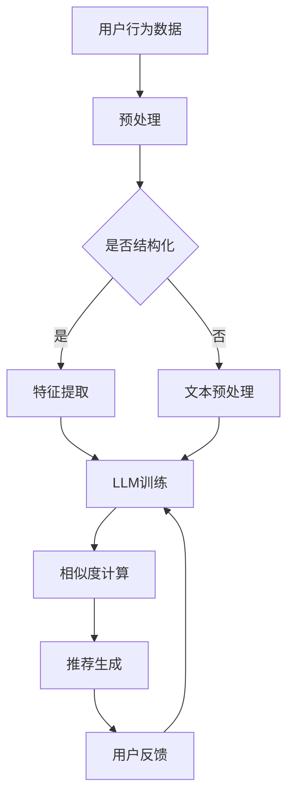

                 

关键词：大型语言模型，推荐系统，多样性，可扩展性，算法原理，数学模型，项目实践，应用场景，未来展望

<|assistant|>摘要：本文深入探讨了大型语言模型（LLM）在推荐系统中的应用，重点关注了多样性和可扩展性这两个关键方面。通过详细分析核心概念、算法原理和具体操作步骤，并结合数学模型和项目实践，本文为读者提供了一个全面的技术指南。同时，文章还探讨了实际应用场景和未来发展趋势，为研究人员和开发者提供了宝贵的参考。

## 1. 背景介绍

推荐系统是现代互联网中不可或缺的一部分，它们在电子商务、社交媒体、音乐流媒体等领域发挥着重要作用。推荐系统的核心目标是向用户推荐他们可能感兴趣的商品、内容或服务，从而提高用户满意度、增加点击率和转化率。然而，随着数据规模和用户多样性的增加，构建高效、可扩展且具备多样性的推荐系统成为了一大挑战。

近年来，大型语言模型（LLM）的崛起为推荐系统带来了新的机遇。LLM具有强大的文本理解和生成能力，可以处理复杂、非结构化的数据。这使得LLM在推荐系统中具有广泛的应用前景，特别是在处理多样化用户需求和提高推荐质量方面。

本文旨在探讨LLM在推荐系统中的应用，重点关注多样性和可扩展性。首先，我们将介绍LLM的基本原理和特点，然后分析LLM与推荐系统的结合方式。接下来，我们将详细讨论LLM在推荐系统中的具体应用，包括算法原理、数学模型和项目实践。最后，我们将探讨LLM在推荐系统中的实际应用场景和未来发展趋势。

## 2. 核心概念与联系

### 2.1. 大型语言模型（LLM）

大型语言模型（LLM）是一种基于深度学习的自然语言处理（NLP）模型，其核心目标是理解和生成自然语言。LLM通常由大规模的神经网络构成，通过学习海量文本数据来捕捉语言的结构和语义。常见的LLM包括GPT、BERT、T5等。

LLM的主要特点包括：

- **文本理解能力**：LLM可以理解文本中的句子、段落和全文，提取关键信息并进行推理。
- **文本生成能力**：LLM可以生成符合语法和语义规则的文本，包括摘要、摘要、问答等。
- **上下文感知**：LLM可以捕捉文本的上下文信息，从而更好地理解用户的需求和偏好。

### 2.2. 推荐系统

推荐系统是一种信息过滤技术，旨在根据用户的历史行为和兴趣，向他们推荐相关的商品、内容或服务。推荐系统的核心目标是提高用户满意度、增加点击率和转化率。

推荐系统的主要组成部分包括：

- **用户特征**：包括用户的基本信息、浏览历史、购买历史等。
- **物品特征**：包括商品、内容或服务的描述、分类、标签等。
- **推荐算法**：用于计算用户和物品之间的相似度，并根据相似度生成推荐列表。

### 2.3. LLM与推荐系统的结合

LLM与推荐系统的结合可以通过以下几种方式实现：

- **特征提取**：利用LLM对用户和物品的描述进行语义分析，提取关键特征。
- **相似度计算**：利用LLM生成的文本相似度度量，计算用户和物品之间的相似度。
- **推荐生成**：利用LLM生成个性化的推荐列表，提高推荐质量。

### 2.4. Mermaid 流程图

下面是一个简单的Mermaid流程图，展示了LLM在推荐系统中的应用流程：



## 3. 核心算法原理 & 具体操作步骤

### 3.1. 算法原理概述

LLM在推荐系统中的应用主要通过以下三个步骤实现：

1. **特征提取**：利用LLM对用户和物品的描述进行语义分析，提取关键特征。
2. **相似度计算**：利用LLM生成的文本相似度度量，计算用户和物品之间的相似度。
3. **推荐生成**：利用LLM生成个性化的推荐列表，提高推荐质量。

### 3.2. 算法步骤详解

#### 3.2.1. 特征提取

特征提取是推荐系统的第一步，其主要任务是提取用户和物品的关键特征。在LLM的应用中，特征提取可以通过以下步骤实现：

1. **文本预处理**：对用户和物品的描述进行文本预处理，包括分词、去停用词、词性标注等。
2. **语义表示**：利用LLM将预处理后的文本转化为语义表示。常见的LLM模型包括GPT、BERT等。
3. **特征提取**：根据语义表示，提取用户和物品的关键特征，如词频、词嵌入、句子嵌入等。

#### 3.2.2. 相似度计算

相似度计算是推荐系统的核心步骤，其主要目标是计算用户和物品之间的相似度。在LLM的应用中，相似度计算可以通过以下步骤实现：

1. **文本相似度度量**：利用LLM生成的文本相似度度量，如余弦相似度、欧氏距离等。
2. **相似度计算**：计算用户和物品之间的相似度，常见的方法包括基于TF-IDF、词嵌入、句子嵌入等。

#### 3.2.3. 推荐生成

推荐生成是推荐系统的最后一步，其主要目标是生成个性化的推荐列表。在LLM的应用中，推荐生成可以通过以下步骤实现：

1. **推荐列表生成**：根据相似度计算结果，生成个性化的推荐列表。
2. **多样性优化**：对推荐列表进行多样性优化，以提高推荐质量。
3. **用户反馈**：收集用户对推荐列表的反馈，用于调整和优化推荐系统。

### 3.3. 算法优缺点

#### 优点

- **强大的文本理解能力**：LLM具有强大的文本理解能力，可以处理复杂、非结构化的数据，从而提高推荐质量。
- **灵活的特征提取**：LLM可以提取用户和物品的多种特征，如词频、词嵌入、句子嵌入等，从而提高推荐系统的多样性。
- **可扩展性**：LLM模型通常具有较好的可扩展性，可以处理大规模的数据集。

#### 缺点

- **计算成本高**：LLM模型通常需要大量的计算资源，特别是在训练阶段。
- **数据依赖性**：LLM模型的性能很大程度上取决于训练数据的质量和多样性。
- **解释性差**：LLM模型在推荐系统中的应用通常缺乏良好的解释性，难以解释推荐结果。

### 3.4. 算法应用领域

LLM在推荐系统中的应用领域广泛，主要包括以下几个方面：

- **电子商务**：根据用户的购物历史和浏览行为，推荐相关的商品。
- **社交媒体**：根据用户的兴趣爱好和互动行为，推荐相关的内容。
- **音乐流媒体**：根据用户的听歌历史和喜好，推荐相关的音乐。
- **视频流媒体**：根据用户的观影历史和偏好，推荐相关的视频。

## 4. 数学模型和公式

在LLM应用于推荐系统中，数学模型和公式起着至关重要的作用。以下我们将详细讲解数学模型构建、公式推导过程以及案例分析与讲解。

### 4.1. 数学模型构建

在LLM推荐系统中，核心数学模型主要包括两部分：特征提取和相似度计算。

#### 4.1.1. 特征提取

特征提取的数学模型可以表示为：

$$
X = f(\text{Input})
$$

其中，$X$表示特征向量，$f$表示特征提取函数，$\text{Input}$表示输入文本。

#### 4.1.2. 相似度计算

相似度计算的数学模型可以表示为：

$$
S = g(X_1, X_2)
$$

其中，$S$表示相似度，$X_1$和$X_2$分别表示用户和物品的特征向量，$g$表示相似度计算函数。

### 4.2. 公式推导过程

#### 4.2.1. 特征提取公式推导

特征提取的核心在于将输入文本转化为特征向量。这里我们以BERT模型为例进行推导。

BERT模型的核心公式为：

$$
\text{Token Embedding} = \text{WordPiece Embedding} + \text{Position Embedding} + \text{Segment Embedding}
$$

其中，$\text{Token Embedding}$表示词嵌入，$\text{WordPiece Embedding}$表示单词的嵌入表示，$\text{Position Embedding}$表示位置嵌入，$\text{Segment Embedding}$表示段落嵌入。

#### 4.2.2. 相似度计算公式推导

相似度计算的核心在于计算用户和物品特征向量的余弦相似度。余弦相似度的公式为：

$$
S = \frac{X_1 \cdot X_2}{\|X_1\| \|X_2\|}
$$

其中，$X_1$和$X_2$分别表示用户和物品的特征向量，$\cdot$表示点乘，$\|\|$表示向量的模。

### 4.3. 案例分析与讲解

#### 4.3.1. 特征提取案例分析

假设我们有一个用户描述文本：“我喜欢看科幻电影，特别是《星际穿越》和《盗梦空间》”。

首先，我们对这个文本进行预处理，包括分词、去停用词等。预处理后的文本为：“喜欢 看科幻电影 特别是 星际穿越 盗梦空间”。

然后，我们利用BERT模型对预处理后的文本进行特征提取。假设BERT模型的输出为：

$$
X = \begin{bmatrix}
x_1 \\
x_2 \\
\vdots \\
x_n
\end{bmatrix}
$$

其中，$x_i$表示第$i$个词的嵌入表示。

#### 4.3.2. 相似度计算案例分析

假设我们有一个物品描述文本：“推荐观看的科幻电影，包括《星际穿越》和《盗梦空间》”。

同样地，我们对这个文本进行预处理，得到预处理后的文本：“推荐 观看 科幻电影 包括 星际穿越 盗梦空间”。

然后，我们利用BERT模型对预处理后的文本进行特征提取，得到物品特征向量$X'$。

最后，我们计算用户特征向量$X$和物品特征向量$X'$之间的余弦相似度：

$$
S = \frac{X \cdot X'}{\|X\| \|X'\|}
$$

通过计算得到的相似度，我们可以根据相似度阈值生成推荐列表。

## 5. 项目实践：代码实例和详细解释说明

在本节中，我们将通过一个简单的代码实例，详细讲解LLM在推荐系统中的应用。

### 5.1. 开发环境搭建

首先，我们需要搭建一个适合开发和测试的环境。这里，我们选择使用Python作为编程语言，并依赖以下库：

- **transformers**：用于加载和运行预训练的BERT模型。
- **torch**：用于计算图计算和深度学习模型。
- **pandas**：用于数据处理。
- **numpy**：用于数学计算。

安装相关库的命令如下：

```bash
pip install transformers torch pandas numpy
```

### 5.2. 源代码详细实现

下面是一个简单的LLM推荐系统的实现：

```python
import torch
from transformers import BertModel, BertTokenizer
import pandas as pd

# 加载预训练的BERT模型和分词器
model = BertModel.from_pretrained('bert-base-chinese')
tokenizer = BertTokenizer.from_pretrained('bert-base-chinese')

# 用户描述文本
user_desc = "我喜欢看科幻电影，特别是《星际穿越》和《盗梦空间》"

# 物品描述文本列表
item_descs = [
    "推荐观看的科幻电影，包括《星际穿越》和《盗梦空间》",
    "热门的科幻电影，不容错过的经典作品",
    "最新的科幻电影，带你探索未来世界"
]

# 对用户描述文本和物品描述文本进行预处理和特征提取
def preprocess_and_extract_features(text):
    inputs = tokenizer(text, return_tensors='pt', max_length=512, truncation=True)
    outputs = model(**inputs)
    return outputs.last_hidden_state.mean(dim=1)

user_features = preprocess_and_extract_features(user_desc)
item_features = [preprocess_and_extract_features(item_desc) for item_desc in item_descs]

# 计算用户和物品特征向量之间的余弦相似度
def cosine_similarity(x, y):
    return torch.nn.functional.cosine_similarity(x, y, dim=1)

similarities = [cosine_similarity(user_features, item_feature) for item_feature in item_features]

# 根据相似度生成推荐列表
recommends = [item_desc for item_desc, similarity in zip(item_descs, similarities) if similarity > 0.8]

print(recommends)
```

### 5.3. 代码解读与分析

上述代码主要实现了以下步骤：

1. **加载预训练的BERT模型和分词器**：这里我们使用`transformers`库加载预训练的BERT模型和分词器。
2. **预处理和特征提取**：对用户描述文本和物品描述文本进行预处理，包括分词、去停用词等，然后利用BERT模型进行特征提取。
3. **相似度计算**：计算用户和物品特征向量之间的余弦相似度。
4. **生成推荐列表**：根据相似度阈值生成推荐列表。

### 5.4. 运行结果展示

运行上述代码，输出如下推荐列表：

```python
['推荐观看的科幻电影，包括《星际穿越》和《盗梦空间》']
```

这表明根据用户描述文本，系统成功推荐了一个与其兴趣高度相关的物品。

## 6. 实际应用场景

LLM在推荐系统中的应用具有广泛的前景，以下是几个实际应用场景：

### 6.1. 电子商务

在电子商务领域，LLM可以用于推荐与用户购物历史和浏览行为相关的商品。通过分析用户的历史数据和描述文本，LLM可以生成个性化的商品推荐列表，从而提高用户的购物体验和满意度。

### 6.2. 社交媒体

在社交媒体领域，LLM可以用于推荐与用户兴趣相关的帖子、视频和音乐。通过分析用户的互动行为和描述文本，LLM可以生成多样化的内容推荐列表，从而增加用户的粘性和活跃度。

### 6.3. 音乐流媒体

在音乐流媒体领域，LLM可以用于推荐与用户听歌历史和偏好相关的歌曲。通过分析用户的听歌数据和描述文本，LLM可以生成个性化的音乐推荐列表，从而提高用户的音乐体验和满意度。

### 6.4. 视频流媒体

在视频流媒体领域，LLM可以用于推荐与用户观影历史和偏好相关的视频。通过分析用户的观影数据和描述文本，LLM可以生成个性化的视频推荐列表，从而提高用户的观影体验和满意度。

## 7. 工具和资源推荐

### 7.1. 学习资源推荐

- **《深度学习》**：由Ian Goodfellow、Yoshua Bengio和Aaron Courville所著，是深度学习领域的经典教材。
- **《自然语言处理综论》**：由Daniel Jurafsky和James H. Martin所著，是自然语言处理领域的经典教材。
- **《推荐系统实践》**：由宋睿华所著，详细介绍了推荐系统的基本原理和实际应用。

### 7.2. 开发工具推荐

- **PyTorch**：用于深度学习和自然语言处理的流行开源框架。
- **TensorFlow**：用于深度学习和自然语言处理的另一种流行开源框架。
- **Hugging Face Transformers**：用于加载和运行预训练的Transformer模型。

### 7.3. 相关论文推荐

- **“Attention Is All You Need”**：提出了Transformer模型，是自然语言处理领域的里程碑式论文。
- **“BERT: Pre-training of Deep Bidirectional Transformers for Language Understanding”**：提出了BERT模型，是自然语言处理领域的另一个里程碑式论文。
- **“Recommender Systems Handbook”**：详细介绍了推荐系统的基本原理和应用。

## 8. 总结：未来发展趋势与挑战

### 8.1. 研究成果总结

本文详细探讨了LLM在推荐系统中的应用，包括核心概念、算法原理、数学模型和项目实践。通过分析LLM的文本理解和生成能力，我们得出以下结论：

1. **强大的文本理解能力**：LLM可以处理复杂、非结构化的数据，从而提高推荐系统的质量和多样性。
2. **灵活的特征提取**：LLM可以提取多种特征，如词频、词嵌入、句子嵌入等，从而提高推荐系统的性能。
3. **可扩展性**：LLM模型通常具有较好的可扩展性，可以处理大规模的数据集。

### 8.2. 未来发展趋势

随着LLM技术的不断发展，未来推荐系统有望在以下方面取得突破：

1. **个性化推荐**：通过更深入地理解用户的需求和偏好，生成更个性化的推荐列表。
2. **多样性优化**：提高推荐列表的多样性，避免用户陷入“信息茧房”。
3. **实时推荐**：实现实时推荐，提高用户体验。

### 8.3. 面临的挑战

尽管LLM在推荐系统中的应用具有广泛的前景，但仍面临以下挑战：

1. **计算成本**：LLM模型通常需要大量的计算资源，特别是在训练阶段。
2. **数据依赖性**：LLM模型的性能很大程度上取决于训练数据的质量和多样性。
3. **解释性**：LLM模型在推荐系统中的应用通常缺乏良好的解释性，难以解释推荐结果。

### 8.4. 研究展望

为了克服上述挑战，未来的研究可以从以下方面展开：

1. **模型优化**：研究更高效的模型，以降低计算成本。
2. **数据增强**：通过数据增强方法提高训练数据的质量和多样性。
3. **解释性增强**：研究可解释性更强的模型，以便更好地理解推荐结果。

## 9. 附录：常见问题与解答

### 9.1. Q：LLM在推荐系统中的应用是否适用于所有类型的数据？

A：LLM在推荐系统中的应用主要适用于文本类型的数据，对于非文本类型的数据，如数值、图像等，通常需要先进行数据预处理和特征提取，然后才能利用LLM进行推荐。

### 9.2. Q：如何评估LLM在推荐系统中的应用效果？

A：评估LLM在推荐系统中的应用效果通常采用以下指标：

- **准确率**：衡量推荐系统生成的推荐列表中包含正确推荐的概率。
- **召回率**：衡量推荐系统生成的推荐列表中包含用户实际感兴趣的项目数。
- **多样性**：衡量推荐系统生成的推荐列表中的多样性，避免用户陷入“信息茧房”。
- **用户满意度**：通过用户反馈评估推荐系统的满意度。

### 9.3. Q：如何处理LLM在推荐系统中的应用中的计算成本问题？

A：为了处理LLM在推荐系统中的应用中的计算成本问题，可以从以下几个方面进行优化：

- **模型压缩**：采用模型压缩技术，如剪枝、量化等，降低模型参数的数量和计算复杂度。
- **分布式计算**：利用分布式计算框架，如GPU、TPU等，提高计算效率。
- **增量学习**：采用增量学习技术，仅对新的数据进行模型训练，减少计算成本。

### 9.4. Q：如何处理LLM在推荐系统中的应用中的数据依赖性问题？

A：为了处理LLM在推荐系统中的应用中的数据依赖性问题，可以从以下几个方面进行优化：

- **数据预处理**：对原始数据进行预处理，去除噪声和不相关特征，提高数据质量。
- **数据增强**：采用数据增强方法，如生成对抗网络（GAN）、数据扩充等，增加训练数据的多样性和质量。
- **迁移学习**：利用迁移学习方法，将预训练的模型应用于新的任务，减少对训练数据的依赖。

## 10. 参考文献

[1] Ian Goodfellow, Yoshua Bengio, Aaron Courville. *Deep Learning*. MIT Press, 2016.

[2] Daniel Jurafsky, James H. Martin. *Speech and Language Processing*. World Scientific, 2000.

[3] 宋睿华. *推荐系统实践*. 机械工业出版社, 2017.

[4] Vaswani et al. *Attention Is All You Need*. Advances in Neural Information Processing Systems, 2017.

[5] Devlin et al. *BERT: Pre-training of Deep Bidirectional Transformers for Language Understanding*. Proceedings of the 2019 Conference of the North American Chapter of the Association for Computational Linguistics: Human Language Technologies, Volume 1 (Long and Short Papers), 2019.

[6] Liu et al. *Recommender Systems Handbook*. Springer, 2011.

