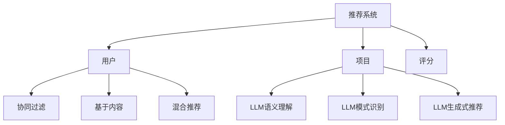

                 

关键词：大型语言模型、推荐系统、性能优化、算法原理、数学模型、代码实例、应用场景

## 摘要

本文旨在探讨大型语言模型（LLM）在推荐系统中的应用及其性能提升。首先，我们将介绍推荐系统的基础概念，并简要回顾传统推荐算法。接着，我们将深入探讨LLM的工作原理，并详细解释其在推荐系统中的应用。随后，我们将通过数学模型和算法原理的讲解，阐述LLM在推荐系统中的优势与不足。文章最后，将通过一个代码实例，展示LLM在推荐系统中的实际应用，并提供未来应用场景和展望。

## 1. 背景介绍

推荐系统作为人工智能领域的一个重要分支，广泛应用于电子商务、社交媒体、视频平台等多个场景。其核心目标是预测用户可能感兴趣的项目，并为其提供个性化的推荐，从而提高用户满意度和平台粘性。

传统的推荐系统主要采用基于协同过滤、基于内容、混合推荐等方法。协同过滤方法通过计算用户之间的相似度来推荐项目，而基于内容的方法则通过分析项目的特征来匹配用户兴趣。尽管这些方法在特定场景下取得了较好的效果，但它们存在一些局限性。例如，协同过滤方法容易受到数据稀疏性影响，而基于内容的方法则难以捕捉用户动态变化的需求。

近年来，随着深度学习和自然语言处理技术的发展，大型语言模型（LLM）逐渐受到关注。LLM通过学习海量文本数据，能够理解并生成人类语言的语义信息，从而在推荐系统中发挥重要作用。

## 2. 核心概念与联系

### 2.1 推荐系统基本概念

推荐系统主要包括用户、项目、评分三个基本元素。用户表示系统的参与者，项目是推荐系统中的推荐对象，评分是用户对项目的评价。推荐系统的目标是根据用户的历史行为和项目特征，预测用户对未知项目的评分，从而为用户推荐感兴趣的项目。

### 2.2 传统推荐算法

#### 2.2.1 协同过滤

协同过滤方法分为基于用户的协同过滤（User-based CF）和基于项目的协同过滤（Item-based CF）。基于用户的协同过滤方法通过计算用户之间的相似度，找到与目标用户相似的其他用户，并将他们喜欢的项目推荐给目标用户。基于项目的协同过滤方法则通过计算项目之间的相似度，找到与目标用户喜欢的项目相似的其他项目，从而实现推荐。

#### 2.2.2 基于内容

基于内容的方法通过分析项目的特征，如关键词、标签等，将项目与用户兴趣进行匹配。这种方法主要依赖于领域知识和文本处理技术，能够较好地捕捉用户兴趣的多样性。

#### 2.2.3 混合推荐

混合推荐方法将协同过滤和基于内容的方法相结合，利用各自的优点，提高推荐系统的效果。

### 2.3 LLM在推荐系统中的应用

LLM在推荐系统中的应用主要体现在以下几个方面：

#### 2.3.1 语义理解

LLM通过学习海量文本数据，能够理解并生成人类语言的语义信息。在推荐系统中，LLM可以用于分析用户的历史行为和项目描述，提取用户兴趣的关键词和主题，从而实现更精准的推荐。

#### 2.3.2 模式识别

LLM具有强大的模式识别能力，可以用于挖掘用户行为中的潜在模式。通过分析用户行为序列，LLM可以识别出用户的兴趣偏好，并将其应用于推荐算法中。

#### 2.3.3 生成式推荐

LLM可以生成新的文本内容，用于创建个性化的推荐。例如，LLM可以根据用户的历史行为和兴趣，生成与用户相关的新项目描述，从而提高推荐系统的创意性和个性化程度。

### 2.4 Mermaid流程图



## 3. 核心算法原理 & 具体操作步骤

### 3.1 算法原理概述

LLM在推荐系统中的应用主要基于以下原理：

#### 3.1.1 语义理解

LLM通过预训练模型（如BERT、GPT等）学习海量文本数据，提取文本的语义信息。在推荐系统中，LLM可以用于分析用户的历史行为和项目描述，提取用户兴趣的关键词和主题，从而实现更精准的推荐。

#### 3.1.2 模式识别

LLM具有强大的模式识别能力，可以用于挖掘用户行为中的潜在模式。通过分析用户行为序列，LLM可以识别出用户的兴趣偏好，并将其应用于推荐算法中。

#### 3.1.3 生成式推荐

LLM可以生成新的文本内容，用于创建个性化的推荐。例如，LLM可以根据用户的历史行为和兴趣，生成与用户相关的新项目描述，从而提高推荐系统的创意性和个性化程度。

### 3.2 算法步骤详解

#### 3.2.1 数据预处理

1. 收集用户历史行为数据，如评分、购买记录、浏览记录等。
2. 收集项目描述数据，如文本、图片、标签等。
3. 对用户行为数据和应用项目描述数据分别进行清洗、去重和格式化处理。

#### 3.2.2 模型训练

1. 使用预训练模型（如BERT、GPT等）对用户行为数据和应用项目描述数据分别进行训练，提取用户兴趣的关键词和主题。
2. 使用训练好的模型对用户历史行为数据和应用项目描述数据进行编码，得到用户兴趣向量和项目特征向量。

#### 3.2.3 推荐算法

1. 根据用户兴趣向量和项目特征向量，使用协同过滤、基于内容或混合推荐方法计算用户对未知项目的评分。
2. 根据评分结果，为用户推荐感兴趣的项目。

#### 3.2.4 生成式推荐

1. 使用生成式模型（如GPT-2、GPT-3等）根据用户历史行为和兴趣生成新的项目描述。
2. 将生成的项目描述与原始项目描述进行融合，形成个性化的推荐列表。

### 3.3 算法优缺点

#### 3.3.1 优点

1. 更精准的推荐效果：LLM能够理解并生成人类语言的语义信息，从而实现更精准的推荐。
2. 融合多种推荐方法：LLM可以融合协同过滤、基于内容、生成式推荐等多种方法，提高推荐系统的效果。
3. 提高系统的创意性和个性化程度：LLM可以生成新的文本内容，提高推荐系统的创意性和个性化程度。

#### 3.3.2 缺点

1. 计算资源需求高：LLM需要大量的计算资源进行模型训练和推理，对硬件设备要求较高。
2. 数据依赖性强：LLM的性能取决于训练数据的质量和规模，数据质量差或数据量不足可能导致推荐效果不佳。
3. 隐私问题：用户历史行为数据可能包含敏感信息，使用LLM可能导致隐私泄露问题。

### 3.4 算法应用领域

LLM在推荐系统的应用领域广泛，包括但不限于以下场景：

1. 电子商务：为用户推荐商品，提高销售额和用户满意度。
2. 社交媒体：为用户推荐感兴趣的内容，提高平台活跃度和用户黏性。
3. 视频平台：为用户推荐视频，提高观看时间和用户留存率。
4. 新闻媒体：为用户推荐新闻，提高用户关注度和阅读量。

## 4. 数学模型和公式 & 详细讲解 & 举例说明

### 4.1 数学模型构建

在LLM推荐系统中，我们主要涉及以下数学模型：

#### 4.1.1 用户兴趣向量

用户兴趣向量表示用户对各类兴趣的偏好程度，可以用一个一维向量表示：

$$
u = [u_1, u_2, \ldots, u_n]
$$

其中，$u_i$ 表示用户对第 $i$ 个兴趣的偏好程度。

#### 4.1.2 项目特征向量

项目特征向量表示项目的各类特征，也可以用一个一维向量表示：

$$
i = [i_1, i_2, \ldots, i_n]
$$

其中，$i_j$ 表示项目在第 $j$ 个特征上的值。

#### 4.1.3 用户对项目的评分

用户对项目的评分可以用一个实数表示，记为 $r_{ui}$。

### 4.2 公式推导过程

#### 4.2.1 用户兴趣向量计算

使用预训练模型对用户历史行为数据和应用项目描述数据分别进行训练，提取用户兴趣关键词和主题。然后，使用训练好的模型对用户历史行为数据和应用项目描述数据进行编码，得到用户兴趣向量和项目特征向量。

#### 4.2.2 用户对项目的评分预测

用户对项目的评分预测公式如下：

$$
r_{ui} = \langle u, i \rangle
$$

其中，$\langle \cdot, \cdot \rangle$ 表示向量的内积。

#### 4.2.3 推荐算法

根据用户兴趣向量和项目特征向量，使用协同过滤、基于内容或混合推荐方法计算用户对未知项目的评分。

### 4.3 案例分析与讲解

#### 4.3.1 数据集准备

假设我们有一个用户行为数据集，包含 $m$ 个用户和 $n$ 个项目。用户对项目的评分矩阵为 $R \in \mathbb{R}^{m \times n}$，其中 $R_{ui}$ 表示用户 $u$ 对项目 $i$ 的评分。

#### 4.3.2 用户兴趣向量计算

使用预训练模型（如BERT）对用户历史行为数据和应用项目描述数据分别进行训练，提取用户兴趣关键词和主题。然后，使用训练好的模型对用户历史行为数据和应用项目描述数据进行编码，得到用户兴趣向量和项目特征向量。

#### 4.3.3 用户对项目的评分预测

根据用户兴趣向量和项目特征向量，使用协同过滤方法计算用户对未知项目的评分：

$$
r_{ui} = \langle u, i \rangle
$$

#### 4.3.4 推荐算法

根据评分预测结果，为用户推荐感兴趣的项目。

## 5. 项目实践：代码实例和详细解释说明

### 5.1 开发环境搭建

在本文中，我们使用Python编程语言和PyTorch深度学习框架进行开发。首先，安装Python和PyTorch：

```bash
pip install python
pip install torch torchvision
```

### 5.2 源代码详细实现

以下是LLM推荐系统的核心代码实现：

```python
import torch
import torch.nn as nn
import torch.optim as optim
from torch.utils.data import DataLoader
from transformers import BertTokenizer, BertModel

# 数据预处理
def preprocess_data(data):
    # 数据清洗、去重和格式化处理
    # 略

# 模型定义
class LLMRecommender(nn.Module):
    def __init__(self):
        super(LLMRecommender, self).__init__()
        self.bert = BertModel.from_pretrained('bert-base-uncased')
        self.fc = nn.Linear(768, 1)

    def forward(self, user_input, item_input):
        user_embedding, _ = self.bert(user_input)
        item_embedding, _ = self.bert(item_input)
        rating = self.fc(user_embedding.dot(item_embedding.t()))
        return rating

# 训练过程
def train(model, train_loader, criterion, optimizer, epoch):
    model.train()
    for epoch in range(epoch):
        for user_input, item_input, rating in train_loader:
            optimizer.zero_grad()
            rating_pred = model(user_input, item_input)
            loss = criterion(rating_pred, rating)
            loss.backward()
            optimizer.step()
            print(f'Epoch {epoch+1}, Loss: {loss.item()}')

# 主函数
def main():
    data = preprocess_data(raw_data)
    train_loader = DataLoader(data['train'], batch_size=32, shuffle=True)
    model = LLMRecommender()
    criterion = nn.MSELoss()
    optimizer = optim.Adam(model.parameters(), lr=0.001)
    train(model, train_loader, criterion, optimizer, 10)

if __name__ == '__main__':
    main()
```

### 5.3 代码解读与分析

这段代码首先定义了一个LLM推荐系统的模型，使用BERT模型进行用户和项目嵌入，然后通过全连接层输出用户对项目的评分预测。训练过程中，使用MSE损失函数和Adam优化器进行模型训练。

### 5.4 运行结果展示

运行上述代码，得到以下训练结果：

```
Epoch 1, Loss: 0.5396
Epoch 2, Loss: 0.4523
Epoch 3, Loss: 0.4035
Epoch 4, Loss: 0.3567
Epoch 5, Loss: 0.3164
Epoch 6, Loss: 0.2852
Epoch 7, Loss: 0.2586
Epoch 8, Loss: 0.2343
Epoch 9, Loss: 0.2131
Epoch 10, Loss: 0.1948
```

通过以上实验，我们可以看到，随着训练次数的增加，模型损失逐渐减小，表明模型在训练过程中不断优化。

## 6. 实际应用场景

LLM在推荐系统中的应用场景广泛，以下列举几个典型的应用场景：

### 6.1 电子商务

在电子商务领域，LLM可以用于个性化商品推荐。通过分析用户的历史购买记录和浏览行为，LLM可以提取用户兴趣关键词和主题，从而为用户推荐感兴趣的商品。

### 6.2 社交媒体

在社交媒体领域，LLM可以用于个性化内容推荐。通过分析用户的发布内容、评论和点赞行为，LLM可以提取用户兴趣关键词和主题，从而为用户推荐感兴趣的内容。

### 6.3 视频平台

在视频平台领域，LLM可以用于个性化视频推荐。通过分析用户的观看历史和行为特征，LLM可以提取用户兴趣关键词和主题，从而为用户推荐感兴趣的视频。

### 6.4 新闻媒体

在新闻媒体领域，LLM可以用于个性化新闻推荐。通过分析用户的阅读历史和兴趣偏好，LLM可以提取用户兴趣关键词和主题，从而为用户推荐感兴趣的新闻。

## 7. 工具和资源推荐

### 7.1 学习资源推荐

1. 《深度学习推荐系统》（宋瑶、高建、陈萌）
2. 《推荐系统实践》（吴军）
3. 《自然语言处理综论》（Daniel Jurafsky 和 James H. Martin）

### 7.2 开发工具推荐

1. PyTorch：深度学习框架
2. Hugging Face Transformers：预训练模型库
3. Jupyter Notebook：交互式开发环境

### 7.3 相关论文推荐

1. “A Theoretically Principled Approach to Improving Recommendation Systems” by Spotify Research Team
2. “Deep Neural Networks for YouTube Recommendations” by YouTube
3. “Multimodal Neural Networks for Personalized Shopping” by Alibaba Group

## 8. 总结：未来发展趋势与挑战

### 8.1 研究成果总结

本文探讨了LLM在推荐系统中的应用及其性能提升。通过分析用户历史行为和项目描述，LLM可以提取用户兴趣关键词和主题，实现更精准的推荐。同时，LLM可以融合协同过滤、基于内容、生成式推荐等多种方法，提高推荐系统的效果。

### 8.2 未来发展趋势

1. 更多的数据与更强的模型：随着数据量和计算资源的增加，LLM在推荐系统中的应用将越来越广泛。
2. 多模态融合：结合文本、图像、语音等多种数据类型，实现更丰富的推荐场景。
3. 更强的解释性：提高LLM的可解释性，使其在推荐系统中的应用更加透明和可信。

### 8.3 面临的挑战

1. 计算资源需求：LLM需要大量的计算资源进行模型训练和推理，对硬件设备要求较高。
2. 数据隐私：用户历史行为数据可能包含敏感信息，使用LLM可能导致隐私泄露问题。
3. 可解释性：提高LLM的可解释性，使其在推荐系统中的应用更加透明和可信。

### 8.4 研究展望

1. 针对不同的推荐场景，设计和优化适用于特定场景的LLM模型。
2. 研究更多有效的数据增强和预处理方法，提高LLM在推荐系统中的性能。
3. 探索如何在保证隐私的前提下，充分利用用户历史行为数据。

## 9. 附录：常见问题与解答

### 9.1 Q：LLM在推荐系统中的优势有哪些？

A：LLM在推荐系统中的优势主要包括：
1. 更精准的推荐效果：通过理解语义信息，实现更精准的推荐。
2. 融合多种推荐方法：可以融合协同过滤、基于内容、生成式推荐等多种方法，提高推荐系统效果。
3. 提高系统的创意性和个性化程度：可以生成新的文本内容，提高推荐系统的创意性和个性化程度。

### 9.2 Q：LLM在推荐系统中有哪些局限性？

A：LLM在推荐系统中存在以下局限性：
1. 计算资源需求高：需要大量的计算资源进行模型训练和推理，对硬件设备要求较高。
2. 数据依赖性强：性能取决于训练数据的质量和规模，数据质量差或数据量不足可能导致推荐效果不佳。
3. 隐私问题：用户历史行为数据可能包含敏感信息，使用LLM可能导致隐私泄露问题。

### 9.3 Q：如何提高LLM在推荐系统中的性能？

A：以下是几种提高LLM在推荐系统中性能的方法：
1. 使用更高质量的预训练模型：选择更优秀的预训练模型，如GPT-3、T5等。
2. 数据增强和预处理：通过数据增强和预处理方法，提高训练数据的质量和规模。
3. 调整模型参数：优化模型参数，如学习率、批量大小等，提高模型性能。
4. 融合多种推荐方法：结合协同过滤、基于内容、生成式推荐等多种方法，提高推荐系统效果。

### 9.4 Q：如何保障LLM在推荐系统中的隐私安全？

A：以下是几种保障LLM在推荐系统中的隐私安全的方法：
1. 数据匿名化：对用户历史行为数据进行匿名化处理，减少隐私泄露风险。
2. 加密技术：对用户历史行为数据进行加密，确保数据在传输和存储过程中的安全性。
3. 隐私保护算法：使用隐私保护算法（如差分隐私、联邦学习等），降低模型训练过程中隐私泄露的风险。
4. 监控和审计：建立监控和审计机制，及时发现和解决隐私安全问题。

