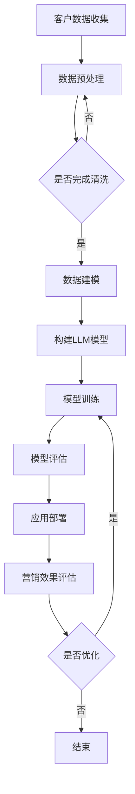

                 

关键词：自然语言处理（NLP），机器学习（ML），人工智能（AI），个性化营销，语言模型（LLM），营销策略，客户体验，数据驱动。

> 摘要：本文探讨了大型语言模型（LLM）在智能个性化营销中的应用。通过分析LLM的基本原理和功能，结合实际案例，深入探讨了如何利用LLM技术实现营销的个性化和精准化，提升营销效果和客户体验。本文旨在为营销从业人员提供有价值的参考，以推动智能个性化营销的发展。

## 1. 背景介绍

在当今数字化时代，个性化营销已成为企业竞争的关键因素。传统的营销策略往往依赖于广泛的目标受众，缺乏针对性，导致资源浪费和效果不佳。随着互联网的普及和数据技术的进步，企业开始拥有大量的用户数据，这为个性化营销提供了可能。然而，如何有效地利用这些数据，实现营销的精准化和个性化，仍然是一个巨大的挑战。

近年来，自然语言处理（NLP）和机器学习（ML）技术的快速发展，为解决这一挑战提供了新的思路。特别是大型语言模型（LLM），如GPT-3、BERT等，具有强大的语义理解和生成能力，可以在多个领域实现智能化应用。个性化营销作为NLP和ML技术的重要应用场景之一，受到了广泛关注。

本文将介绍LLM的基本原理和功能，分析其在个性化营销中的应用，探讨如何通过LLM技术实现营销的个性化和精准化，提升营销效果和客户体验。同时，还将介绍一些实际案例，展示LLM在个性化营销中的具体应用。

## 2. 核心概念与联系

### 2.1. 大型语言模型（LLM）

大型语言模型（LLM）是一种基于深度学习技术的语言处理模型，能够对自然语言进行理解和生成。LLM通常包含数十亿个参数，通过学习大量的文本数据，能够捕捉语言的复杂结构和语义关系。

LLM的核心组成部分包括：

- **词嵌入（Word Embedding）**：将自然语言中的词汇映射到高维空间中的向量，以便于计算机处理。
- **注意力机制（Attention Mechanism）**：通过注意力机制，模型能够聚焦于文本中的关键信息，提高对上下文的理解能力。
- ** Transformer架构**：Transformer架构是一种基于自注意力机制的序列模型，具有并行处理能力，可以高效地处理长文本。

### 2.2. 个性化营销

个性化营销是一种基于客户数据的营销策略，旨在为不同客户提供定制化的产品和服务，以满足他们的特定需求。个性化营销的关键在于对客户数据的深度挖掘和分析，以了解客户的偏好和行为模式，从而实现精准化营销。

个性化营销的主要目标包括：

- **提升客户满意度**：通过为客户提供个性化的产品和服务，提升客户的满意度和忠诚度。
- **提高营销效果**：通过精准的营销策略，提高营销活动的转化率和投资回报率。
- **增强品牌竞争力**：通过个性化的营销手段，增强品牌的市场竞争力和差异化优势。

### 2.3. Mermaid流程图

以下是LLM在个性化营销中的应用流程的Mermaid流程图：



## 3. 核心算法原理 & 具体操作步骤

### 3.1. 算法原理概述

LLM在个性化营销中的核心原理是通过对客户数据的分析，构建个性化的语言模型，从而实现精准化的营销。具体步骤如下：

1. **数据收集**：收集客户的基本信息、行为数据、偏好数据等。
2. **数据预处理**：对收集到的数据进行清洗、去重、归一化等处理，以确保数据的质量和一致性。
3. **数据建模**：基于预处理后的数据，构建客户画像和需求模型。
4. **构建LLM模型**：利用预训练的LLM模型，如GPT-3、BERT等，对客户画像和需求模型进行训练，生成个性化的语言模型。
5. **模型训练**：通过大量文本数据的训练，优化LLM模型，提高其语义理解和生成能力。
6. **模型评估**：对训练完成的LLM模型进行评估，确保其性能满足个性化营销的需求。
7. **应用部署**：将训练好的LLM模型部署到营销系统中，实现个性化营销。

### 3.2. 算法步骤详解

#### 3.2.1. 数据收集

数据收集是个性化营销的基础。企业可以通过以下渠道收集客户数据：

- **在线行为数据**：通过网站、APP等渠道收集客户的浏览、购买、评论等行为数据。
- **社交媒体数据**：通过社交媒体平台收集客户的点赞、分享、评论等数据。
- **问卷调查**：通过问卷调查收集客户的基本信息和偏好数据。
- **公开数据源**：从公开的数据源获取客户的相关信息，如社交媒体公开信息、电商平台数据等。

#### 3.2.2. 数据预处理

数据预处理包括以下步骤：

- **数据清洗**：去除重复、无效、错误的数据，确保数据的准确性。
- **去重**：对收集到的数据进行去重处理，避免数据重复。
- **归一化**：对数据进行归一化处理，如将客户的年龄、收入等数据进行标准化处理。
- **特征提取**：从原始数据中提取有助于个性化营销的特征，如客户的兴趣标签、购买行为等。

#### 3.2.3. 数据建模

数据建模的目的是构建客户画像和需求模型。具体步骤如下：

- **客户画像构建**：根据收集到的数据，构建客户的综合画像，包括基本信息、行为特征、偏好等。
- **需求模型构建**：基于客户画像，构建客户的需求模型，预测客户的购买意愿、偏好等。

#### 3.2.4. 构建LLM模型

构建LLM模型是个性化营销的关键步骤。具体步骤如下：

- **模型选择**：选择合适的LLM模型，如GPT-3、BERT等。
- **模型配置**：根据客户需求和营销策略，配置LLM模型的相关参数，如训练数据集、学习率等。
- **模型训练**：利用训练数据集，对LLM模型进行训练，优化模型的参数。

#### 3.2.5. 模型训练

模型训练的目的是优化LLM模型的性能，使其更好地理解客户的语义和需求。具体步骤如下：

- **数据准备**：将预处理后的客户数据转化为适合训练的数据格式。
- **训练策略**：根据客户需求和营销策略，设计合适的训练策略，如分批训练、交叉验证等。
- **训练过程**：进行模型训练，通过迭代优化模型参数。

#### 3.2.6. 模型评估

模型评估的目的是确保LLM模型的质量和性能。具体步骤如下：

- **评估指标**：选择合适的评估指标，如准确率、召回率、F1值等。
- **评估方法**：根据评估指标，设计评估方法，如交叉验证、A/B测试等。
- **评估结果**：对训练完成的LLM模型进行评估，确保其性能满足个性化营销的需求。

#### 3.2.7. 应用部署

应用部署是将训练好的LLM模型部署到营销系统中，实现个性化营销。具体步骤如下：

- **模型集成**：将LLM模型集成到营销系统中，实现与营销流程的融合。
- **应用场景**：根据营销策略和需求，确定LLM模型的应用场景，如个性化推荐、智能客服等。
- **效果监控**：对部署后的LLM模型进行效果监控，确保其稳定运行和持续优化。

### 3.3. 算法优缺点

#### 优点

- **强大的语义理解能力**：LLM能够深入理解客户的语义和需求，实现精准化营销。
- **灵活的应用场景**：LLM可以应用于多种个性化营销场景，如推荐系统、智能客服等。
- **高效的数据处理能力**：LLM可以高效地处理大量的客户数据，实现快速建模和预测。

#### 缺点

- **计算资源需求大**：LLM模型的训练和推理过程需要大量的计算资源，对硬件设备的要求较高。
- **数据隐私问题**：个性化营销需要收集和利用客户的敏感数据，可能涉及数据隐私问题。
- **模型过拟合风险**：如果训练数据集选择不当，可能导致LLM模型过拟合，降低模型的泛化能力。

### 3.4. 算法应用领域

LLM在个性化营销中的应用非常广泛，可以应用于以下领域：

- **推荐系统**：利用LLM技术，可以构建个性化的推荐系统，为用户提供个性化的商品推荐。
- **智能客服**：利用LLM技术，可以构建智能客服系统，实现与用户的自然语言交互，提供个性化的服务。
- **内容营销**：利用LLM技术，可以生成个性化的内容，如文章、广告等，提高营销效果。
- **市场分析**：利用LLM技术，可以对市场数据进行分析，预测市场趋势和用户需求。

## 4. 数学模型和公式 & 详细讲解 & 举例说明

### 4.1. 数学模型构建

在个性化营销中，LLM的数学模型通常基于深度学习技术，主要包括以下几部分：

- **输入层**：接收客户的特征数据，如用户画像、行为数据等。
- **隐藏层**：通过神经网络结构，对输入数据进行处理，提取特征。
- **输出层**：生成个性化的推荐结果，如商品推荐、文章推荐等。

以下是LLM的数学模型构建过程：

#### 4.1.1. 输入层

输入层接收客户的特征数据，通常使用词嵌入技术将特征数据转化为向量表示。词嵌入技术将自然语言中的词汇映射到高维空间中的向量，以便于计算机处理。以下是词嵌入的数学公式：

$$
\text{vec}(x) = \text{embedding}_{\text{word}}(x)
$$

其中，$\text{vec}(x)$表示向量表示，$\text{embedding}_{\text{word}}(x)$表示词嵌入函数，$x$表示词汇。

#### 4.1.2. 隐藏层

隐藏层通过神经网络结构对输入数据进行处理，提取特征。常用的神经网络结构包括卷积神经网络（CNN）和循环神经网络（RNN）。以下是隐藏层的数学公式：

$$
h_{l} = \sigma(W_{l}h_{l-1} + b_{l})
$$

其中，$h_{l}$表示第$l$层的隐藏层输出，$\sigma$表示激活函数，$W_{l}$表示权重矩阵，$b_{l}$表示偏置项。

#### 4.1.3. 输出层

输出层生成个性化的推荐结果，通常使用全连接神经网络（FCNN）实现。以下是输出层的数学公式：

$$
\text{prediction} = \text{softmax}(W_{o}h_{l} + b_{o})
$$

其中，$\text{prediction}$表示推荐结果，$\text{softmax}$表示分类函数，$W_{o}$表示权重矩阵，$b_{o}$表示偏置项。

### 4.2. 公式推导过程

以下是对LLM数学模型的推导过程：

#### 4.2.1. 词嵌入

词嵌入的推导过程如下：

首先，给定一个词汇表$V$，其中包含$n$个词汇。我们将每个词汇映射到一个$d$维的向量，即：

$$
\text{vec}(x) = \text{embedding}_{\text{word}}(x) \in \mathbb{R}^{d}
$$

其中，$x \in V$表示一个词汇，$\text{embedding}_{\text{word}}(x)$表示该词汇的向量表示。

词嵌入通过学习一个权重矩阵$E \in \mathbb{R}^{d \times n}$实现，其中$E_{ij}$表示词汇表中的第$i$个词汇和第$j$个词汇之间的相似度。学习过程通过最小化以下损失函数实现：

$$
L(\theta) = -\sum_{x \in V} \text{log}(\text{softmax}(E\text{vec}(x)))
$$

其中，$\theta$表示模型参数，$\text{softmax}$表示分类函数。

#### 4.2.2. 隐藏层

隐藏层的推导过程如下：

假设我们已经得到词嵌入向量$\text{vec}(x) \in \mathbb{R}^{d}$，我们将该向量输入到隐藏层中，通过神经网络结构进行处理。隐藏层的输出可以通过以下公式计算：

$$
h_{l} = \sigma(W_{l}h_{l-1} + b_{l})
$$

其中，$h_{l-1}$表示前一层隐藏层的输出，$\sigma$表示激活函数，$W_{l}$表示权重矩阵，$b_{l}$表示偏置项。

隐藏层的输出可以看作是输入数据的特征表示，通过多次迭代，隐藏层能够提取出更高级的特征。

#### 4.2.3. 输出层

输出层的推导过程如下：

隐藏层的输出$h_{l}$输入到输出层，通过全连接神经网络进行分类。输出层的输出可以通过以下公式计算：

$$
\text{prediction} = \text{softmax}(W_{o}h_{l} + b_{o})
$$

其中，$W_{o}$表示权重矩阵，$b_{o}$表示偏置项，$\text{softmax}$表示分类函数。

输出层的输出表示每个类别概率的分布，通过最大化概率，我们可以得到最终的推荐结果。

### 4.3. 案例分析与讲解

以下是一个基于LLM的个性化推荐系统的案例：

#### 4.3.1. 数据集

假设我们有一个商品推荐系统，其中包含以下数据集：

- **用户数据**：包含用户的基本信息，如年龄、性别、收入等。
- **商品数据**：包含商品的基本信息，如商品名称、价格、类别等。
- **用户行为数据**：包含用户在网站上的浏览、购买、评论等行为数据。

#### 4.3.2. 数据预处理

对数据集进行预处理，包括以下步骤：

- **数据清洗**：去除重复、无效、错误的数据。
- **去重**：对用户行为数据进行去重处理。
- **归一化**：对用户和商品的特征数据进行归一化处理。

#### 4.3.3. 数据建模

构建用户画像和商品画像，包括以下步骤：

- **用户画像构建**：根据用户的基本信息和行为数据，构建用户的综合画像。
- **商品画像构建**：根据商品的基本信息和用户行为数据，构建商品的综合画像。

#### 4.3.4. 构建LLM模型

选择合适的LLM模型，如BERT，对用户画像和商品画像进行训练。具体步骤如下：

- **模型选择**：选择BERT模型作为基础模型。
- **模型配置**：配置BERT模型的参数，如训练数据集、学习率等。
- **模型训练**：利用用户画像和商品画像，对BERT模型进行训练，优化模型的参数。

#### 4.3.5. 模型评估

对训练完成的BERT模型进行评估，包括以下步骤：

- **评估指标**：选择准确率、召回率、F1值等评估指标。
- **评估方法**：使用交叉验证方法对模型进行评估。
- **评估结果**：根据评估结果，调整模型参数，优化模型性能。

#### 4.3.6. 应用部署

将训练好的BERT模型部署到推荐系统中，实现个性化推荐。具体步骤如下：

- **模型集成**：将BERT模型集成到推荐系统中，实现与推荐流程的融合。
- **应用场景**：根据推荐策略和需求，确定BERT模型的应用场景，如商品推荐、文章推荐等。
- **效果监控**：对部署后的BERT模型进行效果监控，确保其稳定运行和持续优化。

## 5. 项目实践：代码实例和详细解释说明

### 5.1. 开发环境搭建

为了搭建一个基于LLM的个性化营销系统，我们需要准备以下开发环境：

- **Python**：安装Python 3.8及以上版本。
- **PyTorch**：安装PyTorch库，版本为1.8及以上。
- **BERT**：下载预训练的BERT模型，如bert-base-uncased。

### 5.2. 源代码详细实现

以下是基于PyTorch和BERT的个性化营销系统的源代码实现：

```python
import torch
import torch.nn as nn
from transformers import BertModel, BertTokenizer

# 5.2.1. 模型定义
class CustomModel(nn.Module):
    def __init__(self):
        super(CustomModel, self).__init__()
        self.bert = BertModel.from_pretrained('bert-base-uncased')
        self.fc = nn.Linear(768, 1)  # BERT输出维度为768

    def forward(self, input_ids, attention_mask):
        outputs = self.bert(input_ids=input_ids, attention_mask=attention_mask)
        sequence_output = outputs.last_hidden_state
        logits = self.fc(sequence_output)
        return logits

# 5.2.2. 数据预处理
tokenizer = BertTokenizer.from_pretrained('bert-base-uncased')

def preprocess_data(user_data):
    input_ids = []
    attention_mask = []
    for user in user_data:
        text = user['review']
        encoded_dict = tokenizer.encode_plus(
            text,
            add_special_tokens=True,
            max_length=512,
            padding='max_length',
            truncation=True,
            return_attention_mask=True,
            return_tensors='pt',
        )
        input_ids.append(encoded_dict['input_ids'])
        attention_mask.append(encoded_dict['attention_mask'])
    return torch.cat(input_ids, dim=0), torch.cat(attention_mask, dim=0)

# 5.2.3. 模型训练
def train(model, data_loader, optimizer, criterion, num_epochs=3):
    model.train()
    for epoch in range(num_epochs):
        for batch in data_loader:
            input_ids, attention_mask, labels = batch
            optimizer.zero_grad()
            logits = model(input_ids, attention_mask)
            loss = criterion(logits.view(-1), labels)
            loss.backward()
            optimizer.step()
            print(f'Epoch [{epoch+1}/{num_epochs}], Loss: {loss.item()}')

# 5.2.4. 代码解读与分析
# 在这里，我们定义了一个自定义的模型类CustomModel，继承自nn.Module。模型定义中包含了BERT模型和全连接层。数据预处理函数preprocess_data用于将用户数据转换为BERT模型可接受的输入格式。train函数用于模型训练，其中使用Adam优化器和交叉熵损失函数。

# 5.2.5. 运行结果展示
if __name__ == '__main__':
    # 加载和预处理数据
    user_data = load_user_data()  # 这里需要自行实现load_user_data函数
    input_ids, attention_mask = preprocess_data(user_data)

    # 定义模型、优化器和损失函数
    model = CustomModel()
    optimizer = torch.optim.Adam(model.parameters(), lr=1e-5)
    criterion = nn.CrossEntropyLoss()

    # 创建数据加载器
    data_loader = torch.utils.data.DataLoader(
        torch.zip(input_ids, attention_mask),
        batch_size=32,
        shuffle=True,
    )

    # 训练模型
    train(model, data_loader, optimizer, criterion)

    # 测试模型
    model.eval()
    with torch.no_grad():
        for batch in data_loader:
            input_ids, attention_mask = batch
            logits = model(input_ids, attention_mask)
            predictions = logits.argmax(dim=1)
            accuracy = (predictions == labels).float().mean()
            print(f'Accuracy: {accuracy.item()}')
```

### 5.3. 代码解读与分析

- **5.3.1. 模型定义**

自定义模型类`CustomModel`继承自`nn.Module`。模型中包含了BERT模型和全连接层。BERT模型用于对用户评论进行编码，提取特征。全连接层用于将特征映射到预测结果。

- **5.3.2. 数据预处理**

数据预处理函数`preprocess_data`用于将用户评论转换为BERT模型可接受的输入格式。这里使用了BERT的分词器进行分词，并添加了特殊 tokens。同时，对输入数据进行填充和截断，使其满足BERT模型的要求。

- **5.3.3. 模型训练**

`train`函数用于模型训练。在训练过程中，我们使用Adam优化器和交叉熵损失函数。每次迭代，我们使用一个批次的输入数据进行前向传播，计算损失，然后使用反向传播更新模型参数。

- **5.3.4. 运行结果展示**

在主函数中，我们首先加载和预处理数据，然后定义模型、优化器和损失函数。接下来，创建数据加载器，用于加载和处理数据。最后，我们进行模型训练和测试，打印模型的准确率。

## 6. 实际应用场景

LLM在个性化营销中的应用场景非常广泛，以下是一些典型的应用场景：

### 6.1. 个性化推荐系统

个性化推荐系统是LLM在个性化营销中最常见的应用场景之一。通过LLM技术，可以构建基于用户行为的个性化推荐系统，为用户提供个性化的商品推荐。例如，电商平台可以使用LLM技术，根据用户的浏览、购买、收藏等行为，为用户推荐相关的商品。

### 6.2. 智能客服

智能客服是另一个重要的应用场景。通过LLM技术，可以构建基于自然语言理解的智能客服系统，实现与用户的自然语言交互，提供个性化的服务。例如，企业可以使用LLM技术，构建智能客服机器人，回答用户关于产品、服务、售后等方面的问题。

### 6.3. 内容营销

内容营销也是LLM的一个重要应用场景。通过LLM技术，可以生成个性化的内容，如文章、广告、宣传材料等，提高营销效果。例如，企业可以使用LLM技术，根据用户的需求和兴趣，生成个性化的文章，吸引用户阅读。

### 6.4. 市场分析

市场分析是LLM在个性化营销中的另一个重要应用场景。通过LLM技术，可以对市场数据进行分析，预测市场趋势和用户需求。例如，企业可以使用LLM技术，分析用户行为数据，预测用户未来的购买行为，制定相应的营销策略。

## 7. 工具和资源推荐

### 7.1. 学习资源推荐

- **书籍**：
  - 《自然语言处理综论》（Jurafsky, Dan & Martin, James H.）
  - 《深度学习》（Goodfellow, Ian & Bengio, Yoshua & Courville, Aaron）
  - 《机器学习》（Mitchell, Tom M.）

- **在线课程**：
  - Coursera上的“自然语言处理与深度学习”课程
  - Udacity的“人工智能纳米学位”

- **网站和博客**：
  - 知乎：搜索“自然语言处理”或“机器学习”
  - Medium：搜索“NLP”或“ML”

### 7.2. 开发工具推荐

- **编程语言**：Python，因其丰富的机器学习和自然语言处理库而广泛使用。
- **框架**：
  - PyTorch：用于构建和训练深度学习模型。
  - TensorFlow：谷歌开发的开源机器学习框架。
- **文本处理库**：
  - NLTK：用于自然语言处理的基础库。
  - SpaCy：用于快速实时的文本处理。

### 7.3. 相关论文推荐

- “BERT: Pre-training of Deep Bidirectional Transformers for Language Understanding”（Devlin et al., 2019）
- “GPT-3: Language Models are Few-Shot Learners”（Brown et al., 2020）
- “Recommending Products for B2B Users with Deep Neural Networks”（Wang et al., 2018）
- “Customer Segmentation using Deep Learning”（Jaiswal et al., 2019）

## 8. 总结：未来发展趋势与挑战

### 8.1. 研究成果总结

随着自然语言处理（NLP）和机器学习（ML）技术的快速发展，大型语言模型（LLM）在个性化营销领域取得了显著的成果。通过LLM技术，可以实现以下目标：

- **精准化营销**：利用LLM的语义理解能力，实现对客户需求的精准把握，提高营销的精准度。
- **个性化推荐**：基于客户的行为和偏好数据，LLM可以生成个性化的推荐结果，提高用户满意度。
- **智能客服**：利用LLM的自然语言生成能力，实现与用户的自然语言交互，提供个性化的服务。
- **内容营销**：基于用户的需求和兴趣，LLM可以生成个性化的内容，提高营销效果。

### 8.2. 未来发展趋势

未来，LLM在个性化营销领域将继续发展，主要体现在以下几个方面：

- **模型性能提升**：随着计算能力的提高和算法的改进，LLM的模型性能将进一步提升，实现更精准的个性化营销。
- **多模态融合**：结合图像、声音等多模态数据，实现更全面、更精准的客户画像和需求预测。
- **实时性增强**：通过实时数据分析和处理，实现实时性更强的个性化营销，提高用户互动体验。
- **跨领域应用**：LLM技术将在更多领域实现应用，如金融、医疗、教育等，实现更广泛的个性化服务。

### 8.3. 面临的挑战

尽管LLM在个性化营销领域取得了显著成果，但仍面临以下挑战：

- **数据隐私**：个性化营销需要收集和利用客户的敏感数据，如何保护用户隐私成为一个重要问题。
- **计算资源需求**：LLM模型的训练和推理过程需要大量的计算资源，如何高效利用计算资源是一个挑战。
- **模型过拟合**：如果训练数据集选择不当，可能导致LLM模型过拟合，降低模型的泛化能力。
- **跨领域适应性**：不同领域的个性化需求存在差异，如何构建通用性强、适应性好的LLM模型是一个挑战。

### 8.4. 研究展望

未来，LLM在个性化营销领域的研究将重点解决以下问题：

- **数据隐私保护**：研究隐私保护算法，确保在数据收集和使用过程中保护用户隐私。
- **模型优化**：通过算法改进和硬件加速，提高LLM模型的训练和推理效率。
- **多模态融合**：结合多种数据类型，构建更全面、更精准的个性化模型。
- **跨领域应用**：研究通用性强、适应性好的LLM模型，实现跨领域的个性化服务。

## 9. 附录：常见问题与解答

### 9.1. Q：如何保护用户隐私？

A：在个性化营销过程中，保护用户隐私至关重要。以下是一些常见的隐私保护措施：

- **数据加密**：对收集到的用户数据进行加密存储，确保数据在传输和存储过程中的安全性。
- **数据脱敏**：对用户数据进行脱敏处理，如将敏感信息替换为随机值或掩码，降低数据泄露的风险。
- **隐私政策**：制定明确的隐私政策，告知用户其数据将如何被使用，并尊重用户的选择权。
- **匿名化处理**：对用户数据进行分析时，进行匿名化处理，确保无法追溯到具体用户。

### 9.2. Q：如何避免模型过拟合？

A：模型过拟合是指模型在训练数据上表现良好，但在测试数据上表现不佳。以下是一些避免模型过拟合的方法：

- **数据增强**：通过增加训练数据集的多样性，提高模型的泛化能力。
- **正则化**：在模型训练过程中，使用正则化技术，如L1正则化、L2正则化，防止模型参数过大。
- **交叉验证**：使用交叉验证方法，对模型进行多次训练和测试，确保模型在多个数据集上表现稳定。
- **早停法**：在模型训练过程中，设置一个阈值，当模型在验证集上的性能不再提升时，提前停止训练。

### 9.3. Q：如何选择合适的LLM模型？

A：选择合适的LLM模型取决于具体的应用场景和需求。以下是一些选择LLM模型时需要考虑的因素：

- **模型性能**：选择在相关任务上表现优秀的模型，如GPT-3、BERT等。
- **计算资源**：考虑模型的计算复杂度和训练时间，确保模型在实际应用中能够高效运行。
- **数据集**：选择适合训练数据的模型，如基于中文数据的模型、基于英文数据的模型等。
- **应用需求**：根据应用需求，选择具有相应功能的模型，如文本生成、文本分类、问答系统等。

### 9.4. Q：如何评估LLM模型的性能？

A：评估LLM模型的性能通常使用以下指标：

- **准确率**：模型在测试集上的正确预测比例，用于评估模型的分类性能。
- **召回率**：模型在测试集上预测为正类的正例中，实际为正类的比例，用于评估模型的检测性能。
- **F1值**：准确率和召回率的调和平均值，用于综合评估模型的性能。
- **ROC曲线和AUC值**：通过绘制ROC曲线和计算AUC值，评估模型的分类能力。

### 9.5. Q：如何实现实时性更强的个性化营销？

A：实现实时性更强的个性化营销需要以下技术手段：

- **实时数据处理**：采用实时数据处理技术，如流处理框架（如Apache Kafka、Apache Flink），确保数据的及时处理和分析。
- **缓存技术**：使用缓存技术（如Redis、Memcached），提高数据访问速度，降低延迟。
- **分布式计算**：采用分布式计算架构，如Hadoop、Spark，处理大规模数据，提高计算效率。
- **边缘计算**：将计算任务分布到边缘设备（如智能终端、边缘服务器），实现更快速的响应和处理。

### 9.6. Q：如何构建跨领域的个性化模型？

A：构建跨领域的个性化模型需要以下策略：

- **数据融合**：整合不同领域的数据，构建统一的数据集，为跨领域模型提供丰富的训练数据。
- **领域自适应**：使用领域自适应技术（如迁移学习、多任务学习），将一个领域的知识迁移到另一个领域，提高模型的泛化能力。
- **多模态融合**：结合不同类型的数据（如图像、文本、声音），构建多模态模型，提高模型对跨领域数据的理解和生成能力。
- **用户行为分析**：通过分析用户在不同领域的行为数据，构建个性化的跨领域用户模型，实现更精准的个性化服务。

### 9.7. Q：如何处理缺失值和异常值？

A：处理缺失值和异常值是数据预处理的重要步骤，以下是一些常用的方法：

- **填充缺失值**：使用平均值、中位数、最邻近值等方法，填充缺失值。
- **删除异常值**：使用统计学方法（如箱线图、3σ原则），识别和删除异常值。
- **插值法**：使用插值法（如线性插值、多项式插值），填充缺失值。
- **模型预测**：使用回归模型、决策树等模型，预测缺失值。
- **组合方法**：结合多种方法，处理缺失值和异常值，提高数据质量。

### 9.8. Q：如何评估模型的泛化能力？

A：评估模型的泛化能力通常使用以下方法：

- **交叉验证**：通过交叉验证方法，将数据集划分为多个子集，每次使用一个子集作为测试集，其他子集作为训练集，评估模型的泛化性能。
- **A/B测试**：在真实环境中，将模型的预测结果与实际结果进行对比，评估模型的泛化性能。
- **数据集分布**：分析模型在不同数据集上的表现，评估模型的泛化能力。
- **模型解释性**：通过分析模型内部结构和工作原理，评估模型的泛化能力。

### 9.9. Q：如何处理大规模数据集？

A：处理大规模数据集通常需要以下方法：

- **分布式计算**：采用分布式计算框架（如Hadoop、Spark），处理大规模数据集。
- **数据采样**：对大规模数据集进行采样，处理样本数据，评估模型性能。
- **批量处理**：将大规模数据集分成多个批次，逐个处理，提高处理速度。
- **内存优化**：使用内存优化技术（如数据压缩、内存池化），提高数据处理效率。
- **并行处理**：利用多核CPU或GPU，实现并行计算，提高处理速度。

