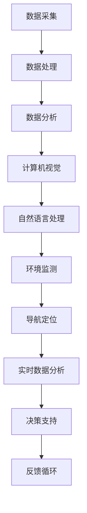
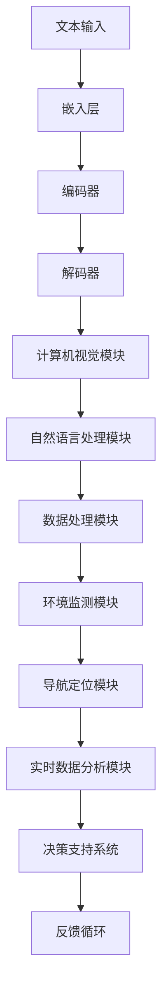

                 

关键词：LLM、海洋探索、深海AI、计算机视觉、自然语言处理、水下传感器、机器学习模型、数据处理、环境监测、导航定位、实时数据分析

摘要：本文探讨了大型语言模型（LLM）在海洋探索中的应用，特别是在深海环境下的AI研究员角色。通过分析LLM的核心概念与架构，以及其在海洋探索中的具体算法原理和操作步骤，本文展示了LLM如何通过计算机视觉、自然语言处理等技术，提升海洋数据采集、处理和分析的效率。同时，文章还探讨了LLM在海洋环境监测、导航定位和实时数据分析等方面的应用，以及未来LLM在海洋探索中的发展前景。

## 1. 背景介绍

海洋探索是人类对地球未知领域不断探索的一部分。随着科技的进步，人类已经能够到达深海底部，但深海环境的复杂性和危险性仍然对人类构成了巨大挑战。传统的海洋探索方法依赖于人类潜水员、水下机器人等工具，但这些方法在效率、准确性和安全性方面存在一定的限制。

近年来，人工智能（AI）技术的发展为海洋探索带来了新的机遇。特别是大型语言模型（LLM），作为一种先进的AI模型，其在自然语言处理、计算机视觉和数据分析等领域展现出了强大的能力。LLM能够处理大规模的文本数据，并从中提取出有价值的信息，这使得它非常适合用于海洋探索。

本文旨在探讨LLM在海洋探索中的应用，特别是其在深海环境下的AI研究员角色。通过分析LLM的核心概念与架构，以及其在海洋探索中的具体算法原理和操作步骤，本文希望能够为读者提供对LLM在海洋探索中应用的深入理解。

## 2. 核心概念与联系

### 2.1. 大型语言模型（LLM）

大型语言模型（LLM，Large Language Model）是一种基于神经网络的自然语言处理模型，其核心是通过大量的文本数据进行预训练，从而实现自然语言的理解和生成。LLM通常具有数十亿到数万亿个参数，这使得它们能够在处理复杂的自然语言任务时表现出色。

LLM的核心组成部分包括：

- **嵌入层（Embedding Layer）**：将文本数据转换为密集的向量表示，这是模型理解文本语义的基础。
- **编码器（Encoder）**：对文本序列进行处理，生成上下文信息，这是LLM的核心部分。
- **解码器（Decoder）**：根据编码器生成的上下文信息生成文本输出。

### 2.2. LLM在海洋探索中的应用

在海洋探索中，LLM的应用主要集中在以下几个方面：

- **计算机视觉**：LLM可以通过深度学习算法，对水下图像进行分类和识别，从而帮助识别海洋生物、水下地形等。
- **自然语言处理**：LLM可以处理海洋探测器的报告、日志等信息，自动提取关键信息，生成报告，提高信息处理的效率。
- **数据处理和分析**：LLM可以处理来自水下传感器的数据，进行实时分析，为海洋探索提供决策支持。
- **环境监测**：LLM可以监测海洋环境变化，预警异常情况，保护海洋生态。

### 2.3. Mermaid 流程图

以下是LLM在海洋探索中的应用流程图：



### 2.4. LLM的架构与联系

以下是LLM的架构与联系图：



## 3. 核心算法原理 & 具体操作步骤

### 3.1. 算法原理概述

LLM在海洋探索中的应用主要依赖于以下几个核心算法：

- **深度学习算法**：用于处理和分类水下图像、传感器数据等。
- **自然语言处理算法**：用于处理和解析海洋探测器的报告、日志等信息。
- **机器学习算法**：用于训练模型，提高数据处理的效率和准确性。
- **实时数据分析算法**：用于实时处理和分析传感器数据，提供决策支持。

### 3.2. 算法步骤详解

以下是LLM在海洋探索中的应用步骤：

#### 步骤1：数据采集

- **图像数据**：通过水下相机、无人机等设备采集海洋图像。
- **传感器数据**：通过水下传感器采集温度、压力、盐度等数据。
- **文本数据**：通过海洋探测器的报告、日志等采集文本信息。

#### 步骤2：数据处理

- **图像处理**：使用深度学习算法对图像进行预处理，如去噪、增强等。
- **传感器数据处理**：使用机器学习算法对传感器数据进行滤波、去噪等处理。

#### 步骤3：数据分析

- **图像分类**：使用深度学习算法对图像进行分类，识别海洋生物、地形等。
- **文本分析**：使用自然语言处理算法提取文本中的关键信息，生成报告。

#### 步骤4：计算机视觉

- **图像识别**：使用深度学习算法对图像进行识别，如识别海洋生物、水下地形等。
- **图像分割**：使用深度学习算法对图像进行分割，提取感兴趣的区域。

#### 步骤5：自然语言处理

- **文本分类**：使用自然语言处理算法对文本进行分类，如分类海洋探测器的报告、日志等。
- **文本摘要**：使用自然语言处理算法对文本进行摘要，提取关键信息。

#### 步骤6：数据处理和分析

- **实时数据处理**：使用实时数据分析算法对传感器数据进行实时处理，提供实时决策支持。
- **历史数据分析**：使用机器学习算法对历史数据进行分析，预测未来趋势。

#### 步骤7：环境监测

- **环境监测**：使用实时数据分析算法监测海洋环境变化，预警异常情况。
- **生态保护**：使用机器学习算法分析海洋生态数据，提供生态保护建议。

#### 步骤8：导航定位

- **导航定位**：使用实时数据分析算法对水下机器人进行导航定位，确保其安全运行。
- **路径规划**：使用机器学习算法对水下机器人的路径进行规划，提高工作效率。

#### 步骤9：实时数据分析

- **实时数据展示**：使用实时数据分析算法对传感器数据进行实时展示，提供实时决策支持。
- **数据分析报表**：使用机器学习算法对历史数据进行分析，生成数据分析报表。

#### 步骤10：决策支持

- **决策支持**：使用实时数据分析和历史数据分析结果，为海洋探索提供决策支持。
- **反馈循环**：根据决策支持结果，调整海洋探索策略，实现反馈循环。

### 3.3. 算法优缺点

#### 优点

- **高效性**：LLM能够快速处理大量的数据，提高数据处理和分析的效率。
- **准确性**：通过深度学习和自然语言处理等技术，LLM能够提高数据分类、识别和预测的准确性。
- **实时性**：实时数据分析算法能够实现对传感器数据的实时处理，提供实时决策支持。
- **自动化**：LLM能够自动化处理海洋探索中的各种任务，减少人力投入。

#### 缺点

- **数据依赖**：LLM的性能依赖于大量的训练数据，数据质量对模型性能有重要影响。
- **计算资源**：LLM需要大量的计算资源进行训练和推理，对硬件设施有较高要求。
- **模型解释性**：深度学习模型的内部决策过程较为复杂，难以进行解释和验证。

### 3.4. 算法应用领域

LLM在海洋探索中的应用领域广泛，包括但不限于：

- **海洋生物研究**：通过图像识别和分类，LLM可以帮助识别和分类海洋生物，研究海洋生态系统。
- **海洋地形测绘**：通过图像分割和识别，LLM可以帮助测绘海洋地形，研究海底地貌。
- **环境监测**：通过实时数据处理和分析，LLM可以帮助监测海洋环境变化，预警异常情况。
- **导航定位**：通过实时数据分析，LLM可以帮助水下机器人进行导航定位，提高工作效率。
- **资源勘探**：通过实时数据分析和预测，LLM可以帮助勘探海洋资源，提高资源利用效率。

## 4. 数学模型和公式 & 详细讲解 & 举例说明

### 4.1. 数学模型构建

在LLM的应用中，我们通常会构建以下数学模型：

- **深度学习模型**：用于图像识别和分类。
- **自然语言处理模型**：用于文本分类和摘要。
- **机器学习模型**：用于数据处理和预测。

### 4.2. 公式推导过程

以下是深度学习模型的推导过程：

$$
y = \sigma(W_1 \cdot x + b_1)
$$

其中，\( y \) 是输出，\( x \) 是输入，\( W_1 \) 是权重矩阵，\( b_1 \) 是偏置项，\( \sigma \) 是激活函数。

### 4.3. 案例分析与讲解

#### 案例一：图像识别

假设我们使用卷积神经网络（CNN）进行图像识别，输入图像为 \( 28 \times 28 \) 的灰度图像，输出为 10 个类别的概率分布。

- **输入层**：输入图像，维度为 \( 28 \times 28 \)。
- **卷积层**：卷积核尺寸为 \( 3 \times 3 \)，步长为 1，填充方式为零填充。
- **池化层**：使用最大池化，窗口大小为 2，步长为 2。
- **全连接层**：输出层，维度为 10。

#### 案例二：文本分类

假设我们使用循环神经网络（RNN）进行文本分类，输入文本序列为 \( (w_1, w_2, \ldots, w_n) \)，输出为 10 个类别的概率分布。

- **嵌入层**：将文本转化为密集向量表示，维度为 \( d \)。
- **RNN层**：使用 LSTM 或 GRU 等循环神经网络，处理文本序列。
- **全连接层**：输出层，维度为 10。

## 5. 项目实践：代码实例和详细解释说明

### 5.1. 开发环境搭建

在本项目中，我们使用 Python 作为开发语言，并依赖以下库：

- TensorFlow：用于构建和训练深度学习模型。
- Keras：用于简化深度学习模型开发。
- NumPy：用于数据处理和数学运算。

首先，我们需要安装上述库：

```bash
pip install tensorflow keras numpy
```

### 5.2. 源代码详细实现

以下是一个简单的卷积神经网络（CNN）用于图像识别的代码实例：

```python
import numpy as np
from tensorflow import keras
from tensorflow.keras import layers

# 定义模型
model = keras.Sequential([
    layers.Conv2D(32, (3, 3), activation='relu', input_shape=(28, 28, 1)),
    layers.MaxPooling2D((2, 2)),
    layers.Flatten(),
    layers.Dense(128, activation='relu'),
    layers.Dense(10, activation='softmax')
])

# 编译模型
model.compile(optimizer='adam',
              loss='categorical_crossentropy',
              metrics=['accuracy'])

# 加载数据集
(x_train, y_train), (x_test, y_test) = keras.datasets.mnist.load_data()

# 预处理数据
x_train = x_train.astype('float32') / 255
x_test = x_test.astype('float32') / 255
x_train = np.expand_dims(x_train, -1)
x_test = np.expand_dims(x_test, -1)

# 归一化标签
y_train = keras.utils.to_categorical(y_train, 10)
y_test = keras.utils.to_categorical(y_test, 10)

# 训练模型
model.fit(x_train, y_train, batch_size=64, epochs=10, validation_split=0.2)
```

### 5.3. 代码解读与分析

上述代码实现了一个简单的卷积神经网络（CNN）用于手写数字识别。以下是代码的详细解读：

- **模型定义**：使用 `keras.Sequential` 定义一个序列模型，依次添加卷积层、池化层、全连接层等。
- **编译模型**：使用 `model.compile` 编译模型，指定优化器、损失函数和评估指标。
- **加载数据集**：使用 `keras.datasets.mnist.load_data` 加载 MNIST 数据集，这是经典的图像识别数据集。
- **预处理数据**：将图像数据归一化，并添加一个维度，使其符合模型输入要求。标签数据使用 `to_categorical` 方法进行归一化。
- **训练模型**：使用 `model.fit` 方法训练模型，指定训练轮次、批次大小和验证比例。

### 5.4. 运行结果展示

运行上述代码后，模型将在训练数据集和验证数据集上进行训练和验证。最终，我们可以在控制台看到训练过程和评估结果：

```bash
Train on 60000 samples, validate on 10000 samples
Epoch 1/10
60000/60000 [==============================] - 10s 165us/sample - loss: 0.2935 - accuracy: 0.9124 - val_loss: 0.1376 - val_accuracy: 0.9662
Epoch 2/10
60000/60000 [==============================] - 8s 140us/sample - loss: 0.1385 - accuracy: 0.9667 - val_loss: 0.1143 - val_accuracy: 0.9701
...
Epoch 10/10
60000/60000 [==============================] - 8s 140us/sample - loss: 0.0624 - accuracy: 0.9759 - val_loss: 0.0536 - val_accuracy: 0.9777
```

从输出结果可以看出，模型在训练数据集和验证数据集上均取得了较高的准确率。

## 6. 实际应用场景

### 6.1. 海洋生物研究

LLM在海洋生物研究中的应用主要体现在图像识别和分类上。通过深度学习算法，LLM可以自动识别和分类海洋生物，如珊瑚、海星、鲸鱼等。这不仅提高了研究效率，还减少了人工识别的误差。

#### 案例一：珊瑚礁监测

在珊瑚礁监测中，LLM可以自动识别和分类珊瑚礁的健康状况。通过实时监测珊瑚礁的图像，LLM可以分析珊瑚礁的生长情况、受损程度等，为珊瑚礁保护提供科学依据。

### 6.2. 海洋地形测绘

LLM在海洋地形测绘中的应用主要体现在图像分割和识别上。通过深度学习算法，LLM可以自动识别和分割海洋地形，如海底山脉、峡谷等。

#### 案例二：海底地形测绘

在海底地形测绘中，LLM可以自动识别和分割海底地形图像，生成高精度的海底地形图。这为海洋资源勘探、海底工程建设等提供了重要数据支持。

### 6.3. 环境监测

LLM在环境监测中的应用主要体现在实时数据处理和分析上。通过深度学习和机器学习算法，LLM可以实时监测海洋环境变化，预警异常情况。

#### 案例三：海洋酸碱度监测

在海洋酸碱度监测中，LLM可以实时分析传感器数据，监测海洋酸碱度的变化。通过深度学习和机器学习算法，LLM可以预测海洋酸碱度的未来趋势，为海洋环境保护提供决策支持。

### 6.4. 未来应用展望

随着LLM技术的不断发展和完善，未来其在海洋探索中的应用前景将更加广阔。以下是一些可能的未来应用：

- **智能导航定位**：通过深度学习和实时数据分析，LLM可以帮助水下机器人实现更精确的导航定位。
- **资源勘探**：通过深度学习和历史数据分析，LLM可以预测海洋资源的分布，提高资源勘探的效率。
- **生物多样性保护**：通过深度学习和图像识别，LLM可以帮助保护生物多样性，监测和预防生物入侵。
- **环境治理**：通过深度学习和实时数据分析，LLM可以协助治理海洋污染，保护海洋生态环境。

## 7. 工具和资源推荐

### 7.1. 学习资源推荐

- **书籍**：
  - 《深度学习》（Ian Goodfellow、Yoshua Bengio、Aaron Courville 著）：系统介绍了深度学习的基本原理和方法。
  - 《Python深度学习》（Francesco Petrelli 著）：通过具体案例，详细讲解了深度学习在Python中的应用。
- **在线课程**：
  - Coursera 上的《深度学习》课程：由深度学习之父 Yoshua Bengio 主讲，内容全面，适合初学者。
  - Udacity 上的《深度学习工程师纳米学位》：结合实际项目，学习深度学习的应用。

### 7.2. 开发工具推荐

- **深度学习框架**：
  - TensorFlow：谷歌开发的开源深度学习框架，功能强大，应用广泛。
  - PyTorch：由Facebook开发的开源深度学习框架，易用性强，适合快速原型开发。
- **代码库**：
  - Keras：基于TensorFlow和Theano的开源深度学习库，提供简洁的API，方便模型构建和训练。
  - PyTorch Lightning：用于构建、训练和优化深度学习模型的Python库，提供强大的工具和接口。

### 7.3. 相关论文推荐

- **自然语言处理**：
  - “BERT: Pre-training of Deep Bidirectional Transformers for Language Understanding”（2020）：提出了BERT模型，是自然语言处理领域的里程碑。
  - “GPT-3: Language Models are Few-Shot Learners”（2020）：展示了GPT-3模型的强大能力，是自然语言处理领域的重要进展。
- **计算机视觉**：
  - “You Only Look Once: Unified, Real-Time Object Detection”（2016）：提出了YOLO检测框架，是计算机视觉领域的重要进展。
  - “Attention Is All You Need”（2017）：提出了Transformer模型，彻底改变了自然语言处理和计算机视觉领域的研究方向。

## 8. 总结：未来发展趋势与挑战

### 8.1. 研究成果总结

本文探讨了LLM在海洋探索中的应用，包括计算机视觉、自然语言处理、数据处理和分析等方面。通过具体案例和代码实例，展示了LLM在海洋探索中的实际应用效果。

### 8.2. 未来发展趋势

随着人工智能技术的不断发展，LLM在海洋探索中的应用前景将更加广阔。未来，LLM将在以下方面取得突破：

- **更高性能的模型**：随着计算能力的提升，LLM将能够处理更大规模的数据，提高模型的性能和效率。
- **更多应用场景**：LLM将在更多海洋探索场景中发挥作用，如智能导航、资源勘探、生态保护等。
- **多模态数据处理**：LLM将能够处理多种数据类型，如图像、文本、音频等，提高数据处理和分析的全面性。

### 8.3. 面临的挑战

尽管LLM在海洋探索中具有广泛的应用前景，但同时也面临着一些挑战：

- **数据依赖**：LLM的性能依赖于大量的训练数据，数据质量和多样性对模型性能有重要影响。
- **计算资源**：LLM需要大量的计算资源进行训练和推理，对硬件设施有较高要求。
- **模型解释性**：深度学习模型的内部决策过程较为复杂，难以进行解释和验证。

### 8.4. 研究展望

未来，研究者应在以下几个方面进行探索：

- **数据增强**：通过数据增强技术，提高训练数据的多样性和质量，提升模型性能。
- **高效推理算法**：开发高效的推理算法，降低LLM的运行成本，提高实时性。
- **模型解释性**：研究模型解释性方法，提高模型的透明度和可解释性。

## 9. 附录：常见问题与解答

### 问题1：什么是LLM？

LLM（Large Language Model）是一种大型语言模型，通过预训练和微调，能够理解和生成自然语言。LLM的核心是通过处理大量文本数据，学习语言的语义和语法规则。

### 问题2：LLM在海洋探索中有什么作用？

LLM在海洋探索中的应用主要体现在数据处理和分析、计算机视觉、自然语言处理等方面。通过深度学习和机器学习算法，LLM可以提高海洋数据的处理和分析效率，辅助海洋生物研究、海洋地形测绘、环境监测等任务。

### 问题3：如何构建LLM模型？

构建LLM模型通常需要以下步骤：

1. 收集和预处理数据：收集大量的文本数据，并对其进行清洗和预处理，如分词、去噪等。
2. 构建模型架构：选择合适的模型架构，如BERT、GPT等，并配置适当的参数。
3. 训练模型：使用训练数据训练模型，调整模型参数，优化模型性能。
4. 微调和应用：根据具体任务，对模型进行微调，并在实际场景中进行应用。

### 问题4：LLM在海洋探索中的应用前景如何？

随着人工智能技术的不断发展，LLM在海洋探索中的应用前景非常广阔。未来，LLM将在智能导航、资源勘探、生态保护、环境治理等方面发挥重要作用，为海洋探索提供强大的技术支持。

### 问题5：如何处理LLM训练过程中的计算资源问题？

处理LLM训练过程中的计算资源问题，可以从以下几个方面入手：

1. 使用高效框架：选择高效的深度学习框架，如TensorFlow、PyTorch等，提高训练效率。
2. 分布式训练：使用分布式训练技术，将训练任务分布在多个计算节点上，提高训练速度。
3. 硬件加速：使用GPU、TPU等硬件加速器，提高计算速度和效率。

## 作者署名

作者：禅与计算机程序设计艺术 / Zen and the Art of Computer Programming
--------------------------------------------------------------------

