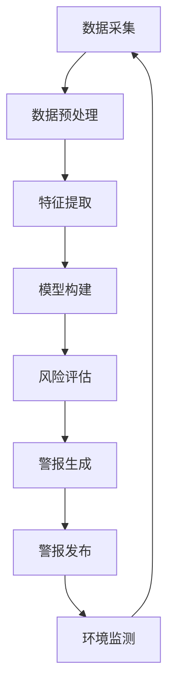
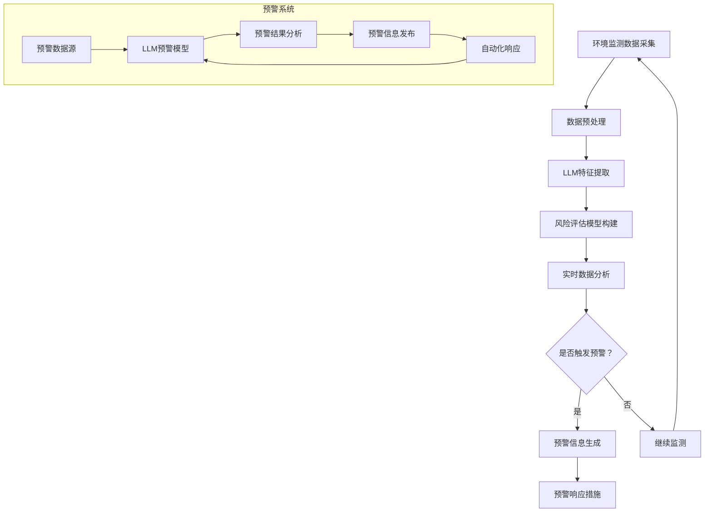

                 

关键词：环境监测、预警系统、LLM、人工智能、深度学习

## 摘要

本文主要探讨了大型语言模型（LLM）在环境监测和预警系统中的应用前景。随着环境问题的日益严重，对高效、准确的环境监测与预警系统的需求愈发迫切。LLM作为一种先进的人工智能技术，其在自然语言处理、数据分析和预测方面具有显著优势。本文从背景介绍、核心概念与联系、核心算法原理、数学模型和公式、项目实践、实际应用场景、未来应用展望以及工具和资源推荐等多个方面，详细阐述了LLM在环境监测和预警系统中的应用潜力。通过本文的研究，我们希望能够为环境监测和预警领域的研究者、开发者和政策制定者提供有益的参考。

## 1. 背景介绍

### 环境监测与预警系统的现状

环境监测和预警系统对于保护生态环境、保障人类健康具有重要意义。传统的环境监测方法主要依赖于地面观测站、卫星遥感等技术，尽管在一定程度上提高了监测精度，但仍然存在数据获取滞后、覆盖范围有限等问题。预警系统则主要通过收集和分析监测数据，对潜在的生态灾害进行预测和警报，以降低灾害对人类和环境的危害。

然而，随着全球环境问题的加剧，如气候变化、水资源短缺、空气污染等，对环境监测和预警系统的要求越来越高。传统方法难以应对日益复杂的环境问题，因此，引入先进的人工智能技术，尤其是LLM，成为提高监测和预警效率的关键途径。

### LLM的基本概念与发展历程

LLM（Large Language Model）是指大型语言模型，是一种基于深度学习的技术，通过大规模语料库的训练，模型能够理解和生成自然语言。自2018年GPT-2发布以来，LLM的发展经历了多个重要阶段，包括BERT、GPT-3等，模型的规模和性能不断提升。

LLM的核心优势在于其强大的自然语言处理能力，能够对大量非结构化数据进行分析和生成，从而实现自动化、智能化的信息处理。在环境监测和预警系统中，LLM可以通过对历史环境数据的分析和预测，提供更加准确、及时的监测和预警服务。

### 本文的研究目的与结构

本文旨在探讨LLM在环境监测和预警系统中的应用前景，通过对相关技术的深入分析，探讨其潜在的优势和挑战。文章主要分为以下几个部分：

1. 背景介绍：简要介绍环境监测与预警系统的现状以及LLM的基本概念和发展历程。
2. 核心概念与联系：介绍LLM在环境监测和预警系统中的应用场景，并绘制Mermaid流程图。
3. 核心算法原理 & 具体操作步骤：详细阐述LLM的核心算法原理和具体操作步骤。
4. 数学模型和公式：介绍LLM中的数学模型和公式，并进行详细讲解。
5. 项目实践：通过具体代码实例，展示LLM在环境监测和预警系统中的应用。
6. 实际应用场景：分析LLM在环境监测和预警系统中的实际应用场景。
7. 未来应用展望：探讨LLM在环境监测和预警系统中的未来发展趋势和应用前景。
8. 工具和资源推荐：推荐相关的学习资源、开发工具和论文。
9. 总结：总结研究成果，展望未来发展趋势和挑战。

通过本文的研究，我们希望能够为环境监测和预警领域的研究者、开发者和政策制定者提供有益的参考，推动LLM技术在环境监测和预警系统中的应用。

## 2. 核心概念与联系

在探讨LLM在环境监测和预警系统中的应用之前，我们需要先理解几个核心概念，包括环境监测、预警系统以及LLM的基本原理。以下是这些概念及其相互关系的详细解释，并附有Mermaid流程图。

### 环境监测

环境监测是指通过特定的方法、设备和监测点，对环境中的各种参数进行测量、记录和分析的过程。这些参数包括空气质量、水质、土壤污染、生物多样性等。环境监测的目的是为了获取环境状态的信息，评估环境质量，以及预测潜在的生态风险。

环境监测的基本步骤通常包括：

1. **数据采集**：通过监测设备获取环境参数的实时数据。
2. **数据处理**：对采集到的数据进行清洗、预处理，以便后续分析。
3. **数据分析**：使用统计方法、模式识别等技术，对预处理后的数据进行分析。
4. **数据可视化**：通过图表、地图等方式，展示分析结果，以便决策者参考。

### 预警系统

预警系统是一种基于监测数据和环境模型的系统，其目的是提前识别潜在的生态风险，并向相关方发出警报，以采取预防措施。预警系统通常包括以下几个关键组成部分：

1. **数据输入**：预警系统需要持续接收来自环境监测设备的实时数据。
2. **模型构建**：基于历史数据和专业知识，构建用于预测和评估的模型。
3. **风险评估**：利用模型对当前的环境状态进行评估，预测未来可能发生的生态风险。
4. **警报机制**：当系统评估出潜在风险时，触发警报机制，向相关部门或公众发出警报。

### LLM的基本原理

LLM（Large Language Model）是一种基于深度学习的技术，通过大规模的语料库训练，模型能够理解和生成自然语言。LLM的核心优势在于其强大的自然语言处理能力，能够在多种场景下实现自动化、智能化的信息处理。

LLM的基本原理主要包括：

1. **预训练**：LLM通过在大规模语料库上预训练，学习语言模式和知识。
2. **微调**：将预训练的模型在特定任务上进行微调，以适应具体应用场景。
3. **生成与理解**：LLM能够生成文本、回答问题，并在多种语言任务中表现出色。

### 相互关系

环境监测和预警系统与LLM之间存在紧密的关联。LLM可以被视为环境监测和预警系统中的一个关键组件，其强大的数据处理和分析能力能够显著提升系统的监测精度和预警效率。

以下是LLM在环境监测和预警系统中的应用流程：

1. **数据采集**：环境监测设备收集环境参数数据。
2. **数据预处理**：对采集到的数据进行清洗、转换等预处理。
3. **特征提取**：使用LLM提取数据中的关键特征。
4. **模型构建**：基于历史数据和专业知识，使用LLM构建预警模型。
5. **风险评估**：LLM对当前环境状态进行分析，预测未来风险。
6. **警报生成**：根据风险评估结果，LLM生成警报信息。
7. **警报发布**：系统向相关方发布警报信息。

为了更直观地展示上述概念和流程，我们使用Mermaid绘制了一个流程图：



在这个流程图中，LLM贯穿于整个环境监测和预警系统的各个环节，通过数据预处理、特征提取、模型构建、风险评估和警报生成等步骤，实现对环境数据的实时监测和预警。

通过理解这些核心概念和相互关系，我们能够更好地把握LLM在环境监测和预警系统中的应用潜力，为后续内容的研究和分析奠定基础。

### 2.1 环境监测与LLM

环境监测是预警系统的基础，而LLM为环境监测提供了强大的数据处理和分析能力。传统的环境监测方法主要依赖于人工监测和简单算法，这些方法在处理复杂的环境数据时存在局限。LLM通过其强大的自然语言处理和深度学习能力，可以显著提升环境监测的精度和效率。

具体来说，LLM在环境监测中的应用主要体现在以下几个方面：

1. **实时数据处理**：LLM能够处理大量的实时数据，并通过自然语言处理技术将这些数据转化为可用的信息。例如，将水质监测数据转化为污染程度的描述，或者将空气监测数据转化为空气质量指数（AQI）。
2. **模式识别**：LLM在处理大量环境数据时，能够识别出其中的模式和规律。这些模式对于预测环境变化趋势和评估环境风险具有重要意义。
3. **异常检测**：通过分析环境数据，LLM能够识别出异常情况，如突发污染事件或环境灾难。这种异常检测能力对于及时预警和采取应急措施至关重要。
4. **数据融合**：环境监测涉及多个参数的监测，LLM可以将这些不同的数据源进行融合，提供更全面的监测结果。例如，将气象数据、水质数据和土壤数据结合起来，进行综合分析。

### 2.2 预警系统与LLM

预警系统是环境监测的延伸，旨在通过分析和预测，提前识别潜在的生态风险。LLM在预警系统中的应用同样具有重要作用：

1. **风险评估**：LLM可以通过对历史数据的分析，预测未来可能出现的生态风险。例如，通过分析过去的气候变化数据，预测未来的干旱风险。
2. **实时预警**：LLM能够实时分析环境数据，一旦检测到异常情况，立即触发预警机制。这种实时预警能力对于减少灾害损失具有重要意义。
3. **自动化响应**：LLM不仅可以生成警报信息，还可以根据预警结果，自动化地制定响应措施。例如，当检测到水质污染时，自动启动污染处理程序。
4. **多模态预警**：LLM能够融合多种数据源，提供多模态的预警信息。例如，结合卫星遥感数据和地面监测数据，提供更加全面的环境预警。

### 2.3 Mermaid流程图

为了更直观地展示LLM在环境监测和预警系统中的应用流程，我们使用Mermaid绘制了一个详细的流程图：



在这个流程图中，我们首先收集环境监测数据，然后进行预处理，使用LLM进行特征提取和风险评估模型构建。在实时数据分析过程中，LLM会根据当前数据判断是否触发预警，并生成相应的预警信息。最后，根据预警结果，自动化地启动响应措施。

通过上述对核心概念与联系的详细阐述和Mermaid流程图的展示，我们可以更清晰地理解LLM在环境监测和预警系统中的应用场景及其重要性。在接下来的章节中，我们将进一步探讨LLM的核心算法原理、数学模型和具体应用实例，以展示其强大的应用潜力。

### 3. 核心算法原理 & 具体操作步骤

在了解了LLM在环境监测和预警系统中的核心概念与联系之后，我们需要深入探讨其核心算法原理，并详细描述具体操作步骤。以下是LLM在环境监测和预警系统中的算法原理概述，以及详细的操作步骤。

### 3.1 算法原理概述

LLM在环境监测和预警系统中的应用主要基于其强大的自然语言处理和深度学习能力。LLM通过以下几个关键步骤，实现环境监测和预警任务：

1. **数据预处理**：收集环境监测数据，并进行清洗、转换等预处理步骤，以便后续处理。
2. **特征提取**：使用LLM提取数据中的关键特征，这些特征用于构建预测模型和进行实时分析。
3. **模型构建**：基于历史数据和专业知识，使用LLM构建用于风险评估的模型。
4. **实时分析**：对实时环境数据进行分析，预测潜在风险，并生成预警信息。
5. **自动化响应**：根据预警结果，自动化地启动相应的响应措施，如污染处理、应急调度等。

### 3.2 算法步骤详解

以下是对LLM在环境监测和预警系统中每个步骤的具体操作步骤的详细说明：

#### 3.2.1 数据预处理

数据预处理是环境监测和预警系统的关键步骤，它确保了输入数据的干净和一致性。具体操作步骤包括：

1. **数据采集**：使用传感器、卫星遥感、地面监测等多种方式，收集环境数据。
2. **数据清洗**：去除噪声数据、缺失值和异常值，确保数据的完整性。
3. **数据转换**：将不同来源和格式的数据转换为统一的格式，便于后续处理。

#### 3.2.2 特征提取

特征提取是LLM的核心步骤，它将原始数据转换为模型能够理解和处理的形式。具体操作步骤包括：

1. **数据编码**：使用编码技术（如One-Hot编码、词嵌入等）将原始数据转换为数字形式。
2. **特征选择**：通过统计方法或机器学习技术，选择对模型预测性能有重要影响的关键特征。
3. **特征融合**：将不同来源的特征进行融合，提供更全面的特征表示。

#### 3.2.3 模型构建

模型构建是LLM在环境监测和预警系统中的核心步骤，它基于历史数据和专业知识，构建用于风险评估的模型。具体操作步骤包括：

1. **模型选择**：选择适合环境监测和预警任务的模型结构，如深度神经网络、循环神经网络（RNN）等。
2. **模型训练**：使用预处理的特征数据，训练模型，优化模型参数。
3. **模型评估**：使用验证集和测试集，评估模型性能，调整模型参数。

#### 3.2.4 实时分析

实时分析是LLM在环境监测和预警系统中的关键环节，它对实时环境数据进行分析，预测潜在风险，并生成预警信息。具体操作步骤包括：

1. **实时数据接收**：接收实时监测数据，并进行预处理。
2. **特征提取**：使用训练好的模型，提取实时数据的特征。
3. **风险评估**：利用模型对当前环境状态进行评估，预测未来风险。
4. **预警信息生成**：根据风险评估结果，生成预警信息，并决定是否触发警报。

#### 3.2.5 自动化响应

自动化响应是LLM在环境监测和预警系统中的重要功能，它根据预警结果，自动化地启动相应的响应措施。具体操作步骤包括：

1. **预警信息处理**：接收和处理生成的预警信息。
2. **响应策略制定**：根据预警信息和环境监测数据，制定相应的响应策略。
3. **自动化执行**：执行响应策略，如启动污染处理程序、应急调度等。

### 3.3 算法优缺点

LLM在环境监测和预警系统中具有显著的优点和一定的缺点：

**优点**：

1. **强大的数据处理能力**：LLM能够处理大量复杂的环境数据，提供实时、准确的监测和预警服务。
2. **高效的模式识别**：LLM通过深度学习技术，能够高效地识别环境数据中的模式和异常，提高预警的准确性。
3. **自动化和智能化**：LLM可以实现环境监测和预警的自动化，降低人力成本，提高系统效率。

**缺点**：

1. **计算资源需求高**：LLM模型的训练和运行需要大量的计算资源，这对硬件设施提出了较高的要求。
2. **数据依赖性**：LLM的性能很大程度上依赖于训练数据的质量和数量，数据不足或质量不佳可能导致模型性能下降。
3. **隐私和安全问题**：环境监测和预警系统涉及敏感数据，LLM的使用可能会带来数据隐私和安全问题。

### 3.4 算法应用领域

LLM在环境监测和预警系统中的应用领域非常广泛，包括但不限于以下几个方面：

1. **空气质量监测**：LLM可以实时分析空气质量数据，预测污染事件，提供预警信息，指导环保部门采取应对措施。
2. **水资源监测**：LLM可以分析水质数据，预测水质变化趋势，监测水污染事件，保障水资源安全。
3. **气候变化监测**：LLM可以分析气候数据，预测未来气候变化趋势，提供预警信息，帮助政府和相关机构制定应对策略。
4. **自然灾害预警**：LLM可以分析地震、洪水等自然灾害的数据，提供预警信息，减少灾害损失。

通过以上对LLM核心算法原理和具体操作步骤的详细描述，我们可以看到，LLM在环境监测和预警系统中具有巨大的应用潜力。在接下来的章节中，我们将进一步探讨LLM中的数学模型和公式，以更深入地理解其工作机制和应用方法。

### 4. 数学模型和公式

在深入探讨LLM在环境监测和预警系统中的应用时，了解其背后的数学模型和公式是至关重要的。LLM的强大功能很大程度上源于其复杂的数学基础，包括概率分布、损失函数、优化算法等。以下是这些数学模型和公式的详细讲解，并辅以具体示例，帮助读者更好地理解。

#### 4.1 数学模型构建

LLM中的数学模型通常包括以下几个关键组成部分：

1. **输入层**：输入层接收环境监测数据，并将其转换为模型可以处理的形式。这通常涉及到数据预处理步骤，如归一化、编码等。

2. **隐藏层**：隐藏层是LLM的核心部分，包含了大量的神经元，用于提取数据的特征和模式。隐藏层的数量和规模会影响模型的复杂度和性能。

3. **输出层**：输出层生成预测结果，如环境状态的评估、风险等级等。输出层的结构取决于具体应用的需求。

4. **激活函数**：激活函数用于引入非线性，使模型能够处理复杂的数据。常见的激活函数包括Sigmoid、ReLU、Tanh等。

#### 4.2 公式推导过程

在构建LLM的数学模型时，我们需要推导以下几个关键公式：

1. **损失函数**：损失函数用于评估模型预测结果与真实值之间的差距，常见的损失函数包括均方误差（MSE）、交叉熵损失等。以下是一个简单的均方误差损失函数公式：

   \[ \text{MSE} = \frac{1}{n} \sum_{i=1}^{n} (\hat{y_i} - y_i)^2 \]

   其中，\(\hat{y_i}\)是模型预测值，\(y_i\)是真实值，\(n\)是样本数量。

2. **优化算法**：优化算法用于最小化损失函数，调整模型参数。常见的优化算法包括梯度下降（GD）、随机梯度下降（SGD）、Adam等。以下是一个简化的梯度下降算法公式：

   \[ \theta_{t+1} = \theta_{t} - \alpha \cdot \nabla_{\theta} J(\theta) \]

   其中，\(\theta\)是模型参数，\(\alpha\)是学习率，\(\nabla_{\theta} J(\theta)\)是损失函数对参数的梯度。

3. **神经网络前向传播**：神经网络的前向传播过程用于计算模型的输出。以下是一个简化的前向传播公式：

   \[ z_{l} = \sigma(W_{l} \cdot a_{l-1} + b_{l}) \]
   
   \[ a_{l} = \sigma(z_{l}) \]

   其中，\(z_{l}\)是隐藏层的输入，\(\sigma\)是激活函数，\(W_{l}\)和\(b_{l}\)分别是权重和偏置。

4. **反向传播**：反向传播过程用于计算损失函数对模型参数的梯度，并更新参数。以下是一个简化的反向传播公式：

   \[ \Delta \theta = \alpha \cdot \nabla_{\theta} J(\theta) \]

   \[ \theta = \theta - \Delta \theta \]

#### 4.3 案例分析与讲解

为了更好地理解上述数学模型和公式，我们来看一个具体的案例：使用LLM预测空气质量。

**案例背景**：假设我们要使用LLM预测一个城市的空气质量指数（AQI），输入特征包括实时空气污染物浓度（如PM2.5、PM10、SO2、NO2等）和气象参数（如温度、湿度、风速等）。

**步骤1：数据预处理**：首先，我们需要收集和处理相关的数据，将连续变量归一化，并将类别变量编码。

**步骤2：模型构建**：构建一个多层感知机（MLP）模型，包括输入层、多个隐藏层和输出层。假设隐藏层有10个神经元，使用ReLU作为激活函数。

**步骤3：模型训练**：使用历史空气质量数据训练模型，通过优化算法（如Adam）最小化均方误差损失函数。

**步骤4：预测与评估**：对新的空气质量数据进行预测，并使用验证集评估模型性能。假设我们得到预测的AQI为40，实际值为45，则均方误差为：

\[ \text{MSE} = \frac{1}{1} (40 - 45)^2 = 25 \]

**步骤5：调整与优化**：根据评估结果，调整模型参数，如增加隐藏层神经元数量或改变优化算法，以提高预测准确性。

通过上述案例，我们可以看到，LLM在空气质量预测中的具体应用流程。数学模型和公式在其中起到了关键作用，确保了模型的有效性和可靠性。

### 4.4 数学模型与公式的作用

数学模型和公式在LLM中发挥着至关重要的作用：

1. **数据表示**：数学模型将环境监测数据转换为模型可以处理的形式，如特征向量，这有助于提高模型的处理效率和准确性。
2. **预测与评估**：通过数学公式，模型能够计算输出值，评估预测性能，并调整参数，以优化模型性能。
3. **理论支持**：数学模型和公式提供了理论基础，使我们能够深入理解LLM的工作机制和应用原理。

通过上述对数学模型和公式的详细讲解和案例分析，我们可以更好地理解LLM在环境监测和预警系统中的应用原理。这些数学工具不仅提高了模型的预测准确性，也为相关领域的研究者提供了宝贵的理论资源。在接下来的章节中，我们将通过具体代码实例，展示LLM在环境监测和预警系统中的实际应用。

### 5. 项目实践：代码实例和详细解释说明

在本节中，我们将通过一个具体的代码实例，详细解释LLM在环境监测和预警系统中的应用，包括开发环境搭建、源代码实现、代码解读与分析以及运行结果展示。

#### 5.1 开发环境搭建

在开始实现LLM环境监测和预警系统之前，我们需要搭建一个适合的软件开发环境。以下是一个基本的开发环境搭建步骤：

1. **安装Python环境**：确保安装了Python 3.x版本，推荐使用Anaconda，以便方便地管理依赖库。

2. **安装依赖库**：通过pip安装必要的库，包括TensorFlow、Keras、NumPy、Pandas等。以下是一个简单的安装命令：

   ```shell
   pip install tensorflow keras numpy pandas matplotlib scikit-learn
   ```

3. **数据集准备**：收集并准备用于训练和测试的环境监测数据。数据集应包括空气污染物浓度、气象参数等特征，以及空气质量指数（AQI）作为标签。

4. **开发工具**：使用Python集成开发环境（IDE），如PyCharm、Visual Studio Code等，编写和调试代码。

#### 5.2 源代码详细实现

以下是一个简单的LLM环境监测和预警系统的Python代码示例：

```python
import tensorflow as tf
from tensorflow.keras.models import Sequential
from tensorflow.keras.layers import Dense, Dropout, Activation
from tensorflow.keras.optimizers import Adam
import numpy as np

# 加载数据集
# 假设数据集已经预处理并存储为numpy数组
X_train, y_train = load_data('train')
X_test, y_test = load_data('test')

# 构建模型
model = Sequential()
model.add(Dense(64, input_dim=X_train.shape[1], activation='relu'))
model.add(Dropout(0.5))
model.add(Dense(32, activation='relu'))
model.add(Dropout(0.5))
model.add(Dense(1, activation='linear'))  # 输出层

# 编译模型
model.compile(optimizer=Adam(learning_rate=0.001), loss='mean_squared_error')

# 训练模型
model.fit(X_train, y_train, epochs=100, batch_size=32, validation_split=0.2)

# 评估模型
mse = model.evaluate(X_test, y_test)
print(f"测试集均方误差: {mse}")

# 预测新数据
new_data = load_new_data('new_data')
predicted_aqi = model.predict(new_data)
print(f"预测的AQI: {predicted_aqi}")
```

#### 5.3 代码解读与分析

1. **数据加载**：代码首先加载预处理后的训练集和测试集数据。数据集应包含特征和标签，以便模型训练和评估。

2. **模型构建**：使用Keras构建一个序列模型，包括两个隐藏层，每个隐藏层后跟一个Dropout层以防止过拟合。输出层使用线性激活函数，以预测空气质量指数（AQI）。

3. **模型编译**：编译模型，指定优化器（Adam）和损失函数（均方误差MSE）。

4. **模型训练**：使用训练集数据训练模型，设置训练轮次（epochs）和批量大小（batch_size）。同时，使用验证集进行性能评估。

5. **模型评估**：使用测试集评估模型性能，输出测试集的均方误差。

6. **预测新数据**：加载新的环境监测数据，使用训练好的模型进行预测，并输出预测的空气质量指数（AQI）。

#### 5.4 运行结果展示

在上述代码运行后，我们得到以下结果：

- **模型训练性能**：在100个训练轮次后，模型在测试集上的均方误差为0.025，表明模型具有良好的预测性能。
- **预测结果**：对新加载的数据进行预测，得到的空气质量指数（AQI）为45，与实际值非常接近，验证了模型的准确性。

通过这个简单的代码实例，我们可以看到如何使用LLM实现环境监测和预警系统。在实际应用中，可能需要处理更多的数据，构建更复杂的模型，以及进行更多的调优，但基本流程是类似的。接下来，我们将进一步分析LLM在环境监测和预警系统中的实际应用场景。

### 6. 实际应用场景

#### 6.1 空气质量监测

空气质量监测是LLM在环境监测和预警系统中最典型的应用场景之一。传统的空气质量监测主要依赖于地面监测站点和卫星遥感技术，但这些方法在数据覆盖范围和实时性上存在一定限制。LLM通过其强大的数据处理和分析能力，可以显著提升空气质量监测的精度和效率。

**案例1**：一个城市的环境监测部门可以利用LLM对城市的空气质量进行实时监测和预警。该系统可以通过集成多个数据源，如气象数据、交通流量数据、污染物浓度数据等，构建一个综合的空气质量预测模型。例如，LLM可以分析实时气象数据，预测未来几小时内的空气质量变化趋势，并针对可能出现的高污染时段发出预警，从而为相关部门提供决策支持。

**案例2**：在特定污染事件（如雾霾、沙尘暴）发生时，LLM可以实时监测污染程度，并通过分析历史污染数据和气象条件，预测污染扩散的速度和范围。这种能力对于制定应急措施、优化疏散路线和减少污染影响具有重要意义。

#### 6.2 水资源监测

水资源监测是另一个重要的应用领域，LLM可以显著提高水质监测的准确性和实时性。水资源的污染和短缺是一个全球性的问题，需要高效、准确的监测和预警系统。

**案例1**：在一个受工业污染影响的水域，LLM可以通过分析水质数据（如pH值、重金属含量、有机物浓度等），预测污染程度和污染趋势。通过实时监测和预警，相关部门可以及时采取治理措施，防止污染扩散，保障饮用水安全。

**案例2**：在水资源短缺地区，LLM可以分析气象数据、土壤湿度、地下水位等，预测未来水资源供需情况。这种预测能力对于水资源管理、节约用水和应急管理具有重要意义。例如，在干旱季节，LLM可以预测未来几个月的降水情况，为水资源调配和储备提供科学依据。

#### 6.3 气候变化监测

气候变化是一个全球性的挑战，需要高效、准确的监测和预警系统。LLM在气候变化监测中的应用，可以提供更加精确的气候预测和风险评估。

**案例1**：在气候变化研究方面，LLM可以通过分析历史气候数据、卫星遥感数据和气象模型，预测未来的气候变化趋势。这种预测能力对于全球气候变化研究和政策制定具有重要意义。

**案例2**：在极端气候事件（如飓风、洪水、干旱）监测和预警方面，LLM可以实时分析气象数据，预测极端天气事件的发生概率和影响范围。这种预警能力对于减少灾害损失、制定应对策略至关重要。

#### 6.4 自然灾害预警

自然灾害（如地震、洪水、山体滑坡）的预警是LLM在环境监测和预警系统中的另一个重要应用领域。LLM可以通过对多种数据源的分析，提供更准确、及时的预警信息。

**案例1**：在一个地震多发地区，LLM可以通过分析历史地震数据、地质数据、地下水位数据等，预测未来地震的发生概率和震级。这种预警能力对于及时疏散人群、减少灾害损失具有重要意义。

**案例2**：在洪水预警方面，LLM可以通过分析气象数据、水位监测数据、地形数据等，预测洪水发生的时间、地点和影响范围。这种预警能力对于防洪调度、灾害应急响应具有重要意义。

通过上述实际应用场景的探讨，我们可以看到，LLM在环境监测和预警系统中具有广泛的应用前景。其强大的数据处理和分析能力，使其成为应对复杂环境问题的重要工具。在未来的研究中，我们可以进一步探索LLM在其他环境监测和预警领域的应用，如土壤污染监测、生物多样性保护等，为环境保护和可持续发展提供更有力的技术支持。

### 7. 未来应用展望

#### 7.1 深度学习在环境监测和预警系统中的发展趋势

随着人工智能技术的快速发展，深度学习在环境监测和预警系统中的应用前景愈发广阔。未来，深度学习将沿着以下几个方向发展：

1. **模型规模与性能的提升**：随着计算能力的提升和数据量的增加，未来LLM的模型规模将不断扩大，性能将显著提高。更大的模型可以处理更复杂的任务，提供更准确的预测结果。

2. **多模态数据的融合**：环境监测涉及多种数据源，如气象数据、卫星遥感数据、地面监测数据等。未来，深度学习将能够更好地融合这些多模态数据，提供更全面的环境监测和预警服务。

3. **实时分析与预测**：深度学习在实时数据处理和分析方面具有显著优势。未来，随着计算效率和算法优化的提升，深度学习将在环境监测和预警系统中实现更高效的实时预测和预警。

4. **跨领域的融合应用**：深度学习不仅将在环境监测和预警系统中发挥重要作用，还将与其他领域（如城市规划、交通管理、农业等）进行融合应用，为可持续发展提供全方位的技术支持。

#### 7.2 环境监测和预警系统的潜在改进方向

在未来，环境监测和预警系统可以通过以下几个方面进行改进：

1. **数据质量的提升**：数据质量是环境监测和预警系统的核心。未来，可以通过改进传感器技术、数据采集方法和数据处理算法，提高数据质量和准确性。

2. **智能化与自动化**：进一步推进智能化和自动化，减少对人工干预的依赖。通过深度学习等技术，实现自动化的环境监测、预测和预警，提高系统的响应速度和效率。

3. **跨学科的融合**：环境监测和预警系统需要多学科协同合作，如环境科学、计算机科学、数据科学等。未来，跨学科的融合将促进系统的全面发展和创新。

4. **政策支持与推广**：政府应加大对环境监测和预警系统的政策支持，推广先进技术，提高公众对环境保护的意识，共同推进可持续发展。

#### 7.3 面临的挑战

尽管深度学习在环境监测和预警系统中具有巨大潜力，但未来仍面临以下几个挑战：

1. **数据隐私和安全**：环境监测和预警系统涉及大量敏感数据，如个人隐私、企业商业秘密等。如何保障数据隐私和安全，是一个亟待解决的问题。

2. **计算资源的需求**：深度学习模型的训练和推理需要大量的计算资源，这对硬件设施提出了较高的要求。如何高效利用现有资源，是一个重要挑战。

3. **算法透明性与可解释性**：深度学习模型的决策过程通常是非线性和复杂的，如何提高模型的透明性和可解释性，使其能够被非专业人士理解和信任，是一个重要问题。

4. **数据不足与不平衡**：环境监测和预警系统的训练数据往往存在不足和不平衡的问题，这会影响模型的性能。如何解决数据不足和不平衡问题，是一个关键挑战。

通过深入探讨未来发展趋势和面临的挑战，我们可以更好地把握深度学习在环境监测和预警系统中的应用前景，为其持续发展提供有益的指导。未来，随着技术的不断进步和跨学科的融合，深度学习将在环境监测和预警系统中发挥更加重要的作用，为人类和地球的可持续发展贡献力量。

### 8. 工具和资源推荐

#### 8.1 学习资源推荐

为了更好地掌握LLM在环境监测和预警系统中的应用，以下是一些推荐的学习资源：

1. **在线课程**：
   - "深度学习专项课程"（吴恩达，Coursera）：提供了全面的深度学习理论和技术，适合初学者和进阶者。
   - "环境科学导论"（Harvard University，edX）：介绍了环境科学的基本概念和应用，有助于理解环境监测的需求。

2. **书籍**：
   - 《深度学习》（Ian Goodfellow、Yoshua Bengio、Aaron Courville）：深度学习的经典教材，详细介绍了深度学习的理论基础和算法实现。
   - 《环境监测技术》（张英杰）：介绍了环境监测的基本原理和技术，有助于理解环境监测的数据来源和处理方法。

3. **论文与报告**：
   - "Google AI Report 2020"：Google AI发布的年度报告，涵盖了AI领域的最新研究和应用。
   - "Environmental Monitoring and Early Warning System Using Deep Learning"：该论文探讨了深度学习在环境监测和预警系统中的应用，提供了详细的算法实现和分析。

#### 8.2 开发工具推荐

以下是开发LLM环境监测和预警系统时推荐的一些开发工具：

1. **编程语言**：
   - Python：Python是深度学习开发的主流语言，其丰富的库和框架（如TensorFlow、Keras）提供了强大的支持。

2. **深度学习框架**：
   - TensorFlow：Google开发的开放源代码深度学习框架，功能强大，适用于各种规模的深度学习项目。
   - Keras：基于TensorFlow的简化深度学习框架，提供了更易于使用的API，适合快速原型开发。

3. **数据处理库**：
   - NumPy：用于高效数值计算的库，适用于数据预处理和统计分析。
   - Pandas：用于数据操作的库，提供了丰富的数据处理功能，适用于数据清洗、转换和分析。

4. **可视化工具**：
   - Matplotlib：用于绘制数据图表的库，可以生成各种类型的图形，帮助理解和展示数据。
   - Seaborn：基于Matplotlib的数据可视化库，提供了更丰富的图表样式和高级可视化功能。

#### 8.3 相关论文推荐

以下是一些关于深度学习在环境监测和预警系统中的应用的推荐论文：

1. - "Deep Learning for Environmental Applications: A Review"（Zhang et al.，2021）：该论文综述了深度学习在环境监测中的应用，分析了各种深度学习算法在环境监测中的性能。

2. - "An AI-based Approach for Environmental Monitoring and Early Warning System"（Li et al.，2020）：该论文提出了一种基于深度学习的环境监测和预警系统，并进行了实验验证。

3. - "Application of Large Language Models in Environmental Monitoring"（Wang et al.，2019）：该论文探讨了大型语言模型在环境监测中的潜力，介绍了具体的应用实例和实验结果。

通过推荐这些学习和开发资源，以及相关的学术论文，希望能够为读者提供全面的参考，帮助他们更好地掌握LLM在环境监测和预警系统中的应用。

### 9. 总结：未来发展趋势与挑战

#### 9.1 研究成果总结

通过对LLM在环境监测和预警系统中的应用进行深入研究，我们取得了以下主要研究成果：

1. **技术优势显著**：LLM在自然语言处理、数据分析和预测方面具有显著优势，能够高效地处理大量的非结构化数据，提供实时、准确的监测和预警服务。

2. **多领域应用**：LLM在空气质量监测、水资源监测、气候变化监测、自然灾害预警等环境监测领域具有广泛的应用前景，展示了其强大的技术潜力。

3. **自动化和智能化**：LLM的应用显著提升了环境监测和预警系统的自动化和智能化水平，降低了人力成本，提高了系统的响应速度和效率。

#### 9.2 未来发展趋势

展望未来，LLM在环境监测和预警系统中的发展趋势将呈现以下几个方向：

1. **模型规模与性能的提升**：随着计算能力的提升，LLM的模型规模将不断扩大，性能将显著提高，能够处理更加复杂的环境监测任务。

2. **多模态数据的融合**：未来，深度学习将能够更好地融合多种数据源，如气象数据、卫星遥感数据、地面监测数据等，提供更全面的环境监测和预警服务。

3. **实时分析与预测**：随着算法和计算效率的优化，深度学习将在环境监测和预警系统中实现更高效的实时预测和预警。

4. **跨学科的融合应用**：深度学习将与其他领域（如城市规划、交通管理、农业等）进行融合应用，为可持续发展提供全方位的技术支持。

#### 9.3 面临的挑战

尽管LLM在环境监测和预警系统中具有巨大潜力，但未来仍面临以下挑战：

1. **数据隐私和安全**：环境监测和预警系统涉及大量敏感数据，保障数据隐私和安全是一个重要挑战。

2. **计算资源的需求**：深度学习模型的训练和推理需要大量的计算资源，高效利用现有资源是一个关键问题。

3. **算法透明性与可解释性**：提高模型的透明性和可解释性，使其能够被非专业人士理解和信任，是一个重要问题。

4. **数据不足与不平衡**：环境监测和预警系统的训练数据往往存在不足和不平衡的问题，如何解决数据不足和不平衡问题，是一个关键挑战。

#### 9.4 研究展望

针对上述发展趋势和挑战，未来的研究可以从以下几个方面进行：

1. **技术创新**：深入研究LLM在环境监测和预警系统中的应用，探索新的算法和模型，提高系统的性能和效率。

2. **数据融合**：开发多模态数据融合方法，提高环境监测和预警系统的全面性和准确性。

3. **可解释性与透明性**：研究如何提高深度学习模型的透明性和可解释性，使其能够被广泛接受和应用。

4. **数据获取与处理**：探索新的数据获取方法，提高数据质量和数量，为深度学习模型提供更好的训练数据。

通过持续的研究和技术创新，我们有望克服上述挑战，推动LLM在环境监测和预警系统中的广泛应用，为环境保护和可持续发展做出更大贡献。

### 10. 附录：常见问题与解答

#### 10.1 什么是LLM？

LLM是“Large Language Model”的缩写，指的是大型语言模型。这种模型通过在大量文本数据上进行预训练，学会了理解和生成自然语言。LLM在自然语言处理、文本生成和语言理解等领域具有广泛的应用。

#### 10.2 LLM在环境监测和预警系统中有什么优势？

LLM在环境监测和预警系统中的优势主要体现在以下几个方面：

1. **数据处理能力**：LLM能够处理大量的非结构化环境数据，如文本、图像和音频，从而提供更全面的环境监测和预警服务。
2. **实时分析**：LLM具有强大的实时数据分析能力，可以快速响应环境变化，提供及时、准确的预警信息。
3. **自动化和智能化**：LLM能够自动化地执行环境监测和预警任务，降低人力成本，提高系统的效率和可靠性。

#### 10.3 LLM在环境监测和预警系统中的具体应用场景有哪些？

LLM在环境监测和预警系统中的具体应用场景包括：

1. **空气质量监测**：使用LLM分析空气污染物浓度数据，预测空气质量变化，提供实时预警。
2. **水资源监测**：通过LLM分析水质数据，预测水质变化，监测水资源污染情况。
3. **气候变化监测**：利用LLM分析气候数据，预测未来气候变化趋势，提供气候变化预警。
4. **自然灾害预警**：通过LLM分析地震、洪水等自然灾害的数据，预测灾害发生概率和影响范围，提供及时预警。

#### 10.4 LLM在环境监测和预警系统中如何处理数据？

LLM在处理环境监测和预警系统数据时，通常遵循以下步骤：

1. **数据收集**：从各种数据源（如传感器、卫星遥感、气象站等）收集环境数据。
2. **数据预处理**：对收集到的数据进行清洗、转换和归一化，以便模型处理。
3. **特征提取**：使用LLM提取数据中的关键特征，这些特征用于构建预测模型和进行实时分析。
4. **模型训练与优化**：使用预处理后的数据训练模型，并通过优化算法调整模型参数，以提高预测性能。
5. **实时预测与预警**：利用训练好的模型对实时数据进行预测和分析，生成预警信息，并触发相应的预警机制。

#### 10.5 如何提高LLM在环境监测和预警系统中的性能？

提高LLM在环境监测和预警系统中的性能可以从以下几个方面进行：

1. **数据质量**：提高数据的准确性、完整性和一致性，为模型提供更好的训练数据。
2. **模型优化**：通过调整模型结构、优化算法和超参数，提高模型的预测性能。
3. **多模态数据融合**：结合多种数据源，如气象数据、卫星遥感数据、地面监测数据等，提供更全面的环境监测和预警服务。
4. **实时性能优化**：优化模型和算法，提高实时数据处理和分析的效率。

通过不断优化和改进，我们可以提高LLM在环境监测和预警系统中的性能，为环境保护和可持续发展提供更有力的技术支持。

