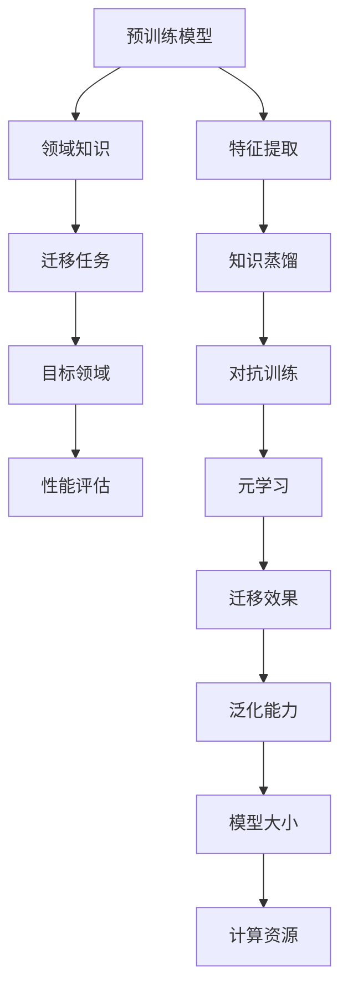

                 

关键词：知识迁移、大型语言模型、技术挑战、算法原理、数学模型、项目实践、应用场景、未来展望。

> 摘要：本文旨在探讨大型语言模型（LLM）在知识迁移任务上所面临的技术挑战。通过对核心算法原理、数学模型、项目实践以及应用场景的深入分析，本文将揭示当前LLM在知识迁移任务中存在的问题和未来的发展方向。

## 1. 背景介绍

近年来，随着人工智能技术的飞速发展，大型语言模型（LLM）取得了显著的成果。LLM通过在大量文本数据上进行预训练，能够理解和生成自然语言，广泛应用于自然语言处理（NLP）的各种任务，如文本分类、机器翻译、问答系统等。然而，随着知识迁移（Knowledge Transfer）技术的兴起，如何将LLM的知识迁移到其他领域或任务，成为了一个备受关注的问题。

知识迁移旨在利用预训练模型在特定领域的知识，将其迁移到新的任务或领域，以提升模型在新领域的性能。在知识迁移任务中，LLM表现出色，但也面临着一系列技术挑战。本文将详细探讨这些挑战，并提出可能的解决方案。

## 2. 核心概念与联系

为了更好地理解知识迁移任务中的技术挑战，首先需要了解核心概念和它们之间的联系。以下是一个Mermaid流程图，展示了知识迁移任务中的关键概念和它们之间的关系。

### 2.1 预训练模型

预训练模型是指在大规模数据集上进行预训练，从而获得通用语言表示能力的模型。预训练模型的代表性技术包括基于Transformer的BERT、GPT等模型。这些模型通过在大规模文本数据上进行预训练，可以自动学习到丰富的语言知识。

### 2.2 领域知识

领域知识是指特定领域内的知识，如医学、法律、金融等。在知识迁移任务中，领域知识是迁移的关键。将预训练模型的知识迁移到特定领域，可以帮助模型更好地适应新的任务。

### 2.3 迁移任务

迁移任务是指将预训练模型的知识应用于新的任务。在知识迁移任务中，模型需要根据新的任务要求，调整其内部表示，以适应新的领域。

### 2.4 目标领域

目标领域是指模型需要迁移到的领域。目标领域的知识将直接影响迁移任务的效果。

### 2.5 性能评估

性能评估是评估迁移任务效果的重要手段。通过在目标领域上评估模型的性能，可以衡量知识迁移的效果。

### 2.6 特征提取

特征提取是指从输入数据中提取关键特征的过程。在知识迁移任务中，特征提取是关键步骤，它决定了模型能否成功迁移知识。

### 2.7 知识蒸馏

知识蒸馏是一种常见的知识迁移技术，通过将预训练模型的知识传递给较小的模型，以适应新的任务。

### 2.8 对抗训练

对抗训练是一种增强模型鲁棒性的技术，通过在训练过程中引入对抗样本，使模型能够更好地适应新的领域。

### 2.9 元学习

元学习是一种通过学习如何学习的技术，它旨在提高模型在迁移任务中的适应能力。

### 2.10 迁移效果

迁移效果是评估知识迁移任务成功与否的重要指标。通过评估模型的迁移效果，可以了解知识迁移任务的性能。

### 2.11 泛化能力

泛化能力是指模型在未见过的数据上表现的能力。在知识迁移任务中，泛化能力是衡量模型性能的重要指标。

### 2.12 模型大小

模型大小是指模型的参数量。在知识迁移任务中，模型大小将直接影响计算资源的需求。

### 2.13 计算资源

计算资源是指用于训练和推理的硬件资源。在知识迁移任务中，计算资源的需求将直接影响任务的执行效率。

## 3. 核心算法原理 & 具体操作步骤

### 3.1 算法原理概述

知识迁移任务中的核心算法包括预训练模型、特征提取、知识蒸馏、对抗训练和元学习。以下是对这些算法原理的概述。

### 3.2 算法步骤详解

#### 3.2.1 预训练模型

预训练模型的步骤如下：

1. 收集大规模文本数据集，并进行预处理，如分词、去停用词等。
2. 定义一个预训练模型架构，如BERT、GPT等。
3. 在大规模文本数据集上进行预训练，优化模型参数。

#### 3.2.2 特征提取

特征提取的步骤如下：

1. 将输入数据输入到预训练模型中，获取特征表示。
2. 对特征表示进行筛选和调整，以适应新的任务。

#### 3.2.3 知识蒸馏

知识蒸馏的步骤如下：

1. 使用预训练模型对目标领域数据进行推理，获取高层次的语义表示。
2. 将高层次的语义表示传递给较小的模型，进行知识传递。
3. 在较小的模型上优化参数，以适应新的任务。

#### 3.2.4 对抗训练

对抗训练的步骤如下：

1. 在预训练模型的输入数据中添加对抗样本，以增强模型的鲁棒性。
2. 在对抗样本上进行训练，优化模型参数。

#### 3.2.5 元学习

元学习的步骤如下：

1. 定义一个元学习模型，用于学习如何学习。
2. 在多个任务上进行训练，优化元学习模型参数。
3. 在新的任务上应用元学习模型，以快速适应新的任务。

### 3.3 算法优缺点

#### 优点

1. 预训练模型：通过预训练，模型可以获得丰富的语言知识，提高迁移任务的性能。
2. 特征提取：通过特征提取，模型可以更好地适应新的任务。
3. 知识蒸馏：通过知识蒸馏，可以减少模型参数量，提高迁移任务的效率。
4. 对抗训练：通过对抗训练，可以增强模型的鲁棒性，提高迁移任务的泛化能力。
5. 元学习：通过元学习，可以快速适应新的任务，提高迁移任务的效果。

#### 缺点

1. 预训练模型：预训练模型需要大量计算资源和时间，成本较高。
2. 特征提取：特征提取过程可能导致信息丢失，影响迁移任务的性能。
3. 知识蒸馏：知识蒸馏可能导致知识传递的不完全性，影响迁移任务的效果。
4. 对抗训练：对抗训练可能导致模型过拟合，影响泛化能力。
5. 元学习：元学习模型可能难以适应极端的迁移任务，影响效果。

### 3.4 算法应用领域

核心算法在以下领域具有广泛的应用：

1. 自然语言处理（NLP）：文本分类、机器翻译、问答系统等。
2. 计算机视觉（CV）：图像识别、目标检测、图像生成等。
3. 计算机音频处理（AA）：语音识别、音乐生成等。
4. 医学：疾病诊断、医学图像分析等。
5. 金融：风险控制、市场预测等。

## 4. 数学模型和公式 & 详细讲解 & 举例说明

### 4.1 数学模型构建

在知识迁移任务中，常用的数学模型包括预训练模型、特征提取模型、知识蒸馏模型、对抗训练模型和元学习模型。以下是对这些模型的详细讲解。

#### 预训练模型

预训练模型的数学模型通常基于Transformer架构，如BERT、GPT等。以下是一个简单的BERT模型的数学模型构建：

$$
\text{BERT}(\text{x}; \theta) = \text{softmax}(\text{W}_\text{softmax} \text{softmax}(\text{W}_\text{seq} \text{X} + \text{b}_\text{seq}) + \text{b}_\text{softmax})
$$

其中，$\text{x}$ 表示输入序列，$\theta$ 表示模型参数，$\text{W}_\text{softmax}$、$\text{W}_\text{seq}$ 和 $\text{b}_\text{seq}$ 分别表示softmax层、序列层和偏置。

#### 特征提取模型

特征提取模型的数学模型通常基于卷积神经网络（CNN）或循环神经网络（RNN）。以下是一个简单的CNN模型的数学模型构建：

$$
\text{CNN}(\text{x}; \theta) = \text{max}\{\text{ReLU}(\text{W}_\text{conv} \text{X} + \text{b}_\text{conv})\}
$$

其中，$\text{x}$ 表示输入序列，$\theta$ 表示模型参数，$\text{W}_\text{conv}$ 和 $\text{b}_\text{conv}$ 分别表示卷积层和偏置。

#### 知识蒸馏模型

知识蒸馏模型的数学模型通常基于教师模型和学

