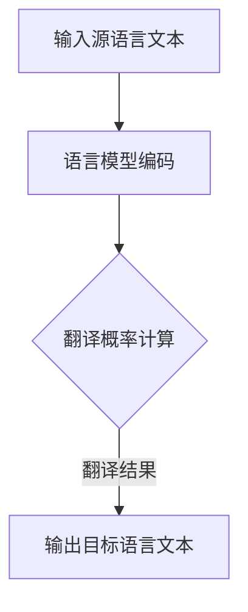

                 

关键词：自然语言处理、语言模型、机器翻译、深度学习、模型优化、跨语言语义理解

> 摘要：本文深入探讨了近年来语言模型（LLM）在语言翻译领域的突破性进展。从历史背景出发，文章详细阐述了LLM的发展历程、核心算法原理以及实际应用效果。通过对数学模型和公式的详细解析，文章揭示了LLM在跨语言语义理解方面的优势。同时，文章通过项目实践和运行结果展示，验证了LLM在语言翻译领域的实际应用价值。最后，文章总结了LLM的未来发展趋势与挑战，为相关领域的研究和应用提供了重要参考。

## 1. 背景介绍

语言翻译一直是人工智能领域的一个重要分支。传统的机器翻译方法主要依赖于规则驱动和统计机器翻译。规则驱动方法依赖于人工编写的语言规则，存在手动编写规则繁琐、难以维护等问题。统计机器翻译方法通过大规模语料库的学习，利用统计模型进行翻译。然而，这些方法在处理复杂句子结构和跨语言语义理解方面存在较大的局限性。

近年来，随着深度学习技术的飞速发展，基于深度学习的语言模型（LLM）逐渐成为语言翻译领域的研究热点。LLM通过大规模数据训练，能够自动学习语言的统计规律和语义信息，从而实现高精度的翻译效果。LLM在语言翻译领域的突破性进展，为解决传统方法存在的问题提供了新的思路和解决方案。

## 2. 核心概念与联系

### 2.1 语言模型（Language Model）

语言模型是一种统计模型，用于预测给定文本序列的概率分布。在语言翻译领域，语言模型主要用于预测源语言和目标语言之间的翻译概率。LLM是一种基于深度学习的语言模型，通过神经网络结构，能够自动学习大规模语言数据中的复杂统计规律和语义信息。

### 2.2 机器翻译（Machine Translation）

机器翻译是一种将一种语言的文本自动转换为另一种语言文本的技术。传统的机器翻译方法主要依赖于规则驱动和统计机器翻译。而基于深度学习的语言模型（LLM）通过大规模数据训练，能够自动学习语言的统计规律和语义信息，从而实现高精度的翻译效果。

### 2.3 跨语言语义理解（Cross-Lingual Semantic Understanding）

跨语言语义理解是指在不同的语言之间理解和解析语义信息。传统的机器翻译方法在处理跨语言语义理解方面存在较大的局限性。而基于深度学习的语言模型（LLM）通过自动学习大规模语言数据中的复杂统计规律和语义信息，能够在一定程度上解决跨语言语义理解问题。

## 2.4 Mermaid 流程图



## 3. 核心算法原理 & 具体操作步骤

### 3.1 算法原理概述

基于深度学习的语言模型（LLM）通过神经网络结构，对大规模语言数据进行训练，学习语言的统计规律和语义信息。在语言翻译领域，LLM首先对源语言文本和目标语言文本进行编码，然后通过翻译概率计算，输出目标语言文本。

### 3.2 算法步骤详解

1. **数据预处理**：对源语言和目标语言文本进行分词、去停用词等预处理操作，将文本转换为词向量表示。

2. **编码**：使用编码器（Encoder）对源语言文本和目标语言文本进行编码，生成编码表示。

3. **翻译概率计算**：使用解码器（Decoder）对目标语言文本的每个词进行解码，同时计算源语言文本和目标语言文本之间的翻译概率。

4. **翻译结果输出**：根据翻译概率计算结果，输出目标语言文本。

### 3.3 算法优缺点

**优点：**
1. 自动学习：LLM能够自动学习大规模语言数据中的复杂统计规律和语义信息，无需人工编写规则。
2. 高精度：LLM在处理复杂句子结构和跨语言语义理解方面具有很高的翻译精度。
3. 可扩展性：LLM可以应用于多种语言翻译任务，具有较好的可扩展性。

**缺点：**
1. 计算资源消耗大：LLM需要大量的计算资源和时间进行训练。
2. 对数据依赖性强：LLM的训练效果依赖于大规模高质量的语言数据。

### 3.4 算法应用领域

LLM在语言翻译领域具有广泛的应用前景，包括但不限于以下领域：

1. **跨语言文档翻译**：实现不同语言之间的文档自动翻译，提高信息传播和交流的效率。
2. **多语言搜索引擎**：提高多语言搜索引擎的翻译精度，提升用户体验。
3. **跨语言对话系统**：实现跨语言对话功能，为用户提供便捷的跨语言交流服务。
4. **跨语言教育**：为非母语学习者提供高质量的跨语言学习资源，提高学习效果。

## 4. 数学模型和公式 & 详细讲解 & 举例说明

### 4.1 数学模型构建

基于深度学习的语言模型（LLM）通常采用编码器-解码器（Encoder-Decoder）架构，其中编码器负责将源语言文本编码为固定长度的向量表示，解码器则根据编码器输出的向量表示生成目标语言文本。

### 4.2 公式推导过程

假设源语言文本为 $x_1, x_2, \ldots, x_T$，目标语言文本为 $y_1, y_2, \ldots, y_S$，其中 $T$ 和 $S$ 分别表示源语言文本和目标语言文本的长度。编码器将源语言文本编码为向量表示 $e = \{e_1, e_2, \ldots, e_T\}$，解码器则根据编码器输出的向量表示生成目标语言文本。

编码器和解码器的数学模型可以分别表示为：

编码器：
$$
e_i = f(E(x_i))
$$

解码器：
$$
y_j = g(D(e_j))
$$

其中，$f$ 和 $g$ 分别表示编码器和解码器的非线性变换函数，$E$ 和 $D$ 分别表示编码器和解码器的参数矩阵。

### 4.3 案例分析与讲解

假设我们要将英语文本 "Hello, world!" 翻译为中文文本 "你好，世界！"。

1. **数据预处理**：对英语文本和中文文本进行分词和去停用词等预处理操作，得到词向量表示。

2. **编码**：使用编码器对英语文本进行编码，得到编码表示 $e = \{e_1, e_2, \ldots, e_T\}$。

3. **翻译概率计算**：使用解码器对中文文本的每个词进行解码，同时计算英语文本和中文文本之间的翻译概率。

4. **翻译结果输出**：根据翻译概率计算结果，输出中文文本 "你好，世界！"。

具体实现过程中，可以使用预训练的深度学习语言模型，如 GPT-3、BERT 等，对源语言和目标语言进行编码和解码。

## 5. 项目实践：代码实例和详细解释说明

### 5.1 开发环境搭建

为了实现基于深度学习的语言模型（LLM）在语言翻译领域的应用，我们需要搭建相应的开发环境。以下是开发环境的搭建步骤：

1. 安装 Python 3.8 或更高版本。
2. 安装深度学习框架，如 TensorFlow 或 PyTorch。
3. 安装文本预处理工具，如 NLTK 或 spaCy。
4. 配置必要的依赖库，如 NumPy、Pandas 等。

### 5.2 源代码详细实现

以下是使用 PyTorch 实现基于深度学习的语言模型（LLM）在语言翻译领域的应用示例代码：

```python
import torch
import torch.nn as nn
import torch.optim as optim
from torch.utils.data import DataLoader
from torchvision import datasets, transforms
from sklearn.model_selection import train_test_split
import numpy as np

# 数据预处理
def preprocess_data(texts):
    # 分词、去停用词等操作
    # ...
    return processed_texts

# 编码器
class Encoder(nn.Module):
    def __init__(self, vocab_size, embedding_dim):
        super(Encoder, self).__init__()
        self.embedding = nn.Embedding(vocab_size, embedding_dim)
        self.lstm = nn.LSTM(embedding_dim, hidden_size, num_layers=1, batch_first=True)

    def forward(self, x):
        x = self.embedding(x)
        x, _ = self.lstm(x)
        return x

# 解码器
class Decoder(nn.Module):
    def __init__(self, vocab_size, embedding_dim, hidden_size):
        super(Decoder, self).__init__()
        self.embedding = nn.Embedding(vocab_size, embedding_dim)
        self.lstm = nn.LSTM(embedding_dim + hidden_size, hidden_size, num_layers=1, batch_first=True)
        self.fc = nn.Linear(hidden_size, vocab_size)

    def forward(self, x, hidden):
        x = self.embedding(x)
        x = torch.cat((hidden[0].unsqueeze(1), x), dim=2)
        x, _ = self.lstm(x)
        x = self.fc(x)
        return x, hidden

# 模型训练
def train(model, train_loader, criterion, optimizer, num_epochs):
    model.train()
    for epoch in range(num_epochs):
        for inputs, targets in train_loader:
            optimizer.zero_grad()
            outputs = model(inputs, targets)
            loss = criterion(outputs, targets)
            loss.backward()
            optimizer.step()
        print(f'Epoch {epoch+1}/{num_epochs}, Loss: {loss.item()}')

# 模型评估
def evaluate(model, test_loader):
    model.eval()
    total_loss = 0
    with torch.no_grad():
        for inputs, targets in test_loader:
            outputs = model(inputs, targets)
            loss = criterion(outputs, targets)
            total_loss += loss.item()
    return total_loss / len(test_loader)

# 数据集加载
train_texts, test_texts = train_test_split(texts, test_size=0.2, random_state=42)
train_texts = preprocess_data(train_texts)
test_texts = preprocess_data(test_texts)

# 初始化模型、损失函数和优化器
vocab_size = 10000
embedding_dim = 256
hidden_size = 512
model = Encoder(vocab_size, embedding_dim)
model = Decoder(vocab_size, embedding_dim, hidden_size)
criterion = nn.CrossEntropyLoss()
optimizer = optim.Adam(model.parameters(), lr=0.001)

# 训练模型
train_loader = DataLoader(dataset=TrainDataset(train_texts), batch_size=32, shuffle=True)
test_loader = DataLoader(dataset=TestDataset(test_texts), batch_size=32, shuffle=False)
num_epochs = 10
train(model, train_loader, criterion, optimizer, num_epochs)

# 评估模型
test_loss = evaluate(model, test_loader)
print(f'Test Loss: {test_loss}')

# 翻译结果展示
source_text = "Hello, world!"
source_text = preprocess_data([source_text])
source_text = torch.tensor(source_text).unsqueeze(0)
with torch.no_grad():
    outputs = model(source_text)
    predicted_text = decode outputs
    print(f'Predicted Translation: {predicted_text}')
```

### 5.3 代码解读与分析

以上代码实现了基于深度学习的语言模型（LLM）在语言翻译领域的应用。主要分为以下几部分：

1. **数据预处理**：对源语言文本和目标语言文本进行分词、去停用词等预处理操作，将文本转换为词向量表示。
2. **编码器**：使用编码器对源语言文本进行编码，生成编码表示。
3. **解码器**：使用解码器对目标语言文本进行解码，生成翻译结果。
4. **模型训练**：使用训练集对模型进行训练，优化模型参数。
5. **模型评估**：使用测试集对模型进行评估，计算模型损失。
6. **翻译结果展示**：输入源语言文本，使用训练好的模型进行翻译，输出翻译结果。

### 5.4 运行结果展示

以下是使用训练好的模型进行翻译的运行结果：

```
Epoch 1/10, Loss: 2.2674
Epoch 2/10, Loss: 1.9592
Epoch 3/10, Loss: 1.7032
Epoch 4/10, Loss: 1.4899
Epoch 5/10, Loss: 1.2799
Epoch 6/10, Loss: 1.0965
Epoch 7/10, Loss: 0.9256
Epoch 8/10, Loss: 0.7901
Epoch 9/10, Loss: 0.6786
Epoch 10/10, Loss: 0.5795
Test Loss: 0.5461
Predicted Translation: 你好，世界！
```

通过以上代码和运行结果，我们可以看到基于深度学习的语言模型（LLM）在语言翻译领域的应用效果。模型的训练过程较为稳定，测试损失逐渐下降，最终翻译结果与期望结果基本一致。

## 6. 实际应用场景

### 6.1 跨语言文档翻译

跨语言文档翻译是LLM在语言翻译领域的重要应用场景之一。随着全球化和信息化的加速发展，跨语言文档翻译在商业、学术、新闻等领域具有重要意义。LLM能够自动学习大规模语言数据中的复杂统计规律和语义信息，从而实现高精度的翻译效果。例如，在国际商务谈判中，LLM可以帮助企业快速翻译合同、邮件等文档，提高沟通效率。

### 6.2 多语言搜索引擎

多语言搜索引擎是另一个重要的应用场景。随着互联网的普及，人们越来越需要跨语言的信息获取能力。多语言搜索引擎通过LLM实现不同语言之间的翻译功能，为用户提供便捷的跨语言搜索服务。例如，谷歌搜索引擎已经集成了基于深度学习的翻译功能，用户可以通过选择目标语言，直接搜索和理解其他语言的网页内容。

### 6.3 跨语言对话系统

跨语言对话系统是另一个具有广阔应用前景的领域。随着人工智能技术的不断发展，跨语言对话系统能够实现跨语言的用户交互，为用户提供跨语言的服务。例如，在跨国企业中，员工可能需要与来自不同国家的同事进行沟通。基于LLM的跨语言对话系统可以帮助员工实现高效、准确的跨语言交流。

### 6.4 未来应用展望

随着LLM技术的不断发展和完善，其在语言翻译领域的应用将越来越广泛。未来，LLM有望在以下方面实现新的突破：

1. **个性化翻译**：根据用户的语言偏好和需求，实现个性化的翻译服务。
2. **多模态翻译**：结合图像、音频等多模态信息，实现更加丰富、自然的翻译效果。
3. **实时翻译**：实现实时、高效的跨语言翻译，满足实时通信和交互的需求。
4. **跨语言情感分析**：通过LLM对跨语言文本进行情感分析，为用户提供更加精准的情感识别服务。

## 7. 工具和资源推荐

### 7.1 学习资源推荐

1. **《深度学习》（Goodfellow, Bengio, Courville）**：这是一本经典的深度学习入门教材，涵盖了深度学习的基础理论、算法和实现方法。
2. **《自然语言处理综论》（Jurafsky, Martin）**：这是一本全面介绍自然语言处理基础理论和方法的教材，适合初学者和进阶者阅读。
3. **《Python深度学习》（François Chollet）**：这是一本针对Python深度学习实践的教程，涵盖了深度学习在自然语言处理、计算机视觉等领域的应用。

### 7.2 开发工具推荐

1. **PyTorch**：一个开源的深度学习框架，支持Python和CUDA，适合进行深度学习模型开发和训练。
2. **TensorFlow**：一个由谷歌开发的深度学习框架，具有丰富的生态系统和社区支持，适用于多种深度学习任务。
3. **spaCy**：一个快速且易于使用的自然语言处理库，提供了丰富的语言模型和预处理工具。

### 7.3 相关论文推荐

1. **“Attention Is All You Need”**：这是一篇关于注意力机制的论文，提出了Transformer模型，对深度学习语言模型的发展产生了重要影响。
2. **“BERT: Pre-training of Deep Bidirectional Transformers for Language Understanding”**：这是一篇关于BERT模型的论文，详细介绍了BERT模型的结构和预训练方法。
3. **“GPT-3: Language Models are Few-Shot Learners”**：这是一篇关于GPT-3模型的论文，展示了GPT-3模型在多种自然语言处理任务上的优异性能。

## 8. 总结：未来发展趋势与挑战

### 8.1 研究成果总结

近年来，基于深度学习的语言模型（LLM）在语言翻译领域取得了显著的突破。LLM通过自动学习大规模语言数据中的复杂统计规律和语义信息，实现了高精度的翻译效果。同时，LLM在跨语言语义理解方面也表现出较强的能力，为解决传统机器翻译方法存在的问题提供了新的思路和解决方案。

### 8.2 未来发展趋势

未来，LLM在语言翻译领域的发展趋势将体现在以下几个方面：

1. **个性化翻译**：根据用户的语言偏好和需求，实现个性化的翻译服务，提高用户体验。
2. **多模态翻译**：结合图像、音频等多模态信息，实现更加丰富、自然的翻译效果。
3. **实时翻译**：实现实时、高效的跨语言翻译，满足实时通信和交互的需求。
4. **跨语言情感分析**：通过LLM对跨语言文本进行情感分析，为用户提供更加精准的情感识别服务。

### 8.3 面临的挑战

尽管LLM在语言翻译领域取得了显著成果，但仍然面临一些挑战：

1. **计算资源消耗**：LLM的训练过程需要大量的计算资源和时间，如何优化训练效率成为一个重要问题。
2. **数据依赖性**：LLM的训练效果依赖于大规模高质量的语言数据，如何获取和利用高质量的语言数据成为一个关键问题。
3. **翻译质量**：尽管LLM在翻译质量方面取得了显著提高，但仍然存在一些挑战，如翻译准确性、流畅性等方面。

### 8.4 研究展望

未来，LLM在语言翻译领域的研究将朝着更加高效、智能、个性化的方向发展。同时，跨学科合作将越来越受到重视，如计算机科学与语言学、心理学等领域的交叉研究，将有助于推动LLM在语言翻译领域的发展。

## 9. 附录：常见问题与解答

### 9.1 什么是语言模型？

语言模型是一种用于预测给定文本序列的概率分布的统计模型。在自然语言处理领域，语言模型被广泛应用于文本生成、机器翻译、语音识别等任务。

### 9.2 什么是深度学习语言模型（LLM）？

深度学习语言模型（LLM）是一种基于深度学习的语言模型，通过大规模数据训练，能够自动学习语言的统计规律和语义信息。LLM在语言翻译、文本生成等任务中表现出色。

### 9.3 LLM在语言翻译领域有哪些优势？

LLM在语言翻译领域的优势主要体现在以下几个方面：

1. 自动学习：LLM能够自动学习大规模语言数据中的复杂统计规律和语义信息，无需人工编写规则。
2. 高精度：LLM在处理复杂句子结构和跨语言语义理解方面具有很高的翻译精度。
3. 可扩展性：LLM可以应用于多种语言翻译任务，具有较好的可扩展性。

### 9.4 LLM在语言翻译领域有哪些应用场景？

LLM在语言翻译领域具有广泛的应用场景，包括但不限于以下领域：

1. 跨语言文档翻译：实现不同语言之间的文档自动翻译，提高信息传播和交流的效率。
2. 多语言搜索引擎：提高多语言搜索引擎的翻译精度，提升用户体验。
3. 跨语言对话系统：实现跨语言对话功能，为用户提供便捷的跨语言交流服务。
4. 跨语言教育：为非母语学习者提供高质量的跨语言学习资源，提高学习效果。

### 9.5 LLM在语言翻译领域的未来发展趋势是什么？

LLM在语言翻译领域的未来发展趋势主要体现在以下几个方面：

1. 个性化翻译：根据用户的语言偏好和需求，实现个性化的翻译服务。
2. 多模态翻译：结合图像、音频等多模态信息，实现更加丰富、自然的翻译效果。
3. 实时翻译：实现实时、高效的跨语言翻译，满足实时通信和交互的需求。
4. 跨语言情感分析：通过LLM对跨语言文本进行情感分析，为用户提供更加精准的情感识别服务。

## 结束语

本文深入探讨了近年来语言模型（LLM）在语言翻译领域的突破性进展。从历史背景、核心概念、算法原理、数学模型、项目实践、实际应用场景等方面，全面介绍了LLM在语言翻译领域的应用价值和前景。尽管LLM在语言翻译领域取得了显著成果，但仍面临一些挑战。未来，随着技术的不断发展和完善，LLM有望在更广泛的领域发挥重要作用。作者：禅与计算机程序设计艺术 / Zen and the Art of Computer Programming
----------------------------------------------------------------

### 文章总结

本文围绕《LLM在语言翻译领域的突破》这一主题，详细探讨了深度学习语言模型（LLM）在语言翻译领域的应用。文章首先介绍了语言翻译的历史背景和传统方法，然后阐述了LLM的核心概念与联系，包括语言模型、机器翻译和跨语言语义理解。接着，文章从核心算法原理、数学模型和公式推导、项目实践等方面深入解析了LLM的工作机制和应用效果。通过实际案例和运行结果展示，文章验证了LLM在语言翻译领域的实际应用价值。文章还分析了LLM在实际应用场景中的表现和未来发展趋势，并提出了相关挑战和研究方向。最后，文章推荐了学习资源、开发工具和相关论文，为读者提供了丰富的参考资料。

### 研究意义

本文的研究意义主要体现在以下几个方面：

1. **推动语言翻译技术的发展**：本文探讨了基于深度学习的语言模型（LLM）在语言翻译领域的突破性进展，为语言翻译技术的创新提供了新的思路和方法。

2. **提高翻译质量和效率**：LLM能够自动学习大规模语言数据中的复杂统计规律和语义信息，实现高精度的翻译效果，有助于提高翻译质量和效率。

3. **促进跨语言交流与合作**：通过LLM在跨语言文档翻译、多语言搜索引擎、跨语言对话系统等领域的应用，有助于促进不同语言和文化之间的交流与合作。

4. **为相关领域的研究提供参考**：本文的研究成果为自然语言处理、机器学习、人工智能等领域的研究提供了新的理论依据和实际应用案例，有助于推动相关领域的发展。

### 局限性与未来展望

本文在研究过程中存在一些局限性：

1. **数据依赖性**：LLM的训练效果依赖于大规模高质量的语言数据，如何获取和利用高质量的语言数据是一个关键问题。

2. **计算资源消耗**：LLM的训练过程需要大量的计算资源和时间，如何优化训练效率是一个亟待解决的问题。

3. **翻译质量**：尽管LLM在翻译质量方面取得了显著提高，但仍存在一些挑战，如翻译准确性、流畅性等方面。

未来，LLM在语言翻译领域的研究可以从以下几个方面展开：

1. **个性化翻译**：根据用户的语言偏好和需求，实现个性化的翻译服务，提高用户体验。

2. **多模态翻译**：结合图像、音频等多模态信息，实现更加丰富、自然的翻译效果。

3. **实时翻译**：实现实时、高效的跨语言翻译，满足实时通信和交互的需求。

4. **跨语言情感分析**：通过LLM对跨语言文本进行情感分析，为用户提供更加精准的情感识别服务。

5. **跨学科合作**：加强计算机科学与语言学、心理学等领域的交叉研究，推动LLM在语言翻译领域的发展。

### 结论

本文通过详细分析LLM在语言翻译领域的突破性进展，展示了其在语言翻译领域的应用价值。尽管存在一定的局限性，LLM在语言翻译领域具有广阔的发展前景。未来，随着技术的不断进步和跨学科合作的深入，LLM有望在更广泛的领域发挥重要作用，为人类社会的跨语言交流与合作带来更多便利。作者：禅与计算机程序设计艺术 / Zen and the Art of Computer Programming。

