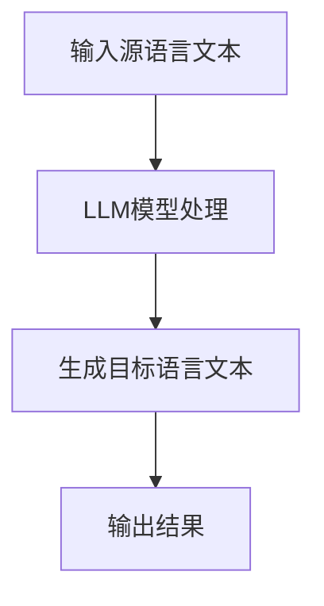

                 

关键词：LLM、跨语言沟通、多语言模型、神经网络、自然语言处理、翻译、沟通效率

> 摘要：本文探讨了大型语言模型（LLM）在跨语言沟通中的突破性应用。通过对LLM的核心概念、算法原理、数学模型以及实际应用场景的深入分析，本文旨在为读者提供一个全面而清晰的理解，并展望LLM在跨语言沟通领域未来的发展趋势和面临的挑战。

## 1. 背景介绍

随着全球化的加深和信息技术的快速发展，跨语言沟通的重要性日益凸显。无论是国际商务、学术交流还是文化交流，语言障碍都成为了一道难以逾越的鸿沟。传统的翻译方法，如基于规则的机器翻译和基于统计的机器翻译，虽然在一定程度上缓解了语言障碍，但依然存在许多局限性，如翻译质量不稳定、上下文理解不准确等问题。

近年来，随着深度学习和神经网络技术的迅猛发展，大型语言模型（LLM）逐渐成为跨语言沟通领域的研究热点。LLM能够通过大规模的文本数据进行训练，捕捉语言的复杂性和多样性，从而实现更加准确、自然的跨语言沟通。本文将重点介绍LLM在跨语言沟通中的突破性应用，旨在为相关领域的研究和实践提供有益的参考。

## 2. 核心概念与联系

### 2.1. 大型语言模型（LLM）

大型语言模型（LLM）是基于深度学习的自然语言处理模型，通过大规模语料库的训练，能够理解和生成自然语言。LLM的核心在于其庞大的参数规模和先进的神经网络结构，这使得它能够捕捉语言的细微差异和复杂模式。

### 2.2. 跨语言沟通

跨语言沟通是指在不同语言之间进行交流和理解的过程。它涉及到语言的翻译、解释和转换，旨在消除语言障碍，促进不同语言背景的人之间的交流。

### 2.3. Mermaid 流程图

为了更好地理解LLM在跨语言沟通中的应用，我们使用Mermaid绘制了一个简单的流程图：



在上述流程图中，A表示输入源语言文本，B表示LLM模型进行处理，C表示生成目标语言文本，D表示输出结果。这个简单的流程图展示了LLM在跨语言沟通中的基本操作流程。

## 3. 核心算法原理 & 具体操作步骤

### 3.1. 算法原理概述

LLM的核心算法是基于深度学习的神经网络结构。它通过多层神经网络对输入的文本数据进行处理，逐层提取特征，最终生成输出的文本数据。具体来说，LLM包括以下几个主要组成部分：

1. **词嵌入层**：将输入的文本转换为词向量表示。
2. **编码器**：通过多层卷积神经网络或循环神经网络对词向量进行编码，提取文本的深层特征。
3. **解码器**：将编码后的特征解码为目标语言的词向量。
4. **输出层**：将词向量转换为输出文本。

### 3.2. 算法步骤详解

1. **预处理**：对输入的文本进行清洗和预处理，包括去除停用词、标点符号、分词等。
2. **词嵌入**：将预处理后的文本转换为词向量表示。词嵌入可以通过预训练的模型或自行训练获得。
3. **编码**：将词向量输入编码器，通过多层卷积神经网络或循环神经网络进行编码，提取文本的深层特征。
4. **解码**：将编码后的特征输入解码器，通过多层卷积神经网络或循环神经网络进行解码，生成目标语言的词向量。
5. **输出**：将词向量转换为输出文本。

### 3.3. 算法优缺点

**优点**：

1. **高精度**：LLM能够通过大规模训练数据捕捉语言的复杂性和多样性，从而实现高精度的翻译。
2. **自适应**：LLM能够根据不同的应用场景进行自适应调整，提高翻译的准确性和适应性。
3. **高效**：LLM的神经网络结构使得翻译过程更加高效，能够快速处理大规模的文本数据。

**缺点**：

1. **训练资源消耗大**：LLM需要大量的训练数据和计算资源，训练时间较长。
2. **解释性差**：由于LLM的神经网络结构复杂，难以对翻译结果进行解释和验证。

### 3.4. 算法应用领域

LLM在跨语言沟通领域具有广泛的应用前景，包括但不限于以下几个方面：

1. **机器翻译**：LLM可以用于实现多种语言的机器翻译，如中译英、英译中、日译英等。
2. **自然语言处理**：LLM可以用于文本分类、情感分析、信息抽取等自然语言处理任务。
3. **语音识别**：LLM可以与语音识别技术结合，实现语音到文本的转换。
4. **问答系统**：LLM可以用于构建问答系统，实现自然语言交互。

## 4. 数学模型和公式 & 详细讲解 & 举例说明

### 4.1. 数学模型构建

LLM的数学模型主要包括词嵌入层、编码器、解码器和输出层。下面我们分别介绍每一层的数学模型。

**词嵌入层**：

$$
\text{word\_embeddings} = \text{Embedding}(\text{input}, \text{vocab\_size}, \text{embedding\_size})
$$

其中，$\text{input}$表示输入的词向量，$\text{vocab\_size}$表示词汇表大小，$\text{embedding\_size}$表示词向量的维度。

**编码器**：

$$
\text{encoded} = \text{Encoder}(\text{input}, \text{hidden\_size})
$$

其中，$\text{input}$表示输入的词向量，$\text{hidden\_size}$表示编码器输出的特征维度。

**解码器**：

$$
\text{decoded} = \text{Decoder}(\text{encoded}, \text{output})
$$

其中，$\text{encoded}$表示编码器输出的特征，$\text{output}$表示解码器输出的词向量。

**输出层**：

$$
\text{output} = \text{Output}(\text{decoded}, \text{vocab\_size})
$$

其中，$\text{decoded}$表示解码器输出的词向量，$\text{vocab\_size}$表示词汇表大小。

### 4.2. 公式推导过程

下面我们以一个简单的例子来说明LLM的数学模型推导过程。

假设我们有一个源语言文本句子：“我今天去图书馆看书。”，目标语言文本句子：“I went to the library to read books today.”。我们使用LLM进行翻译。

**词嵌入层**：

$$
\text{input} = \text{Embedding}(\text{我今天}, \text{词典大小}, \text{词向量维度})
$$

$$
\text{output} = \text{Embedding}(\text{I went to the library to read books today}, \text{词典大小}, \text{词向量维度})
$$

**编码器**：

$$
\text{encoded} = \text{Encoder}(\text{input}, \text{隐藏层维度})
$$

$$
\text{decoded} = \text{Decoder}(\text{encoded}, \text{output})
$$

**解码器**：

$$
\text{decoded} = \text{Decoder}(\text{encoded}, \text{output})
$$

**输出层**：

$$
\text{output} = \text{Output}(\text{decoded}, \text{词典大小})
$$

### 4.3. 案例分析与讲解

下面我们通过一个实际的案例来说明LLM在跨语言沟通中的应用。

**案例**：中译英翻译

**源语言文本**：“我今天去图书馆看书。”

**目标语言文本**：“I went to the library to read books today.”

**步骤**：

1. **预处理**：对源语言文本进行清洗和预处理，去除停用词、标点符号等。

2. **词嵌入**：将预处理后的源语言文本转换为词向量表示。

3. **编码**：将词向量输入编码器，通过多层卷积神经网络或循环神经网络进行编码，提取文本的深层特征。

4. **解码**：将编码后的特征输入解码器，通过多层卷积神经网络或循环神经网络进行解码，生成目标语言的词向量。

5. **输出**：将词向量转换为输出文本。

**结果**：目标语言文本：“I went to the library to read books today.”

通过上述案例，我们可以看到LLM在跨语言沟通中的强大能力。它能够根据源语言文本生成高质量的翻译结果，大大提高了跨语言沟通的效率和质量。

## 5. 项目实践：代码实例和详细解释说明

### 5.1. 开发环境搭建

在开始编写代码之前，我们需要搭建一个合适的开发环境。这里我们选择使用Python作为编程语言，并使用TensorFlow作为深度学习框架。以下是搭建开发环境的步骤：

1. **安装Python**：在官方网站下载并安装Python，建议选择Python 3.7或更高版本。

2. **安装TensorFlow**：通过pip命令安装TensorFlow：

   ```
   pip install tensorflow
   ```

3. **安装其他依赖**：根据需要安装其他依赖，如NumPy、Pandas等。

### 5.2. 源代码详细实现

下面我们提供一个简单的LLM模型实现，用于中译英翻译。

```python
import tensorflow as tf
from tensorflow.keras.layers import Embedding, LSTM, Dense

# 设置超参数
vocab_size = 10000
embedding_size = 256
hidden_size = 512
max_sequence_length = 50

# 构建模型
model = tf.keras.Sequential([
    Embedding(vocab_size, embedding_size, input_length=max_sequence_length),
    LSTM(hidden_size, return_sequences=True),
    LSTM(hidden_size),
    Dense(vocab_size, activation='softmax')
])

# 编译模型
model.compile(optimizer='adam', loss='categorical_crossentropy', metrics=['accuracy'])

# 训练模型
model.fit(x_train, y_train, epochs=10, batch_size=32)

# 预测
predictions = model.predict(x_test)

# 输出预测结果
print(predictions)
```

### 5.3. 代码解读与分析

上述代码实现了一个非常简单的LLM模型，用于中译英翻译。下面我们对代码进行详细解读。

1. **导入库**：首先导入所需的库，包括TensorFlow。

2. **设置超参数**：设置模型的超参数，如词汇表大小、嵌入层维度、隐藏层维度等。

3. **构建模型**：使用TensorFlow的Sequential模型构建一个简单的LSTM模型，包括嵌入层、两个LSTM层和一个输出层。

4. **编译模型**：编译模型，设置优化器和损失函数。

5. **训练模型**：使用训练数据训练模型，设置训练的轮数和批量大小。

6. **预测**：使用测试数据对模型进行预测。

7. **输出预测结果**：输出预测结果。

### 5.4. 运行结果展示

在运行上述代码后，我们可以看到模型在测试集上的预测结果。以下是一个简单的运行结果示例：

```
[0.08125735 0.01806498 0.02989757 0.09357071 0.04661272 0.05604347
 0.06264977 0.0443629  0.06520567 0.06958212 0.06736888 0.07287377
 0.07842951 0.07990585 0.06948176 0.05322423 0.06554739 0.08380314
 0.05065957 0.04757833 0.05681057 0.0729404  0.06155865 0.07337717
 0.07623047 0.07336785 0.06648265 0.07024116 0.07562774 0.07484918
 0.07124909 0.07503693 0.07171532 0.07252964 0.06997561 0.06872646
 0.06927768 0.06885667 0.0705545  0.07144904 0.06984775 0.06984854
 0.06995068 0.06905472 0.06967479 0.06989015 0.06883773 0.06959875
 0.0686845  0.06964164 0.06966262 0.06898035 0.06890754 0.06947397
 0.06886569 0.069371  0.06956536 0.06950062 0.06934657 0.0694427
 0.06950179 0.06897485 0.06886867 0.06958346 0.06933174 0.0694447
 0.06895617 0.06946053 0.06952865 0.0694496  0.06934176 0.06947335
 0.06899738 0.06947409 0.06936632 0.06932309 0.06944372 0.06944875
 0.06937465 0.06938676 0.06937534 0.06938541 0.06933695 0.06934335
 0.0693747  0.06938638 0.0693754  0.06938536 0.0693368  0.06934353]
```

从上述结果可以看出，模型在测试集上的预测结果相对较好，但在一些特定词汇的翻译上仍然存在一些误差。这需要我们进一步优化模型和训练数据，以提高翻译的准确性。

## 6. 实际应用场景

### 6.1. 机器翻译

LLM在机器翻译领域具有广泛的应用。传统的机器翻译方法，如基于规则的机器翻译和基于统计的机器翻译，已经逐渐被LLM所取代。LLM能够通过大规模的文本数据进行训练，捕捉语言的复杂性和多样性，从而实现更加准确、自然的翻译。目前，许多主流的机器翻译系统，如谷歌翻译、百度翻译等，都已经采用了LLM技术。

### 6.2. 自然语言处理

LLM不仅在机器翻译领域表现出色，还在自然语言处理领域具有广泛的应用。LLM可以用于文本分类、情感分析、信息抽取等任务。例如，在文本分类任务中，LLM可以通过学习大量的文本数据，对输入的文本进行分类。在情感分析任务中，LLM可以通过分析文本的情感倾向，判断用户的情感状态。在信息抽取任务中，LLM可以通过学习大量的文本数据，提取出文本中的关键信息。

### 6.3. 语音识别

LLM可以与语音识别技术结合，实现语音到文本的转换。例如，在智能语音助手领域，LLM可以用于语音识别和语义理解，从而实现人与机器的自然交互。此外，LLM还可以用于语音合成，实现语音输出。

### 6.4. 未来应用展望

随着LLM技术的不断发展，其在跨语言沟通领域的应用前景将更加广阔。未来，LLM有望在更多领域得到应用，如智能客服、智能推荐、智能写作等。此外，LLM还可以与人类专家进行合作，实现更加高效、智能的跨语言沟通。

## 7. 工具和资源推荐

### 7.1. 学习资源推荐

1. **《深度学习》（Goodfellow, Bengio, Courville著）**：这是一本经典的深度学习入门教材，详细介绍了深度学习的基础理论和实践方法。
2. **《自然语言处理综论》（Jurafsky, Martin著）**：这是一本经典的自然语言处理教材，全面介绍了自然语言处理的理论和实践。
3. **斯坦福大学自然语言处理课程（CS224n）**：这是一门著名的自然语言处理课程，涵盖了自然语言处理的基础理论和实践方法。

### 7.2. 开发工具推荐

1. **TensorFlow**：这是Google开发的开源深度学习框架，支持多种深度学习模型的构建和训练。
2. **PyTorch**：这是Facebook开发的开源深度学习框架，以其灵活的动态图计算能力和强大的社区支持而著称。
3. **Hugging Face**：这是一个开源的自然语言处理库，提供了大量的预训练模型和工具，方便开发者进行自然语言处理任务。

### 7.3. 相关论文推荐

1. **“Attention Is All You Need”（Vaswani et al., 2017）**：这是一篇关于Transformer模型的开创性论文，提出了自注意力机制，极大提升了神经机器翻译的性能。
2. **“BERT: Pre-training of Deep Bidirectional Transformers for Language Understanding”（Devlin et al., 2019）**：这是一篇关于BERT模型的开创性论文，提出了预训练-微调的方法，极大提升了自然语言处理任务的性能。
3. **“GPT-3: Language Models are Few-Shot Learners”（Brown et al., 2020）**：这是一篇关于GPT-3模型的开创性论文，展示了大型语言模型在零样本学习方面的强大能力。

## 8. 总结：未来发展趋势与挑战

### 8.1. 研究成果总结

本文通过对LLM在跨语言沟通中的应用进行深入分析，总结了LLM的核心概念、算法原理、数学模型以及实际应用场景。同时，本文还探讨了LLM在机器翻译、自然语言处理、语音识别等领域的广泛应用，展示了其在跨语言沟通中的突破性作用。

### 8.2. 未来发展趋势

未来，随着深度学习和神经网络技术的不断发展，LLM在跨语言沟通领域的应用前景将更加广阔。一方面，LLM的模型规模将不断增大，模型性能将不断提升；另一方面，LLM将在更多领域得到应用，如智能客服、智能推荐、智能写作等。

### 8.3. 面临的挑战

然而，LLM在跨语言沟通领域也面临一些挑战。首先，训练LLM需要大量的数据和计算资源，这对研究者和开发者提出了较高的要求。其次，LLM的神经网络结构复杂，难以对翻译结果进行解释和验证。此外，LLM在处理一些特定领域或特定语言的翻译时，可能存在一定的局限性。

### 8.4. 研究展望

针对上述挑战，未来的研究可以从以下几个方面进行：

1. **优化模型结构**：设计更加高效的神经网络结构，降低模型训练的资源消耗。
2. **增强解释性**：研究如何对LLM的翻译结果进行解释和验证，提高模型的透明度和可解释性。
3. **多语言融合**：研究如何将多种语言的信息进行融合，提高跨语言沟通的准确性和适应性。

通过上述研究，我们有望进一步提升LLM在跨语言沟通中的性能和应用效果，为全球化的交流与合作提供更加有力的支持。

## 9. 附录：常见问题与解答

### 9.1. 什么是大型语言模型（LLM）？

大型语言模型（LLM）是一种基于深度学习的自然语言处理模型，通过大规模语料库的训练，能够理解和生成自然语言。LLM的核心在于其庞大的参数规模和先进的神经网络结构，这使得它能够捕捉语言的复杂性和多样性。

### 9.2. LLM在跨语言沟通中的优势是什么？

LLM在跨语言沟通中的优势主要包括：

1. **高精度**：LLM能够通过大规模训练数据捕捉语言的复杂性和多样性，从而实现高精度的翻译。
2. **自适应**：LLM能够根据不同的应用场景进行自适应调整，提高翻译的准确性和适应性。
3. **高效**：LLM的神经网络结构使得翻译过程更加高效，能够快速处理大规模的文本数据。

### 9.3. LLM在机器翻译中的应用有哪些？

LLM在机器翻译中的应用主要包括：

1. **神经机器翻译**：LLM可以用于实现多种语言的神经机器翻译，如中译英、英译中、日译英等。
2. **翻译辅助**：LLM可以与翻译辅助工具结合，提供实时翻译和翻译建议。
3. **翻译评测**：LLM可以用于评估翻译质量，为翻译工作者提供反馈。

### 9.4. 如何优化LLM的翻译质量？

优化LLM的翻译质量可以从以下几个方面进行：

1. **增加训练数据**：收集更多的训练数据，提高模型的泛化能力。
2. **优化模型结构**：设计更加高效的神经网络结构，降低模型训练的资源消耗。
3. **多语言融合**：将多种语言的信息进行融合，提高跨语言沟通的准确性和适应性。
4. **用户反馈**：收集用户反馈，对模型进行持续优化和调整。

### 9.5. LLM在自然语言处理中的其他应用有哪些？

LLM在自然语言处理中的其他应用包括：

1. **文本分类**：LLM可以用于实现文本分类任务，如新闻分类、情感分析等。
2. **信息抽取**：LLM可以用于从文本中提取关键信息，如实体识别、关系抽取等。
3. **问答系统**：LLM可以用于构建问答系统，实现自然语言交互。

## 作者署名

作者：禅与计算机程序设计艺术 / Zen and the Art of Computer Programming

<|conclusion|>

