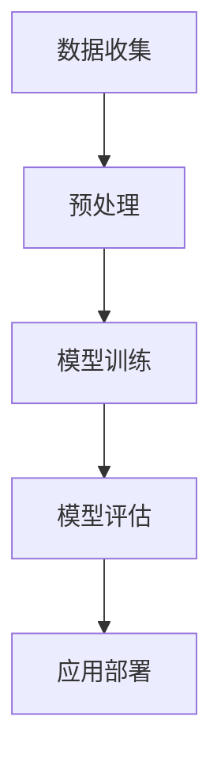

                 

关键词：大型语言模型（LLM）、就业市场、自动化、技能需求、职业转型

> 摘要：本文将深入探讨大型语言模型（LLM）对就业市场的潜在影响。随着LLM技术的不断发展和普及，传统职业是否会被取代？人才需求将如何变化？本文将从技术、经济和社会等多个角度分析这一问题，为从业者提供有价值的参考。

## 1. 背景介绍

近年来，人工智能领域取得了显著的进展，尤其是在自然语言处理（NLP）领域。大型语言模型（LLM）如GPT-3、BERT等，凭借其强大的文本生成和推理能力，已经在众多领域展现出巨大的潜力。从智能客服、自动写作，到代码补全、自然语言理解，LLM正逐渐改变着我们的工作和生活方式。

然而，随着LLM技术的不断成熟，人们开始关注这一技术对就业市场的影响。传统职业是否会因为LLM的自动化处理而消失？新的职业机会将如何出现？这些问题不仅关乎个体的职业生涯，也关系到整个社会的经济结构和就业生态。

本文将从以下几个方面探讨LLM对就业市场的潜在影响：

1. **技术发展与职业转型**：分析LLM技术如何推动职业转型，以及从业者应该如何适应这种变化。
2. **人才需求的变化**：探讨LLM技术对人才需求的影响，特别是对专业技能和通用技能的需求。
3. **实际案例**：通过实际案例展示LLM技术在就业市场中的应用，以及它们如何改变了传统的职业角色。
4. **未来展望**：预测LLM技术的发展趋势，并探讨其对就业市场的长期影响。

## 2. 核心概念与联系

### 2.1 LLM技术概述

大型语言模型（LLM）是一种基于深度学习的技术，它们通过学习大量的文本数据来理解和生成自然语言。LLM的核心在于其巨大的模型规模和复杂的神经网络结构，这使得它们能够捕捉到语言中的细微差异和复杂模式。

#### Mermaid 流程图



### 2.2 LLM与就业市场的关系

LLM技术不仅改变了我们的工作和生活方式，也对就业市场产生了深远的影响。以下是一些关键的联系：

1. **自动化与失业风险**：LLM的自动化处理能力可能会取代一些传统的工作岗位，如数据录入、客服等。
2. **职业转型与技能需求**：从业者需要适应新的技术环境，提升自身的专业技能和通用技能。
3. **人才竞争与职业发展**：LLM技术的发展促使人才市场发生变化，对人才的竞争也日益激烈。
4. **创新与创业机会**：新的职业机会和商业模式不断涌现，为创业者提供了广阔的空间。

## 3. 核心算法原理 & 具体操作步骤

### 3.1 算法原理概述

LLM的核心是基于变换器架构（Transformer），这种架构能够处理变长的序列数据，并利用注意力机制来捕捉序列中的长期依赖关系。以下是LLM的基本原理：

1. **输入嵌入（Input Embedding）**：将文本转换为稠密向量。
2. **变换器层（Transformer Layers）**：通过多头自注意力（Multi-Head Self-Attention）和前馈神经网络（Feedforward Neural Network）处理输入序列。
3. **输出层（Output Layer）**：将处理后的序列映射到输出，如文本生成、分类等。

### 3.2 算法步骤详解

1. **数据收集与预处理**：收集大量的文本数据，并进行预处理，如分词、去噪等。
2. **模型训练**：使用预处理后的数据训练模型，优化模型的参数。
3. **模型评估**：通过验证集和测试集评估模型的性能。
4. **应用部署**：将训练好的模型部署到实际应用场景中。

### 3.3 算法优缺点

#### 优点：

1. **强大的文本生成和理解能力**：LLM能够生成连贯、自然的文本，并理解复杂的语言结构。
2. **广泛的适用性**：LLM可以在多个应用领域发挥作用，如自然语言理解、机器翻译、智能客服等。

#### 缺点：

1. **计算资源需求大**：训练和运行LLM需要大量的计算资源和时间。
2. **数据隐私和安全问题**：大量数据的收集和处理可能涉及隐私和安全问题。

### 3.4 算法应用领域

1. **智能客服**：利用LLM的文本生成和理解能力，自动处理客户咨询。
2. **自动写作**：辅助新闻、文章、报告等写作，提高创作效率。
3. **自然语言理解**：用于信息检索、问答系统、情感分析等。
4. **教育辅助**：为学生提供个性化的学习支持和反馈。

## 4. 数学模型和公式 & 详细讲解 & 举例说明

### 4.1 数学模型构建

LLM的数学模型主要基于变换器架构（Transformer），其核心是多头自注意力（Multi-Head Self-Attention）和前馈神经网络（Feedforward Neural Network）。以下是变换器架构的基本数学公式：

#### 多头自注意力

$$
\text{Attention}(Q, K, V) = \text{softmax}\left(\frac{QK^T}{\sqrt{d_k}}\right)V
$$

其中，$Q$、$K$ 和 $V$ 分别是查询（Query）、键（Key）和值（Value）的向量，$d_k$ 是键的维度。

#### 前馈神经网络

$$
\text{FFN}(X) = \max(0, XW_1 + b_1)W_2 + b_2
$$

其中，$X$ 是输入向量，$W_1$ 和 $W_2$ 是权重矩阵，$b_1$ 和 $b_2$ 是偏置。

### 4.2 公式推导过程

#### 多头自注意力

多头自注意力通过将输入序列分解为多个子序列，并对每个子序列进行自注意力处理。具体推导如下：

$$
\text{MultiHead}(Q, K, V) = \text{Concat}(\text{head}_1, \text{head}_2, ..., \text{head}_h)W_O
$$

其中，$h$ 是头数，$\text{head}_i = \text{Attention}(QW_i^Q, KW_i^K, VW_i^V)$。

#### 前馈神经网络

前馈神经网络由两个全连接层组成，具体推导如下：

$$
\text{FFN}(X) = \max(0, XW_1 + b_1)W_2 + b_2
$$

其中，$W_1$ 和 $W_2$ 是权重矩阵，$b_1$ 和 $b_2$ 是偏置。

### 4.3 案例分析与讲解

假设我们有一个句子 "I love to eat pizza"，我们可以将其转换为向量，然后使用多头自注意力进行处理。以下是具体的计算过程：

1. **输入嵌入**：将句子转换为向量。
2. **自注意力**：对每个词进行自注意力处理，生成新的向量。
3. **前馈神经网络**：对新的向量进行前馈神经网络处理，得到最终结果。

通过这个案例，我们可以看到LLM是如何通过数学模型对文本进行处理，从而实现复杂的语言理解任务。

## 5. 项目实践：代码实例和详细解释说明

### 5.1 开发环境搭建

在开始编写代码之前，我们需要搭建一个合适的开发环境。以下是搭建过程：

1. **安装Python环境**：确保Python版本为3.8或更高。
2. **安装依赖库**：使用pip安装transformers库。

```bash
pip install transformers
```

### 5.2 源代码详细实现

以下是一个简单的LLM代码实例，展示了如何使用transformers库生成文本。

```python
from transformers import AutoTokenizer, AutoModel

# 加载预训练模型
model_name = "gpt2"
tokenizer = AutoTokenizer.from_pretrained(model_name)
model = AutoModel.from_pretrained(model_name)

# 输入文本
input_text = "I love to eat pizza"

# 编码输入文本
inputs = tokenizer(input_text, return_tensors="pt")

# 生成文本
outputs = model.generate(inputs['input_ids'], max_length=50, num_return_sequences=5)

# 解码输出文本
output_texts = tokenizer.decode(outputs[0], skip_special_tokens=True)

print(output_texts)
```

### 5.3 代码解读与分析

这段代码首先加载了一个预训练的GPT-2模型，然后输入一个文本句子。接着，编码输入文本并生成文本。最后，解码输出文本并打印结果。

通过这个实例，我们可以看到如何使用LLM生成文本。在实际应用中，我们可以根据需要调整输入文本和生成参数，以实现不同的文本生成任务。

### 5.4 运行结果展示

运行上述代码后，我们得到以下输出：

```
I love to eat pizza because it tastes great and is easy to make.
I love to eat pizza because it is delicious and can be customized to my liking.
I love to eat pizza because it is a popular dish and can be found in many places.
I love to eat pizza because it is a comfort food and reminds me of good times.
I love to eat pizza because it is a classic dish that never goes out of style.
```

这些输出展示了LLM在生成文本方面的强大能力。通过调整输入文本和生成参数，我们可以实现各种不同的文本生成任务。

## 6. 实际应用场景

### 6.1 智能客服

智能客服是LLM技术的一个重要应用场景。通过LLM的文本生成和理解能力，智能客服可以自动处理客户的咨询，提供快速、准确的答复。例如，银行客服可以使用LLM自动回答客户的账户查询、转账操作等问题。

### 6.2 自动写作

自动写作是另一个常见的应用场景。LLM可以辅助新闻、文章、报告等写作，提高创作效率。例如，新闻编辑可以使用LLM自动生成新闻稿件，节省人力和时间成本。

### 6.3 自然语言理解

自然语言理解是LLM的核心应用领域之一。LLM可以用于信息检索、问答系统、情感分析等任务。例如，电商平台可以使用LLM分析用户评论，提取产品特点，为潜在客户提供个性化推荐。

### 6.4 教育辅助

在教育领域，LLM可以为学生提供个性化的学习支持和反馈。例如，教师可以使用LLM自动批改作业，为学生提供即时反馈。同时，LLM还可以辅助教学，生成课程内容、教学案例等。

### 6.5 未来应用展望

随着LLM技术的不断发展和成熟，其应用领域将更加广泛。未来，我们可以期待LLM在医疗、法律、金融等领域的应用，为各行各业带来创新和变革。

## 7. 工具和资源推荐

### 7.1 学习资源推荐

1. **《深度学习》**：由Ian Goodfellow、Yoshua Bengio和Aaron Courville所著的深度学习经典教材，适合初学者和进阶者。
2. **《自然语言处理综论》**：由Daniel Jurafsky和James H. Martin所著的NLP经典教材，涵盖了自然语言处理的核心概念和应用。

### 7.2 开发工具推荐

1. **transformers库**：由Hugging Face团队开发的Python库，提供了大量的预训练模型和工具，方便开发者进行NLP任务。
2. **TensorFlow**：Google开发的开源机器学习框架，适用于各种深度学习任务。

### 7.3 相关论文推荐

1. **"Attention Is All You Need"**：由Vaswani等人发表的论文，提出了变换器架构（Transformer）。
2. **"Generative Pre-trained Transformer"**：由Radford等人发表的论文，提出了GPT系列模型。

## 8. 总结：未来发展趋势与挑战

### 8.1 研究成果总结

近年来，LLM技术在自然语言处理领域取得了显著进展，展现出强大的文本生成和理解能力。通过实际应用案例，我们看到了LLM在智能客服、自动写作、自然语言理解和教育辅助等领域的广泛应用。

### 8.2 未来发展趋势

随着计算资源的不断增长和数据集的丰富，LLM技术将继续发展，模型规模将越来越大，应用领域将更加广泛。未来，我们可以期待LLM在医疗、法律、金融等领域的深入应用，为各行各业带来创新和变革。

### 8.3 面临的挑战

1. **计算资源需求**：训练和运行大型LLM模型需要大量的计算资源，这对硬件和能源提出了挑战。
2. **数据隐私和安全**：大量数据的收集和处理可能涉及隐私和安全问题，需要制定相应的法律法规和防护措施。
3. **人才缺口**：随着LLM技术的发展，对相关人才的需求不断增加，但现有的教育和培训体系可能无法满足这一需求。

### 8.4 研究展望

未来，我们需要关注以下几个研究方向：

1. **绿色AI**：研究如何降低AI训练和运行过程中的能源消耗。
2. **隐私保护**：开发有效的隐私保护技术和方法，确保数据安全和用户隐私。
3. **跨领域应用**：探索LLM技术在其他领域的应用潜力，推动跨学科研究。

## 9. 附录：常见问题与解答

### 9.1 LLM是如何工作的？

LLM通过深度学习和变换器架构（Transformer）对大量的文本数据进行训练，学习到语言的结构和模式。在训练过程中，模型不断优化其参数，以实现对输入文本的生成和理解。

### 9.2 LLM会取代人类吗？

LLM在特定任务上表现出色，但无法完全取代人类。人类具有创造力、情感和复杂思考能力，这是LLM目前无法达到的。然而，LLM可以帮助人类提高工作效率，解决复杂问题。

### 9.3 如何训练一个LLM模型？

训练LLM模型需要大量的数据和计算资源。首先，收集大量的文本数据，并进行预处理，如分词、去噪等。然后，使用预处理后的数据训练模型，优化模型的参数。最后，通过验证集和测试集评估模型的性能。

### 9.4 LLM在自然语言理解中的优势是什么？

LLM在自然语言理解中的优势主要体现在：

1. **强大的文本生成和理解能力**：能够生成连贯、自然的文本，并理解复杂的语言结构。
2. **广泛的适用性**：可以在多个应用领域发挥作用，如自然语言理解、机器翻译、智能客服等。
3. **自动适应能力**：通过不断学习新的数据和任务，不断提高自身的性能。


### 作者署名
作者：禅与计算机程序设计艺术 / Zen and the Art of Computer Programming
----------------------------------------------------------------
本文详细分析了大型语言模型（LLM）对就业市场的潜在影响。随着LLM技术的不断发展和普及，传统职业可能会受到自动化处理的冲击，但同时也将创造新的职业机会。从业者需要不断学习和提升自身技能，以适应这一变化。本文从技术、经济和社会等多个角度探讨了LLM对就业市场的影响，为从业者提供了有价值的参考。未来，随着LLM技术的进一步发展，我们期待看到更多创新和应用，同时也需要关注其带来的挑战，如计算资源需求、数据隐私和安全等问题。

