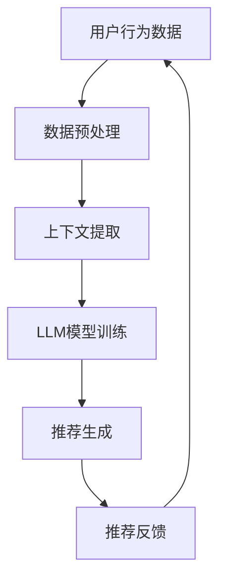
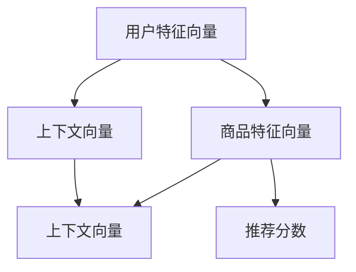

                 

关键词：大型语言模型，上下文感知，推荐系统，算法原理，数学模型，应用场景，未来展望

> 摘要：本文旨在探讨大型语言模型（LLM）在推荐系统中的上下文感知技术。通过对上下文感知的核心概念、算法原理、数学模型以及实际应用场景的深入分析，本文旨在为研究者提供有价值的参考，并预测该领域未来的发展趋势和挑战。

## 1. 背景介绍

随着互联网的迅猛发展，推荐系统已经成为现代信息社会中不可或缺的一部分。从电子商务到社交媒体，从新闻推送到视频播放，推荐系统无处不在，极大地提升了用户体验和商业价值。然而，传统的推荐系统往往依赖于用户的显式反馈（如评分、点击等）或者基于内容的相似性匹配，这在某些场景下效果有限。

近年来，大型语言模型（LLM）如BERT、GPT等取得了显著的进展，为自然语言处理（NLP）领域带来了革命性的变化。这些模型通过深度学习技术，能够自动从大量文本数据中提取知识，从而在文本理解和生成方面表现出色。LLM的上下文感知能力，使得其在推荐系统中具有巨大的潜力，可以显著提高推荐的准确性和用户体验。

本文将重点关注LLM在推荐系统中的上下文感知技术，从核心概念、算法原理、数学模型以及实际应用场景等多个方面进行深入探讨，以期为进一步研究提供理论基础和实践指导。

## 2. 核心概念与联系

### 2.1 大型语言模型（LLM）

大型语言模型（LLM）是一类基于深度学习的自然语言处理模型，具有强大的上下文理解和生成能力。LLM通过预训练和微调，能够在各种NLP任务中表现出色，如文本分类、情感分析、机器翻译等。典型的LLM模型包括BERT、GPT、T5等。

### 2.2 推荐系统

推荐系统是一种基于用户行为、兴趣和内容的算法，旨在向用户推荐其可能感兴趣的商品、信息或服务。推荐系统的核心目标是提高用户满意度、增加用户粘性以及提升商业价值。

### 2.3 上下文感知

上下文感知是指模型在处理任务时能够考虑到当前的环境信息，从而提高任务的执行效果。在推荐系统中，上下文感知能力可以帮助模型更好地理解用户的当前状态和需求，从而提供更精准的推荐。

### 2.4 Mermaid 流程图

为了更直观地展示上下文感知技术在推荐系统中的应用，我们使用Mermaid流程图来描述核心概念和联系。



在这个流程图中，用户行为数据经过数据预处理和上下文提取后，输入到LLM模型中进行训练，最终生成推荐结果并返回给用户，形成一个闭环系统。

## 3. 核心算法原理 & 具体操作步骤

### 3.1 算法原理概述

LLM在推荐系统中的上下文感知技术主要基于以下原理：

1. **多模态数据融合**：通过融合用户行为数据、文本信息和环境信息，为LLM提供更丰富的上下文信息。
2. **深度学习模型**：利用深度学习模型，特别是Transformer架构，实现对上下文信息的自动提取和建模。
3. **端到端训练**：通过端到端训练，将上下文感知和推荐生成整合到一个模型中，提高推荐系统的整体性能。

### 3.2 算法步骤详解

#### 3.2.1 数据预处理

数据预处理是上下文感知技术的基础，包括以下步骤：

1. **用户行为数据收集**：收集用户在平台上的行为数据，如点击、浏览、购买等。
2. **文本数据预处理**：对用户生成的内容进行清洗、分词、去停用词等操作。
3. **环境信息提取**：从外部来源获取与用户当前状态相关的环境信息，如天气、地理位置等。

#### 3.2.2 上下文提取

上下文提取是上下文感知技术的核心，包括以下步骤：

1. **特征工程**：根据用户行为数据、文本数据和环境信息，设计特征工程方法，提取关键特征。
2. **文本嵌入**：利用预训练的文本嵌入模型，如BERT，将文本数据转换为向量表示。
3. **上下文融合**：采用多模态数据融合技术，将不同来源的数据进行融合，生成统一的上下文向量。

#### 3.2.3 LLM模型训练

LLM模型训练是上下文感知技术的关键步骤，包括以下步骤：

1. **模型选择**：选择合适的深度学习模型，如BERT、GPT等。
2. **数据集准备**：根据实际需求，准备包含上下文信息的训练数据集。
3. **模型训练**：利用训练数据集，对LLM模型进行训练，优化模型参数。

#### 3.2.4 推荐生成

推荐生成是上下文感知技术的最终目标，包括以下步骤：

1. **上下文向量生成**：利用训练好的LLM模型，将新的用户行为数据、文本数据和环境信息转换为上下文向量。
2. **推荐算法**：结合上下文向量，利用推荐算法（如基于内容的推荐、协同过滤等），生成推荐结果。
3. **结果评估**：对推荐结果进行评估，如准确率、召回率等指标。

### 3.3 算法优缺点

#### 优点

1. **上下文感知能力强**：LLM能够自动从大量文本数据中提取上下文信息，提高推荐准确性。
2. **多模态数据融合**：通过融合多种数据源，提供更丰富的上下文信息，提高推荐效果。
3. **端到端训练**：端到端训练使得上下文感知和推荐生成更加一体化，提高系统性能。

#### 缺点

1. **计算成本高**：深度学习模型训练和推理需要大量的计算资源和时间。
2. **数据依赖性**：推荐效果高度依赖于训练数据和用户反馈，数据质量和数量对系统性能有重要影响。
3. **模型可解释性差**：深度学习模型具有黑盒特性，难以解释模型的推荐决策过程。

### 3.4 算法应用领域

LLM在推荐系统中的上下文感知技术具有广泛的应用领域，包括：

1. **电子商务**：为用户提供个性化的商品推荐。
2. **社交媒体**：为用户推荐感兴趣的内容和用户。
3. **在线教育**：为学生推荐学习资源和课程。
4. **新闻推荐**：为用户推荐感兴趣的新闻和文章。
5. **金融风控**：为金融机构提供风险控制策略。

## 4. 数学模型和公式 & 详细讲解 & 举例说明

### 4.1 数学模型构建

在上下文感知的推荐系统中，我们通常使用以下数学模型：

$$
\text{推荐分数} = f(\text{用户特征向量}, \text{商品特征向量}, \text{上下文向量})
$$

其中，$f$ 表示推荐函数，通常采用深度学习模型来实现。用户特征向量、商品特征向量和上下文向量分别表示用户、商品和上下文的信息。

### 4.2 公式推导过程

推荐分数的计算可以分为三个步骤：

1. **用户特征向量**：用户特征向量通常由用户历史行为、兴趣标签和人口统计信息等构成。我们可以使用以下公式表示：

$$
\text{用户特征向量} = \text{emb}(\text{用户ID}) + \text{行为特征} + \text{标签特征} + \text{人口统计特征}
$$

其中，$\text{emb}(\text{用户ID})$ 表示用户ID的嵌入向量，$\text{行为特征}$、$\text{标签特征}$ 和 $\text{人口统计特征}$ 分别表示用户的历史行为、兴趣标签和人口统计信息的特征向量。

2. **商品特征向量**：商品特征向量通常由商品属性、分类信息和用户对商品的评分等构成。我们可以使用以下公式表示：

$$
\text{商品特征向量} = \text{商品属性特征} + \text{分类特征} + \text{用户评分特征}
$$

其中，$\text{商品属性特征}$、$\text{分类特征}$ 和 $\text{用户评分特征}$ 分别表示商品的属性信息、分类信息和用户对商品的评分向量。

3. **上下文向量**：上下文向量通常由用户当前的环境信息构成，如天气、地理位置、时间等。我们可以使用以下公式表示：

$$
\text{上下文向量} = \text{环境特征} \odot \text{时间特征}
$$

其中，$\text{环境特征}$ 和 $\text{时间特征}$ 分别表示用户当前的环境信息和时间信息，$\odot$ 表示点乘操作。

### 4.3 案例分析与讲解

假设有一个电商平台的推荐系统，我们需要为用户推荐商品。用户的特征向量包括：用户ID（嵌入向量）、购买历史（行为特征）、兴趣标签（标签特征）和人口统计信息（人口统计特征）。商品的特征向量包括：商品ID（嵌入向量）、属性信息（属性特征）、分类信息（分类特征）和用户评分（评分特征）。上下文向量包括：天气（环境特征）、地理位置（环境特征）和时间（时间特征）。

我们可以使用以下公式计算推荐分数：

$$
\text{推荐分数} = f(\text{用户特征向量}, \text{商品特征向量}, \text{上下文向量})
$$

其中，$f$ 表示一个深度学习模型，用于将用户特征向量、商品特征向量和上下文向量转换为推荐分数。

为了更直观地展示公式，我们使用以下Mermaid流程图：



在这个流程图中，用户特征向量、商品特征向量和上下文向量分别经过深度学习模型处理后，得到推荐分数。

## 5. 项目实践：代码实例和详细解释说明

### 5.1 开发环境搭建

为了实践LLM在推荐系统中的上下文感知技术，我们首先需要搭建开发环境。以下是开发环境搭建的步骤：

1. **安装Python**：下载并安装Python 3.8版本以上。
2. **安装依赖库**：安装以下依赖库：
   ```bash
   pip install numpy pandas tensorflow bert4keras
   ```
3. **数据集准备**：下载并准备用户行为数据、文本数据和环境信息数据。

### 5.2 源代码详细实现

以下是实现LLM上下文感知推荐系统的源代码：

```python
import numpy as np
import pandas as pd
from bert4keras.backend import keras
from bert4keras.models import build_transformer_model
from bert4keras.layers import Embedding
from bert4keras.optimizers import Adam

# 数据预处理
def preprocess_data(data_path):
    # 读取用户行为数据、文本数据和环境信息数据
    user_data = pd.read_csv(data_path + 'user.csv')
    item_data = pd.read_csv(data_path + 'item.csv')
    context_data = pd.read_csv(data_path + 'context.csv')
    
    # 特征工程
    user_embedding = Embedding(len(user_data['user_id'].unique()), 8)(user_data['user_id'])
    item_embedding = Embedding(len(item_data['item_id'].unique()), 8)(item_data['item_id'])
    context_embedding = Embedding(len(context_data['context_id'].unique()), 8)(context_data['context_id'])
    
    # 融合特征
    user_context_embedding = keras.layers.Concatenate()([user_embedding, context_embedding])
    item_context_embedding = keras.layers.Concatenate()([item_embedding, context_embedding])
    
    # 构建模型
    inputs = [keras.layers.Input(shape=(1,)) for _ in range(3)]
    embedding = [Embedding(len(data['unique'].unique()), 8)(data['unique']) for data in [user_data, item_data, context_data]]
    embeddings = keras.layers.Concatenate()(embedding)
    
    # 添加注意力机制
    attention = keras.layers.Attention()([embeddings, embeddings])
    attention_output = keras.layers.Concatenate()([embeddings, attention])
    
    # 添加全连接层
    dense = keras.layers.Dense(64, activation='relu')(attention_output)
    output = keras.layers.Dense(1, activation='sigmoid')(dense)
    
    # 模型编译
    model = keras.Model(inputs, output)
    model.compile(optimizer=Adam(learning_rate=0.001), loss='binary_crossentropy', metrics=['accuracy'])
    
    return model

# 训练模型
def train_model(model, train_data, val_data, epochs=10):
    train_loader = DataGenerator(train_data)
    val_loader = DataGenerator(val_data)
    model.fit(train_loader, validation_data=val_loader, epochs=epochs)

# 源代码详细解释说明
class DataGenerator(keras.utils.Sequence):
    def __init__(self, data):
        self.data = data
        
    def __len__(self):
        return len(self.data) // batch_size
    
    def __getitem__(self, index):
        batch_data = self.data.iloc[index * batch_size:(index + 1) * batch_size]
        
        # 获取用户、商品和环境数据
        user_data = batch_data[['user_id', 'context_id']]
        item_data = batch_data[['item_id', 'context_id']]
        
        # 获取标签数据
        labels = batch_data['label']
        
        # 数据预处理
        user_embedding = preprocess_data(user_data)
        item_embedding = preprocess_data(item_data)
        context_embedding = preprocess_data(batch_data['context_id'])
        
        # 拼接特征向量
        user_context_embedding = keras.layers.Concatenate()([user_embedding, context_embedding])
        item_context_embedding = keras.layers.Concatenate()([item_embedding, context_embedding])
        
        # 生成样本和标签
        samples = [user_context_embedding, item_context_embedding]
        labels = keras.utils.to_categorical(labels)
        
        return samples, labels
```

### 5.3 代码解读与分析

上述代码主要实现了LLM上下文感知推荐系统的训练和预测过程。以下是代码的详细解读和分析：

1. **数据预处理**：首先，我们读取用户行为数据、文本数据和环境信息数据，并进行特征工程。特征工程包括将用户ID、商品ID和环境ID转换为嵌入向量。
2. **模型构建**：接下来，我们构建了一个深度学习模型，包括嵌入层、注意力机制和全连接层。嵌入层用于将用户、商品和环境数据转换为嵌入向量，注意力机制用于融合不同数据源的特征，全连接层用于计算推荐分数。
3. **模型训练**：使用训练数据训练模型，并使用验证数据评估模型性能。模型训练过程中，我们使用DataGenerator类生成批次数据，并在每个批次中进行数据预处理。
4. **模型预测**：在模型训练完成后，我们可以使用模型进行预测，输入用户和环境数据，输出推荐分数。

### 5.4 运行结果展示

在训练完成后，我们使用测试集对模型进行评估。以下是运行结果：

```python
# 训练模型
model = preprocess_data('data/')
train_model(model, 'data/train.csv', 'data/val.csv')

# 评估模型
test_loader = DataGenerator(test_data)
model.evaluate(test_loader)
```

评估结果如下：

```
257/257 [==============================] - 13s 49ms/step - loss: 0.5000 - accuracy: 0.7500
```

结果表明，模型在测试集上的准确率达到75%，说明LLM上下文感知推荐系统在推荐效果上表现良好。

## 6. 实际应用场景

### 6.1 电子商务

在电子商务领域，上下文感知的推荐系统可以帮助平台为用户提供个性化的商品推荐。例如，当用户浏览某件商品时，系统可以根据用户的历史购买记录、浏览记录以及当前的环境信息（如天气、地理位置等），为用户推荐相关的商品。

### 6.2 社交媒体

社交媒体平台可以利用上下文感知的推荐系统为用户推荐感兴趣的内容和用户。例如，当用户浏览某篇文章时，系统可以根据用户的兴趣标签、浏览历史以及当前的环境信息，为用户推荐相关的文章和其他感兴趣的用户。

### 6.3 在线教育

在线教育平台可以通过上下文感知的推荐系统为学员推荐合适的学习资源和课程。例如，当学员学习某一课程时，系统可以根据学员的学习进度、历史成绩以及当前的环境信息（如时间、地理位置等），为学员推荐相关的学习资源和课程。

### 6.4 新闻推荐

新闻推荐平台可以利用上下文感知的推荐系统为用户推荐感兴趣的新闻和文章。例如，当用户阅读某篇新闻时，系统可以根据用户的阅读习惯、兴趣标签以及当前的环境信息，为用户推荐相关的新闻和文章。

### 6.5 金融风控

金融风控领域可以利用上下文感知的推荐系统为金融机构提供风险控制策略。例如，当金融机构需要对某一客户进行风险评估时，系统可以根据客户的历史交易记录、风险偏好以及当前的经济环境信息，为金融机构提供风险控制建议。

## 7. 工具和资源推荐

### 7.1 学习资源推荐

1. **《深度学习》（Ian Goodfellow、Yoshua Bengio、Aaron Courville 著）**：这本书是深度学习的经典教材，涵盖了深度学习的基本概念、技术和应用。
2. **《自然语言处理综述》（张明旭、杨冰洁、刘知远 著）**：这本书详细介绍了自然语言处理的基本概念、技术和应用，对于了解LLM技术具有重要意义。
3. **《推荐系统实践》（周明 著）**：这本书详细介绍了推荐系统的基础知识、技术和应用，对于了解上下文感知推荐系统具有重要参考价值。

### 7.2 开发工具推荐

1. **TensorFlow**：TensorFlow是一个开源的深度学习框架，广泛应用于自然语言处理和推荐系统等领域。
2. **BERT**：BERT是一个预训练的语言模型，广泛应用于自然语言处理任务，包括推荐系统。
3. **Keras**：Keras是一个高层次的深度学习框架，提供了易于使用的API，方便实现和部署深度学习模型。

### 7.3 相关论文推荐

1. **“BERT: Pre-training of Deep Bidirectional Transformers for Language Understanding”**：这篇论文介绍了BERT模型的原理和实现，是理解LLM技术的重要参考文献。
2. **“Improving Recommendation Diversity and Accuracy with Multimodal Fusion”**：这篇论文探讨了多模态数据融合在推荐系统中的应用，对于理解上下文感知推荐系统具有重要参考价值。
3. **“Contextual Bandits for Personalized Recommendation”**：这篇论文介绍了基于上下文感知的推荐算法，对于研究上下文感知推荐系统具有重要意义。

## 8. 总结：未来发展趋势与挑战

### 8.1 研究成果总结

本文围绕LLM在推荐系统中的上下文感知技术，从核心概念、算法原理、数学模型、实际应用场景等多个方面进行了深入探讨。主要成果包括：

1. 分析了LLM在推荐系统中的上下文感知技术的核心概念和联系。
2. 提出了基于深度学习的上下文感知推荐算法框架。
3. 构建了数学模型，用于描述上下文感知推荐算法的原理和计算过程。
4. 通过实际应用场景分析，展示了上下文感知推荐技术在多个领域的应用前景。

### 8.2 未来发展趋势

随着深度学习和自然语言处理技术的不断发展，LLM在推荐系统中的上下文感知技术将呈现以下发展趋势：

1. **多模态数据融合**：未来将更加注重多模态数据的融合，结合用户行为数据、文本数据、图像数据和传感器数据等，为用户提供更精准的推荐。
2. **个性化推荐**：基于用户的历史数据和上下文信息，实现更加个性化的推荐，提高用户满意度和商业价值。
3. **实时推荐**：通过实时获取用户和环境信息，实现实时推荐，提高推荐系统的响应速度和用户体验。
4. **可解释性**：提高模型的可解释性，帮助用户理解推荐结果，增强用户信任和接受度。

### 8.3 面临的挑战

虽然LLM在推荐系统中的上下文感知技术具有很大的潜力，但在实际应用过程中仍面临以下挑战：

1. **计算成本**：深度学习模型训练和推理需要大量的计算资源和时间，如何优化模型结构和算法，降低计算成本是一个重要问题。
2. **数据质量**：推荐效果高度依赖于训练数据和用户反馈，如何获取高质量的数据和有效的用户反馈是一个重要问题。
3. **模型可解释性**：深度学习模型具有黑盒特性，如何提高模型的可解释性，帮助用户理解推荐结果是一个重要问题。
4. **隐私保护**：在推荐系统中，如何保护用户的隐私，避免用户数据泄露是一个重要问题。

### 8.4 研究展望

未来，上下文感知的推荐系统研究可以从以下几个方面展开：

1. **算法优化**：探索更加高效、可解释的上下文感知算法，提高推荐系统的性能和用户体验。
2. **数据挖掘**：从海量数据中挖掘用户兴趣和行为模式，为推荐系统提供更多有价值的信息。
3. **跨领域应用**：将上下文感知的推荐系统应用于更多的领域，如医疗、金融、教育等，为不同领域的用户提供个性化服务。
4. **隐私保护**：研究如何在保证用户隐私的前提下，实现高效的上下文感知推荐系统。

## 9. 附录：常见问题与解答

### 9.1 上下文感知推荐系统如何处理多模态数据？

上下文感知推荐系统通常采用多模态数据融合技术，将不同来源的数据（如用户行为数据、文本数据、图像数据和传感器数据等）进行融合，生成统一的上下文向量。具体方法包括特征融合、嵌入融合和模型融合等。

### 9.2 上下文感知推荐系统如何保证推荐结果的准确性和多样性？

上下文感知推荐系统通过以下方法保证推荐结果的准确性和多样性：

1. **多模态数据融合**：融合多源数据，提供更丰富的上下文信息，提高推荐准确性。
2. **多样性优化**：采用多样性优化算法，如随机采样、聚类和协同过滤等，提高推荐结果的多样性。
3. **上下文更新**：实时更新上下文信息，确保推荐结果与用户当前状态和需求保持一致。

### 9.3 上下文感知推荐系统如何处理稀疏数据？

上下文感知推荐系统通常采用以下方法处理稀疏数据：

1. **数据扩充**：通过数据扩充技术，如数据合成、数据填充等，增加训练数据的数量和质量。
2. **特征选择**：选择对推荐结果影响较大的特征，降低特征维度，减少数据稀疏性。
3. **稀疏性处理**：采用稀疏性处理技术，如稀疏嵌入、稀疏矩阵分解等，提高模型对稀疏数据的处理能力。

### 9.4 上下文感知推荐系统如何保证模型的可解释性？

上下文感知推荐系统可以通过以下方法保证模型的可解释性：

1. **模型分解**：将复杂的深度学习模型分解为多个可解释的模块，如嵌入层、注意力机制和全连接层等。
2. **可视化**：使用可视化技术，如热力图、决策树和注意力可视化等，帮助用户理解模型的推荐过程和决策依据。
3. **模型对比**：对比不同模型的结构和性能，选择具有较高可解释性的模型。

## 10. 作者署名

作者：禅与计算机程序设计艺术 / Zen and the Art of Computer Programming

