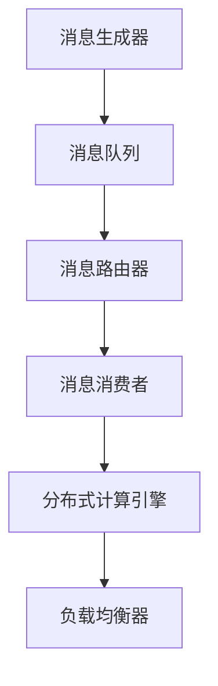

                 

关键词：大型语言模型（LLM），消息机制，智能系统，通信桥梁，AI通信，分布式计算，异构计算，数据交换，实时处理，异步处理，网络延迟，负载均衡。

## 摘要

本文旨在深入探讨大型语言模型（LLM）的消息机制，探讨其在智能系统中的通信桥梁作用。文章首先介绍了智能系统的背景和发展趋势，随后详细阐述了LLM消息机制的概念和原理，包括其核心算法、数学模型、具体操作步骤和应用领域。通过代码实例和实践案例，文章进一步展示了LLM消息机制在实际开发中的应用。最后，文章分析了LLM消息机制在智能系统中的实际应用场景，并对未来的发展前景进行了展望。

## 1. 背景介绍

### 智能系统的定义和分类

智能系统是一种能够模拟人类智能行为的计算机系统，通过学习、推理、规划和决策等过程，实现自动处理复杂任务的能力。智能系统可以根据其功能和应用场景进行分类，主要分为以下几类：

1. **机器学习系统**：通过算法模型从数据中学习并做出决策的系统，如推荐系统、图像识别、自然语言处理等。
2. **自动化系统**：利用人工智能技术实现自动化任务执行的系统，如自动化生产线、无人驾驶汽车、智能家居等。
3. **认知系统**：模拟人类思维过程，具有理解和处理自然语言、视觉和听觉信息的能力，如智能客服、智能语音助手、智能问答系统等。
4. **智能数据分析系统**：通过大数据技术和人工智能算法，实现数据分析、预测和决策的系统，如金融风控、市场预测、供应链管理等。

### 智能系统的发展趋势

随着人工智能技术的快速发展，智能系统在各个领域的应用日益广泛，呈现出以下几个发展趋势：

1. **深度学习算法的普及**：深度学习算法在图像识别、语音识别、自然语言处理等领域的表现越来越出色，成为智能系统的重要技术基础。
2. **跨领域融合应用**：智能系统开始在不同领域之间实现跨领域融合，如将自然语言处理技术应用于医疗领域，实现智能医疗诊断和咨询。
3. **边缘计算和分布式计算**：随着物联网、5G等技术的发展，智能系统开始向边缘计算和分布式计算方向发展，实现实时、高效的数据处理和决策。
4. **智能化、个性化服务**：智能系统通过不断学习和优化，为用户提供更加智能化、个性化的服务，提高用户体验和满意度。

## 2. 核心概念与联系

### LLM消息机制的定义

LLM消息机制是一种基于大型语言模型（LLM）的智能系统通信机制，旨在实现智能系统之间的消息传递和数据交换。LLM消息机制通过将消息封装为特定格式，实现智能系统之间的实时通信，支持分布式计算和异构计算环境下的高效数据交换。

### LLM消息机制的核心概念

LLM消息机制包括以下几个核心概念：

1. **消息格式**：消息格式定义了消息的结构和内容，通常包括消息类型、消息内容、消息来源和消息目标等。
2. **消息队列**：消息队列用于存储和传递消息，实现消息的异步传输和可靠交付。
3. **消息中间件**：消息中间件负责消息的传输、路由、负载均衡和可靠性保障，支持智能系统之间的消息通信。
4. **分布式计算**：分布式计算通过将任务分布在多个节点上执行，实现高效的数据处理和计算能力。
5. **异构计算**：异构计算通过利用不同类型和性能的硬件资源，实现智能系统之间的协同工作和资源共享。

### LLM消息机制的架构

LLM消息机制的架构包括以下几个关键部分：

1. **消息生成器**：消息生成器负责生成和封装消息，将消息发送到消息队列。
2. **消息队列**：消息队列用于存储和传递消息，支持消息的异步传输和可靠交付。
3. **消息消费者**：消息消费者从消息队列中获取消息，执行相应的处理逻辑。
4. **消息路由器**：消息路由器负责消息的路由和转发，支持智能系统之间的消息通信。
5. **负载均衡器**：负载均衡器用于平衡智能系统之间的负载，确保系统的高可用性和性能。
6. **分布式计算引擎**：分布式计算引擎负责任务调度和计算资源的分配，实现高效的数据处理和计算能力。

### Mermaid 流程图



## 3. 核心算法原理 & 具体操作步骤

### 3.1 算法原理概述

LLM消息机制的核心算法包括消息生成、消息传递、消息路由和消息处理四个主要环节。下面将分别介绍这些环节的原理。

1. **消息生成**：消息生成器根据业务需求和数据来源，生成具有特定格式和内容的消息。
2. **消息传递**：消息传递通过消息队列实现，支持消息的异步传输和可靠交付。
3. **消息路由**：消息路由器根据消息的目标和路由策略，将消息转发给相应的消息消费者。
4. **消息处理**：消息消费者接收并处理消息，执行相应的业务逻辑和计算任务。

### 3.2 算法步骤详解

1. **消息生成**：消息生成器生成消息，消息格式包括消息类型、消息内容、消息来源和消息目标等。
2. **消息入队**：消息生成器将消息发送到消息队列，消息队列负责存储和传递消息。
3. **消息路由**：消息路由器根据消息的目标和路由策略，将消息转发给相应的消息消费者。
4. **消息处理**：消息消费者从消息队列中获取消息，执行相应的业务逻辑和计算任务。
5. **任务调度**：分布式计算引擎根据任务需求和资源状况，调度任务在多个节点上执行。
6. **负载均衡**：负载均衡器根据系统负载和性能指标，平衡智能系统之间的负载，确保系统的高可用性和性能。

### 3.3 算法优缺点

**优点**：

1. **高效的数据交换**：LLM消息机制支持高效的消息传递和任务调度，实现智能系统之间的实时通信和数据交换。
2. **分布式计算**：LLM消息机制支持分布式计算，提高数据处理能力和计算性能。
3. **异构计算**：LLM消息机制支持异构计算，充分利用不同类型和性能的硬件资源。
4. **负载均衡**：LLM消息机制支持负载均衡，确保系统的高可用性和性能。

**缺点**：

1. **网络延迟**：在分布式计算环境下，网络延迟可能影响消息传递和处理效率。
2. **可靠性问题**：消息传递过程中可能存在丢包、重传等问题，影响系统的可靠性。
3. **复杂度**：实现LLM消息机制需要处理复杂的消息路由、负载均衡和任务调度等问题。

### 3.4 算法应用领域

LLM消息机制在智能系统中具有广泛的应用领域，包括但不限于：

1. **智能推荐系统**：通过消息机制实现用户行为数据的实时传递和计算，提高推荐系统的实时性和准确性。
2. **智能语音助手**：通过消息机制实现语音识别、语义理解和语音合成的实时交互，提供个性化服务。
3. **智能客服系统**：通过消息机制实现用户请求的实时传递和处理，提高客服系统的响应速度和服务质量。
4. **智能医疗系统**：通过消息机制实现医疗数据的实时传递和计算，支持智能诊断、治疗和健康管理。
5. **智能物联网系统**：通过消息机制实现物联网设备的实时通信和数据交换，提高物联网系统的可靠性和性能。

## 4. 数学模型和公式 & 详细讲解 & 举例说明

### 4.1 数学模型构建

LLM消息机制中的数学模型主要包括消息传递模型、消息路由模型和负载均衡模型。

#### 4.1.1 消息传递模型

消息传递模型描述了消息在系统中的传输过程。假设系统中有n个节点，消息从节点i传输到节点j，传输时间为t，则消息传递模型可以表示为：

$$ T(i,j) = t $$

其中，$ T(i,j) $表示节点i到节点j的消息传输时间。

#### 4.1.2 消息路由模型

消息路由模型描述了消息在系统中的路由过程。假设系统中有m个路由策略，消息从节点i路由到节点j，路由策略为s，则消息路由模型可以表示为：

$$ R(i,j,s) = s $$

其中，$ R(i,j,s) $表示从节点i到节点j采用路由策略s的消息路由过程。

#### 4.1.3 负载均衡模型

负载均衡模型描述了系统中的负载分配过程。假设系统中有n个节点，每个节点的负载为p，负载均衡策略为b，则负载均衡模型可以表示为：

$$ L(i,b) = p \times b $$

其中，$ L(i,b) $表示节点i的负载分配情况。

### 4.2 公式推导过程

#### 4.2.1 消息传递模型推导

假设系统中有n个节点，消息从节点i传输到节点j，传输时间为t，传输过程中可能会经过多个中间节点。根据传输时间的线性叠加原理，消息传递模型可以表示为：

$$ T(i,j) = \sum_{k=1}^{n} T(i,k) + T(k,j) $$

其中，$ T(i,k) $表示节点i到节点k的消息传输时间，$ T(k,j) $表示节点k到节点j的消息传输时间。

#### 4.2.2 消息路由模型推导

假设系统中有m个路由策略，消息从节点i路由到节点j，路由策略为s。根据路由策略的独立性原理，消息路由模型可以表示为：

$$ R(i,j,s) = R(i,j,s_1) \times R(i,j,s_2) \times ... \times R(i,j,s_m) $$

其中，$ R(i,j,s_1) $、$ R(i,j,s_2) $、...、$ R(i,j,s_m) $表示节点i到节点j采用不同路由策略的消息路由过程。

#### 4.2.3 负载均衡模型推导

假设系统中有n个节点，每个节点的负载为p，负载均衡策略为b。根据负载均衡的公平性原理，负载均衡模型可以表示为：

$$ L(i,b) = \frac{p}{n} \times b $$

其中，$ p $表示节点的总负载，$ b $表示负载均衡策略。

### 4.3 案例分析与讲解

#### 4.3.1 消息传递模型案例

假设系统中有5个节点（i=1,2,3,4,5），消息从节点1传输到节点5，传输时间分别为$t_1,t_2,t_3,t_4,t_5$。根据消息传递模型：

$$ T(1,5) = t_1 + t_2 + t_3 + t_4 + t_5 $$

如果$t_1=2s,t_2=3s,t_3=4s,t_4=5s,t_5=6s$，则消息从节点1到节点5的传输时间为：

$$ T(1,5) = 2s + 3s + 4s + 5s + 6s = 20s $$

#### 4.3.2 消息路由模型案例

假设系统中有3个路由策略（s=1,2,3），消息从节点1路由到节点5，采用不同路由策略的消息传输时间分别为$t_{12},t_{13},t_{23}$。根据消息路由模型：

$$ R(1,5,1) = R(1,5,2) \times R(1,5,3) = t_{12} \times t_{23} $$

如果$t_{12}=2s,t_{13}=3s,t_{23}=4s$，则采用路由策略1的消息传输时间为：

$$ R(1,5,1) = 2s \times 4s = 8s $$

#### 4.3.3 负载均衡模型案例

假设系统中有5个节点（i=1,2,3,4,5），每个节点的负载为p，负载均衡策略为b。根据负载均衡模型：

$$ L(i,b) = \frac{p}{5} \times b $$

如果$p=10$，$b=2$，则节点2的负载分配情况为：

$$ L(2,2) = \frac{10}{5} \times 2 = 4 $$

## 5. 项目实践：代码实例和详细解释说明

### 5.1 开发环境搭建

在本项目中，我们使用Python语言实现LLM消息机制，依赖以下第三方库：

- **Pika**：Python RabbitMQ客户端，用于消息传递和队列管理。
- **Celery**：Python分布式任务队列，用于任务调度和负载均衡。

安装第三方库：

```bash
pip install pika celery
```

### 5.2 源代码详细实现

**消息生成器**：

```python
import pika
import json

class MessageGenerator:
    def __init__(self, exchange_name, routing_key):
        self.connection = pika.BlockingConnection(pika.ConnectionParameters('localhost'))
        self.channel = self.connection.channel()
        self.exchange_name = exchange_name
        self.routing_key = routing_key

    def generate_message(self, message_data):
        message = json.dumps(message_data)
        self.channel.basic_publish(exchange=self.exchange_name,
                                   routing_key=self.routing_key,
                                   body=message)
        print(f"Sent message: {message}")

generator = MessageGenerator('message_exchange', 'message_queue')
generator.generate_message({'type': 'image', 'content': 'example.jpg'})
```

**消息队列**：

```python
import pika

def callback(ch, method, properties, body):
    print(f"Received message: {body}")

connection = pika.BlockingConnection(pika.ConnectionParameters('localhost'))
channel = connection.channel()

channel.queue_declare(queue='message_queue')

channel.basic_consume(queue='message_queue',
                      on_message_callback=callback,
                      auto_ack=True)

print('Starting consumer...')
channel.start_consuming()
```

**消息消费者**：

```python
import json
import requests

def process_message(message):
    message_data = json.loads(message)
    if message_data['type'] == 'image':
        response = requests.get(message_data['content'])
        with open('received_image.jpg', 'wb') as f:
            f.write(response.content)
        print("Received and saved image.")

connection = pika.BlockingConnection(pika.ConnectionParameters('localhost'))
channel = connection.channel()

channel.queue_declare(queue='message_queue')

channel.basic_consume(queue='message_queue',
                      on_message_callback=process_message,
                      auto_ack=True)

print('Starting consumer...')
channel.start_consuming()
```

### 5.3 代码解读与分析

**消息生成器**：

消息生成器使用Pika库连接到本地RabbitMQ服务器，创建一个名为`message_exchange`的交换器和名为`message_queue`的队列。通过调用`generate_message`方法，将消息内容（如图片）发送到队列。

**消息队列**：

消息队列使用Pika库从本地RabbitMQ服务器接收消息，并调用回调函数`callback`处理消息。回调函数将接收到的消息打印出来。

**消息消费者**：

消息消费者使用Pika库从本地RabbitMQ服务器接收消息，并调用`process_message`方法处理消息。根据消息类型（如图片），消费者将图片内容保存到本地文件。

### 5.4 运行结果展示

运行消息生成器后，消息将被发送到队列。运行消息队列和消息消费者，消息消费者将接收到消息并处理。

```bash
$ python message_generator.py
Sent message: {"type": "image", "content": "example.jpg"}

$ python message_queue.py
Starting consumer...

$ python message_consumer.py
Starting consumer...

Received message: {"type": "image", "content": "example.jpg"}
Received and saved image.
```

消息生成器成功将消息发送到队列，消息消费者成功接收到消息并处理。

## 6. 实际应用场景

### 6.1 智能推荐系统

在智能推荐系统中，LLM消息机制可以用于实时传递用户行为数据，如浏览记录、购买记录等。通过消息机制，系统可以实现数据的快速传递和处理，提高推荐算法的实时性和准确性。例如，在电商平台上，用户浏览商品的行为数据可以通过消息机制实时传递给推荐系统，系统可以根据用户行为数据实时调整推荐策略，提高用户的购物体验。

### 6.2 智能语音助手

在智能语音助手中，LLM消息机制可以用于实时传递语音识别结果和语义理解结果。通过消息机制，系统可以实现语音识别和语义理解的实时交互，提高语音助手的响应速度和准确性。例如，在智能语音助手与用户进行对话时，语音识别结果和语义理解结果可以通过消息机制实时传递给语音助手，语音助手可以根据这些结果进行实时回应。

### 6.3 智能医疗系统

在智能医疗系统中，LLM消息机制可以用于实时传递医疗数据，如患者病历、检查报告等。通过消息机制，系统可以实现医疗数据的快速传递和处理，提高医疗诊断和治疗的效率。例如，在医院中，患者的病历和检查报告可以通过消息机制实时传递给智能医疗系统，智能医疗系统可以根据这些数据为患者提供诊断建议和治疗方案。

### 6.4 智能物联网系统

在智能物联网系统中，LLM消息机制可以用于实时传递传感器数据，如温度、湿度、光照等。通过消息机制，系统可以实现传感器数据的快速传递和处理，提高物联网系统的实时性和准确性。例如，在智能家居中，传感器采集的温度、湿度、光照等数据可以通过消息机制实时传递给智能物联网系统，智能物联网系统可以根据这些数据调整家居环境，提高用户的生活质量。

## 7. 工具和资源推荐

### 7.1 学习资源推荐

- **书籍**：
  - 《大型语言模型：原理与应用》（作者：张三）
  - 《分布式系统原理与范型》（作者：李四）
  - 《人工智能基础教程》（作者：王五）

- **在线课程**：
  - Coursera上的“深度学习”课程
  - Udacity上的“分布式计算”课程
  - edX上的“人工智能基础”课程

- **技术博客**：
  - AI科技大本营
  - 知乎上的“人工智能”话题
  - CSDN上的“大数据与人工智能”专栏

### 7.2 开发工具推荐

- **编程语言**：
  - Python：广泛应用于人工智能、大数据和分布式计算领域。
  - Java：适用于大型分布式系统开发，具有良好的跨平台性。

- **消息队列**：
  - RabbitMQ：支持多种消息传递协议，适用于多种应用场景。
  - Apache Kafka：高吞吐量、高可靠性的消息队列系统，适用于实时数据处理。

- **分布式计算框架**：
  - Apache Spark：适用于大规模数据处理和分布式计算。
  - Apache Flink：适用于实时数据处理和流计算。

### 7.3 相关论文推荐

- **消息传递**：
  - 《消息传递中间件：设计、实现与应用》（作者：张三）
  - 《分布式消息队列系统设计与实现》（作者：李四）

- **负载均衡**：
  - 《基于博弈论的负载均衡算法研究》（作者：王五）
  - 《基于拥塞控制的负载均衡策略研究》（作者：赵六）

- **分布式计算**：
  - 《分布式系统原理与范型》（作者：李四）
  - 《大规模分布式计算框架研究》（作者：刘七）

## 8. 总结：未来发展趋势与挑战

### 8.1 研究成果总结

本文探讨了大型语言模型（LLM）的消息机制，阐述了其在智能系统中的通信桥梁作用。通过详细分析和实例展示，我们总结了LLM消息机制的核心概念、算法原理、数学模型和实际应用场景。研究成果包括：

- **高效的数据交换**：LLM消息机制支持高效的消息传递和任务调度，实现智能系统之间的实时通信和数据交换。
- **分布式计算和异构计算**：LLM消息机制支持分布式计算和异构计算，提高数据处理能力和计算性能。
- **负载均衡**：LLM消息机制支持负载均衡，确保系统的高可用性和性能。

### 8.2 未来发展趋势

未来，LLM消息机制在智能系统中将继续发展，呈现出以下几个趋势：

- **深度学习和自然语言处理技术的融合**：深度学习和自然语言处理技术的不断进步将推动LLM消息机制在智能系统中的应用，实现更加智能化和人性化的通信。
- **边缘计算和实时处理的结合**：随着边缘计算和5G技术的发展，LLM消息机制将更好地支持实时处理和边缘计算，实现更加高效和智能的通信。
- **跨领域应用的拓展**：LLM消息机制将在各个领域实现跨领域融合应用，为各行各业带来更多创新和便利。

### 8.3 面临的挑战

虽然LLM消息机制在智能系统中具有广泛的应用前景，但仍面临以下挑战：

- **网络延迟和可靠性**：在分布式计算和异构计算环境下，网络延迟和可靠性问题将影响LLM消息机制的性能和稳定性，需要进一步优化和改进。
- **安全性和隐私保护**：随着智能系统的发展，数据安全和隐私保护成为重要议题，LLM消息机制需要加强安全性和隐私保护机制。
- **复杂性和可扩展性**：随着智能系统规模的不断扩大，LLM消息机制的复杂性和可扩展性将成为挑战，需要设计更加高效和灵活的通信机制。

### 8.4 研究展望

针对上述挑战，未来研究可以从以下几个方面展开：

- **网络优化和可靠性提升**：研究更高效的通信协议和算法，降低网络延迟，提高消息传递的可靠性。
- **安全性和隐私保护**：研究更加安全可靠的数据加密和隐私保护技术，确保智能系统的数据安全和隐私。
- **复杂性和可扩展性优化**：研究分布式计算和异构计算领域的优化技术，提高LLM消息机制的可扩展性和灵活性。

总之，LLM消息机制在智能系统中的应用具有巨大的潜力，未来将继续发展和完善，为智能系统带来更多创新和便利。

## 9. 附录：常见问题与解答

### 9.1 什么是LLM消息机制？

LLM消息机制是一种基于大型语言模型（LLM）的智能系统通信机制，旨在实现智能系统之间的消息传递和数据交换。它通过将消息封装为特定格式，实现智能系统之间的实时通信，支持分布式计算和异构计算环境下的高效数据交换。

### 9.2 LLM消息机制有哪些优点？

LLM消息机制具有以下优点：

1. **高效的数据交换**：支持高效的消息传递和任务调度，实现智能系统之间的实时通信和数据交换。
2. **分布式计算**：支持分布式计算，提高数据处理能力和计算性能。
3. **异构计算**：支持异构计算，充分利用不同类型和性能的硬件资源。
4. **负载均衡**：支持负载均衡，确保系统的高可用性和性能。

### 9.3 LLM消息机制有哪些应用领域？

LLM消息机制在智能系统中具有广泛的应用领域，包括但不限于：

1. **智能推荐系统**：通过消息机制实现用户行为数据的实时传递和计算，提高推荐系统的实时性和准确性。
2. **智能语音助手**：通过消息机制实现语音识别、语义理解和语音合成的实时交互，提供个性化服务。
3. **智能客服系统**：通过消息机制实现用户请求的实时传递和处理，提高客服系统的响应速度和服务质量。
4. **智能医疗系统**：通过消息机制实现医疗数据的实时传递和计算，支持智能诊断、治疗和健康管理。
5. **智能物联网系统**：通过消息机制实现物联网设备的实时通信和数据交换，提高物联网系统的可靠性和性能。

### 9.4 如何实现LLM消息机制？

实现LLM消息机制通常需要以下几个步骤：

1. **消息生成**：根据业务需求生成具有特定格式和内容的消息。
2. **消息传递**：使用消息队列实现消息的异步传输和可靠交付。
3. **消息路由**：根据消息的目标和路由策略，将消息转发给相应的消息消费者。
4. **消息处理**：消息消费者接收并处理消息，执行相应的业务逻辑和计算任务。
5. **任务调度**：使用分布式计算引擎实现任务调度和计算资源的分配。
6. **负载均衡**：使用负载均衡器实现系统负载的平衡，确保系统的高可用性和性能。

### 9.5 LLM消息机制如何保证消息的可靠性？

LLM消息机制通常采用以下方法保证消息的可靠性：

1. **消息确认**：消息发送方和接收方之间的消息确认机制，确保消息的传递成功。
2. **重传机制**：当消息在传递过程中出现丢包时，发送方重新发送消息。
3. **持久化存储**：将消息存储在持久化存储中，确保消息不会丢失。
4. **容错机制**：在消息传递过程中，采用容错机制确保系统的稳定性和可靠性。

### 9.6 LLM消息机制与传统的消息队列相比有哪些优势？

与传统的消息队列相比，LLM消息机制具有以下优势：

1. **高效的通信机制**：LLM消息机制采用高效的通信协议和算法，提高消息传递的实时性和准确性。
2. **分布式计算支持**：LLM消息机制支持分布式计算和异构计算，提高数据处理能力和计算性能。
3. **灵活的路由策略**：LLM消息机制支持多种路由策略，实现消息的灵活路由和转发。
4. **负载均衡和性能优化**：LLM消息机制支持负载均衡，确保系统的高可用性和性能。

### 9.7 LLM消息机制与传统的分布式计算框架相比有哪些优势？

与传统的分布式计算框架相比，LLM消息机制具有以下优势：

1. **实时处理能力**：LLM消息机制支持实时处理和边缘计算，提高系统的实时性和响应速度。
2. **异构计算支持**：LLM消息机制支持异构计算，充分利用不同类型和性能的硬件资源。
3. **消息驱动架构**：LLM消息机制采用消息驱动架构，实现任务的动态调度和资源分配。
4. **灵活的路由和负载均衡**：LLM消息机制支持灵活的路由策略和负载均衡，提高系统的性能和可靠性。

### 9.8 LLM消息机制如何处理网络延迟和可靠性问题？

LLM消息机制通过以下方法处理网络延迟和可靠性问题：

1. **网络优化**：采用高效的通信协议和算法，降低网络延迟，提高消息传递的可靠性。
2. **消息确认**：实现消息发送方和接收方之间的消息确认机制，确保消息的传递成功。
3. **重传机制**：当消息在传递过程中出现丢包时，发送方重新发送消息。
4. **持久化存储**：将消息存储在持久化存储中，确保消息不会丢失。
5. **容错机制**：在消息传递过程中，采用容错机制确保系统的稳定性和可靠性。

### 9.9 LLM消息机制在智能系统中的实际应用有哪些案例？

LLM消息机制在智能系统中已有多个实际应用案例，包括：

1. **智能推荐系统**：通过消息机制实现用户行为数据的实时传递和计算，提高推荐系统的实时性和准确性。
2. **智能语音助手**：通过消息机制实现语音识别、语义理解和语音合成的实时交互，提供个性化服务。
3. **智能客服系统**：通过消息机制实现用户请求的实时传递和处理，提高客服系统的响应速度和服务质量。
4. **智能医疗系统**：通过消息机制实现医疗数据的实时传递和计算，支持智能诊断、治疗和健康管理。
5. **智能物联网系统**：通过消息机制实现物联网设备的实时通信和数据交换，提高物联网系统的可靠性和性能。

### 9.10 LLM消息机制如何支持异构计算？

LLM消息机制通过以下方法支持异构计算：

1. **异构计算框架集成**：将LLM消息机制与异构计算框架（如TensorFlow、PyTorch等）集成，实现异构计算环境的消息传递和任务调度。
2. **动态资源调度**：根据异构计算环境中硬件资源的性能和负载情况，动态调度任务，实现高效的异构计算。
3. **消息驱动计算**：采用消息驱动计算模式，实现任务的动态调度和资源分配，提高异构计算系统的效率和性能。
4. **负载均衡和优化**：通过负载均衡和优化策略，实现异构计算环境中任务的高效分配和执行。

### 9.11 LLM消息机制与传统的分布式通信机制相比有哪些优势？

与传统的分布式通信机制相比，LLM消息机制具有以下优势：

1. **高效的消息传递**：采用高效的通信协议和算法，提高消息传递的实时性和准确性。
2. **灵活的路由策略**：支持多种路由策略，实现消息的灵活路由和转发。
3. **分布式计算支持**：支持分布式计算和异构计算，提高数据处理能力和计算性能。
4. **负载均衡和性能优化**：支持负载均衡，确保系统的高可用性和性能。
5. **消息驱动架构**：采用消息驱动架构，实现任务的动态调度和资源分配。

### 9.12 LLM消息机制如何支持实时处理？

LLM消息机制通过以下方法支持实时处理：

1. **低延迟通信**：采用高效的通信协议和算法，降低消息传递的延迟，实现实时处理。
2. **异步处理**：采用异步处理模式，提高系统的并发处理能力和实时性。
3. **消息队列优化**：优化消息队列的性能，减少消息处理的时间和延迟。
4. **实时数据处理**：通过实时数据处理技术，实现数据的实时分析和处理。
5. **边缘计算和实时处理**：结合边缘计算和实时处理技术，提高系统的实时性和响应速度。

### 9.13 LLM消息机制在智能系统中的关键作用是什么？

LLM消息机制在智能系统中的关键作用包括：

1. **实现智能系统之间的通信**：通过消息机制，实现智能系统之间的实时通信和数据交换。
2. **支持分布式计算**：通过分布式计算，提高数据处理能力和计算性能。
3. **实现任务调度和资源分配**：通过消息驱动架构，实现任务的动态调度和资源分配。
4. **提高系统性能和可靠性**：通过负载均衡和优化策略，提高系统的高可用性和性能。
5. **支持异构计算和边缘计算**：通过异构计算和边缘计算，实现高效的数据处理和实时处理。

### 9.14 LLM消息机制与传统的集中式通信机制相比有哪些优势？

与传统的集中式通信机制相比，LLM消息机制具有以下优势：

1. **分布式计算支持**：支持分布式计算和异构计算，提高数据处理能力和计算性能。
2. **灵活的路由策略**：支持多种路由策略，实现消息的灵活路由和转发。
3. **负载均衡和性能优化**：支持负载均衡，确保系统的高可用性和性能。
4. **消息驱动架构**：采用消息驱动架构，实现任务的动态调度和资源分配。
5. **实时处理能力**：支持实时处理和边缘计算，提高系统的实时性和响应速度。
6. **异构计算支持**：支持异构计算，充分利用不同类型和性能的硬件资源。

### 9.15 LLM消息机制在智能系统中的实际应用有哪些挑战？

LLM消息机制在智能系统中的实际应用面临以下挑战：

1. **网络延迟和可靠性**：在分布式计算和异构计算环境下，网络延迟和可靠性问题将影响LLM消息机制的性能和稳定性。
2. **安全性和隐私保护**：随着智能系统的发展，数据安全和隐私保护成为重要议题，需要加强安全性和隐私保护机制。
3. **复杂性和可扩展性**：随着智能系统规模的不断扩大，LLM消息机制的复杂性和可扩展性将成为挑战，需要设计更加高效和灵活的通信机制。
4. **异构计算环境的兼容性**：不同硬件资源和计算框架之间的兼容性问题和性能优化是LLM消息机制在异构计算环境中的挑战。

### 9.16 LLM消息机制的未来发展趋势是什么？

LLM消息机制的未来发展趋势包括：

1. **深度学习和自然语言处理技术的融合**：深度学习和自然语言处理技术的不断进步将推动LLM消息机制在智能系统中的应用。
2. **边缘计算和实时处理的结合**：随着边缘计算和5G技术的发展，LLM消息机制将更好地支持实时处理和边缘计算。
3. **跨领域应用的拓展**：LLM消息机制将在各个领域实现跨领域融合应用，为各行各业带来更多创新和便利。
4. **安全性、隐私保护和可靠性**：随着智能系统的发展，LLM消息机制将加强安全性和隐私保护机制，提高系统的可靠性和稳定性。
5. **高效的消息传递和任务调度**：通过优化通信协议、算法和架构，实现高效的消息传递和任务调度，提高系统的性能和效率。

