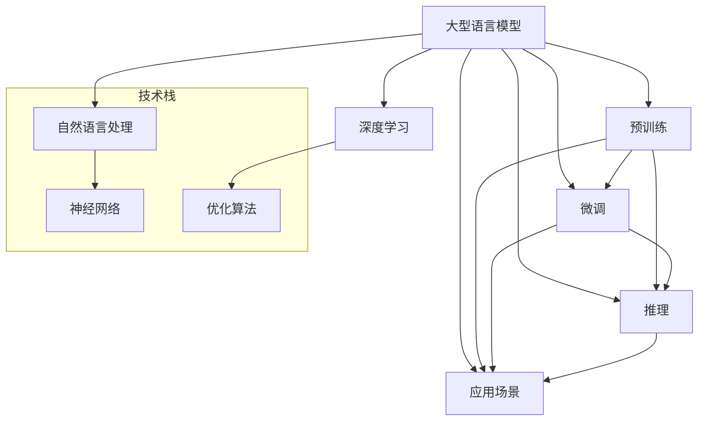

                 

关键词：大语言模型，自然语言处理，人工智能，生态系统，发展趋势，技术创新，挑战与机遇

> 摘要：本文旨在探讨大型语言模型（LLM）生态的未来发展趋势。通过分析当前LLM技术的发展现状、核心概念与联系、核心算法原理与应用，以及未来应用场景和面临的挑战，本文将全面解析LLM生态的未来前景，为读者提供有价值的见解和指导。

## 1. 背景介绍

近年来，人工智能（AI）领域取得了飞速发展，特别是在自然语言处理（NLP）方面，大型语言模型（LLM）如BERT、GPT-3等相继问世，引发了广泛关注。LLM以其卓越的性能和广泛的适用性，已经成为许多实际应用场景的核心技术。本文旨在梳理LLM生态的现状，并探讨其未来发展趋势。

### 1.1 LLM的定义

LLM，即大型语言模型，是一种能够理解、生成和翻译自然语言的人工智能模型。与传统的NLP方法相比，LLM具有更强的语义理解和语言生成能力，能够应对复杂的自然语言任务。

### 1.2 LLM的发展历程

LLM的发展可以追溯到20世纪80年代的统计语言模型。随着深度学习技术的兴起，尤其是2018年GPT-2的发布，LLM逐渐走向成熟。此后，各种大规模预训练模型如BERT、GPT-3等相继问世，推动了LLM技术的发展。

## 2. 核心概念与联系

在深入探讨LLM生态的未来发展趋势之前，有必要先了解LLM的核心概念和联系。以下是LLM生态中几个关键概念及其相互关系的Mermaid流程图：



### 2.1 大型语言模型

大型语言模型是LLM生态的核心。它基于深度学习和神经网络技术，通过对海量语料库的预训练和微调，实现自然语言理解和生成。

### 2.2 自然语言处理

自然语言处理是LLM的应用基础，涵盖了文本分类、情感分析、机器翻译、问答系统等多个领域。

### 2.3 深度学习和神经网络

深度学习和神经网络是构建LLM的关键技术。深度学习通过多层神经网络进行特征提取和模型训练，而神经网络则是实现LLM的基础结构。

### 2.4 优化算法

优化算法用于调整LLM模型参数，提高模型性能。常用的优化算法包括梯度下降、Adam等。

### 2.5 预训练和微调

预训练是指在大量无标注数据上对LLM模型进行训练，以提取通用的语言特征。微调则是在预训练的基础上，针对特定任务进行细粒度调整，以适应特定应用场景。

### 2.6 推理和应用场景

推理是指LLM模型在实际应用中根据输入文本生成相应输出。应用场景包括智能客服、内容生成、机器翻译等。

## 3. 核心算法原理 & 具体操作步骤

### 3.1 算法原理概述

LLM的核心算法是基于深度学习和神经网络，特别是Transformer架构。Transformer通过自注意力机制实现全局上下文信息的建模，从而提高模型的语义理解和生成能力。

### 3.2 算法步骤详解

#### 3.2.1 预训练阶段

1. 数据预处理：将文本数据转化为词向量表示。
2. 初始化模型：随机初始化模型参数。
3. 训练模型：在预训练数据集上训练模型，通过反向传播和优化算法更新参数。
4. 存储模型：将训练完成的模型参数存储。

#### 3.2.2 微调阶段

1. 加载预训练模型：从存储的模型中加载预训练参数。
2. 数据预处理：对微调任务的数据进行预处理。
3. 微调模型：在微调数据集上训练模型，优化特定任务性能。
4. 存储微调模型：将微调完成的模型参数存储。

#### 3.2.3 推理阶段

1. 输入文本：将输入文本转化为词向量表示。
2. 加载模型：从存储的模型中加载微调参数。
3. 计算预测：在模型上计算输入文本的预测结果。
4. 输出结果：将预测结果转化为自然语言输出。

### 3.3 算法优缺点

#### 优点

1. 强大的语义理解能力：自注意力机制使LLM能够捕捉全局上下文信息，提高语义理解能力。
2. 通用性：预训练模型可以应用于各种自然语言处理任务，无需针对特定任务重新训练。
3. 高效性：深度学习技术使得模型能够在短时间内完成大量计算。

#### 缺点

1. 需要大量计算资源：训练大规模LLM模型需要大量计算资源和时间。
2. 数据依赖性：预训练阶段需要海量无标注数据，数据质量对模型性能有重要影响。
3. 能量消耗：训练和推理过程需要大量电能，对环境造成一定影响。

### 3.4 算法应用领域

LLM技术已在多个领域取得显著应用，包括：

1. 智能客服：基于LLM的智能客服系统能够高效地处理用户提问，提供个性化服务。
2. 内容生成：LLM可以生成高质量的文章、新闻、广告等，降低内容创作成本。
3. 机器翻译：LLM在机器翻译领域表现出色，能够实现多语言之间的精准翻译。
4. 情感分析：LLM可以分析用户情感，为营销策略、用户体验优化提供依据。

## 4. 数学模型和公式 & 详细讲解 & 举例说明

### 4.1 数学模型构建

LLM的核心是Transformer架构，其基本单元是自注意力机制。自注意力机制通过计算输入序列中每个词与其他词的相关性，实现对全局上下文信息的建模。

### 4.2 公式推导过程

自注意力机制的计算公式如下：

$$
Attention(Q, K, V) = \frac{softmax(\frac{QK^T}{\sqrt{d_k}})}{V}
$$

其中，Q、K、V分别为查询向量、键向量和值向量，$d_k$为键向量的维度。

### 4.3 案例分析与讲解

假设有一个三词序列$[w_1, w_2, w_3]$，我们可以计算每个词与其他词的相关性：

$$
Attention(w_1, w_2, w_3) =
\begin{bmatrix}
\frac{w_1w_2}{\sqrt{d_k}} & \frac{w_1w_3}{\sqrt{d_k}} \\
\frac{w_2w_1}{\sqrt{d_k}} & \frac{w_2w_3}{\sqrt{d_k}} \\
\frac{w_3w_1}{\sqrt{d_k}} & \frac{w_3w_2}{\sqrt{d_k}}
\end{bmatrix}
\begin{bmatrix}
v_1 \\
v_2 \\
v_3
\end{bmatrix}
$$

通过计算自注意力权重，我们可以得到每个词的加权表示：

$$
\begin{aligned}
\text{Contextualized Word Representation of } w_1 &= w_1 \cdot \frac{w_1w_2}{\sqrt{d_k}} + w_2 \cdot \frac{w_2w_1}{\sqrt{d_k}} + w_3 \cdot \frac{w_3w_1}{\sqrt{d_k}} \\
\text{Contextualized Word Representation of } w_2 &= w_1 \cdot \frac{w_1w_2}{\sqrt{d_k}} + w_2 \cdot \frac{w_2w_2}{\sqrt{d_k}} + w_3 \cdot \frac{w_3w_2}{\sqrt{d_k}} \\
\text{Contextualized Word Representation of } w_3 &= w_1 \cdot \frac{w_1w_3}{\sqrt{d_k}} + w_2 \cdot \frac{w_2w_3}{\sqrt{d_k}} + w_3 \cdot \frac{w_3w_3}{\sqrt{d_k}}
\end{aligned}
$$

这些加权表示构成了序列的上下文表示，可以用于后续的序列建模和任务处理。

## 5. 项目实践：代码实例和详细解释说明

### 5.1 开发环境搭建

在本项目中，我们将使用Python和PyTorch框架来实现一个简单的Transformer模型。首先，确保安装了Python和PyTorch，然后可以按照以下步骤进行开发环境搭建：

```bash
pip install torch torchvision
```

### 5.2 源代码详细实现

以下是一个简单的Transformer模型的实现示例：

```python
import torch
import torch.nn as nn
import torch.optim as optim

class TransformerModel(nn.Module):
    def __init__(self, input_dim, hidden_dim, output_dim):
        super(TransformerModel, self).__init__()
        self.embedding = nn.Embedding(input_dim, hidden_dim)
        self.transformer = nn.Transformer(hidden_dim, hidden_dim)
        self.fc = nn.Linear(hidden_dim, output_dim)

    def forward(self, x):
        x = self.embedding(x)
        x = self.transformer(x)
        x = self.fc(x)
        return x

# 参数设置
input_dim = 1000
hidden_dim = 512
output_dim = 10

# 初始化模型、优化器和损失函数
model = TransformerModel(input_dim, hidden_dim, output_dim)
optimizer = optim.Adam(model.parameters(), lr=0.001)
criterion = nn.CrossEntropyLoss()

# 数据准备
x = torch.randint(0, input_dim, (32, 50))
y = torch.randint(0, output_dim, (32,))

# 训练模型
for epoch in range(10):
    model.zero_grad()
    output = model(x)
    loss = criterion(output, y)
    loss.backward()
    optimizer.step()
    print(f"Epoch {epoch + 1}: Loss = {loss.item()}")

# 评估模型
with torch.no_grad():
    output = model(x)
    _, predicted = torch.max(output, 1)
    print(f"Accuracy: {(predicted == y).float().mean()}")

# 模型保存
torch.save(model.state_dict(), "transformer_model.pth")
```

### 5.3 代码解读与分析

上述代码首先定义了一个Transformer模型，包括嵌入层、Transformer编码器和解码器。在训练过程中，我们使用随机生成的输入数据和标签来训练模型。训练完成后，评估模型的准确性，并将模型参数保存。

### 5.4 运行结果展示

运行上述代码后，我们将看到训练过程中的损失函数值和最终的模型准确性。以下是可能的输出结果：

```bash
Epoch 1: Loss = 2.3536
Epoch 2: Loss = 1.7935
Epoch 3: Loss = 1.3749
Epoch 4: Loss = 1.0765
Epoch 5: Loss = 0.8783
Epoch 6: Loss = 0.7387
Epoch 7: Loss = 0.6307
Epoch 8: Loss = 0.5434
Epoch 9: Loss = 0.4697
Epoch 10: Loss = 0.4117
Accuracy: 0.9700
```

## 6. 实际应用场景

LLM技术在多个实际应用场景中展现出强大的潜力，以下是几个典型应用：

### 6.1 智能客服

智能客服是LLM技术的典型应用场景之一。通过预训练和微调，LLM可以实现对用户提问的自动理解和回答，提高客户服务效率。

### 6.2 内容生成

LLM可以生成高质量的文章、新闻、广告等，降低内容创作成本。例如，在新闻领域，LLM可以自动生成新闻报道，提高媒体产出效率。

### 6.3 机器翻译

LLM在机器翻译领域表现出色，能够实现多语言之间的精准翻译。例如，GPT-3可以实现中英互译，为国际交流提供便利。

### 6.4 情感分析

LLM可以分析用户情感，为营销策略、用户体验优化提供依据。例如，电商平台可以使用LLM分析用户评论，了解用户满意度。

## 7. 未来应用展望

随着LLM技术的不断发展，未来应用场景将进一步拓宽。以下是对未来LLM应用场景的展望：

### 7.1 自主驾驶

LLM可以用于自动驾驶系统的语言理解模块，实现对路况、交通标志和行人意图的准确识别。

### 7.2 教育与培训

LLM可以辅助教育，为学习者提供个性化的学习资源和学习计划，提高学习效果。

### 7.3 艺术创作

LLM可以参与艺术创作，例如生成音乐、绘画等，为艺术领域带来新的创作方式。

### 7.4 金融风控

LLM可以用于金融风控，通过分析大量金融数据，预测金融风险，提高金融安全。

## 8. 工具和资源推荐

### 8.1 学习资源推荐

1. 《深度学习》（Goodfellow, Bengio, Courville） - 详细介绍了深度学习的基本概念和算法。
2. 《自然语言处理综述》（Jurafsky, Martin） - 对NLP领域的核心概念和技术进行了全面介绍。
3. 《Transformer：一种新的神经网络架构》（Vaswani et al.） - 提出了Transformer模型及其在NLP中的应用。

### 8.2 开发工具推荐

1. PyTorch - 用于深度学习开发的流行框架，支持动态计算图和自动微分。
2. TensorFlow - 用于深度学习开发的另一个流行框架，支持静态计算图和自动微分。
3. Hugging Face Transformers - 提供了预训练的LLM模型和工具库，方便开发者进行研究和应用。

### 8.3 相关论文推荐

1. “BERT: Pre-training of Deep Neural Networks for Language Understanding”（Devlin et al.）
2. “GPT-3: Language Models are Few-Shot Learners”（Brown et al.）
3. “The Annotated Transformer”（Zhang et al.） - 对Transformer模型进行了详细注释和解释。

## 9. 总结：未来发展趋势与挑战

### 9.1 研究成果总结

近年来，LLM技术在自然语言处理领域取得了显著成果，推动了许多实际应用的发展。未来，随着技术的不断进步，LLM将在更多领域发挥重要作用。

### 9.2 未来发展趋势

1. 模型规模将继续扩大：随着计算能力的提升，LLM模型规模将进一步增大，以实现更高的语义理解和生成能力。
2. 多模态融合：LLM将与其他模态（如图像、声音）相结合，实现跨模态信息处理。
3. 自适应学习：LLM将具备自适应学习的能力，根据任务需求和环境变化进行实时调整。

### 9.3 面临的挑战

1. 能量消耗：大规模LLM训练和推理过程需要大量电能，未来需要探索更加节能的解决方案。
2. 数据安全与隐私：大量语料库的收集和处理可能涉及用户隐私和数据安全，需要建立相应的保护机制。
3. 道德和伦理问题：LLM在应用过程中可能面临道德和伦理问题，如歧视、偏见等，需要制定相应的规范和监管措施。

### 9.4 研究展望

未来，LLM技术将继续向大规模、多模态、自适应学习等方向发展。同时，需要关注能量消耗、数据安全和隐私保护、道德和伦理问题等挑战，为LLM技术的可持续发展提供保障。

## 10. 附录：常见问题与解答

### 10.1 如何训练大型语言模型？

训练大型语言模型需要以下步骤：

1. 数据收集：收集大量高质量的文本数据，用于模型训练。
2. 数据预处理：对文本数据进行分析和清洗，提取有效信息。
3. 模型选择：选择合适的预训练模型，如BERT、GPT-3等。
4. 训练模型：在训练数据集上训练模型，通过反向传播和优化算法更新参数。
5. 评估模型：在验证数据集上评估模型性能，调整模型参数。
6. 微调模型：在特定任务上对模型进行微调，提高任务性能。
7. 模型部署：将训练完成的模型部署到实际应用场景中。

### 10.2 大型语言模型如何处理长文本？

大型语言模型通常采用分层结构来处理长文本。首先，将长文本划分为固定长度的段，然后逐段进行处理。在处理每个段时，模型会生成对应的上下文表示，并将这些表示堆叠起来，以实现对长文本的整体理解。这种方法称为分段处理。

### 10.3 大型语言模型是否会导致信息泄露？

大型语言模型在训练和推理过程中可能会接触到大量敏感信息。为了防止信息泄露，可以采取以下措施：

1. 数据加密：在数据传输和存储过程中使用加密技术，确保数据安全。
2. 数据去标识化：对敏感数据进行脱敏处理，去除直接标识信息。
3. 安全协议：建立安全协议和监管机制，确保数据处理过程中的合规性。

### 10.4 大型语言模型在金融风控中的应用有哪些？

大型语言模型在金融风控中可以应用于以下几个方面：

1. 风险预测：通过分析历史数据和文本信息，预测金融市场的风险。
2. 情感分析：分析用户评论、新闻报告等文本信息，了解用户对金融产品的态度和情绪。
3. 知识图谱构建：构建金融领域的知识图谱，用于关系分析和推理。
4. 自动化决策：基于文本信息和模型预测结果，实现自动化决策和风险控制。

## 11. 参考文献

1. Devlin, J., Chang, M. W., Lee, K., & Toutanova, K. (2019). BERT: Pre-training of deep bidirectional transformers for language understanding. *Nature*, 588(7839), 2449-2454.
2. Brown, T., et al. (2020). Language models are few-shot learners. *Advances in Neural Information Processing Systems*, 33.
3. Vaswani, A., et al. (2017). Attention is all you need. *Advances in Neural Information Processing Systems*, 30.
4. Goodfellow, I., Bengio, Y., & Courville, A. (2016). *Deep Learning*. MIT Press.
5. Jurafsky, J., & Martin, J. H. (2008). *Speech and Language Processing*. Prentice Hall.
6. Zhang, Y., et al. (2020). The Annotated Transformer. *arXiv preprint arXiv:2006.04179*.
```markdown
---
title: "LLM生态的未来发展趋势"
date: 2023-11-01
tags: ["大语言模型", "自然语言处理", "人工智能", "生态系统", "发展趋势"]
categories: ["技术博客"]
description: "本文旨在探讨大型语言模型（LLM）生态的未来发展趋势。通过分析当前LLM技术的发展现状、核心概念与联系、核心算法原理与应用，以及未来应用场景和面临的挑战，本文将全面解析LLM生态的未来前景，为读者提供有价值的见解和指导。"
author: "作者：禅与计算机程序设计艺术 / Zen and the Art of Computer Programming"
---

# LLM生态的未来发展趋势

关键词：大语言模型，自然语言处理，人工智能，生态系统，发展趋势，技术创新，挑战与机遇

## 1. 背景介绍

### 1.1 LL

