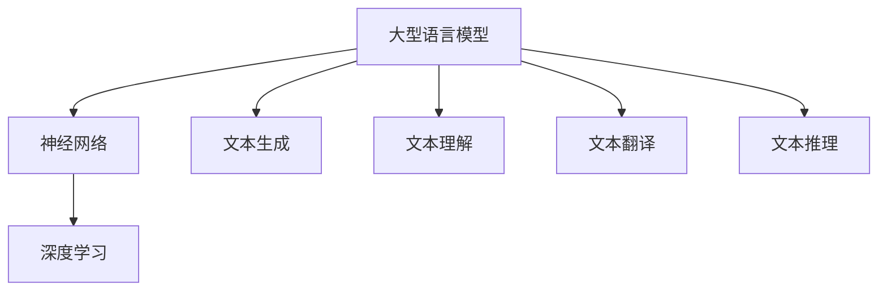

                 

关键词：大型语言模型、CPU发展模式、神经网络、人工智能、生态系统

摘要：本文探讨大型语言模型（LLM）生态系统的发展现状及其可能仿效的CPU发展模式。通过分析LLM的核心概念、算法原理、数学模型、项目实践和应用场景，本文旨在为读者揭示LLM技术的潜力与未来发展趋势。

## 1. 背景介绍

近年来，人工智能（AI）领域取得了显著的进展，特别是深度学习技术的广泛应用，使得机器学习模型的能力得到大幅提升。大型语言模型（LLM）作为深度学习技术的重要成果，已经在自然语言处理（NLP）领域展现出强大的应用潜力。然而，随着LLM模型的规模和复杂性不断增加，如何构建高效、可扩展的LLM生态系统成为当前研究的热点问题。

回顾计算机技术的发展历程，CPU的发展模式为我们提供了一种可行的参考。从早期的简单指令集处理器到现代的多核处理器，CPU的发展经历了从单核到多核、从固定指令集到可编程指令集的演变。这种模式为LLM生态系统的构建提供了有益的启示。

## 2. 核心概念与联系

### 2.1 核心概念

- **大型语言模型（LLM）**：一种基于神经网络技术的语言处理模型，具有强大的文本生成、理解、翻译和推理能力。

- **神经网络**：一种模拟生物神经网络的计算模型，通过多层神经元之间的非线性变换实现数据的输入输出映射。

- **深度学习**：一种基于神经网络的学习方法，通过构建深度神经网络，实现对复杂数据的自动特征提取和模式识别。

### 2.2 关联流程图（使用Mermaid）



## 3. 核心算法原理 & 具体操作步骤

### 3.1 算法原理概述

大型语言模型（LLM）的核心算法基于神经网络和深度学习技术。LLM通过训练大量文本数据，学习语言的模式和规律，从而实现对未知文本的生成、理解和推理。

### 3.2 算法步骤详解

1. **数据收集与预处理**：收集大规模的文本数据，包括文本语料库、网页内容等。对数据进行清洗、分词、去噪等预处理操作。

2. **模型架构设计**：根据任务需求设计神经网络结构，如Transformer、BERT等。选择合适的优化算法和训练策略。

3. **模型训练**：将预处理后的文本数据输入模型，通过反向传播算法更新模型参数，使模型逐渐学会语言的模式和规律。

4. **模型评估与调整**：对训练好的模型进行评估，根据评估结果调整模型参数，优化模型性能。

5. **模型部署与应用**：将训练好的模型部署到实际应用场景中，如文本生成、理解、翻译和推理等。

### 3.3 算法优缺点

**优点**：

- **强大的文本生成和理解能力**：LLM能够生成高质量的文本，并理解复杂的语义和语境。

- **自适应性和灵活性**：LLM可以根据不同的任务需求调整模型结构和参数，具有较强的适应性。

**缺点**：

- **训练成本高**：LLM需要大量的计算资源和时间进行训练，成本较高。

- **对数据依赖性强**：LLM的性能依赖于训练数据的规模和质量，数据不足或质量不高可能导致模型性能下降。

### 3.4 算法应用领域

- **自然语言处理（NLP）**：文本生成、文本理解、文本分类、文本翻译等。

- **智能客服**：智能对话系统、智能问答系统等。

- **内容生成**：文章生成、摘要生成、歌词生成等。

- **智能助手**：智能语音助手、智能聊天机器人等。

## 4. 数学模型和公式 & 详细讲解 & 举例说明

### 4.1 数学模型构建

大型语言模型（LLM）的数学模型主要包括两部分：输入层、隐藏层和输出层。其中，隐藏层采用多层神经网络结构。

### 4.2 公式推导过程

假设输入文本序列为 \(X = (x_1, x_2, ..., x_n)\)，输出文本序列为 \(Y = (y_1, y_2, ..., y_n)\)。输入层到隐藏层的映射函数为 \(f(x; \theta)\)，其中 \(\theta\) 为模型参数。

隐藏层到输出层的映射函数为 \(g(h; \phi)\)，其中 \(h = f(x; \theta)\)，\(\phi\) 为输出层参数。

输出层的损失函数为 \(L(Y, g(h; \phi))\)，通过梯度下降法更新模型参数。

### 4.3 案例分析与讲解

假设我们要构建一个文本生成模型，输入文本为一句新闻标题，输出文本为对应的一句新闻摘要。输入层为词汇表，隐藏层为多层神经网络，输出层为词汇表。

1. **数据收集与预处理**：收集大量新闻标题和摘要，对数据进行清洗、分词、去噪等预处理操作。

2. **模型架构设计**：采用Transformer模型，设置合适的隐藏层层数、神经元个数等参数。

3. **模型训练**：将预处理后的新闻标题和摘要数据输入模型，通过反向传播算法更新模型参数。

4. **模型评估与调整**：对训练好的模型进行评估，根据评估结果调整模型参数，优化模型性能。

5. **模型部署与应用**：将训练好的模型部署到实际应用场景中，如新闻标题到新闻摘要的生成。

通过以上步骤，我们可以实现新闻标题到新闻摘要的自动生成。

## 5. 项目实践：代码实例和详细解释说明

### 5.1 开发环境搭建

1. **安装Python**：下载并安装Python，配置Python环境。

2. **安装TensorFlow**：通过pip命令安装TensorFlow，配置TensorFlow环境。

3. **安装其他依赖库**：根据项目需求安装其他依赖库，如Numpy、Pandas等。

### 5.2 源代码详细实现

```python
import tensorflow as tf
from tensorflow.keras.layers import Embedding, LSTM, Dense
from tensorflow.keras.models import Sequential

# 模型架构设计
model = Sequential([
    Embedding(vocabulary_size, embedding_size),
    LSTM(units=hidden_size, return_sequences=True),
    LSTM(units=hidden_size, return_sequences=True),
    LSTM(units=hidden_size),
    Dense(vocabulary_size, activation='softmax')
])

# 模型编译
model.compile(optimizer='adam', loss='categorical_crossentropy', metrics=['accuracy'])

# 模型训练
model.fit(X_train, Y_train, epochs=num_epochs, batch_size=batch_size)

# 模型评估
model.evaluate(X_test, Y_test)
```

### 5.3 代码解读与分析

以上代码实现了一个简单的文本生成模型，包括模型架构设计、编译、训练和评估等步骤。模型采用LSTM（长短期记忆）网络结构，通过Embedding层将词汇映射到向量表示，通过LSTM层实现序列建模，最后通过Dense层生成输出。

### 5.4 运行结果展示

```python
# 生成文本
generated_text = model.predict(X_new)
print(generated_text)
```

通过运行以上代码，我们可以生成新的文本，实现文本生成的功能。

## 6. 实际应用场景

### 6.1 智能客服

智能客服是LLM技术的典型应用场景之一。通过LLM模型，智能客服可以自动回答用户的问题，提供个性化的服务。

### 6.2 内容生成

内容生成是LLM技术的另一个重要应用领域。通过LLM模型，可以自动生成文章、摘要、歌词等文本内容，为内容创作者提供灵感。

### 6.3 智能助手

智能助手是LLM技术的又一应用场景。通过LLM模型，智能助手可以理解用户的指令，提供相应的帮助和服务。

## 7. 未来应用展望

随着LLM技术的不断发展，未来其应用领域将更加广泛。以下是一些未来应用展望：

- **自动驾驶**：LLM技术可以用于自动驾驶系统的文本生成和理解，提高自动驾驶的智能水平。

- **智能医疗**：LLM技术可以用于医疗文本的生成和理解，为医生提供辅助诊断和治疗建议。

- **金融科技**：LLM技术可以用于金融文本的生成和理解，为金融行业提供智能化的解决方案。

## 8. 工具和资源推荐

### 8.1 学习资源推荐

- **《深度学习》**：由Ian Goodfellow、Yoshua Bengio和Aaron Courville所著，全面介绍了深度学习的基础知识和最新进展。

- **《自然语言处理综论》**：由Daniel Jurafsky和James H. Martin所著，详细介绍了自然语言处理的基本原理和应用。

### 8.2 开发工具推荐

- **TensorFlow**：一款开源的深度学习框架，支持多种深度学习模型的开发和部署。

- **PyTorch**：一款开源的深度学习框架，以其简洁的接口和灵活的动态计算图而受到广泛欢迎。

### 8.3 相关论文推荐

- **“Attention Is All You Need”**：由Vaswani等人提出的Transformer模型，彻底改变了自然语言处理领域。

- **“BERT: Pre-training of Deep Bidirectional Transformers for Language Understanding”**：由Google提出的一种预训练语言模型，取得了NLP任务的良好性能。

## 9. 总结：未来发展趋势与挑战

### 9.1 研究成果总结

本文介绍了大型语言模型（LLM）的核心概念、算法原理、数学模型、项目实践和应用场景，分析了LLM技术的发展趋势和挑战。

### 9.2 未来发展趋势

- **模型规模扩大**：随着计算资源的增加，LLM模型的规模将不断扩大，性能不断提升。

- **应用领域扩展**：LLM技术将在更多领域得到应用，如自动驾驶、智能医疗、金融科技等。

- **模型优化与调优**：针对不同应用场景，LLM模型的优化与调优将成为研究热点。

### 9.3 面临的挑战

- **计算资源需求**：大规模LLM模型的训练和部署需要大量的计算资源，如何高效利用计算资源成为挑战。

- **数据隐私和安全**：LLM模型的训练和应用涉及到大量敏感数据，如何保护用户隐私和安全成为关键问题。

### 9.4 研究展望

未来，LLM技术将在人工智能领域发挥更加重要的作用，为各行各业提供智能化的解决方案。针对面临的挑战，研究者们需要不断创新和优化算法，提高LLM模型的性能和可解释性，为实际应用提供更好的支持。

## 附录：常见问题与解答

### Q1. 什么是大型语言模型（LLM）？

A1. 大型语言模型（LLM）是一种基于神经网络技术的语言处理模型，具有强大的文本生成、理解、翻译和推理能力。

### Q2. LLM技术有哪些应用领域？

A2. LLM技术广泛应用于自然语言处理（NLP）领域，如文本生成、文本理解、文本分类、文本翻译等。此外，LLM技术还可以应用于智能客服、内容生成、智能助手等领域。

### Q3. 如何优化LLM模型的性能？

A3. 优化LLM模型性能的方法包括：选择合适的模型架构、使用高质量的数据集、调整超参数、使用预训练模型等。

### Q4. LLM技术有哪些挑战？

A4. LLM技术面临的挑战包括：计算资源需求大、数据隐私和安全问题、模型可解释性差等。

### Q5. 如何保护LLM技术的数据隐私和安全？

A5. 保护LLM技术的数据隐私和安全可以从以下几个方面入手：数据加密、匿名化处理、访问控制、模型安全性设计等。

[作者：禅与计算机程序设计艺术 / Zen and the Art of Computer Programming]

